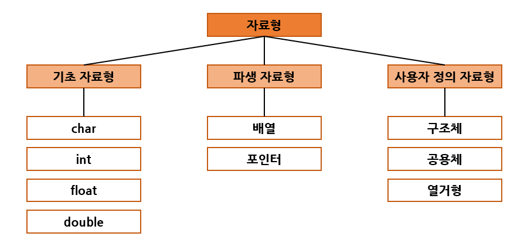
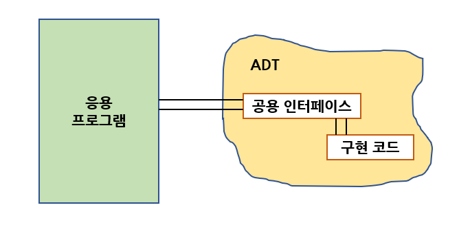

# 자료구조와 알고리즘

# 1. 자료구조와 알고리즘

## 자료구조란?

우리는 일상 생활에서 사물들을 정리하는 여러 가지 방법을 이용하고 있다.

- 버킷 리스트에는 우리가 평생에 이루고 싶은 목표를 차례대로 기록한다.
- 식당에서는 그릇들을 쌓아서 보관한다.
- 마트에서 계산을 할 때는 차례대로 줄을 선다.
- 영어사전에는 단어들과 단어들의 설명이 저장되어 있다.
- 컴퓨터는 계층적인 디렉터리를 이용하여 파일들을 저장한다.
- 지도에는 도시들과 도시들을 연결하는 도로가 표시되어 있다.

이와같이 사람들이 사물을 정리하여 저장하는 것과 마찬가지로 프로그램에서도 자료들을 정리하여 보관하는 여러 가지 구조들이 있다. 이를 **자료 구조(data structure)**라 부른다.

몇 가지의 예를 들어 본다면 식당에서 그릇을 쌓는 것처럼 자료들을 쌓아서 정리하는 구조를 컴퓨터에서는 "스택" 이라고 부른다. 스택에서는 맨 위에서만 자료를 추가하거나 제거할 수 있다.

마트 계산대의 줄에 해당하는 자료 구조를 "큐"라 부른다. 큐에서는 먼저 도착한 자료가 먼저 빠져나간다.
아래의 표는 일상생활과 컴퓨터에서 사용되는 자료구조를 비교한 것이다.

|     일상생활에서의 예     | 해당하는 자료구조 |
| :-----------------------: | :---------------: |
| 그릇을 쌓아서 보관하는 것 |       스택        |
|     마트 계산대의 줄      |        큐         |
|        버킷 리스트        |      리스트       |
|         영어사전          |       사전        |
|           지도            |      그래프       |
|  컴퓨터의 디렉토리 구조   |       트리        |

컴퓨터 프로그램은 흔히 "프로그램 = 자료구조 + 알고리즘" 이라고 한다.
프로그램에서 **자료(data)**를 처리하고 있고 이들 자료는 자료구조(datastructure)를 사용하여 저장된다.
또한 주어진 문제를 처리하는 절차가 필요하다. 이것은 **알고리즘(algorithm)**이라고 불린다.

예를 들어 시험 성적을 읽어 들여서 최고 성적을 구하는 프로그램에 대하여 생각하여 보자.
외부에서 성적이 입력되면 이 성적들을 처리하기 좋게끔 프로그램의 어딘가에 저장시켜야 한다.
우리가 가장 쉽게 사용할 수 있는 것은 아마도 배열일 것이다. 이 경우, 배열이 자료를 저장하는 구조, 즉 **자료구조**가 된다.

다음으로 필요한 것은 배열에 저장된 점수들 중에서 가장 큰 값을 찾는것이다.
여러 가지 방법으로 할 수 있겠지만 가장 간단하게 변수를 하나 만들고 배열의 첫 번째 요소 값을 변수에 저장한 다음, 이 변수와 배열의 요소들을 순차적으로 비교하여, 만약 배열의 요소가 더 크다면 배열 요소의 값을 변수에 저장한다. 이런 식으로 배열의 끝까지 진행하면 최고 성적을 찾을 수 있다.
이렇게 문제를 해결하는 절차를 **알고리즘**이라고 한다.

최고 성적을 구하는 프로그램을 C언어로 작성해 보면 아래의 코드와 같다.
여기서 배열 scores가 **자료구조**에 해당되고 변수 largest를 첫 번째 요소로 초기화하고 나머지 요소들과 순차적으로 비교하는 것이 **알고리즘**에 해당한다.

```c
#include<stdio.h>

#define MAX_ELEMENTS 100
int scores[MAX_ELEMENTS];

int get_max_scores(int n)
{
    int i, largest;
    largest = scores[0];
    for (i = 1; i<n; i++) {
        if (scores[i] > largest) {
            largest = scores[i];
        }
    }
    return largest;
}

int main()
{
    for (int i = 0; i < 100; i++) {
        scores[i] = i;
    }
    printf("%d",get_max_scores(100));
    return 0;
}   
```

자료구조와 알고리즘은 밀접한 관계가 있어 자료구조가 결정되면 그 자료구조에서 사용할 수 있는 알고리즘이 결정된다.

컴퓨터가 복잡한 자료들을 빠르게 저장, 검색, 분석, 전송, 갱신하기 위해서는 자료구조가 효율적으로 조직화되어 있어야 한다. 또한 각 응용에 가장 적합한 자료구조와 알고리즘을 선택하여야 한다.

## 알고리즘이란?

어떤 문제가 주어져 있고 이것을 컴퓨터로 해결하려고 한다고 가정하면,
첫 번째 해야 할 일은 문제를 해결할 수 있는 방법을 고안하는 것이다.

예를 들어 컴퓨터를 이용하여 전화번호부에서 특정한 사람의 이름을 찾는 문제를 생각해보자.
한 가지 방법은 전화번호부의 첫 페이지부터 시작해서 한 장씩 넘기면서 특정한 사람을 찾는 것이다.
이 방법은 엄청난 시간이 걸리므로 보통 이런 식으로 찾는 사람은 거의 없을 것이다.

또 하나의 방법은 전화번호부의 이름들이 정렬되어 있는것을 이용하는 방업이다.
즉 찾고자 하는 이름이 "박철수"라면, 전화번호부의 중간에 있는 이름과 "박철수"를 비교하고,
중간에 있는 이름보다 앞에 있다면 앞부분만 검색한다. 그렇지 않다면 뒷부분만 검색하면 된다.

이러한 과정을 박철수란 이름을 찾을 때까지 되풀이한다.
이 방법은 굉장히 효율적인 방법이고 일반적인 사람들이 사용하는 방법이다.

이러한 방법들은 보통 프로그래밍 스타일이나 프로그래밍 언어와는 무관하다.
즉 C언어를 사용하건, JAVA를 사용하건 사용되는 방법은 동일하다.

두 번째로 해야 할 일은 방법에 따라 컴퓨터가 수행하여야 할 단계적인 절차를 자세히 기술하는 것이다.

컴퓨터로 문제를 풀기 위한 단계적인 절차를 **알고리즘(algorithm)** 이라고 한다.
엄밀히 이야기한다면 문제와 컴퓨터가 주어진 상태에서 문제를 해결하는 방법을 정밀하게 장치가 이해할 수 있는 언어로 기술한 것이다.

따라서 알고리즘은 특정한 일을 수행하는 명령어들의 집합이다.
여기서 명령어란 컴퓨터에서 수행되는 문장들을 의미한다.

모든 명령어들의 집합이 알고리즘이 되는것은 아니고 알고리즘이 되기위한 조건들을 만족하는 집합만 알고리즘으로 정의된다.

- 입력 : 0개 이상의 입력이 존재하여야 한다.
- 출력 : 1개 이상의 출력이 존재하여야 한다.
- 명백성 : 각 명령어의 의미는 모호하지 않고 명확해야 한다.
- 유한성 : 한정된 수의 단계 후에는 반드시 종료되어야 한다.
- 유효성 : 각 명령어들은 종이와 연필, 또는 컴퓨터로 실행 가능한 연산이어야 한다.

따라서 알고리즘에는 입력은 없어도 되지만 출력은 반드시 하나이상 있어야 하고, 모호한 방법으로 기술된 명령어들의 집합은 알고리즘이라 할 수 없다.

또한 0으로 나누는 연산같은 실행할 수 없는 명령어를 사용하면 역시 알고리즘이 아니다.
무한히 반복되는 명령어들의 집합도 알고리즘이 아니다.

알고리즘을 기술하는 데는 다음과 같은 4가지 방법이 있다.

1. 한글이나 영어 같은 자연어
2. 흐름도 (flowchart)
3. 의사 코드 (pesudo-code)
4. 프로그래밍 언어

1의 방법은 자연어를 사용하기 때문에 모호성이 존재한다. 그러므로 단어들을 명백하게 정의해야만 한다.
2의 방법은 도형을 사용해서 알고리즘을 기술하는 방법으로, 초심자에게 좋은 방법이지만 알고리즘이 복잡해질수록 기술하기 힘들게 될 것이다.

따라서 가장 많이 쓰이는 방법은 3, 4와 같은 의사코드, 프로그래밍 언어를 사용하는 방법이다.
프로그래밍 언어의 예약어들은 모두 명백한 의미를 가지고 있어서 알고리즘을 기술하는데 안성맞춤이다.

의사 코드는 자연어보단더 체계적이고 프로그래밍 언어보다는 덜 엄격한 언어로 알고리즘을 기술하는 데만 사용되는 코드를 말한다.

# 2. 추상 자료형

**자료형(data type)**이란 용어 그대로 **"데이터의 종류"**로서 우리말로는 "자료형"이라 할 수 있다.

자료형에는 많은 종류가 있다. 정수, 실수, 문자열 등이 기초적인 자료형의 예이다.
이러한 자료형은 프로그래밍 언어가 기본적으로 제공한다.


C 언어에서 제공하는 자료형은 정수, 실수, 문자를 나태는 기초적인 자료형도 있고 다른 자료형을 묶을 수 있는 배열이나 구조체도 있다.

- 정수(ex. 0, 1, 2, ...)
- 실수(ex. 3.14)
- 문자('a', 'b', ...)
- 배열(동일한 자료형이 여러 개 모인 것)
- 구조체(다른 자료형이 여러 개 모인 것)



자료형을 작성할 때는 실행 가능한 연산에 대해서도 신경 써야 한다. 데이터의 종류가 결정되면 그 데이터와 관련된 연산도 달라진다. 예를 들자면, 나머지를 계산하는 연산자는 정수 데이터에서는 의미가 있지만 실수 데이터에서는 의미가 없어진다.

정수를 나타내는 int 자료형을 데이터와 연산으로 분리하여서 정의해보자.
int 자료형에서 데이터는 "컴퓨터에서 나타낼 수 있는 정수의 집합"이고, 연산은 "정수 간에 가능한 연산"을 의미할 것이다.


위 그림에서 INT_MIN은 컴퓨터가 나타낼 수 있는 가장 작은 정수를, INT_MAX는 컴퓨터가 나타낼 수 있는 가장 큰 수를 의미한다. 연산(operation)은 정수 간의 덧셈, 뺄셈, 곱셈, 나눗셈, 나머지 연산을 생각할 수 있다.
또 2개의 정수가 같은 값인지를 검사하는 == 연산자도 넣을 수 있으며 <, > 연산자도 추가할 수 있다.

따라서 자료형이라고 하면 데이터뿐만 아니라 데이터 간에 가능한 연산도 고려해야한다.
복잡한 자료형을 구현할 때는 연산이 연산자가 아니고 **함수(function)**로 작성된다.
예를 들어서 "스택"이라는 자료형에서 새로운 값을 추가하는 연산은 add()라는 함수로 정의된다.

**추상 자료형(ADT : abstract data type)**이란 추상적, 수학적으로 자료형을 정의한 것이다.
자료구조는 추상 자료형을 프로그래밍 언어로 구현한 것이라 할 수 있다.

소프트웨어 개발과 유지보수에 있어서 가장 중요한 이슈는 "어떻게 소프트웨어 시스템의 복잡성을 관리할 것인가"이다. 이러한 복잡성에 대처하기 위한 새로운 아이디어들이 등장하였고 이 아이디어를 구현한 프로그래밍 방법론과 언어들이 개발되었다. 이러한 방법론이나 언어들의 유력한 주제는 **추상화(abstraction)** 와 관련된 도구들의 개발이었다.

추상화란 어떤 시스템의 간략화된 기술 또는 명세로서 시스템의 정말 핵심적인 구조나 동작에만 집중하는 것이다. 좋은 추상화는 사용자에게 중요한 정보는 강조되는 반면 중요하지 않은 구현 세부 사항은 제거되는 것이다. 이를 위해 정보은닉기법(information hiding)이 개발되었고 추상 자료형(ADT)의 개념으로 발전되었다.



ADT는 실제적인 구현으로부터 분리되어 정의된 자료형을 말한다. 즉 자료형을 추상적(수학적)으로 정의함을 의미한다. ADT에서는 데이터나 연산이 무엇(what)인지는 정의되지만 어떻게(how) 컴퓨터 상에서 구현할 것인지는 정의되지 않는다.

예를 들어 연산을 정의할 때 연산의 이름, 매개 변수, 반환형은 정의하지만 연산을 구현하는 구체적인 코드는 주어지지 않는 것이 ADT이다. 다만 연산을 정의하는 추상적인 의사 코드는 주어질 수 있다.

예를 들어 자연수를 나타내는 추상 자료형을 정의해보면 아래와 같다. 자연수는 보통 컴퓨터 상에서 기본적으로 제공되지 않는 자료형이다.


ADT는 먼저 ADT의 이름부터 시작된다. ADT안에는 객체(objects)와 함수(functions)들이 정의된다. 객체는 주로 집합의 개념을 사용하여 정의된다. 이후에 함수들이 정의된다. 함수는 앞에서 언급한 연산을 의미한다.

여기에는 함수의 이름, 함수의 매개변수, 함수의 반환형, 함수가 수행하는 기능의 기술 등이 포함된다.
"::=" 기호는 "~으로 정의된다" 를 의미한다. INT_MAX는 컴퓨터가 표현할 수 있는 가장 큰 정수이다.

첫 번째 함수 zero()는 매개변수가 없으며 단순히 0을 반환한다.
successor(x) 함수는 다음 순서의 자연수를 반환한다. 하지만 만약 x가 INT_MAX이면 다음 자연수가 없으므로 INT_MAX를 반환한다.

add(x, y)는 x와 y를 받아서 덧셈을 계산한 후에 계산 결과를 반환한다. 만약 (x+y)값이 INT_MAX를 넘어가면 INT_MAX를 반환한다.

ADT가 구현될 때 보통 구현 세부사항은 외부에 알리지 않고 외부와의 인터페이스만을 공개하게 된다.
ADT의 사용자는 구현 세부사항이 아닌 인터페이스만 사용하기 때문에 추상 자료형의 구현 방법은 언제든지 안전하게 변경될 수 있다.

이것은 또한 인터페이스만 정확하게 지켜진다면 ADT가 여러 가지 방법으로 구현될 수 있음을 뜻한다.
이것이 정보은닉의 기본개념이다. 즉 전체적인 프로그램을 변경 가능성이 있는 구현의 세부사항으로부터 보호하는 것이다.

예를 들어 ADT는 TV와 같은 가전제품과 비슷하다. TV는 사용자 인터페이스를 가지고 있으며 채널 버튼을 누르면 채널을 변경할 수 있다. ADT도 연산이라고 하는 인터페이스를 통하여 ADT를 사용할 수 있다.
다음은 ADT와 TV가 비슷한 점을 나열한 것이다.

- TV
  - TV의 인터페이스가 제공하는 특정한 작업만을 할 수 있다.
  - 사용자는 이런 작업들을 이해해야 한다. 즉 TV를 시청하기 위해서는 무엇을 해야 하는지 알아야 한다.
  - 사용자는 TV의 내부를 볼 수 없다.
  - TV의 내부에서 무엇이 일어나고 있는지를 몰라도 이용할 수 있다.
  - 누군가 TV의 내부 기계장치를 교환한다고 하더라도 인터페이스만 바뀌지 않는 한 그대로 사용이 가능하다.
  
- 추상 자료형(ADT)

  - 사용자들은 ADT가 제공하는 연산만을 사용할 수 있다.

  - 사용자들은 ADT가 제공하는 연산들을 사용하는 방법을 알아야 한다.
  - 사용자들은 ADT 내부의 데이터를 접근할 수 없다.
  - 사용자들은 ADT가 어떻게 구현되는지 모르더라도 ADT를 사용할 수 있다.
  - 만약 다른 사람이 ADT의 구현을 변경하더라도 인터페이스가 변경되지 않으면 사용자들은 여전히 ADT를 같은 방식으로 사용할 수 있다.

프로그래밍 언어에 따라 ADT는 여러 가지 방법으로 구현된다.
객체지향 언어에서는 "클래스" 개념을 이용하여 ADT가 구현된다.
ADT의 객체는 클래스의 속성으로 구현되고 ADT의 연산은 클래스의 멤버함수로 구현된다.

객체지향 언어에서는 private나 protected 키워드를 이용하여 내부 자료의 접근을 제한할 수 있다.
또한 클래스는 계층구조(상속 개념 사용)로 구성될 수 있다.

# 3. 알고리즘의 성능 분석

요즘 컴퓨터는 예전의 컴퓨터에 비하여 엄청난 계산속도와 방대한 메모리를 자랑하고 있으며 또한 계속하여 발전을 거듭하고 있다. 그렇다면 프로그램의 효율성은 중요하다.

첫 번째 이유는 최근 상용 프로그램의 규모가 이전에 비해서는 엄청나게 커지고 있기 때문이다. 즉 처리해야할 자료의 양이 많기 때문에 알고리즘의 효율성이 더욱 중요하게 된다. 알고리즘간의 효율성은 입력 자료의 양이 적은 경우에는 무시해도 상관없지만 자료의 양이 많아지게 되면 그 차이는 상당할 수 있다.

예를 들어 동일한 작업을 하는 두 개의 프로그램을 가정하고 각각의 수행시간이 입력 자료의 개수 n에 밑의 표와같이 직접 비례한다고 가정하자.

| 입력 자료의 개수 | 프로그램 A : n<sup>2</sup> | 프로그램 B : 2<sup>n</sup> |
| :--------------: | :------------------------: | :------------------------: |
|      n = 6       |            36초            |            64초            |
|     n = 100      |          10000초           |   4 X 10<sup>22</sup>년    |

n이 6 미만일 떄는 두 프로그램의 수행속도 차이는 2배를 넘지 않는다.
즉 입력 자료의 숫자가 적을 때에는 별 차이가 없다. 그러나 n이 100이라면 A알고리즘은 여전히 괜찮은 반면, B 알고리즘은 4 X 10<sup>22</sup>년에 걸쳐서 수행되어야 한다.

두 번째 이유로는 사용자들은 여전히 빠른 프로그램을 선호한다는 점이다. 따라서 경쟁사 프로그램보다 수행속도가 조금이라도 느리면 경쟁에서 밀릴 수밖에 없다. 그러므로 프로그래머는 하드웨어와는 상관없이 소프트웨어적으로 최선의 효율성을 갖는 프로그램을 제작하도록 노력하여야 할 것이다.

효율적인 알고리즘이란 알고리즘이 시작하여 결과가 나올 때까지의 수행시간이 짧으면서 컴퓨터 내에 있는 메모리와 같은 자원을 덜 사용하는 알고리즘이다.

## 수행시간 측정방법

프로그램의 효율성을 측정하는 방법 중 가장 단순하지만 가장 확실한 방법은 알고리즘을 프로그래밍 언어로 작성하여 실제 컴퓨터상에서 실행시킨 다음, 그 수행시간을 측정하는 것이다.

예를 들면 동일한 작업을 하는 2개의 알고리즘인 알고리즘 1과 알고리즘 2가 있다고 가정하자.
특정 컴파일러로 구현하였을 때 알고리즘 1은 10초가 걸렸고, 동일한 조건에서 알고리즘 2가 2분50초가 걸렸다고 하면 알고리즘 1이 더 효율적인 알고리즘이라고 말할 수 있다.

따라서 알고리즘을 구현하여 수행시간을 측정하는 방법은 대단히 정확하고 확실한 방법이다.
C언어에서 수행시간을 측정하는 방법에는 다음과 같이 2가지의 방법이 있다.

방법 # 1

```c
#include <time.h>;
start = clock();
...
stop = clock();
double duration = (double)(stop - start) / CLOCKS_PER_SEC;
```

방법 # 2

```c
#include <time.h>;
start = time(NULL);
...
stop = time(NULL);
double duration = (double)difftime(stop, start);
```

첫 번째 방법에서, clock() 함수는 호출 프로세스에 의하여 사용된 CPU 시간을 계산한다.
clock()함수는 호출되었을 때의 시스템 시각을 CLOCKS_PER_SEC 단위로 반환한다.

따라서 수행시간을 알기 위해서는 먼저 알고리즘을 시작하기 전에 한번 clock() 함수를 호출하여 start 변수에 기록하고, 알고리즘이 끝나면 다시 clock() 함수를 호출해 stop 변수에 기록한 다음, 초단위의 시간을 측정하기 위하여 (stop - start)값을 CLOCKS_PER_SEC으로 나누어 주면 된다.

>  CLOCKS_PER_SEC : 초당 clock ticks의 수를 나타낸 매크로로, 시스템의 따라 기본값이 다르다.

두 번째 방법에서, time() 함수는 초 단위로 측정된 시간을 반환한다. time(NULL) 형태로 호출하면 현재 시간이 넘어온다. 역시 마찬가지로 프로그램의  시작과 종료 시점에서 time(NULL)을 호출한 후에, 두 가지 시간을 difftime()으로 보내면 차이가 초단위로 반환된다.

첫 번째 방법을 사용해서 프로그램의 수행시간을 측정하려면 다음과 같이 하면 된다.

```c
#include<stdio.h>
#include<stdlib.h>
#include<time.h>

int main()
{
    clock_t start, stop;
    double duration;
    start = clock();    // 측정 시작

    for (int i = 0; i < 10000000; i++)   // 의미 없는 반복 루프
            ;
    stop = clock(); // 측정 종료
    duration = (double)(stop - start) / CLOCKS_PER_SEC;
    printf("수행시간은 %f초입니다.\n", duration);
    return 0;
}
```

그러나 이 방법은 몇 가지의 문제점이 있다. 먼저 이 방법을 사용하려면 당연한 이야기지만 알고리즘을 구현하고 테스트 하는것이 필요하다. 알고리즘이 비교적 단순한 경우에는 쉽게 구현할 수 있지만 복잡한 경우에는 구현해야 된다는 점이 큰 부담이 될 수 있다.

또한 이 방법을 이용하여 2개의 알고리즘을 비교하려면 반드시 똑같은 하드웨어를 사용하여 알고리즘들의 수행시간을 측정하여야 한다. 왜냐면 슈퍼컴퓨터상에서는 아주 비효율적인 프로그램이라 하더라도 퍼스널 컴퓨터상에서 가장 효율적인 프로그램보다 더 빠른 시간에 수행될 수 있기 때문이다.

또한 사용한 소프트웨어 환경도 중요하다. 프로그래밍에 사용한 컴퓨터 언어에 따라 수행속도가 달라질 수 있다. 일반적인 경우 C와 같은 컴파일 언어를 사용한 경우가 베이직과 같은 인터프리트 언어를 사용한 경우보다 빠르다.

또한 실험에 사용했던 데이터가 아닌 다른 데이터에 대해서는 전혀 다른 결과가 나올 수 있다.
즉 실험되지 않은 입력에 대해서는 수행시간을 주장할 수 없다.

## 알고리즘의 복잡도 분석방법

이와 같은 여러 가지 문제점 때문에 구현하지 않고서도 알고리즘의 효율성을 따져보는 기법이 개발되었다.
만약 몇 개의 알고리즘이 있고 그 중에서 제일 효율적인 하나를 선택해야 하는 경우, 직접 구현하지 않고서도 대략적으로 알고리즘의 효율성을 비교할 수 있으면 좋을 것이다.

이것은 알고리즘 **복잡도 분석(complexity analysis)**으로 가능하다.
알고리즘의 복잡도 분석은 구현하지 않고서도 모든 입력을 고려하는 방법이고 실행 하드웨어나 소프트웨어 환경과는 관계없이 알고리즘의 효율성을 평가할 수 있다.

그렇다면 왜 알고리즘 복잡도 분석이 더 좋은 방법일까?
예를 들어 물건을 사러 시내에 나간다고 가정하면, 시내에 나가는 방법은 3가지의 방법이 있다.
버스로 가는 방법, 지하철로 가는 방법, 차를 운전해서 가는 방법이 있다.
이 중에서 가장 좋은 방법을 찾아보자.

먼저 좋다는 의미를 분명하게 해야만 한다. 빠른 방법이 좋을 수도 있고 비용이 적게 드는 방법이 좋을 수도 있다. 여기서는 가장 빠른 방법을 좋다고 가정하면, 이 방법들을 평가해야한다.

가장 단순한 방법은 직접 하나씩 시도해보는 것이다. 이 방식은 동일한 일을 하는 여러 알고리즘 중에서 하나를 선택할 때 이들을 모두 프로그램으로 구현하여 비교하는 것과 비슷하다.

반면 직접 수행해보지 않고도 각 방법의 소요시간을 예측할 수 있는 방법도 있다.
거리와 이동속도,주변 교통량 등을 고려하여 각 방법의 소요시간을 계산해보는 것이다.
바로 이 방법이 우리가 공부하려고 하는 알고리즘의 복잡도 분석방법과 유사하다.

## 시간 복잡도 함수

알고리즘의 수행시간 분석을 **시간 복잡도(time complexity)**라고 하고,
알고리즘이 사용하는 기억공간을 **공간 복잡도(space complexity)**라고 한다.

알고리즘의 복잡도를 이야기 할 때 대개는 시간 복잡도를 말한다. 그 이유는 대개 알고리즘이 차지하는 공간보다는 수행시간에 더 관심이 있기 때문이다.

시간 복잡도는 알고리즘의 절대적인 수행 시간을 나타내는 것이 아니라 알고리즘을 이루고 있는 연산들이 몇 번이나 수행되는지를 숫자로 표시한다. 연산에는 덧셈, 곱셈과 같은 산술 연산도 있고 대입 연산, 비교 연산, 이동 연산도 있을 수 있다.

알고리즘의 복잡도를 분석할 때는 이러한 연산의 수행횟수를 사용한다. 즉 어떤 알고리즘이 수행하는 연산의 개수를 계산하여 두개의 알고리즘을 비교할 수 있다.

만약에 동일한 조건에서 똑같은 일은 하는데 알고리즘 1이 20개의 연산을 수행하였고, 알고리즘 2가 100번의 연산을 수행하였다면 당연히 알고리즘 1이 알고리즘 2에 비하여 수행하는 연산의 수가 적으므로 더 효율적인 알고리즘이라고 할 수 있다.

그런데 연산들의 수행횟수는 보통 그 값이 변하지 않는 상수가 아니다. 연산들의 수행횟수는 보통 프로그램에 주어지는 입력의 개수 n에 따라 변하게 된다. 입력의 개수가 10일 때와 1000일 때는 분명 수행되는 연산의 개수에 큰 차이가 있을 것이다.

따라서 일반적으로 연산의 수행횟수는 고정된 숫자가 아니라 n에 대한 함수가 된다.
연산의 수를 입력의 개수n의 함수로 나타낸 것을 시간복잡도 함수라고 하고 T(n)이라고 표기한다.

예를 들어 양의 정수 n을 n번 더하는 문제를 생각해보면, 제일 쉬운 방법은 n*n을 계산하면 된다.
좀 더 어렵게 만들어보면 n을 n번 더할 수도 있다. 즉 n+n+n+...+n 으로 구할 수도 있다.
또한 더 어렵게 만들어보면 1을 n * n번 더할 수도 있다. 이것을 정리하면 아래와 같다.

```C
알고리즘 A
sum <= n*n;

알고리즘 B
for i <= 1 to n do
    sum <= sum+n;

알고리즘 C
for i <= 1 to n do
    for j <= 1 to n do
        sum <= sum+1;
```

위의 3가지 알고리즘 중에서 가장 효율적인 알고리즘을 선택하기 위하여 수행속도를 예측해 보면

|            | 알고리즘 A | 알고리즘 B |   알고리즘 C   |
| :--------: | :--------: | :--------: | :------------: |
|  대입연산  |     1      |     n      |     n * n      |
|  덧셈연산  |            |     n      |     n * n      |
|  곱셈연산  |     1      |            |                |
| 나눗셈연산 |            |            |                |
| 전체연산수 |     2      |     2n     | 2n<sup>2</sup> |

모든 연산이 동일한 시간이 걸린다고 가정하면 알고리즘들을 서로 비교할 수 있다.
하나의 연산이 t만큼의 시간이 걸린다고 하면 알고리즘 A는 2t에 비례하는 시간이 필요하고, 알고리즘 B는 2nt의 시간이, 알고리즘 C는 2n<sup>2</sup>t만큼의 시간이 걸린다. 이렇게 연산의 개수를 이용해 알고리즘들을 비교하고 비교한 결과를 바탕으로 가장 효율적인 알고리즘을 선택할 수 있다.

## 빅오 표기법

일반적으로 입력의 개수 n과 시간 복잡도 함수 T(n)의 관계는 상당히 복잡할 수 있다. 하지만 자료의 개수가 많은 경우 차수가 가장 큰 항이 가장 영향을 크게 미치고 다른 항들은 상대적으로 무시될 수 있다.

예를 들면 T(n) = n<sup>2</sup>+n+1 과 같은 시간 복잡도 함수를 가정하면 n = 1,000일 때, T(n)의 값은 1,001,001 이고 이중에서 첫 번째 항인 n<sup>2</sup> 의 값이 전체의 약 99.9%인 1,000,000이며 두 번째 항의 값이 1000으로 전체의 약 0.1%를 차지한다.

따라서 입력 자료의 개수가 큰 경우에는 차수가 가장 큰 항이 전체의 값을 주도함을 알 수 있다.
보통 시간복잡도 함수에서 가장 큰 항만을 고려하면 충분하다. 또한 연산들의 수행 시간을 같다고 가정했기 때문에 정확한 비교가 의미 없을 수도 있다.

보통 시간 복잡도 함수에서 중요한 것은 n이 증가하였을 때에 연산의 총 횟수가 n에 비례하여 증가하는지,
아니면 n<sup>2</sup>​에 비례하여 증가하는지, 아니면 다른 증가추세를 가지는지가 더 중요하다.

시간 복잡도 함수에서 불필요한 정보를 제거해서 알고리즘 분석을 쉽게 할 목적으로 시간 복잡도를 표시하는 방법을 **빅오 표기법**이라고 한다.

즉 알고리즘이 n에 비례하는 수행시간을 가진다고 말하는 대신 알고리즘 A의 시간복잡도가 O(n) 이라고 한다. O(n)은 "빅오 of n"이라고 읽는다. 빅오 표기법은 n의 값에 따른 함수의 상한값을 나타내는 방법이다.

빅오 표기법을 사용하면 시간 복잡도 함수의 증가에 별로 기여하지 못하는 항을 생략함으로써 시간 복잡도를 간단하게 표시할 수 있다.

빅오 표기법을 얻는 <u>간단한 방법</u>은 기본연산의 횟수가 다항식으로 표현되었을 경우 다항식의 최고차항만을 남기고 다른 항들을 버리는 것이다. 최고차항의 계수도 버리고 단지 최고차항의 차수만을 이용한다.

|                f(n)​                 |     O(f(n))​      |
| :---------------------------------: | :--------------: |
|                 10                  |       O(1)​       |
|          5n<sup>2</sup>+6​           | O(n<sup>2</sup>)​ |
|          2n<sup>3</sup>+1           | O(n<sup>3</sup>)​ |
| 2n<sup>3</sup> + 5n<sup>2</sup> + 6 | O(n<sup>3</sup>)​ |

## 최선, 평균, 최악의 경우

똑같은 알고리즘도 주어지는 입력의 집합에 따라 다른 수행 시간을 보일 수 있다. 즉 특정한 자료 집합이 주어지면 다른 자료 집합보다 더 빨리 수행될 수 있다. 예를 들어서 정렬 알고리즘에 거의 정렬이 되어 있는 자료 집합을 준다면 난수값으로 주어지는 자료집합보다 훨씬 빨리 정렬될 수도 있다.

그렇다면 알고리즘의 수행 시간을 이야기할 때 도대체 어떤 자료 집합을 기준으로 해야하는지 알아보자.
알고리즘의 효율성은 주어지는 자료집합에 따라 3가지의 경우로 나누어서 평가할 수 있다.

1. 최악의 경우(worst case)는 자료집합 중에서 알고리즘의 수행시간이 가장 오래 걸리는 경우이다.
2. 최선의 경우(best case)는 수행시간이 가장 적은 경우를 의미한다.
3. 평균적인 경우(average case)는 알고리즘의 모든 입력을 고려하고 각 입력이 발생하는 확률을 고려한 평균적인 수행시간을 의미한다.

평균 수행시간을 산출하기 위해서는 광범위한 자료 집합에 대하여 알고리즘을 적용시켜 평균값을 계산해야 할 것이다. 따라서 평균 수행시간은 상당히 구하기 힘들 수도 있다.

그래서 최악의 경우의 수행시간이 알고리즘의 시간 복잡도 척도로 많이 쓰인다.
최악의 경우란 입력 자료집합을 알고리즘에 최대한 불리하도록 만들어서 얼마만큼의 시간이 소모되는 지를 분석하는 것이다.

어떤 경우에는 최악의 경우의 수행시간이 평균적인 수행시간보다 더 중요한 의미를 가진다.
예를 들면, 비행기 관제 업무에 사용되는 알고리즘은 어떠한 입력에 대해서도 일정한 시간 한도 안에 반드시 계산을 끝마쳐야 한다. 그리고 최선의 경우는 알고리즘에 따라서 별 의미가 없는 경우가 많다.


예를 들어서 정렬되지 않은 배열을 순차적으로 탐색해서 특정한 값을 찾는 알고리즘을 보고 최악, 최상, 평균적인 시간복잡도 함수를 계산해보자.

```C
#include<stdio.h>

int seq_search(int list[], int key)
{
    int cnt = 0;
    for (int i = 0; i < 10; i++) {
        cnt ++;
        printf("%d\n",cnt);
        if (list[i] == key)
            return i;	// 탐색에 성공하면 키 값의 인덱스 반환
    }
    return -1;			// 탐색에 실패하면 -1 반환
}

int main()
{
    int list[] = {5, 9, 10, 17, 21, 29, 33, 37, 38, 43};
    printf("index = %d\n",seq_search(list, 29));
    return 0;
}
```

- 최선의 경우는 배열의 맨 앞인 5를 찾는 경우이다. 빅오 표기법으로 하면 O(1)​이다.
- 최악의 경우는 찾고자 하는 숫자가 맨 마지막에 있는 경우이다. 43을 찾는 경우는 O(n)이다.
- 평균적인 경우는 모든 숫자들이 탐색될 가능성이 1/n이다. 따라서 모든 숫자들이 탐색되었을 경우의 비교 연산 수행 횟수를 더한 다음, 전체 숫자 개수로 나누어주면 평균적인 경우의 연산 수행 횟수를 알 수 있다.
  (1+2+...+n)/n=(n+1)/2 이므로 빅오 표기법으로는 ​O(n)인것을 알 수 있다.