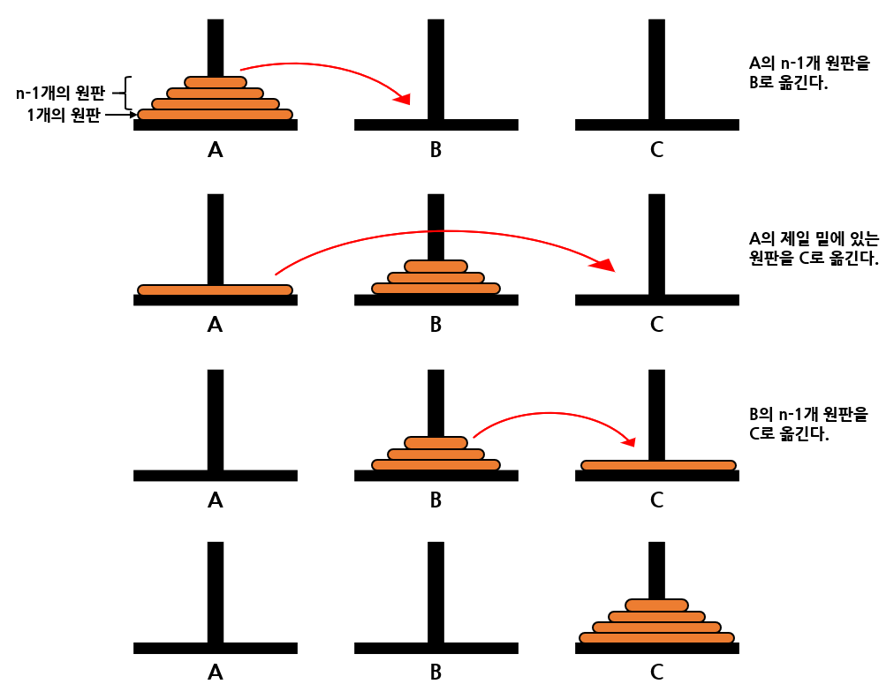

# 순환

# 1. 순환의 소개

<b>순환(recursion)</b>이란 어떤 알고리즘이나 함수가 자기 자신을 호출하여 문제를 해결하는 프로그래밍 기법이다.

## 순환의 예

순환은 본질적으로 순환적인 문제나 그러한 자료구조를 다루는 프로그램에 적합하다.  
예를 들어 정수의 팩토리얼은 다음과 같다.


팩토리얼 n! 을 정의하는데 다시 팩토리얼 (n-1)! 이 사용되었다.  
이러한 정의를 <b>순환적</b>이라 한다.

위의 정의에 따라 n! 을 구하는 함수 factorial(n)을 만들어보자.  
n! 을 계산하려면 먼저 (n-1)! 을 구해서 여기서 n을 곱해주면 n! 값을 계산할 수 있다.  
그러면 (n-1)! 을 계산하려면 매개변수만 (n-1)로 변경해주면 (n-1)! 값을 계산할 수 있다.

순환적인 팩토리얼 계산 프로그램은 다음과 같다.

```c
#include<stdio.h>

int factorial(int n)
{
    printf("factorial(%d)\n",n);
    if (n <= 1 ) return(1);
    else return ( n * factorial(n-1));
}

int main()
{
    int n;
    printf("! : ");
    scanf("%d", &n);
    printf("%d",factorial(n));
    return 0;
}
```

만약 입력에 3을 넣어 factorial(3)을 호출하게되면 factorial(3) 수행하는 도중 factorial(2)를 호출한다.  
factorial(2)는 factorial(1)을 호출하게 된다. 그러면 n이 1이므로 if문이 참이되어 더 이상의 순환없이 1을 반환하게된다.  
반환값 1은 factorial(2)로 전달이 되고 factorial(2)는 여기 2를 곱한 값인 2를 factorial(3)으로 전달한다.  
factorial(3)은 이 값에 3을 곱하여 6을 반환한다.

다음 그림은 factorial(3)을 호출하였을 경우의 순환호출 순서를 보여준다.


## 순환 호출의 내부적인 구현

프로그래밍 언어에서 하나의 함수가 자기 자신을 다시 호출하는 것은 다른 함수를 호출하는 것과 동일하다.  
복귀주소가 시스템스택에 저장되고 호출되는 함수를 위한 <b>매개변수(parameter)</b>와 지역변수를 스택으로부터 할당받는다.

이러한 함수를 위한 시스템 스택에서의 공간을 <b>활성 레코드(activation record)</b>라 한다.  
이런 준비가 끝나면 호출된 함수의 시작 위치로 점프하여 수행을 시작한다.  
만약 호출된 함수가 자기 자신이라면 자기 자신의 시작 위치로 점프하게 되는 것이다.  
호출된 함수가 끝나면 시스템 스택에서 복귀주소를 추출하여 호출한 함수로 되돌아가게 된다.

다음 그림은 main함수에서 factorial() 함수를 호출하였을 때의 시스템 스택이다.


C, PASCAL, C++, Java 등 현대적인 프로그래밍 언어에서 순환을 지원하지만 FORTRAN, COBOL같은 고전적 언어에서는 지역변수가 없거나 있더라도 정적으로 할당되므로 순환이 불가능하다.  
즉 함수호출마다 새로운 지역변수를 만들지 못하면 이전 호출과 구분할 수가 없어서 순환 호출이 불가능하다.

## 순환 알고리즘의 구조

순환 알고리즘은 그림과 같이 자기 자신을 순환적으로 호출하는 부분과 순환 호출을 멈추는 부분으로 구성되어 있다. 만약 순환 호출을 멈추는 부분이 없다면 시스템 스택을 다 사용할 때까지 순환적으로 호출되다가 결국 오류를 내며 멈출것이다.


<u>순환 호출에는 반드시 순환 호출을 멈추는 문장이 포함되어야 한다.</u>

## 순환↔반복

되풀이하는 것은 많은 컴퓨터 알고리즘에서 볼 수 있는 주요 특징이고,  
빠르게 되풀이 하는 것은 컴퓨터의 중요한 능력중의 하나이다.

프로그래밍 언어에서 되풀이하는 방법에는 <b>반복(iteration)</b>과 <b>순환(recursion)</b>의 2가지가 있다.

반복이란 for나 while 등의 반복구조로 되풀이 하는 방법이다.  
반복을 제어하는 변수를 사용하여 일정횟수동안 반복시킬 수도 있고 어떤 조건이 만족될 떄까지 반복시킬 수도 있다. 반복은 간명하고 효율적으로 되풀이를 구현하는 방법이다.

하지만 때로 반복을 사용하게 되면 지나치게 복잡해지는 문제들도 존재한다.  
이런 경우에는 순환이 좋은 해결책이 될 수 있다.  
순환은 주어진 문제를 해결하기 위해 자신을 다시 호출하여 작업을 수행하는 방식이다.  
순환은 본질적으로 순환적(recursive)인 문제나 그러한 자료구조를 다루는 프로그램에 적합하다.

기본적으로 반복과 순환은 문제 해결 능력이 같으며 많은 경우에 순환 알고리즘을 반복 버전으로,  
반복 알고리즘을 순환 버전으로 바꾸어 쓸 수 있다.  
특히 순환 호출이 끝에서 이루어지는 순환을 꼬리 순환(tail recursion)이라 하는데,  
이를 반복 알고리즘으로 쉽게 바꾸어 쓸 수 있다.

순환은 어떤 문제에서는 반복에 비해 알고리즘이 훨씬 명확하고 간결하게 나타낼 수 있다는 장점이 있다.  
그러나 일반적으로 순환은 <u>함수 호출</u>을 하게 되므로 반복에 비해 수행속도 면에서는 떨어진다.

팩토리얼의 반복적인 정의를 이용해서 C언어의 for문을 사용할 수 있다.


```c
#include<stdio.h>

int factorial_iter(int n)
{
    int i, result = 1;
    for(i=1; i<=n; i++)
        result *= i;
    return(result);
}

int main()
{
    int n;
    printf("! : ");
    scanf("%d", &n);
    printf("%d",factorial_iter(n));
    return 0;
}
```

문제의 정의가 순환적으로 되어 있는 경우 순환으로 작성하는 것이 훨씬 더 쉽다.  
또한 보통 순환 형태의 코드가 더 이해하기 쉽다. 따라서 가독성이 증대되고 코딩도 더 간단하다.  

순환적인 코드의 약점은 <u>실행 시간</u>에 있다.

하지만 적지 않은 경우 순환을 사용하지 않으면 도저히 프로그램을 작성할 수 없는 경우가 있다.  
따라서 순환은 반드시 익혀두어야 하는 중요한 기법이다.

## 순환의 원리

순환적인 팩토리얼 함수를 살펴보면, 문제의 일부를 해결한 다음, 나머지 문제에 대하여 순환 호출을 한다.

보통 건축업자를 고용해 집을 지을 때 한사람이 모든 공사를 하지 않는다.  
건축업자는 다시 여러 명의 하청업자를 고용해 집의 여러 부분들을 완성시킨다.  
하청업자들은 다시 다른 하청업자들을 고용해 맡은 일을 완성한다.

이런 식으로 주어진 문제를 더 작은 동일한 문제들로 분해, 해결하는 방법을 <b>분할정복(divide and conquer)</b>이라 한다.  
여기서 중요한 것은 순환호출이 일어날 때마다 문제의 크기가 작아진다는 것이다.  
문제의 크기가 점점 작아지면 풀기가 쉬워지고 결국은 아주 풀기 쉬운 문제가 된다.

순환은 알고리즘의 정의가 순환적으로 되어 있는 경우에 유리한 방법이다.  
예를 들면 팩토리얼 함수 계산, 피보나치 수열, 이항계수 계산, 이진 트리 알고리즘, 이진 탐색, 하노이 탑 문제들은 
순환 알고리즘을 쓰는 것이 자연스러운 알고리즘들이다.

순환은 강력한 프로그래밍 도구이며 많은 복잡한 알고리즘들이 순환의 개념을 사용하면 간단하게 프로그램된다.

## 순환 알고리즘의 성능

팩토리얼의 예에서 반복과 순환 알고리즘의 성능을 분석해보면,  
반복 알고리즘의 시간 복잡도는 for를 사용하여 n 반복하므로 시간 복잡도는 O(n)이다.  
순환 알고리즘은 한번 순환 호출할 때마다 1번의 곱셈이 수행되고 순환 호출은 n번 일어나므로 역시 O(n)이다.

반복 알고리즘과 순환 알고리즘의 시간 복잡도는 같지만 순환 호출의 경우 여분의 기억공간이 더 필요하고,  
또한 함수를 호출하기 위해서 함수의 매개변수들을 스택에 저장하는 것과 같은 사전 작업이 상당히 필요하다.  
따라서 수행 시간도 더 걸린다.

결론적으로 순환 알고리즘은 이해하기 쉽다는 것과 쉽게 프로그램할 수 있다는 장점이 있는 대신 수행 시간과 기억 공간의 사용에 있어서는 비효율적인 경우가 많다.

순환 호출시에는 호출이 일어날 때마다 호출하는 함수의 상태를 기억되어야 하므로 여분의 기억장소가 필요한 것이다.

# 2. 거듭제곱값 계산

순환적인 방법이 반복적인 방법보다 더 빠른 예제를 보자.

숫자 x의 n-거듭제곱 값인 x<sup>n</sup>을 구하는 함수를 순환을 생각하지 않고 작성한다면 다음과 같을 것이다.

```c
#include<stdio.h>

double slow_power(double x, int n)
{
    double result = 1.0;

    for(int i=0; i<n; i++)
        result *= x;
    return(result);
}

int main()
{
    printf("%f",slow_power(2, 10));
    return 0;
}
```

다음은 순환의 개념을 사용한 함수이다.

```c
#include<stdio.h>

double power(double x, int n)
{
    if( n==0 ) return 1;
    else if ( (n%2)==0 )
        return power(x*x, n/2);
    else return x*power(x*x, (n-1)/2);
}

int main()
{
    printf("%f",power(2, 10));
    return 0;
}
```

순환 알고리즘을 보면 처음에는 n승 이었다가 n/2 승이 되고 또 n/4 승으로 점점 문제의 크기가 줄어든다.  
순환이 더 복잡해 보이기까지 하지만 순환적인 함수가 더 빠르다.

이유는 무엇인지 생각해보면, 한 번의 순환 호출을 할 때마다 문제의 크기는 약 절반정도로 줄어든다.  
즉 n이 100이라면 100 > 50 > 25 > 12 > 6 > 3 > 1​ 과 같이 문제의 크기가 줄어들게 된다.

n을 2<sup>k</sup>라고 가정해보면 순환호출을 한번 할 때마다 n의 크기가 절반씩 줄어들게되므로  
2<sup>k</sup> > 2<sup>k-1</sup> > 2<sup>k-2</sup> > ... > 2<sup>1</sup> > 2<sup>0</sup>​ 과 같이 줄어든다.

즉 약 k번의 순환호출이 일어나는 것을 알 수 있다.  
실제로도 n=2<sup>k</sup>이므로 양변에 log를 취하면 log<sub>2</sub>n=k 임을 알 수 있다.  
n이 2의 거듭제곱이 아닌 경우에도 비슷하게 추리할 수 있다.  
전체 연산의 개수는 k=log<sub>2</sub>n에 비례하게 될 것이고 따라서 시간 복잡도는 O(log<sub>2</sub>n)이 된다.

반면 반복적인 기법을 사용하면 한 번의 루프마다 한 번의곱셈이 필요하고 루프의 개수는 n이 된다.  
따라서 시간 복잡도는 O(n)이 된다.

# 3. 피보나치 수열의 계산

순환을 사용하게 되면 단순하게 작성이 가능하며 가독성이 높아진다.  
그러나 똑같은 계산을 몇번씩 반복한다면 아주 단순한 경우라 할지라도 계산시간이 엄청나게 길어질 수 있다.  
이러한 예로 순환 호출을 이용하여 피보나치 수열을 계산하는 경우를 보자.

피보나치 수열이란 다음과 같이 정의되는 수열이다.


피보나치 수열에서는 앞의 두 개의 숫자를 더해서 뒤의 숫자를 만든다. 정의에 따라 수열을 만들어보면  
0, 1, 1, 2, 3, 5, 8, 13, 21, 34, 55, 89, 144, ...​ 과 같다.

피보나치 수열은 정의 자체가 순환적으로 되어 있다. 따라서 구현 시에 순환 호출을 사용하는것이 자연스럽다.  
피보나치 수열을 C언어를 이용하여 프로그램해보면 다음과 같다.

```c
#include<stdio.h>

int fib(int n)
{
    if (n ==0 ) return 0;
    if (n ==1 ) return 1;
    return (fib(n-1) + fib(n-2));
}

int main()
{
    printf("%d",fib(6));
    return 0;
}
```

이것은 매우 단순하고 이해하기 쉽지만 매우 비효율적이다.  
예를 들어 다음 그림처럼 fib(6)으로 호출하였을 경우 fib(4)​가 두 번이나 계산되기 때문이다.  
​fib(3)​은 3번 계산되고 이런 현상은 순환호출이 깊어질수록 점점 심해진다. 따라서 상당히 비효율적임을 알 수 있다.


fib(6)​을 구하기 위하여 ​fib()​함수가 25번이나 호출된다.

근본적인 이유는 중간에 계산되었던 값을 기억하지 않고 다시 계산을 하기 때문이다.  
예를 들어 fib(6)​을 구하기 위한 과정에서 ​fib(3)​은 3번이나 별도로 계산된다.  
n이 작을 때는 중복계산이 비교적 작지만 n이 커지게 되면 엄청난 순환호출이 필요하게 된다.  
n이 커지면 순환호출을 사용해 피보나치 수열을 계산하는 것은 거의 불가능하다.

순환을 사용하지 않고 반복구조를 이용하여 프로그램하면 제일 좋은 결과를 얻을 수 있다.

```c
#include<stdio.h>

int fib_iter(int n)
{
    if(n == 0) return 0;
    if(n == 1) return 1;

    int pp = 0;
    int p = 1;
    int result = 0;

    for (int i = 2; i <= n ; i++) {
        result = p + pp;
        pp = p;
        p = result;
    }
    return result;
}

int main()
{
    printf("%d",fib_iter(6));
    return 0;
}
```

# 4. 하노이탑 문제

순환의 파워를 가장 극명하게 보여주는 예제가 바로 하노이탑 문제이다. 하노이탑 문제는 다음과 같다.

- 고대 인도의 베나레스에는 세계의 중심이 있고, 그 곳에는 아주 큰 사원이 있다.  
  이 사원에는 높이 50cm 정도 되는 다이아몬드 3개가 있다.  
  그 중 한 막대에는 천지창조 때에 신이 64장의 순금 원판을 크기가 큰 것으로부터 차례로 쌓아 놓았다.  
  신은 승려들에게 밤낮으로 쉬지 않고 한 장씩 원판을 옮기어 빈 다이아몬드 막대 중 어느 한 곳으로 모두 옮겨 놓도록 명령하였다.  
  원판은 한 번에 한 개씩만 옮겨야 하고, 절대로 작은 원판 위에 큰 원판을 올려 놓을 수 없다.  
  64개의 원판의 크기는 모두 다르다. 어떻게 하여야 하는가?

주어진 문제를 이해하기 위해 원판의 개수가 3개인 경우를 살펴보도록 하겠다.


문제는 막대 A에 쌓여 있는 원판 3개를 막대 C로 옮기는 것이다.  
단 다음의 조건을 지켜야 한다.

- 한 번에 하나의 원판만 이동할 수 있다.
- 맨 위에 있는 원판만 이동할 수 있다.
- 크기가 작은 원판위에 큰 원판이 쌓일 수 없다.
- 중간의 막대를 임시적으로 이용할 수 있으나 앞의 조건들을 지켜야 한다.

3개의 원판이 있는 경우에 대한 해답은 다음 그림과 같은 순서이다.


4개의 원판이 있는 경우에는 조금 더 복잡해진다.  
더 나아가서 n개의 원판이 있는 경우를 해결하려면 상당히 복잡해진다.

이 문제는 순환적으로 생각하면 쉽게 해결할 수 있다. 순환이 일어날수록 문제의 크기가 작아져야 한다.  
여기서 문제의 크기는 이동하여야 하는 원판의 개수가 된다.

n개의 원판이 A에 쌓여있는 경우, 먼저 위에 쌓여 있는 n-1개의 원판을 B로 옮긴 다음,  
제일 밑에 있는 원판을 C로 옮긴다. 이어서 B에 있던 n-1개의 원판을 C로 옮기면 된다.

이 문제를 다음 그림과 같은 알고리즘을 만들어서 생각해보자.



막대를 각각 from, tmp, to 라고 한다면 첫 번째는 to를 사용해서 from에서 tmp로 n-1개의 원판을 이동하는 문제이고, 세 번째는 from을 사용해서 tmp에서 to로 n-1개의 원판을 이동하는 문제이다.  
따라서 순환호출을 사용할 수 있어서 다음과 같은 프로그램을 작성할 수 있다.

```c
#include<stdio.h>

void hanoi_tower(int n, char from, char tmp, char to)
{
    if (n==1) printf("원판 1을 %c 에서 %c으로 옮긴다.\n", from, to);
    else {
        hanoi_tower(n - 1, from, to, tmp);
        printf("원판 %d을 %c에서 %c으로 옮긴다.\n", n, from, to);
        hanoi_tower(n - 1, tmp, from, to);
    }
}

int main()
{
    hanoi_tower(3, 'A', 'B', 'C');
    return 0;
}
```

