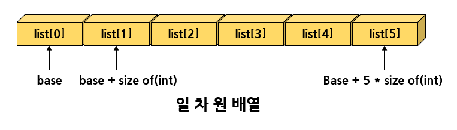
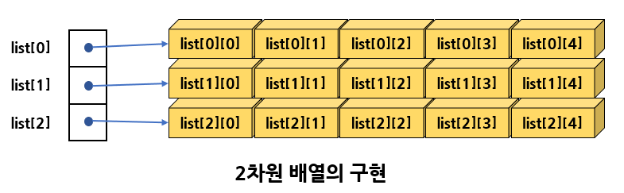
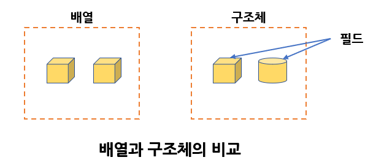
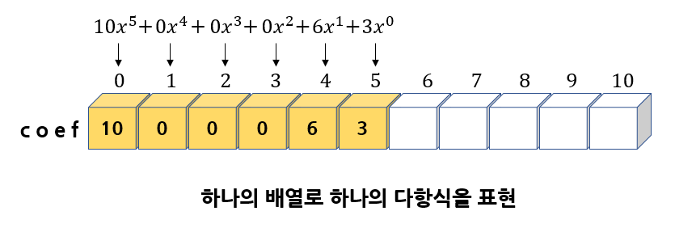
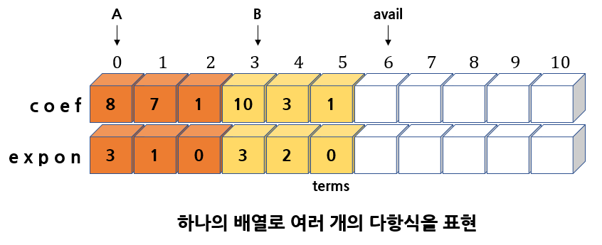
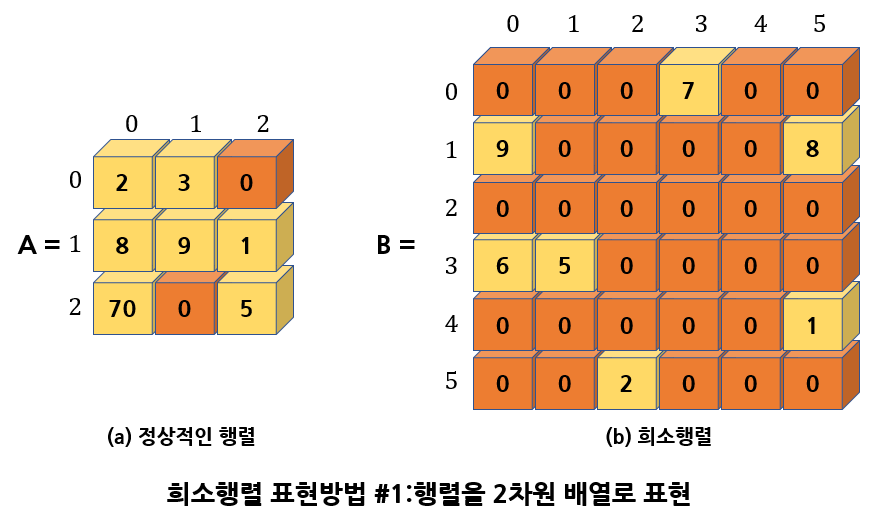
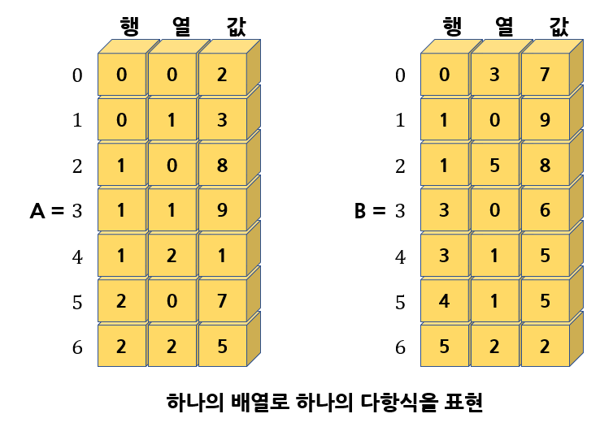
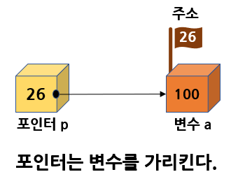
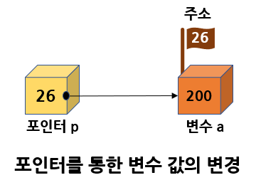
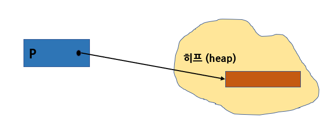

# 배열, 구조체, 포인터

# 1. 배열

## 배열의 개념

<b>배열(array)</b>은 거의 모든 프로그래밍 언어에서 기본적으로 제공되는 데이터 타입이다.  
배열은 기본이 되는 중요한 자료형으로서 많은 자료 구조들이 배열을 사용하여 구현된다.

배열은 동일한 타입의 데이터를 한 번에 여러 개 만들 떄 사용된다.  
예를 들어 6개의 정수를 저장할 공간이 필요한 경우, 배열이 없다면 다음처럼 6개의 정수형 변수를 선언해야한다.

```c
int list1, list2, list3, list4, list5, list6;
```

그러나 배열이 지원된다면 아주 간단하게 다음처럼 선언하면 된다.

```c
int list[6];
```

배열을 사용하면 <u>"연속적인 메모리 공간"</u>이 할당되고 <b>인덱스(index)</b>번호를 사용하여 쉽게 접근이 가능하기 때문에 반복 루프를 이용하여 여러 가지 작업을 손쉽게 할 수 있다.

## 배열 ADT

<b>배열</b>b의 핵심적인 내용을 추상적으로 살펴보면, 배열은 <b><인덱스, 값></b> 쌍으로 이루어진 집합으로 정의할 수 있다.  
즉 <b>인덱스(index)</b>가 주어지면 해당하는 <b>값(value)</b>이 대응되는 자료 구조이다.

배열은 주어진 인덱스에 값을 저장하는 set연산(store연산)과 인덱스가 주어지면 해당되는 값을 추출하는 get연산(retrieve연산)을 생각할 수 있다.

```c
객체: <인덱스, 값> 쌍의 집합
연산:
	- create(size) ::= size개의 요소를 저장할 수 있는 배열 생성
	- get(A, i)	   ::= 배열 A의 i번째 요소 반환
	- set(A, i, v) ::= 배열 A의 i번째 위치에 값 v 저장
```

get 함수는 배열과 인덱스를 받는다. 만약 그 인덱스가 유효하다면 인덱스 위치의 값을 반환한다.  
만약 인덱스가 유효하지 않다면 오류를 반환한다.

set 함수는 배열, 인덱스, 값을 받아서 새로운 인덱스 위치에 값을 저장한다.

## C언어에서의 1차원 배열

C언어에서 6개의 정수를 저장할 수 있는 배열은 변수 이름 끝에 [ ]을 추가해서 선언한다.  
[ ] 안의 숫자는 배열의 크기이다.

```c
int list[6];	// create 연산에 해당
```

[ ] 연산자를 사용해서 원하는 인덱스에서 값을 가져오거나 저장할 수 있다.  

```C
list[0] = 100;	// set 연산에 해당
value = list[0];// get 연산에 해당
```

C에서 <u>배열의 인덱스는 0</u>부터 시작한다.  
따라서 위와 같이 선언된 배열에서 배열의 요소는 list[0], list[1], list[2], list[3], list[4], list[5]​ 가 된다.



컴파일러는 배열을 메모리의 연속된 위치에 할당한다.  
첫 번째 요소인 list[0]의 주소가 기본주소가 되고 다른 요소들의 주소는 다음과 같이 된다.

| 배열의 요소 |     메모리 주소      |
| :---------: | :------------------: |
|   list[0]   |   기본주소 = base    |
|   list[1]   | $base+1*sizeof(int)$ |
|   list[2]   | $base+2*sizeof(int)$ |
|   list[3]   | $base+3*sizeof(int)$ |
|   list[4]   | $base+4*sizeof(int)$ |
|   list[5]   | $base+5*sizeof(int)$ |

프로그램에서 list[ i ]라고 적으면 컴파일러는 주소 $base+1*sizeof(int)$ 에 있는 값을 가져온다.

## 2차원 배열

<b>2차원 배열</b>은 요소들이 2차원 형태로 나열된 배열이다.  
2차원 배열에서 가로줄을 <b>행(row)</b> 세로줄을 <b>열(column)</b>이라 한다.

C언어에서 2차원 배열은 다음과 같이 선언한다.

```c
int list[3][5];
```

|         |     0열     |     1열     |     2열     |     3열     |     4열     |
| :-----: | :---------: | :---------: | :---------: | :---------: | :---------: |
| **0행** | list\[0][0] | list\[0][1] | list\[0][2] | list\[0][3] | list\[0][4] |
| **1행** | list\[1][0] | list\[1][1] | list\[1][2] | list\[1][3] | list\[1][4] |
| **2행** | list\[2][0] | list\[2][1] | list\[2][2] | list\[2][3] | list\[2][4] |

3개의 행과 5개의 열을 가지는 2차원 배열이 생성된다. C언어에서는 배열의 배열을 만들어서 구현한다.  
다음 그림을 보면 크기가 3인 1차원배열을 만들고 이 배열의요소에 크기가 5인 배열을 생성하여 추가한다.



# 2. 구조체

## 구조체의 개념

복잡한 객체에는 다양한 타입의 데이터들이 한데 묶여져서 있다.  
배열이 타입이 같은 데이터의 모임이라면 <b>구조체(structure)</b>는 타입이 다른 데이터를 묶는 방법이다.  
C언어 에서는 <b>struct</b> 키워드를 이용해 표기한다.



구조체의 형식은 다음과 같이 정의한다.

```C
struct 구조체이름 {
    항목1;
    항목2;
    ...
};
```

구조체의 형식이 정의되었으면 구조체 변수는 다음과 같이 생성한다.

```C
struct 구조체이름 구조체변수;
```

예로 학생을 나타내는 구조체를 만들어 보면 저장되는 항목들은 다음과 같다.

- 문자 배열로 된 이름
- 나이를 나타내는 정수값
- 평균평점을 나타내는 실수값

```C
struct studentTag {
    char name[10];	// 문자배열로 된 이름
    int age;	    // 나이를 나타내는 정수값
    double gpa;		// 평균 평점을 나타내는 실수값
};
```

struct 키워드 다음에 오는 studentTag는 구조체와 구조체를 구별할 수 있게 해주는 식별자로, <b>구조체 태그(tag)</b>라 한다.

위의 문장은 구조체 형식만을 정의한 것이고 실제로 구조체가 만들어진 것은 아니다.  
구조체를 만들려면 다음과 같이 해야한다.

```C
struct studentTag s;
```

구조체 안에 들어 있는 멤버를 사용하려면 구조체 변수 뒤에 ' . '을 첨가한 후 항목 이름을 적으면 된다.  
' .'을 <b>멤버연산자(membership operator)</b>라고 한다.

```C
strcpy(s.name, "kim");
s.age = 20;
s.gpa = 4.3;
```

C언어에서는 typedef을 사용하여 구조체를 새로운 타입으로 선언하는 것이 가능하다.  
아래의 예에서 student는 새로운 데이터 타입의 이름이 된다.

```C
typedef struct studentTag {
    char name[10];	// 문자배열로 된 이름
    int age;	    // 나이를 나타내는 정수값
    double gpa;		// 평균 평점을 나타내는 실수값
} student;
```

이 경우 새로운 타입인 student만을 사용하여서 변수를 선언하는 것이 가능해진다.  
sudent는 C에서의 기본 데이터 타입인 int나 float과 마찬가지로 새로운 데이터 타입의 이름이 된다.

```C
student s;
```

구조체는 중괄호를 사용하여 선언 시 초기화 하는 것이 가능하다.

```C
student s = { "kim", 20, 4.3 };
```

구조체를 이용한 간단한 프로그램은 다음과 같다.

```C
#include<stdio.h>

typedef struct studentTag {
    char name[10]; // 문자배열로 된 이름
    int age;        // 나이를 나타내는 정수값
    double gpa;     // 평균평점을 나타내는 실수값
} student;

int main()
{
    student a = {"kim", 20, 4.3};
    student b = {"park", 21, 4.2};
    printf("%s\n%d\n%f\n", a.name, a.age, a.gpa);
    return 0;
}
```

# 3. 배열의 응용 : 다항식

수학에서 나오는 다항식을 배열을 이용하여 표현해보자. 다항식의 일반적인 형태는 다음과 같다.

p(x)=a<sub>n</sub>x<sup>n</sup>+a<sub>n-1</sub>x<sup>n-1</sup>+...+a<sub>1</sub>x+a<sub>0</sub>

위 다항식에서 a는 계수, x는 변수, n은 차수라고 부른다.  
가장 큰 차수를 다항식의 차수라고 부른다. 다항식을 나타내는 두 가지의 자료구조를 생각할 수 있다.

## 첫 번째 방법

첫 번째 방법은 몸든 차수의 계수값을 배열에 저장하는 것이다.  
예를 들어 다항식 10x<sup>5</sup>+6x+3​은 다음과 같이 다시 쓸 수도 있다.  
15x<sup>5</sup> + 0\*x<sup>4</sup> + 0\*x<sup>3</sup> + 0\*x<sup>2</sup> + 6x + 3

모든 차수에 대한 계수값들의 리스트인 (10, 0, 0, 0, 6, 3)을 배열 coef에 저장하는 것이다.  
위의 다항식의 경우에는 다음 그림과 같이 된다. 다항식의 차수는 변수 degree에 저장된다.



하나의 다항식이 하나의 degree 변수와 하나의 coef 배열을 필요로 하므로 이를 묶어서 구조체를 만들고 이 구조체를 사용해 하나의 다항식을 표현할 수 있다.

일반적으로 계수는 실수일 수 있으므로 coef배열은 실수배열로 선언된 코드가 아래에 있다.

```c
typedef struct {
    int degree;
    float coef[MAX_DEGREE];
} polynomial;

polynomial a = { 5, {10, 0, 0, 0, 6, 3} };
```

이 방법은 간단하고 쉽게 이해가 되는 방법이다.

하지만 이 방법의 문제점은 대부분의 항의 계수가 0인 희소 다항식인 경우에는 공간의 낭비가 심하다.  
예를 들어 10x<sup>100</sup>+6의 희소 다항식의 경우 101개의 공간 중에서 오직 2개만 사용된다.

이 방법의 최대 장점은 다항식의 덧셈이나 뺼셈 시에 같은 차수의 계수를 쉽게 찾을 수 있으므로 알고리즘이 간단하다.

다음의 코드는 2개의 다항식을 받아 더셈을 하는 프로그램이다.

```c
#include<stdio.h>
#define MAX(a,b) (((a)>(b)?(a):(b)))
#define MAX_DEGREE 101

typedef struct {            // 다항식 구조체 타입 선언
    int degree;             // 다항식의 차수
    float coef[MAX_DEGREE]; // 다항식의 계수
} polynomial;

polynomial poly_add1(polynomial A, polynomial B)
{
    polynomial C;                       // 결과 다항식
    int Apos = 0, Bpos = 0, Cpos = 0;   // 배열 인덱스 변수
    int degree_a = A.degree;
    int degree_b = B.degree;
    C.degree = MAX(A.degree, B.degree); // 결과 다항식 차수

    while (Apos <= A.degree && Bpos <= B.degree) {
        if (degree_a > degree_b) {      // A항 > B항
            C.coef[Cpos++] = A.coef[Apos++];
            degree_a--;
        }
        else if (degree_a == degree_b) {// A항 == B항
            C.coef[Cpos++] = A.coef[Apos++] + B.coef[Bpos++];
            degree_a--; degree_b--;
        }
        else {                          // B항 > A항
            C.coef[Cpos++] = B.coef[Bpos++];
            degree_b--;
        }
    }
    return C;
}

void print_poly(polynomial p)
{
    for (int i = p.degree; i > 0; i--) printf("%3.1fx^%d + ", p.coef[p.degree - i], i);
    printf("%3.1f\n", p.coef[p.degree]);
}

//주함수
int main()
{
    polynomial a = {5, {3, 6, 0, 0, 0, 10}};
    polynomial b = {4, {7, 0, 5, 0, 1}};
    polynomial c;

    print_poly(a);
    print_poly(b);
    c = poly_add1(a, b);
    printf("--------------------------------------------\n");
    print_poly(c);
    return 0;
}
```

## 두 번째 방법

공간을 절약하기 위해 다항식에서 0이 아닌 항만을 하나의 전역 배열에 저장하는 방법도 생각할 수 있다.  
다항식의 0이 아닌 항들은 (계수, 차수)의 형식으로 구조체 배열에 저장된다.  
즉 10x<sup>5</sup>+6x+3의 경우 ( (10, 5), (6, 1), (3, 0) ) 으로 표시하는 것이다.

이 방식에서는 하나의 배열에 하나이상의 다항식을 저장할 수 있다.  
먼저 (계수, 차수)쌍을 구조체로 선언하고 이 구조체의 배열을 생성하여 다항식을 표현한다.

```c
#define MAX_TERMS 101
struct {
    float coef;
    int expon;
} terms[MAX_TERMS];
int avail;
```

이 방법을 이용해 다음 2개의 다항식을 표현해보자.

A = 8x<sup>3</sup> + 7x + 1,	B = 10x<sup>3</sup> + 3x<sup>2</sup> + 1

terms 배열의 내용을 나타내면 다음 그림과 같다. avail 변수는 현재 비어있는 요소의 인덱스를 가리킨다.



이런 표현 방법은 terms 안에 항의 총 개수가 MAX_TERMS를 넘지만 않으면 많은 다항식을 저장할 수 있다.  
그러나 이 방식도 단점이 존재한다.

우선 하나의 다항식이 시작되고 끝나는 위치를 가리키는 인덱스 변수들을 관리하여야 한다.  
또한 차수도 저장해야 하기 떄문에 다항식에 따라서는 계수만을 저장하는 첫 번째 방식보다 공간이 더 많이 필요할 수도 있다. 또한 다항식의 연산들의 구현이 첫 번째 방법보다 좀 더 어려워진다.

두 개의 다항식 A, B를 더하여 다항식 C를 구하려고한다면 A와 B의 각 항의 차수를 비교해서 차수가 같으면 A와 B의 각 항의 계수를 더해 C로 옮기고, 차수가 다르면 A와 B 중에서 차수가 큰 항을 C로 옮기면 된다.  
이와 같은 과정을 어느 한쪽의 다항식이 끝날 때까지 계속한다.

다음은 다항식 덧셈을 구현한 예시 프로그램이다.  
As와 Ae는 A의 처음과 마지막을 가리키며 Bs와 Be도 각각 다항식 B의처음과 끝을 가리킨다.  
Cs와 Ce도 결과로 생성되는 다항식의 처음과 끝을 가리킨다.

```C
#include<stdio.h>
#include<stdlib.h>

#define MAX_TERMS 101
typedef struct {
    float coef;
    int expon;
} polynomial;
polynomial terms[MAX_TERMS] =  {{8,3}, {7,1}, {1,0}, {10,3}, {3,2}, {1,0}};
int avail = 6;

// 두개의 정수를 비교
char compare(int a, int b)
{
    if (a>b) return '>';
    else if (a == b) return '=';
    else return '<';
}

// 새로운 항을 다항식에 추가한다.
void attach(float coef, int expon)
{
    if (avail > MAX_TERMS) {
        fprintf(stderr, "항의 개수가 너무 많음\n");
        exit(1);
    }
    terms[avail].coef = coef;
    terms[avail].expon = expon;
    avail++;
}

// C = A + B
void(poly_add2(int As, int Ae, int Bs, int Be, int *Cs, int *Ce))
{
    float tempcoef;
    *Cs = avail;
    while (As <= Ae && Bs <= Be)
        switch (compare(terms[As].expon, terms[Bs].expon)) {
        case '>': 	// A의 차수 > B의 차수
            attach(terms[As].coef, terms[As].expon);
            As++;			break;
        case '=': 	// A의 차수 == B의 차수
            tempcoef = terms[As].coef + terms[Bs].coef;
            if (tempcoef)
                attach(tempcoef, terms[As].expon);
            As++; Bs++;		break;
        case '<': 	// A의 차수 < B의 차수
            attach(terms[Bs].coef, terms[Bs].expon);
            Bs++;			break;
        }
    // A의 나머지 항들을 이동함
    for (; As <= Ae; As++) attach(terms[As].coef, terms[As].expon);
    // B의 나머지 항들을 이동함
    for (; Bs <= Be; Bs++) attach(terms[Bs].coef, terms[Bs].expon);
    *Ce = avail - 1;
}

void print_poly(int s, int e)
{
    for (int i = s; i < e; i++) printf("%3.1fx^%d + ", terms[i].coef, terms[i].expon);
    printf("%3.1fx^%d\n", terms[e].coef, terms[e].expon);
}

int main()
{
    int As = 0, Ae = 2, Bs = 3, Be = 5, Cs, Ce;
    poly_add2(As, Ae, Bs, Be, &Cs, &Ce);
    print_poly(As, Ae);
    print_poly(Bs, Be);
    printf("-------------------------------------------------\n");
    print_poly(Cs, Ce);
    return 0;
}
```

# 4. 배열의 응용 : 희소행렬

<b>행렬(matrix)</b>은 자연과학에서 많은 문제를 해결하는데 사용되므로 행렬을 프로그램에서 표현하는 것은 중요하다.

행렬을 표현하는 자연스러운 방법은 2차원 배열을 사용하는 것이다.

```c
#define MAX_ROWS 100
#define MAX_COLS 100
int matrix[MAX_ROWS][MAX_COLS];
```

이 방법을 방법1 이라고하고, 행렬을 표현해보면 밑의 그림과 같다.



(b)처럼 많은 항들이 0으로 되어있는 희소행렬인 경우 메모리의 낭비가 심하게 된다.

따라서 희소 행렬을 표현하는 다른 방법을 생각해 보았을 때,  
한가지의 방법은 배열을 이용하되, 0이 아닌 요소들만을 나타내는 방법이다.

이 방법을 방법2라고 하자.

0이 아닌 노드만을 (행, 열, 값)으로 표시하는 것이다. 다음 그림은 똑같은 행렬을 두 번째 방법으로 나타내는 것이다.



방법 1은 행렬을 전통적인 2차원 배열로 나타낸 것이고 방법 2는 새로운 방식으로 표현한 것이다.

각 방법은 장단점을 가지고 있다. 예를 들어 행렬의 <b>전치(transpose)</b> 연산을 구현하는 경우를 생각해보면,  
방법1에서는 2차원 배열의 요소(i, j)를 (j, i)와 교환하면 된다.  
하지만 방법2는 상당한 프로그래밍을 필요로 한다.

## 전치 행렬 계산하기 #1

방법1로 행렬의 전치 행렬을 계산하려면 a\[i][j]를 a\[j][i]로 바꾸면 된다. 다음은 코드이다.

```C
#include<stdio.h>
#define ROWS 3
#define COLS 3
// 행렬 전치 함수
void matrix_transpose(int A[ROWS][COLS], int B[ROWS][COLS])
{
    for (int r = 0; r < ROWS; r++)
        for (int c = 0; c < COLS; c++)
            B[c][r] = A[r][c];
}

void matrix_print(int A[ROWS][COLS])
{
    printf("=========================\n");
    for (int r = 0; r < ROWS; r++) {
        for (int c = 0; c < COLS; c++)
            printf("%d ", A[r][c]);
        printf("\n");
    }
    printf("=========================\n");
}

int main()
{
    int array1[ROWS][COLS] = { {2, 3, 0}, 
                               {8, 9, 1}, 
                               {7, 0, 5} };
    int array2[ROWS][COLS];

    matrix_transpose(array1, array2);
    matrix_print(array1);
    matrix_print(array2);
    return 0;
}

```

## 전치 행렬 계산하기 #2

방법2를 구현해보면 행렬에서 하나의 요소는 (row, col, value)로 표현할 수 있고 이것은 구조체 element로 정의한다.  
하나의 행렬에는 0이 아닌 요소가 여러 개 있을 수 있으므로 element배열이 필요하다.  
하나의 희소 행렬을 나타내는데 필요한 것들을 모아 SparseMatix구조체로 정의한다.

```C
typedef struct {
    int row;
    int col;
    int value;
} element;

typedef struct SparseMatrix {
    element data[MAX_TERMS];
    int row;	// 행의 개수
    int cols;	// 열의 개수
    int terms;	// 항의 개수
} SparseMatrix;
```

이 방법으로 표현된 행렬을 받아 전치 행렬을 구하는 연산을 생각할때 예를들면 다음과 같이 변경되야한다.

- (0, 3, 7) 요소 => (3, 0, 7) 요소
- (1, 0, 9) 요소 => (0, 1, 9) 요소
- (1, 5, 8) 요소 => (5, 1, 8) 요소

여기서 어려운 점은 새로운 전치 행렬을 만들 때, 낮은 행부터 높은 행까지 순서대로 저장되어야 한다.

기존 행렬의 열이 행으로 변경되기 때문에 0열을 먼저 처리하고 1열을 이어서 처리하면 전치 행렬이 행 순서대로 된다.  
즉 0열에 있는 요소를 모두 찾아 전치 행렬의 0행으로 저장하고, 1열의 요소를 모두 찾아 1행으로 저장하면 된다.

```C
#include<stdio.h>
#include<stdlib.h>

#define MAX_TERMS 100
typedef struct {
    int row;
    int col;
    int value;
} element;

typedef struct SparseMatrix {
    element data[MAX_TERMS];
    int rows;   // 행의 개수
    int cols;   // 열의 개수
    int terms;  // 항의 개수
} SparseMatrix;

SparseMatrix matrix_transpose2(SparseMatrix a)
{
    SparseMatrix b;

    int bindex;     // 행렬 b에서 현재 저장 위치
    b.rows = a.rows;
    b.cols = a.cols;
    b.terms = a.terms;

    if (a.terms > 0) {
        bindex = 0;
        for (int c = 0; c < a.cols; c++) {
            for (int i = 0; i < a.terms; i++) {
                if (a.data[i].col == c) {
                    b.data[bindex].row = a.data[i].col;
                    b.data[bindex].col = a.data[i].row;
                    b.data[bindex].value = a.data[i].value;
                    bindex++;
                }
            }
        }
    }
    return b;
}

void matrix_print(SparseMatrix a)
{
    printf("====================\n");
    for (int i = 0; i < a.terms; i++) {
        printf("(%d, %d, %d) \n", a.data[i].row, a.data[i].col, a.data[i].value);
    }
    printf("====================\n");
}

int main()
{
    SparseMatrix m = {
        { {0, 3, 7}, {1, 0, 9}, {1, 5, 8}, {3, 0, 6}, {3, 1, 5}, {4, 5, 1}, {5, 2, 2} },
        6,
        6,
        7
    };
    SparseMatrix result;

    result = matrix_transpose2(m);
    matrix_print(result);
    return 0;
}
```

# 5. 포인터

## 포인터의 개념

복잡한 자료구조를 표현하는데 필수적인 개념인 <b>포인터(pointer)</b>에 대하여 살펴보자.

<b>포인터(pointer)</b>는 다른 변수의 주소를 가지고 있는 변수이다.  
모든 변수는 메모리 공간에 저장되고 메모리의 각 바이트에는 주소가 매겨져 있다. 이 주소가 포인터에 저장된다.

주소는 컴퓨터에 따라 다를 수 있으므로 포인터 변수는 정확한 숫자보다는 그냥 화살표로 그려진다.  
모든 변수는 주소를 가지고 있다. 컴퓨터 메모리는 바이트로 구성되어있고 각 바이트마다 순차적으로 주소가 있다.



위의 그림에서 p는 a라는 변수를 가리키는 포인터 변수이다.  
C언어 문장은 다음과 같다.

```C
int a = 100;
int *p;
p = &a;
```

먼저 int형의 변수 a가 정의되고 p는 int형을 가리키는 포인터로 정의된다.  
p가 a를 가리키게 하려면 a의 주소를 p에 대입한다.  
변수의 주소는 & 연산자를 변수에 적용시켜서 추출할 수 있다.

## 포인터와 관련된 연산자

포인터와 관련된 2가지의 중요한 연산이 있다.

- & 연산자 - 주소 연산자
- \* 연산자 - 간접참조 연산자 (역참조 연산자라고도 함)

1. & 연산자는 변수의 주소를 추출하는 연산자이다.  
   앞에서 선언한 포인터 p가 특정한 변수를 가리키게 하려면 변수의 주소를 & 연산자로 추출하여 p에 대입한다.

   ```C
   int a;	// 정수형 변수
   p = &a;	// 변수의 주소를 포인터에 저장
   ```

2. \* 연산자는 포인터가 가리키는 장소에 값을 저장하는 연산자이다.  
   예를 들어 p가 가리키는 장소에 200을 저장하려면 다음과 같은 문장을 사용한다.

   ```C
   *p = 200;
   ```

   

*p와 a가 동일한 메모리 위치를 참조하는것을 유의해야 한다. 즉 *p와 a는 전적으로 동일하다.  
값만 같은 것이 아니고 동일한 실제적인 객체를 가리키기 때문에 *p의 값을 변경하게 되면 a의 값도 바뀌게 된다.

## 다양한 포인터

**포인터**는 다음과 같이 여러 가지 자료형에 대하여 선언될 수 있다.

```C
int *p;		// p는 int형 변수를 가리키는 포인터
float *pf;	// pf는 float형 변수를 가리키는 포인터
char *pc;	// pc는 char형 변수를 가리키는 포인터
```

## 널 포인터

<b>널 포인터</b>는 어떤 객체로 가리키지 않는 포인터이다.  
일반적으로 C언어에서 널 포인터는 <b>NULL</b> 이라는 매크로로 표시한다.  
포인터를 사용하기 전에는 반드시 널 포인터인지를 검사해야 한다.

```C
if( p == NULL) {
    fprintf(stderr, "오류 : 포인터가 아무 것도 가리키지 않습니다.");
    return;
}
```

포인터가 아무 것도 가리키고 있지 않을 떄는 항상 널 포인터 상태로 만들어 두는 것이 좋다.  
널 포인터를 가지고 간접참조하려고 하면 컴퓨터 시스템에서 오류가 발생되어 쉽게 알 수 있기 때문이다.  
잘못된 포인터를 가지고 메모리를 변경하는 것은 치명적인 결과를 가져올 수 있다.

## 함수 매개변수로 포인터 사용하기

포인터는 함수의 매개변수로 전달될 수 있다.  
특정한 변수를 가리키는 포인터가 함수의 매개변수로 전달되면 그 포인터를 이용하여 함수 안에서 외부 변수의 값을 변경할 수 있다. 하나의 예로 외부 변수 2개의 값을 서로 바꾸는 swap() 함수를 포인터를 이용해 작성해보면

```C
#include<stdio.h>

void swap(int *px, int *py)
{
    int tmp;
    tmp = *px;
    *px = *py;
    *py = tmp;
}

int main()
{
    int a = 1, b = 2;
    printf("swap을 호출하기 전 : a=%d, b=%d\n", a, b);
    swap(&a, &b);
    printf("swap을 호출한 다음 전 : a=%d, b=%d\n", a, b);
    return 0;
}
```

## 배열과 포인터

함수로 배열이 전달되면 함수 안에서 배열의 내용을 변경할 수 있다.  
그 이유는 다음 그림과 같이 배열의 이름이 배열의 시작위치를 가리키는 포인터이기 때문이다.


위의 그림에서 배열의 이름이 점선으로 그려져 있는 이유는 실제로 컴파일러가 배열의 이름에 공간을 할당하지는 않기 때문이다. 대신 배열의 이름이 있는 곳을 배열의 첫 번째 요소의 주소로 대치한다.  
따라서 배열의 이름이 포인터이기 때문에 배열이 함수의 매개변수로 전달될 때에 사실은 포인터가 전달되는 것이다.  
이건 메모리 공간과 함수의 호출 시간을 절약하는 기법이기도 하다. 함수 호출 시에 배열을 복사할 필요가 없기 떄문이다.

다음 프로그램으로 살펴보면 get_integers()와 cal_sum() 함수는 모두 배열을 매개 변수로 받는다.  
배열의 경우 원본이 전달되므로 함수 안에서 배열의 내용을 변경하면 원본 배열이 변경된다.

```C
#include<stdio.h>
#define SIZE 6

void get_integers(int list[])
{
    printf("6개의 정수를 입력하시오 : ");
    for (int i = 0; i < SIZE; i++) {
        scanf("%d", &list[i]);
    }
}

int cal_sum(int list[])
{
    int sum = 0;
    for (int i = 0; i < SIZE; i++) {
        sum += *(list + i);
    }
    return sum;
}

int main()
{
    int list[SIZE];
    get_integers(list);
    printf("합 = %d \n", cal_sum(list));
    return 0;
}
```

# 6. 동적 메모리 할당

일반적인 배열은 크기가 고정되어 있다. 예를 들어 학생들의 성적을 저장하는 아래의 배열 scores는 크기가 100으로 고정되어있다.

```C
int scores[100];
```

이 고정된 크기 때문에 많은 문제가 발생한다.

프로그램을 작성할 당시에 얼마나 많은 입력이 있을지를 알 수 없기 때문이다.  
만약 처음에 결정된 크기보다 더 큰 입력이 들어온다면 처리하지 못할 것이고,  
더 작은 입력이 들어온다면 남은 메모리 공간은 낭비될 것이다.

이러한 문제들을 해결하기 위해 C언어에서는 필요한 만큼의 메모리를 운영체제로부터 할당받아 사용하고, 사용이 끝나면 시스템에 메모리를 반납하는 기능이 있다. 이것을 <b>동적 메모리 할당(dynamic memory allocation)</b>이라고 한다.



동적 메모리가 할당되는 공간을 <b>히프(heap)</b>라고 한다. 히프는 운영체제가 사용되지 않는 메모리 공간을 모아놓는 곳이다.  
필요한 만큼만 할당을 받고 필요한 때에 사용하고 반납하기 때문에 메모리를 매우 효율적으로 사용할 수 있다.

전형적인 동적 메모리 할당 코드는 다음과 같다.

```C
int *p;
p = (int *)malloc(sizeof(int));	// 1. 동적 메모리 할당
*p = 1000;		// 2. 동적 메모리 사용
free(p);		// 3. 동적 메모리 반납
```

1. malloc() 함수는 size 바이트 만큼의 메모리 블록을 할당한다. sizeof 키워드는 변수나 타입의 크기를 숫자로 반환한다.  
   크기의 단위는 바이트가 되며 sizeof(int)는 int형의 크기를 반환한다.  
   malloc()은 동적 메모리 블럭의 시작 주소를 반환한다.  
   반환되는 주소의 타입은 void *이므로 적절한 포인터로 형변환 시켜야한다.  
   메모리 확보가 불가능하면 NULL을 함수의 반환값으로 반환한다.
2. 동적 메모리는 포인터로만 사용할 수 있다. *p는 p가 가리키는 장소이다.  
   p=1000; 문장을 실행하면 p가 가리키는 장소에 1000이 저장된다.
3. free()함수는 할당된 메모리 블럭을 운영체제에게 반환한다.  
   여기서 주의할 점은 malloc() 함수가 반환했던 포인터 값을 잊어버리면 안 된다.  
   포인터값을 잃어버리면 동적 메모리를 반환할 수 없다.  
   malloc()은 시스템의 메모리가 부족해서 요구된 메모리를 할당할 수 없으면 NULL을 반환한다.  
   따라서 malloc()의 반환값은 항상 NULL인지 검사해야한다.  
   정수 10개를 저장할 수 있는 메모리를 동적으로 할당해보는 코드는 아래와 같다.

```C
#include<stdio.h>
#include<stdlib.h>
#include<malloc.h>

#define SIZE 10

int main()
{
    int *p;

    p = (int *)malloc(SIZE * sizeof(int));
    if (p == NULL) {
        fprintf(stderr, "메모리가 부족해서 할당할 수 없습니다.\n");
        exit(1);
    }

    for (int i = 0; i < SIZE; i++)
        p[i] = i;
    
    for (int i = 0; i < SIZE; i++)
        printf("%d ", p[i]);
    
    free(p);
    return 0;
}
```

## 구조체와 포인터

구조체에 대한 포인터를 선언하고 포인터를 통하여 구조체 멤버에 접근할 수 있다.  
포인터를 통해 구조체의 멤버에 접근하는 편리한 표기법은 "→"이다.  
만약 ps가 구조체를 가리키는 포인터라고 할 때, (*ps).i 보다 ps→i 라고 쓰는 것이 더 편리하다.

자료구조에서 구조체에 대한 포인터도 자주 함수의 매개변수로 전달이 된다.  
구조체 자체를 함수로 전달하는 경우, 구조체가 함수로 복사되어 전달되기 때문에 큰 구조체의 경우에는 구조체 포인터를 전달하는 것이 좋다.

종합적 예제로 동적 메모리 할당을 이용해 구조체를 생성하고 여기에 데이터를 저장해보겠다.  
동적으로 생성된 구조체는 포인터를 통해서만 접근할 수 있다.  
다음의 코드는 malloc()함수를 이용해 student 구조체를 동적으로 생성한다.

```C
#include<stdio.h>
#include<stdlib.h>
#include<string.h>

typedef struct studentTag {
    char name[10];  // 문자배열로 된 이름
    int age;        // 나이를 나타내는 정수값
    double gpa;     // 평균평점을 나타내는 실수값
} student;

int main()
{
    student *s;

    s = (student *)malloc(sizeof(student));
    if (s == 0) {
        fprintf(stderr, "메모리가 부족해서 할당할 수 없습니다.");
        exit(1);
    }

    strcpy(s->name, "Park");
    s->age = 20;

    free(s);
    return 0;
}
```

