# 스택

# 1. 스택이란?

<b>스택(stack)</b>은 컴퓨터에서 믿을 수 없을 정도로 많이 사용되는 자료구조이다.

예를 들어 스마트폰에서 "뒤로 가기" 키를 누르면 현재 수행되는 앱이 종료되고 이전에 수행되던 앱이 다시 나타나는데, 이때 스택이 사용된다.

식당에 쌓여있는 접시더미, 책상에 쌓여있는 책, 창고에 쌓여있는 상자 등이 스택의 전형적인 예이다.

창고에 쌓여있는 상자를 이용하여 스택을 설명해보면,  
창고에서 새로운 상자들을 쌓을 때는 상자더미의 맨 윗부분에 놓는다.  
상자가 필요하면 상자더미의 맨 위에 있는 상자를 꺼낸다. 만약 중간에서 상자를 꺼내면 전체 상자가 붕괴될 것이다.  
따라서 가장 최근에 들어온 상자가 가장 위에 있게 되고, 먼저 나가게 된다.  
이런 입출력 형태를 <b>후입선출(LIFO : Last-in First-Out)</b>이라고 한다.

다음의 그림처럼 스택에 A, B, C, D를 순서대로 입력했다가 하나를 삭제하면 맨 위에 놓여진 D가 삭제된다.

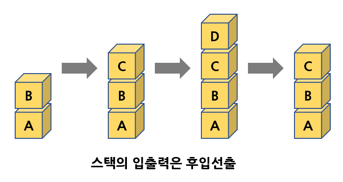

스택에서의 입출력은 맨 위에서만 일어나고 스택의 중간에서는 데이터를 삭제할 수 없다.

밑에 그림처럼 스택에서 입출력이 이루어지는 부분을 <b>스택 상단(stack top)</b>이라 하고 반대쪽인 바닥 부분을 <b>스택 하단(stack bottom)</b>이라고 한다.

스택에 저장되는 것을 <b>요소(element)</b>라하며, 스택에 요소가 하나도 없을 때의 스택을 <b>공백 스택(empty stack)</b>이라 한다.

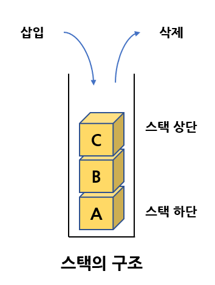

스택은 특히 자료의 출력순서가 입력순서의 역순으로 이루어져야 할 경우에 사용된다.

예를 들면 (A, B, C, D, E)의 데이터가 있을 때 데이터들의 순서를 (E, D, C, B, A)처럼 역순으로 하고 싶다면 데이터를 전부 스택에 입력했다가 다시 꺼내면 역순으로 만들 수 있다.

텍스트 에디터에서 "되돌리기"(undo) 기능을 구현할 때 스택을 사용할 수 있다.  
왜냐하면 수행된 명령어들 중에서 가장 최근에 수행된 것부터 되돌리기를 하여야 하기 때문이다.

## 예제 : 시스템 스택을 이용한 함수 호출

컴퓨터 안에서는 수많은 함수 호출이 이루어지는데, 함수는 실행이 끝나면 자신을 호출한 함수로 되돌아가야 한다.  
이때 스택이 사용된다. 즉 스택은 복귀할 주소를 기억하는데 사용된다.  
함수는 호출된 역순으로 되돌아가야 하기 때문이다.

밑에 그림은 함수 호출에서의 시스템 스택(운영체제가 사용하는 스택)의 사용을 보여준다.  
시스템 스택에는 함수가 호출될 때마다 <b>활성 레코드(activation record)</b>가 만들어지며 여기에 복귀주소가 저장된다.  
활성 레코드에는 프로그램 카운터 뿐만 아니라 함수 호출시 매개변수와 함수 안에서 선언된 지역 변수들도 생성된다.

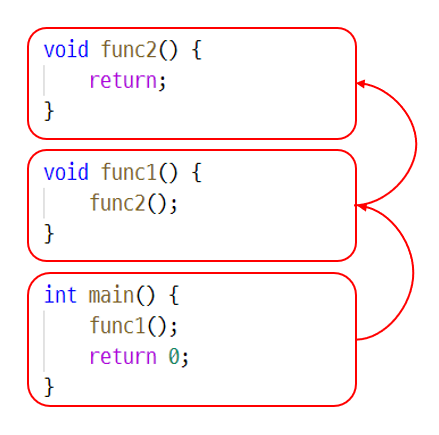

시스템 스택에는 다음과 같은 순서로 활성 레코드가 만들어졌다가 없어지게 된다.

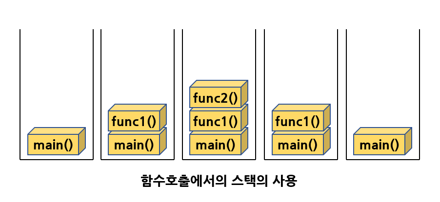

## 추상 자료형 스택

스택을 추상 자료형으로 정의하여 보면, 추상 자료형으로서의 스택은 0개 이상의 요소를 가지는 선형 리스트의 일종으로 정의되며 스택에 요소를 추가하거나 삭제하는 연산과 현재 스택 상태를 검사하는 연산들로 구성된다.

```C
-객체: 0개 이상의 원소를 가지는 유한 선형 리스트
-연산:
	create(size) ::= 최대 크기가 size인 공백 스택을 생성한다.
	is_full(s)	::=
        if(스택의 원소수 == size) return TRUE;
	   else return FALSE;
	is_empty(s)	::=
        if(스택의 원소수 == 0) return TRUE;
	   else return FALSE;
	push(s, item)::=
        if( is_full(s) ) return ERROR_STACKFULL;
	   else 스택의 맨 위에 item을 추가한다.
	pop(s)	::=
        if( is_empty(s) ) return ERROR_STACKEMPTY;
	   else 스택의 맨 위의 원소를 제거해서 반환한다.
	peek(s)	::=
        if( is_empty(s) ) return ERROR_STACKEMPTY;
	   else 스택의 맨 위의 원소를 제거하지 않고 반환한다.
```

스택에는 두 가지의 기본 연산이 있다. 하나는 삽입 연산으로 push연산, 또 하나는 삭제 연산으로 pop연산이다.

아래 그림은 스택에서의 push연산과 pop연산을 보여주고 있다.  
push(A)를 수행하면 스택에 A가 삽입되고, 다시 push(B)가 수행되면 B가 A위에 쌓이게 된다.  
같은 식으로 push(C)가 수행되면 C가 B위에 쌓이게 된다.

pop()이 수행되면 가장 위에 쌓여있는 C가 삭제된다.

만약 push연산중에 스택이 가득차서 입력이 불가능하다면 오류가 발생하고,  
pop연산중에 스택에 데이터가 없어서 출력이 불가능하다면 역시 오류가 발생한다.

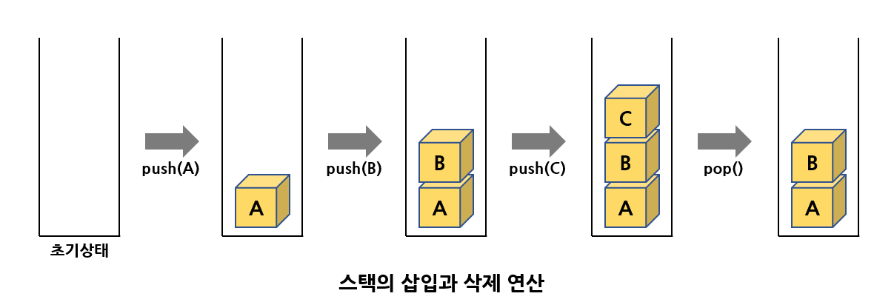

is_empty와 is_full 연산은 스택이 공백상태에 있는지 포화상태에 있는지를 검사하는 함수이다.

create 연산은 스택을 생성한다. peek 연산은 요소를 스택에서 삭제하지 않고 보기만 하는 연산이다.  
이에 반항 pop연산은 요소를 스택에서 완전히 삭제하면서 가져온다.

스택을 구현하는 방법에는 배열을 이용하는 방법과 연결 리스트를 이용하는 방법이 있다.  
배열은 구현하는 방법이 간단하고 성능이 우수한 반면, 스택의 크기가 고정되는 약점이 있다.

연결 리스트를 이용하는 방법은 구현이 약간 복잡한 반면, 스택의 크기를 필요에 따라 가변적으로 할 수 있다.  
연결 리스트를 사용하는 스택은 뒤에서 공부할 연결리스트에서 다룬다.

# 2. 스택의 구현

스택을 1차원 배열을 이용하여 구현해보자.

스택에는 여러 가지 필요한 내용을 넣을 수 있으나 여기서는 간단하게 int 타입의 정수가 저장되는 것으로 한다.  
따라서 int형의 1차원 배열 stack[MAX_STACK_SIZE]이 필요하다.  
이 배열을 이용하여 스택의 요소들을 저장하게 된다.  
또한 스택에서 가장 최근에 입력되었던 자료를 가리키는 top 변수가 필요하다.  
가장 먼저 들어온 요소는 stack[0]에, 가장 최근에 들어온 요소는 stack[top]에 저장된다.

top 변수는 스택이 비어 있으면 -1의 값을 가진다.  
왜냐하면 top의 값이 0이면 배열의 인덱스 0에 데이터가 있다는 것을 의미하기 때문이다.

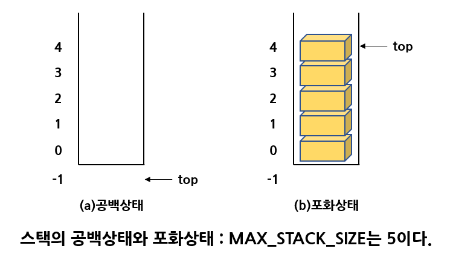

is_empty()는 스택이 비어 있는지를 검사하기 위해 top을 -1과 비교한다.  
만약 top이 -1이면 TRUE가 반환될 것이다.

is_full()은 스택이 가득 차있는지를 검사하기 위해 top을 (MAX_STACK_SIZE-1)과 비교하여 같으면 포화상태로 판정한다.  
만약 top이 (MAX_STACK_SIZE-1)이면 더 이상의 삽입은 불가능하다.

push()는 스택에 새로운 요소를 삽입하기 전 스택이 가득 차지 않았나를 검사하는 것이다.  
이것은 is_full()을 호출하여 검사한다.  
push()에서는 먼저 top의 값을 증가해야한다. top이 가리키는 위치는 마지막으로 삽입되었던 요소이므로
top을 증가시키지 않고 삽입하면 마지막 요소가 지워지게 된다.

pop()은 요소를 제거하기 전 스택이 비어있는지를 검사해야한다. 스택의 공백여부는 is_empty()로 검사한다.  
스택이 비어있지 않으면 top이 가리키는 값을 반환하고 top을 하나 감소시킨다.

스택을 C언어의 배열을 이용한 방법으로 구현해 본다. 2가지의 방법이 있다.

## 전역 변수로 구현하는 방법

1차원 배열과 top 변수를 모두 전역 변수로 구현한다.  
전역 변수로 구현되기 떄문에 배열이나 top변수를 함수의 매개 변수로 전달할 필요가 없다.  
스택에 저장되는 데이터의 타입은 typedef을 이용하여 element로 정의되었다.

```C
#include<stdio.h>
#include<stdlib.h>

#define MAX_STACK_SIZE 100      // 스택의 최대 크기
typedef int elemnet;            // 데이터의 자료형
elemnet stack[MAX_STACK_SIZE];  // 1차원 배열
int top = -1;

// 공백 상태 검출 함수
int is_empty()
{
    return (top == -1);
}
// 포화 상태 검출 함수
int is_full()
{
    return (top == (MAX_STACK_SIZE - 1));
}
// 삽입 함수
void push(elemnet item)
{
    if (is_full()) {
        fprintf(stderr, "스택 포화 에러\n");
        return;
    }
    else stack[++top] = item;
}
// 삭제 함수
elemnet pop()
{
    if (is_empty()) {
        fprintf(stderr, "스택 공백 에러\n");
        exit(1);
    }
    else return stack[top--];
}
// 피크 함수
elemnet peek()
{
    if (is_empty()) {
        fprintf(stderr, "스택 공백 에러\n");
        exit(1);
    }
    else return stack[top];
}

int main()
{
    push(1);
    push(2);
    push(3);
    printf("%d\n", pop());
    printf("%d\n", pop());
    printf("%d\n", pop());
    return 0;
}
```

## 스택의 요소를 구조체로 하기

만약 스택에 저장되어야 하는 값이 문자나 정수가 아니고 복잡한 구조를 갖는 요소일 때,  
예를 들면 학생의 정보라면 학번, 이름, 주소 등의 정보가 요소에 포함되야 한다.  
이런 경우에는 스택에 구조체를 저장하면 돈다. 구조체 안에 필요한 모든 정보를 넣으면 된다.

```C
#include<stdio.h>
#include<stdlib.h>
#define MAX_STACK_SZIE 100
#define MAX_STRING 100

typedef struct {
    int student_no;
    char name[MAX_STRING];
    char address[MAX_STRING];
} element;

element stack[MAX_STACK_SZIE];
int top = -1;

// 공백 상태 검출 함수
int is_empty()
{
    return (top == -1);
}
// 포화 상태 검출 함수
int is_full()
{
    return (top == (MAX_STACK_SZIE - 1));
}
// 삽입 함수
void push(element item)
{
    if (is_full()) {
        fprintf(stderr, "스택 포화 에러\n");
        return;
    }
    else stack[++top] = item;
}
// 삭제 함수
element pop()
{
    if (is_empty()) {
        fprintf(stderr, "스택 공백 에러\n");
        exit(1);
    }
    else return stack[top--];
}
// 피크 함수
element peek()
{
    if (is_empty()) {
        fprintf(stderr, "스택 공백 에러\n");
        exit(1);
    }
    else return stack[top];
}

int main()
{
    element ie = { 20190001, 
                    "Hong", 
                    "Soeul" };
    element oe;

    push(ie);
    oe = pop();

    printf("학번: %d\n", oe.student_no);
    printf("이름: %s\n", oe.name);
    printf("주소: %s\n", oe.address);
    return 0;
}
```

## 관련된 데이터를 함수의 매개변수로 전달하는 방법

앞의 방법은 이해하고 구현하기 쉽지만 stack배열과 top이 전역변수로 선언되기 때문에 하나의 프로그램에서 여러 개의 스택을 동시에 사용하기가 어렵다.

C++이나 자바의 경우 객체지향의 개념을 이용해 해결할 수 있다.  
C에서도 이 문제를 어느 정도 완화할 수 있다.  
top과 stack 배열을 하나의 구조체로 결합시키고 이 구조체의 포인터를 함수로 전달한다.

StackType이라는 새로운 구조체 타입을 만들고 여기에 stack배열과 top를 넣는다.  
그리고 이 구조체에 대한 포인터를 각 함수의 매개변수로 전달하는 것이다.

모든 함수에서 만약 전달된 구조체 포인터가 s이면 기존 top이라고 사용하던 것을 s→top로 변경하면 된다.  
stack 배열도 s→stack 으로 변경하여 사용하면 된다.

이렇게 하면 여러 스택을 쉽게 만드는 것이 가능해진다.  
즉 필요할 때마다 StackType을 사용해 구조체를 만들면 된다.

다음의 코드는 이러한 방법의 구현이다.

```C
#include<stdio.h>
#include<stdlib.h>

// 차후에 스택이 필요하면 여기만 복사하여 붙인다.
// ===== 스택 코드의 시작 =====
#define MAX_STACK_SIZE 100

typedef int element;
typedef struct {
    element data[MAX_STACK_SIZE];
    int top;
} StackType;

// 스택 초기화 함수
void init_stack(StackType *s)
{
    s->top = -1;
}
// 공백 상태 검출 함수
int is_empty(StackType *s)
{
    return (s->top == -1);
}
// 포화 상태 검출 함수
int is_full(StackType *s)
{
    return (s->top == (MAX_STACK_SIZE - 1));
}
// 삽입함수
void push(StackType *s, element item)
{
    if (is_full(s)) {
        fprintf(stderr, "스택 포화 에러\n");
        return;
    }
    else s->data[++(s->top)] = item;
}
// 삭제함수
element pop(StackType *s)
{
    if (is_empty(s)) {
        fprintf(stderr, "스택 공백 에러\n");
        exit(1);
    }
    else return s->data[(s->top)--];
}
// 피크함수
element peek(StackType *s)
{
    if (is_empty(s)) {
        fprintf(stderr, "스택 공백 에러\n");
        exit(1);
    }
    else return s->data[s->top];
}
// ===== 스택 코드의 끝 =====

int main()
{
    StackType s;

    init_stack(&s);
    push(&s, 1);
    push(&s, 2);
    push(&s, 3);
    printf("%d\n", pop(&s));
    printf("%d\n", pop(&s));
    printf("%d\n", pop(&s));
    return 0;
}
```

## 스택을 동적 메모리 할당으로 생성하는 방법

이 방법을 사용하면 각종 함수들을 호출할 때 자연스러운 표현이 가능하다.

하지만 사용이 끝나면 반드시 동적 메모리를 반환해야 한다는 단점도 있다.

```C
...
int main()
{
    StackType s;
    s = (StackType *)malloc(sizeof(StackType));
    init_stack(s);
    push(&s, 1);
    push(&s, 2);
    push(&s, 3);
    printf("%d \n", pop(&s));
    printf("%d \n", pop(&s));
    printf("%d \n", pop(&s));
    free(s);
    return 0;
}
```

# 3. 동적 배열 스택

C언어에서는 malloc()을 호출하여서 실행 시간에 메모리를 할당 받을 수 있다.

이 기능을 사용하면 필요할 때마다 스택의 크기를 동적으로 늘릴 수 있다.

```C
typedef int element;
typedef struct {
    element *data;		// data는 포인터로 정의된다.
    int capacity;		// 현재 크기
    int top;
} StackType;
```

스택이 만들어질 때, 1개의 요소를 저장할 수 있는 공간을 일단 확보한다.

```C
// 스택 생성 함수
void init_stack(StackType *s)
{
    s->top = -1;
    s->capacity = 1;
    s->data = (elemnet *)malloc(s->capacity * sizeof(elemnet));
}
// 스택 삭제 함수
void delete(StackType *s)
{
    free(s);
}
```

가장 큰 변화가 있는 함수인 push()이다. 공간이 부족해지면 메모리를 2배로 더 확보한다.

```C
void push(StackType *s, elemnet item)
{
    if (is_full(s)) {
        s->capacity *= 2;
        s->data = (elemnet *)realloc(s->data, s->capacity * sizeof(elemnet));
    }
    s->data[++(s->top)] = item;
}
```

realloc()은 동적 메모리의 크기를 변경한느 함수로, 현재 내용은 유짛면서 주어진 크기로 다시 할당한다.  
배열의 크기는 2배씩 늘어난다.

malloc()에서 반환되는 값이 NULL인지 검사하는 코드를 반드시 넣어야하지만, 간단하게 하기위해 생략한 코드

```C
#include<stdio.h>
#include<stdlib.h>
#include<malloc.h>

typedef int elemnet;
typedef struct {
    elemnet *data;      // data은 포인터로 정의된다.
    int capacity;       // 현재 크기
    int top;
} StackType;

// 스택 생성 함수
void init_stack(StackType *s)
{
    s->top = -1;
    s->capacity = 1;
    s->data = (elemnet *)malloc(s->capacity * sizeof(elemnet));
}
// 공백 상태 검출 함수
int is_empty(StackType *s)
{
    return (s->top == -1);
}
// 포화 상태 검출 함수
int is_full(StackType *s)
{
    return (s->top == (s->capacity - 1));
}
// 삽입함수
void push(StackType *s, elemnet item)
{
    if (is_full(s)) {
        s->capacity *= 2;
        s->data = (elemnet *)realloc(s->data, s->capacity * sizeof(elemnet));
    }
    s->data[++(s->top)] = item;
}
// 삭제함수
elemnet pop(StackType *s)
{
    if (is_empty(s)) {
        fprintf (stderr, "스택 공백 에러\n");
        exit(1);
    }
    else return s->data[(s->top)--];
}

int main()
{
    StackType s;
    init_stack(&s);
    push(&s, 1);
    push(&s, 2);
    push(&s, 3);
    printf("%d \n", pop(&s));
    printf("%d \n", pop(&s));
    printf("%d \n", pop(&s));
    free(s.data);
    return 0;
}
```

# 4. 스택의 응용 : 괄호 검사 문제

프로그램에서는 여러 종류의 괄호들이 사용되는데, 괄호들은 항상 쌍이 되게끔 사용되어야 한다.

프로그램에서 사용되는 괄호는 대괄호[ ], 중괄호{ }, 소괄호( ) 등이다.  
올바르게 사용되었는지를 스택을 사용하여 검사해보자. 검사 조건은 다음의 3가지이다.

- 조건 1: 왼쪽 괄호의 개수와 오른쪽 괄호의 개수가 같아야 한다.
- 조건 2: 같은 종류의 괄호에서 왼쪽 괄호는 오른쪽 괄호보다 먼저 나와야 한다.
- 조건 3: 서로 다른 종류의 왼쪽 괄호와 오른쪽 괄호 쌍은 서로를 교차하면 안 된다.

```C
{ A[(i+1)]=0; }			-> 오류없음
if((i==0)) && (j==0)	-> 오류 : 조건 1 위반
A[(i+1])=0;				-> 오류 : 조건 3 위반
```

위의 괄호들을 보면 가장 가까운 거리에 있는 괄호들끼리 서로 쌍을 이루어야 됨을 알 수 있다.

따라서 스택을 이용하여 왼쪽 괄호들을 만나면 계속 삽입하다가 오른쪽 괄호들이 나오면 스택에서 가장 최근의 왼쪽 괄호를 꺼내어 타입을 맞추어보면 쉽게 괄호들의 오류를 검사할 수 있다.

밑의 그림은 위의 예제 문장의 과정이다.

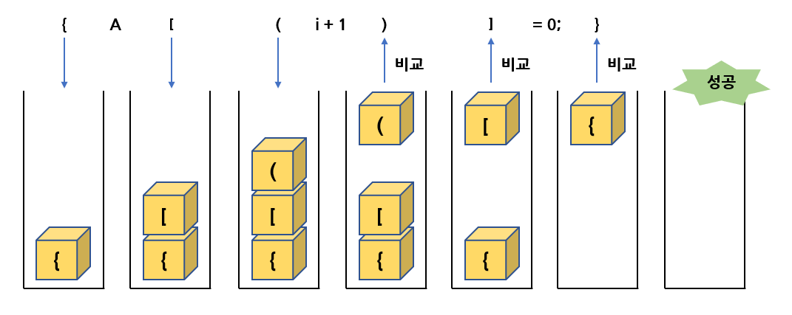

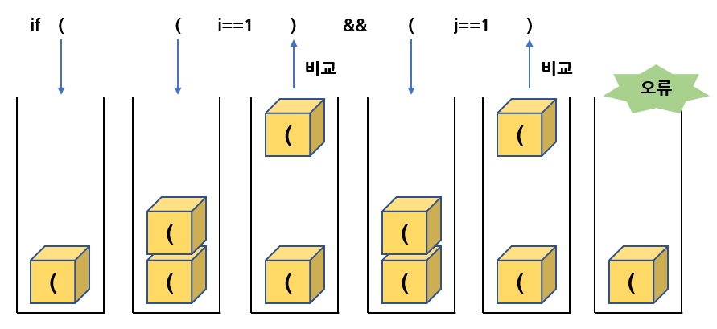

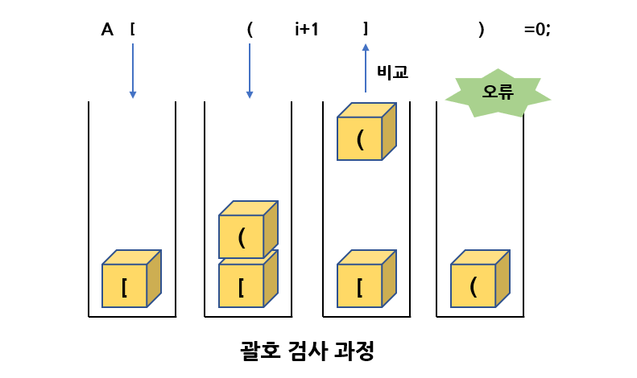

괄호 검사를 C언어 코드로 구현하면 다음과 같다.  
여기서 스택은 문자를 저장해야하므로 element타입이 char이다.

```C
#include<stdio.h>
#include<stdlib.h>
#include<string.h>
#define MAX_STACK_SIZE 100

// 스택 코드 추가
typedef char element;           // 교체!
typedef struct {
    element data[MAX_STACK_SIZE];
    int top;
} StackType;
// 스택 초기화 함수
void init_stack(StackType *s)
{
    s->top = -1;
}
// 공백 상태 검출 함수
int is_empty(StackType *s)
{
    return (s->top == -1);
}
// 포화 상태 검출 함수
int is_full(StackType *s)
{
    return (s->top == (MAX_STACK_SIZE - 1));
}
// 삽입함수
void push(StackType *s, element item)
{
    if (is_full(s)) {
        fprintf(stderr, "스택 포화 에러\n");
        return;
    }
    else s->data[++(s->top)] = item;
}
// 삭제함수
element pop(StackType *s)
{
    if (is_empty(s)) {
        fprintf(stderr, "스택 공백 에러\n");
        exit(1);
    }
    else return s->data[(s->top)--];
}
// 피크함수
element peek(StackType *s)
{
    if (is_empty(s)) {
        fprintf(stderr, "스택 공백 에러\n");
        exit(1);
    }
    else return s->data[s->top];
}
// 스택 코드 추가 끝

int check_matching(const char *in)
{
    StackType s;
    char ch, open_ch;
    int i, n = strlen(in);  // n = 문자열의 길이
    init_stack(&s);         // 스택의 초기화

    for (i = 0; i < n; i++) {
        ch = in[i];         // ch = 다음 문자
        switch (ch) {
            case '(': case '[': case '{':
                push(&s, ch);
                break;
            case ')': case ']': case '}':
                if (is_empty(&s)) return 0;
                else {
                    open_ch = pop(&s);
                    if ( (open_ch == '(' && ch != ')') ||
                        (open_ch == '[' && ch != ']') ||
                        (open_ch == '{' && ch != '}') ) {
                        return 0;
                    }
                    break;
                }
        }
    }
    if (!is_empty(&s)) return 0;    // 스택에 남아있으면 오류
    return 1;
}

int main()
{
    char *p = "{ A[(i+1)]=0; }";
    if (check_matching(p) == 1) {
        printf("%s 괄호검사성공\n", p);
    }
    else printf("%s 괄호검사실패\n", p);
    return 0;
}
```

# 5. 스택의 응용 : 후위 표기 수식의 계산

컴퓨터 프로그램에서 많은 수식을 만난다. 예를 들면 다음과 같은 복잡한 수식을 만나게 된다.  
y = a * (b - c) + d / c​

수식은 연산자와 피연산자, 괄호로 이루어져 있다.  
연산자들은 우선순위가 있어 우선순위가 높은 연산자가 먼저 계산된다.

수식은 스택을 사용하여 계산된다.  
수식을 표기하는 방법에는 <b>중위(infix)</b>, <b>후위(postfix)</b>, <b>전위(prefix)</b>의 3가지 방법이 있다.  
연산자가 피연산자 사이에 있으면 중위이고,  
연산자가 피연산자 뒤에 있으면 후위, 연산자가 피연산자 앞에 있으면 전위이다.

인간은 주로 중위표기법을 사용하지만 컴파일러는 후위표기법을 사용한다.  
프로그래머가 수식을 중위표기법으로 작성하면 컴파일러는 후위표기법으로 변환한 후에 스택을 이용하여 계산한다.

| 중위 표기법 | 전위 표기법 | 후위 표기법 |
| :---------: | :---------: | :---------: |
|   $2+3*4$   |   $+2*34$   |   $234*+$   |
|   $a*b+5$   |   $+*ab5$   |   $ab*5+$   |
|  $(1+2)*7$  |   $*+127$   |   $12+7*$   |

컴파일러가 후위 표기 방법을 선호하는 이유는, 후위 표기 방식에서는 괄호가 필요없다.  
즉 중위 표기 수식(1 + 2) * 7의 경우 괄호는 더하기 연산이 곱하기 연산보다 먼저 수행되어야 함을 나타낸다.

똑같은 식을 후위 표기 방법으로 나타내면12 + 7*​가 되어 괄호를 쓰지 않고서도 우선 계산해야 할 내용을 나타낼 수 있다. 또 연산자의 우선순위도 생각할 필요가 없다. 이미 식 자체에 우선순위가 표현되어 있기 떄문이다.

중위 표현식은 괄호가 존재하기 때문에 수식을 끝까지 읽은 후 계산을 시작해야 한다.  
그러나 후위 표기 수식에서는 수식을 읽으면서 바로 계산을 하여도 된다.

후위 표기식을 계산하려면 먼저 수식을 왼쪽에서 오른쪽으로 스캔하여 피연산자이면 스택에 저장하고,  
연산자이면 필요한 수만큼의 피연산자를 스택에서 꺼내 연산을 실행하고 연산의 결과를 다시 스택에 저장하면 된다.

밑에 그림은 후위 표기 수식 82 / 3 - 의 계산과정이다.

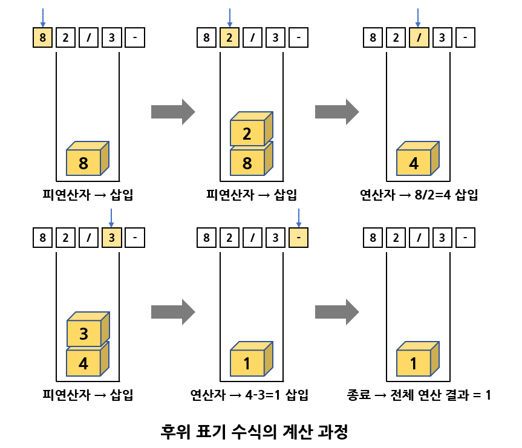

아래는 C의 알고리즘 코드이다. 피연산자가 한 문자로 된 숫자로 가정된 코드이다.

```C
#include<stdio.h>
#include<stdlib.h>
#include<string.h>
#define MAX_STACK_SIZE 100

// 스택 코드 추가
typedef char element;           // 교체!
typedef struct {
    element data[MAX_STACK_SIZE];
    int top;
} StackType;
// 스택 초기화 함수
void init_stack(StackType *s)
{
    s->top = -1;
}
// 공백 상태 검출 함수
int is_empty(StackType *s)
{
    return (s->top == -1);
}
// 포화 상태 검출 함수
int is_full(StackType *s)
{
    return (s->top == (MAX_STACK_SIZE - 1));
}
// 삽입함수
void push(StackType *s, element item)
{
    if (is_full(s)) {
        fprintf(stderr, "스택 포화 에러\n");
        return;
    }
    else s->data[++(s->top)] = item;
}
// 삭제함수
element pop(StackType *s)
{
    if (is_empty(s)) {
        fprintf(stderr, "스택 공백 에러\n");
        exit(1);
    }
    else return s->data[(s->top)--];
}
// 피크함수
element peek(StackType *s)
{
    if (is_empty(s)) {
        fprintf(stderr, "스택 공백 에러\n");
        exit(1);
    }
    else return s->data[s->top];
}
// 스택 코드 추가 끝

// 후위 표기 수식 계산 함수
int eval(char exp[])
{
    int op1, op2, value, i = 0;
    int len = strlen(exp);
    char ch;
    StackType s;

    init_stack(&s);
    for (i = 0; i < len; i++) {
        ch = exp[i];
        if (ch != '+' && ch != '-' && ch != '*' && ch != '/') {
            value = ch - '0';   // 입력이 피연산자이면
            push(&s, value);
        }
        else {  // 연산자이면 피연산자를 스택에서 제거
            op2 = pop(&s);
            op1 = pop(&s);
            switch (ch) {   // 연산을 수행하고 스택에 저장
                case '-' : push(&s, op1 - op2); break;
                case '+' : push(&s, op1 + op2); break;
                case '*' : push(&s, op1 * op2); break;
                case '/' : push(&s, op1 / op2); break;
            }
        }
    }
    return pop(&s);
}

int main()
{
    int result;
    printf("후위표기식은 82/3-32*+\n");
    result = eval("82/3-32*+");
    printf("결과값은 %d\n", result);
    return 0;
}
```

## 중위 표기식을 후위표기식으로 변환

중위 표기법과 후위 표기법의 공통점은 피연산자의 순서는 동일하고 연산자들의 순서가 달라진다.  
연산자들의 순서는 우선순위에 따라 결정된다.

| 중위 표기법 | 후위 표기법 |
| :---------: | :---------: |
|    $a+b$    |    $ab+$    |
|  $(a+b)*c$  |   $ab+c*$   |
|   $a+b*c$   |   $abc*+$   |

중위 표기 수식을 후위 표기 수식으로 변환하기 위해 입력 수식을 왼쪽에서 오른쪽으로 스캔한다.  
만약 피연산자를 만나게 되면 바로 후위 표기 수식에 출력한다.  
연산자는 피연산자 뒤에 나오기 때문에 적절한 위치를 찾을 때까지 출력을 보류하여야 한다.

예를 들면 a+b라는 수식이 있으면 a는 그대로 출력되고 +는 저장되고 b도 출력되고 최종적으로 저장되었던 +를 출력하여 ab+가 된다.

연산자들의 우선순위를 잘 생각하여야 하는데, 만약 a * b + c의 경우, * 가 스택에 들어가 있는 상태에서  + 를 스택에 넣으면 안된다. 왜냐면  + 가 스택에 삽입되서 나중에 먼저 출력되면 * 보다 먼저 계산되기 때문이다.

따라서 스택에 존재하는 연산자가 <u>현재 처리중</u>인 연산자보다 우선순위가 높으면 일단 스택에 있는 연산자들 중 우선순위가 높은 연산자들을 먼저 출력한 다음에 <u>처리중인 연산자</u>를 스택에 넣어야 한다.

<b>왼쪽괄호</b>는 무조건 스택에 삽입한다. 왼쪽괄호가 일단 스택에 삽입되면 왼쪽괄호를 제일 우선순위가 낮은 연산자로 취급한다. 즉 다음에 만나는 어떠한 연산자도 스택에 삽입된다.  
<b>오른쪽괄호</b>를 만나게 되면 왼쪽괄호가 삭제될 때까지 왼쪽괄호 위에 쌓여있는 모든 연산자들을 출력한다.

다음의 그림은 입력 수식이 (a + b) * c일때의 알고리즘의 진행이다.

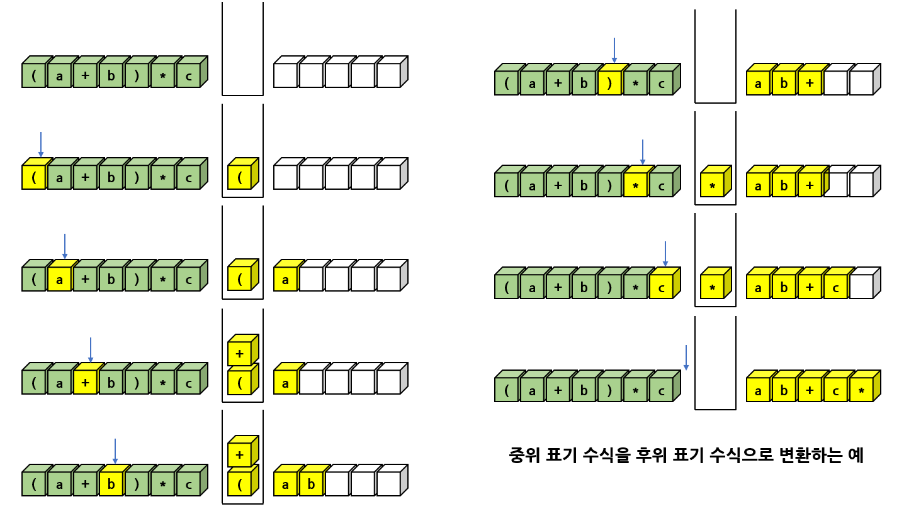

중위 표기 수식을 후위 표기 수식으로 변환하는 프로그램

```c
#include<stdio.h>
#include<stdlib.h>
#include<string.h>
#define MAX_STACK_SIZE 100

// 스택 코드 추가
typedef char element;           // 교체
typedef struct {
    element data[MAX_STACK_SIZE];
    int top;
} StackType;
// 스택 초기화 함수
void init_stack(StackType *s)
{
    s->top = -1;
}
// 공백 상태 검출 함수
int is_empty(StackType *s)
{
    return (s->top == -1);
}
// 포화 상태 검출 함수
int is_full(StackType *s)
{
    return (s->top == (MAX_STACK_SIZE - 1));
}
// 삽입함수
void push(StackType *s, element item)
{
    if (is_full(s)) {
        fprintf(stderr, "스택 포화 에러\n");
        return;
    }
    else s->data[++(s->top)] = item;
}
// 삭제함수
element pop(StackType *s)
{
    if (is_empty(s)) {
        fprintf(stderr, "스택 공백 에러\n");
        exit(1);
    }
    else return s->data[(s->top)--];
}
// 피크함수
element peek(StackType *s)
{
    if (is_empty(s)) {
        fprintf(stderr, "스택 공백 에러\n");
        exit(1);
    }
    else return s->data[s->top];
}
// 스택 코드 추가 끝

int prec(char op)
{
    switch (op) {
        case '(' : case ')' : return 0;
        case '+' : case '-' : return 1;
        case '*' : case '/' : return 2;
    }
    return -1;
}
// 중위 표기 수식 -> 후위 표기 수식
void infix_to_postfix(char exp[])
{
    int i = 0;
    char ch, top_op;
    int len = strlen(exp);
    StackType s;

    init_stack(&s);             // 스택 초기화
    for (i = 0; i < len; i++) {
        ch = exp[i];
        switch (ch) {
            case '+' : case '-' : case '*' : case '/' : // 연산자
            // 스택에 있는 연산자의 우선순위가 더 크거나 같으면 출력
                while (!is_empty(&s) && (prec(ch) <= prec(peek(&s))))
                    printf("%c", pop(&s));
                push(&s, ch);
                break;
            case '(' :      // 왼쪽 괄호
                push(&s, ch);
                break;
            case ')' :      // 오른쪽 괄호
                top_op = pop(&s);
                // 왼쪽 괄호를 만날때까지 출력
                while (top_op != '(') {
                    printf("%c", top_op);
                    top_op = pop(&s);
                }
                break;
            default :       // 피연산자
                printf("%c", ch);
                break;
        }
    }
    while (!is_empty(&s))   // 스택에 저장된 연산자들 출력
        printf("%c", pop(&s));
}
//
int main()
{
    char *s = "(2+3)*4+9";
    printf("중위표시수식 %s \n", s);
    printf("후위표시수식 ", s);
    infix_to_postfix(s);
    printf("\n");
    return 0;
}
```

# 6. 스택의 응용 : 미로 문제

미로 문제란 미로에 갇힌 생쥐가 출구(또는 치즈)를 찾는 문제이다.

생쥐가 출구를 찾는 기본적인 방법은 시행착오 방법으로서 하나의 경로를 선택하여 한번 시도해보고 안되면 다시 다른 경로를 시도하는 것이다.  
문제는 현재의 경로가 안 될 겨웅에 다른 경로를 선택해야 한다는 것으로, 다른 경로가 어딘가에 저장되어 있어야 한다.

현재 위치에서 가능한 경로 중에서 가장 가까운 경로이면 좋을 것이고, 그에 맞게 최근 저장한 경로가 쉽게 추출되는 자료구조를 사용해야 할 것이다. 따라서 스택이 자연스럽게 후보 자료 구조가 된다.

현재 위치에서 갈 수 있는 방들의 좌표를 스택에 기억하였다가 막다른 길을 만나면 아직 가보지 않은 방 중에서 가장 가까운 방으로 다시 돌아가 새로운 경로를 찾아보는 것이고, 한번 지나간 방은 다시 가면 안 될 것이다.  
따라서 생쥐가 각 방들을 지나갈 때마다 방문했다고 표시를 하여야 한다.

미로 문제를 위하여 하나의 스택을 가정하고 생쥐는 현재 위치에서 이동이 가능한 칸들의 위치를 위, 아래, 왼쪽, 오른쪽의 순서로 스택에 저장하고 스택에서 맨위의 위치를 꺼내어 현재의 위치로 한 다음, 같은 작업을 반복한다.

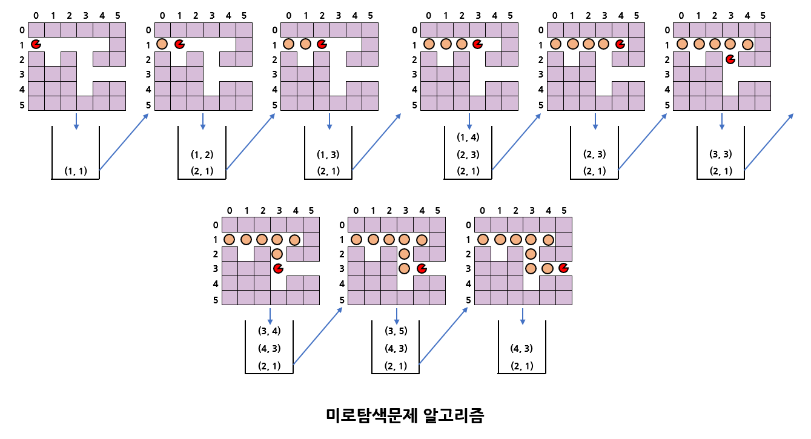

C언어로 해당 알고리즘을 구현할 때, 책에서는 2차원 문자 배열maze\[][]를 이용해 미로를 표현하였다.

배열의 값이 0이면 갈 수 있는 길이고 1이면 나갈 수 없는 벽을 의미한다.  
출구는 x로 표시된다.

방문이 끝난 위치는 배열의 값을 ' .' 으로 바꾸어 다른 위치들과 구별을 한다.

```c
#include<stdio.h>
#include<stdlib.h>
#include<string.h>
#define MAX_STACK_SIZE 100
#define MAZE_SIZE 6

// 스택 코드 추가
typedef struct {    // 교체
    short r;
    short c;
} element;

typedef struct {
    element data[MAX_STACK_SIZE];
    int top;
} StackType;
// 스택 초기화 함수
void init_stack(StackType *s)
{
    s->top = -1;
}
// 공백 상태 검출 함수
int is_empty(StackType *s)
{
    return (s->top == -1);
}
// 포화 상태 검출 함수
int is_full(StackType *s)
{
    return (s->top == (MAX_STACK_SIZE - 1));
}
// 삽입함수
void push(StackType *s, element item)
{
    if (is_full(s)) {
        fprintf(stderr, "스택 포화 에러\n");
        return;
    }
    else s->data[++(s->top)] = item;
}
// 삭제함수
element pop(StackType *s)
{
    if (is_empty(s)) {
        fprintf(stderr, "스택 공백 에러\n");
        exit(1);
    }
    else return s->data[(s->top)--];
}
// 피크함수
element peek(StackType *s)
{
    if (is_empty(s)) {
        fprintf(stderr, "스택 공백 에러\n");
        exit(1);
    }
    else return s->data[s->top];
}
// 스택 코드 추가 끝

element here = {1, 0}, entry = {1, 0};

char maze[MAZE_SIZE][MAZE_SIZE] = {
    { '1', '1', '1', '1', '1', '1' },
    { 'e', '0', '1', '0', '0', '1' },
    { '1', '0', '0', '0', '1', '1' },
    { '1', '0', '1', '0', '1', '1' },
    { '1', '0', '1', '0', '0', 'x' },
    { '1', '1', '1', '1', '1', '1' },
};
// 위치를 스택에 삽입
void push_loc(StackType *s, int r, int c)
{
    if (r < 0 || c < 0) return;
    if (maze[r][c] != '1' && maze[r][c] != '.') {
        element tmp;
        tmp.r = r;
        tmp.c = c;
        push(s, tmp);
    }
}
// 미로를 화면에 출력
void maze_print(char maze[MAZE_SIZE][MAZE_SIZE])
{
    printf("\n");
    for (int r = 0; r < MAZE_SIZE; r++) {
        for (int c = 0; c < MAZE_SIZE; c++) {
            printf("%c", maze[r][c]);
        }
        printf("\n");
    }
}

int main()
{
    int r, c;
    StackType s;

    init_stack(&s);
    here = entry;
    while (maze[here.r][here.c] != 'x') {
        r = here.r;
        c = here.c;
        maze[r][c] = '.';
        maze_print(maze);
        push_loc(&s, r - 1, c);
        push_loc(&s, r + 1, c);
        push_loc(&s, r, c - 1);
        push_loc(&s, r, c + 1);
        if (is_empty(&s)) {
            printf("실패\n");
            return 1;
        }
        else {
            here = pop(&s);
        }
    }
    printf("성공\n");
    return 0;
}
```

