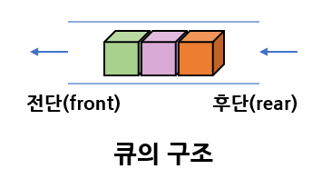
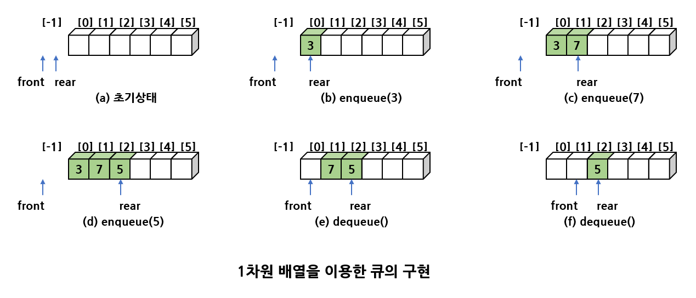
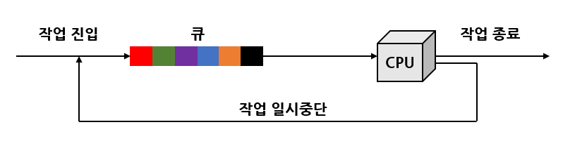
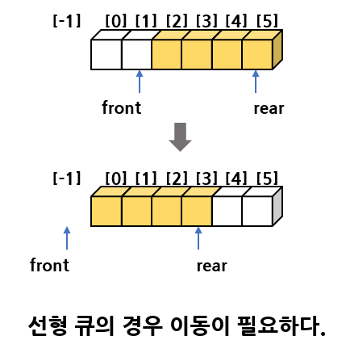
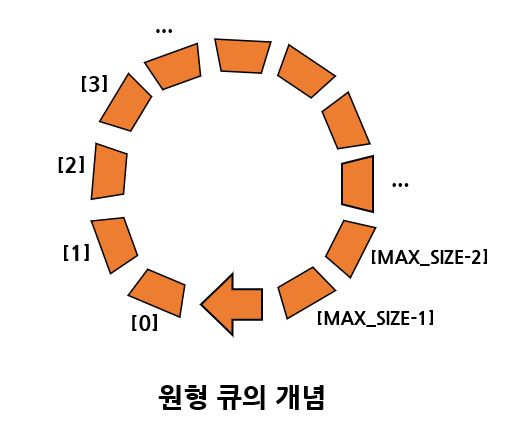
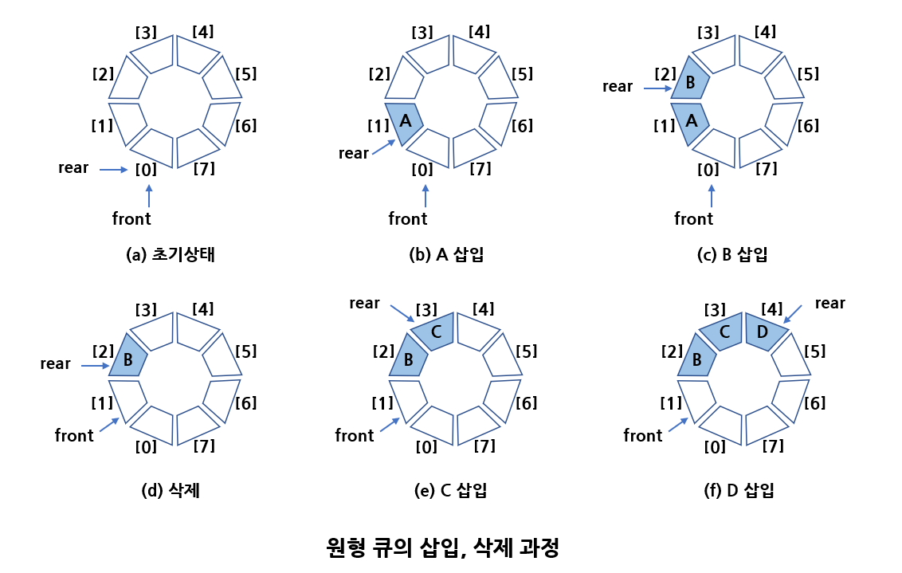
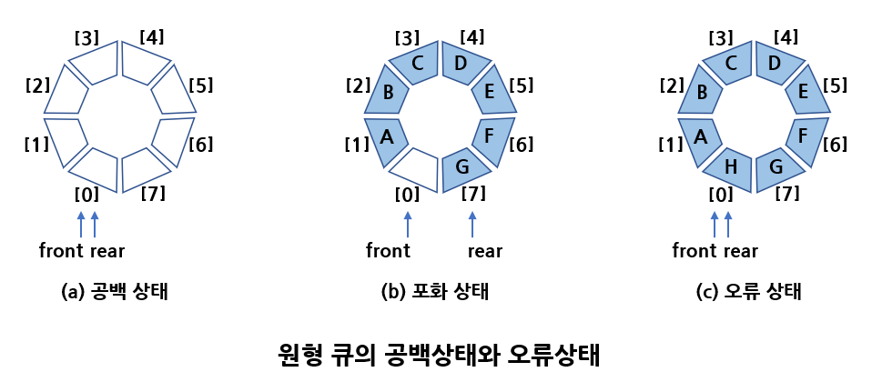
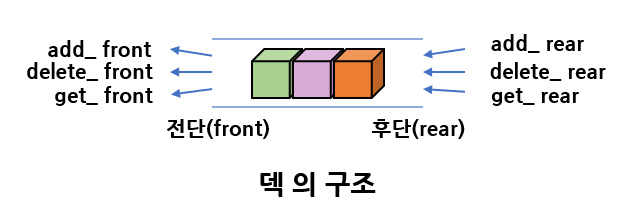
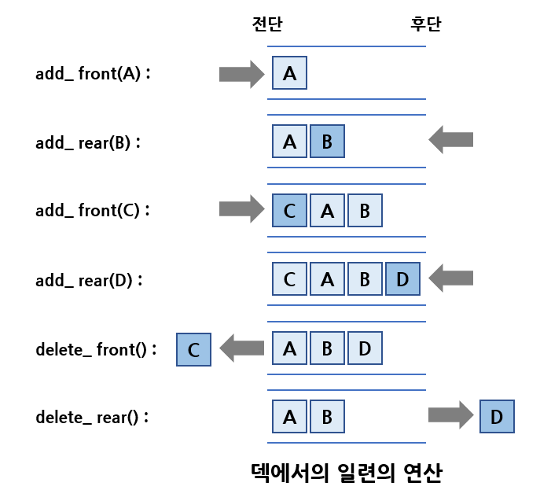
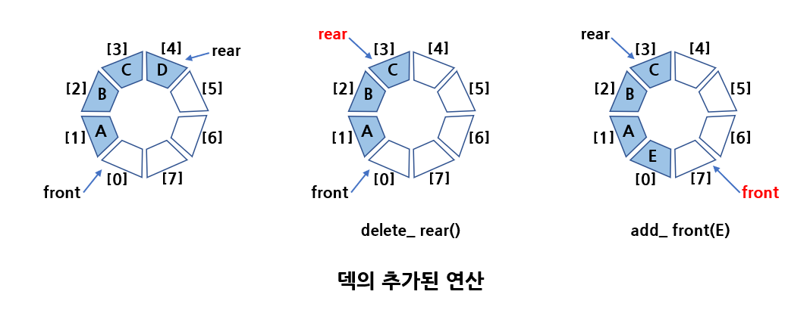

# 큐

# 1. 큐 추상 데이터 타입

스택의 경우, 나중에 들어온 데이터가 먼저 나가는 구조인데 반해 <b>큐(queue)</b>는 먼저 들어온 데이터가 먼저 나가는 구조로 이러한 특성을 <b>선입선출(FIFO : First-In First_Out)</b>이라고 한다.

큐의 예로는 매표소에서 표를 사기 위해 늘어선 줄을 들 수 있다.  
줄에 있는 사람들 중 가장 앞에 있는 사람이 가장 먼저 표를 사게 된다.

큐는 뒤에서 새로운 데이터가 추가되고 앞에서 하나씩 삭제되는 구조를 가지고 있다.  
구조상으로 큐가 스택과 다른 점은 스택의 경우 삽입과 삭제가 같인 쪽에서 일어나지만 큐에서는 삽입과 삭제가 다른 쪽에서 일어난다는 것이다.

다음 그림과 같이 큐에서 삽입이 일어나는 곳을 <b>후단(rear)</b>라 하고 삭제가 일어나는 곳을 <b>전단(front)</b>라고 한다.



추상 자료형 큐의 연산들은 추상 자료형 스택과 아주 유사하다. is_empty 연산은 큐가 비어있으면 TRUE를 반환하고, 그렇지 않으면 FALSE를 반환한다.  
is_full 연산은 큐가 가득 찼으면 TRUE를, 그렇지 않으면 FALSE를 반환한다.

```C
-객체: 0개 이상의 요소들로 구성된 선형 리스트
-연산:
	create(max_size)	::=
        최대 크기가 max_size인 공백큐를 생성한다.
	init(q)			::=
        큐를 초기화한다.
	is_empty(q)		::=
        if(size == 0) return TRUE;
	   else return FALSE;
	is_full(q)		::=
        if(size == max_size) return TRUE;
	   else return FALSE;
	enqueue(q, e)	::=
        if( is_full(q) ) queue_full 오류;
	   else q의 끝에 e를 추가한다.
	dequeue(q)		::=
        if( is_empty(q) ) queue_empty 오류;
	   else q의 맨 앞에 있는 e를 제거하여 반환한다.
	peek(q)			::=
        if( is_empty(q) ) queue_empty 오류;
	   else q의 맨 앞에 있는 e를 읽어서 반환한다.
```

가장 중요한 연산은 삽입과 삭제 연산인 enqueue와 dequeue이다.

enqueue 연산은 큐에 요소를 추가하는 연산으로서 큐의 맨 뒤에 새로운 요소를 추가한다.  
dequeue 연산은 큐의 맨 앞에 있는 요소를 꺼내서 외부로 반환한다.

보통 컴퓨터와 주변기기 사이에는 항상 큐가 존재한다.  
그 이유는 컴퓨터의 CPU와 주변기기 사이에는 속도 차이가 있기 때문에 CPU를 효율적으로 사용하기 위해 큐가 존재한다. 예를 들어 운영체제에 인쇄 작업큐가 존재하는데, 프린터는 속도가 늦고 상대적으로 컴퓨터의 CPU는 속도가 빠르기 때문에 CPU는 빠른 속도로 인쇄 데이터를 만든 다음, 인쇄 작업 큐에 저장하고 다른 작업으로 넘어간다.
프린터는 인쇄 작업 큐에서 데이터를 가져다가 인쇄한다.

큐도 스택과 마찬가지로 배열과 연결 리스트를 이용하여 구현할 수 있다.  
배열을 이용한 구현을 살펴보고, 뒤에서 연결 리스트를 이용한 구현을 살펴본다.

# 2. 선형큐

1차원 배열을 쓰는 방법을 먼저 살펴보면, 삽입, 삭제를 위한 변수인 front와 rear를 만든다.  
front는 큐의 첫 번째 요소를 가리키고 rear는 큐의 마지막 요소를 가리킨다.



front와 rear의 초기값은 -1이다. 데이터가 증가되면 rear를 하나 증가시키고 그 위치에 데이터가 저장된다.  
삭제할 때도 front를 하나 증가시키고 front가 가리키는 위치에 있는 데이터를 삭제한다.  
이러한 큐를 <b>선형큐(linear queue)</b>라고 한다.

## 선형큐의 구현

스택과 아주 유사하다.

```c
#include<stdio.h>
#include<stdlib.h>
#define MAX_QUEUE_SIZE 5

typedef int element;
typedef struct {            // 큐 타입
    int front;
    int rear;
    element data[MAX_QUEUE_SIZE];
} QueueType;

// 오류 함수
void error(char *message)
{
    fprintf(stderr, "%s\n", message);
    exit(1);
}

void init_queue(QueueType *q)
{
    q->rear = -1;
    q->front = -1;
}
void queue_print(QueueType *q)
{
    for (int i = 0; i < MAX_QUEUE_SIZE; i++) {
        if (i <= q->front || i > q->rear) {
            printf("  |  ");
        }
        else {
            printf("%d|  ", q->data[i]);
        }
    }
    printf("\n");
}

int is_full(QueueType *q)
{
    if (q->rear == MAX_QUEUE_SIZE - 1) {
        return 1;
    }
    else {
        return 0;
    }
}

int is_empty(QueueType *q)
{
    if (q->front == q->rear) {
        return 1;
    }
    else {
        return 0;
    }
}

void enqueue(QueueType *q, int item)
{
    if (is_full(q)) {
        error("큐가 포화상태입니다.");
        return;
    }
    q->data[++(q->rear)] = item;
}

element dequeue(QueueType *q)
{
    if (is_empty(q)) {
        error("큐가 공백상태입니다.");
        return -1;
    }
    return q->data[++(q->front)];
}

int main()
{
    int item = 0;
    QueueType q;

    init_queue(&q);

    enqueue(&q, 10); queue_print(&q);
    enqueue(&q, 20); queue_print(&q);
    enqueue(&q, 30); queue_print(&q);

    item = dequeue(&q); queue_print(&q);
    item = dequeue(&q); queue_print(&q);
    item = dequeue(&q); queue_print(&q);
    return 0;
}
```

## 선형 큐의 응용 : 작업 스케줄링

운영 체제는 많은 작업들을 동시에 실행해야 한다. 만약 CPU가 하나뿐이고 모든 작업들은 우선순위를 가지지 않는다고 가정하면 작업들은 운영체제에 들어간 순서대로 처리될 것이다. 이럴 때는 큐를 사용하여 작업들을 처리할 수 있다.



# 3. 원형큐

선형큐는 이해하기는 쉽지만 문제점이 있다. 즉 front와 rear의 값이 계속 증가만 하기 때문에 언젠가는 배열의 끝에 도달하게 되고 배열의 앞부분이 비어 있더라도 사용하지를 못한다는 점이 있다.

따라서 주기적으로 모든 요소들을 왼쪽으로 이동시켜야 한다.  
예를 들면 큐는 아래의 그림과 같은 상태에 있을 수 있고 오른쪽에 삽입을 위한 공간을 만들기 위해서는 모든 요소들을 왼쪽으로 이동시켜야 한다.  
이런 식으로 요소들을 이동시키면 해결은 되지만 매번 이동시키려면 상당한 시간이 걸리고 또한 프로그램 코딩이 복잡해진다.



이 문제는 배열을 선형으로 생각하지 말고 원형으로 생각하면 쉽게 해결된다.  
즉, front와 rear의 값이 배열의 끝인 (MAX_QUEUE_SIZE-1)에 도달하면 다음에 증가되는 값은 0이 되도록 하는 것이다.

즉 아래의 그림과 같이 배열이 원형으로 처음과 끝이 연결되어 있다고 생각하는 것이다.  
여기서 실제 배열이 원형으로 변화되는 것은 아니고 개념상으로 원형으로 배열의 인덱스를 변화시켜주는 것뿐이다.



원형큐에서는 front와 rear의 개념이 약간 변경된다. 먼저 초기값은 -1이아닌 0이다.

또한 front는 항상 큐의 첫 번째 요소의 하나 앞을, rear는 마지막 요소를 가리킨다.  
다음의 그림은 원형큐에서 데이터가 삽입, 삭제될 때 front와 rear가 어떻게 변화되는지를 보인 것이다.



front와  rear의 값이 같으면 원형 큐가 비어 있음을 나타낸다.

원형큐에서는 하나의 자리는 항상 비워둔다.  
왜냐하면 포화 상태와 공백 상태를 구별하기 위해서이다.  
만약 한 자리를 비워두지 않는다면 아래 그림처럼 되어 공백 상태와 포화 상태를 구분할 수 없게 된다.

따라서 원형 큐에서 만약 front==rear이면 공백 상태가 되고 만약 front가 rear보다 하나 앞에 있으면 포화상태가 된다.  
만약 요소들의 개수를 저장하고 있는 추가적인 변수 count변수를 사용할 수 있다면 한 자리를 비워두지 않아도 된다.



## 원형큐의 삽입, 삭제 알고리즘

삽입이나 삭제를 하기 전에 front와 rear를 원형 회전시켜 하나 증가시키고 증가된 위치에 데이터를 삽입 또는 삭제한다.

가장 중요한 것은 front와 rear를 원형으로 회전시켜야 한다는 것이다.  
이는 나머지 연산자 %를 이용해 쉽게 구현할 수 있다.

```C
front <- (front+1) % MAX_QUEUE_SIZE;
rear <- (rear+1) % MAX_QUEUE_SIZE;
```

만약 식에 의해 front와 rear 값은 (MAX_QUEUE_SIZE-1)에서 하나 증가되면 0으로 된다.  
만약 MAX_QUEUE_SIZE를 5로 정의하면, front와 rear 값은 0, 1, 2, 3, 4, 0과 같이 변화된다.

## 원형큐의 구현

원형큐를 C언어를 이용해 구현하면 밑에 있는 코드와 같다.

front는 첫 번째 요소 하나 앞을, rear는 마지막 요소를 가리킨다.  
따라서 삽입을 할 때는 rear를 무조건 먼저 하나 증가시키고 증가된 위치에 삽입을 하여야 하고,  
삭제를 할 때도 먼저 front를 증가시킨 다음, 그 위체에서 데이터를 꺼내 와야한다.

공백상태 검출은 front와 rear가 같으면 공백 상태로 판단할 수 있다.  
포화 상태 검출은 (rear+1)%MAX_QUEUE_SIZE 가 front와 같으면 포화상태라고 판단한다.

```C
#include<stdio.h>
#include<stdlib.h>

// ===== 원형큐 코드 =====
#define MAX_QUEUE_SIZE 5
typedef int element;
typedef struct {    // 큐 타입
    element data[MAX_QUEUE_SIZE];
    int front, rear;
} QueueType;

// 오류 함수
void error(char *message)
{
    fprintf(stderr, "%s\n", message);
    exit(1);
}

// 초기화 함수
void init_queue(QueueType *q)
{
    q->front = q->rear = 0;
}

// 공백 상태 검출 함수
int is_empty(QueueType *q)
{
    return (q->front == q->rear);
}

// 포화 상태 검출 함수
int is_full(QueueType *q)
{
    return ((q->rear + 1) % MAX_QUEUE_SIZE == q->front);
}

// 원형큐 출력 함수
void queue_print(QueueType *q)
{
    printf("QUEUE(front=%d read=%d) = ", q->front, q->rear);
    if (!is_empty(q)) {
        int i = q->front;
        do {
            i = (i + 1) % (MAX_QUEUE_SIZE);
            printf("%d | ", q->data[i]);
            if (i == q->rear) {
                break;
            }
        } while ( i != q->front);
    }
    printf("\n");
}

// 삽입 함수
void enqueue(QueueType *q, element item)
{
    if (is_full(q)) {
        error("큐가 포화상태입니다.");
    }
    q->rear = (q->rear + 1) % MAX_QUEUE_SIZE;
    q->data[q->rear] = item;
}

// 삭제 함수
element dequeue(QueueType *q)
{
    if (is_empty(q)) {
        error("큐가 공백상태입니다.");
    }
    q->front = (q->front + 1) % MAX_QUEUE_SIZE;
    return q->data[q->front];
}

// 피크 함수
element peek(QueueType *q)
{
    if (is_empty(q)) {
        error("큐가 공백상태입니다.");
    }
    return q->data[(q->front + 1) % MAX_QUEUE_SIZE];
}
// ===== 원형큐 코드 끝 =====

int main()
{
    QueueType queue;
    int element;

    init_queue(&queue);
    printf("--데이터 추가 단계--\n");
    while (!is_full(&queue)) {
        printf("정수를 입력하시오: ");
        scanf("%d", &element);
        enqueue(&queue, element);
        queue_print(&queue);
    }
    printf("큐는 포화상태입니다.\n\n");

    printf("--데이터 삭제 단계--\n");
    while (!is_empty(&queue)) {
        element = dequeue(&queue);
        printf("꺼내진 정수: %d \n", element);
        queue_print(&queue);
    }
    printf("큐는 공백상태입니다.\n");
    return 0;
}
```

# 4. 큐의 응용 : 버퍼

큐는 서로 다른 속도로 실행되는 두 프로세스 간의 상호작용을 조화시키는 버퍼 역할을 담당한다.

예를 들면 CPU와 프린터 사이의 프린팅 버퍼, 또는 CPU와 키보드 사이의 키보드 버퍼 등이 이에 해당한다.  
대개 데이터를 생산하는 생산자 프로세스가 있고, 데이터를 소비하는 소비자 프로세스가 있으며 이 사이에 큐로 구성되는 버퍼가 존재한다.  
다음과 같은 분야가 큐의 대표적인 응용 분야이다.

- 생산자 - 소비자 프로세스 : 큐를 버퍼로 사용한다.
- 교통 관리 시스템 : 컴퓨터로 제어되는 신호등에서는 신호등을 순차적으로 제어하는데 원형큐가 사용된다.
- CPU 스케줄링 : 운영체제는 실행 가능한 프로세스들을 저장하거나 이벤트를 기다리는 프로세스들을 저장하기 위해 몇 개의 큐를 사용한다.

큐에 일정한 비율(20%)로 난수를 생성해 큐에 입력하고, 일정한 비율(10%)로 큐에서 정수를 꺼내는 프로그램을 작성해보면, 생산자가 소비자보다 빠르므로 큐가 포화 상태가 될 가능성이 높아진다.

```C
#include<stdio.h>
#include<stdlib.h>
#include<time.h>

// ===== 원형큐 코드 =====
#define MAX_QUEUE_SIZE 5
typedef int element;
typedef struct {    // 큐 타입
    element data[MAX_QUEUE_SIZE];
    int front, rear;
} QueueType;

// 오류 함수
void error(char *message)
{
    fprintf(stderr, "%s\n", message);
    exit(1);
}

// 초기화 함수
void init_queue(QueueType *q)
{
    q->front = q->rear = 0;
}

// 공백 상태 검출 함수
int is_empty(QueueType *q)
{
    return (q->front == q->rear);
}

// 포화 상태 검출 함수
int is_full(QueueType *q)
{
    return ((q->rear + 1) % MAX_QUEUE_SIZE == q->front);
}

// 원형큐 출력 함수
void queue_print(QueueType *q)
{
    printf("QUEUE(front=%d read=%d) = ", q->front, q->rear);
    if (!is_empty(q)) {
        int i = q->front;
        do {
            i = (i + 1) % (MAX_QUEUE_SIZE);
            printf("%d | ", q->data[i]);
            if (i == q->rear) {
                break;
            }
        } while ( i != q->front);
    }
    printf("\n");
}

// 삽입 함수
void enqueue(QueueType *q, element item)
{
    if (is_full(q)) {
        error("큐가 포화상태입니다.");
    }
    q->rear = (q->rear + 1) % MAX_QUEUE_SIZE;
    q->data[q->rear] = item;
}

// 삭제 함수
element dequeue(QueueType *q)
{
    if (is_empty(q)) {
        error("큐가 공백상태입니다.");
    }
    q->front = (q->front + 1) % MAX_QUEUE_SIZE;
    return q->data[q->front];
}

// 피크 함수
element peek(QueueType *q)
{
    if (is_empty(q)) {
        error("큐가 공백상태입니다.");
    }
    return q->data[(q->front + 1) % MAX_QUEUE_SIZE];
}
// ===== 원형큐 코드 끝 =====

int main()
{
    QueueType queue;
    int element;

    init_queue(&queue);
    srand(time(NULL));

    for (int i = 0; i < 100; i++) {
        if (rand() % 5 == 0) {      // 5로 나누어 떨어지면
            enqueue(&queue, rand()%100);
        }
        queue_print(&queue);
        if (rand() % 10 == 0) {     // 10로 나누어 떨어지면
            int data = dequeue(&queue);
        }
        queue_print(&queue);
    }
    return 0;
}
```

# 5. 덱이란?

<b>덱(deque)</b>은 duble-ended queue의 줄임말로 큐의 전단(front)과 후단(rear)에서 모두 삽입과 삭제가 가능한 큐 이다. 하지만 여전히 중간에 삽입하거나 삭제하는 것은 허용하지 않는다.  
밑의 그림은 덱의 구조를 보여준다.



## 덱의 추상 자료형

덱을 추상 자료형으로 정의하면

```C
-객체: n개의 element형의 요소들의 순서 있는 모임
-연산:
	create() ::= 덱을 생성한다.
	init(dq) ::= 덱을 초기화한다.
	is_empty(dq) ::= 덱이 공백 상태인지를 검사한다.
	is_full(dq) ::= 덱이 포화 상태인지를 검사한다.
	add_front(dq, e) ::= 덱의 앞에 요소를 추가한다.
	add_rear(dq, e) ::= 덱의 뒤에 요소를 추가한다.
	delete_front(dq) ::= 덱의 앞에 있는 요소를 반환한 다음 삭제한다.
	delete_rear(dq) ::= 덱의 뒤에 있는 요소를 반환한 다음 삭제한다.
	get_front(q)	::= 덱의 앞에서 삭제하지 않고 앞에 있는 요소를 반환한다.
	get_rear(q)		::= 덱의 뒤에서 삭제하지 않고 뒤에 있는 요소를 반환한다.
```

덱은 스택과 큐의 연산들을 모두 가지고 있다.  
예를 들면 add_front와 delete_front 연산은 스택의 push, pop연산과 동일하다.  
또한 add_rear 연산과 delete_front 연산은 각각 큐의 enqueue와 dequeue 연산과 같다.

추가로 덱은 get_front, get_rear, delete_rear 연산을 갖는다.  
따라서 덱은 스택이나 큐에 비해 융통성이 더 많은 자료구조로 볼 수 있다.

만약 덱의 전단과 관련된 연산들만을 사용하면 스택이 되고, 삽입은 후단, 삭제는 전단만을 사용하면 큐로 동작한다.

밑에 있는 그림은 공백 상태의 덱에 일련의 연산들이 수행되는 예를 보여주고 있다.



## 배열을 이용한 덱의 구현

원형 큐와 덱은 공통점이 많은데, 원형 큐를 확장하면 덱도 손쉽게 구현할 수 있다.  
덱도 원형 큐와 같이 전단과 후단을 사용한다.  
따라서 큐에서 사용한 배열 data와 front, rear를 그대로 사용하면 되고, 추가적인 데이터는 필요 없다.

```C
#define MAX_DEQUE_SIZE 5
typedef int element;
typedef struct {	// 덱 타입
    element data[MAX_QUEUE_SIZE];
    int front, rear;
} DequeType
```

원형 큐에서 그대로 사용할 수 있는 많은 연산들이 있다.  
is_empty(), is_full(), size(), init_queue(), print_deque(), add_rear(), delete_front(), get_front() 등은 원형 큐의 연산들과 동일하다. 예를 들어 add_rear()는 enqueue()와 동일하다.

덱에서 새롭게 추가된 연산에는 delete_rear(), add_front(), get_rear()가 있는데, get_rear()가 가장 간단한데,  
공백 상태가 아닌 경우 rear가 가리키는 항목을 반환한다.

delete_rear()와 add_front()에서는 원형 큐와 다르게 반대 방향의 회전이 필요하다.  
front나 rear를 감소시켜야 하는데, 만약 음수가 되면 MAX_QUEUE_SIZE를 더해주어야 한다.

따라서 front나 rear는 다음과 같이 변경된다.

```C
front <- (front-1 + MAX_QUEUE_SIZE) % MAX_QUEUE_SIZE;
rear <- (rear-1 + MAX_QUEUE_SIZE) % MAX_QUEUE_SIZE;
```



전체 코드

```C
#include<stdio.h>
#include<stdlib.h>

#define MAX_QUEUE_SIZE 5
typedef int element;
typedef struct {    // 큐 타입
    element data[MAX_QUEUE_SIZE];
    int front, rear;
} DequeType;

// 오류 함수
void error(char *message)
{
    fprintf(stderr, "%s\n", message);
    exit(1);
}

// 초기화 함수
void init_queue(DequeType *q)
{
    q->front = q->rear = 0;
}

// 공백 상태 검출 함수
int is_empty(DequeType *q)
{
    return (q->front == q->rear);
}

// 포화 상태 검출 함수
int is_full(DequeType *q)
{
    return ((q->rear + 1) % MAX_QUEUE_SIZE == q->front);
}

// 원형큐 출력 함수
void deque_print(DequeType *q)
{
    printf("QUEUE(front=%d read=%d) = ", q->front, q->rear);
    if (!is_empty(q)) {
        int i = q->front;
        do {
            i = (i + 1) % (MAX_QUEUE_SIZE);
            printf("%d | ", q->data[i]);
            if (i == q->rear) {
                break;
            }
        } while ( i != q->front);
    }
    printf("\n");
}

// 삽입 함수
void add_rear(DequeType *q, element item)
{
    if (is_full(q)) {
        error("큐가 포화상태입니다.");
    }
    q->rear = (q->rear + 1) % MAX_QUEUE_SIZE;
    q->data[q->rear] = item;
}

// 삭제 함수
element delete_front(DequeType *q)
{
    if (is_empty(q)) {
        error("큐가 공백상태입니다.");
    }
    q->front = (q->front + 1) % MAX_QUEUE_SIZE;
    return q->data[q->front];
}

// get 함수
element get_front(DequeType *q)
{
    if (is_empty(q)) {
        error("큐가 공백상태입니다.");
    }
    return q->data[(q->front + 1) % MAX_QUEUE_SIZE];
}

void add_front(DequeType *q, element val)
{
    if (is_full(q)) {
        error("큐가 포화상태입니다.");
    }
    q->data[q->front] = val;
    q->front = (q->front - 1 + MAX_QUEUE_SIZE) % MAX_QUEUE_SIZE;
}

element delete_rear(DequeType *q)
{
    int prev = q->rear;
    if (is_empty(q)) {
        error("큐가 공백상태입니다.");
    }
    q->rear = (q->rear - 1 + MAX_QUEUE_SIZE) % MAX_QUEUE_SIZE;
    return q->data[prev];
}

element get_rear(DequeType *q)
{
    if (is_empty(q)) {
        error("큐가 공백상태입니다.");
    }
    return q->data[q->rear];
}

int main()
{
    DequeType queue;

    init_queue(&queue);
    for (int i = 0; i < 3; i++) {
        add_front(&queue, i);
        deque_print(&queue);
    }
    for (int i = 0; i < 3; i++) {
        delete_rear(&queue);
        deque_print(&queue);
    }
    return 0;
}
```

# 6. 큐의 응용 : 시뮬레이션

큐는 주로 컴퓨터로 큐잉이론에 따라 시스템의 특성을 시뮬레이션하여 분석하는 데 이용된다.  
큐잉모델은 고객에 대한 서비스를 수행하는 서버와 서비스를 받는 고객들로 이루어진다.

제한된 수의 서버 때문에 고객들은 서비스를 받기 위하여 대기 행렬에서 기다리게 된다. 이 대기 행렬이 큐로 구현된다.

대기 행렬이란 상점이나 극장, 세차장 같은 곳에서 서비스를 받기 위해 기다리는 줄을 의미한다.  
은행에서 고객이 들어와 서비스를 받고 나가는 과정을 시뮬레이션해보면, 우리에게 필요한 것은 고객들이 기다리는 평균시간이 얼마나 되느냐이다.

만약 기다리는 시간이 너무 길다면 행원을 더 투입하여 대기시간을 줄여야 할 것이다.

최대한 간단하게 설정해 시뮬레이션의 핵심적 내용만 알아보면, 먼저 서비스 하는 행원은 한사람이라고 가정한다.  
고객의 대기행렬은 큐로 시뮬레이션 된다. 주어진 시간동안 고객은 랜덤한 간격으로 큐에 들어온다.  
고객들의 서비스 시간도 한계값 안에서 랜덤하게 결정된다. 큐에 들어있는 고객들은 순서대로 서비스를 받는다.

한 고객의 서비스가 끝나면 큐의 맨 앞에 있는 다른 고객이 서비스를 받기 시작한다. 정해진 시간동안 시뮬레이션이 끝나면 고객들의 평균시간을 계산해 출력한다.

시뮬레이션은 하나의 반복 루프로 이루어진다.

1. 먼저 현재시각을 나타내는 clock이라는 변수를 하나 증가한다.
2. [0, 10]사이의 난수를 생성해 3보다 작으면 새로운 고객이 들어왔다고 판단한다.  
   새로운 고객이 들어오면 구조체를 생성하고 고객의 아이디, 도착시간, 서비스 시간 등의 정보를 복사한다.  
   여기서 고객이 필요로 하는 서비스 시간도 역시 난수로 생성한다. 이 구조체를 enqueue()를 호출하여 큐에 추가한다. 전역 변수인 service_time에 현재 처리 중인 고객의 서비스 시간을 저장해둔다.
3. service_time이 0인지 아닌지를 살펴본다. 만약 service_time이 0이 아니면 어떤 고객이 지금 서비스를 받고 있는 중임을 의미한다. clock이 하나 증가했으므로 service_time을 하나 감소시킨다. 만약 service_time이 0이면 현재 서비스 받는 고객이 없다는 것을 의미한다. 따라서 큐에서 고객 구조체를 하나 꺼내어 서비스를 시작한다.  
   즉 서비스를 시작한다는 의미는 전역 변수 service_time에 고객의 서비스 시간을 저장한다는 것이다.  
   보다 복잡한 처리를 시뮬레이션하려면 코드를 추가해야 한다.
4. 60분의 시간이 지나면 고객들이 기다린 시간을 전부 합해 화면에 출력한다.

```c
#include<stdio.h>
#include<stdlib.h>
#include<time.h>

// ===== 원형큐 코드 시작 =====
typedef struct {    // 요소 타입
    int id;
    int arrival_time;
    int service_time;
}element;           // 교체!
#define MAX_QUEUE_SIZE 5
typedef struct { // 큐 타입
	element  data[MAX_QUEUE_SIZE];
	int  front, rear;
} QueueType;

// 오류 함수
void error(char *message)
{
    fprintf(stderr, "%s\n", message);
    exit(1);
}

// 초기화 함수
void init_queue(QueueType *q)
{
    q->front = q->rear = 0;
}

// 공백 상태 검출 함수
int is_empty(QueueType *q)
{
    return (q->front == q->rear);
}

// 포화 상태 검출 함수
int is_full(QueueType *q)
{
    return ((q->rear + 1) % MAX_QUEUE_SIZE == q->front);
}

// 원형큐 출력 함수
void queue_print(QueueType *q)
{
    printf("QUEUE(front=%d read=%d) = ", q->front, q->rear);
    if (!is_empty(q)) {
        int i = q->front;
        do {
            i = (i + 1) % (MAX_QUEUE_SIZE);
            printf("%d | ", q->data[i]);
            if (i == q->rear) {
                break;
            }
        } while ( i != q->front);
    }
    printf("\n");
}

// 삽입 함수
void enqueue(QueueType *q, element item)
{
    if (is_full(q)) {
        error("큐가 포화상태입니다.");
    }
    q->rear = (q->rear + 1) % MAX_QUEUE_SIZE;
    q->data[q->rear] = item;
}

// 삭제 함수
element dequeue(QueueType *q)
{
    if (is_empty(q)) {
        error("큐가 공백상태입니다.");
    }
    q->front = (q->front + 1) % MAX_QUEUE_SIZE;
    return q->data[q->front];
}

// 피크 함수
element peek(QueueType *q)
{
    if (is_empty(q)) {
        error("큐가 공백상태입니다.");
    }
    return q->data[(q->front + 1) % MAX_QUEUE_SIZE];
}
// ===== 원형큐 코드 끝 =====

int main()
{
    int minutes = 60;
    int total_wait = 0;
    int total_customers = 0;
    int service_time = 0;
    int service_customer;
    QueueType queue;
    init_queue(&queue);

    srand(time(NULL));
    for (int clock = 0; clock < minutes; clock++) {
        printf("현재시각=%d\n", clock);
        if ((rand())%10 < 3) {
            element customer;
            customer.id = total_customers++;
            customer.arrival_time = clock;
            customer.service_time = rand() % 3 + 1;
            enqueue(&queue, customer);
            printf("고객 %d이 %d분에 들어옵니다. 업무처리시간 = %d분\n",
                customer.id, customer.arrival_time, customer.service_time);
        }
        if (service_time > 0) {
            printf("고객 %d 업무처리중입니다. \n", service_customer);
            service_time--;
        }
        else {
            if (!is_empty(&queue)) {
                element customer = dequeue(&queue);
                service_customer = customer.id;
                service_time = customer.service_time;
                printf("고객 %d이 %d분에 업무를 시작합니다. 대기시간은 %d분이었습니다.\n",
                    customer.id, clock, clock - customer.arrival_time);
                total_wait += clock - customer.arrival_time;
            }
        }
    }
    printf("전체 대기 시간 = %d분 \n", total_wait);
    return 0;
}
```

