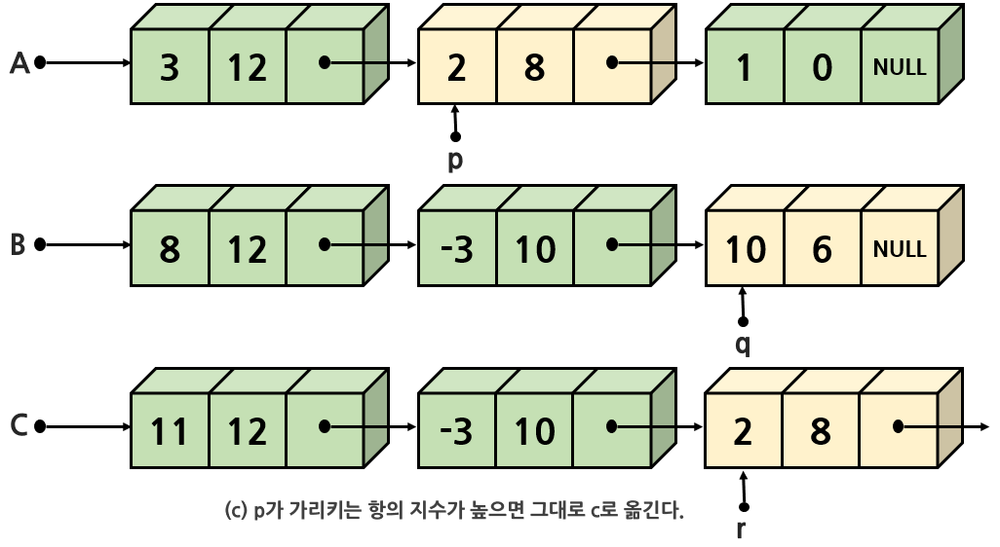

# 연결리스트 1

# 1. 리스트 추상 데이터 타입

## 리스트의 소개

<b>리스트(list)</b>는 우리들이 자료를 정리하는 방법 중의 하나이다.

예를 들어 오늘 해야할일이나 쇼핑해야할 항목들을 리스트로 관리한다. 다음과 같은 것들이 전형적인 리스트이다.

- 오늘 해야 할 일 : (청소, 쇼핑, 영화관람)
- 버킷 리스트 : (세계여행하기, 새로운 언어 배우기, 마라톤 뛰기)
- 요일들 : (일요일, 월요일, ..., 토요일)
- 카드 한 벌의 값 : (Ace, 2, 3, ..., King)

리스트에는 항목들이 차례대로 저장되어 있다. 리스트의 항목들은 순서 또는 위치를 가진다.  
앞에서 했던 스택과 큐도 넓게 보면 리스트의 일종이다. 리스트는 기호로 다음과 같이 표현한다.  
리스트는 집합하고는 다르다. 집합은 각 항목 간에 순서의 개념이 없다.

L = ( item<sub>0</sub>, item<sub>1</sub>, item<sub>2</sub>, ..., item<sub>n-1</sub> )​

이런 리스트를 가지고 할 수 있는 연산들 중 다음과 같은 기본적인 연산들을 생각할 수 있다.

- 리스트에 새로운 항목을 추가한다(삽입 연산).
- 리스트에서 항목을 삭제한다(삭제 연산).
- 리스트에서 특정한 항목을 찾는다(탐색 연산).

## 리스트 ADT

다음은 리스트를 추상 데이터 타입으로 정의한 것이다.


## 리스트의 구현

리스트는 배열과 연결 리스트를 이용해 구현할 수 있다.

배열을 이용하면 리스트 ADT를 가장 간단하게 구현할 수 있다.  
하지만 크기가 고정되는 점이 단점이다.

다른 방법으로는 포인터를 이용하여 연결 리스트를 만드는 방법이 있다.  
연결 리스트는 필요할 때마다 중간에 속지를 추가해서 사용할 수 있는 바인더 공책과 비슷하다.


배열을 사용하여 리스트를 구현하면 장점과 단점이 존재한다.  
장점은 구현이 간단하고 속도가 빠르다.

단점으로는 리스트의 크기가 고정이 되는 것이다.  
즉 배열의 특성상 동적으로 크기를 늘리거나 줄이는 것이 힘들다.

따라서 만약 데이터를 추가하고 싶은데 더 이상 남은 공간이 없다면 문제가 발생한다.  
물론 메모리 공간이 부족해지면 더 큰 배열을 만들어 기존 배열의 데이터들을 전부 복사하면 되지만 이것은 CPU시간을 낭비하게 된다. 또한 리스트의 중간에 새로운 데이터를 삽입하거나 삭제하기 위해서는 기존의 데이터들을 이동해야 한다.

연결 리스트는 크기가 제한되지 않고, 중간에서 쉽게 삽입하거나 삭제할 수 있는 유연한 리스트를 구현할 수 있다.  
하지만 구현이 복잡하고, 임의의 항목을 추출하려고 할 때는 배열을 사용하는 방법보다 시간이 많이 걸린다.

# 2. 배열로 구현된 리스트

배열로 이용해 리스트를 구현하면 순차적인 메모리 공간이 할당되므로, 이것을 리스트의 순차적 표현이라고도 한다. 배열을 사용하면 리스트의 항목을 아주 자연스럽게 저장할 수 있다.

## 리스트의 정의

배열로 리스트를 구현하기 위해 배열과 항목의 개수를 구조체로 묶어 ArrayListType이라는 새로운 타입을 정의한다.

```C
#define MAX_LIST_SIZE 100	// 리스트의 최대크기

typedef int element;		// 항목의 정의
typedef struct {
    element array[MAX_LIST_SIZE]; // 배열 정의
    int size;					// 현재 리스트에 저장된 항목들의 개수
} ArrayListType;
```

## 기초 연산

리스트의 연산들을 함수로 구현해본다. 모든 연산은 구조체 포인터를 받는다.  
그 이유는 함수 안에서 구조체를 변경할 필요도 있기 때문이다. 포인터를 사용하지 않으면 구조체의 복사본이 전달되어 원본 구조체를 변경할 수 없다.

```C
// 오류 처리 함수
void error(char *message)
{
    fprintf(stderr, "%s\n", message);
    exit(1);
}

// 리스트 초기화 함수
void init(ArrayListType *L)
{
    L->size = 0;
}

// 리스트가 비어 있으면 1을 반환
// 그렇지 않으면 0을 반환
int is_empty(ArrayListType *L)
{
    return L->size == 0;
}

// 리스트가 가득 차 있으면 1을 반환
// 그렇지 않으면 1을 반환
int is_full(ArrayListType *L)
{
    return L->size == MAX_LIST_SIZE;
}

element get_entry(ArrayListType *L, int pos)
{
    if (pos < 0 || pos >= L->size) {
        error("위치 오류");
    }
    return L->array[pos];
}
// 리스트 출력
void print_list(ArrayListType *L)
{
    for (int i = 0; i < L->size; i++) {
        printf("%d->", L->array[i]);
    }
    printf("\n");
}
```

## 항목 추가 연산

```C
void insert_last(ArrayListType *L, element item)
{
    if (L->size >= MAX_LIST_SIZE) {
        error("리스트 오버플로우");
    }
    L->array[L->size++] = item;
}
```

insert_last() 함수에서는 리스트에 빈공간이 없으면 오류를 발생시킨다.

리스트의 pos위치에 새로운 항목을 추가하려면 pos번째부터 마지막 항목까지 한 칸씩 오른쪽으로 이동하여 빈자리를 만든 후에, 새로운 항목을 pos위치에 저장하여야 한다.


위의 그림은 pos = 1에 새로운 항목을 추가하는 것이다. 빈자리를 만들기 위해 array[1] 부터 array[3]까지를 한 칸씩 오른쪽으로 이동한다. 이때 순서가 중요한데, 먼저 array[3]을 array[4]로 이동하고 이어서 array[2]를 array[3]으로, array[1]을 array[2]로 이동해야 한다. 이어서 새로운 항목을 array[1]에 저장한다.

임의의 위치에 삽입하는 insert() 함수를 보면 아래와 같다.

```C
void insert(ArrayListType *L, int pos, element item)
{
    if (!is_full(L) && (pos >= 0) && (pos <= L->size)) {
        for (int i = (L->size - 1); i >= pos; i--) {
            L->array[i + 1] = L->array[i];
        }
        L->array[pos] = item;
        L->size++;
    }
}
```

## 항목 삭제 연산

pos 위치의 항목을 삭제하는 delete(list, pos)를 구현해보면, 이때도 마찬가지로 삭제한 후에 array[pos+1]부터
array[size-1]까지를 한 칸씩 앞으로 이동해야 한다.


## 테스트 프로그램

```C
#include<stdio.h>
#include<stdlib.h>
#define MAX_LIST_SIZE 100

typedef int element;
typedef struct {
    element array[MAX_LIST_SIZE];
    int size;
} ArrayListType;

// 오류 처리 함수
void error(char *message)
{
    fprintf(stderr, "%s\n", message);
    exit(1);
}

// 리스트 초기화 함수
void init(ArrayListType *L)
{
    L->size = 0;
}

// 리스트가 비어 있으면 1을 반환
// 그렇지 않으면 0을 반환
int is_empty(ArrayListType *L)
{
    return L->size == 0;
}

// 리스트가 가득 차 있으면 1을 반환
// 그렇지 않으면 1을 반환
int is_full(ArrayListType *L)
{
    return L->size == MAX_LIST_SIZE;
}

element get_entry(ArrayListType *L, int pos)
{
    if (pos < 0 || pos >= L->size) {
        error("위치 오류");
    }
    return L->array[pos];
}
// 리스트 출력
void print_list(ArrayListType *L)
{
    for (int i = 0; i < L->size; i++) {
        printf("%d->", L->array[i]);
    }
    printf("\n");
}

void insert_last(ArrayListType *L, element item)
{
    if (L->size >= MAX_LIST_SIZE) {
        error("리스트 오버플로우");
    }
    L->array[L->size++] = item;
}

void insert(ArrayListType *L, int pos, element item)
{
    if (!is_full(L) && (pos >= 0) && (pos <= L->size)) {
        for (int i = (L->size - 1); i >= pos; i--) {
            L->array[i + 1] = L->array[i];
        }
        L->array[pos] = item;
        L->size++;
    }
}

element delete(ArrayListType *L, int pos)
{
    element item;

    if (pos < 0 || pos >= L->size) {
        error("위치 오류");
    }
    item = L->array[pos];
    for (int i = pos; i < (L->size -1); i++) {
        L->array[i] = L->array[i + 1];
    }
    L->size--;
    return item;
}

int main()
{
    // ArrayListType을 정적으로 생성하고 ArrayListType를
    // 가리키는 포인터를 함수의 매개변수로 전달한다.
    ArrayListType list;

    init(&list);
    insert(&list, 0, 10); print_list(&list); // 0번째 위치에 10 추가
    insert(&list, 0, 20); print_list(&list); // 0번째 위치에 10 추가
    insert(&list, 0, 30); print_list(&list); // 0번째 위치에 10 추가
    insert_last(&list, 40);print_list(&list); // 맨 끝에 40 추가
    delete(&list, 0);   print_list(&list); // 0번째 항목 삭제
    return 0;
}
```

## 실행 시간 분석

배열로 구현한 리스트의 시간 복잡도는 임의의 항목에 접근하는 연산인 get_entry 연산은 인덱스를 사용해 항목에 바로 접근할 수 있으므로 명백히 O(1)이다. 삽입이나 삭제 연산은 다른 항목들을 이동하는 경우가 많으므로 최악의 경우O(n)이 된다. 예를 들어 리스트가 거의 차있고 새로운 항목을 맨 처음에 삽입하는 경우가 그렇다.  
하지만 리스트의 맨 끝에 삽입하는 경우는 O(1)이다.

# 3. 연결 리스트

동적으로 크기가 변할 수 있고, 삭제나 삽입 시 데이터를 이동할 필요가 없는 연결로 된 표현은 포인터를 사용해 데이터들을 연결한다. 연결된 표현은 널리 사용되며 다른 여러 가지의 자료구조(트리, 그래프, 스택, 큐) 등을 구현하는데도 많이 사용이 된다.


위 그림처럼 연결된 표현은 줄로 연결된 상자라고 생각할 수 있다.

상자 안에는 데이터가 들어가고 상자에 연결된 줄을 따라가면 다음 상자를 찾을 수 있다.  
연결된 표현은 일단 데이터를 한군데 모아두는 것을 포기하는 것이다.  
데이터들은 메인 메모리상의 어디에나 흩어져 존재할 수 있다.  
이런 식으로 물리적으로 흩어져 있는 자료들을 서로 연결하여 하나로 묶는 방법을 <b>연결 리스트(linked list)</b>라 한다. 상자를 연결하는 줄은 <b>포인터(pointer)</b>로 구현한다.

배열을 이용한 리스트에서 가장 문제가 되었던 중간에 삽입하는 문제를 생각해보면, 연결 리스트에서는 앞뒤에 있는 데이터들을 이동할 필요가 없이 줄만 변경시켜주면 된다.


삭제 시에도 마찬가지로 밑의 그림과 같이 항목 C를 삭제하려고 하면 데이터들을 옮길 필요가 없이 그냥 데이터들을 연결하는 줄만 수정하면 된다.


하나의 프로그램 안에는 동시에 여러 개의 연결 리스트가 존재할 수 있다.  
이런 경우, 연결리스트를 구별하는 것은 첫 번째 데이터이다.  
첫 번째 데이터만 알 수 있으면 연결 리스트의 나머지 데이터들은 줄만 따라가면 얻을 수 있다.

연결 리스트의 또 하나의 장점은 데이터를 저장할 공간이 필요할 때마다 동적으로 공간을 만들어서 쉽게 추가할 수 있다. 이것은 순차적인 표현 방법인 배열에 비하면 상당한 장점이다.

그러나 배열에 비해 상대적으로 구현이 어렵고 오류가 나기 쉬운 것은 단점이다.  
또 데이터뿐만 아니라 포인터도 저장해야 하므로 메모리 공간을 많이 사용한다.

또 i번째 데이터를 찾으려면 앞에서부터 순차적으로 접근해야 한다.

## 연결 리스트의 구조

위에서 보았던 그림에서, 상자를 <b>노드(node)</b>라고 부른다. 연결 리스트는 이 노드들의 집합이다.

노드들은 메모리의 어떤 위치에나 있을 수 있으며 다른 노드로 가기 위해서는 현재 노드가 가지고 있는 포인터를 이용하면 된다. 노드는 아래 그림과 같이 <b>데이터 필드(data field)</b>와 <b>링크 필드(link field)</b> 로 구성되어 있다.


**데이터 필드**에는 저장하고 싶은 데이터가 들어간다.  
데이터는 정수가 될 수도 있고 구조체와 같은 복잡한 데이터가 될 수도 있다.

**링크 필드**에는 다른 노드를 가리키는 포인터가 저장된다.  
이 포인터를 이용해 다음 노드로 건너갈 수 있다.

연결 리스트에서는 연결 리스트의 첫 번째 노드를 알아야 만이 전체의 노드에 접근할 수 있다.  
따라서 연결 리스트마다 첫 번째 노드를 가리키고 있는 변수가 필요한데 이것을 <b>헤드 포인터(head pointer)</b>라 한다.

마지막 노드의 링크 필드는 NULL으로 설정되는데 이는 더 이상 연결된 노드가 없다는 것을 의미한다.  
연결 리스트들의 노드들은 필요할 때마다 malloc()을 이용해 동적으로 생성된다.

## 연결 리스트의 종류

연결리스트는 아래 그림과 같은 3가지 종류의 연결 리스트가 있다.

<b>단순 연결 리스트(singly linked list)</b>는 하나의 방향으로만 연결되어 있는 연결 리스트이다. 체인(chain)이라고도 한다. 단순 연결 리스트에서 마지막 노드의 링크는 NULL값을 가진다.

<b>원형 연결 리스트(circular linked list)</b>는 단순 연결 리스트와 같으나 마지막 노드의 링크가 첫 번째 노드를 가리킨다.

<b>이중 연결 리스트(doubly linked list)</b>는 각 노드마다 2개의 링크가 존재한다.  
하나의 링크는 앞에 있는 노드를 가리키고 또 하나의 링크는 뒤에 있는 노드를 가리킨다.


우선 단순 연결 리스트만을 알아보자.

# 4. 단순 연결 리스트

<b>단순 연결 리스트</b>에서는 노드들이 하나의 링크 필드를 가지며 이 링크 필드를 이용해 모든 노드들이 연결되어 있다. 마지막 노드의 링크 필드 값은 NULL이 된다.

예를 들어 아래 그림에서는 정수 10, 30, 40이 단순 연결 리스트에 저장되어 있다.


단순 연결 리스트를 C언어로 구현하기 위해서는 다음과 같은 질문에 답해야 한다.

- 노드는 어떻게 정의할 것인가? → 자기 참조 구조체를 이용한다.
- 노드는 어떻게 생성할 것인가? → malloc()을 호출해 동적 메모리로 생성한다.
- 노드는 어떻게 삭제할 것인가? → free()를 호출해 동적 메모리를 해제한다.

## 노드의 정의

노드는 자기 <b>참조 구조체</b>를 이용해 정의된다.

자기 참조 구조체란 자기 자신을 참조하는 포인터를 포함하는 구조체이다.  
구조체 안에는 데이터를 저장하는  data필드와 포인터가 저장되어 있는 link 필드가 존재한다.

data필드는 element타입의 데이털르 저장하고 있다.  
link필드는 ListNode를 가리키는 포인터로 정의되며 다음 노드의 주소가 저장된다.

```C
typedef int element;

typedef struct _ListNode {  // 노드 타입을 구조체로 정의
    element data;
    struct _ListNode *link;
} ListNode;
```

위의 코드는 노드의 구조는 정의하였지만 아직 노드는 생성되지 않았다.

구조체 ListNode는 노드를 만들기 위한 설계도에 해당된다.  
ListNode를 가지고 실제 구조체를 생성하려면 구조체 변수를 선언해야 한다.

## 공백 리스트의 생성

단순 연결 리스트는 헤드 포인터만 있으면 모든 노드를 찾을 수 있다.  
따라서 다음과 같이 노드를 가리키는 포인터 head를 정의하면 하나의 단순 연결 리스트가 만들어 졌다고 볼 수 있다. 현재는 노드가 없으므로 head의 값은 NULL이 된다.

```C
ListNode *head = NULL;
```

어떤 리스트가 공백인지를 검사하려면 헤드 포인터가 NULL인지를 검사하면 된다.

## 노드의 생성

일반적으로 연결 리스트에서는 필요한 때마다 동적 메모리 할당을 이용해 노드를 동적으로 생성한다.  
다음의 코드는 malloc()함수를 이용해 노드의 크기만큼 동적 메모리를 할당받는다.  
이 동적 메모리가 하나의 노드가 되며 동적 메모리의 주소를 헤드 포인터인 head에 저장한다.

```C
head = (ListNode *)malloc(sizeof(ListNode));
```

위의 코드까지 실행이 되면 아래 의 그림처럼 노드가 하나 생성이 되는데, 아직도 노드에는 아무것도 채워지지 않았다.


다음으로 새로 만들어진 노드에 데이터를 저장하고 링크필드를 NULL로 설정하는 것이다.

```C
head->data = 10;
head->link = NULL;
```

그러면 아래그림과 같이 된다.


## 노드의 연결

일반적으로 연결 리스트에는 여러 개의 노드가 서로 연결되어 있다.  
따라서 동일한 방식으로 두번째 노드를 동적으로 생성하고 노드에 20을 저장해보면 다음과 같다.

```C
ListNode *p;
p = (ListNode *)malloc(sizeof(ListNode));
p->data = 20;
p->link = NULL;
```


2개의 노드를 연결하려면, head→link에 p를 저장하면 첫 번째 노드의 링크가 두 번째 노드를 가리키게 된다.

```C
head->link = p;
```

최종적으로는 다음과 같은 연결 리스트가 될 것이다.


노드를 더 생성해 붙이고 싶다면 위의 과정을 되풀이하면 된다.

# 5. 단순 연결 리스트의 연산 구현

리스트가 커진다면 추상 데이터 타입에 정의된 전용 함수들을 통해 노드를 추가하는 것이 편리하다.  
단순 연결 리스트에서 작성할 함수들은 다음과 같다.

- insert_first() : 리스트의 시작 부분에 항목을 삽입하는 함수
- insert() : 리스트의 중간 부분에 항목을 삽입하는 함수
- delete_first() : 리스트의 첫 번째 항목을 삭제하는 함수
- delete() : 리스트의 중간 항목을 삭제하는 함수
- print_list() : 리스트를 방문해 모든 항목을 출력하는 함수

## 단순 연결 리스트 정의

**단순 연결 리스트**는 원칙적으로 헤드 포인터만 있으면 된다.

```C
ListNode *head;
```

## 삽입 연산 insert_first()

단순 연결 리스트의 경우, 리스트의 처음이나 끝에 노드를 추가하는 경우가 많은데,  
리스트의 첫 부분에 새로운 노드를 추가하는 함수 insert_first()를 작성해보자.  
여기서 매개변수 head는 헤드 포인터이고 value는 새롭게 추가되는 데이터이다.

```C
ListNode* insert_first(ListNode *head, element value);
```

head가 첫 번째 노드를 가리키기 때문에 리스트의 시작 부분에 노드를 추가하는 것은 비교적 쉽다.  
새로운 노드를 하나 생성하고 새로운 노드의 link에 현재의 head값을 저장한 후, head를 변경하여 새로 만든 노드를 가리키도록 하면 된다.  
insert_first()는 변경된 헤드 포인터를 반환하므로 반환된 값을 헤드포인터에 저장하여야 한다.


insert_first()를 구현한 코드는 다음과 같다.

```C
ListNode* insert_first(ListNode *head, int value)
{
    ListNode *p = (ListNode *)malloc(sizeof(ListNode));
    p->data = value;
    p->link = head;		// 헤드 포인터의 값을 복사
    head = p;		    // 헤드 포인터 변경
    return head;	    // 변경된 헤드 포인터 반환
}
```

## 삽입 연산 insert()

insert()는 가장 일반적인 경우로서 연결 리스트의 중간에 새로운 노드를 추가한다.  
이때는 반드시 삽입되는 위치의 선행 노들르 알아야 삽입이 가능하다.  
선행 노드를 pre가 가리키고 있다고 가정하고 예를 들어 아래 그림처럼 20과 30 사이에 35를 삽입한다고 하면


함수 코드는 다음과 같다.

```C
// 노드 pre 뒤에 새로운 노드 삽입
ListNode* insert(ListNode *head, ListNode *pre, element value)
{
    ListNode *p = (ListNode *)malloc(sizeof(ListNode));
    p->data = value;
    p->link = pre->link;
    pre->link = p;
    return head;
}
```

새로운 데이터를 삽입한 후에 다른 노드들을 이동할 필요가 없다.

## delete_first() 함수

첫 번째 노드를 삭제하는 함수 delete_first() 함수는 다음과 같은 원형을 가진다.

```C
ListNode* delete_first(ListNode *head)
```

다음 그림은 연결 리스트의 시작 부분에서 노드를 삭제하는 절차이다.


함수 코드는 다음과 같다.

```C
ListNode* delete_first(ListNode *head)
{
    ListNode *removed;
    if (head == NULL) return NULL;
    removed = head;
    head = removed->link;
    free(removed);
    return head;
}
```

## 삭제 연산 delete()

리스트의 중간에서 삭제하는 것을 보자. 다음 그림은 같은 단순 연결 리스트에서 노드 30을 삭제하는 경우이다.


```C
// pre가 가리키는 노드의 다음 노드를 삭제한다.
ListNode* delete(ListNode *head, ListNode *pre)
{
    ListNode *removed;
    removed = pre->link;
    pre->link = removed->link;
    free(removed);
    return head;
}
```

## print_list() 함수

노드의 링크값이 NULL이 아니면 계속 링크를 따라가며 노드를 방문한다.  
링크값이 NULL이면 연결 리스트의 끝에 도달한 것이므로 반복을 중단한다.

```C
void print_list(ListNode *head)
{
    for (ListNode *p = head; p != NULL; p = p->link) {
        printf("%d->", p->data);
    }
    printf("NULL \n");
}
```

## 전체 테스트 프로그램

```C
#include<stdio.h>
#include<stdlib.h>

typedef int element;
typedef struct _ListNode {  // 노드 타입을 구조체로 정의
    element data;
    struct _ListNode *link;
} ListNode;

// 오류 처리 함수
void error(char *message)
{
    fprintf(stderr, "%s\n", message);
    exit(1);
}

ListNode* insert_first(ListNode *head, int value)
{
    ListNode *p = (ListNode *)malloc(sizeof(ListNode));
    p->data = value;
    p->link = head;
    head = p;
    return head;
}

// 노드 pre 뒤에 새로운 노드 삽입
ListNode* insert(ListNode *head, ListNode *pre, element value)
{
    ListNode *p = (ListNode *)malloc(sizeof(ListNode));
    p->data = value;
    p->link = pre->link;
    pre->link = p;
    return head;
}

ListNode* delete_first(ListNode *head)
{
    ListNode *removed;
    if (head == NULL) return NULL;
    removed = head;
    head = removed->link;
    free(removed);
    return head;
}

ListNode* delete(ListNode *head, ListNode *pre)
{
    ListNode *removed;
    removed = pre->link;
    pre->link = removed->link;
    free(removed);
    return head;
}

void print_list(ListNode *head)
{
    for (ListNode *p = head; p != NULL; p = p->link) {
        printf("%d->", p->data);
    }
    printf("NULL \n");
}

// 테스트 프로그램
int main()
{
    ListNode *head = NULL;

    for (int i = 0; i < 5; i++) {
        head = insert_first(head, i);   // insert_first()가 반환된 헤드 포인터를 head()에 대입
        print_list(head);
    }
    for (int i = 0; i < 5; i++) {
        head = delete_first(head);
        print_list(head);
    }
    return 0;
}
```

# 6. 연결 리스트의 응용 : 다항식

연결 리스트를 이용하여 배열을 이용한 다항식처럼 다항식을 표현해보자.

A(x) = a<sub>m-1</sub>x<sup>e<sub>m-1</sub></sup> + ... + a<sub>0</sub>x<sup>e<sub>0</sub></sup>

다항식을 단순 연결 리스트로 표현 가능한데 각 항을 하나의 노드로 표현해보면,  
각 노드는 계수(coef)와 지수(exp) 그리고 다음 항을 가리키는 링크(link) 필드로 구성되어 있다.

```C
typedef struct _ListNode {	// 노드 타입
    int coef;
    int expon;
    struct _ListNode *link;
} ListNode;
```


각 다항식은 다항식의 첫 번째 항을 가리키는 포인터로 표현된다.

```C
ListNode *A, *B;
```

예를 들면 다항식 A(x) = 3x<sup>12</sup> + 2x<sup>8</sup> + 1과 B(x)=8x<sup>12</sup> - 3x<sup>10</sup> + 10x<sup>6</sup>은 다음과 같이 표현된다.


2개의 다항식을 더하는 덧셈 연산 C(x) = A(x) + B(x)를 구현해보자.

다항식이 연결 리스트로 표현되어 있기 때문에 포인터 변수 p와 q를 이용해 다항식 A와 B의 항들을 따라 순회하면서 각 항들을 더하면 된다. p와 q가 가리키는 항의 지수에 따라 3가지의 경우로 나누어 처리할 수 있다.

1. p.expon = q.expon :  
   두 계수를 더해 0이 아니면 새로운 항을 만들어 결과 다항식 C에 추가한다.  
   그리고 p와 q는 모두 다음 항으로 이동한다.
2. p.expon < q.expon :  
   q가 지시하는 항을 새로운 항으로 복사하여 결과 다항식 C에 추가한다.  
   그리고 q만 다음 항으로 이동한다.
3. p.expon > q.expon :  
   p가 지시하는 항을 새로운 항으로 복사하여 결과 다항식 C에 추가한다.  
   그리고 p만 다음 항으로 이동한다.




위의 과정들을 p나 q 둘중에서 어느 하나가 NULL이 될 때까지 되풀이 한다.  
p나 q 중에서 어느 하나가 NULL이 되면 아직 남아 있는 항들을 전부 C로 가져오면 된다.


효율적인 계산을 위해 첫 번째 노드와 마지막 노드를 가리키는 포인터를 동시에 사용하는 경우가 많다.  
보통은 <b>헤더 노드(header node)</b>라고 하는 특수한 노드가 있고 이 헤더 노드가 head와 tail 포인터를 동시에 가지고 있다.

추가로 연결 리스트에 들어 있는 항목들의 개수인 size 변수도 가지는 경우가 많다.  
이런 경우 하나의 연결 리스트는 하나의 헤더 노드에 의해 표현된다.

실제로 헤더 노드를 사용하는 예로, 맨 끝에 노드를 추가하는 경우, 단순 연결 리스트인 경우에는 매번 추가할 때마다 처음부터 포인터를 끝까지 가야 하지만 마지막 노드를 항상 가리키는 포인터가 있는 경우, 효율적으로 추가하는 것이 가능해진다.

아래 그림은 헤더 노드를 사용해 연결 리스트를 표현한 것이다.


헤더 노드의 개념을 사용하기 위해 항상 연결 리스트를 생성한 다음, 초기화를 해주어야 한다.  
아래 코드에서는 create()함수를 이용해 헤더 노드를 동적으로 생성하고 초기화 하였다.

```C
#include<stdio.h>
#include<stdlib.h>

typedef struct _ListNode {  // 노드 타입
    int coef;
    int expon;
    struct _ListNode *link;
} ListNode;

// 연결 리스트 헤더
typedef struct ListType {
    int size;
    ListNode *head;
    ListNode *tail;
} ListType;

// 오류 함수
void error(char *message)
{
    fprintf(stderr, "%s\n", message);
    exit(1);
}

// 리스트 헤더 생성 함수
ListType* create()
{
    ListType *plist = (ListType *)malloc(sizeof(ListType));
    plist->size = 0;
    plist->head = plist->tail = NULL;
    return plist;
}

// plist는 연결 리스트의 헤더를 가리키는 포인터, coef는 계수, expon은 지수
void insert_last(ListType *plist, int coef, int expon)
{
    ListNode *temp = (ListNode *)malloc(sizeof(ListNode));
    if (temp == NULL) error("메모리 할당 에러");
    temp->coef = coef;
    temp->expon = expon;
    temp->link = NULL;
    if (plist->tail == NULL) {
        plist->head = plist->tail = temp;
    }
    else {
        plist->tail->link = temp;
        plist->tail = temp;
    }
    plist->size++;
}

// list3 = list1 + list2
void poly_add(ListType *plist1, ListType *plist2, ListType *plist3)
{
    ListNode *a = plist1->head;
    ListNode *b = plist2->head;
    int sum;

    while (a && b) {
        if (a->expon == b->expon) {     // a의 차수 == b의 차수
            sum = a->coef + b->coef;
            if (sum != 0) insert_last(plist3, sum, a->expon);
            a = a->link;
            b = b->link;
        }
        else if (a->expon > b->expon) { // a의 차수 > b의 차수
            insert_last(plist3, a->coef, a->expon);
            a = a->link;            
        }
        else {                          // a의 차수 < b의 차수
            insert_last(plist3, b->coef, b->expon);
            b = b->link;
        }
    }

    // a나 b중의 하나가 먼저 끝나게 되면 남아있는 항들을 모두 결과 다항식으로 복사
    for (; a != NULL; a = a->link) {
        insert_last(plist3, a->coef, a->expon);
    }
    for (; b != NULL; b = b->link) {
        insert_last(plist3, b->coef, b->expon);
    }
}

void poly_print(ListType *plist)
{
    ListNode *p = plist->head;

    printf("polynomial = ");
    for (; p; p = p->link) {
        printf("%d^%d + ", p->coef, p->expon);
    }
    printf("\n");
}

int main()
{
    ListType *list1, *list2, *list3;

    // 연결 리스트 헤더 생성
    list1 = create();
    list2 = create();
    list3 = create();

    // 다항식 1을 생성
    insert_last(list1, 3, 12);
    insert_last(list1, 2, 8);
    insert_last(list1, 1, 0);

    // 다항식 2를 생성
    insert_last(list2, 8, 12);
    insert_last(list2, -3, 10);
    insert_last(list2, 10, 6);

    poly_print(list1);
    poly_print(list2);

    // 다항식 3 = 다항식 1 + 다항식 2
    poly_add(list1, list2, list3);
    poly_print(list3);

    free(list1);
    free(list2);
    free(list3);

    return 0;
}
```

