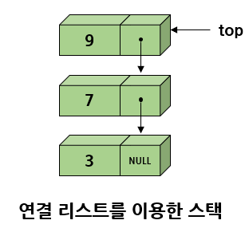

# 연결 리스트 2

# 1. 원형 연결 리스트

## 원형 연결 리스트의 소개

<b>원형 연결 리스트</b>란 <u>마지막 노드가 첫 번째 노드를 가리키는</u> 리스트이다.  
즉 마지막 노드의 링크 필드가 널(NULL)이 아니라 첫 번째 노드 주소가 되는 리스트이다.

원형 연결 리스트에서는 하나의 노드에서 다른 모든 노드로의 접근이 가능하다.  
하나의 노드에서 링크를 계속 따라 가면 결국 모든 노들르 거쳐 자기 자신으로 되돌아 올 수 있다.

따라서 노드의 삽입과 삭제가 단순 연결리스트보다는 용이해진다.  
삭제나 삽입 시에는 항상 선행 노드를 가리키는 포인터가 필요하다.


원형 연결 리스트는 리스트의 끝에 노드를 삽입하는 연산이 단순 연결 리스트보다 효율적일 수 있다. 

단순 연결 리스트에서 리스트의 끝에 노드를 추가하려면 첫 번째 노드에서부터 링크를 따라 노드의 개수만큼 진행하여 마지막 노드까지 가야한다. 그러나 만약 원형 연결 리스트에서 헤드 포인터가 마지막 노드를 가리키도록 한다면 상수 시간 안에 리스트의 처음과 끝에 노드를 삽입할 수 있다.


마지막 노드는 헤드 포인터인 head가 가리키고 있고, 첫 번째 노드는 head→link가 가리키고 있으므로 리스트의 마지막에 노드를 삽입하거나 삭제하기 위해 리스트의 맨 끝까지 가지 않아도 된다.

## 원형 연결 리스트 정의

원형 연결 리스트도 원칙적으로 헤드 포인터만 있으면 된다.

```C
ListNode *head;
```

## 원형 리스트의 처음에 삽입

아래의 그림과 같이 새로운 노드의 링크인 node→link 가 첫 번째 노드를 가리키게 하고 다음에 마지막 노드의 링크가 node를 가리키게 하면 된다.


```C
ListNode* insert_first(ListNode *head, element data)
{
    ListNode *node = (ListNode *)malloc(sizeof(ListNode));
    node->data = data;
    if (head == NULL) {
        head = node;
        node->link = head;
    }
    else {
        node->link = head->link;
        head->link = node;
    }
    return head;    // 변경된 헤드 포인터를 반환한다.
}
```

## 원형 리스트의 끝에 삽입

위 코드에 한 문장만 추가하면 원형 연결 리스트의 끝에 삽입할 수 있다.  
원형 연결 리스트는 어디가 처음이고 끝인지는 불분명하기때문에 아래의 그림처럼 head의 위치만 새로운 노드로
바꾸어주면 새로운 노드가 마지막 노드가 된다.


```C
ListNode* insert_last(ListNode *head, element data)
{
    ListNode *node = (ListNode *)malloc(sizeof(ListNode));
    node->data = data;
    if (head == NULL) {
        head = node;
        node->link = head;
    }
    else {
        node->link = head->link;
        head->link = node;
        head = node; // <= 추가
    }
    return head;    // 변경된 헤드 포인터를 반환한다.
```

## 테스트 프로그램

원형 리스트는 마지막 노드가 NULL이 아니기 때문에 리스트의 끝에 도달했는지를 검사하려면 헤드 포인터와 비교하여야 한다.

```C
#include<stdio.h>
#include<stdlib.h>

typedef int element;
typedef struct ListNode {
    element data;
    struct ListNode *link;
} ListNode;

// 리스트 항목 출력
void print_list(ListNode *head)
{
    ListNode *p;

    if (head == NULL) return;
    p = head->link;
    while(p != head) {
        printf("%d->", p->data);
        p = p->link;
    }
    // do {
    //     printf("%d->", p->data);
    //     p = p->link;
    // } while (p != head);
    printf("%d->", p->data);    // 마지막 노드 출력
}

ListNode* insert_first(ListNode *head, element data)
{
    ListNode *node = (ListNode *)malloc(sizeof(ListNode));
    node->data = data;
    if (head == NULL) {
        head = node;
        node->link = head;
    }
    else {
        node->link = head->link;
        head->link = node;
    }
    return head;    // 변경된 헤드 포인터를 반환한다.
}

ListNode* insert_last(ListNode *head, element data)
{
    ListNode *node = (ListNode *)malloc(sizeof(ListNode));
    node->data = data;
    if (head == NULL) {
        head = node;
        node->link = head;
    }
    else {
        node->link = head->link;
        head->link = node;
        head = node;
    }
    return head;    // 변경된 헤드 포인터를 반환한다.
}

int main()
{
    ListNode *head = NULL;

    // list = 10->20->30->40
    head = insert_last(head, 20);  // insert_last()가 반환한 헤드 포인터를 head에 대입한다.
    head = insert_last(head, 30);
    head = insert_last(head, 40);
    head = insert_first(head, 10);
    print_list(head);
    return 0;
}

```

#  2. 원형 연결 리스트는 어디에 사용될까?

첫 번째로 컴퓨터에서 여러 응용 프로그램을 하나의 CPU를 이용해 실행할 때에 필요하다.  
현재 실행중인 모든 응용 프로그램은 원형 연결 리스트에 보관되며 운영 체제는 원형 연결 리스트에 있는 프로그램의 실행을 위해 고정된 시간 슬롯을 제공한다.  
운영체제는 모든 응용 프로그램이 완료될 때까지 원형 연겨 리스트를 계속 순회한다.

> 시간 슬롯(타임 슬롯) : 전송되는 데이터의 시간 구분 단위

두 번째 예는 멀티 플레이어 게임이다. 모든 플레이어는 원형 연결 리스트에 저장되며 한 플레이어의 기회가 끝나면 포인터를 앞으로 움직여 다음 플레이어의 순서가 된다.

세 번째로 원형 큐를 만드는데도 사용할 수 있다. 원형 큐에서는 두 개의 포인터인 front와 rear가 있어야 한다.


## 멀티 플레이어 게임

3명의 플레이어가 보드 게임을 한다고 하고, 현재 누구 순서인지를 알리는 프로그램

```C
#include<stdio.h>
#include<stdlib.h>
#include<string.h>

typedef char element[100];
typedef struct ListNode {
    element data;
    struct ListNode *link;
} ListNode;

ListNode* insert_first(ListNode *head, element data)
{
    ListNode *node = (ListNode *)malloc(sizeof(ListNode));
    strcpy(node->data, data);
    if (head == NULL) {
        head = node;
        node->link = head;
    }
    else {
        node->link = head->link;
        head->link = node;
    }
    return head;
}

// 원형 연결 리스트 테스트 프로그램
int main()
{
    ListNode *head = NULL;

    head = insert_first(head, "KIM");
    head = insert_first(head, "PARK");
    head = insert_first(head, "CHOI");

    ListNode *p = head;
    for (int i = 0; i < 10; i++) {
        printf("현재 차례 = %s \n", p->data);
        p = p->link;
    }
    return 0;
}
```

# 3. 이중 연결 리스트

단순 연결 리스트에서 어떤 노드에서 후속 노드를 찾긴 쉽지만 선행 노드를 찾으려면 구조상 아주 어렵다.  
원형 연결 리스트여도 거의 전체 노드를 거쳐 돌아와야 한다.

따라서 특정 노드에서 양방향으로 자유롭게 움직일 필요가 있다면 단순 연결 리스트는 부적합하다.  
<b>이중 연결 리스트</b>는 이러한 문제점을 해결하기 위해 만들어진 자료구조이다.

이중 연결 리스트는 하나의 노드가 선행 노드와 후속 노드에 대한 두 개의 링크를 가지는 리스트이다.  
링크가 양방향이므로 양방향으로 검색이 가능해진다.  
단점으로는 공간을 많이 차지하고 코드가 복잡해지는 것이다.


실제 응용에서는 위의 그림처럼 이중 연결 리스트와 원형 연결 리스트를 혼합한 형태가 많이 사용된다.  
또 <b>헤드 노드(head node)</b>라는 특별한 노드를 추가하는 경우가 많다. 헤드 포인터와는 구별해야 한다.

헤드 포인터는 리스트의 첫 번째 노드를 가리키는 <b>포인터</b>이고,  
헤드 노드는 데이터를 가지고 있지 않는 특별한 <b>노드</b>를 추가하는 것이다.

헤드 노드가 존재하게 되면 삽입, 삭제 알고리즘이 간편해진다.  
헤드 노드의 데이터 필드는 아무런 정보도 담고 있지 않고, 삽입 삭제 알고리즘을 간편하게 하기 위해 존재한다.

이중 연결 리스트에서는 3개의 필드(왼쪽 링크 필드, 데이터 필드, 오른쪽 링크 필드)로 이루어져 있다.


이중 연결 리스트에서 임의의 노드를 가리키는 포인터를 p라 하면 다음의 관계가 성립한다.

```C
p = p->llink->rlink = p->rlink->llink
```

즉 앞뒤로 똑같이 이동할 수 있다. 이런 관계는 공백 리스트에서도 성립한다.  
즉 헤드 노드가 존재하기 때문에 공백 리스트의 경우, 다음 그림과 같은 상태가 된다.


노드의 구조를 구조체를 이용해 정의하면 다음과 같다.

```C
typedef int element;
typedef struct _DListNode {		// 이중 연결 노드 타입
    element data;
    struct _DListNode *llink;
    struct _DListNode *rlink;
} DListNode;
```


## 삽입 연산

삽입은 아래 그림의 순서대로 링크 필드의 값을 바꾸면 된다.  
새로 만들어진 노드의 링크를 먼저 바꾸는 이유는, 아무런 정보도 가지고 있지 않기 때문에 변경해도 안전하기 때문이다.


```C
// 새로운 데이터를 노드 before의 오른쪽에 삽입한다.
void dinsert(DListNode *before, element data)
{
	DListNode *newnode = (DListNode *)malloc(sizeof(DListNode));
	newnode->data = data;
	newnode->llink = before;
	newnode->rlink = before->rlink;
	before->rlink->llink = newnode;	// newnode->rlink->llink = newnode;
	before->rlink = newnode;		// newnode->llink->rlink = newnode;
}
```

## 삭제 연산

삭제 연산은 다음 그림의 순서로 링크들의 값을 변화시키면 된다.


## 완전한 프로그램

이중 연결 리스트를 사용한 프로그램 예시

이중 연결 리스트는 사용하기 전 반드시 초기화를 해야 된다.  
헤더 노드의 링크필드들이 자기 자신을 가리키도록 초기화 해야한다.

```C
#include <stdio.h>
#include <stdlib.h>
#include <string.h>

typedef int element;
typedef struct _DListNode {	// 이중연결 노드 타입
	element data;
	struct _DListNode* llink;
	struct _DListNode* rlink;
} DListNode;

// 이중 연결 리스트를 초기화
void init(DListNode* phead)
{
	phead->llink = phead;
	phead->rlink = phead;
}

// 이중 연결 리스트의 노드를 출력
void print_dlist(DListNode* phead)
{
	DListNode* p;
	for (p = phead->rlink; p != phead; p = p->rlink) {
		printf("<-| |%d| |-> ", p->data);
	}
	printf("\n");
}

// 새로운 데이터를 노드 before의 오른쪽에 삽입한다.
void dinsert(DListNode *before, element data)
{
	DListNode *newnode = (DListNode *)malloc(sizeof(DListNode));
	newnode->data = data;
	newnode->llink = before;
	newnode->rlink = before->rlink;
	before->rlink->llink = newnode;	// newnode->rlink->llink = newnode;
	before->rlink = newnode;		// newnode->llink->rlink = newnode;
}

// 노드 removed를 삭제한다.
void ddelete(DListNode* head, DListNode* removed)
{
	if (removed == head) return;
	removed->llink->rlink = removed->rlink;
	removed->rlink->llink = removed->llink;
	free(removed);
}

// 이중 연결 리스트 테스트 프로그램
int main(void)
{
	DListNode *head = (DListNode *)malloc(sizeof(DListNode));
	init(head);
	printf("추가 단계\n");
	for (int i = 0; i < 5; i++) {
		// 헤드 노드의 오른쪽에 삽입
		dinsert(head, i);
		print_dlist(head);
	}
	printf("\n삭제 단계\n");
	for (int i = 0; i < 5; i++) {
		print_dlist(head);
		ddelete(head, head->rlink);
	}
	free(head);
	return 0;
}
```

# 4. 예제 : mp3 재생 프로그램 만들기

mp3 재생기를 보면 현재 곡에서 이전 곡으로 가기도 하고 다음 곡으로 가기도 한다.  
한 처음 곡이나 마지막 곡으로 가기도 한다.  
따라서 현재 항모게서 이전 항목이나 다음 항목으로 쉽게 이동할 수 있는 자료 구조를 사용해야한다.

```C
#include<stdio.h>
#include<stdlib.h>
#include<string.h>

typedef char element[100];
typedef struct DListNode {
    element data;
    struct DListNode *llink;
    struct DListNode *rlink;
} DListNode;

DListNode *current;

// 이중 연결 리스트를 초기화
void init(DListNode *phead)
{
    phead->llink = phead;
    phead->rlink = phead;
}

// 이중 연결 리스트의 노드를 출력
void print_dlist(DListNode *phead)
{
    DListNode *p;
    for (p = phead->rlink; p != phead; p = p->rlink) {
        if (p == current) {
            printf("<-| #%s# |-> ", p->data);
        }
        else {
            printf("<-| %s |-> ", p->data);
        }
    }
    printf("\n");
}

// 노드 newnode를 노드 before의 오른쪽에 삽입.
void dinsert(DListNode *before, element data)
{
    DListNode *newnode = (DListNode *)malloc(sizeof(DListNode));
    strcpy(newnode->data, data);
    newnode->llink = before;
    newnode->rlink = before->rlink;
    before->rlink->llink = newnode;
    before->rlink = newnode;
}

// 노드 romoved를 삭제.
void ddelete(DListNode *head, DListNode *removed)
{
    if (removed == head) return;
    removed->llink->rlink = removed->rlink;
    removed->rlink->llink = removed->llink;
    free(removed);
}

// 이중 연결 리스트 테스트 프로그램
int main()
{
    char ch;
    DListNode *head = (DListNode *)malloc(sizeof(DListNode));
    init(head);

    dinsert(head, "Mamamia");
    dinsert(head, "Dancing Queen");
    dinsert(head, "Fernando");

    current = head->rlink;
    print_dlist(head);

    do {
        printf("\n명령어를 입력하시요.(<, >, q): ");
        ch = getchar();
        if (ch == '<') {
            current = current->llink;
            if (current == head) {
                current = current->llink;
            }
        }
        else if (ch == '>') {
            current = current->rlink;
            if (current == head) {
                current = current->rlink;
            }
        }
        print_dlist(head);
        getchar();
    } while(ch != 'q');
    free(head); // 동적 메모리 해제
    return 0;
}
```

# 5. 연결 리스트로 구현한 스택

스택은 다음 그림처럼 연결리스트를 이용해서도 구현될 수 있다.



이러한 스택을 <b>연결된 스택(linked stack)</b>이라고 한다.  
외부에서 보기엔 배열을 이용한 스택이나 연결 리스트를 이용한 스택이나 전혀 차이가 없다.

다른건 스택의 내부구현이다.  
가장 큰 장점은 크기가 제한되지 않는다는 것이다.

동적 메모리 할당만 할 수 있으면 스택에 새로운 요소 삽입이 가능하다.  
그러나 동적 메모리 할당이나 해제를 해야 하므로 삽입이나 삭제 시 시간은 좀 더 걸린다.

연결된 스택은 기본적으로 연결 리스트이기 아래와 같이 노드를 정의한다.  
노드는 데이터필드와 다음 노드를 가리키기 위한 포인터가 있다.

또 top은 더이상 정수가 아니고 노드를 가리키는 포인터로 선언된다.  
일관성을 위해 LinkedStackType이라는 구조체 타입으로 정의되었다.

```C
typedef int element;

typedef struct StackNode {
    element data;
    struct StackNode *link;
} StackNode;

typedef struct {
    StackNode *top;
} LinkedStackType;
```

연결된 스택에서 삽입 연산을 보면, 단순 연결 리스트에서 맨 앞에 데이털르 삽입하는 것과 동일하다.  
헤드 포인터가 top이라는 이름으로 불리는 것 이외에 별 차이점이 없다.  
다음 그림과 같이 top의 값을 temp->link에 복사한 다음, temp를 top에 복사하면 된다.


삭제 연산에서는 top의 값을 top→link로 바꾸고 기존의 top이 가리키는 노드의 동적 메모리를 해제하면 된다.
스택에서 삭제 연산 시 링크 필드의 변화는 밑의 그림과 같다.


```C
#include<stdio.h>
#include<malloc.h>

typedef int element;
typedef struct StackNode {
    element data;
    struct StackNode *link;
} StackNode;

typedef struct {
    StackNode *top;
} LinkedStackType;

// 초기화 함수
void init(LinkedStackType *s)
{
    s->top = NULL;
}
// 공백 상태 검출 함수
int is_empty(LinkedStackType *s)
{
    return (s->top == NULL);
}
// 포화 상태 검출 함수
int is_full(LinkedStackType *s)
{
    return 0;
}
// 삽입 함수
void push(LinkedStackType *s, element item)
{
    StackNode *temp = (StackNode *)malloc(sizeof(StackNode));
    temp->data = item;
    temp->link = s->top;
    s->top = temp;
}

void print_stack(LinkedStackType *s)
{
    for (StackNode *p = s->top; p != NULL; p = p->link) {
        printf("%d->", p->data);
    }
    printf("NULL \n");
}
// 삭제 함수
element pop(LinkedStackType *s)
{
    if (is_empty(s)) {
        fprintf(stderr, "스택이 비어있음\n");
        exit(1);
    }
    else {
        StackNode *temp = s->top;
        element data = temp->data;
        s->top = s->top->link;
        free(temp);
        return data;
    }
}
// 피크 함수
element peek(LinkedStackType *s)
{
    if (is_empty(s)) {
        fprintf(stderr, "스택이 비어있음\n");
        exit(1);
    }
    else {
        return s->top->data;
    }
}
// 주 함수
int main()
{
    LinkedStackType s;
    init(&s);
    push(&s, 1); print_stack(&s);
    push(&s, 2); print_stack(&s);
    push(&s, 3); print_stack(&s);
    pop(&s); print_stack(&s);
    pop(&s); print_stack(&s);
    pop(&s); print_stack(&s);
    return 0;
}
```

# 6. 연결 리스트로 구현한 큐

큐도 연결 리스트를 이용하여 만들 수 있다.  
연결 리스트로 만들어진 큐를 <b>연결된 큐(linked queue)</b>라고 한다.

연결 리스트로 구현된 큐는 배열로 구현된 큐에 비해 크기가 제한되지 않는 다는 장점이 있지만,  
코드가 약간 더 복잡해지고, 링크 필드 때문에 메모리 공간을 더 많이 사용한다.

기본적 구조는 단순 연결 리스트에다가 2개의 포인터를 추가한 것과 같다.  
front 포인터는 삭제와 관련되며 rear 포인터는 삽입과 관련된다.

다음 그림과 같이 front는 연결 리스트의 맨 앞에 있는 요소를 가리키며,  rear 포인터는 맨 뒤에 있는 요소를 가리킨다. 큐에 요소가 없는 경우에는 두 포인터 모두 NULL값이 된다.

큐의 요소들은 구조체로 정의되며 이 구조체는 데이터를 저장하는 데이터필드, 포인터가 들어있는 링크 필드가 있다.


## 연결된 큐 정의

```C
typedef int element;		// 요소의 타입

typedef struct QueueNode {	// 큐 노드의 타입
    element data;
    struct QueueNode *link;
} QueueNode;

typedef struct {			// 큐 ADT 구현
    QueueNode *front, *rear;
} LinkedQueueType;
```

## 삽입 연산

삽입 연산은 우선 동적 메모리 할당을 통해 새로운 노드를 생성한 다음,  
데이터를 저장하고 연결 리스트의 끝에 새로운 노드를 추가하면 된다.

만약 큐가 공백상태이면(front와 rear 모두 NULL) front와 rear 모두 새로운 노드를 가리키도록 해야 한다 .  
기존 노드가 있는 경우라면 rear가 가리키고 있는 노드의 링크 필드와 rear를 새로운 노드를 가리키도록 변경한다.

다음 그림은 삽입 연산의 과정을 보여준다.


```C
// 삽입 함수
void enqueue(LinkedQueueType *q, element data)
{
    QueueNode *temp = (QueueNode *)malloc(sizeof(QueueNode));
    temp->data = data;      // 데이터 저장
    temp->link = NULL;      // 링크 필드를 NULL
    if (is_empty(q)) {      // 큐가 공백이면
        q->front = temp;
        q->rear = temp;
    }
    else {                  // 큐가 공백이 아니라면
        q->rear->link = temp; // 순서 중요
        q->rear = temp;
    }
}
```

## 삭제 연산

삭제 연산은 연결 리스트의 처음에서 노드를 꺼내오면 된다.  
먼저 큐가 공백상태인가를 검사한 후, 공백 상태라면 오류가 된다.  
공백이 아니라면 front가 가리키는 노드를  temp가 가리키도록 하고 front는 front의 링크값으로 대입한다.

그러면 front는 현재 가리키는 노드의 다음 노드를 가리키게 된다.  
그 다음, temp가 가리키는 노드로부터 데이터를 꺼내오고 동적 메모리 해제를 통해 노드를 삭제한다.


```C
// 삭제 함수
element dequeue(LinkedQueueType *q)
{
    QueueNode *temp = q->front;
    element data;
    if (is_empty(q)) {  // 공백상태
        fprintf(stderr, "스택이 비어있음\n");
        exit(1);
    }
    else {
        data = temp->data;          // 데이터를 꺼냄
        q->front = q->front->link;  // front를 다음 노드를 가리키도록 함
        if (q->front == NULL)       // 1개가 남았을 때 공백이 되는경우
            q->rear = NULL;
        free(temp);                 // 동적 메모리 해제
        return data;                // 데이터 반환
    }
}
```

## 연결된 큐 프로그램

```C
#include<stdio.h>
#include<stdlib.h>

typedef int element;
typedef struct QueueNode {
    element data;
    struct QueueNode *link;
} QueueNode;

typedef struct {
    QueueNode *front, *rear;
} LinkedQueueType;

// 큐 초기화 함수
void init(LinkedQueueType *q)
{
    q->front = q->rear = 0;
}

// 큐 상태 검출 함수
int is_empty(LinkedQueueType *q)
{
    return (q->front == NULL);
}

// 포화 상태 검출 함수
int is_full(LinkedQueueType *q)
{
    return 0;
}

// 삽입 함수
void enqueue(LinkedQueueType *q, element data)
{
    QueueNode *temp = (QueueNode *)malloc(sizeof(QueueNode));
    temp->data = data;      // 데이터 저장
    temp->link = NULL;      // 링크 필드를 NULL
    if (is_empty(q)) {      // 큐가 공백이면
        q->front = temp;
        q->rear = temp;
    }
    else {                  // 큐가 공백이 아니라면
        q->rear->link = temp; // 순서 중요
        q->rear = temp;
    }
}
// 삭제 함수
element dequeue(LinkedQueueType *q)
{
    QueueNode *temp = q->front;
    element data;
    if (is_empty(q)) {  // 공백상태
        fprintf(stderr, "스택이 비어있음\n");
        exit(1);
    }
    else {
        data = temp->data;          // 데이터를 꺼냄
        q->front = q->front->link;  // front를 다음 노드를 가리키도록 함
        if (q->front == NULL)       // 1개가 남았을 때 공백이 되는경우
            q->rear = NULL;
        free(temp);                 // 동적 메모리 해제
        return data;                // 데이터 반환
    }
}

void print_queue(LinkedQueueType *q)
{
    QueueNode *p;
    for (p = q->front; p != NULL; p = p->link) {
        printf("%d->", p->data);
    }
    printf("NULL\n");
}

// 연결된 큐 테스트 함수
int main()
{
    LinkedQueueType queue;

    init(&queue);       // 큐 초기화

    enqueue(&queue, 1); print_queue(&queue);
    enqueue(&queue, 2); print_queue(&queue);
    enqueue(&queue, 3); print_queue(&queue);
    dequeue(&queue);    print_queue(&queue);
    dequeue(&queue);    print_queue(&queue);
    dequeue(&queue);    print_queue(&queue);
    return 0;
}
```

