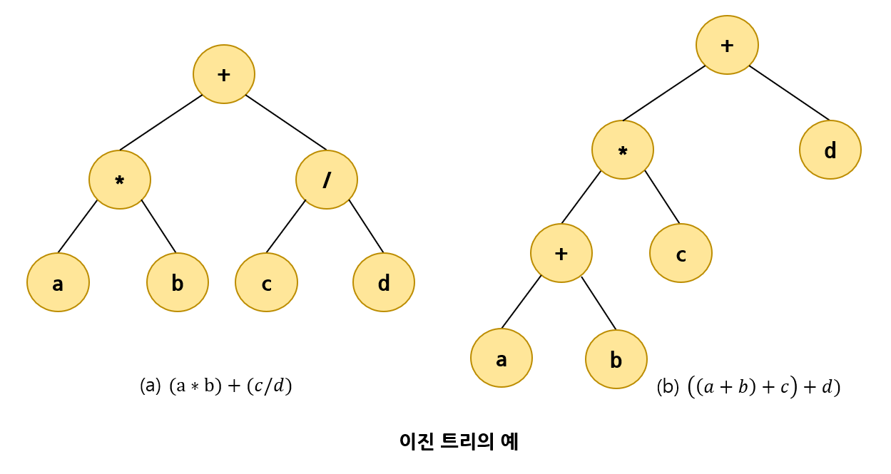
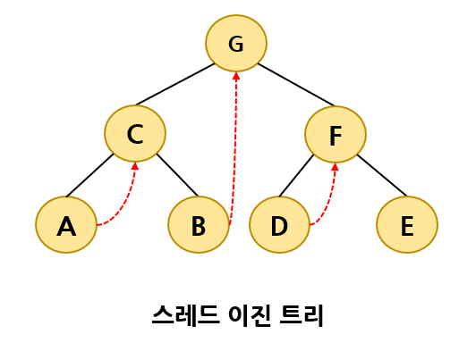

# 트리

# 1. 트리의 개념

자료가 계층적인 구조를 가지고 있다면 선형적인 자료구조는 적합하지 않다.

트리(Tree)는 계층적인 자료를 표현하는데 적합한 자료구조이다.

> 선형 자료 구조(linear data structure) : 리스트, 스택, 큐 등  
> 계층적인 자료 구조(hierarchical) : 가족의 가계도, 회사의 조직도, 컴퓨터의 디렉토리 구조 등


## 트리의 용어들

아래의 그림을 보았을 때, 트리의 구성 요소에 해당되는 A, B, C, D, E, F, G, H, I, J를 노드(node)라 한다.


트리는 한 개 이상의 노드로 이루어진 유한 집합이다.

이들 중 하나의 노드는 <b>루트(root)</b> 노드라 불리고 나머지 노드들은 <b>서브 트리(subtree)</b>라고 불린다.  
계층적인 구조에서 가장 높은 곳에 있는 노드인 A 가 <b>루트 노드</b>가 된다.

위의 그림에서 루트 노드는 A이고 나머지 노드들은 {B, E, F, G}, {C, H}, {D, I, J}로 3개의 집합으로 나누어 지는데, 이를 <b>서브트리</b>라고한다.

다시 서브 트리인 {B, E, F, G}의 루트는 B가 되고 나머지 노드들은 다시 3개의 서브트리 {E}, {F}, {G} 로 나누어진다.  
{C, H}와 {D, I, J}도 같은 식으로 다시 루트와 서브트리로 나누어질 수 있다.

트리에서 루트와 서브트리는 선으로 연결되는데, 이 연결선을 간선(dege)이라 한다.

다음 그림을 보면 노드들 간에는 부모, 형제, 조상과 자손 관계가 존재한다.


A는 B의 <b>부모 노드(parent node)</b>가 된다.  
반대로 B는 A의 <b>자식노드(children)</b>가 된다.

B와 C와 D는 <b>형제 관계(sibling)</b>이다.

<b>조상 노드(ancestor node)</b>란 루트 노드에서 임의의 노드까지의 경로를 이루고 있는 노드들을 말한다.  
<b>후손 노드(descendent node)</b>는 임의의 노드 하위에 연결된 모든 노드들을 의미한다.  
즉 어떤 노드의 서브 트리에 속하는 모든 노드들은 후손 노드이다.

자식 노드가 없는 노드를 <b>단말노드(terminal node, 또는 leaf node)</b>라고 한다.  
그 반대가 <b>비단말 노드(noterminal node)</b>이다.

노드의 <b>차수(degree)</b>는 어떤 노드가 가지고 있는 자식 노드의개수를 의미한다.

위 그림에서 루트 노드의 경우, 자식 노드가 3개이기 때문에 차수도 3이 된다.  
단말 노드는 차수가 0인 노드이다. 그림에서는 {E, F, G, H, I, J}가 단말 노드이다.

트리의 차수는 트리가 가지고 있는 노드의 차수 중에서 가장 큰 값이다.  
그림에서는 A와 B 노드의 차수가 3으로 가장 크므로 전체 트리의 차수는 3이 된다.

트리에서의 <b>레벨</b>은 트리의 각 층에 번호를 매기는 것으로 루트의 레벨은 1이 되고 한 층씩 내려갈수록 1씩 증가.  
그림에서 A의 레벨은 1이고 B의 레벨은 2이다.

트리의 높이는 트리가 가지고 있는 최대레벨을 말한다.  
그림에 트리의 높이는 3이다.

나무가 모이는 숲이 되듯 트리들의 집합을 포리스트(forest)라고 한다.


## 트리의 종류

트리를 컴퓨터 메모리상에서 표현하는 방법은 여러 가지가 있을수 있다.

트리를 프로그램 안에서 표현하는 가장 일반적인 방법은 아래 그림의 (a)와 같이 각 노드가 데이터를 저장하는 <b>데이터필드</b>와 자식 노드를 가리키는 <b>링크 필드</b>를 가지게 하는 것이다.


# 2. 이진 트리 소개

## 이진 트리의 정의

트리 중에서 가장 많이 쓰이는 트리는 이진트리이다.

<b>이진트리(binary tree)</b>는 <u>모든 노드가 2개의 서브 트리</u>를 가지고 있다.

서브 트리는 공집합 일 수 있다. 따라서 이진 트리의 노드에는 최대 2개까지의 자식 노드가 존재할 수 있고, 모든 노드의 차수가 2 이하가 된다.

> 공집합도 이진트리라는점에 주의한다.

또한 이진 트리에는 서브 트리간의 순서가 존재하므로 왼쪽 서브 트리와 오른쪽 서브 트리는 서로 구별된다.


- 이진 트리의 정의

1. 공집합이거나
2. 루트와 왼쪽 서브 트리, 오른쪽 서브 트리로 구성된  노드들의 유한 집합으로 정의된다.  
   이진 트리의 서브트리들은 모두 이진트리여야 한다.

정의에서 보면 이진 트리의 서브 트리도 이진 트리의 성질을 만족하여야 한다는 것을 알 수 있다.

이진 트리의 정의를 이용해서 다음 그림의 트리가 이진 트리인지를 알아보면


<u>SUB3을</u> 먼저 보면 하나의 노드 D로만 이루어져 있다.   
만약 노드 D를 <u>SUB3</u>의 루트라고 생각하면 SUB3의 서브트리는 공집합이다.

위의 정의 (1)에 의하여 공집합도 이진 트리이므로  
<u>SUB3</u>은 정의(2)에 의해 루트와 공집합 서브트리 2개를 가지는 이진트리이다.

같은 식으로 <u>SUB2</u>도 루트와 공집합 서브트리 2개를 가지는 이진트리이다.

<u>SUB1</u>은 SUB1의 루트 노드 B와 서브 트리 SUB3과 공집합 서브트리를 가지므로 역시 이진트리.

최종적으로 전체 트리는 루트노드 A와 SUB1, SUB2의 두개의 서브트리를 가지고 있는데,  
이 두개의 서브 트리가 이진트리이므로 전체 트리도 이진트리라고 결론내릴 수 있다.

이진 트리와 일반 트리의 차이점을 생각해보자.

- 이진 트리의 모든 노드는 차수가 2이하이다. 즉 자식 노드의 개수가 2이하 이다.  
  반면 일반 트리는 자식 노드이 개수에 제한이 없다.
- 일반 트리와는 달리 이진 트리는 노드를 하나도 갖지 않을 수도 있다.
- 서브 트리간에 순서가 존재한다는 점도 다르다.  
  따라서 왼쪽 서브트리와 오른쪽 서브트리를 구별한다.

이진 트리의 예로, 다음 그림은 수식을 표현하는 이진 트리이다.

수식에서 각 연산자들은 하나 또는 2개의 피연산자를 가지고 있다.  
왼쪽 피연산자는 왼쪽 서브트리가 되고 오른쪽 피연산자는 오른쪽 서브트리로 표현된다.

단말 노드는 상수이거나 변수이다.

## 이진 트리의 성질

- n개의 노드를 가진 이진 트리는 정확하게 n-1 의 간선을 가진다.  
  그 이유는 이진트리에서의 노드는 루트를 제외하면 정확하게 하나의 부모노드를 가진다.  
  그리고 부모와 자식 간에는 정확하게 하나의 간선만이 존재한다. 따라서 간선의 개수는 n-1 이다.  
  위의 그림에서 예를들면, (a)의 노드의 개수는 7개이고, 간선의 개수는 6개이다.
  
- 높이가 h인 이진트리의 경우, 최소 h개의 노드를 가지며 최대2<sup>h</sup>-1개의 노드를 가진다.  
  그 이유는 한 레벨에는 적어도 하나의 노드는 존재해야 하므로  높이가 h인 이진트리는 적어도 h개의 노드를 가진다. 또한 하나의 노드는 최대 2개의 자식을 가질 수 있으므로 레벨 i에서의 노드의 최대개수는 2<sup>i-1</sup>가 된다. 따라서 전체 노드 개수는  2<sup>h</sup>-1이 된다.
  
  

- n개의 노드를 가지는 이진트리의 높이는 최대 n 이거나 최소 [log<sub>2</sub>(n+1)]이 된다.  
  그 이유는 레벨 당 최소한 하나의 노드는 있어야 하므로 높이가 n을 넘을 수는 없다.  
  그리고 앞의 성질에서 높이 h의 이진트리가 가질 수 있는 노드의 최대값은 2<sup>h</sup>-1이다.  
  따라서 의 부등식이 성립하고 양변에 log를 취하여 정리하면 이 된다.  
  h는 정수이어야 하므로 이 된다. [...]은 올림 연산으로 [2.4]는 3이 된다.  
  


## 이진 트리의 분류

이진 트리는 다음 그림과 같이 형태에 따라 분류할 수 있다.

- 포화 이진 트리(full binary tree)
- 완전 이진 트리(complete binary tree)
- 기타 이진 트리
  

<b>포화 이진 트리</b>는 용어 그대로 트리의 각 레벨에 노드가 꽉 차있는 이진트리를 의미한다.  
즉 높이 k인 포화 이진트리는 정확하게 2<sup>h</sup>-1개의 노드를 가진다. 위 그림의 (a)는 높이가 3인 포화 이진트리이다.

<b>포화 이진 트리</b>에는 다음 그림과 같이 각 노드에 번호를 붙일 수 있다.  
노드에 번호를 부여하는 방법은 레벨 단위로 왼쪽에서 오른쪽으로 번호를 붙이면 된다.  
그리고 이 번호는 <u>항상 일정</u>하다. 즉 루트 노드의 오른쪽 자식 노드의 번호는 항상 3이다.  


<b>완전 이진 트리</b>는 높이가 k일 때 레벨 1부터 k-1까지는 노드가 모두 채워져 있고  
마지막 레벨 k에서는 왼쪽부터 오른쪽 으로 노드가 순서대로 채워져 있는 이진트리이다.

마지막 레벨에서는 노드가 꽉 차있지 않아도 되지만 중간에 빈 곳이 있어서는 안된다.  
따라서 포화 이진 트리는 항상 완전 이진 트리이지만 그 역은 항상 성립하지 않는다.

포화 이진 트리의 노드 번호와 완전 이진 트리의 노드 번호는 1대1로 대응한다.

아래 그림의 (a)는 완전 이진트리이나 (b)는 마지막 레벨에서 중간이 비어 있으므로 완전 이진 트리가 아니다.  


# 3. 이진 트리의 표현

이진 트리를 컴퓨터 프로그램 안에서 표현할 수 있는 2가지의 방법이 있다.

- 배열을 이용하는 방법
- 포인터를 이용하는 방법

## 배열 표현법

배열을 이용하는 방법은 주로 포화 이진 트리나 완전 이진 트리의 경우 많이 쓰이는 방법이나, 그 외의 이진 트리도 저장이 불가능한 것은 아니다. 이 방법은 저장하고자 하는 이진 트리를 일단 완전 이진 트리라고 가정하고 이진 트리의 깊이가 k이면 최대 2<sup>k</sup>-1개의 공간을 연속적으로 할당한 다음, 완전 이진 트리의 번호대로 노드들을 저장한다.

예를 들면 아래 그림의 (a)에서 트리들은 먼저 번호가 매겨진 다음, 이 번호에 따라서 배열에 저장된다.  
만약 노드 A는 노드 번호가 1이므로 배열의 인덱스 1에 저장되었고 노드 B는 노드의 번호가 2 이므로 배열의 인덱스 2에 저장되었다. 여기서 인덱스 0은 사용되지 않는다.

인덱스 0을 사용하지 않는 편이 계산을 간단하게 만든다.  
완전 이진트리가 아닌 일반적인 이진 트리인 경우에는 아래 그림의 (b)처럼 배열 표현법을 사용하면 저장할 수는 있지만 기억공간의 낭비가 심해진다.


배열 표현법에서의 부모와 자식의 인덱스 관계를 살펴보면  
배열 표현법에서는 인덱스만 알면 노드의 부모나 자식을 쉽게 알 수 있다.  
부모와 자식의 인덱스 사이에는 다음과 같은 공식이 성립된다.

- 노드 i의 부모 노드 인덱스 = i / 2
- 노드 i의 왼쪽 자식 노드 인덱스  = 2 i
- 노드 i의 오른쪽 자식 노드 인덱스 = 2 i + 1

위 그림의 (a)에서 보면 노드 B의 인덱스는 2이고 부모 노드인 A의 인덱스는 1이다.  
또한 노드 B의 왼쪽 자식 노드인 노드 D의 인덱스는 4이고 오른쪽 자식 노드인 노드 E의 인덱스는 5로 위의 공식이 성립한다.

## 링크 표현법

링크 표현법에서는 트리에서의 노드가 구조체로 표현되고,  
각 노드가 포인터를 가지고 있어서 이 포인터를 이용하여 노드와 노드를 연결하는 방법이다.

이진트리를 링크 표현법으로 표현하여 보면 아래의 그림과 같이 하나의 노드가 3개의 필드를 가지는데,  
데이터를 저장하는 필드와 왼쪽 자식 노드와 오른쪽 자식 노드를 가리키는 2개의 포인터 필드를 가진다.  
이 2개의 포인터를 이용하여 부모노드와 자식노드를 연결한다.  


위에 있는 이진트리를 링크 표현법으로 다시 그려보면 아래와 같다.  


이진 트리를 링크 표현에 의해 나타내기 위해서는 C 언어의 구조체와 포인터 개념을 이용하여야 한다.

먼저 구조체를 이용하여 구조를 정의하고 링크는 포인터의 개념을 이용하여 정의하면 된다.

저장되는 데이터는 정수라고 가정하면 여기서 TreeNode는 트리 노드에 대한 타입이다.

```c
typedef struct _TreeNode {
    int data;
    struct _TreeNode *left, *right;
} TreeNode;
```

링크 표현법으로 표현된 트리는 루트 노드를 가리키는 포인터만 있으면 트리안의 모든 노드들에 접근할 수 있다.  
이것은 연결 리스트와 아주 유사한데, 연결 리스트도 포인터에 의하여 연결된 구조이기 때문이다.

연결 리스트는 1차원적인 연결된 구조라면 링크법으로 표현된 이진 트리는 2차원적으로 연결된 구조라 할 수 있다.

아래는 3개의 노드로 이루어진 이진트리를 생성하는 간단한 프로그램이다.

```c
#include <stdio.h>
#include <stdlib.h>

typedef struct _TreeNode {
    int data;
    struct _TreeNode *left, *right;
} TreeNode;
//      n1
//     / |
//    n2 n3
int main()
{
    TreeNode *n1, *n2, *n3;
    n1 = (TreeNode *)malloc(sizeof(TreeNode));
    n2 = (TreeNode *)malloc(sizeof(TreeNode));
    n3 = (TreeNode *)malloc(sizeof(TreeNode));
    n1->data = 10;      // 첫 번째 노드를 설정한다.
    n1->left = n2;
    n1->right = n3;
    n2->data = 20;      // 두 번째 노드를 설정한다.
    n2->left = NULL;
    n2->right = NULL;
    n3->data = 30;      // 세 번째 노드를 설정한다.
    n3->left = NULL;
    n3->right = NULL;
    free(n1); free(n2); free(n3);
    return 0;
}
```

# 4. 이진 트리의 순회

기본적으로 이진 트리도 데이터를 저장하기 위한 자료구조이다.  
데이터는 노드의 데이터필드를 이용하여 저장이 된다.

이진 트리를 <b>순회</b> 한다는 것은 이진 트리에 속하는 모든 노드를 한 번씩 방문하여 노드가 가지고 있는 데이터를 목적에 맞게 처리하는 것을 의미한다.

우리가 트리를 사용하는 목적은 트리의 노드에 자료를 저장하고 필요에 따라서 이 자료를 처리하기 위함이다.  
따라서 트리가 가지고 있는 자료를 순차적으로 순회하는 것은 이진 트리에서 중요한 연산이다.

스택이나 큐들은 대개 데이터를 선형으로 저장하고 있었으며 자료에 순차적으로 순회하는 방법은 하나뿐이었다.  
그러나 트리는 그렇지 않다. 아래의 그림과 같이 여러 가지 순서로 노드가 가지고 있는 자료에 접근할 수 있다.


## 이진 트리 순회방법

이진 트리를 <b>순회</b>하는 표준적인 방법에는 전위, 중위, 후위의 3가지 방법이 있다.  
이는 루트와 왼쪽 서브트리, 오른쪽 서브트리 중에서 루트를 언제 방문하느냐에 따라 구분이 된다.

만약 루트를 방문하는 작업을 V 라고 하고 왼쪽 서브트리 방문을 L, 오른쪽 서브트리 방문을 R 이라고 하면 3가지 방법을 생각할 수 있다.

루투를 서브 트리에 앞서서 먼저 방문하면 <b>전위순회</b>, 루트를 왼쪽과 오른쪽 서브트리 중간에 방문하면 <b>중위순회</b>, 루트를 서브트리 방문 후에 방문하면 <b>후위순회</b>가 된다.

- 전위순회(preorder traversal) : VLR

- 중위순회(inorder traversal)   : LVR

- 후위순회(postorder traversal): LRV

  

전위 순회라면 서브 트리에 들어 있는 노드들도 VLR의 순서대로 순회된다.

트리 순회 알고리즘은 순환 기법을 사용한다.  
이진 트리는 전체 트리나 서브 트리나 구조는 완전히 동일하다.  
따라서 전체 트리 순회에 사용된 알고리즘은 똑같이 서브 트리에 적용할 수 있기때문에 문제의 구조는 같고 크기만 작아지므로 순환을 적용할 수 있다.

## 전위 순회

전위 순회는 루트를 먼저 방문하고 그 다음에 왼쪽 서브트리를 방문하고 오른쪽 서브트리를 마지막으로 방문하는 것이다.

1. 루트 노드를 방문한다.
2. 왼쪽 서브트리를 방문한다.
3. 오른쪽 서브트리를 방문한다.


**전위 순회**에서 루트노드의 방문을 마쳤다고 가정하면 왼쪽 서브 트리를 방문할 차례이다.

그렇다면 왼쪽 서브트리의 어떤 노드를 먼저 방문해야하는지 생각해보면, 왼쪽 서브트리도 하나의 이진트리이다.  
따라서 전체 트리와 똑같은 방식으로 서브트리를 방문하면 된다.

즉 왼쪽 서브트리의 루트를 먼저 방문하고 왼쪽 서브트리의 왼쪽서브 트리를 그 다음에,  마지막으로 왼쪽 서브트리의 오른쪽 서브트리를 방문하면 된다.

즉 모든 서브트리에 대하여 같은 알고리즘을 반복하면 된다.


## 중위 순회

중위순회는 먼저 왼쪽 서브트리, 루트, 오른쪽 서브트리 순으로 방문한다.

1. 왼쪽 서브트리를 방문한다.
2. 루트노드를 방문한다.
3. 오른쪽 서브트리를 방문한다.


다음 그림은 예제 트리에 대한 중위 순회 방문 순서이다.


## 후위 순회

후위 순회는 왼쪽 서브트리, 오른쪽 서브트리, 루트 순으로 방문한다.

1. 왼쪽 서브트리의 모든 노드를 방문한다.
2. 오른쪽 서브트리의 모든 노드를 방문한다.
3. 루트 노드를 방문한다.


다음 그림은 후위 순회의 방문 순서 예시이다.


## 전위, 중위, 후위 순회 구현

3가지의 표준적인 순회 방법을 C언어 함수로 구현하면, 함수의 매개변수는 루트를 가리키는 포인터가 된다.

먼저 표준적인 순회방법이 순환적으로 정의되어 있다.

왼쪽이나 오른쪽 서브트리를 방문하는 것은 전체 트리를 방문하는 거나 다를 바가 없다.  
즉 전체 트리를 방문 함수를 다시 한 번 호출해주면 되는 것이다.

다만 다른 점은 함수의 매개변수가 달라지게 된다.  
즉 서브트리를 방문하는 경우에는 서브트리의 루트 노드 포인터를 함수의 매개변수로 전달하면 된다.

만약 순환의 개념을 사용하지 않는다면 순회 함수의 구현은 아주 어렵게 된다.

우선 노드를 방문한다는 의미를 노드의 자료를 출력하는 것으로 생각한 3가지 순회방법의 함수는 다음이다.

```c
// 중위 순회
void inorder(TreeNode *root) {
    if (root != NULL) {
        inorder(root->left);		// 왼쪽 서브트리 순회
        printf("[%d] ", root->data); // 노드 방문
        inorder(root->right);		// 오른쪽 서브트리 순회
    }
}
// 전위 순회
void preorder(TreeNode *root) {
    if (root != NULL) {
        printf("[%d] ", root->data); // 노드 방문
        preorder(root->left);		// 왼쪽 서브트리 순회
        preorder(root->right);		// 오른쪽 서브트리 순회
    }
}
// 후위 순회
void postorder(TreeNode *root) {
    if (root != NULL) {
        postorder(root->left);		// 왼쪽 서브트리 순회
    	postorder(root->right);		// 오른쪽 서브트리 순회
    	printf("[%d] ", root->data); // 노드 방문
    } 
}
```

## 전체 프로그램

위의 3가지 순회 함수들은 전체적인 형태는 동일하고 if 문 안의 문장들의 순서만 바뀌어 있다.

이진 트리를 3가지 방법으로 순회하는 완전한 프로그램 코드는 아래에 있다.

여기서 이진트리가 정적으로 만들어졌다. 즉 malloc() 함수를 사용하지 않고 노드를 전역 변수로 정의하여 생성하였다.  
이 방식은 노드를 간편하게 만들 수 있으나 노드의 개수를 실행 중에 변경할 수 없으므로 실제로는 잘 사용되지 않는다.

```c
#include <stdio.h>
#include <stdlib.h>

typedef struct _TreeNode {
    int data;
    struct _TreeNode *left, *right;
} TreeNode;

//      15
//  4       20
//1      16    25
TreeNode n1 = { 1, NULL, NULL };
TreeNode n2 = { 4, &n1, NULL };
TreeNode n3 = { 16, NULL, NULL };
TreeNode n4 = { 25, NULL, NULL };
TreeNode n5 = { 20, &n3, &n4 };
TreeNode n6 = { 15, &n2, &n5 };
TreeNode *root = &n6;

// 중위 순회
void inorder(TreeNode *root) {
    if (root != NULL) {
        inorder(root->left);        // 왼쪽 서브트리 순회
        printf("[%d] ", root->data);// 노드 방문
        inorder(root->right);       // 오른쪽 서브트리 순회
    }
}

// 전위 순회
void preorder(TreeNode *root) {
    if (root != NULL) {
        printf("[%d] ", root->data);// 노드 방문
        preorder(root->left);       // 왼쪽 서브트리 순회
        preorder(root->right);      // 오른쪽 서브트리 순회        
    }
}

// 후위 순회
void postorder(TreeNode *root) {
    if (root != NULL) {
        postorder(root->left);      // 왼쪽 서브트리 순회
        postorder(root->right);     // 오른쪽 서브트리 순회
        printf("[%d] ", root->data);// 노드 방문
    }
}

int main()
{
    printf("중위 순회 = ");
    inorder(root);
    printf("\n");

    printf("전위 순회 = ");
    preorder(root);
    printf("\n");

    printf("후위 순회 = ");
    postorder(root);
    printf("\n");
    return 0;
}
```


# 5. 반복적 순회

앞에서는 순회를 순환 호출을 이용하여 구현하였는데, 반복을 이용해서도 트리 순회를 할 수 있다.

이 경우에는 스택이 필요한데, 스택에 자식 노드들을 저장하고 꺼내면서 순회를 할 수 있다.  
순환 호출도 사실은 시스템 스택을 사용하고 있는 것이기 때문에 별도의 스택을 사용하면 순환 호출을 흉내 낼 수 있다.

인공지능에서 지능적인 탐색을 할 때 사용된다고 한다. 아래의 코드는 중위 순회를 별도의 스택을 이용한 코드이다.

```c
#include <stdio.h>
#include <stdlib.h>

typedef struct _TreeNode {
    int data;
    struct _TreeNode *left, *right;
} TreeNode;

#define SIZE 100
int top = -1;
TreeNode *stack[SIZE];

void push(TreeNode *p) {
    if (top < SIZE - 1) {
        stack[++top] = p;
    }
}

TreeNode *pop() {
    TreeNode *p = NULL;
    if (top >= 0) {
        p = stack[top--];
    }
    return p;
}

void inorder_iter(TreeNode *root) {
    while (1) {
        for (; root; root = root->left) {
            push(root);
        }
        root = pop();
        if (!root) break;
        printf("[%d] ", root->data);
        root = root->right;
    }
}
//      15
//  4       20
//1       16  25
TreeNode n1 = { 1, NULL, NULL };
TreeNode n2 = { 4, &n1, NULL };
TreeNode n3 = { 16, NULL, NULL };
TreeNode n4 = { 25, NULL, NULL };
TreeNode n5 = { 20, &n3, &n4 };
TreeNode n6 = { 15, &n2, &n5 };
TreeNode *root = &n6;

int main()
{
    printf("중위 순회 = ");
    inorder_iter(root);
    printf("\n");
    return 0;
}
```


# 6. 레벨 순회

레벨 순회는 표준적인 순회 방법은 아니지만 많이 사용된다고 한다.

<b>레벨 순회(level order)</b>는 각 노드를 레벨 순으로 검사하는 순회 방법이다.  
루트 노드의 레벨이 1이고 아래로 내려갈수록 레벨은 증가한다.  
동일한 레벨의 경우에는 좌에서 우로 방문한다.

지금까지의 순회법이 스택을 사용했던 것에 비해 레벨 순회는 큐를 사용하는 순회법이다.

> 순환 호출을 하였기 때문에 간접적으로 스택을 사용한 것


레벨 순회 코드는 큐에 하나라도 노드가 있으면 계속 반복하는 코드로 이루어져 있다.

먼저 큐에 있는 노드를 꺼내어 방문한 다음, 그 노드의 자식 노드를 큐에 삽입하는 것으로 한번의 반복을 끝낸다.  
이러한 반복을 큐에 더 이상의 노드가 없을 때까지 게속한다.

위 그림에서처럼 먼저 루트 노드인 +가 큐에 입력된 상태에서 순회가 시작된다.  
큐에서 하나를 삭제하면 +가 나오게 되고 노드 +를 방문한 다음,  
노드 +의 자식 노드인 노드 *과 노드 /를 큐에 삽입한 다음, 다시 반복의 처음으로 되돌아 간다.

레벨 순회를 구현하면 다음과 같은 코드가 되는데, 큐의 요소 타입이 정수가 아니라 노드를 가리키는 포인터이므로 큐의 element타입을 다시 정의해주어야 한다.

```c
#include <stdio.h>
#include <stdlib.h>

typedef struct _TreeNode {
    int data;
    struct _TreeNode *left, *right;
} TreeNode;

// ================== 원형큐 코드 시작 ==================
#define MAX_QUEUE_SIZE 100
typedef TreeNode* element;
typedef struct {    // 큐 타입
    element data[MAX_QUEUE_SIZE];
    int front, rear;
} QueueType;

// 오류 함수
void error(char *message)
{
    fprintf(stderr, "%s\n", message);
    exit(1);
}

// 공백 상태 검출 함수
void init_queue(QueueType *q)
{
    q->front = q->rear = 0;
}

// 공백 상태 검출 함수
int is_empty(QueueType *q)
{
    return (q->front == q->rear);
}

// 포화 상태 검출 함수
int is_full(QueueType *q)
{
    return ((q->rear + 1) % MAX_QUEUE_SIZE == q->front);
}

// 삽입 함수
void enqueue(QueueType *q, element item)
{
    if (is_full(q)) error("큐가 포화상태");
    q->rear = (q->rear + 1) % MAX_QUEUE_SIZE;
    q->data[q->rear] = item;
}

// 삭제 함수
element dequeue(QueueType *q)
{
    if (is_empty(q)) error("큐가 공백상태");
    q->front = (q->front + 1) % MAX_QUEUE_SIZE;
    return q->data[q->front];
}

void level_order(TreeNode *ptr)
{
    QueueType q;
    init_queue(&q); // 큐 초기화
    if (ptr == NULL) return;
    enqueue(&q, ptr);
    while (!is_empty(&q)) {
        ptr = dequeue(&q);
        printf(" [%d] ", ptr->data);
        if (ptr->left) enqueue(&q, ptr->left);
        if (ptr->right) enqueue(&q, ptr->right);
    }
}
//      15
//  4       20
//1       16  25
TreeNode n1 = { 1, NULL, NULL };
TreeNode n2 = { 4, &n1, NULL };
TreeNode n3 = { 16, NULL, NULL };
TreeNode n4 = { 25, NULL, NULL };
TreeNode n5 = { 20, &n3, &n4 };
TreeNode n6 = { 15, &n2, &n5 };
TreeNode *root = &n6;

int main()
{
    printf("레벨 순회 = ");
    level_order(root);
    printf("\n");
    return 0;
}
```


트리를 순회하기만 하면 해결되는 문제도 많다.  
만약 순서는 중요하지 않고 노드를 전부 방문하기만 하면 된다면 3가지의 방법 중 어느 것을 사용하여도 된다.

그러나 자식 노드를 처리한 다음에 부모 노드를 처리해야 한다면 후위순회를 사용하여야 하고,  
부모 노드를 처리한 다음에 자식 노드를 처리해야 한다면 전위순회를 사용하여야 한다.

예를 들면 디렉토리의 용량을 계산하려면 후위순회를 사용하여야 한다.  
왜냐하면 하위 디렉토리의 용량이 계싼되어야 만이 현재 디렉토리 용량을 계산할 수 있기 때문이다.

# 7. 트리의 응용 : 수식 트리 처리

이진 트리는 <b>수식 트리(expression tree)</b>를 처리하는데 사용될 수 있다.

수식 트리는 산술 연산자와 피연산자로 만들어진다. 피연산자들은 단말 노드가 되며 연산자는 비단말 노드가 된다.  
아래 그림은 다양한 수식트리이다. 첫 번째 (a)는 a + b 라는 수식을 수식트리로 표현한 것이다.  


이들 수식 트리를 전위, 중위, 후위의 순회 방법으로 읽으면 각각 전위 표기 수식, 중위 표기 수식, 후위 표기 수식이 된다.

|   수식   | a + b |  a - (b x c)  | (a < b) or (c < d) |
| :------: | :---: | :-----------: | :----------------: |
| 전위순회 | + a b |   - a x b c   |   or < a b < c d   |
| 중위순회 | a + b | a - ( b x c ) | (a > b) or (c < d) |
| 후위순회 | a b + |   a b c x -   |   a b < c d < or   |

<b>수식 트리</b>로 표현된 수식의 값을 계산하는 문제를 생각해보면, 스택을 이용하여 후위 표기 수식을 계산할 수도 있다.

수식 트리의 루트 노드는 연산자이고 이 연산자의 피연산자인 자식 노드들만 계산되면 전체 수식을 계산할 수 있다. 따라서 <u>루트보다 자식 노드들이 먼저 방문되는 순회 방법</u>을 사용해야 수식의 값을 계산할 수 있을 것이다.

3가지 순회법 중, 루트 노드보다 자식 노드를 먼저 방문하는 순회 방법은 <b>후위 순회</b>이다.


```c
#include <stdio.h>
#include <stdlib.h>

typedef struct _TreeNode {
    int data;
    struct _TreeNode *left, *right;
} TreeNode;

//      +
//  *       +
//1   4  16   25
TreeNode n1 = { 1, NULL, NULL };
TreeNode n2 = { 4, NULL, NULL };
TreeNode n3 = { '*', &n1, &n2 };
TreeNode n4 = { 16, NULL, NULL };
TreeNode n5 = { 25, NULL, NULL };
TreeNode n6 = { '+', &n4, &n5 };
TreeNode n7 = { '+', &n3, &n6 };
TreeNode *expr = &n7;

// 수식 계산 함수
int evalueate(TreeNode *root)
{
    if (root == NULL) return 0;
    if (root->left == NULL && root->right == NULL) return root->data;
    else {
        int op1 = evalueate(root->left);
        int op2 = evalueate(root->right);
        printf("%d %c %d을 계산합니다.\n", op1, root->data, op2);
        switch (root->data) {
            case '+' :
                return op1 + op2;
            case '-' :
                return op1 - op2;
            case '*' :
                return op1 * op2;
            case '/' :
                return op1 / op2;
        }
    }
    return 0;
}

int main()
{
    printf("수식의 값은 %d입니다. \n", evalueate(expr));
    return 0;
}
```

# 8. 트리의 응용 : 디렉토리 용량 계산

이진 트리 순회는 컴퓨터 디렉토리의 용량을 계산하는데도 사용될 수 있다.  
단 이진 트리를 사용하기 때문에 하나의 디렉토리 안에 다른 디렉토리가 2개를 초과하면 안 된다.

예를 들어 다음 밑에 그림과 같은 디렉토리 구조에서 루트 디렉토리인 "나의 문서"의 용량을 알려면  


하나의 디렉토리 안에 다른 디렉토리가 있을 수 있으므로 먼저 서브 디렉토리의 용량을 모두 계산한 다음에
루트 디렉토리의 용량을 계산하여야 할 것이다. 따라서 후위 순회를 사용하여야 한다.

후위 순회를 사용하되 순환 호출되는 <u>순회 함수가 용량을 반환</u>하도록 만들어야 한다.  
따라서 순회 함수를 조금 변경하면 된다.

다음의 코드는 간단하기 위해 트리의 노드를 정적으로 생성하였지만 실제로는 동적으로 생성하는것이 좋다.

```c
#include <stdio.h>
#include <stdlib.h>

typedef struct _TreeNode {
    int data;
    struct _TreeNode *left, *right;
} TreeNode;

int clac_dir_size(TreeNode *root)
{
    int left_size, right_size;
    if (root == NULL) return 0;

    left_size = clac_dir_size(root->left);
    right_size = clac_dir_size(root->right);
    return (root->data + left_size + right_size);
}
//      0
//  50      100
//       500   200
int main()
{
    TreeNode n4 = { 500, NULL, NULL };
    TreeNode n5 = { 200, NULL, NULL };
    TreeNode n3 = { 100, &n4, &n5 };
    TreeNode n2 = { 50, NULL, NULL };
    TreeNode n1 = { 0, &n2, &n3 };

    printf("디렉토리의 크기 = %d\n", clac_dir_size(&n1));
    return 0;
}
```

# 9. 이진 트리의 추가 연산

## 노드의 개수

탐색 트리 안의 노드의 개수를 세어 표시한다.  
노드의 개수를 세기 위해서는 트리 안의 노드들을 전체적으로 순회하여야 한다.  

각각의 서브트리에 대하여 순환 호출한 다음, 반환되는 값에 1을 더하여 반환하면 된다.

아래의 코드는 C언어로 구현된 함수이다.

```c
int get_node_count(TreeNode *node)
{
    int count = 0;
    
    if (node != NULL) {
        count = 1 + get_node_count(node->left) + get_node_count(node->right);
    }
    
    return count;
}
```


## 단말 노드 개수 구하기

단말 노드의 개수를 세기 위해서는 트리안의 노드들을 전체적으로 순회하여야 한다.

순회하면서 만약 왼쪽자식과 오른쪽 자식이 동시에 0이 되면 단말노드이므로 1을 반환한다.

만약 그렇지 않으면 비단말 노드이므로 각각의 서브트리에 대하여 순환 호출한 다음, 반환되는 값을 서로 더하면 된다.

아래의 코드는 C언어로 구현된 함수이다.

```c
int get_leaf_count(TreeNode *node)
{
    int count = 0;
    
    if (node != NULL) {
        if (node->left == NULL && node->right == NULL) return 1;
        else count = get_leaf_count(node->left) + get_leaf_count(node->right);
    }
    return count;
}
```


## 높이 구하기

트리의 높이를 구하는 알고리즘이 가장 까다롭다.  
순환 호출을 완벽하게 이해하고 있어야 한다. 이것도 마찬가지로 각 서브 트리에 대하여 순환 호출을 하여야 한다.

순환 호출이 끝나면 각각 서브 트리로부터 서브 트리의 높이가 반환되어 왔을 것이다.  
그리고 서브 트리의 반환값을 더하는 것은 의미가 없다.  
왜냐하면 트리의 높이가 서브 트리의 높이를 더해서 얻어지는 것은 아니기 때문이다.

여기서는 서브 트리의 반환값 중에서 최대값을 구하여 반환하여야 한다.

아래의 코드는 C언어로 구현된 함수이다.

```c
int get_height(TreeNode *node)
{
    int height = 0;
    
    if (node != NULL) height = 1 + max(get_height(node->left), get_height(node->right));
    return height;
}
```


# 10. 스레드 이진 트리

이진 트리 순회는 순환 호출을 사용한다.  
순환 호출은 함수를 호출해야 하므로 상당히 비효율적일 수 있다.  
따라서 순회를 순환 호출 없이, 즉 스택의 도움 없이 하려고 한다.

이진 트리의 노드에 많은 NULL 링크들이 존재하는 것은 이미 알고 있다.  
만약 트리의 노드의 개수를 n개라고 하면 각 노드당 2개의 링크가 있으므로 총 링크의 개수는 2n이 되고 이들 링크 중에서 n-1개의 링크들이 루트 노드를 제외한 n-1개의 다른 노드들을 가리킨다.  
따라서 2n개중에서 n-1은 NULL링크가 아니지만 나머지 n+1개의 링크는 NULL이다.  
따라서 하나의 아이디어는 NULL 링크를 잘 사용해서 순환호출 없이도 트리의 노드들을 순회할 수 있도록 하는 것이다.

이러한 NULL 링크에 중위 순회 시에 선행 노드인 <b>중위 선행자(inorder predecessor)</b>나 중위 순회시에 후속 노드인 <b>중위 후속자(inorder successor)</b>를 저장시켜 놓은 트리가 <b>스레드 이진 트리(threaded binary tree)</b>이다.

스레드(thread), 즉 실을 이용하여 순회 순서대로 연결시켜 놓은 트리이다.  
이제 문제를 간단하게 하기 위해서 중위 후속자만 저장되어 있다고 가정하자.  


그런데 이런 식으로 NULL 링크에 스레드가 저장이 된다면 링크에 자식을 가리키는 포인터가 저장되어 있는지
아니면 NULL이 저장되어야 하는데 대신 스레드가 저장되어 있는지를 구별해주는 태그 필드가 필요하다.

따라서 노드의 구조는 다음과 같이 변경되어야 한다.

```c
typedef struct _TreeNode {
    int data;
    struct _TreeNode *left, *right;
    int is_thread;	// 만약 오른쪽 링크가 스레드이면 TRUE
} TreeNode;
```

따라서 is_thread가 TRUE이면 right는 중위 후속자이고 is_thread가 FALSE이면 오른쪽 자식을 가리키는 포인터가 된다.

만약 스레드 이진 트리가 구성되었을 경우, 중위 순회연산은 노드 p의 중위 후속자를 반환하는 함수find_successor를 만들어야한다.

find_successor는 p의 is_thread가 TRUE로 되어있으면 바로 오른쪽자식이 중위후속자가 되므로 오른쪽자식을 반환한다.  
만약 오른쪽 자식이 NULL이면 더 이상 후속자가 없다는 것이므로 NULL을 반환한다.

만약 is_thread가 TRUE가 아닌 경우는 서브 트리의 가장 왼쪽 노드로 가야한다.  
따라서 왼쪽 자식이 NULL이 될 때까지 왼쪽 링크를 타고 이동한다.

```c
TreeNode* find_successor(TreeNode *p)
{
    TreeNode *q = p->right;	// q는 p의 오른쪽 포인터
    // 만약 오른쪽 포인터가 NULL이거나 스레드이면 오른쪽 포인터를 반환
    if (q == NULL || p->is_thread == TRUE) return q;
    
    //만약 오른쪽 자식이면 다시 가장 왼쪽 노드로 이동
    while (q->left != NULL) q = q->left;
    return q;
}
```

다음은 스레드 이진 트리에서 중위 순회를 하는 함수 thread_inorder이다.

우선 중위 순회는 가장 왼쪽 노드부터 시작하기 때문에 왼쪽 자식이 NULL이 될 때까지 왼쪽 링크를 타고 이동한다.  
그 다음 데이터를 출력하고 중위 후속자를 찾는 함수를 호출하여 후속자가 NULL이 아니면 계속 반복한다.

```c
void thread_inorder(TreeNode *t)
{
    TreeNode *q;
    
    q = t;
    while (q->left) q = q->left;		// 가장 왼쪽 노드로 이동
    do {
        printf("%c -> ", q->data);		// 데이터 출력
        q = find_successor(q);			// 후속자 함수 호출
    } while(q);							// NULL이 아닐때
}
```

전체적인 프로그램 코드는 아래와 같고, 간편함을 위해 동적이 아닌 정적으로 노드들을 생성하였다.

```c
#include <stdio.h>
#define TRUE 1
#define FALSE 0

typedef struct _TreeNode {
    int data;
    struct _TreeNode *left, *right;
    int is_thread;  // 스레드이면 TRUE
} TreeNode;

//      G
//  C       F
//A   B   D   E
TreeNode n1 = { 'A', NULL, NULL, 1 };
TreeNode n2 = { 'B', NULL, NULL, 1 };
TreeNode n3 = { 'C', &n1, &n2, 0 };
TreeNode n4 = { 'D', NULL, NULL, 1 };
TreeNode n5 = { 'E', NULL, NULL, 0 };
TreeNode n6 = { 'F', &n4, &n5, 0 };
TreeNode n7 = { 'G', &n3, &n6, 0 };
TreeNode *expr = &n7;

TreeNode* find_successor(TreeNode *p)
{
    // q는 p의 오른쪽 포인터
    TreeNode *q = p->right;
    // 만약 오른쪽 포인터가 NULL이거나 스레드이면 오른쪽 포인터를 반환
    if (q == NULL || p->is_thread == TRUE) return q;
    // 만약 오른쪽 자식이면 다시 가장 왼쪽 노드로 이동
    while(q->left != NULL) q = q->left;
    return q;
}

void thread_inorder(TreeNode *t)
{
    TreeNode *q;
    q = t;
    while(q->left) q = q->left;     // 가장 왼쪽 노드로 이동
    do {
        printf("%c -> ", q->data);  // 데이터 출력
        q = find_successor(q);      // 후속자 함수 호출
    } while (q);                    // NULL이 아니면
}

int main()
{
    // 스레드 설정
    n1.right = &n3;
    n2.right = &n7;
    n4.right = &n6;
    // 중위 순회
    thread_inorder(expr);
    printf("\n");
    return 0;
}
```

> 스레드 트리는 순회를 빠르게 하는 장점이 있으나,  
> 스레드를 설정하기 위해 삽입이나 삭제 함수가 더 많은 일을 해야 한다.


# 11. 이진 탐색 트리

<b>이진 탐색 트리(binary_search_tree)</b>는 이진 트리 기반의 탐색을 위한 자료 구조이다.

컴퓨터 프로그램에서 탐색은 <b>레코드(record)</b>의 집합에서 특정한 레코드를 찾아 내는 작업을 의미한다.  
레코드는 하나 이상의 <b>필드(field)</b>로 구성된다.  
예를 들면 학생의 레코드는 이름, 주소, 주민등록번호 등의 필드를 포함할 수 있다.

일반적으로 레코드들의 집합을 <b>테이블(table)</b>이라고 한다.  
레코드들은 보통 <b>키(key)</b>라고 불리는 하나의 필드에 의해 식별할 수 있다.

일반적인 경우 어떤 키는 다른 키와 중복되지 않는 고유한 값을 가지며 이러한 키를 사용하면 각각의 레코드들을 구별할 수 있을 것이다. 이러한 키를 <b>주요키(primary key)</b>라고 부르며 학생의 경우, 주민등록번호나 학번이 여기에 해당된다.

탐색 작업을 할 때는 이러한 키가 입력이 되어 특정한 키를 가진 레코드를 찾는다.  
이진 탐색 트리는 이러한 탐색 작업을 효율적으로 하기 위한 자료구조이다.  


## 이진 탐색 트리의 정의

<b>이진 탐색 트리<b>란 이진 탐색 트리의 성질을 만족하는 이진트리를 말한다. 정의는 다음과 같다.

- 모든 원소의 키는 유일한 키를 가진다.
- 왼쪽 서브 트리 키들은 루트 키보다 작다.
- 오른쪽 서브 트리의 키들은 루트의 키보다 크다.
- 왼쪽과 오른쪽 서브 트리도 이진 탐색 트리이다.


따라서 찾고자 하는 키값이 이진 트리의 루트 노드의 키값과 비교해서  
루트 노드보다 작으면 원하는 키값은 왼쪽 서브 트리에 있고,  
루트 노드보다 크면 원하는 키값은 오른쪽 서브 트리에 있음을 쉽게 알 수 있다.

이러한 성질을 이용해서 탐색을 쉽게 할 수 있다.


위의 그림은 이진 탐색 트리의 예시이다.

왼쪽 서브 트리에 있는 값들(3, 7, 12)은 루트 노드인 18보다 작다.  
또 오른쪽 서브트리에 있는 값들(26, 31, 27)은 루트 노드인 18보다 크다.

이 성질은 모든 노드에서 만족된다.  
그리고 이진 탐색 트리를 중위 순회 방법으로 순회하면 3, 7, 12, 18, 26, 27, 31으로 숫자들의 크기 순이 된다.

이러한 성질은 모든 이진 탐색 트리에서 만족된다.
이것은 이진 탐색 트리가 어느 정도 정렬된 상태를 유지하고 있음을 보여준다.


## 순환적인 탐색연산

이진 탐색 트리에서 특정한 키값을 가진 노드를 찾기 위해서는 먼저 주어진 탐색키 값과 루트 노드의 키값을 비교한다. 비교한 결과에 따라 다음의 3가지로 나누어진다.

- 비교한 결과가 같으면 탐색이 성공적으로 끝난다.
- 비교한 결과가, 주어진 키 값이 루트 노드의 키값보다 작으면  
  탐색은 이 루트 노드의 왼쪽 자식을 기준으로 다시 시작한다.
- 비교한 결과가, 주어진 키 값이 루트 노드의 키값보다 크면  
  탐색은 이 루트 노드의 오른쪽 자식을 기준으로 다시 시작한다.

아래의 그림은 이진 탐색 트리에서 12를 찾는 과정이다.


이진 탐색 트리에서 탐색을 구현하는 방법은 순환적 방법과 반복적인 방법이 있다.  
먼저 순환적인 함수는

```c
// 순환적인 탐색 함수
TreeNode *search(TreeNode *node, int key)
{
    if (node == NULL) return NULL;
    if (key == node->key) return node;
    else if (key < node->key) return search(node->left, key);
    else return search(node->right, key);
}
```

## 반복적인 탐색연산

이진 탐색 트리를 탐색하는 방법에는 반복적인 방법도 존재하는데, 효율성을 따지면 반복적인 함수가 훨씬 우수하다.

다음은 반복적인 기법이다.

```c
// 반복적인 탐색 함수
TreeNode* search(TreeNode *node, int key)
{
    while (node != NULL) {
        if (key == node->key) return node;
        else if (key < node->key) node = node->left;
        else node = node->right;
    }
    return NULL;	// 탐색에 실패했을 경우 NULL 반환
}
```

반복적인 탐색 함수는 먼저 매개변수 node가 NULL이 아니면 반복을 계속한다.

반복 루프 안에서는 현재 node의 키값이 key와 같은지를 검사한다.  
만약 같으면 탐색 성공이므로 현재 노드 포인터를 반환하고 끝낸다.  
만약 key가 현재 노드 키값보다 작으면 node 변수를 node의 왼쪽 자식을 가리키도록 변경한다.  
또한 key값이 현재 노드 키값보다 크면 node 변수를 node의 오른쪽 자식을 가리키도록 변경한다.

이러한 반복은 node가 결국 단말노드까지 내려가서 NULL값이 될 때까지 계속된다.  
만약 반복이 종료되었는데도 아직 함수가 리턴되지 않았다면 탐색이 실패한 것이므로 NULL을 반환한다.

여기서는 함수의 매개변수 node를 직접 사용하였는데,  
사실 매개변수는 원본 변수의 복사본이므로 변경하여도 원본 변수에는 별 영향이 없다.

## 이진 탐색트리에서 삽입연산

이진 탐색 트리에 원소를 삽입하기 위해서는 먼저 탐색을 수행하는 것이 필요하다.

이유는 이진 탐색 트리에서는 같은 키값을 갖는 노드가 없어야 하기 때문이고  
또한 탐색에 실패한 위치가 바로 새로운 노드를 삽입하는 위치가 되기 때문이다.

아래 그림은 이진 탐색 트리에 위의 알고리즘에 따라서 9를 삽입하는 예이다.  
먼저 (a)와 같이 루트에서부터 9를 탐색해본다. 만약 탐색이 성공하면 이미 9가 트리 안에 존재하는 것이고, 키가 중복되므로 삽입이 불가능하다.

만약 9가 트리 안에 없으면 어디선가 탐색이 실패로 끝날 것이다.  
바로 실패로 끝난 위치가 9가 있어야 할 곳이다.  
따라서 아래의(b)와 같이 탐색이 실패로 끝난 위치인 12의 왼쪽에 9를 삽입하면 된다.


다음은 이진 탐색 트리에서의 삽입 연산 코드이다.  
매개변수 root는 이진 탐색 트리의 루트 노드를 가리킨다.

```c
TreeNode* insert_node(TreeNode *node, int key)
{
    // 트리가 공백이면 새로운 노드를 반환한다.
    if (node == NULL) return new_node(key);
    
    // 그렇지 않으면 순환적으로 트리를 내려간다.
    if (key < node->key) node->left = insert_node(node->left, key);
    else if (key > node->key) node->right = insert_node(node->right, key);
    
    // 변경된 루트 포인터를 반환
    return node;
}
```

new_node() 함수는 다음과 같이 동적으로 메모리를 할당하여 새로운 노드를 생성해 반환하는 함수이다.

```c
TreeNode* new_node(int item)
{
    TreeNode *temp = (TreeNode *)malloc(sizeof(TreeNode));
    temp->key = item;
    temp->left = temp->right = NULL;
    return temp;
}
```

## 이진 탐색 트리에서 삭제 연산

노드를 삭제하는 것은 이진 탐색 트리에서 가장 복잡한 연산이다.

먼저 노드를 삭제하기 위해서 먼저 노드를 탐색하여야 한다는 것은 삽입과 마찬가지이다.  
일단 삭제하려고 하는 키값이 트리 안 어디 있는지를 알아야 지울 수 있을 것이다.

노드를 탐색하였으면 다음의 3가지 경우를 고려하여야 한다.

1. 삭제하려는 노드가 단말 노드일 경우
2. 삭제하려는 노드가 하나의 왼쪽이나 오른쪽 서브 트리중 하나만 가지고 있는 경우
3. 삭제하려는 노드가 두개의 서브 트리 모두 가지고 있는 경우

이 3가지의 경우를 차례로 살펴 보겠다.

### 첫 번째 경우 : 삭제하려는 노드가  단말 노드일 경우

삭제하려는 노드가 단말 노드일 경우에는 단말 노드 아래에 더 이상의 노드가 없으므로 가장 쉽게 할 수 있다.  
단말 노드만 지우면 된다.

단말 노드를 지운다는 것은 단말 노드의 부모노드를 찾아 부모노드 안의 링크필드를 NULL로 만들어 연결을 끊으면 된다.

그 다음으로, 만약 노드를 동적으로 생성하였다면 이 단말 노드의 동적 메모리를 해제시키면 된다.


### 두 번째 경우 : 삭제하려는 노드가 하나의 서브트리만 가지고 있는 경우

두 번쨰 경우도 그다지 나쁘지 않다.

삭제되는 노드가 왼쪽이나 오른쪽 서브 트리중 하나만 가지고 있는 경우에는 자기 노드는 삭제하고 서브 트리는 자기 노드의 부모 노드에 붙여주면 된다.


### 세 번째 경우 : 삭제하려는 노드가 두개의 서브트리를 가지고 있는 경우

가장 복잡한 경우이다. 문제는 서브트리에 있는 어떤 노드를 삭제 노드 위치로 가져올 것이냐이다.

확실한 것은 왼쪽 자식이나 오른쪽 자식을 그냥 가져오면 안 된다.

위의 그림 (a)에서 18을 삭제하고 자식노드인 7이나 26을 그대로 연결하면 이진 탐색 트리의 조건이 만족되지 않는다.

삭제되는 노드와 가장 값이 비슷한 노드를 후계자로 선택하여야 한다.

값이 가장 가까운 노드는 왼쪽 서브트리에서 가장 큰 값이나 오른쪽 서브트리에서 가장 작은 값이 삭제되느 노드가 가장 가깝다는 것을 알 수 있다. 삭제노드가 18이라고 하였을 경우, 후계자가 될 수 있는 노드는 아래 그림에서 12와 22가 된다.


그러면 이 후계자 대상 노드 중에서 어떤 노드를 선택하여야 할까?

어느 것을 선택하여도 상관이 없다. 여기서는 오른쪽 서브 트리에서 제일 작은 값을 후계자로 하기로 하자.

그러면 후계자 노드는 어떻게 찾을까? 삭제되는 노드의 오른쪽 서브트리에서 가장 작은 값을 갖는 노드는 오른쪽 서브 트리에서 왼쪽 자식 링크를 타고 NULL을 만날 때까지 계속 진행하면 된다.


최종적으로는 밑에 그림처럼 22가 후계자가 되고 22가 18 자리로 이동되게 된다.


아래의 코드는 변수 p는 부모노드를, t는 현재노드를, succ는 후계자노드를, succ_p는 후계자 노드의 부모를 나타낸다.

그리고 삭제 함수도 루트 노드 포인터를 변경시키므로 변경된 루트 노드 포인터를 반환한다.

```c
// 이진 탐색 트리와 키가 주어지면 키가 저장된 노드를 삭제하고
// 새로운 루트 노드를 반환한다.
TreeNode* delete_node(TreeNode *root, int key)
{
    if (root == NULL) return root;
    // 만약 키가 루트보다 작으면 왼쪽 서브 트리에 있는 것
    if (key < root->key) root->left = delete_node(root->left, key);
    // 만약 키가 루트보다 크면 오른쪽 서브 트리에 있는 것
    else if (key > root->key) root->right = delete_node(root->right, key);
    // 키가 루트와 같으면 이 노드를 삭제
    else {
        // 첫 번째나 두 번째의 경우
        if (root->left == NULL) {
            TreeNode *temp = root->right;
            free(root);
            return temp;
        }
        else if (root->right == NULL) {
            TreeNode *temp = root->left;
            free(root);
            return temp;
        }
        // 세 번째 경우
        TreeNode *temp = min_value_node(root->right);
        
        // 중위 순회시 후계 노드를 복사
        root->key = temp->key;
        // 중위 순회시 후계 노드를 삭제
        root->right = delete_node(root->right, temp->key);
    }
    return 0;
}
```

위의 코드 중에서 min_value_node() 함수는 주어진 이진 탐색 트리에서 최소 키값을 가지는 노드를 찾아서 반환한다.

```c
TreeNode* min_value_node(TreeNode *node)
{
    TreeNode *current = node;
    
    // 맨 왼쪽 단말 노드를 찾으러 내려감
    while (current->left != NULL) current = current->left;
    
    return current;
}
```

 다음은 이진 탐색 트리에서의 전체 코드이다.

```c
#include <stdio.h>
#include <stdlib.h>

typedef int element;
typedef struct _TreeNode {
    element key;
    struct _TreeNode *left, *right;
} TreeNode;

// 순환적인 탐색 함수
TreeNode* search(TreeNode *node, int key)
{
    while (node !- NULL) {
        if (key == node->key) return node;
        else if (key < node->key) return search(node->left, key);
        else return search(node->right, key);   
    }
}

TreeNode* new_node(int item)
{
    TreeNode *temp = (TreeNode *)malloc(sizeof(TreeNode));
    temp->key = item;
    temp->left = temp->right = NULL;
    return temp;
}

TreeNode* insert_node(TreeNode *node, int key)
{
    // 트리가 공백이면 새로운 노드를 반환
    if (node == NULL) return new_node(key);

    // 그렇지 않으면 순환적으로 트리를 내려간다.
    if (key < node->key) node->left = insert_node(node->left, key);
    else if (key > node->key) node->right = insert_node(node->right, key);

    // 변경된 루트 포인터를 반환
    return node;
}

TreeNode* min_value_node(TreeNode *node)
{
    TreeNode *current = node;

    // 맨 왼쪽 단말 노드를 찾으러 내려감
    while (current->left != NULL) current = current->left;

    return current;
}

// 이진 탐색 트리와 키가 주어지면 키가 저장된 노드를 삭제하고
// 새로운 루트 노드를 반환한다.
TreeNode* delete_node(TreeNode *root, int key)
{
    if (root == NULL) return root;

    // 만약 키가 루트보다 작으면 왼쪽 서브 트리에 있는 것
    if (key < root->key) root->left = delete_node(root->left, key);
    // 만약 키가 루트보다 크면 오른쪽 서브 트리에 있는 것
    else if (key > root->key) root->right = delete_node(root->right, key);
    // 키와 루트가 같으면 이 노드를 삭제
    else {
        // 첫 번째나 두 번째 경우(단말노드, 하나의 서브트리)
        if (root->left == NULL) {
            TreeNode *temp = root->right;
            free(root);
            return temp;
        }
        else if (root->right ==  NULL) {
            TreeNode *temp = root->left;
            free(root);
            return temp;
        }
        // 세 번째 경우
        TreeNode *temp = min_value_node(root->right);

        // 중위 순회시 후계 노드를 복사
        root->key = temp->key;
        // 중위 순회시 후계 노드를 삭제
        root->right = delete_node(root->right, temp->key);
    }
    return root;
}
// 중위 순회
void inorder(TreeNode *root)
{
    if (root) {
        inorder(root->left);        // 왼쪽 서브트리 순회
        printf("[%d] ", root->key); // 노드 방문
        inorder(root->right);       // 오른쪽 서브트리 순회
    }
}

int main()
{
    TreeNode *root = NULL;
    TreeNode *tmp = NULL;
    //      30
    //   20    40
    //10          50
    //               60
    root = insert_node(root, 30);
    root = insert_node(root, 20);
    root = insert_node(root, 10);
    root = insert_node(root, 40);
    root = insert_node(root, 50);
    root = insert_node(root, 60);

    printf("이진 탐색 트리 중위 순회 결과 \n");
    inorder(root);
    printf("\n\n");
    if (search(root, 50) != NULL) printf("이진 탐색 트리에서 50을 발견함\n");
    else printf("이진 탐색 트리에서 50을 발견 못함\n");
    return 0;
}
```


## 이진 탐색 트리의 분석

이진 탐색 트리에서의 탐색, 삽입, 삭제 연산의 시간 복잡도는 트리의 높이를 h라고 했을 때 O(h)가 된다.

따라서 n개의 노드를 가지는 이진 탐색 트리의경우, 일반적인 이진 트리의 높이는 [log<sub>2</sub>n]​이므로 이진 탐색 트리 연산의 평균적인 경우의 시간 복잡도는 O(log<sub>2</sub>h)이다.


그러나 이는 좌우의 서브 트리가 균형을 이룰 경우이고,  
최악의 경우에는 한쪽으로 치우치는 경사 트리가 되어 트리의 높이가 n이 된다.

이 경우에는 탐색, 삭제, 삽입시간이 거의 선형 탐색과 같이 O(n)​이 된다.


선형탐색에 비해 전혀 시간적으로 이득이 없다.

따라서 이러한 최악의 경우를 방지하기 위하여 트리의 높이를 [log<sub>2</sub>n]으로 한정시키는 균형기법이 필요하다.  
트리를 균형지게 만드는 기법으로 AVL트리를 비롯한 여러 기법들이 개발되었다.  
균형 트리에 대한 내용은 뒤쪽 탐색 단원에서 다룰 것이다.

# 12. 이진 탐색 트리의 응용 : 영어 사전

이진 탐색 트리를 이용해서 영어 사전을 구현하여 보자.  
이진 탐색 트리는 탐색을 위한 자료구조이기 때문에 탐색이 효율적으로 될 것임을 기대할 수 있다.

프로그램의 메뉴는 다음과 같이 있다.

```c
**** i : 입력, d : 삭제, s : 탐색, p : 출력, q : 종료 ****
```

가장 중요한 메뉴는 입력과 탐색, 삭제이다.  
입력이 선택되면 사용자로부터 단어와 그 의미를 입력받아 insert_node 함수를 이용하여 이진 탐색 트리에 저장한다.

탐색이 선택되면 사용자로부터 단어를 입력받아 이진 탐색 트리에서 search 함수를 이용하여 탐색한 다음,
그 의미를 화면에 출력한다.

삭제가 선택되면  delete_node 함수를 이용하여 입력된 단어를 찾아서 삭제한다.

여기서 이진 탐색 트리에 저장되는 데이터는 정수가 아니기때문에  
element타입을 구조체로 정의하고 구조체 안에 우리가 필요한 필드들을 넣어야 한다.

필수적으로 영어 단어와 그 의미가 각각 저장되어야 하므로 우리는 두 개의 문자열 배열이 필요하다.  
따라서 element 타입은 다음과 같이 word배열과 meaning 필드를 가지도록 정의된다.

여기서 element타입의 word 필드는 탐색의 기준이 되는 키 필드가 된다.  
트리 노드도 element 타입을 데이터로 저장하도록 변경되었다.

```c
#define MAX_WORD_SIZE 100
#define MAX_MEANING_SIZE 100

// 데이터 형식
typedef struct {
    char word[MAX_WORD_SIZE];	// 키필드
    char meaning[MAX_MEANING_SIZE];
} element;
// 노드의 구조
typedef struct _TreeNode {
    element key;
    struct _TreeNode *left, *right;
} TreeNode;
```

추가적으로 두 개의 element 항목의 순서를 비교하는 함수 compare가 필요하다.

compare(e1, e2)함수는 e1과 e2를 알파벳 순서로 비교하여 e1이 e2보다 작으면 -1, 같으면 0, 크면 1을 각각 반환한다.

compare함수는 strcmp 함수를 이용하여 구현되었다.

```c
// 만약 e1 < e2 이면 -1 반환
// 만약 e1 == e2 이면 0 반환
// 만약 e1 > e2 이면 1 반환
int compare(element e1, element e2)
{
    return strcmp(e1.word, e2.word);
}
```

영어 사전 전체프로그램

```c
#include <stdio.h>
#include <stdlib.h>
#include <string.h>

#define MAX_WORD_SIZE 100
#define MAX_MEANING_SIZE 200

// 데이터 형식
typedef struct {
    char word[MAX_WORD_SIZE];       // 키필드
    char meaning[MAX_MEANING_SIZE];
} element;
// 노드의 구조
typedef struct _TreeNode {
    element key;
    struct _TreeNode *left, *right;
} TreeNode;

// 만약 e1 < e2 이면 -1 반환
// 만약 e1 == e2 이면 0 반환
// 만약 e1 > e2 이면 1 반환
int compare(element e1, element e2)
{
    return strcmp(e1.word, e2.word);
}

// 이진 탐색 트리 출력 함수
void display(TreeNode *p)
{
    if (p != NULL) {
        display(p->left);
        printf("(%s:%s)", p->key.word, p->key.meaning);
        display(p->right);
    }
}

// 이진 탐색 트리 탐색 함수
TreeNode* search(TreeNode *root, element key)
{
    TreeNode *p = root;
    while(p != NULL) {
        if (compare(key, p->key) == 0) return p;
        else if (compare(key, p->key) < 0) p = p->left;
        else if (compare(key, p->key) > 0) p = p->right;
    }
    return p;   // 탐색에 실패했을 경우 NULL 반환
}

TreeNode* new_node(element item)
{
    TreeNode *temp = (TreeNode *)malloc(sizeof(TreeNode));
    temp->key = item;
    temp->left = temp->right = NULL;
    return temp;
}

TreeNode* insert_node(TreeNode *node, element key)
{
    // 트리가 공백이면 새로운 노드를 반환
    if (node == NULL) return new_node(key);

    // 그렇지 않으면 순환적으로 트리를 내려간다.
    if (compare(key, node->key) < 0) node->left = insert_node(node->left, key);
    else if (compare(key, node->key) > 0) node->right = insert_node(node->right, key);
    // 루트 포인터를 반환
    return node;
}

TreeNode* min_value_node(TreeNode *node)
{
    TreeNode *current = node;
    // 맨 왼쪽 단말 노드를 찾으러 내려감
    while (current->left != NULL) current = current->left;
    return current;
}

// 이진 탐색 트리와 키가 주어지면 키가 저장된 노드를 삭제하고
// 새로운 루트 노드를 반환한다.
TreeNode* delete_node(TreeNode *root, element key)
{
    if (root == NULL) return root;
    // 만약 키가 루트보다 작으면 왼쪽 서브 트리에 있는 것
    if (compare(key, root->key) < 0) root->left = delete_node(root->left, key);
    // 만약 키가 루트보다 크면 오른쪽 서브 트리에 있는 것
    else if (compare(key, root->key) > 0) root->right = delete_node(root->right, key);
    // 키와 루트가 같으면 이 노드를 삭제
    else {
        // 첫 번째나 두 번째 경우(단말노드, 하나의 서브트리)
        if (root->left == NULL) {
            TreeNode *temp = root->right;
            free(root);
            return temp;
        }
        else if (root->right ==  NULL) {
            TreeNode *temp = root->left;
            free(root);
            return temp;
        }
        // 세 번째 경우
        TreeNode *temp = min_value_node(root->right);

        // 중위 순회시 후계 노드를 복사
        root->key = temp->key;
        // 중위 순회시 후계 노드를 삭제
        root->right = delete_node(root->right, temp->key);
    }
    return root;
}

void help()
{
    printf("\n**** i : 입력, d : 삭제, s : 탐색, p : 출력, q : 종료 **** : ");
}

// 이진 탐색 트리를 사용하는 영어 사전 프로그램
int main()
{
    char command;
    element e;
    TreeNode *root = NULL;
    TreeNode *tmp;

    do {
        help();
        command = getchar();
        getchar();          // 엔터키 제거
        switch (command) {
            case 'i' :
                printf("단어:");
                gets(e.word);
                printf("의미:");
                gets(e.meaning);
                root = insert_node(root, e);
                break;
            case 'd' :
                printf("단어:");
                gets(e.word);
                root = delete_node(root, e);
                break;
            case 'p' :
                display(root);
                printf("\n");
                break;
            case 's' :
                printf("단어:");
                gets(e.word);
                tmp = search(root, e);
                if (tmp != NULL) printf("의미:%s\n", tmp->key.meaning);
                break;
        }
    } while (command != 'q');
    return 0;
}
```

