# 우선순위 큐

# 1. 우선순위 큐 추상 데이터 타입

## 우선순위 큐의 소개

도로에서 차량의 우선 순위를 생각해보면, 보통 먼저 진입하는 차가 먼저 가게되지만 만약 구급차나 소방차가 나타나면 모든 차들은 긴급 차량을 위해 도로를 양보해야 한다.  
이러한 긴급 차량들은 도로 교통법에 의해 <b>우선 순위(priority)</b>를 가지고 있기 때문이다.

컴퓨터에서도 우선순위의 개념이 필요할 때가 많다.  
예를 들면 네트워크 패킷 중에서 네트워크 관리와 관련된 패킷은 다른 일반 패킷보다 우선 순위를 가진다.

또한 운영체제에서도 시스템 프로세스는 응용 프로세스보다 더 우선 순위를 가지게 된다.  
따라서 자료 구조에서도 이런 우선 순위를 지원하는 것이 필요하다.

<b>우선순위 큐</b>는 이러한 우선 순위의 개념을 큐에 도입한 자료구조이다.  
보통의 큐는 선입 선출(FIFO)의 원칙에 이해 먼저 들어온 데이터가 먼저 나가게 된다.

그러나 <b>우선순위 큐(priority queue)</b>에서는 데이터들이 우선 순위를 가지고 있고 우선 순위가 높은 데이터가 먼저 나가게 된다.

우선선위 큐를 스택이나 큐와 비교를 해 보자면, 스택에서는 먼저 들어간 데이터가 가장 늦게 나오게 된다.  
그리고 큐에서는 가장 먼저 들어간 데이터가 가장 먼저 나오게 된다.

|  자료구조  |        삭제되는 요소        |
| :--------: | :-------------------------: |
|    스택    |  가장 최근에 들어온 데이터  |
|     큐     |   가장 먼저 들어온 데이터   |
| 우선순위큐 | 가장 우선순위가 높은 데이터 |

## 우선순위 큐 추상자료형

```C
-객체: n개의 element형의 우선 순위를 가진 요소들의 모임
-연산:
	create() ::= 우선순위 큐를 생성한다.
	init(q)	 ::= 우선순위 큐q를 초기화한다.
	is_empty(q) ::= 우선순위 큐 q가 비어있는지를 검사한다.
	is_full(q)	::= 우선순위 큐 q가 가득 찼는지를 검사한다.
	insert(q, x) ::= 우선순위 큐 q에 요소 x를 추가한다.
	delete(q)	::= 우선순위 큐로부터 가장 우선순위가 높은 요소를 삭제하고 이 요소를 반환한다.
	find(q)		::= 우선 순위가 가장 높은 요소를 반환한다.
```

우선순위 큐는 0개 이상의 요소의 모임이다. 각 요소들은 우선 순위값을 가지고 있다.  
가장 중요한 연산은 insert(요소 삽입), delete(요소 삭제) 이다.

우선순위 큐는 2가지로 구분할 수 있는데, 최소 우선순위 큐는 가장 우선 순위가 낮은 요소를 먼저 삭제한다.  
최대 우선순위 큐는 반대로 가장 우선 순위가 높은 요소가 먼저 삭제된다.

# 2. 우선순위 큐의 구현 방법

우선순위 큐를 구현하는 방법은 여러 가지가 있는데, 배열, 연결 리스트, 히프 등을 이용하는 방법이 있다.

## 배열을 사용하는 방법

정렬이 되어 있지 않은 배열을 사용하는경우, 삽입은 가장 간단하다.  
그냥 배열의 맨 끝에 새로운 요소를 추가하면 된다. 따라서 삽입의 시간 복잡도는 O(1)이다.

그러나 삭제를 할 때는 가장 우선 순위가 높은 요소를 찾아야 한다.  
정렬이 안 되어 있으므로 처음부터 끝까지 모든 요소들을 스캔해야 한다.
따라서 삭제의 복잡도는 O(n)이 된다. 그리고 요소가 삭제된 다음, 뒤에 있는 요소들을 앞으로 이동시켜야 한다.

정렬이 되어 있는 배열의 경우, 다른 요소와 값을 비교해 적절한 위치를 결정해야 한다.  
삽입 위치를 찾기 위해 순차탐색이나 이진탐색과 같은 방법을 이용할 수 있다.  
삽입 위치를 찾은 다음에 삽입 위치 뒤에 있는 요소를 이동시켜 빈자리를 만든 다음 삽입해야 한다.  
따라서 삽입시의 시간복잡도는 일반적으로 O(n)이다.

대신 삭제 시에는 숫자가 높은 것이 우선 순위가 높다고 가정하면 맨 뒤에 위치한 요소를 삭제하면 된다.  
이 경우 삭제의 시간 복잡도는 O(1)이 된다.

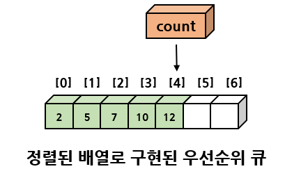

## 연결 리스트를 사용하는 방법

연결 리스트를 이용하는 방법도 배열의 경우와 크게 다르지 않다.  
정렬된 상태로 연결 리스트를 유지할 수도 있고 정렬이 안 된 채로 연결리스트를 사용할 수 있다.

정렬이 안 된 리스트라면 삽입 시에는 첫 번째 노드로 삽입시키는 것이 유리하다.  
또한 삽입 시에 배열과 달리 다른 노드를 이동할 필요가 없고 포인터만 변경하면 된다.  
따라서 삽입의 시간 복잡도는 O(1)이다.

삭제 시에는 포인터를 따라 모든 노드를 뒤져봐야 한다. 이 경우 시간복잡도는 O(n)이 된다.

만약 정렬시킨 상태로 사용한다면 우선 순위가 높은 요소가 앞에 위치하는 것이 유리하다.  
따라서 우선순위가 높은 요소가 첫 번째 노드가 되도록 한다.  
삽입시에는 우선 순위값을 기준으로 위치를 찾아야 하므로 O(n)이 된다.  
삭제 시에는 첫 번째 노드를 삭제하면 되므로 O(1)이다.

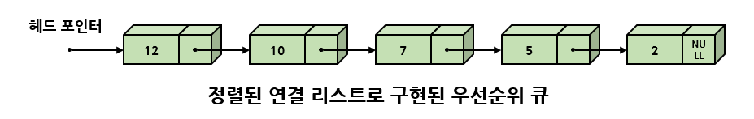

## 히프를 사용하는 방법

<b>히프(heap)</b>는 완전 이진 트리의 일종으로 우선순위 큐를 위해 특별히 만들어진 자료 구조이다.  
히프는 일종의 느슨한 정렬 상태를 유지한다.  
즉 완전히 정렬된 것은 아니지만 전혀 정렬이 안된 것도 아닌 상태를 유지한다.

히프는 이러한 느슨한 정렬 상태를 이용해 우선순위 큐를 구현한다.  
아래는 우선순위 큐를 구현하는 방법들의 비교이다.

| 표현 방법             |  삽입   |  삭제   |
| :-------------------- | :-----: | :-----: |
| 순서 없는 배열        |  O(1)   |  O(n)   |
| 순서 없는 연결 리스트 |  O(1)   |  O(n)   |
| 정렬된 배열           |  O(n)   |  O(1)   |
| 정렬된 연결 리스트    |  O(n)   |  O(1)   |
| 히프                  | O(logn) | O(logn) |

# 3. 히프

## 히프의 개념

<b>히프(heap)</b>를 영어사전에 찾아보면 "더미"라 되어 있는데,  
컴퓨터 분야에서 히프는 <b>완전 이진트리</b> 기반의 "더미"와 모습이 비슷한 특정한 자료 구조이다.

히프는 여러 개의 값들 중에서 가장 큰 값이나 가장 작은 값을 빠르게 찾아내도록 만들어진 자료 구조이다.  
간단히 말하면 부모 노드의 키 값이 자식 노드의 키  값보다 항상 큰 이진트리를 말한다.  
히프는 부모 노드와 자식 노드 간에 다음과 같은 조건이 항상 성립하는 트리이다.

key(부모노드) key(자식노드)

예를 들면 밑의 그림과 같은 트리가 히프이다.  
히프트리에서는 중복된 값을 허용함에 유의해야한다. 이진 탐색 트리에서는 중복된 값을 허용하지 않았었다.

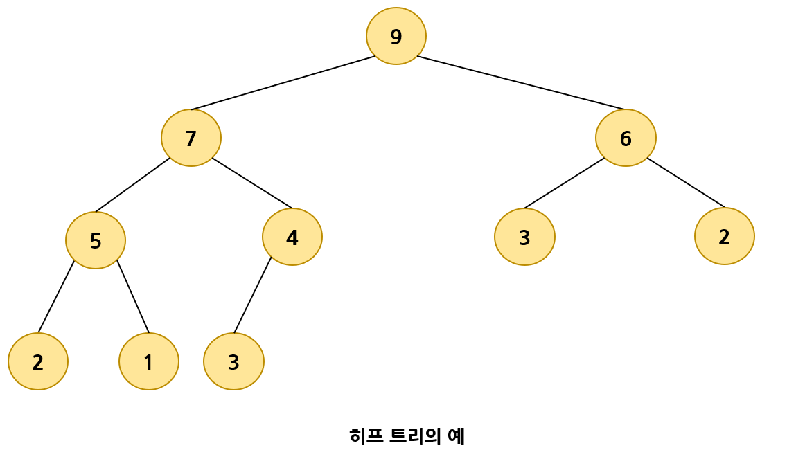

히프 안에서 데이터들은 느슨한 정렬 상태를 유지한다.  
즉 큰 값이 상위 레벨에 있고 작은 값이 하위 레벨이 있다는 정도이다.  
히프의 목적은 삭제 연산이 수행될 때마다 가장 큰 값을 찾아내기만 하면 되는 것이므로 전체를 정렬할 필요는 없다.

히프는 <b>완전 이진 트리(complete binary tree)</b>이다.  
다음 그림은 히프의 특성을 만족하는 것처럼 보이지만 완전 이진 트리가 아니기 때문에 히프는 아니다.

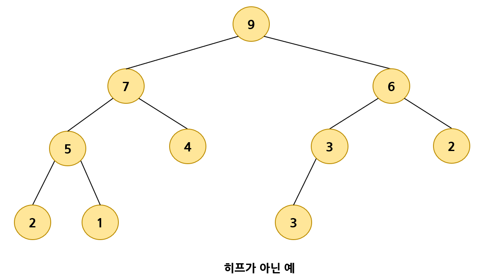

## 히프의 종류

히프에는 두 가지 종류의 히프트리가 존재한다.  
부모 노드의 키 값이 자식 노드보다 큰 <b>최대 히프(max heap)</b>,  
또 하나는 노드의 키 값이 자식 노드보다 작은 <b>최소 히프(min heap)</b>이다.  
두 가지의 히프는 단지 부등호만 달라지고 나머지는 완전히 동일하다.

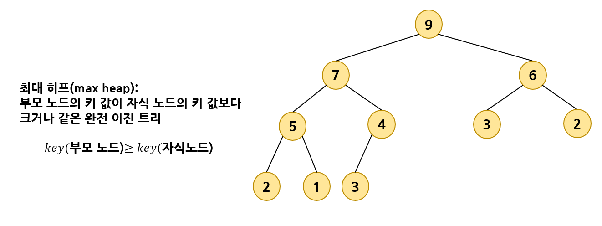

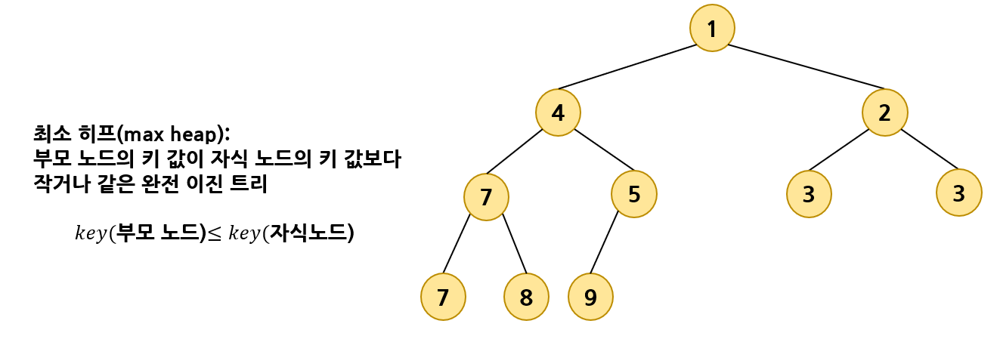

## 히프의 구현

히프는 완전 이진 트리이기 때문에 각각의 노드에 차례대로 번호를 붙일 수 있다.  
번호를 배열의 인덱스로 생각하면 배열에 히프의 노드들을 저장할 수 있다.  
따라서 히프를 저장하는 표준적인 자료구조는 배열이다.

프로그램 구현을 쉽게 하기 위해 배열의 첫 번째 인덱스인 0은 사용되지 않는다.  
특정 위치의 노드 번호는 새로운 노드가 추가되어도 변하지 않는다.  
예를 들어 루트 노드의 오른쪽 노드의 번호는 항상 3번이다.

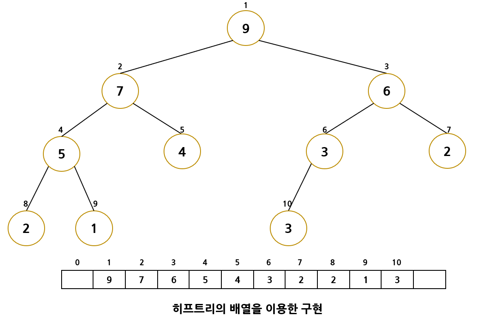

배열을 이용해 히프를 저장하면 완전 이진 트리에서처럼 자식 노드와 부모 노드를 쉽게 알 수 있다.

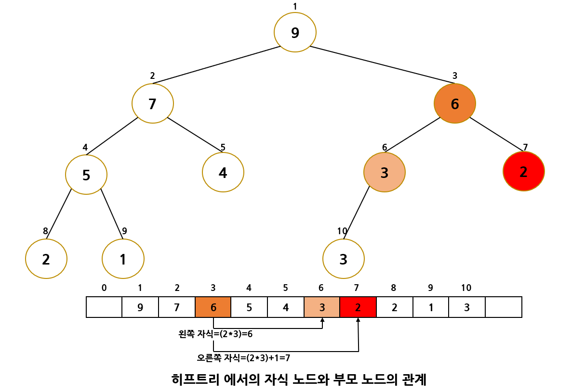

어떤 노드의 왼쪽이나 오른쪽 자식의 인덱스를 알고 싶다면 다음과 같은 식을 이용하면 된다.

- 왼쪽 자식의 인덱스 = (부모의 인덱스) * 2
- 오른쪽 자식의 인덱스 = (부모의 인덱스) * 2 + 1

부모의 인덱스를 알고 싶으면 다음과 같은 식을 이용한다.

- 부모의 인덱스 = (자식의 인덱스) / 2

# 4. 히프의 구현

## 히프의 정의

히프는 1차원 배열로 표현될 수 있기 때문에 아래와 같이 히프의 각 요소들을 구조체 element로 정의하고,  
element의 1차원 배열을 만들어 히프를 구현한다. 여기서 heap_size는 현재 히프 안에 저장된 요소의 개수이다.

```C
#define MAX_ELEMENT 200
typedef struct {
    int key;
} element;
typedef struct {
    element heap[MAX_ELEMENT];
    int heap_size;
} HeapType;
```

위의 정의를 이용해 heap를 생성하고 싶으면 다음처럼 하면 된다.

```C
HeapType heap;
```

또는 동적으로 생성할 수도 있다.

```C
HeapType *heap = create();	// 메모리 동적 할당을 이용
```

## 삽입 연산

히프에 있어 삽입 연산은 회사에서 신입 사원이 들어오면 일단 말단 위치에 앉힌 다음,  
신입 사원의 능력을 봐서 위로 승진시키는 것과 비슷하다.

히프에 새로운 요소가 들어오면, 일단 새로운 노드를 히프의 마지막 노드로 삽입한다.  
마지막 노드 다음에 새로운 노드를 위치시키면 히프트리의 성질이 만족되지 않을 수 있다.  
따라서 삽입 후에 새로운 노드를 부모 노드들과 교환해서 히프의 성질을 만족시켜 주어야 한다.

삽입 연산은 아래 그림의 절차를 통해 히프를 재구성한다.  
최대 히프에 8을 삽입한다는 가정이다.

<b>(1) 먼저 번호순으로 가장 마지막 위치에 이어서 새로운 요소 8이 삽입된다.</b>

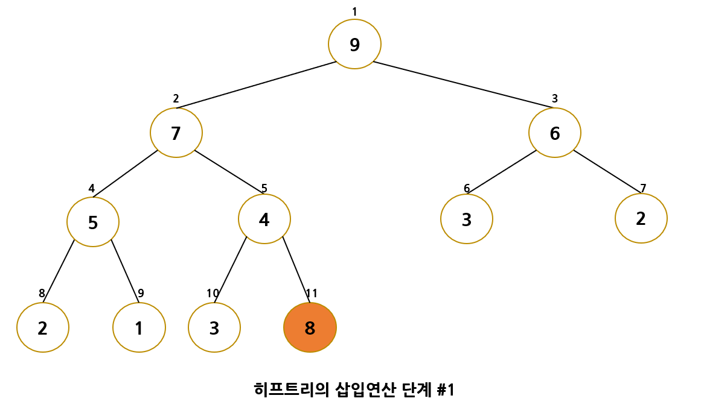

<b>(2) 부모 노드 4와 비교하여 삽입 노드 8이 더 크므로 교환한다.</b>

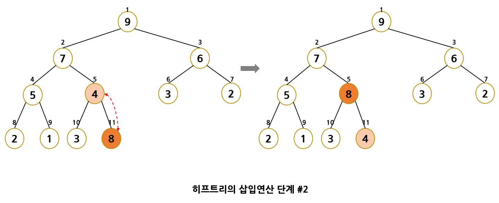

<b>(3) 부모 노드 7과 비교하여 삽입 노드 8이 더 크므로 교환한다.</b>

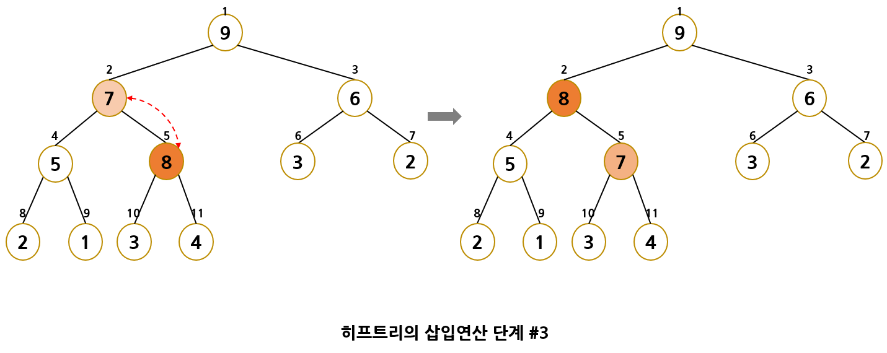

<b>(4) 삽입 노드 8이 부모 노드 9보다 작으므로 더 이상 교환하지 않는다.</b>

이 과정을 코드로 살펴보면 아래와 같다.  
실제 구현에서는 이동 횟수를 줄이기 위해 바로 교환하는 것이 아니고 그냥 부모 노드만 끌어내린 다음,  
삽입될 위치가 확실해 진 다음 최종적으로 그 위치로 이동한다.

```C
// 현재 요소의 개수가 heap_size인 히프 h에 item을 삽입
// 삽입 함수
void insert_max_heap(HeapType *h, element item)
{
    int i;
    i = ++(h->heap_size);
    
    // 트리를 거슬러 올라가면서 부모 노드와 비교하는 과정
    while ((i != 1) && (item.key > h->heap[i / 2].key)) {
        h->heap[i] = h->heap[i / 2];
        i /= 2;
    }
    h->heap[i] = item;	// 새로운 노드를 삽입
}
```

## 히프의 삭제 연산

삭제 연산은 회사에서 사장의 자리가 비게 되면 제일 말단 사원을 사장 자리로 올린 다음 강등시키는 것과 비슷하다.

최대 히프에서 삭제 연산은 최대값을 가진 요소를 삭제하는 것이다.  
최대 히프에서 최대값은 루트 노드이므로 루트 노드가 삭제된다.

루트 노드 삭제 후에 히프를 재구성하는 것이 필요하게 된다.  
히프의 재구성이란 히프의 성질을 만족하기 위해 위, 아래 노드를 교환하는 것이다.  
아래 그림은 루트 노드를 삭제한다고 가정한 그림이다.

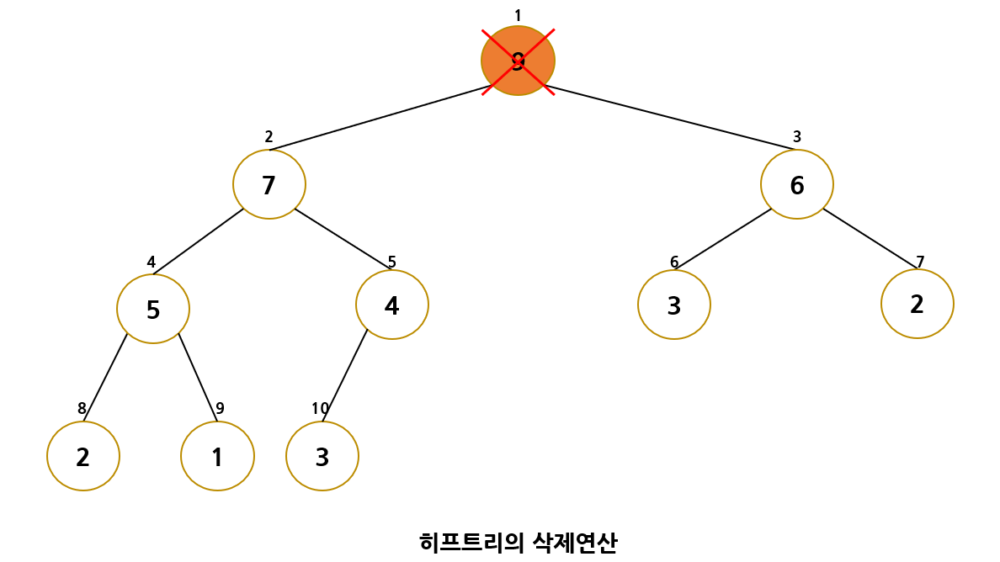

<b>(1) 먼저 루트 노드가 삭제된다. 빈 루트 노드 자리에는 히프의 마지막 노드를 가져온다.</b>

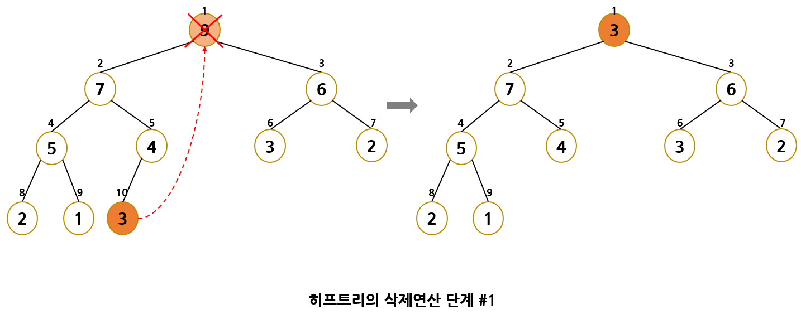

<b>(2) 새로운 루트인 3과 자식 노드들을 비교해보면 자식 노드가 더 크기 때문에 교환이 일어난다.  
	 자식 중에서 더 큰 값과 교환이 일어난다. 따라서 3과 7이 교환된다.</b>

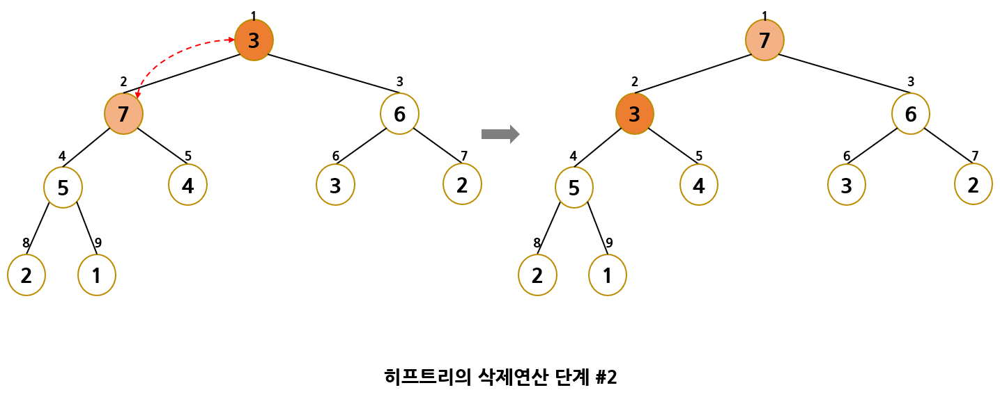

<b>(3) 아직도 3이 자식 노드들보다 더 크기 때문에 3과 자식 노드 5를 교환한다.</b>


<b>(4) 3이 자식 노드인 2와 1보다 크기 때문에 더이상의 교환은 필요없다.</b>

```C
// 삭제 함수
element delete_max_heap(HeapType *h)
{
    int parent, child;
    element item, temp;
    
    item = h->heap[1];
    temp = h->heap[(h->heap_size)--];
    parent = 1;
    child = 2;
    while (child <= h->heap_size) {
        // 현재 노드의 자식노드 중 더 큰 자식노드를 찾는다.
        if ((child < h->heap_size) && (h->heap[child].key) < (h->heap[child + 1].key))
            child++;
        if (temp.key >= h->heap[child].key) break;
        // 한 단계 아래로 이동
        h->heap[parent] = h->heap[child];
        parent = child;
        child *= 2;
    }
    h->heap[parent] = temp;
    return item;
}
```

## 전체 프로그램

```C
#include<stdio.h>
#include<stdlib.h>
#define MAX_ELEMENT 200

typedef struct {
    int key;
} element;

typedef struct {
    element heap[MAX_ELEMENT];
    int heap_size;
} HeapType;

// 생성 함수
HeapType* create()
{
    return (HeapType*)malloc(sizeof(HeapType));
}

// 초기화 함수
void init(HeapType *h)
{
    h->heap_size = 0;
}

// 현재 요소의 개수가 heap_size인 히프 h에 item을 삽입
// 삽입 함수
void insert_max_heap(HeapType *h, element item)
{
    int i;
    i = ++(h->heap_size);
    
    // 트리를 거슬러 올라가면서 부모 노드와 비교하는 과정
    while ((i != 1) && (item.key > h->heap[i / 2].key)) {
        h->heap[i] = h->heap[i / 2];
        i /= 2;
    }
    h->heap[i] = item;	// 새로운 노드를 삽입
}

// 삭제 함수
element delete_max_heap(HeapType *h)
{
    int parent, child;
    element item, temp;
    
    item = h->heap[1];
    temp = h->heap[(h->heap_size)--];
    parent = 1;
    child = 2;
    while (child <= h->heap_size) {
        // 현재 노드의 자식노드 중 더 큰 자식노드를 찾는다.
        if ((child < h->heap_size) && (h->heap[child].key) < (h->heap[child + 1].key))
            child++;
        if (temp.key >= h->heap[child].key) break;
        // 한 단계 아래로 이동
        h->heap[parent] = h->heap[child];
        parent = child;
        child *= 2;
    }
    h->heap[parent] = temp;
    return item;
}

int main()
{
    element e1 = { 10 }, e2 = { 5 }, e3 = { 30 };
    element e4, e5, e6;
    HeapType *heap;

    heap = create() ;    // 히프 생성
    init(heap);         // 초기화

    // 삽입
    insert_max_heap(heap, e1);
    insert_max_heap(heap, e2);
    insert_max_heap(heap, e3);

    // 삭제
    e4 = delete_max_heap(heap);
    printf("< %d > ", e4.key);
    e5 = delete_max_heap(heap);
    printf("< %d > ", e5.key);
    e6 = delete_max_heap(heap);
    printf("< %d >\n", e6.key);

    free(heap);
    return 0;
}
```

## 히프의 복잡도 분석

삽입 연산에서 새로운 요소 히프트리를 타고 올라가면서 부모 노드들과 교환을 하게 되는데  
최악의 경우, 루트 노드까지 올라가야 하므로 거의 트리 높이에 해당하는 비교 연산 및 이동 연산이 필요하다.  
히프가 완전 이진 트리임을 생각하면 히프의 높이는 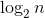가 되므로 삽입의 시간 복잡도는 O()이 된다.

삭제도 마찬가지로 마지막 노드를 루트로 가져온 후, 자식 노드들과 비교해 교환하는 부분이 가장 긴 시간이 걸리는데, 이것도 최악의 경우 가장 아래 레벨까지 내려가야 하므로 트리의 높이만큼의 시간이 걸린다.
따라서 삭제의 시간 복잡도도 O()이 된다.

# 5. 히프 정렬

n개의 요소는 O(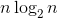) 시간 안에 정렬된다.

예를 들어 정렬해야 할 데이터들이 다음 그림과같이 1차원 배열에 정렬되지 않은 상태로 저장되어 있다고 하면
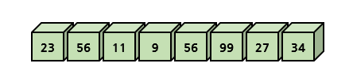

이 데이터들을 차례대로 최대 히프에 추가해 다음 그림과 같은 히프를 생성한다.

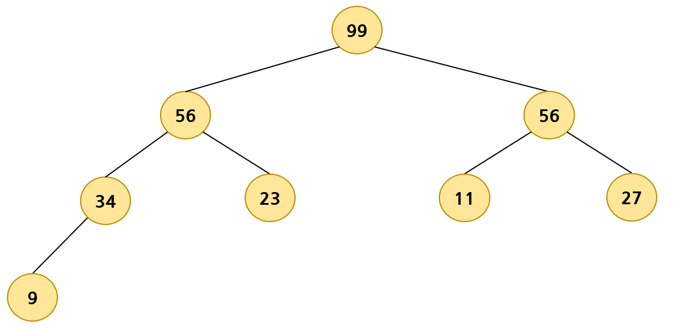

한 번에 하나씩 요소를 히프에서 꺼내 배열 뒤쪽부터 저장하면 된다.  
그러면 배열 요소들은 값이 증가되는 순서로 정렬되게 된다.
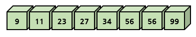

## 히프 정렬의 구현

```C
#include<stdio.h>
#include<stdlib.h>
#define MAX_ELEMENT 200

typedef struct {
    int key;
} element;

typedef struct {
    element heap[MAX_ELEMENT];
    int heap_size;
} HeapType;

// 생성 함수
HeapType* create()
{
    return (HeapType*)malloc(sizeof(HeapType));
}

// 초기화 함수
void init(HeapType *h)
{
    h->heap_size = 0;
}

// 현재 요소의 개수가 heap_size인 히프 h에 item을 삽입
// 삽입 함수
void insert_max_heap(HeapType *h, element item)
{
    int i;
    i = ++(h->heap_size);
    
    // 트리를 거슬러 올라가면서 부모 노드와 비교하는 과정
    while ((i != 1) && (item.key > h->heap[i / 2].key)) {
        h->heap[i] = h->heap[i / 2];
        i /= 2;
    }
    h->heap[i] = item;	// 새로운 노드를 삽입
}

// 삭제 함수
element delete_max_heap(HeapType *h)
{
    int parent, child;
    element item, temp;
    
    item = h->heap[1];
    temp = h->heap[(h->heap_size)--];
    parent = 1;
    child = 2;
    while (child <= h->heap_size) {
        // 현재 노드의 자식노드 중 더 큰 자식노드를 찾는다.
        if ((child < h->heap_size) && (h->heap[child].key) < (h->heap[child + 1].key))
            child++;
        if (temp.key >= h->heap[child].key) break;
        // 한 단계 아래로 이동
        h->heap[parent] = h->heap[child];
        parent = child;
        child *= 2;
    }
    h->heap[parent] = temp;
    return item;
}

// 우선순위 큐인 히프를 이용한 정렬
void heap_sort(element a[], int n)
{
    int i;
    HeapType *h;

    h = create();
    init(h);
    for (i = 0; i < n; i++) {
        insert_max_heap(h, a[i]);
    }
    for (i = (n - 1); i >= 0; i--) {
        a[i] = delete_max_heap(h);
    }
    free(h);
}

#define SIZE 8
int main()
{
    element list[SIZE] = {23, 56, 11, 9, 56, 99, 27, 34};
    heap_sort(list, SIZE);
    for (int i = 0; i < SIZE; i++) {
        printf("%d ", list[i].key);
    }
    printf("\n");
    return 0;
}
```

## 히프 정렬의 복잡도

히프트리의 전체 높이가 거의 이므로(완전이진트리) 따라서 하나의 요소를 히프에 삽입하거나 삭제할 때 히프를 재정비하는 시간이 만큼 소요된다. 요소의 개수가 n개면 전체적으로 O() 의 시간이 걸린다.

히프 정렬이 최대로 유용한 경우는 전체 자료를 정렬하는 것이 아니라 가장 큰 값 몇 개만 필요할 때이다.

# 6. 머쉰 스케줄링

어떤 공장에 동일한 기계가 m개 있다고 하자. 우리는 처리해야 하는 작업을 n개 가지고 있다.  
각 작업이 필요로 하는 기계의 사용시간은 다르다고 하자.  
목표는 모든 기계를 풀가동해서 가장 최소의 시간 안에 작업들을 모두 끝내는 것이다.  
이것을 <b>머쉰 스케줄링(machine schedling)</b>이라고 한다.

이 문제는 알고리즘 분야에서 상당히 유서 깊은 문제로 많은 응용 분야를 가지고 있다.  
예를 들어 서버가 여러 개 있어서 서버에 작업을 분배할 때도 사용할 수 있다.  
최적의 해를 찾는 것은 상당히 어렵지만 근사의 해를 찾는 방법이 있는데,  
<b>그 중 한가지가 LPT(longest processing time first) 방법</b>이다.

LPT는 가장 긴 작업을 우선적으로 기계에 할당하는 것이다.  
예를 들어 밑의 표와 같은 순서대로 7개의 작업이 예정되어 있고 동일한 기계가 3개 있다고 가정하면  
각 작업들은 기계 사용 시간에 따라 다음과 같이 미리 정렬되어 있다고 가정한다(히프 정렬을 사용할 수도 있다).

|  J1  |  J2  |  J3  |  J4  |  J5  |  J6  |  J7  |
| :--: | :--: | :--: | :--: | :--: | :--: | :--: |
|  8   |  7   |  6   |  5   |  3   |  2   |  1   |

LPT 알고리즘은 각 작업들을 가장 먼저 사용가능하게 되는 기계에 할당하는 것이다.

LPT 알고리즘을 사용하면 위의 작업들은 다음과 같이 할당된다.

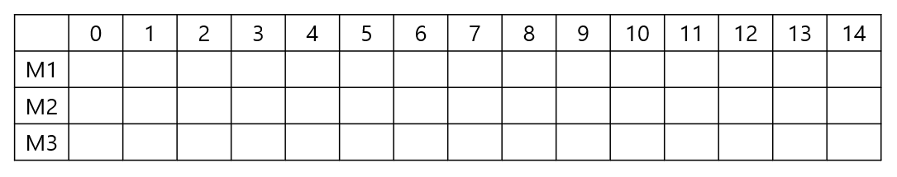

여기서는 최소 히프를 사용한다. 최소 히프는 모든 기계의 종료 시간을 저장하고 있다.  
처음에는 어떤 기계도 사용되지 않으므로 모든 기계의 종료 시간은 0이다.

히프에서 최소의 종료 시간을 가지는 기계를 삭제하여서 작업을 할당한다.  
선택된 기계의 종료 시간을 업데이트하고 다시 히프에 저장한다.  
예를 들어 맨 처음에는 M1이 선택되어 히프에서 삭제되고 작업J1이 이 기계에 할당된다.

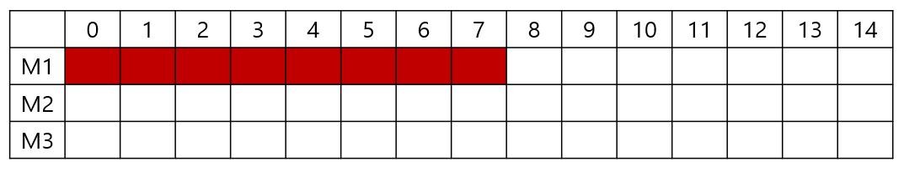

다음 작업은 J2로, 7시간을 차지한다. M2와 M3가 비어 있으므로 M2에 할당이 된다.

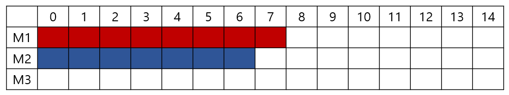

다음 작업은 J3으로, 6시간을 차지한다. M3가 비어 있으므로 M3에 할당된다.

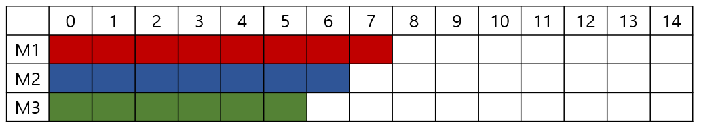

다음 작업은 J4로, 5시간을 차지한다. 가장 먼저 사용가능하게 되는 기계는 M3이므로 M3에 할당된다.

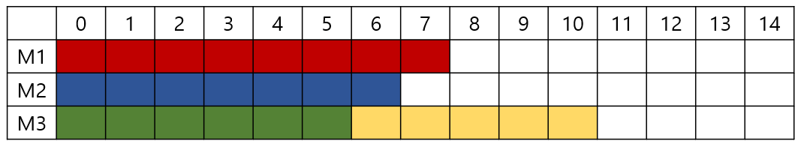

나머지도 유사한 알고리즘으로 할당이 된다.

## LPT 알고리즘의 구현

기계의 종료 시간이 중요하다. 종료 시간이 최소인 기계가 항상 선택되기 때문이다.

따라서 기계의 종료 시간을 최소 히프에 넣고 최소 히프에서 기계를 꺼내서 그 기계에 작업을 할당하면 된다.  
작업을 할당한 후에는 기계의 종료 시간을 작업 시간만큼 증가시킨 후에 다시 최소 히프에 넣는다.

```C
#include <stdio.h>
#include <stdlib.h>

#define MAX_ELEMENT 200

typedef struct {
    int id;
    int avail;
} element;

typedef struct {
    element heap[MAX_ELEMENT];
    int heap_size;
} HeapType;

// 생성 함수
HeapType* create()
{
    return (HeapType*)malloc(sizeof(HeapType));
}

// 초기화 함수
void init(HeapType* h)
{
    h->heap_size = 0;
}

// 현재 요소의 개수가 heap_size인 히프 h에 item을 삽입
// 삽입 함수
void insert_min_heap(HeapType* h, element item)
{
    int i;
    i = ++(h->heap_size);

    // 트리를 거슬러 올라가며 부모 노드와 비교하는 과정
    while ((i != 1) && (item.avail < h->heap[i / 2].avail)) {
        h->heap[i] = h->heap[i / 2];
        i /= 2;
    }
    h->heap[i] = item;  // 새로운 노드를 삽입
}

// 삭제 함수
element delete_min_heap(HeapType* h)
{
    int parent, child;
    element item, temp;

    item = h->heap[1];
    temp = h->heap[(h->heap_size)--];
    parent = 1;
    child = 2;
    while (child <= h->heap_size) {
        // 현재 노드의 자식노드 중 더 작은 자식노드를 찾는다.
        if ((child < h->heap_size) && (h->heap[child].avail)
            > (h->heap[child + 1].avail))
            child++;
        if (temp.avail < h->heap[child].avail) break;
        // 한 단계 아래로 이동
        h->heap[parent] = h->heap[child];
        parent = child;
        child *= 2;
    }
    h->heap[parent] = temp;
    return item;
}

#define JOBS 7
#define MACHINES 3

int main()
{
    int jobs[JOBS] = { 8, 7, 6, 5, 3, 2, 1 };   // 작업은 정렬되어 있다고 가정
    element m = { 0, 0 };
    HeapType *h;
    h = create();
    init(h);

    // avail 값은 기계가 사용 가능하게 되는 시간이다.
    for (int i = 0; i < MACHINES; i++) {
        m.id= i + 1;
        m.avail = 0;
        insert_min_heap(h, m);
    }
    // 최소 히프에서 기계를 꺼내서 작업을 할당하고 사용가능 시간을 증가 시킨 후에
    // 다시 최소 히프에 추가한다.
    for (int i = 0; i < JOBS; i++) {
        m = delete_min_heap(h);
        printf("JOB %d을 시간 = %d부터 시간 = %d까지 기계 %d번에 할당한다. \n",
        i, m.avail, m.avail + jobs[i] - 1, m.id);
        m.avail += jobs[i];
        insert_min_heap(h, m);
    }
    return 0;
}
```


# 7. 허프만 코드

이진 트리는 각 글자의 빈도가 알려져 있는 메시지의 내용을 압축하는데 사용될 수 있다.

이런 특별한 종류의 이진트리를 <b>허프만 코딩 트리</b>라고 부른다.  
예를 들어 영문 신문에 실린 기사를 분석해 각 글자의 빈도수를 분석해보면 다음과 같을 수 있다.

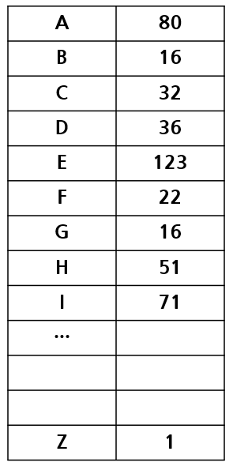

테이블의 숫자는 <b>빈도수(frequencies)</b>라 불린다.

각 숫자들은 영문 텍스트에서 해당 글자가 나타는 횟수이다.  
이 빈도수를 이용해 데이터를 압축할 때 각 글자들을 나타내는 최소길이의 엔코딩 비트열을 만들 수 있다.  
데이터를 압축할 때는 흔히 사용하는 아스키(ASCII)코드를 사용하지 않는다.

보통 전체 데이터의 양을 줄이기 위해고정된 길이를 사용하지 않고 가변 길이의 코드를 사용한다.  
각 글자의 빈도수에 따라서 가장 많이 등장하는 글자에는 짧은 비트열을 사용하고,  
잘 나오지 않는 글자에는 긴 비트열을 사용해 전체의 크기를 줄이자는 것이다.  
즉, 많이 등장하는 e를 나타내기 위해 2비트를 사용하고 잘 나오지 않는 z를 나타내기 위해 15비트를 사용하자는 것이다.

예를 들어 만약 텍스트가 e, t, n, i, s의 5개 글자로만 이루어졌다고 가정하고 각 글자의 빈도수가 다음고 같다고 가정하면

| 글자 | 빈도수 |
| :--: | :----: |
|  e   |   15   |
|  t   |   12   |
|  n   |   8    |
|  i   |   6    |
|  s   |   4    |

텍스트의 길이가 45글자이므로 한 글자를 3비트로 표시하는 아스키 코드의 경우,  
45글자 * 3비트 / 글자 = 135비트가 필요하다.

그러나 만약 가변길이의 코드를 만들어 사용했을 경우 더 적은 비트로 표현할 수 있다.

15\*2 + 12\*2 + 8\*2 + 6\*3 + 4*3 = 100비트만 있으면 된다.
물론 각 글자를 어떤 비트 코드로 표현했는지를 알려주는 테이블이 있어야 한다.

| 글자 | 코드 | 코드길이 | 빈도수 |   비트수    |
| :--: | :--: | :------: | :----: | :---------: |
|  e   |  00  |    2     |   15   |  2*15 = 30  |
|  t   |  01  |    2     |   12   | 2 * 12 = 24 |
|  n   |  10  |    2     |   8    | 2 * 8 = 16  |
|  i   | 110  |    3     |   6    |  3 * 6 =18  |
|  s   | 111  |    3     |   4    | 3 * 4 = 12  |
| 합계 |      |          |        |     100     |

글자를 나타내는 비트열은 서로 간 혼동을 일으키지 않아야 한다.  
문제는 압축해야할 텍스트가 주어졌을 때 어떻게 그러한 비트코드를 자동으로 생성할 것인가, 그리고 압축된 텍스트가 주어져 있을 때 어떻게 복원할 것인지가 문제이다.

해독하는 문제를 생각해 보자.  
만약 한 글자당 3비트가 할당된다면 3비트씩 끊어서 읽으면 되기때문에 메시지를 해독하는 것은 아주 쉽다.

만약 가변길이 코드가 사용되었을 경우는 어떻게 될까?

teen의 경우 가변코드를 사용해 코딩하면 01000010이 된다. 이 메시지는 어디서 끊어 읽어 해독해야 될까?  
첫 번째 글자의 경우 하나의 글자가 3비트 까지 가능하므로 00, 01, 010 중 하나이다.  
그러나 테이블을 보면 0이나 010인 코드는 없기때문에 첫 번째 글자는 01이 분명하고 01은 t이다.

또 그 다음 코드는 0, 00, 000 중 하나이다. 그러나 이역시 테이블을 보면 같은 이유로 00이 된다. 따라서 e이다.  
이런 식으로 계속 진행하면 teen이라고 하는 원문을 추출할 수 있다.

이런 해독과정을 가능하게 하는 원인은 코드를 관찰해 보면 모든 코드가 다른 코드의 첫 부분이 아니라는 것이다.  
따라서 코딩된 비트열을 왼쪽에서 오른쪽으로 조사해 보면 정확히 하나의 코드만 일치하는 것을 볼 수 있다.

이런특수한 코드를 만들기 위해 이진 트리를 사용할 수 있다.  
이런 종류의 코드를 <b>호프만 코드(Huffman codes)</b>라고 한다.

호프만 코드를 만드는 절차를 살펴보자.

| 글자 | 빈도수 |
| :--: | :----: |
|  s   |   4    |
|  i   |   6    |
|  n   |   8    |
|  t   |   12   |
|  e   |   15   |

빈도수에 따라 5개의 글자를 나열하고, 가장 작은 빈도수를 가지는 글자 2개(s, i)를 추출해 이들을 단말 노드로 하여 이진 트리를 구성한다. 루트의 값은 각 자식노드의 값을 합한 값이 된다.

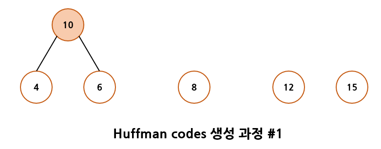

다시 정렬된 글자들의 리스트로 돌아가 이 합쳐진 값을 글자들의 리스트에 삽입해 (10, 8, 12, 15)를 얻는다.

이 빈도수를 정렬해 (8, 10, 12, 15)를 얻을 수 있고, 다시 이중에서 가장 작은 값 2개를 단말노드로 하여 다음 그림과 같은 이진트리를 구성한다.

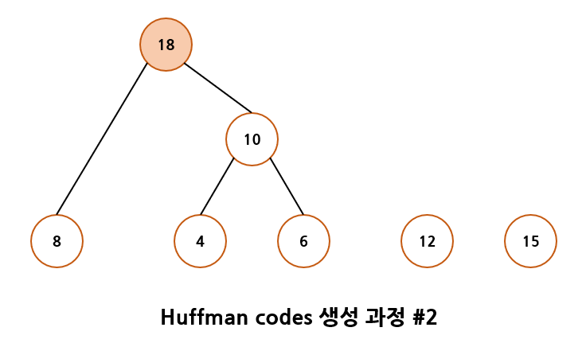

다시 글자들의 리스트로 돌아가 합쳐진 값을 글자들의 리스트에 삽입해 (12, 15, 18)을 얻는다.

다시 이중에서 가장 작은 값 2개를 단말노드로 하여 다음 그림과 같은 이진트리를 구성한다.

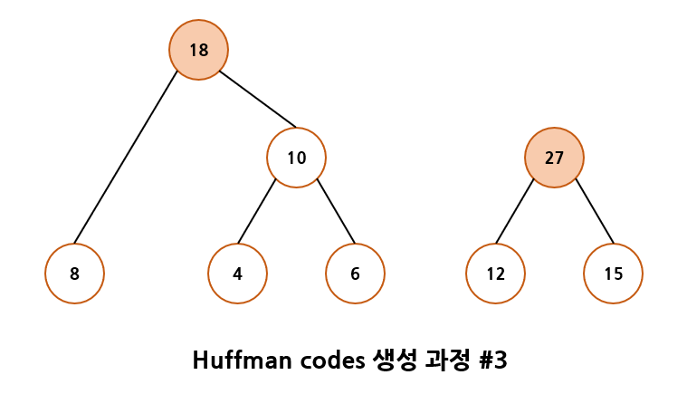

같은 식으로 해서 (18, 27)이 되고 이 두 값을 단말노드로 해서 이진 트리를 구성하면 다음 그림과 같이 된다.

이 허프만 트리에서 왼쪽 간선은 비트 1을 나타내고 오른쪽 간선은 비트 0을 나타낸다.


이제 각 글자에 대한 호프만 코드는 단순히 루트 노드에서 단말 노드까지의 경로에 있는 간선의 레벨값을 읽으면 된다.

즉 빈도수 6에 해당하는 글자 i의 코드는 110이 된다. 같은 식으로 다른 글자에 대한 허프만 코드 값을 얻을 수 있다.

허프만 코드 알고리즘에서 가장 작은 2개의 빈도수를 얻는 과정이 있다.  
이것은 히프트리를 이용하면 가장 효율적으로 구성될 수 있다. 여기서는 최소 히프를 이용해야 한다.  
다음은 허프만 코드 프로그램의 코드이다.

```C
#include <stdio.h>
#include <stdlib.h>
#define MAX_ELEMENT 200

typedef struct _TreeNode {
    int weight;
    char ch;
    struct _TreeNode *left;
    struct _TreeNode *right;
} TreeNode;

typedef struct {
    TreeNode *ptree;
    char ch;
    int key;
} element;

typedef struct {
    element heap[MAX_ELEMENT];
    int heap_size;
} HeapType;

// 생성 함수
HeapType* create()
{
    return (HeapType*)malloc(sizeof(HeapType));
}

// 초기화 함수
void init(HeapType* h)
{
    h->heap_size = 0;
}

// 현재 요소의 개수가 heap_size인 히프 h에 item을 삽입
// 삽입 함수
void insert_min_heap(HeapType* h, element item)
{
    int i;
    i = ++(h->heap_size);

    // 트리를 거슬러 올라가며 부모 노드와 비교하는 과정
    while ((i != 1) && (item.key < h->heap[i / 2].key)) {
        h->heap[i] = h->heap[i / 2];
        i /= 2;
    }
    h->heap[i] = item;  // 새로운 노드를 삽입
}

// 삭제 함수
element delete_min_heap(HeapType *h)
{
    int parent, child;
    element item, temp;

    item = h->heap[1];
    temp = h->heap[(h->heap_size)--];
    parent = 1;
    child = 2;
    while (child <= h->heap_size) {
        // 현재 노드의 자식노드 중 더 작은 자식노드를 찾는다.
        if ((child < h->heap_size) && (h->heap[child].key) >
            (h->heap[child + 1].key)) {
            child++;
        }
        if (temp.key < h->heap[child].key) break;
        // 한 단계 아래로 이동
        h->heap[parent] = h->heap[child];
        parent = child;
        child *= 2;
    }
    h->heap[parent] = temp;
    return item;
}

// 이진 트리 생성 함수
TreeNode* make_tree(TreeNode *left, TreeNode *right)
{
    TreeNode *node = (TreeNode*)malloc(sizeof(TreeNode));
    node->left = left;
    node->right = right;
    return node;
}

// 이진 트리 제거 함수
void destroy_tree(TreeNode *root)
{
    if (root == NULL) return;
    destroy_tree(root->left);
    destroy_tree(root->right);
    free(root);
}

int is_leaf(TreeNode *root)
{
    return !(root->left) && !(root->right);
}

void print_array(int codes[], int n)
{
    for (int i = 0; i < n; i++) {
        printf("%d", codes[i]);
    }
    printf("\n");
}

void print_codes(TreeNode *root, int codes[], int top)
{
    // 1을 저장하고 순환호출
    if (root->left) {
        codes[top] = 1;
        print_codes(root->left, codes, top + 1);
    }

    // 0을 저장하고 순환호출
    if (root->right) {
        codes[top] = 0;
        print_codes(root->right, codes, top + 1);
    }

    // 단말 노드이면 코드를 출력
    if (is_leaf(root)) {
        printf("%c: ", root->ch);
        print_array(codes, top);
    }
}

// 허프만 코드 생성 함수
void huffman_tree(int freq[], char ch_list[], int n)
{
    int i;
    TreeNode *node, *x;
    HeapType *heap;
    element e, e1, e2;
    int codes[100];
    int top = 0;

    heap = create();
    init(heap);
    for (i = 0; i < n; i++) {
        node = make_tree(NULL, NULL);
        e.ch = node->ch = ch_list[i];
        e.key = node->weight = freq[i];
        e.ptree = node;
        insert_min_heap(heap, e);
    }
    for (i = 1; i < n; i++) {
        // 최솟값을 가지는 두개의 노드를 삭제
        e1 = delete_min_heap(heap);
        e2 = delete_min_heap(heap);
        // 두개의 노드를 합친다.
        x = make_tree(e1.ptree, e2.ptree);
        e.key = x->weight = e1.key + e2.key;
        e.ptree = x;
        printf("%d+%d->%d \n", e1.key, e2.key, e.key);
        insert_min_heap(heap, e);
    }
    e = delete_min_heap(heap); // 최종 트리
    print_codes(e.ptree, codes, top);
    destroy_tree(e.ptree);
    free(heap);
}

int main()
{
    char ch_list[] = { 's', 'i', 'n', 't', 'e' };
    int freq[] = { 4, 6, 8, 12, 15 };
    huffman_tree(freq, ch_list, 5);
    return 0;
}
```

