# 그래프 1

# 1. 그래프란?

## 그래프의 소개

<b>그래프(graph)</b>는 객체 사이의 연결 관계를 표현할 수 있는 자료 구조이다.

그래프의 대표적인 예는 지도이다. 지하철의 노선도는 여러 개의 역들이 어떻게 연결되었는지를 보여준다.  
지도를 그래프로 표현하면 지하철의 특정한 역에서 다른 역으로 가는 최단 경로를 프로그래밍해서 찾을 수 있다.

또한 전기 소자를 그래프로 표현하게 되면 전기 회로의 소자들이 어떻게 연결되어 있는지를 표현해야 회로를 분석할 수 있으며, 운영 체제에서는 프로세스와 자원들이 어떻게 연관되는지를 그래프로 분석해 시스템의 효율이나 교착상태 유무 등을 알아낼 수 있다.

많은 문제들은 도시, 소자, 자원, 프로젝트 등의 객체들이 서로 연결되어 있는 구조로 표현 가능하다.  
그래프는 이러한 문제들을 표현할 수 있는 훌륭한 논리적 도구이며 선형리스트/트리의 구조로는 이러한 복잡한 문제들을 표현할 수가 없다.

그래프 구조는 인접 행렬이나 인접 리스트로 메모리에 표현되고 처리될 수 있어 광범위한 분야의 다양한 문제들을 그래프로 표현해 컴퓨터 프로그래밍으로 해결할 수 있다.

그래프는 아주 일반적인 자료 구조로서 앞에서 배웠던 트리도 그래프의 하나의 특수한 종류로 볼 수 있다.

## 그래프의 역사


1736년에 수학자 오일러는 "Konigsberg의 다리" 문제를 해결하기 위해 그래프를 처음으로 사용하였다.

Konigsberg시의 한 가운데는 Pregel 강이 흐르고 있고 여기에는 7개의 다리가 있다.  
"Konigsberg의 다리" 문제란 "임의의 지역에서 출발해 모든 다리를 단 한번만 건너서 처음 출발했던 지역으로 돌아올 수 있는가" 이다.

오일러는 어떤 한 지역에서 시작해 모든 다리를 한 번씩만 지나 처음 출발점으로 되돌아오려면 각 지역에 연결된 다리의 개수가 모두 짝수이어야 함을 증명했다. 그리고 다음과 같이 간단하게 변경했다.

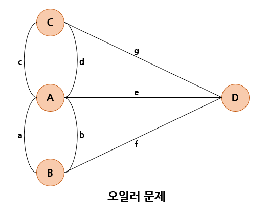

오일러는 이 문제에서 핵심적이고 중요한 것은 'A, B, C, D의 위치가 어떠한 관계로 연결되었는가?' 라고 생각하고, 특정 지역은 <b>정점(node)</b>으로, 다리는 <b>간선(egde)</b>으로 표현하여 위와 같은 <b>그래프(graph)</b>문제로 변환하였다.

오일러는 이러한 그래프에 존재하는 모든 간선을 한번만 통과하면서 처음 정점을 되돌아오는 경로를 <b>오일러 경로(Eulerian tour)</b>라 정의하고, 그래프의 모든 정점에 연결된 간선의 개수가 짝수일 때만 오일러 경로가 존재한다는 오일러의 정리를 증명하였다.

따라서 위의 그래프는 오일러의 정리에 의해 오일러 경로가 존재하지 않는다는 것을 알 수 있게 한다.

## 그래프로 표현할 수 있는 것들

- 도로 : 도로의 교차점과 일방통행길 등을 그래프로 효과적이게 표현할 수 있다.
  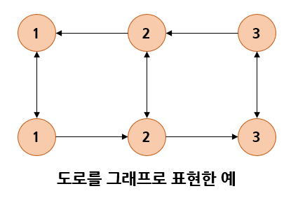
- 미로 : 미로도 그래프를 이용해 효과적으로 표현이 가능하다.
- 선수과목 : 대학교에서 전공과목을 수강하기 위해 미리 들어야 하는 선수과목들이 있다.  
  그래프는 이러한 선수과목 관계를 효과적으로 표현할 수 있다.
  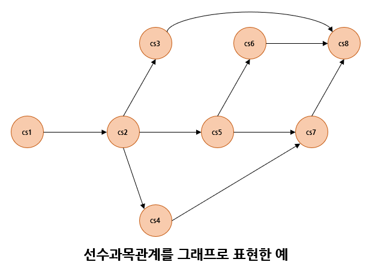

# 2. 그래프의 정의와 용어

## 그래프의 정의

그래프는 <b>정점(vertex)</b>과 <b>간선(edge)</b>들의 유한 집합이라 할 수 있다.  
수학적으로는 G = (V, E)와 같이 표시한다.  
여기서, V(G)는 그래프 G의 정점들의 집합을, E(G)는 그래프(G)의 간선들의 집합을 의미한다.

정점은 여러 가지 특성을 가질 수 있는 객체를 의미하고, 간선은 이러한 정점들 간의 관계를 의미한다.  
정점은 노드라고도 불리며, 간선은 <b>링크(link)</b>라고도 불린다.

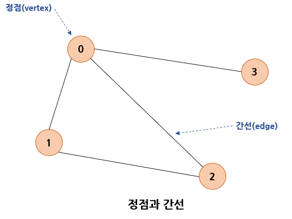

```C
V(G1) = { 0, 1, 2, 3 }
E(G1) = { (0, 1), (0, 2), (0, 3), (1, 2) }
```

## 무방향 그래프와 방향 그래프

간선의 종류에 따라 그래프는 <b>무방향 그래프(undirected graph)</b>와 <b>방향 그래프(directed graph)</b>로 구분된다.

무방향 그래프의 간선은 간선을 통해서 양방향으로 갈수 있음을 나타내며,  
정점 A와 정점 B를 연결하는 간선은 (A, B)와 같이 정점의 쌍으로 표현한다.  
(A, B)와 (B, A)는 동일한 간선이 된다.

방향 그래프는 간선에 방향성이 존재하는 그래프로서 도로의 일방통행길처럼 간선을 통해 한쪽 방향으로만 갈 수 있음을 나타낸다. 정점 A에서 정점 B로만 갈 수 있는 간선은 <A, B>로 표시한다.  
방향 그래프에서 <A, B>와 <B, A>는 서로 다른 간선이다.

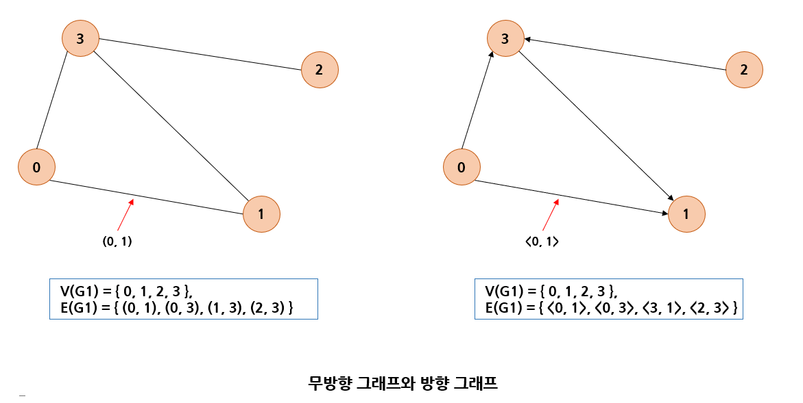

## 네트워크

간선에 가중치를 할당하게 되면, 간선의 역할이 두 정점간의 연결 유무뿐만 아니라 연결 강도까지 나타낼 수 있으므로 보다 복잡한 관계를 표현할 수 있게 된다.

간선에 비용이나 가중치가 할당된 그래프를 <b>가중치 그래프(weighted graph)</b> 또는 <b>네트워크(network)</b>라 하며 아래 그림과 같이 나타낸다.

네트워크는 도시와 도시를 연결하는 도로의 길이, 회로 소자의 용량, 통신망의 사용료 등을 추가로 표현할 수 있으므로 그 응용 분야가 보다 광범위하다.

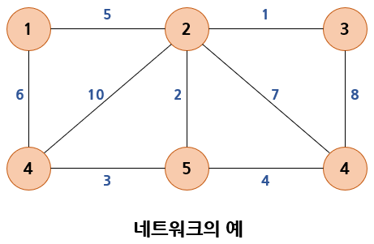

## 부분 그래프

어떤 그래프의 정점의 일부와 간선의 일부로 이루어진 그래프를 <b>부분 그래프(subgraph)</b>라 한다.

그래프 G의 부분 그래프 S는 다음과 같은 수식을 만족시키는 그래프이다.

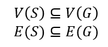

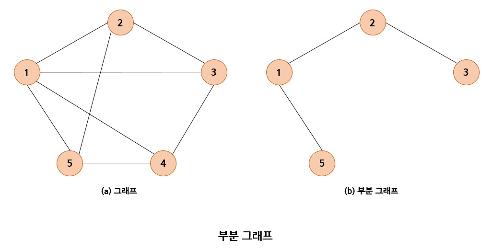

## 정점의 차수

그래프에서 <b>인접 정점(adjacent vertex)</b>이란 간선에 의해 직접 연결된 정점을 뜻한다.

밑에 그림의 그래프에서 정점 0의 인접 정점은 정점 1, 정점 2, 정점 3이다.
무방향 그래프에서 정점의 <b>차수(degree)</b>는 그 정점에 인접한 정점의 수를 말한다. 그림에서 정점0의 차수는 3이다.
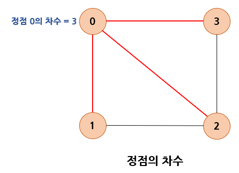

무방향 그래프에서 하나의 간선이 두개의 정점에 인접하기 때문에 모든 정점의 차수를 합하면 간선 수의 2배가 된다.

방향 그래프에서는 외부에서 오는 간선의 개수를 <b>진입 차수(in-degree)</b>라 하고,  
외부로 향하는 간선의 개수를 <b>진출 차수(out-degree)</b>라 한다.

## 경로

무방향 그래프에서 정점 s로부터 정점 e까지의 경로는 정점의 나열 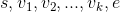로서, 나열된 정점들 간에는 반드시 간선 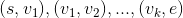가 존재해야 한다.
만약 방향 그래프라면 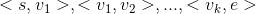가 있어야 한다.

아래 그림의 그래프에서 0, 1, 2, 3은 경로지만 0, 1, 3, 2는 경로가 아니다.
왜냐하면 간선 (1, 3)은 존재하지 않기 때문이다.

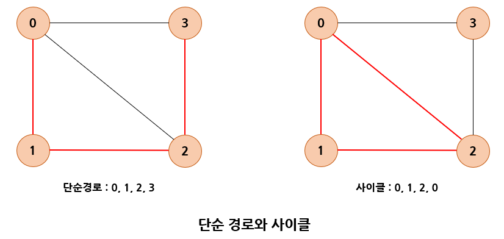

경로 중에서 반복되는 간선이 없을 경우에 이러한 경로를 <b>단순 경로(simple path)</b>라 한다.  
만약 단순 경로의 시작 정점과 종료 정점이 동일하다면 <b>사이클(cycle)</b>이라 한다.

## 연결 그래프

무방향 그래프 G에 있는 모든 정점쌍에 대해 항상 경로가 존재한다면 G는 연결되었다고 하며,  
이러한 무방향 그래프를 <b>연결 그래프(connected graph)</b>라 부른다.

그렇지 않은 그래프는 <b>비연결 그래프(unconnected graph)</b>라고 한다.  
트리는 그래프의 특수한 형태로 사이클을 가지지 않는 연결 그래프이다.

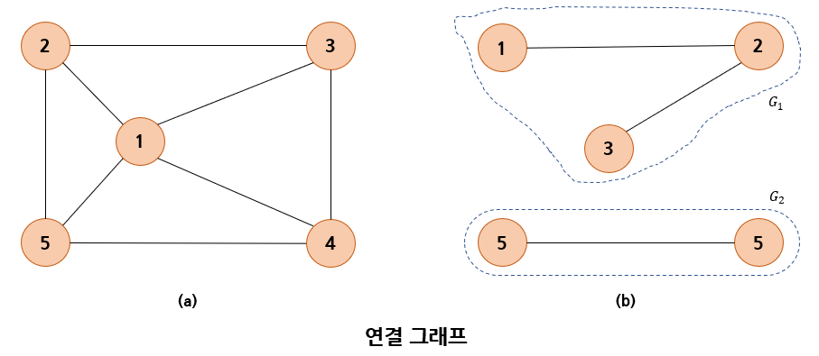

## 완전 그래프

그래프에 속해있는 모든 정점이 서로 연결되어 있는 그래프를 <b>완전 그래프(complete graph)</b>라고 한다.  
무방향 완전 그래프의 정점 수를 n이라고 하면, 하나의 정점은 n-1개의 다른 정점으로 연결되므로  
간선의 수는 n * (n-1) / 2가 된다.

만약 완전 그래프에서 n = 4라면 간선의 수는 6이다.

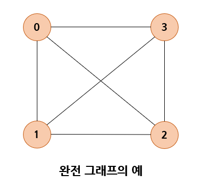

# 3. 그래프의 표현 방법

그래프를 표현하는 방법에는 2가지의 방법이 있다.

각 표현방법은 각각 메모리 사용량과 처리 시간 등에서 장단점을 가지므로 문제에 적합한 표현방법을 선택해야 한다.

- 인접 행렬(adjacency matrix)  : 2차원 배열을 사용해 그래프를 표현한다.
- 인접 리스트(adjacency list) : 연결 리스트를 사용하는 그래프를 표현한다.

## 인접 행렬

그래프의 정점 수가 n이라면 n x n의 2차원 배열인 <b>인접 행렬(adjacency matrix)</b> M의 각 원소를 다음 규칙에 의해 할당함으로써 그래프를 메모리에 표현할 수 있다.

```C
if(간선 (i, j)가 그래프에 존재) M[i][j] = 1,
otherwise					M[i][j] = 0.
```

지금은 자체 간선을 허용하지 않으므로 인접 행렬의 대각선 성분은 모두 0으로 표시된다.

아래 그림의 (a), (b)와 같이 무방향 그래프의 인접 행렬은 대칭 행렬이 된다.  
무방향 그래프의 간선 (i, j)는 정점 i에서 j로의 연결뿐만 아니라 정점 j에서 i로의 연결을 동시에 의미하기 때문이다.  
따라서 배열의 상위 삼각이나 하위 삼각만 저장하면 메모리를 저장할 수 있다.

그러나 (c)의 방향 그래프의 예에서 보듯 방향 그래프의 인접 행렬은 일반적 대칭이 아니다.

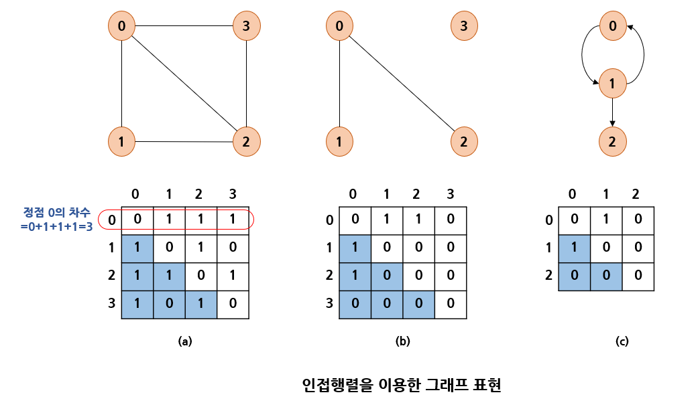

n개의 정점을 가지는 그래프를 인접 행렬로 표현하기 위해 간선의 수에 무관하게 항상 n^2개의 메모리 공간이 필요하다.

이에 따라 인접 행렬은 위의 그림 (a) 와 같이 그래프에 간선이 많이 존재하는 <b>밀집 그래프(dense graph)</b>를 표현하는 경우에는 적합하나,  
(b)와 같이 그래프 내에 적은 숫자의 간선만을 가지는 <b>희소 그래프(sparse graph)</b>의 경우에는 메모리의 낭비가 크므로 적합하지 않다.

인접 행렬을 이용하면 두 정점을 연결하는 간선의 존재 여부를 O(1)시간 안에 즉시 알 수 있는 장점이 있다.  
즉 정점 u와 정점 v를 연결하는 정점이 있는지를 알려면 M[u]\[v]의 값을 조사하면 바로 알 수 있다.

또한 정점의 차수는 인접 행렬의 행이나 열을 조사하면 알 수 있으므로 O(n)의 연산에 의해 알 수 있다.  
정점 i에 대한 차수는 인접 배열의 i번째 행에 있는 값을 모두 더하면 된다.

반면 그래프에 존재하는 모든 간선의 수를 알아내려면 인접 행렬 전체를 조사해야 하므로 n^2번의 조사가 필요하게 되어 O(n^2)의 시간이 요구된다.

## 인접 행렬을 이용한 그래프 추상 데이터 타입의 구현

그래프에 관련된 변수들을 하나의 구조체 GraphType에 정리하자.

먼저 그래프에 존재하는 정점의 개수 n이 필요하다.  
인접 행렬을 이용해 구현하려면 크기가 n * n 인 2차원 배열인 인접이 필요하다.  
인접 행렬의 이름을 adj_mat라고 하면 GraphType 구조체는 다음과 같이 정의할 수 있다.

```C
#define MAX_VERTICES 50
typedef struct GraphType {
    int n;		// 정점의 개수
    int adj_mat[MAX_VERTICES][MAX_VERTICES];
} GraphType;
```

이런 식으로 구현하면 한정된 개수의 정점까지만 그래프에 삽입할 수 있다.  
만약 동적 배열로 구현한다면 사용자가 정점을 삽입할 때마다 다시 크기를 조정할 수 있을 것이다.

정점을 삽입하는 연산은 n을 하나 증가하면 된다. 정점의 번호는 순차적으로 증가한다고 가정하자.  
간선을 삽입하는 연산은 adj_mat[start]\[end]와 adj_mat[end]\[start]에 1을 삽입하면 된다.  
방향 그래프인 경우에는 adj_mat[start]\[end]에만 1을 삽입해야 한다.

```C
#include <stdio.h>
#include <stdlib.h>

#define MAX_VERTICES 50
typedef struct GraphType {
    int n;		// 정점의 개수
    int adj_mat[MAX_VERTICES][MAX_VERTICES];
} GraphType;

// 그래프 초기화
void init(GraphType *g)
{
    int r, c;
    g->n = 0;
    for (r = 0; r < MAX_VERTICES; r++) {
        for (c = 0; c < MAX_VERTICES; c++) {
            g->adj_mat[r][c] = 0;
        }
    }
}

// 정점 삽입 연산
void insert_vertex(GraphType *g, int v)
{
    if (((g->n) + 1) > MAX_VERTICES) {
        fprintf(stderr, "정점의 개수 초과");
        return;
    }
    g->n++;
}

// 간선 삽입 연산
void insert_edge(GraphType *g, int start, int end)
{
    if (start >= g->n || end >= g->n) {
        fprintf(stderr, "정점 번호 오류");
        return;
    }
    g->adj_mat[start][end] = 1;
    g->adj_mat[end][start] = 1;
}

// 인접 행렬 출력 함수
void print_adj_mat(GraphType *g)
{
    for (int i = 0; i < g->n; i++) {
        for (int j = 0; j < g->n; j++) {
            printf("%2d ", g->adj_mat[i][j]);
        }
        printf("\n");
    }
}

int main()
{
    GraphType *g;
    g = (GraphType*)malloc(sizeof(GraphType));
    init(g);
    for (int i = 0; i < 4; i++) {
        insert_vertex(g, i);
    }
    insert_edge(g, 0, 1);
    insert_edge(g, 0, 2);
    insert_edge(g, 0, 3);
    insert_edge(g, 1, 2);
    insert_edge(g, 2, 3);
    print_adj_mat(g);
    
    free(g);
}
```

## 인접 리스트

<b>인접 리스트(adjacency list)</b>는 그래프를 표현함에 있어 각각의 정점에 인접한 정점들을 연결 리스트로 표시한 것이다. 각 연결 리스트의 노드들은 인접 정점을 저장하게 된다.

각 연결 리스트들은 헤더 노드를 가지고 있고 이 헤더 노드들은 하나의 배열로 구성되어 있다.  
따라서 정점의 번호만 알면 이 번호를 배열의 인덱스로 해서 각 정점의 연결 리스트에 쉽게 접근할 수 있다.

무방향 그래프의 경우 정점 i와 정점j를 연결하는 간선 (i, j)는 정점 i의 연결 리스트에 인접 정점 j로서 한번 표현되고, 정점 j의 연결 리스트에 인접 정점 i로 다시 한번 표현된다.

인접 리스트의 각각의 연결 리스트에 정점들이 입력되는 순서에 따라 연결 리스트 내에서 정점들의 순서가달라질 수 있다.

일관성을 유지하기 위해 다음 그림과 같이 인접 리스트가 정점의 오름차순으로 연결된다고 가정한다.
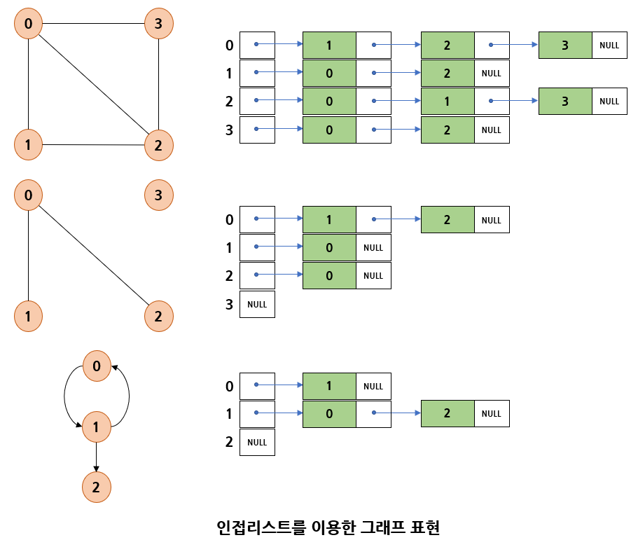

따라서 정점의 수가 n개이고 간선의 수가 e개인 무방향 그래프를 표시하기 위해서는 n개의 연결 리스트가 필요하고, n개의 헤더 노드와 2e개의 노드가 필요하다.  
따라서 인접 행렬 표현은 간선의 개수가 적은 <b>희소 그래프(sparse graph)</b>표현에 적합하다.

그래프에 간선 (i, j)의 존재 여부나 정점 i의 차수를 알기 위해서는 인접 리스트에서 정점 i의 연결 리스트를 탐색해야 하므로 연결 리스트에 있는 노드의 수만큼(정점 차수만큼) 시간이 필요하다.

즉 n개의 정점과 e개의 간선을 가진 그래프에서 전체 간선의 수를 알아내려면 헤더노드를 포함해서 모든 인접 리스트를 조사해야 하므로 O(n+e)의 연산이 요구된다.

## 인접 리스트를 이용한 그래프 추상 데이터 타입의 구현

그래프에 관련된 변수들을 하나의 구조체 GraphType에 정리하도록 하자.

먼저 그래프에 존재하는 장점의 개수 n이 필요하다. 인접 리스트를 이용하여 구현하려면 각 정점마다 하나의 연결 리스트가 필요하다.

따라서 정점의 개수만큼의 포인터 배열이 필요하다.
포인터 배열의 이름을 adj_list라고 하고 연결 리스트의 하나의 노드를 GraphNode라는 구조체를 이용했다.

```C
#include <stdio.h>
#include <stdlib.h>

#define MAX_VERTICES 50
typedef struct _GraphNode {
    int vertex;
    struct _GraphNode *link;
} GraphNode;

typedef struct GraphType {
    int n;  // 정점의 개수
    GraphNode *adj_list[MAX_VERTICES];
} GraphType;

// 그래프 초기화
void init(GraphType *g)
{
    int v;
    g->n = 0;
    for (v = 0; v < MAX_VERTICES; v++) {
        g->adj_list[v] = NULL;
    }
}

// 정점 삽입 연산
void insert_vertex(GraphType *g, int v)
{
    if (((g->n) + 1) > MAX_VERTICES) {
        fprintf(stderr, "정점의 개수 초과");
        return;
    }
    g->n++;
}

// 간선 삽입 연산, v를 u의 인접 리스트에 삽입
void insert_edge(GraphType *g, int u, int v)
{
    GraphNode *node;
    if (u >= g->n || v >= g->n) {
        fprintf(stderr, "정점 번호 오류");
        return;
    }
    node = (GraphNode*)malloc(sizeof(GraphNode));
    node->vertex = v;
    node->link = g->adj_list[u];
    g->adj_list[u] = node;
}

void print_adj_list(GraphType *g)
{
    for (int i = 0; i < g->n; i++) {
        GraphNode *p = g->adj_list[i];
        printf("정점 %d의 인접 리스트 ", i);
        while (p!=NULL) {
            printf("-> %d ", p->vertex);
            p = p->link;
        }
        printf("\n");
    }
}

int main()
{
    GraphType *g;
    g = (GraphType*)malloc(sizeof(GraphType));
    init(g);
    for (int i = 0; i < 4; i++) {
        insert_vertex(g, i);
    }
    insert_edge(g, 0, 1);
    insert_edge(g, 1, 0);
    insert_edge(g, 0, 2);
    insert_edge(g, 2, 0);
    insert_edge(g, 0, 3);
    insert_edge(g, 3, 0);
    insert_edge(g, 1, 2);
    insert_edge(g, 2, 1);
    insert_edge(g, 2, 3);
    insert_edge(g, 3, 2);
    print_adj_list(g);
    free(g);
    return 0;
}
```

위의 코드에서 정점 0의 인접 리스트가 형성되는 과정을 살펴보자.

insert_edge(0, 1)가 호출되면 다음 그림과 같은 상태가 된다.

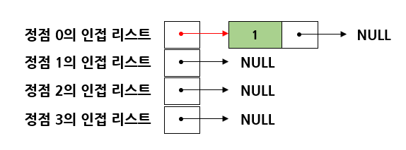

이 상태에서 insert_edge(1, 0)가 호출되면 정점 1의 인접 리스트 맨 처음에 정점 0이 추가된다.

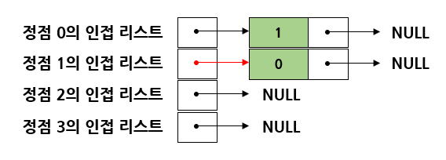

그리고 insert_edge(0, 2)가 호출되면 인접 리스트 맨 처음에 정점 2가 추가된다.

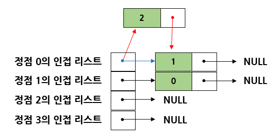

# 4. 그래프의 탐색

그래프 탐색은 가장 기본적인 연산으로, 하나의 정점으로부터 시작해 차례대로 모든 정점들을 한 번씩 방문하는 것이다. 많은 문제들이 단순히 그래프의 노드를 탐색하는 것으로 해결된다.  
대표적으로 특정한 정점에서 다른 정점으로 갈 수 있는지 없는지를 탐색을 통해 알 수 있다.

예를 들어 도시를 연결하는 그래프가 있을 때, 특정 도시에서 다른 도시로 갈 수 있는지 없는지는 그래프를 특정 노드에서 시작하여 탐색해보면 알 수 있다.

또한 다음 그림과 같은 전자 회로에서 특정 단자와 단자가 서로 연결되어 있는지 연결되어 있지 않은지 탐색을 통해 알 수 있다.

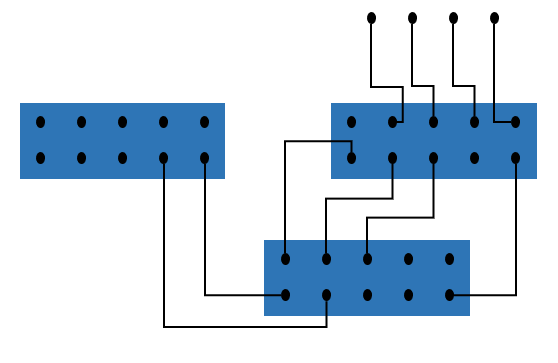

그래프의 탐색 방법은 깊이 우선 탐색과 너비 우선 탐색의 두 가지가 있다.

- 깊이 우선 탐색(DFS : depth first search)
- 너비 우선 탐색(BFS : breath first search)

<b>깊이 우선 탐색(depth first search : DFS)</b>은 트리에서 생각하면 이해하기 쉽다.(트리도 그래프의 일종)  
트리를 탐색할 때 시작 정점에서 한 방향으로 계속 가다가 더 이상 갈 수 없게 되면 다시 가장 가까운 갈림길로 돌아와서 다른 방향으로 다시 탐색을 진행하는 방법과 유사하다.  
밑의 그림에서는 0→1→3→4→2→5→6 의 순서대로 탐색이 진행된다.

**너비 우선 탐색(breath first search : BFS)**은 시작 정점으로부터 가까운 정점을 먼저 방문하고 멀리 떨어져 있는 정점을 나중에 방문하는 순회 방법이다.  
밑의 그림에서는 0→1→2→3→4→5→6 순서대로 탐색이 진행된다.

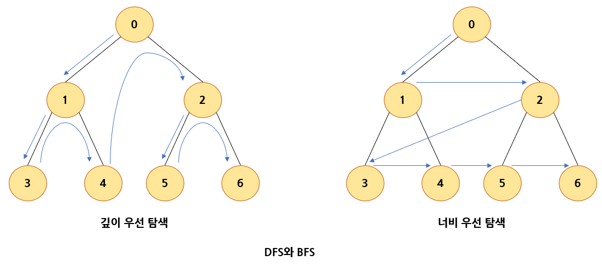

# 5. 깊이 우선 탐색

깊이 우선 탐색은 그래프의 시작 정점에서 출발하여 시작 정점 v를 방문하였다고 표시한다.  
이어서 v에 인접한 정점들 중에서 아직 방문하지 않은 정점 u를 선택한다.  
만약 그러한 장점이 없다면 탐색은 종료한다.

만약 아직 방문하지 않은 정점 u가 있다면 u를 시작 정점으로해서 깊이 우선 탐색을 다시 시작한다.  
이 탐색이 끝나게 되면 다시 v에 인접한 정점들 중 아직 방문이 안 된 정점을 찾는다.  
만약 없으면 종료하고, 있다면 다시 그 정점을 시작 정점으로 하여 깊이 우선 탐색을 다시 시작한다.

깊이 우선 탐색도 자기 자신을 다시 호출하는 순환 알고리즘의 형태를 가지고 있다.

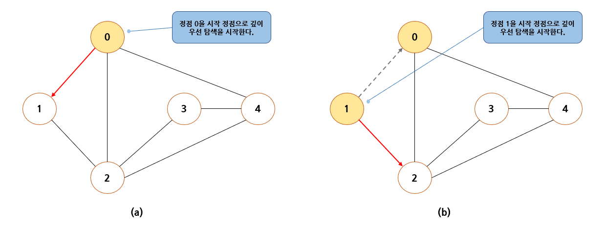

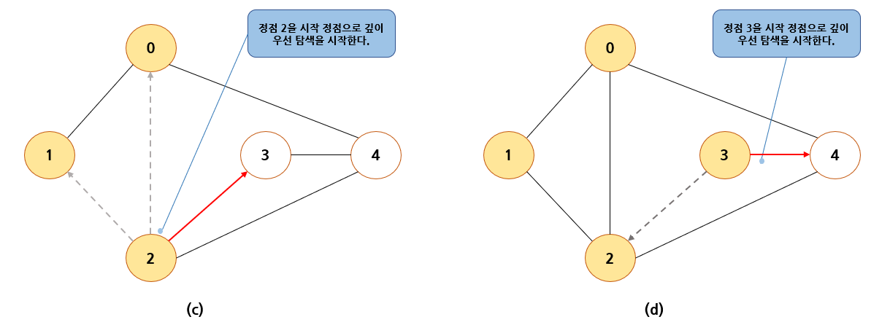


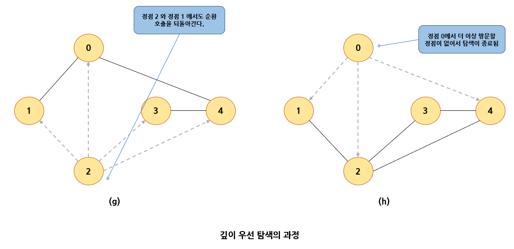

## 깊이 우선 탐색의 구현(인접 행렬 버전)

깊이 우선 탐색을 구현하는 데는 2가지의 방법이 있다.  
순환 호출을 이용하는 것이 첫 번째 방법이고 두 번째 방법은 명시적인 스택을 사용해 정점들을 스택에 저장하였다가 다시 꺼내어 작업을 하는 것이다.

순환 호출을 이용하는 방법으로 구현하면, 방문 여부를 기록하기 위해 배열 visited를 사용하여 모든 정점을 visited 배열값은 FALSE으로 초기화되고 정점이 방문될 때마다 해당 정점의 visited 배열값은 TRUE로 변경된다.

또한 그래프가 인접 행렬 또는 인접 리스트로 표현되었는가에 따라 깊이 우선 탐색 프로그램이 약간 달라지는데 인접 행렬을 이용해 그래프가 표현되었다고 가정하고 깊이 우선 탐색 프로그램을 구현하면,  
adf_mat\[v][w] 값이 1이면 정점 v와 정점 w는 인접한 것이고 정점 w가 아직 방문되지 않았으면 정점 w를 시작 정점으로 하여 깊이 우선 탐색을 다시 시작한다.

```C
#include <stdio.h>
#include <stdlib.h>

#define TRUE 1
#define FALSE 0
#define MAX_VERTICES 50
typedef struct GraphType {
    int n;  // 정점의 개수
    int adj_mat[MAX_VERTICES][MAX_VERTICES];
} GraphType;

int visited[MAX_VERTICES];

// 그래프 초기화
void init(GraphType *g)
{
    int r, c;
    g->n = 0;
    for (r = 0; r < MAX_VERTICES; r++) {
        for (c = 0; c < MAX_VERTICES; c++) {
            g->adj_mat[r][c] = 0;
        }
    }
}

// 정점 삽입 연산
void insert_vertex(GraphType *g, int v)
{
    if (((g->n) + 1) > MAX_VERTICES) {
        fprintf(stderr, "정점의 개수 초과");
        return;
    }
    g->n++;
}

// 간선 삽입 연산
void insert_edge(GraphType *g, int start, int end)
{
    if (start >= g->n || end >= g->n) {
        fprintf(stderr, "정점 번호 오류");
        return;
    }
    g->adj_mat[start][end] = 1;
    g->adj_mat[end][start] = 1;
}

// 인접 행렬로 표현된 그래프에 대한 깊이 우선 탐색
void dfs_mat(GraphType *g, int v)
{
    int w;
    visited[v] = TRUE;          // 정점 v의 방문 표시
    printf("정점 %d -> ", v);   // 방문한 정점 출력
    for (w = 0; w < g->n; w++) {// 인접 정점 탐색
        if (g->adj_mat[v][w] && !visited[w]) {
            dfs_mat(g, w);      // 정점 w에서 DFS 새로 시작
        }
    }
}

int main()
{
    GraphType *g;
    g = (GraphType*)malloc(sizeof(GraphType));
    init(g);
    for (int i = 0; i < 4; i++) {
        insert_vertex(g, i);
    }
    insert_edge(g, 0, 1);
    insert_edge(g, 0, 2);
    insert_edge(g, 0, 3);
    insert_edge(g, 1, 2);
    insert_edge(g, 2, 3);

    printf("깊이 우선 탐색\n");
    dfs_mat(g, 0);
    printf("\n");
    free(g);
    return 0;
}
```

## 깊이 우선 탐색의 구현(인접 리스트 버전)

인접 리스트는 다수의 연결 리스트로 구성되는데, 각 연결 리스트의 노드는 데이터 필드와 링크 필드로 이루어지는데, 데이터 필드에는 인접 정점의 번호가 저장되고 링크 필드에는 다음 인접 정점을 가리키는 포인터가 저장된다.

연결 리스트의 노드는 구조체 타입 GraphNode로 정의되었다.  
포인터 배열 adj_list의 각 요소는 각 연결리스트의 첫번째 노드를 가리킨다.  
방문 여부를 기록하기위해 visited가 사용된다.

```C
#include <stdio.h>
#include <stdlib.h>

#define TRUE 1
#define FALSE 0
#define MAX_VERTICES 50
typedef struct _GraphNode {
    int vertex;
    struct _GraphNode *link;
} GraphNode;

typedef struct GraphType {
    int n;  // 정점의 개수
    GraphNode *adj_list[MAX_VERTICES];
} GraphType;


int visited[MAX_VERTICES];

// 그래프 초기화
void init(GraphType *g)
{
    int v;
    g->n = 0;
    for (v = 0; v < MAX_VERTICES; v++) {
        g->adj_list[v] = NULL;
    }
}

// 정점 삽입 연산
void insert_vertex(GraphType *g, int v)
{
    if (((g->n) + 1) > MAX_VERTICES) {
        fprintf(stderr, "정점의 개수 초과");
        return;
    }
    g->n++;
}

// 간선 삽입 연산, v를 u의 인접 리스트에 삽입
void insert_edge(GraphType *g, int u, int v)
{
    GraphNode *node;
    if (u >= g->n || v >= g->n) {
        fprintf(stderr, "정점 번호 오류");
        return;
    }
    node = (GraphNode*)malloc(sizeof(GraphNode));
    node->vertex = v;
    node->link = g->adj_list[u];
    g->adj_list[u] = node;
}

// 인접 행렬로 표현된 그래프에 대한 깊이 우선 탐색
void dfs_list(GraphType *g, int v)
{
    GraphNode *w;
    visited[v] = TRUE;          // 정점 v의 방문 표시
    printf("정점 %d -> ", v);   // 방문한 정점 출력
    for (w = g->adj_list[v]; w; w = w->link) {// 인접 정점 탐색
        if (!visited[w->vertex]) {
            dfs_list(g, w->vertex);      // 정점 w에서 DFS 새로 시작
        }
    }
}

int main()
{
    GraphType *g;
    g = (GraphType*)malloc(sizeof(GraphType));
    init(g);
    for (int i = 0; i < 4; i++) {
        insert_vertex(g, i);
    }
    insert_edge(g, 0, 1);
    insert_edge(g, 0, 2);
    insert_edge(g, 0, 3);
    insert_edge(g, 1, 2);
    insert_edge(g, 2, 3);

    printf("깊이 우선 탐색\n");
    dfs_list(g, 0);
    printf("\n");
    free(g);
    return 0;
}
```

## 명시적인 스택을 이용한 깊이 우선 탐색의 구현

깊이 우선 탐색은 명시적인 스택을 사용해 구현이 가능하다.

```C
#include<stdio.h>
#include<stdlib.h>

#define TRUE 1
#define FALSE 0
#define MAX_VERTICES 50
typedef struct _GraphNode {
    int vertex;
    struct _GraphNode *link;
} GraphNode;

typedef struct GraphType {
    int n;  // 정점의 개수
    GraphNode *adj_list[MAX_VERTICES];
} GraphType;
//
typedef int element;
typedef struct StackNode {
    element data;
    struct StackNode *link;
} StackNode;

typedef struct {
    StackNode *top;
} LinkedStackType;

int visited[MAX_VERTICES];

// 그래프 초기화
void init(GraphType *g)
{
    int v;
    g->n = 0;
    for (v = 0; v < MAX_VERTICES; v++) {
        g->adj_list[v] = NULL;
    }
}

// 정점 삽입 연산
void insert_vertex(GraphType *g, int v)
{
    if (((g->n) + 1) > MAX_VERTICES) {
        fprintf(stderr, "정점의 개수 초과");
        return;
    }
    g->n++;
}

// 간선 삽입 연산, v를 u의 인접 리스트에 삽입
void insert_edge(GraphType *g, int u, int v)
{
    GraphNode *node;
    if (u >= g->n || v >= g->n) {
        fprintf(stderr, "정점 번호 오류");
        return;
    }
    node = (GraphNode*)malloc(sizeof(GraphNode));
    node->vertex = v;
    node->link = g->adj_list[u];
    g->adj_list[u] = node;
}

// 스택 초기화 함수
void init_stack(LinkedStackType *s)
{
    s->top = NULL;
}
// 공백 상태 검출 함수
int is_empty(LinkedStackType *s)
{
    return (s->top == NULL);
}
// 포화 상태 검출 함수
int is_full(LinkedStackType *s)
{
    return 0;
}
// 삽입 함수
void push(LinkedStackType *s, element item)
{
    StackNode *temp = (StackNode *)malloc(sizeof(StackNode));
    temp->data = item;
    temp->link = s->top;
    s->top = temp;
}

void print_stack(LinkedStackType *s)
{
    for (StackNode *p = s->top; p != NULL; p = p->link) {
        printf("%d->", p->data);
    }
    printf("NULL \n");
}
// 삭제 함수
element pop(LinkedStackType *s)
{
    if (is_empty(s)) {
        fprintf(stderr, "스택이 비어있음\n");
        exit(1);
    }
    else {
        StackNode *temp = s->top;
        element data = temp->data;
        s->top = s->top->link;
        free(temp);
        return data;
    }
}
// 피크 함수
element peek(LinkedStackType *s)
{
    if (is_empty(s)) {
        fprintf(stderr, "스택이 비어있음\n");
        exit(1);
    }
    else {
        return s->top->data;
    }
}

void dfs_stack(GraphType *g, int v)
{
    LinkedStackType s;
    init_stack(&s);
    push(&s, v);
    while (!is_empty(&s)) {
        v = pop(&s);
        if (!visited[v]) {
            visited[v] = TRUE;
            printf("정점 %d -> ", v);
            for (GraphNode *w = g->adj_list[v]; w; w = w->link) {
                if (!visited[w->vertex]) {
                    push(&s, w->vertex);
                }
            }
        }
    }
}

int main()
{
    GraphType *g;
    g = (GraphType*)malloc(sizeof(GraphType));
    init(g);
    for (int i = 0; i < 4; i++) {
        insert_vertex(g, i);
    }
    insert_edge(g, 0, 1);
    insert_edge(g, 0, 2);
    insert_edge(g, 0, 3);
    insert_edge(g, 1, 2);
    insert_edge(g, 2, 3);

    dfs_stack(g, 0);
    printf("\n");
    free(g);
}
```

## 깊이 우선 탐색의 분석

깊이 우선 탐색은 그래프의 모든 간선을 조사하므로 정점의 수가 n이고 간선의 수가  e인 경우,  
그래프가 인접 리스트로 표현되어 있다면 시간 복잡도는 $O(n+e)$이고,  
인접 행렬로 표시되어 있다면 O(n^2)이다.

희소 그래프인 경우 DFS는 인접 리스트의 사용이 인접 행렬보다 시간적으로 유리하다.

# 6. 너비 우선 탐색

<b>너비 우선 탐색(breath first search : BFS)</b>은 시작 정점으로부터 가까운 정점을 먼저 방문하고 멀리 떨어져 있는 정점을 나중에 방문하는 순회 방법이다.

너비 우선 탐색을 위해서는 가까운 거리에 있는 정점들을 차례로 저장한 후 꺼낼 수 있는 자료구조인 <b>큐(queue)</b>가 필요하다. 알고리즘은 큐에서 정점을 꺼내 정점을 방문하고 인접 정점들을 큐에 추가하며, 큐가 소진될 때까지 코드를 반복한다.

다음은 너비 우선 탐색의 과정을 보인 그림이다.

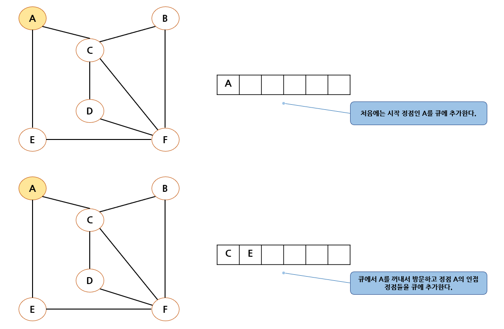

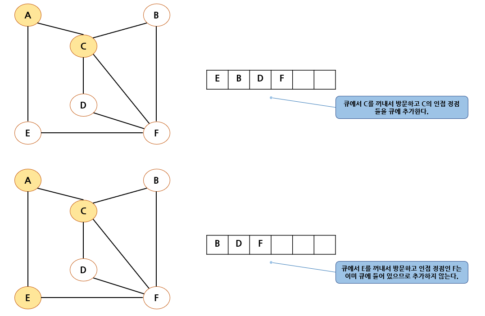

위의 과정을 큐가 공백 상태가 될 때까지 반복한다.  
너비 우선 탐색의 특징은 시작 정점으로부터 거리가 가까운 정점의 순서로 탐색이 진행된다는 것이다.

너비 우선 탐색은 거리가 d인 정점들을 모두 방문한 다음, 거리가 (d+1)인 정점들을 모두 방문하게 된다.  
즉 거리가 0인 시작 정점을 방문한 후, 거리가 1인 정점, 거리가 2인 정점 등의 순서로 방문해간다.

## 너비 우선 탐색의 구현(인접 행렬 버전)

너비 우선 탐색은 큐를 사용해야 하므로 깊이 우선 탐색보다 코드가 약간 복잡해진다.

```C
#include<stdio.h>
#include<stdlib.h>

#define TRUE 1
#define FALSE 0
#define MAX_QUEUE_SIZE 10

typedef int element;
typedef struct {    // 큐 타입
    element queue[MAX_QUEUE_SIZE];
    int front, rear;
} QueueType;

// 오류 함수
void error(char *message)
{
    fprintf(stderr, "%s\n", message);
    exit(1);
}

// 초기화 함수
void init_queue(QueueType *q)
{
    q->front = q->rear = 0;
}

// 공백 상태 검출 함수
int is_empty(QueueType *q)
{
    return (q->front == q->rear);
}

// 포화 상태 검출 함수
int is_full(QueueType *q)
{
    return ((q->rear + 1) % MAX_QUEUE_SIZE == q->front);
}


// 삽입 함수
void enqueue(QueueType *q, element item)
{
    if (is_full(q)) {
        error("큐가 포화상태입니다.");
    }
    q->rear = (q->rear + 1) % MAX_QUEUE_SIZE;
    q->queue[q->rear] = item;
}

// 삭제 함수
element dequeue(QueueType *q)
{
    if (is_empty(q)) {
        error("큐가 공백상태입니다.");
    }
    q->front = (q->front + 1) % MAX_QUEUE_SIZE;
    return q->queue[q->front];
}

#define MAX_VERTICES 50
typedef struct GraphType {
    int n;  // 정점의 개수
    int adj_mat[MAX_VERTICES][MAX_VERTICES];
} GraphType;

int visited[MAX_VERTICES];

// 그래프 초기화
void init(GraphType *g)
{
    int r, c;
    g->n = 0;
    for (r = 0; r < MAX_VERTICES; r++) {
        for (c = 0; c < MAX_VERTICES; c++) {
            g->adj_mat[r][c] = 0;
        }
    }
}

// 정점 삽입 연산
void insert_vertex(GraphType *g, int v)
{
    if (((g->n) + 1) > MAX_VERTICES) {
        fprintf(stderr, "정점의 개수 초과");
        return;
    }
    g->n++;
}

// 간선 삽입 연산
void insert_edge(GraphType *g, int start, int end)
{
    if (start >= g->n || end >= g->n) {
        fprintf(stderr, "정점 번호 오류");
        return;
    }
    g->adj_mat[start][end] = 1;
    g->adj_mat[end][start] = 1;
}

void bfs_mat(GraphType *g, int v)
{
    int w;
    QueueType q;

    init_queue(&q);         // 큐 초기화
    visited[v] = TRUE;      // 정점 v 방문 표시
    printf("%d 방문 -> ", v);
    enqueue(&q, v);         // 시작 정점을 큐에 저장
    while (!is_empty(&q)) {
        v = dequeue(&q);    // 큐에 있는 정점 추출
        for (w = 0; w < g->n; w++) {
            if (g->adj_mat[v][w] && !visited[w]) {
                visited[w] = TRUE;  // 방문 표시
                printf("%d 방문 -> ", w);
                enqueue(&q, w); // 방문한 정점을 큐에 저장
            }
        }
    }
}

int main()
{
    GraphType *g;
    g = (GraphType*)malloc(sizeof(GraphType));
    init(g);
    for (int i = 0; i < 6; i++) {
        insert_vertex(g, i);
    }
    insert_edge(g, 0, 2);
    insert_edge(g, 2, 1);
    insert_edge(g, 2, 3);
    insert_edge(g, 0, 4);
    insert_edge(g, 4, 5);
    insert_edge(g, 1, 5);

    printf("너비 우선 탐색\n");
    bfs_mat(g, 0);
    printf("\n");
    free(g);
    return 0;
}
```

## 너비 우선 탐색의 구현(인접 리스트 버전)

```c
#include<stdio.h>
#include<stdlib.h>

#define TRUE 1
#define FALSE 0
#define MAX_QUEUE_SIZE 10

typedef int element;
typedef struct {    // 큐 타입
    element queue[MAX_QUEUE_SIZE];
    int front, rear;
} QueueType;

// 오류 함수
void error(char *message)
{
    fprintf(stderr, "%s\n", message);
    exit(1);
}

// 초기화 함수
void init_queue(QueueType *q)
{
    q->front = q->rear = 0;
}

// 공백 상태 검출 함수
int is_empty(QueueType *q)
{
    return (q->front == q->rear);
}

// 포화 상태 검출 함수
int is_full(QueueType *q)
{
    return ((q->rear + 1) % MAX_QUEUE_SIZE == q->front);
}


// 삽입 함수
void enqueue(QueueType *q, element item)
{
    if (is_full(q)) {
        error("큐가 포화상태입니다.");
    }
    q->rear = (q->rear + 1) % MAX_QUEUE_SIZE;
    q->queue[q->rear] = item;
}

// 삭제 함수
element dequeue(QueueType *q)
{
    if (is_empty(q)) {
        error("큐가 공백상태입니다.");
    }
    q->front = (q->front + 1) % MAX_QUEUE_SIZE;
    return q->queue[q->front];
}

#define MAX_VERTICES 50
typedef struct _GraphNode {
    int vertex;
    struct _GraphNode *link;
} GraphNode;

typedef struct GraphType {
    int n;  // 정점의 개수
    GraphNode *adj_list[MAX_VERTICES];
} GraphType;


int visited[MAX_VERTICES];

// 그래프 초기화
void init(GraphType *g)
{
    int v;
    g->n = 0;
    for (v = 0; v < MAX_VERTICES; v++) {
        g->adj_list[v] = NULL;
    }
}

// 정점 삽입 연산
void insert_vertex(GraphType *g, int v)
{
    if (((g->n) + 1) > MAX_VERTICES) {
        fprintf(stderr, "정점의 개수 초과");
        return;
    }
    g->n++;
}

// 간선 삽입 연산, v를 u의 인접 리스트에 삽입
void insert_edge(GraphType *g, int u, int v)
{
    GraphNode *node;
    if (u >= g->n || v >= g->n) {
        fprintf(stderr, "정점 번호 오류");
        return;
    }
    node = (GraphNode*)malloc(sizeof(GraphNode));
    node->vertex = v;
    node->link = g->adj_list[u];
    g->adj_list[u] = node;
}

void bfs_list(GraphType *g, int v)
{
    GraphNode *w;
    QueueType q;

    init_queue(&q);         // 큐 초기화
    visited[v] = TRUE;      // 정점 v 방문 표시
    printf("%d 방문 -> ", v);
    enqueue(&q, v);         // 시작 정점을 큐에 저장
    while (!is_empty(&q)) {
        v = dequeue(&q);    // 큐에 있는 정점 추출
        for (w = g->adj_list[v]; w; w = w->link) {  // 인접 정점 탐색
            if (!visited[w->vertex]) {              // 미방문 정점 탐색
                visited[w->vertex] = TRUE;                  // 방문 표시
                printf("%d 방문 -> ", w->vertex);
                enqueue(&q, w->vertex);             // 방문한 정점을 큐에 저장
            }
        }
    }
}

int main()
{
    GraphType *g;
    g = (GraphType*)malloc(sizeof(GraphType));
    init(g);
    for (int i = 0; i < 6; i++) {
        insert_vertex(g, i);
    }
    insert_edge(g, 0, 4);
    insert_edge(g, 2, 3);
    insert_edge(g, 2, 1);
    insert_edge(g, 0, 2);
    insert_edge(g, 4, 5);
    insert_edge(g, 1, 5);

    printf("너비 우선 탐색\n");
    bfs_list(g, 0);
    printf("\n");
    free(g);
    return 0;
}
```


## 너비 우선 탐색의 분석

너비 우선 탐색은 그래프가 인접 리스트로 표현되어 있으면 전체 수행시간이 O(n+e)이며,
인접 행렬로 표현되어 있는 경우는 O(n^2) 시간이 걸린다.

너비 우선 탐색도 깊이 우선 탐색처럼 희소 그래프를 사용할 경우 인접 리스트를 사용하는 것이 효율적이다.