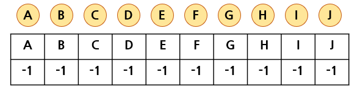
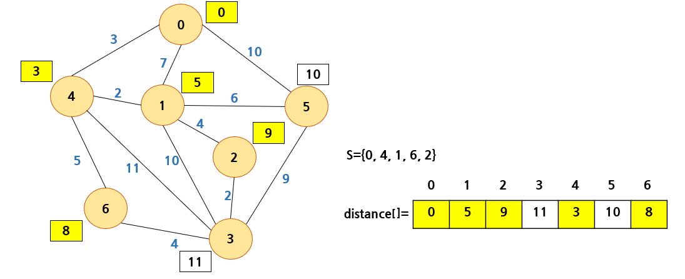
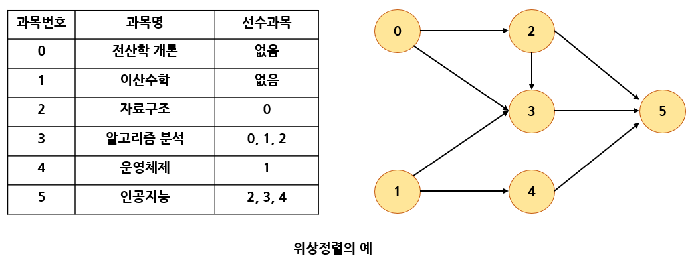

# 그래프 2

# 1. 최소 비용 신장 트리

## 신장 트리

<b>신장 트리(spanning tree)</b>란 그래프내의 모든 정점을 포함하는 트리다.  
신장 트리는 특수한 형태이므로 모든 정점들이 연결되어 있어야 하고 또한 사이클을 포함해서는 안된다.

따라서 신장 트리는 그래프에 있는 n개의 점을 정확히 (n-1)개의 간선으로 연결하게 된다.  
하나의 그래프에는 많은 신장 트리가 존재 가능하다. 다음의 그림은 그래프와 신장 트리를 보여주고 있다.


신장 트리를 만들려면 깊이 우선이나 너비 우선 탐색 때 사용한 간선들만 표시하면 된다.

신장 트리는 그래프의 최소 연결 부분 그래프가 된다. 최소의 의미는 간선의 수가 가장 적다는 의미이다.  
n개의 정점을 가지는 그래프는 최소한(n-1)개의 간선을 가져야 하며 (n-1)개의 간선으로 연결되어 있으면 필연적으로 트리 형태가 되고 이것은 신장 트리가 된다.

신장 트리는 통신 네트워크 구축에 많이 사용된다.  
예를 들어 n개의 위치를 연결하는 통신 네트워크를 최소의 링크를 이용해 구축하고자 할 경우, 최소 링크수는 (n-1)이 되고 따라서 신장 트리들이 가능한 대안이 된다.

예로, 회사 내의 모든 전화기를 가장 적은 수의 케이블을 사용해 연결하고자 한다면 신장 트리를 구현함으로써 해결할 수 있다.


그러나 각 링크의 구축 비용은 똑같지가 않다. 따라서 가장 적은 링크만을 사용한다고 해서 최소 비용이 얻어지지는 않는다.

간선에 비용을 붙여 링크의 구축 비용까지를 고려해 최소 비용의 신장 트리를 선택할 필요가 있다.
이것이 최소 비용 신장 트리의 개념이다.

## 최소 비용 신장 트리

통신망, 도로망, 유통망 등은 간선에 가중치가 부여된 네트워크로 표현될 수 있다.  
가중치는 길이, 구축 비용, 전송 시간 등을 나타낸다.

이러한 도로망, 통신망, 유통망을 가장 적은 비용으로 구축하고자 한다면, 네트워크에 있는 모든 정점들을 가장 적은 수의 간선과 비용으로 연결하는 <b>최소 비용 신장 트리(MST : minimum spanning tree)</b>가 필요하게 된다.

최소 비용 신장 트리는 신장 트리 중에서 사용된 간선들의 가중치 합이 최소인 신장 트리를 말한다.


최소 비용 신장 트리의 응용의 예를 들면 다음과 같다.

- 도로 건설 - 도시들을 모두 연결하면서 도로의 길이가 최소가 되도록 하는 문제
- 전기 회로 - 단자들을 모두 연결하면서 전선의 길이가 가장 최소가 되도록 하는 문제
- 통신 - 전화선의 길이가 최소가 되도록 전화 케이블 망을 구성하는 문제
- 배관 - 파이프를 모두 연결하면서 파이프의 총 길이가 최소가 되도록 연결하는 문제

최소 비용 신장 트리를 구하는 방법으로는 <b>Kruskal</b>과 <b>Prim</b>이 제안한 알고리즘이 대표적으로 사용되고 있으며, 이 알고리즘들은 MST가 간선의 가중치의 합이 최소이어야 하고, 반드시 (n-1)개의 간선만 사용해야 하며, 사이클이 포함되어서는 안 된다는 조건들을 적절히 이용하고 있다.

# 2. Kruskal의 MST 알고리즘

Kruskal의 알고리즘은 <b>탐욕적인 방법(greedy method)</b>을 이용한다.  
탐욕적인 방법은 알고리즘 설계에 있어서 중요한 기법 중의 하나이다.

탐욕적인 방법이란 선택할 때마다 그 순간 가장 좋다고 생각되는 것을 선택함으로써 최종적인 해답에 도달하는 방법이다.

마치 음식을 먹을 때 가장 맛있는 것부터 먹는 것과 같다. <b>"탐욕적"</b> 이라는 단어의 뉘앙스는 안 좋지만 실제로는 상당히 좋은 알고리즘을 만들어 내는 알고리즘 설계 기법이다.

탐욕적인 알고리즘에서 순간의 선택은 그 당시에는 최적이다. 하지만 최적이라고 생각했던 지역적인 해답들을 모아 최종적인 해답을 만들었다고 해서 그 해답이 반드시 전역적으로 최적이라는 보장은 없다.

따라서 탐욕적인 방법은 항상 최적의 해답을 주는지를 검증해야 한다.  
다행히 Kruskal의 알고리즘은 최적의 해답을 주는 것으로 증명되어 있다.

Kruskal의 알고리즘은 최소 비용 신장 트리가 최소 비용의 간선으로 구성됨과 동시에 사이클을 포함하지 않는다는 조건에 근거하여, 각 단계에서 사이클을 이루지 않는 최소 비용 간선을 선택한다.  
이러한 과정을 반복함으로써 네트워크의 모든 정점을 최소 비용하는 연결하는 최적 해답을 구할 수 있다.

Kruskal의 알고리즘은 먼저 그래프의 간선들을 가중치의 오름차순으로 정렬한다.  
정렬된 간선들의 리스트에서 사이클을 형성하지 않는 간선을 찾아 현재의 최소 비용 신장 트리의 집합에 추가한다. 만약 사이클을 형성하면 그 간선은 제외한다.


위 그림은 Kruskal의 알고리즘을 이용해 최소 비용 신장 트리를 만드는 과정을 보여준다.  
먼저 간선들을 가중치의 오름차순으로 정렬하고 가장 가중치가 낮은 간선을 먼저 선택한다.

예제 그래프에서는 (a, f)가 가중치 10으로 가장 낮기 때문에 먼저 선택되고 에 포함시킨다.

>  : 최소 비용 신장 트리를 이루는 간선들의 집합

다음에도 계속 가중치가 낮은 간선들인 (c, d), (b, g), (b, c)까지 차례로 선택해 에 포함시킨다.  
다음 차례인 간선 (d, g)를 추가하게 되면 사이클 b, c, d, g, b가 형성되기때문에 (d, g)는 제외되고 다음 간선인 (d, e)가 선택된다.

다음 간선 (e, g)도 역시 사이클을 형성시키기 때문에 제외되고 (e, f)가 선택된다.  
(e, f)까지 선택되면 간선의 개수가 6개가 되어 정점의 개수인 7보다 하나 적어져 알고리즘이 종료된다.

Kruskal의 알고리즘은 최소 비용 신장 트리를 구하는 다른 알고리즘보다 간단해 보이지만 다음 간선을 이미 선택된 간선들의 집합에 추가할 때 사이클을 생성하는 지를 체크해야 한다.

따라서 추가하고자 하는 간선의 양끝 정점이 같은 집합에 속해있는지를 먼저 검사해야 한다.  
이 검사를 위한 알고리즘을 union-find 알고리즘이라 부른다.

## union-find 연산

<b>union-find</b> 연산은 Kruskal의 알고리즘에서만 사용되는 것은 아니고 일반적으로 널리 사용된다.

union(x, y) 연산은 원소 x와 y가 속해있는 집합을 입력으로 받아 2개의 집합의 합집합을 만든다.  
find(x) 연산은 원소 x가 속해있는 집합을 반환한다.

예를 들어 S = {1, 2, 3, 4, 5, 6}의 집합을 가정하면, 처음에는 집합의 원소를 하나씩 분리해 독자적인 집합으로 만든다.

{1}, {2}, {3}, {4}, {5}, {6}

여기에 union(1, 4)와 union(5, 2)를 하면 다음과 같은 집합으로 변화된다.

{1, 4}, {5, 2}, {3}, {6}

또한 이어서 union(4, 5)와 union(3, 6)을 한다면 다음과 같은 결과를 얻을 수 있다.

{1, 4, 5, 2}, {3, 6}

## union-find 연산의 구현

집합을 구현하는 데는 여러 가지 방법이 있을 수 있다. 빅트 벡터, 배열, 연결 리스트를 이용해 구현될 수 있다.  
그러나 가장 효율적인 방법은 트리 형태를 사용하는 것이다.

부모 노드만 알면 되므로 "부모 포인터 표현"을 사용한다.  
"부모 포인터 표현"이란 각 노드에 대해 그 노드의 부모에 대한 포인터만 저장하는 것이다.  
이것은 일반적인 목적인 노드의 가장 왼쪽 자식 또는 오른쪽 자식을 찾는 것과 같은 작업에는 부적절하다.

하지만 "두 노드가 같은 트리에 있습니까?"와 같은 질문에 대답하는데 필요한 정보는 저장하고 있다.
따라서 union-find 연산은 이것으로 구현할 수 있다.  
부모 포인터 표현은 포인터를 사용하지 않고 1차원 배열로 구현이 가능하다.

배열은 부모 노드의 인덱스를 저장한다. 배열의 값이 -1이면 부모 노드가 없다.  
예를 들어 다음과 같은 노드들이 있다고 하면 처음에는 전부 분리되어 있다.



여기서 union(A, B)가 실행되었다면 다음과 같이 변경된다.


이어서 union(C, H)가 호출되면 다음과 같이 변경된다.


알고리즘을 C언어로 구현하면 다음과 같다.

```C
int parent[MAX_VERTICES];   // 부모 노드

void set_init(int n)        // 초기화
{
    for (int i = 0; i < n; i++) {
        parent[i] = -1;
    }
}

// curr가 속하는 집합을 반환
int set_find(int curr)
{
    if (parent[curr] == -1) {
        return curr;            // 루트
    }
    while (parent[curr] != -1) curr = parent[curr];
    return curr;
}

// 두개의 원소가 속한 집합을 합친다.
void set_union(int a, int b)
{
    int root1 = set_find(a);    // 노드 a의 루트를 찾는다.
    int root2 = set_find(b);    // 노드 b의 루트를 찾는다.
    if (root1 != root2) {       // 합한다.
        parent[root1] = root2;
    }
}
```

## Kruskal의 알고리즘 구현

위의 union 연산과 find 연산을 이용해 Kruskal의 알고리즘을 구현해보면 다음과 같다.

Kruskal의 알고리즘에서는 간선들을 정렬해야 하므로 그래프가 간선들의 집합으로 저장되었다.  
즉 GraphType 안에 간선들만 저장한다.  
정렬 알고리즘은 C언어에서 기본적으로 제공되는 qsort()함수가 사용된다. 최소 히프를 사용해도 된다.

```C
#include <stdio.h>
#include <stdlib.h>

#define TRUE 1
#define FALSE 0

#define MAX_VERTICES 100
#define INF 1000

int parent[MAX_VERTICES];       // 부모 노드

void set_init(int n)            // 초기화
{
    for (int i = 0; i < n; i++) {
        parent[i] = -1;
    }
}

// curr가 속하는 집합을 반환
int set_find(int curr)
{
    if (parent[curr] == -1) {
        return curr;            // 루트
    }
    while (parent[curr] != -1) curr = parent[curr];
    return curr;
}

// 두개의 원소가 속한 집합을 합친다.
void set_union(int a, int b)
{
    int root1 = set_find(a);    // 노드 a의 루트를 찾는다.
    int root2 = set_find(b);    // 노드 b의 루트를 찾는다.
    if (root1 != root2) {       // 합한다.
        parent[root1] = root2;
    }
}

struct Edge {               // 간선을 나타내는 구조체
    int start, end, weight;
};

typedef struct GraphType {
    int n;          // 간선의 개수
    struct Edge edges[2 * MAX_VERTICES];
} GraphType;

// 그래프 초기화
void graph_init(GraphType *g)
{
    g->n = 0;
    for (int i = 0; i < 2 * MAX_VERTICES; i++) {
        g->edges[i].start = 0;
        g->edges[i].end = 0;
        g->edges[i].weight = INF;
    }
}

// 간선 삽입 연산
void insert_edge(GraphType *g, int start, int end, int w)
{
    g->edges[g->n].start = start;
    g->edges[g->n].end = end;
    g->edges[g->n].weight = w;
    g->n++;
}

// qsort()에 사용되는 함수
int compare(const void *a, const void* b)
{
    struct Edge *x = (struct Edge*)a;
    struct Edge *y = (struct Edge*)b;
    return (x->weight - y->weight);
}

// kruskal의 최소 비용 신장 트리 프로그램
void kruskal(GraphType *g, int n)
{
    int edge_accepted = 0;  // 현재까지 선택된 간선의 수
    int uset, vset;         // 정점 u와 정점 v의 집합 번호
    struct Edge e;

    set_init(g->n);         // 집합 초기화
    qsort(g->edges, g->n, sizeof(struct Edge), compare);

    printf("크루스칼 최소 신장 트리 알고리즘 \n");
    int i = 0;
    while (edge_accepted < n - 1) {	// 선택된 간선의 수 < (정점의 수 - 1)
        e = g->edges[i];
        uset = set_find(e.start);   // 정점 u의 집합 번호
        vset = set_find(e.end);     // 정점 v의 집합 번호
        if (uset != vset) {         // 서로 속한 집합이 다르면
            printf("간선 (%d,%d) %d 선택\n", e.start, e.end, e.weight);
            edge_accepted++;
            set_union(uset, vset);  // 두개의 집합을 합친다.
        }
        i++;
    }
}

int main()
{
    GraphType *g;
    g = (GraphType*)malloc(sizeof(GraphType));
    graph_init(g);

    insert_edge(g, 0, 1, 29);
    insert_edge(g, 1, 2, 16);
    insert_edge(g, 2, 3, 12);
    insert_edge(g, 3, 4, 22);
    insert_edge(g, 4, 5, 27);
    insert_edge(g, 5, 0, 10);
    insert_edge(g, 6, 1, 15);
    insert_edge(g, 6, 3, 18);
    insert_edge(g, 6, 4, 25);
    
    kruskal(g, 7);
    free(g);
    return 0;
}
```

## 시간 복잡도 분석

union-find 알고리즘을 이용하면 Kruskal의 알고리즘의 시간 복잡도는 간선들을 정렬하는 시간에 좌우된다.

따라서 효율적인 정렬 알고리즘을 사용한다면 Kruskal의 알고리즘 시간 복잡도는O() 이다.

# 3. Prim의 MST 알고리즘

Prim의 알고리즘은 시작 정점에서부터 출발해서 신장 트리 집합을 단계적으로 확장해나가는 방법이다.

시작 단계에서는 시작 정점만이 신장 트리 집합에 포함된다. Prim의 방법은 앞 단계에서 만들어진 신장 트리 집합에, 인접한 정점들 중에서 최저 간선으로 연결된 정점을 선택하여 트리를 확장한다.  
이 과정은 트리가 n-1개의 간선을 가질 때까지 계속된다.

Kruskal의 알고리즘과 결과는 동일하다.


위 그래프를 예로, 정점a에서 출발한다고 하자. 맨 처음에 신장 트리 집합은 { a }가 된다.

이 상태에서 인접 정점 중에서 최소 간선을 선택하면 신장 트리 집합은 { a, f }가 된다.  
이 상태에서 신장 트리 집합에 인접한 정점을 살펴보면 b와 e가 있는데, 간선 (a, b)와 간선 (f, e)의 가중치를 비교해보면 (f, e)가 27로서 (a, b)의 29보다 작다.

따라서 (f, e)간선이 선택되고 정점 e가 신장 트리 집합에 포함되어 { a, f, e }가 되고 같은 과정이 되풀이 된다.  
신장 트리 집합에 정점의 개수가 n-1 개가 될 때까지 이 과정이 계속된다.

Kruskal의 알고리즘과 비교를 해보면, Kruskal의 알고리즘은 간선을 기반으로 하는 알고리즘인 반면  
Prim의 알고리즘은 정점을 기반으로 하는 알고리즘이다.

또한 Kruskal의 알고리즘에서는 이전 단게에서 만들어진 신장 트리와는 상관없이 무조건 최저 간선만을 선택하는 방법인것에 반하여 Prim의 알고리즘은 이전 단계에서 만들어진 신장 트리를 확장하는 방식이다.

## Prim의 알고리즘 구현

```C
#include <stdio.h>
#include <stdlib.h>

#define TRUE 1
#define FALSE 0
#define MAX_VERTICES 100
#define INF 1000

typedef struct GraphType {
    int n;      // 정점의 개수
    int weight[MAX_VERTICES][MAX_VERTICES];
} GraphType;

int selected[MAX_VERTICES];
int distance[MAX_VERTICES];

// 최소 dist[v] 값을 갖는 정점을 반환
int get_min_vertex(int n)
{
    int v, i;
    for (i = 0; i < n; i++) {
        if (!selected[i]) {
            v = i;
            break;
        }
    }
    for (i = 0; i < n; i++) {
        if (!selected[i] && (distance[i] < distance[v])) v = i;
    }
    return v;
}

void prim(GraphType *g, int s)
{
    int i, u, v;

    for (u = 0; u < g->n; u++) {
        distance[u] = INF;
    }
    distance[s] = 0;
    for (i = 0; i < g->n; i++) {
        u = get_min_vertex(g->n);
        selected[u] = TRUE;
        if (distance[u] == INF) return;
        printf("정점 %d 추가\n", u);
        for (v = 0; v < g->n; v++) {
            if (g->weight[u][v] != INF) {
                if (!selected[v] && g->weight[u][v] < distance[v]) {
                    distance[v] = g->weight[u][v];
                }
            }
        }
    }
}

int main()
{
    GraphType g = { 7,
    {{0, 29, INF, INF, INF, 10, INF},
    {29, 0, 16, INF, INF, INF, 15},
    {INF, 16, 0, 12, INF, INF, INF},
    {INF, INF, 12, 0, 22, INF, 18},
    {INF, INF, INF, 22, 0, 27, 25},
    {10, INF, INF, INF, 27, 0, INF},
    {INF, 15, INF, 18, 25, INF, 0}}
    };
    prim(&g, 0);
    return 0;
}
```

distance라는 정점의 개수 크기의 배열이 필요하다.

distance는 현재까지 알려진 신장 트리 정점 집합에서 각 정점까지의 거리를 가지고 있다.  
처음에는 시작 노드만 값이 0이고 다른 노드는 전부 무한대의 값을 가진다.

정점들이 트리 집합에 추가되면서 distance 값은 변경된다. 가장 작은 값을 가지는 distance값을 끄집어내어 트리 집합에 추가한다. 코드상에서는 정점의 번호를 출력하고 있다.

다음에 트리 집합에 추가된 새로운 정점u에 인접한 정점 v들의 distance값을 변경시켜준다.  
즉,기존의 distance[v]값보다 간선 (u, v)의 가중치 값이 적으면 간선 (u, v)가중치값으로 dist[v]를 변경시킨다.
모든 정점들이 선택될때까지 이것을 되풀이하면 된다.

그리고 트리에 인접하지 않은 정점들의 distance값은 무한대이므로 선택되지 않을 것이다.  
코드를 간단하게 하기 위해 오류 처리를 생략하였으며 만약 알고리즘 도중 선택된 정점의 값이 무한대이면 오류가 뜬다.

## Prim의 알고리즘의 분석

Prim의 알고리즘은 주 반복문의 정점의 수 n만큼 반복하고, 내부 반복문이 n번 반복하므로 O(n^2)의 복잡도를 가진다.

Kruskal의 알고리즘은 복잡도가 O()이므로 희소 그래프를 대상으로 할 경우에는 Kruskal의 알고리즘이 적합하고, 밀집 그래프의 경우에는 Prim의 알고리즘이 유리하다.

# 4. 최단 경로

<b>최단 경로(shortest path)</b> 문제는 네트워크에서 정점 i와 정점 j를 연결하는 경로 중에서 간선들의 가중치 합이 최소가 되는 경로를 찾는 문제이다.

간선의 가중치는 비용, 거리, 시간 등을 나타낸다.  
아래의 그림은 네이버 지도에서 강남역에서 서울역까지 가는 최단 경로를 탐색한 결과이다.


지도를 나타내는 그래프에서 정점은 각 도시들을 나타내고, 가중치는 한 도시에서 다른 도시로 가는 거리를 의미한다. 문제는 도시 u에서 도시 v로 가는 거리 중 전체 길이가 최소가 되는 경로를 찾는 것이다.


예를 들어 위의 그래프를 생각해보자. 정점 0에서 정점 3으로 가는 최단 경로는 (0, 4, 1, 2, 3)이고 이때의 비용은 3 + 2 + 4 + 2 = 11이다. 정점 0에서 정점 3으로 가는 다른 경로가 존재하지만 이 경로가 가장 최단거리이다.

예를 들어 다른 경로인 (0, 1, 2, 3)은 비용이 7 + 4 + 2 = 13이 되어 경로 (0, 4, 1, 2, 3)보다 더 비용이 많이 든다.  
문제는 어떤 식으로 최단 경로를 찾는가이다.

2가지의 알고리즘이 있는데, <b>Dijkstra 알고리즘</b>은 하나의 시작 정점에서 다른 정점까지의 최단경로를 구한다.  
<b>Floyd 알고리즘</b>은 모든 정점에서 다른 정점까지의 최단 경로를 구한다.

가중치는 가중치 인접 행렬에 저장되어 있다고 가정하자. 만약 정점 u와 정점 v사이에 간선이 없다면 무한대값이 저장되어 있다고 가정한다.

여기서 인접 행렬과 가중치 인접 행렬과의 차이점을 주의 깊에 살펴보아야 한다.

<u>인접 행렬에서는 간선이 없으면 인접 행렬의 값이 0</u>이었다. 그러나 <u>가중치 인접 행렬에서는 간선의 가중치가 0일수도 있기 때문에 0의 값이 간선이 없음을 나타내는 것은 아니다.</u>

따라서 다른 방법을 강구하여야 한다. 이론적으로는 무한대의 값을 가중치 인접 행렬에 저장하면 된다.  
따라서 만약 간선이 존재하지 않으면 정수 중에서 상당히 큰 값을 무한대라고 생각하고 가중치 인접 행렬에 저장하는 것으로 한다.

# 5. Dijkstra의 최단 경로 알고리즘

Dijkstra의 최단 경로 알고리즘은 네트워크에서 하나의 시작 정점으로부터 모든 다른 정점까지의 최단 경로를 찾는 알고리즘이다. 최단 경로는 경로의 길이 순으로 구해진다.

먼저 집합 S를 시작 정점 v로부터의 최단 경로가 이미 발견된 정점들의 집합이라고 하자.  
Dijkstra의 알고리즘에서는 시작 정점에서 집합 S에 있는 정점만을 거쳐 다른 정점으로 가는 최단거리를 기록하는 배열이 반드시 있어야 한다.

이 1차원 배열을 distance라고 한다. 시작 정점을 v라 하면 distance[v] = 0이고, 다른 정점에 대한 distance값은 시작정점과 해당 정점간의 가중치값이 된다.

가중치는 보통 가중치 인접 행렬에 저장되므로 가중치 인접 행렬을 weight이라 하면 distance[w] = weight\[v][w] 가 된다. 정점 v에서 정점 w로의 직접 간선이 없을 경우는 무한대의 값을 저장한다.

시작 단계에서는 아직 최단경로가 발견된 정점이 없으므로 S = {v}일 것이다.  
즉 처음에는 시작정점 v를 제외하고는 최단거리가 알려진 정점이 없다.  
알고리즘이 진행되면서 최단거리가 발견되는 정점들이 S에 하나씩 추가될 것이다.

다음의 예제그림을 보며 알고리즘의 각 단계에서의 distance값을 알아보겠다.

<b>STEP 1 :</b> 다음의 예제 그래프에서 집합 S와 distance의 초기값을 구해보면 다음과 같다.


```C
S = { 0 }
distance[0] = weight[0][0] = 0
distance[1] = weight[0][1] = 7
distance[2] = weight[0][2] = INF
distance[3] = weight[0][3] = INF
distance[4] = weight[0][4] = 3
distance[5] = weight[0][5] = 10
distance[6] = weight[0][6] = INF
```


<b>STEP 2 :</b> 위의 예제에서는 정점 4가 가장 작은 값인 3을 가지고 있고 이것은 실제로 정점 0에서 정점 4까지의 최단 경로이다. 그 이유는 다른 정점을 통과해서 정점 4로 가더라도 그 값은 3보다 클 수밖에 없다.  
왜냐하면 다른 정점으로 가기위한 비용이 이미 3을 초과하기 때문이다.

일단 새로운 정점이 S에 추가되면 다른 정점들의 distance 값을 변경한다.  
새로운 정점을 통해서 그 정점에 갈 수 있는 경로값이 현재의 distance 값보다 더 작으면 현재의 distance 값을 새로운 경로값으로 변경한다.

위의 예에서는 정점 4를 통해 6으로 갈 수 있고 그 경로값이 8이므로 현재의 값인 무한대를 8로 변경한다.  
정점 3도 무한대에서 14로 변경된다.  
정점 1까지의 값인 7도 정점 4를 통해 가는 값인 5가 더 작으므로 5로 변경된다.


```C
S = { 0, 4 }
distance[0] = 0
distance[1] = min(distance[1],distance[4]+weight[4][1]) = min(7, 3+2) = 5
distance[2] = min(distance[2],distance[4]+weight[4][2]) = INF
distance[3] = min(distance[3],distance[4]+weight[4][3]) = min(INF, 3+11) = 14
distance[4] = 3
distance[5] = min(distance[5],distance[4]+weight[4][5]) = min(10, 3+INF) = 10
distance[6] = min(distance[6],distance[4]+weight[4][6]) = min(INF, 3+5) = 10
```


**STEP 3 :**


```C
S = { 0, 4, 1 }
distance[0] = 0
distance[1] = 5
distance[2] = min(distance[2],distance[1]+weight[1][2]) = min(INF, 5+4) = 9
distance[3] = min(distance[3],distance[1]+weight[1][3]) = min(14, 5+10) = 14
distance[4] = 3
distance[5] = min(distance[5],distance[1]+weight[1][5]) = min(10, 5+6) = 10
distance[6] = min(distance[6],distance[1]+weight[1][6]) = min(8, 5+INF) = 8
```


**STEP 4 :**


```C
S = { 0, 4, 1, 6 }
distance[0] = 0
distance[1] = 5
distance[2] = min(distance[2],distance[6]+weight[6][2]) = min(9, 8+INF) = 9
distance[3] = min(distance[3],distance[6]+weight[6][3]) = min(14, 8+4) = 12
distance[4] = 3
distance[5] = min(distance[5],distance[6]+weight[6][5]) = min(10, 8+INF) = 10
distance[6] = 8
```


**STEP 5 :**


```C
S = { 0, 4, 1, 6, 2 }
distance[0] = 0
distance[1] = 5
distance[2] = 9
distance[3] = min(distance[3],distance[2]+weight[2][3]) = min(12, 9+2) = 11
distance[4] = 3
distance[5] = min(distance[5],distance[2]+weight[2][5]) = min(10, 9+INF) = 10
distance[6] = 8
```


**STEP 6 :**


```C
S = { 0, 4, 1, 6, 2, 5 }
distance[0] = 0
distance[1] = 5
distance[2] = 9
distance[3] = min(distance[3],distance[5]+weight[5][3]) = min(11, 10+9) = 11
distance[4] = 3
distance[5] = 10
distance[6] = 8
```


**STEP 7 :**


```C
S = { 0, 4, 1, 6, 2, 5, 3 }
distance[0] = 0
distance[1] = 5
distance[2] = 9
distance[3] = 11
distance[4] = 3
distance[5] = 10
distance[6] = 8
```

## Dijkstra의 알고리즘 구현

시작 정점이 0번인 경우, main() 함수는 shortest_path(0, MAX_VERTICES)로 Dijkstra의 최단경로 알고리즘을 호출한다.

알고리즘 수행 결과로써 배열 distance에 0번 정점으로부터 다른 모든 정점으로의 최단 경로 거리를 저장하게 된다.

```C
#include <stdio.h>
#include <stdlib.h>
#include <limits.h>

#define TRUE 1
#define FALSE 0
#define MAX_VERTICES 100
#define INF 1000000 // 무한대 (연결이 없는 경우)

typedef struct GraphType {
    int n;      // 정점의 개수
    int weight[MAX_VERTICES][MAX_VERTICES];
} GraphType;

int distance[MAX_VERTICES]; // 시작 정점으로부터의 최단경로 거리
int found[MAX_VERTICES];    // 방문한 정점 표시

int choose(int distance[], int n, int found[])
{
    int i, min, minpos;
    min = INT_MAX;
    minpos = -1;
    for (i = 0; i < n; i++) {
        if (distance[i] < min && !found[i]) {
            min = distance[i];
            minpos = i;
        }
    }
    return minpos;
}

void print_status(GraphType *g)
{
    static int step = 1;
    printf("STEP %d :\n", step++);
    printf("distance : ");
    for (int i = 0; i < g->n; i++) {    // distance 출력
        if (distance[i] == INF) {
            printf(" * ");
        }
        else {
            printf("%2d ", distance[i]);
        }
    }
    printf("\n");
    printf("found : ");
    for (int i = 0; i < g->n; i++) {    // 방문한 노드(집합 S) 출력
        printf("%2d ", found[i]);
    }
    printf("\n\n");
}

void shortest_path(GraphType *g, int start)
{
    int i, u, w;
    for (i = 0; i < g->n; i++) {        // 초기화
        distance[i] = g->weight[start][i];
        found[i] = FALSE;
    }
    found[start] = TRUE;                // 시작 정점 방문 표시
    distance[start] = 0;
    for (i = 0; i < (g->n) - 1; i++) {
        print_status(g);
        u = choose(distance, g->n, found);
        found[u] = TRUE;
        for (w = 0; w < g->n; w++) {
            if (!found[w]) {
                if (distance[u] + g->weight[u][w] < distance[w]) {
                    distance[w] = distance[u] + g->weight[u][w];
                }
            }
        }
    }
}

int main()
{
    GraphType g = {7,
    {{0, 7, INF, INF, 3, 10, INF},
    {7, 0, 4, 10, 2, 6, INF},
    {INF, 4, 0, 2, INF, INF, INF},
    {INF, 10, 2, 0, 11, 9, 4},
    {3, 2, INF, 11, 0, INF, 5},
    {10, 6, INF, 9, INF, 0, INF},
    {INF, INF, INF, 4, 5, INF, 0}}
    };
    shortest_path(&g, 0);
    return 0;
}
```

배열 distance는 Dijkstra의 알고리즘의 실행 결과로서 시작 정점으로부터 다른 정점까지의 최단 경로의 거리정보만을 제공한다.

프로그램의 효율성을 높이기 위해서는 최소값을 선택하는 choose 함수를 우선순위 큐로 대치하면 더 빠르게 수행시킬 수 있다.

## Dijkstra의 분석

네트워크에 n개의 정점이 있다면, 최단 경로 알고리즘은 주반복문을 n번 반복하고, 내부 반복문을 2n번 반복하므로 O(n^2)의 복잡도를 가진다.

# 6. Floyd의 최단 경로 알고리즘

그래프에 존재하는 모든 정점 사이의 최단 경로를 구하려면 Dijkstra의 알고리즘을 정점의 수만큼 반복 실행하면 된다. 그러나 모든 정점 사이의 최단 거리를 구하는 간단하고 좋은 알고리즘이 존재한다.

<b>Floyd의 최단 경로 알고리즘</b>은 그래프에 존재하는 모든 정점 사이의 최단경로를 한 번에 모두 찾아주는 알고리즘이다.

Floyd의 최단 경로 알고리즘은 2차원 배열 A를 이용해 3중 반복을 하는 루프로 구성되어 있다.  
먼저 인접 행렬 weight는 다음과 같이 만들어 진다. i == j 이면 weight\[i][j] = 0으로 하고 만약 두개의 정점 i, j 사이에 간선이 존재하지 않으면 weight\[i][j] = INF(무한대)라고 한다.  
정점 i, j 사이에 간선이 존재하면 weight\[i][j]는 간선 (i, j)의 가중치가 된다.

다음 그림은 예제 그래프에 대해 A배열이 변경되는 모습이다.


## Floyd 최단 경로 알고리즘의 구현

```C
#include <stdio.h>
#include <stdlib.h>

#define TRUE 1
#define FALSE 0
#define MAX_VERTICES 100
#define INF 1000000 // 무한대 (연결이 없는 경우)

typedef struct GraphType {
    int n;      // 정점의 개수
    int weight[MAX_VERTICES][MAX_VERTICES];
} GraphType;

int A[MAX_VERTICES][MAX_VERTICES];

void printA(GraphType *g)
{
    int i, j;
    printf("=================================\n");
    for (i = 0; i < g->n; i++) {
        for (j = 0; j < g->n; j++) {
            if (A[i][j] == INF) {
                printf(" * ");
            }
            else printf("%3d ", A[i][j]);
        }
        printf("\n");
    }
    printf("=================================\n");
}

void floyd(GraphType *g)
{
    int i, j, k;
    for (i = 0; i < g->n; i++) {
        for (j = 0; j <g->n; j++) {
            A[i][j] = g->weight[i][j];
        }
    }
    printA(g);

    for (k = 0; k < g->n; k++) {
        for (i = 0; i < g->n; i++) {
            for (j = 0; j < g->n; j++) {
                if (A[i][k] + A[k][j] < A[i][j]) {
                    A[i][j] = A[i][k] + A[k][j];
                }
            }
        }
        printA(g);
    }
}

int main()
{
    GraphType g = {7,
    {{0, 7, INF, INF, 3, 10, INF},
    {7, 0, 4, 10, 2, 6, INF},
    {INF, 4, 0, 2, INF, INF, INF},
    {INF, 10, 2, 0, 11, 9, 4},
    {3, 2, INF, 11, 0, INF, 5},
    {10, 6, INF, 9, INF, 0, INF},
    {INF, INF, INF, 4, 5, INF, 0}}
    };
    floyd(&g);
    return 0;
}
```

## Floyd 최단 경로 알고리즘의 분석

한 번에 모든 정점 간의 최단 경로를 구하는 Floyd의 알고리즘은 3중 반복문이 실행되므로 시간 복잡도가 O(n^3)으로 표현되고, 이는 Dijkstra의 알고리즘과 비교해 차이는 없다고 볼 수 있다.

> Dijkstra의 알고리즘은 시간 복잡도가 O(n^2)이므로 모든 정점 쌍의 최단 경로를 구하려면 알고리즘을 n번 반복해야 하므로 전체 복잡도는 O(n^3)이 된다.

그러나 Floyd의 알고리즘은 매우 간결한 반복 구문을 사용하므로 Dijkstra의 알고리즘보다 상당히 빨리 모든 정점 간의 최단 경로를 찾을 수 있다.

# 7. 위상 정렬

큰 프로젝트는 많은 작업으로 나누어서 수행하게 된다.  
이 경우 전체 프로젝트는 각각의 작업이 완료되어야만 끝나게 된다.  
컴퓨터 관련 전공에서 과목을 수강하는 것도 비슷하다.  
성공적으로 학위를 취득하려면 각각의 교과목들을 순서에 따라 수강하여야만 한다.

아래의 표는 많은 과목 중에서 몇 개의 과목을 나열하고, 선수 과목을 보여준다.  
예를 들어 자료 구조를 수강하려면 먼저 전산학 개론과 이산 수학을 수강하여야 한다.  
즉 선수 과목은 과목들의 선행 관계를 표현하게 된다.  
그래프를 사용하면 이 같은 각각의 과목들 간의 선행 관계를 명확하게 표현할 수 있다.

다음의 그림과 표는 그래프를 사용하여 과목들 간의 선행 관계를 표현한 것이다.



이런 방향 그래프에서 간선 <u, v>가 있다면 정점 u는 정점 v를 선행한다고 말한다.

방향 그래프에 존재하는 각 정점들의 선행 순서를 위배하지 않으면서 모든 정점을 나열하는 것을 방향그래프의 <b>위상 정렬(topological sort)</b>이라고 한다.

위 그래프에서 예를 몇 개 들어보면 0, 1, 2, 3, 4, 5 / 1, 0, 2, 3, 4, 5 등을 들 수 있다.  
0, 1, 3, 2, 4, 5는 위상 순서가 아니다. 왜냐하면 3번 정점이 2번 정점 앞에 오기때문이다.  
간선 <2, 3>이 존재하기 때문에 2번 정점이 끝나야 3번 정점을 시작할 수 있다.

방향 그래프를 대상으로 위상 정렬을 하기 위한 알고리즘은 먼저 진입 차수가 0인 정점을 선택하고, 선택된 정점과 여기에 부착된 모든 간선을 삭제한다.  
이와 같은 진입 차수 0인 정점의 선택과 삭제 과정을 반복해서 모든 정점이 선택/삭제되면 종료된다.

진입 차수 0인 정점이 여러 개 존재할 경우 어느 정점을 선택해도 무방하다.  
이 과정에서 선택되는 정점의 순서를 <b>위상 순서(topological order)</b>라 한다.

위의 과정 중 그래프에 남아 있는 정점 중에 진입 차수 0인 정점이 없다면, 이러한 그래프로 표현된 프로젝트는 실행 불가능한 프로젝트가 되고 위상 정렬 알고리즘은 중단된다.


## 위상 정렬 알고리즘의 구현

위상 정렬 알고리즘은 먼저 in_degree라는 1차원 배열을 만들고 이 배열에 각 정점의 진입 차수를 기록한다.  
즉 in_degree[i]는 정점 i로 들어오는 간선들의 개수이다.

정점 i는 in_degree[i]의 값이 0일 경우에 후보 정점이 된다. 알고리즘이 진행되면서 진입 차수가 0인 정점이 그래프에서 제거되면 그 정점에 인접한 정점의 in_degree[i]는 1만큼 감소하게 된다.

위의 예제 그래프에서 in_degree[0:5] = [ 0, 0, 1, 3, 1, 3 ]이 된다.  
따라서 처음에 정점 0과 정점 1이 후보 정점이 된다. 후보 정점들은 어딘가에 저장해야 한다.  
여기서는 스택을 선택해서 후보 정점들을 스택에 저장한다.

다음 단계에서 스택에서 하나의 정점을 꺼내 출력하고 그 정점에 인접해 있는 정점들의 in_degree배열값을
감소시킨다. 만약 정점 1이 스택에서 제거되었다면 in_degree[0:5] = [0, 0, 1, 2, 0, 3]이 된다.

정점 4가 in_degree값이 0이 되었으므로 스택에 새롭게 추가가 된다.  
이러한 과정은 전체 정점이 출력이 될 때까지 계속된다. 만약 전체 정점이 출력되지 못하면 그래프에 사이클 등이 존재하여 위상 정렬 순서가 존재하지 않는 것이다.

```C
#include <stdio.h>
#include <stdlib.h>

#define TRUE 1
#define FALSE 0
#define MAX_VERTICES 50

typedef struct _GraphNode
{
    int vertex;
    struct _GraphNode *link;
} GraphNode;

typedef struct GraphType
{
    int n;      // 정점의 개수
    GraphNode *adj_list[MAX_VERTICES];
} GraphType;

// 그래프 초기화
void graph_init(GraphType *g)
{
    int v;
    g->n = 0;
    for (v = 0; v < MAX_VERTICES; v++) {
        g->adj_list[v] = NULL;
    }
}

// 정점 삽입 연산
void insert_vertex(GraphType *g, int v)
{
    if (((g->n) + 1) > MAX_VERTICES) {
        fprintf(stderr, "정점의 개수 초과");
        return;
    }
    g->n++;
}

// 간선 삽입 연산, v를 u의 인접 리스트에 삽입한다.
void insert_edge(GraphType *g, int u, int v)
{
    GraphNode *node;
    if (u >= g->n || v >= g->n) {
        fprintf(stderr, "정점 번호 오류");
        return;
    }
    node = (GraphNode*)malloc(sizeof(GraphNode));
    node->vertex = v;
    node->link = g->adj_list[u];
    g->adj_list[u] = node;
}

#define MAX_STACK_SIZE 100
typedef int element;
typedef struct {
    element stack[MAX_STACK_SIZE];
    int top;
} StackType;

// 스택 초기화 함수
void init(StackType *s)
{
    s->top = -1;
}

// 공백 상태 검출 함수
int is_empty(StackType *s)
{
    return (s->top == -1);
}

// 포화 상태 검출 함수
int is_full(StackType *s)
{
    return (s->top == (MAX_STACK_SIZE - 1));
}

// 삽입 함수
void push(StackType *s, element item)
{
    if (is_full(s)) {
        fprintf(stderr, "스택 포화 에러\n");
        return;
    }
    else s->stack[++(s->top)] = item;
}

// 삭제함수
element pop(StackType *s)
{
    if (is_empty(s)) {
        fprintf(stderr, "스택 공백 에러\n");
        exit(1);
    }
    else return s->stack[(s->top)--];
}

// 위상정렬을 수행
int topo_sort(GraphType *g)
{
    int i;
    StackType s;
    GraphNode *node;

    // 모든 정점의 진입 차수를 계산
    int *in_degree = (int*)malloc(g->n * sizeof(int));
    for (i = 0; i < g->n; i++) {            // 초기화
        in_degree[i] = 0;
    }
    for (i = 0; i < g->n; i++) {
        GraphNode *node = g->adj_list[i];   // 정점 i에서나오는 간선들
        while (node != NULL) {
            in_degree[node->vertex]++;
            node = node->link;
        }
    }

    // 진입 차수가 0인 정점을 스택에 삽입
    init(&s);
    for (i = 0; i < g->n; i++) {
        if (in_degree[i] == 0) push(&s, i);
    }

    // 위상 순서를 생성
    while (!is_empty(&s)) {
        int w;
        w = pop(&s);
        printf("정점 %d ->", w);    // 정점 출력
        node = g->adj_list[w];      // 각 정점의 진입 차수를 변경
        while (node != NULL) {
            int u = node->vertex;
            in_degree[u]--;         // 진입 차수를 감소
            if (in_degree[u] == 0) push(&s, u);
            node = node->link;      // 다음 정점
        }
    }
    free(in_degree);
    printf("\n");
    return (i == g->n);             // 반환값이 1이면 성공, 0이면 실패
}

int main()
{
    GraphType g;

    graph_init(&g);
    insert_vertex(&g, 0);
    insert_vertex(&g, 1);
    insert_vertex(&g, 2);
    insert_vertex(&g, 3);
    insert_vertex(&g, 4);
    insert_vertex(&g, 5);

    // 정점 0의 인접 리스트 생성
    insert_edge(&g, 0, 2);
    insert_edge(&g, 0, 3);
    // 정점 1의 인접 리스트 생성
    insert_edge(&g, 1, 3);
    insert_edge(&g, 1, 4);
    // 정점 2의 인접 리스트 생성
    insert_edge(&g, 2, 3);
    insert_edge(&g, 2, 5);
    // 정점 3의 인접 리스트 생성
    insert_edge(&g, 3, 5);
    // 정점 4의 인접 리스트 생성
    insert_edge(&g, 4, 5);
    // 위상 정렬
    topo_sort(&g);
    return 0;
}
```

