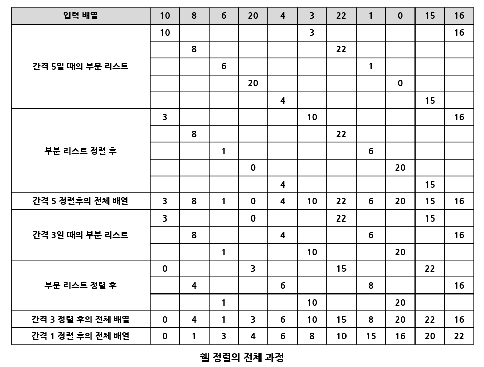
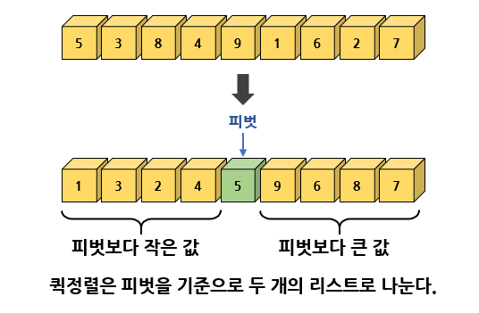
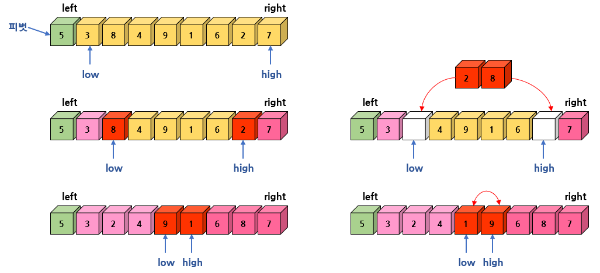
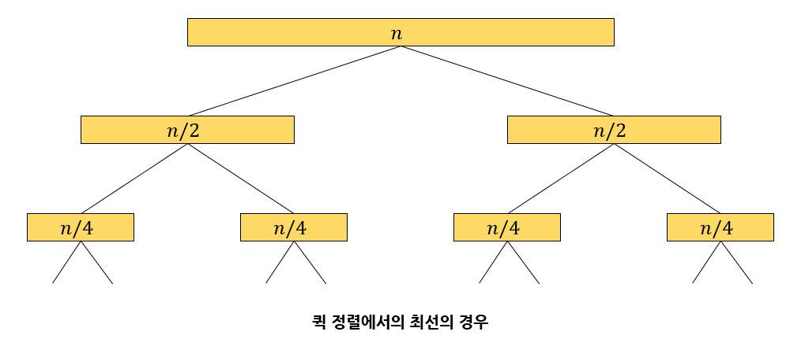

# 정렬

# 1. 정렬이란?

<b>정렬(sorting)</b>은 물건을 크기순으로 <b>오름차순(ascending order)</b>이나 <b>내림차순(descending)</b>으로 나열하는 것을 의미한다. 예를 들어 책들은 제목순이나 저자순, 또는 발간연도순으로 정렬이 가능하다.

사람도 나이나 키, 이름 등을 이용하여 정렬할 수 있다.  
물건뿐만 아니라 어떤형태의 것도 서로 비교만 가능하면 정렬할 수 있다.

정렬은 컴퓨터 공학에서 가장 기본적이고 중요한 알고리즘 중의 하나로 일상생활에서 많이 사용된다.  
정렬은 자료 탐색에 있어서 필수적이다. 예를 들어 사전에서 우리가 단어를 쉽게 찾을 수 있는 것은 사전 안의 단어들이 알파벳순으로 정렬되어 있기 때문이다.  
만약 사전이 알파벳순으로 정렬되어 있지 않다면 특정 단어를 찾는 것은 거의 불가능할 것이다.

컴퓨터도 마찬가지로 비록 컴퓨터가 사람보다 속도는 더 빠르지만 정렬되어 있지 않은 자료가 주어지면 탐색의 효율성이 크게 떨어진다.

일반적으로 보통 정렬시켜야 될 대상은 <b>레코드(record)</b>라고 불린다.  
레코드는 다시 <b>필드(field)</b>라고 하는 단위로 나누어진다.  
예를 들어 학생들의 레코드라면 이름, 학번, 주소, 전화번호 등이 필드가 될 것이다.

여러 필드 중에서 특별히 레코드와 레코드를 식별해주는 역할을 하는 필드를 <b>키(key)</b>라고 한다.  
<u>학생들의 레코드의 경우 학번이 키</u>가 될 수 있다.  
정렬이란 결국 레코드들을 키값의 순서로 재배열하는 것이다.


대개 정렬 알고리즘을 평가하는 효율성의 기준으로는 정렬을 위해 필요한 비교 연산의 횟수와 이동 연산의 횟수이다. 일반적으로 이동 횟수와 비교 횟수가 서로 비례하지는 않는다.  
즉 어떤 알고리즘은 비교 횟수는 많지만 이동 횟수는 적을 수 있고 또 그 반대도 가능하다.

숫자를 이동시키는 것은 간단하지만 큰 구조체를 이동시키려면 더 많은 시간이 걸릴 것이다.  
따라서 가장 적절한 정렬 알고리즘을 선택하여야 한다.

정렬 알고리즘은 대개 크게 2가지로 나누어진다.  
**단순하지만 비효율적인** 정렬 알고리즘과 **복잡하지만 효울적인** 정렬 알고리즘이다.

- 단순하지만 비효율적인 방법 - 삽입 정렬, 선택 정렬, 버블 정렬 등
- 복잡하지만 효율적인 방법 - 퀵 정렬, 히프 정렬, 합병 정렬, 기수 정렬 등

보통 자료의 개수가 적다면 단순한 정렬 방법을 사용하는 것도 괜찮지만 자료의 개수가 일정개수를 넘어가면 반드시 효율적인 알고리즘을 사용하여야 한다.

정렬 알고리즘은 <b>내부 정렬(internal sorting)</b>과 <b>외부 정렬(external sorting)</b>로 구분할 수도 있다.  
내부 정렬은 정렬하기 전 모든 데이터가 메인 메모리에 올라와 있는 정렬을 의미한다.  
반대로 외부 정렬은 외부 기억 장치에 대부분의 데이터가 있고 일부만 메모리에 올려놓은 상태에서 정렬을 하는 방법이다.

<b>안전성(stability)</b> 측면에서 분류할 수도 있다.  
정렬 알고리즘에서 안정성이란 입력 데이터에 동일한 키값을 갖는 레코드가 여러 개 존재할 경우, 이 레코드들의 상대적인 위치가 정렬 후에도 바뀌지 않음을 뜻한다.

이와 반대로 같은 키값을 갖는 레코드들이 정렬 후에 위치가 바뀌게 되면 <u>안정하지 않다</u>고 한다.

아래 그림은 키값 30을 갖는 두개의 레코드가 정렬 후에 위치가 바뀌었다. 정렬의 안정성이 필수적으로 요구되는 경우에는 정렬 알고리즘 중에서 안정성을 충족하는 삽입정렬, 버블정렬, 합병정렬 등을 사용해야 한다.


# 2. 선택 정렬

## 선택 정렬의 원리

정렬의 대상이 되는 것은 숫자 필드만 가지고 있는 레코드라고 가정하자.  
그리고 이 숫자들은 1차원 배열에 들어 있다고 가정한다.

<b>선택 정렬(selection sort)</b>은 가장 이해하기 쉬운 정렬 방법이다.  
먼저 왼쪽 리스트와 오른쪽 리스트, 두개의 리스트가 있다고 가정한다.

왼쪽 리스트에는 정렬이 완료된 숫자들이 들어가게 되며 오른쪽 리스트에는 정렬되지 않은 숫자들이 있다.  
밑에 표와 같이 초기 상태에서 왼쪽 리스트는 비어 있고 정렬되어야 할 숫자들은 모두 오른쪽 리스트에 들어 있다.

선택 정렬은 오른쪽 리스트에서 가장 작은 숫자를 선택하여 왼쪽 리스트로 이동하는 작업을 되풀이 한다.  
선택 정렬은 오른쪽 리스트가 공백상태가 될 때까지 이 과정을 되풀이하는 정렬 기법이다.

| 왼쪽 리스트        | 오른쪽 리스트      | 설명     |
| ------------------ | ------------------ | -------- |
| ( )                | (5, 3, 8, 1, 2, 7) | 초기상태 |
| (1)                | (5, 3, 8, 2, 7)    | 1 선택   |
| (1, 2)             | (5, 3, 8, 7)       | 2 선택   |
| (1, 2, 3)          | (5, 8, 7)          | 3 선택   |
| (1, 2, 3, 5)       | (8, 7)             | 5 선택   |
| (1, 2, 3, 5, 7)    | (8)                | 7 선택   |
| (1, 2, 3, 5, 7, 8) | ( )                | 8 선택   |

위의 방법을 배열로 구현하였다면, 입력 배열과는 별도로 똑같은 크기의 배열이 하나 더 필요하다.

따라서 메모리를 절약하기 위해 입력 배열 외에 추가적인 공간을 사용하지 않는 선택 정렬 알고리즘을 생각해 볼 때, 입력 배열 이외에 추가 메모리를 요구하지 않는 정렬법을 <b>제자리 정렬(in-place sorting)</b>이라고 한다.

입력 배열에서 최소값을 발견한 다음, 이 최소값을 배열의 첫번째 요소와 교환한다.  
다음엔 첫번째 요소를 제외한 나머지 요소들 중에서 가장 작은 값을 선택하고 이를 두번째 요소와 교환한다.  
이 절차를 (숫자 개수 - 1)만큼 되풀이하면 추가적인 배열을 사용하지 않고서도 전체 숫자들이 정렬된다.


## 선택 정렬의 알고리즘

선택 정렬의 알고리즘에서 주의할 것은 i 값이 0에서 n-2 까지만 변화된다는 점이다.  
만약 list[0]부터 list[n-2]까지 정렬이 되었으면 이미 list[n-1]이 가장 큰 값이기 때문에 n-1까지 정렬할 필요가 없다.

레코드와 레코드를 서로 교환하기 위해 다음과 같은 SWAP 매크로를 사용한다.

```C
#define SWAP(x, y, t) ( (t)=(x), (x)=(y), (y)=(t) )

void selection_sort(int list[], int n)
{
    int i, j, least, temp;
    for (i = 0; i < n - 1; i++) {
        least = i;
        for (j = i + 1; j < n; j++) { // 최소값 탐색
            if (list[j] < list[least]) least = j;
        }
        SWAP(list[i], list[least], temp);
    }
}
```

## 전체 프로그램

main()함수에서는 MAX_SIZE개의 난수를 발생시켜 배열 list에 저장하는데,  
이때 난수의 발생범위는 0~MAX_SIZE-1 까지가 된다.

```C
#include <stdio.h>
#include <stdlib.h>
#include <time.h>

#define MAX_SIZE 10
#define SWAP(x, y, t) ( (t)=(x), (x)=(y), (y)=(t) )

int list[MAX_SIZE];
int n;

void selection_sort(int list[], int n)
{
    int i, j, least, temp;
    for (i = 0; i < n - 1; i++) {
        least = i;
        for (j = i + 1; j < n; j++) {   // 최소값 탐색
            if (list[j] < list[least]) least = j;
        }
        SWAP(list[i], list[least], temp);
    }
}

int main()
{
    int i;
    n = MAX_SIZE;
    srand(time(NULL));
    for (i = 0; i < n; i++) {           // 난수 생성
        list[i] = rand() % 100;         // 난수 범위 0~99
    }

    selection_sort(list, n);
    for (i = 0; i < n; i++) {
        printf("%d ", list[i]);
    }
    printf("\n");
    return 0;
}
```

## 선택 정렬의 분석

선택 정렬의 성능 분석을 위해 비교 횟수와 이동횟수를 구해보자.  
먼저 두개의 for 루프의 실행 횟수에서 외부 루프는 n-1번 실행이 될 것이며 내부 루프는 0에서 n-2까지 변하는 i에 대해 (n-1)-i 번 반복될 것이다.

키값들의 비교가 내부 루프 안에서 이루어지므로 전체 비교횟수는 다음과 같다.  
(n-1) + (n-2) + ... + 1 = n \* (n-1) / 2 = O (n^2)

레코드의 교환 횟수는 외부 루프의 실행 횟수와 같으며 한번 교환하기 위해 3번의 이동이 필요하다.  
그러므로 전체 이동 횟수는 3(n-1)이 된다.

선택 정렬의 장점은 자료 이동 횟수가 미리 결정된다는 점이다.  
그러나 이동 횟수는 3(n-1)로 상당히 크다. 또한 자료가 정렬된 경우, 불필요하게 자기 자신과의 이동을 하게 되므로 이 문제를 약간 개선하려면 아래의 if문을 추가하면 된다.

```C
if ( i != least)
    SWAP(list[i], list[least], temp);
```

즉 최소값이 자기 자신이라면 자료이동을 하지 않는다.  
일반적으로 비교 연산 1개가 이동 연산 3개보다 시간이 적게 걸리므로 효과적이다.

선택 정렬의 문제점은 안정성을 만족하지는 않는다는 것이다.  
즉 값이 같은 레코드가 있는 경우에 상대적인 위치가 변경될 수 있다.

> 이유 : 쉽게 보기위해 정수가 아닌 문자 B, b, a, c 를 선택 정렬을 한다고 하면(B = b) 결과는 a, b, B, c 이기때문에 처음과 같은 문자의 순서가 다르다.

# 3. 삽입 정렬

<b>삽입 정렬(insertion sort)</b>은 손안의 카드를 정렬하는 방법과 유사하다.

카드 게임을 할 때, 새로운 카드가 들어오면 새로운 카드를 기존의 정렬된 카드 사이의 올바른 자리에 찾아서 삽입 함으로써 정렬이 유지되게 한다. 이와 같은 작업을 카드의 수만큼 반복하면 전체 카드가 정렬된다.

삽입 정렬은 정렬되어 있는 리스트에 새로운 레코드를 적절한 위치에 삽입하는 과정을 반복한다.  
선택 정렬처럼 입력 배열을 선택 정렬과 유사하게 정렬된 부분과 정렬되지 않은 부분으로 사용한다.


정렬되어 있지 않은 부분의 첫 번째 숫자가 정렬된 부분의 어느 위치에 삽입되어야 하는가를 판단한 후,  
해당 위치에 이 숫자를 삽입하게 되면, 정렬된 부분의 크기는 하나 커지게 되고,정렬이 되지 않은 부분의 크기는 하나 줄어들게 된다. 이러한 삽입 연산을 정렬되지 않은 부분이 빌때까지 반복하게 되면 된다.

밑의 그림은 리스트 (5, 3, 8, 1, 2, 7)를 삽입 정렬하는 과정이다.


## 삽입 정렬의 알고리즘

```C
1. 인덱스 1부터 시작한다. 인덱스 0은 이미 정렬된 것으로 볼 수 있다.
2. 현재 삽입될 숫자인 i번째 정수를 key 변수로 복사
3. 현재 정렬된 배열은 i-1까지 이므로 i-1번째부터 역순으로 조사한다.
4. j값이 음수가 아니어야 되고 key값보다 정렬된 배열에 있는 값이 크면
5. j번째를 j+1번째로 이동한다.
6. j를 하나 감소한다.
7. j번째 정수가 key보다 작으므로 j+1번째가 key값이 들어갈 위치이다.
```

밑의 그림은 i = 3인 경우의 과정이다.


## 삽입 정렬의 C언어 구현

```C
// 삽입 정렬
void insertion_sort(int list[], int n)
{
    int i, j, key;
    for (i = 1; i < n; i++) {
        key = list[i];
        for (j = i - 1; j >= 0 && list[j] > key; j--) {
            list[j + 1] = list[j];		// 레코드의 오른쪽 이동
        }
        list[j + 1] = key;
    }
}
```

## 삽입 정렬의 복잡도 분석

삽입 정렬의 복잡도는 자료의 구성에 따라서 달라진다. 입력 자료가 이미 정렬되어 있는 경우 가장 빠르다.

삽입 정렬의 외부 루프는 n-1번 실행되고 각 단계에서 1번의 비교와 2번의 이동만 이루어지므로 총 비교횟수는 n-1번, 총 이동횟수는 2(n-1)번이 되어 알고리즘의 시간 복잡도는 O(n)이다.

최악의 복잡도는 입력 자료가 역순일 경우이다.  
각 단계에서 앞에 놓인 자료들은 전부 한 칸씩 뒤로 이동해야 한다.  
따라서 외부 루프안의 각 반복마다 i번의 비교가 수행되므로 총 비교횟수는  
1 + 2 + ... + (n-1) = n \* (n-1) / 2 = O(n^2) 이다.                                                                                                                                                                                                                       

총 이동횟수는 외부 루프의 각 단계마다 i+2 번의 이동이 이루어지므로 다음과 같다.  
n \* (n-1) / 2 + 2 \* (n-1) = (n^2 + 3n-4) / 2 = O(n^2)

삽입 정렬은 비교적 많은 레코드들의 이동을 포함한다.  
결과적으로 삽입정렬은 레코드 양이 많고 레코드 크기가 클 경우 적합하지 않다.

반면 삽입 정렬은 안정한 정렬 방법으로서 레코드의 수가 적을 수록 알고리즘 자체가 매우 간단하므로 다소 복잡한 정렬 방법보다 유리할 수 있다.

또한 대부분의 레코드가 이미 정렬되어 있는 경우 매우 효율적일 수 있다.

# 4. 버블 정렬

## 버블 정렬의 원리

<b>버블 정렬(bubble sort)</b>은 인접한 2개의 레코드를 비교해 순서대로 되어 있지 않으면 서로 교환하는 비교-교환 과정을 리스트의 왼쪽 끝에서 시작해 오른쪽 끝까지 진행한다.

이러한 레코드의 이동 과정이 마치 물속에서 거품(bubble)이 보글보글 떠오르는 것과 유사하여 버블정렬이라 부른다. 비교-교환 과정은 전체 숫자가 전부 정렬될 때까지 계속된다.

정렬이 안 된 리스트를 한 번 스캔하면 오른쪽 끝에 가장 큰 레코드가 위치하게 된다.  
리스트(5, 3, 8, 1, 2, 7)를 버블 정렬하는 첫 번째 스캔 과정은 아래 그림과 같다.


한 번의 스캔에 의해 가장 큰 레코드가 리스트의 오른쪽 끝으로 이동하게 된다.

이러한 반복과정이 왼쪽 리스트가 빌 때까지 수행되어 전체 리스트가 정렬되는 과정은 아래 그림과 같다.


## 버블 정렬의 알고리즘

버블 정렬의 알고리즘은 아주 간단하다. 먼저 하나의 스캔은 j = 0부터 j = i-1 까지 반복하는 루프로 구성되고,
j번째 요소와 j+1번째 요소를 비교하여 크기순으로 되어 있지 않으면 교환한다.

i는 하나의 스캔이 끝날 때마다 1씩 감소한다. 이런 스캔 과정이 n-1번 반복되면 정렬이 끝나게 된다.

## 버블 정렬의 C언어 구현

```C
#define SWAP(x, y, t) ( (t)=(x), (x)=(y), (y)=(t) )
void bubble_sort(int list[], int n)
{
    int i, j, temp;
    for (i = n - 1; i > 0; i--) {
        for (j = 0; j < i; j++) {
            // 앞뒤의 레코드를 비교한 후 교체
            if (list[j] > list[j + 1]) {
                SWAP(list[j], list[j + 1], temp);
            }
        }
    }
}
```

## 버블 정렬의 복잡도 분석

버블 정렬의 비교 횟수는 최선, 평균, 최악의 어떤 경우에도 항상 일정하게 O(n^2) 이다.

이동 횟수에서, 최악의 이동 횟수는 입력 자료가 역순으로 정렬되어 있는 경우에 발생하고 횟수는 비교 연산의 횟수에 3을 곱한 값이다. 왜냐하면 하나의 SWAP 함수가 3개의 이동을 포함하고 있기 때문이다.

최선의 경우는 이미 정렬되어 있는 경우이다. 이런 경우에는 자료 이동이 한 번도 발생하지 않는다.  
평균적인 경우에는 자료 이동이 0번에서 i번까지 같은 확률로 일어날 것이다.  
이를 기반으로 보면 O(n^2)이다.

버블 정렬의 가장 큰 문제점은 순서에 맞지 않은 요소를 인접한 요소와 교환한다는 것이다.  
하나의 요소가 가장 왼쪽에서 가장 오른쪽으로 이동하기 위해서는 배열에서 모든 다른 요소들과 교환되어야 한다.  
특히 특정 요소가 최종 정렬 위치에 이미 있는 경우라도 교환되는 일이 일어난다.

일반적으로 자료의 교환(swap) 작업이 자료의 이동(move)작업보다 더 복잡하기 때문에 버블정렬은 그 단순성에도 불구하고 거의 쓰이지 않고 있다.

# 5. 쉘 정렬

## 쉘 정렬의 원리

<b>쉘 정렬(shell sort)</b>은 Donald L. Shell 이라는 사람이 제안한 방법으로 삽입 정렬이 어느 정도는 정렬된 배열에 대해서는 빠른 것에 착안한 방법이다. 쉘 정렬은 삽입 정렬의 O(n^2)보다 빠르다.

삽입 정렬의 최대 문제점은 요소들이 삽입될 때, 이웃한 위치로만 이동한다는 것이다.  
만약 삽입 되어야 할 위치가 현재 위치에서 상당히 멀리 떨어진 곳이라면 많은 이동을 해야한다.  
하지만 쉘 정렬에서는 요소들이 멀리 떨어진 위치로도 이동할 수 있다.

삽입 정렬과는 다르게 쉘 정렬은 전체의 리스트를 한 번에 정렬하지 않는다.  
대신에 먼저 정렬해야할 리스트를 일정한 기준에 따라 분류하여 연속적이지 않은 여러 개의 부분 리스트를 만들고, 각 부분 리스트를 삽입 정렬을 이용하여 정렬한다.

모든 부분 리스트가 정렬되면 쉘 정렬은 다시 전체 리스트를 더 적은 개수의 부분 리스트로 만든 후 알고리즘을 되풀이한다. 이 과정은 부분 리스트의 개수가 1이 될 때까지 되풀이된다.

부분 리스트를 구성할 때는 주어진 리스트의 각 k번째 요소를 추출하여 만든다.  
이 k를 <b>간격(gap)</b>이라고 한다. 쉘 정렬에서는 각 스텝마다 간격 k를 줄여가므로 수행과정이 반복될 때마다 하나의 부분 리스트에 속하는 레코드들의 개수는 증가된다. 마지막 스탭에서는 간격의 값이 1이 된다.

예를 들어 입력 리스트가 (10, 8, 6, 20, 4, 3, 22, 1, 0, 15, 16) 와 같을 때 쉘 정렬이 수행되는 과정은 아래 그림과 같다. (a)와 같이 입력 리스트의 각 5번째 요소를 추출하여 부분 리스트를 만든다.

첫 번째 부분 리스트는 10, 3, 6을 포함하고 있고 두 번째 부분 리스트는 8, 22를, 이런 식으로 부분 리스트들이 구성된다.

다음으로 각각의 부분 리스트에 대하여 삽입 정렬이 수행된다.  
부분 리스트들이 정렬된 후에는 전체 리스트도 약간은 정렬된다. 여기서 실제로 부분 리스트들이 만들어지는 것은 아니고 일정한 간격으로 삽입 정렬을 수행하는 것뿐이다. 따라서 추가적인 공간은 필요 없다.


쉘 정렬의 첫 번째 패스가 끝나면 비슷한 방식으로 다시 부분 리스트를 구성한다.

이번에는 간격을 1/2 줄여서 입력 배열의 각 2번째 요소를 추출해 부분 리스트를 만든다.  
간격은 처음에는 n/2 정도로 하고 각 패스마다 간격을 절반으로 줄이는 방식을 많이 사용한다.  
쉘 정렬의 전체 과정은 밑의 표에 나타나 있다.



## 쉘 정렬의 구현

gap이 간격을 나타내고, shell_sort 함수에서는 간격이 1이 될 때까지 간격을 1/2로 줄이면서 반복한다.

부분 리스트의 개수는 hap이 된다. 각 부분 리스트에 대해 일정한 간격으로 떨어져 있는 요소들을 삽입 정렬하는 함수인 inc_insertion_sort를 호출하였다.

inc_insertion_sort 함수는 앞의 삽입 정렬 함수와 비교하여 보면 쉽게 이해할 수 있다.  
만약 간격이 짝수이면 1을 더하는 것이 좋은 것으로 분석되었다.

```C
// gap 만큼 떨어진 요소들을 삽입 정렬
// 정렬의 범위는 first에서 last
void inc_insertion_sort(int list[], int first, int last, int gap)
{
    int i, j, key;
    for (i = first + gap; i <= last; i = i + gap) {
        key = list[i];
        for (j = i - gap; j >= first && key < list[j]; j = j - gap) {
            list[j + gap] = list[j];
        }
        list[j + gap] = key;
    }
}

void shell_sort(int list[], int n)	// n = size
{
    int i, gap;
    for (gap = n / 2; gap > 0; gap = gap / 2) {
        if ((gap % 2) == 0) gap ++;
        for (i = 0; i < gap; i++) {	// 부분 리스트의 개수는 gap
            inc_insertion_sort(list, i, n - 1, gap);
        }
    }
}
```

## 쉘 정렬의 분석

삽입 정렬에 비해 쉘 정렬은 2가지의 장점이 있다.

- 연속적이지 않은 부분 리스트에서 자료의 교환이 일어나면 더 큰 거리를 이동한다.  
  반면 삽입 정렬에서는 한 번에 한 칸씩만 이동된다.  
  따라서 교환되는 아이템들이 삽입 정렬보다는 최종위치에 더 가까이 있을 가능성이 높아진다.
- 부분 리스트는 어느 정도 정렬이 된 상태이기 때문에 부분 리스트의 개수가 1이 되게 되면 쉘정렬은 기본적으로 삽입 정렬을 수행하는 것이지만 빠르게 수행이 된다. 왜냐하면 삽입정렬은 거의 정렬된 리스트에 대해서는 빠르게 수행되기 때문이다.

실험적인 연구를 통해 쉘 정렬의 시간 복잡도는 최약의 경우 대략 O(n^2)이지만
평균적인 경우 O(n^1.5)로 나타난다.

# 6. 합병 정렬

앞의 정렬방법들은 비효율적이지만 간단하기 때문에 입력 데이터가 많지 않을때는 충분히 사용할 수 있다.  
그러나 입력 데이터가 많으면서 자주 정렬해야 할 필요가 있으면 앞의 방법은 충분하지 못하다.

## 합병 정렬의 개념

<b>합병 정렬(merge sort)</b>은 하나의 리스트를 두 개의 균등한 크기로 분할하고 분할된 부분 리스트를 정렬한 후, 두 개의 정렬된 부분 리스트를 합하여 전체가 정렬된 리스트를 얻는 것이다.

합병 정렬은 <b>분할 정복(divide and conquer)</b> 기법에 바탕을 두고 있다.  
분할 정복 기법은 문제를 작은 2개의 문제로 분리하고 각각을 해결한 다음, 결과를 모아 원래의 문제를 해결하는 전략이다.

분리된 문제가 아직도 해결하기 어렵다면, 즉 충분히 작지 않다면 분할 정복 방법을 연속하여 다시 적용한다.  
분할 정복 기법은 대개 순환 호출을 이용해 구현된다. 합병 정렬은 다음의 단계들로 이루어진다.

1. 분할(Divide) : 입력 배열을 같은 크기의 2개의 부분 배열로 분할한다.
2. 정복(Conquer) : 부분 배열을 정렬한다. 부분 배열의 크기가 충분히 작지 않으면 순환 호출을 이용해 다시 분할 정복 기법을 적용한다.
3. 결합(Combine) : 정렬된 부분 배열들을 하나의 배열에 통합한다.

간단한 예를 들어 27 10 12 20 25 13 15 22 란 배열이 있다고 가정하자.

1. 분할(Divide) : 배열을 27 10 12 20과 25 13 15 22의 2개의 부분배열로 나눈다.
2. 정복(Conquer) : 부분배열을 정렬하여 10 12 20 27과 13 15 22 25를 얻는다.
3. 결합(Combin) : 부분배열을 통합하여 10 12 13 15 20 22 25 27을 얻는다.

각각의 부분 배열들을 정렬 할 때는 합병 정렬을 순환적으로 적용하면 된다.

즉 위의 예에서 27 10 12 20을 정렬할 때도 합병 정렬의 개념을 다시 적용한다.  
예에 대한 합병 정렬의 전체 과정을 그림으로 보면 아래와 같다.


##  합병 정렬의 알고리즘

합병 정렬에서 실제로 정렬이 이루어지는 시점은 2개의 리스트를 <b>합병(merge)</b>하는 단계이다.

합병은 추가적인 리스트를 필요로 한다.  
2개의 리스트의 요소들을 처음부터 하나씩 비교해 두개의 리스트의 요소 중에서 더 작은 요소를 새로운 리스트로 옮긴다. 둘 중에서 하나가 끝날 때까지 이 과정을 되풀이한다. 만약 둘 중에서 하나의 리스트가 먼저 끝나게 되면 나머지 리스트의 요소들을 전부 새로운 리스트로 복사하면 된다.

아래 그림에서 먼저 배열 A의 첫 번째 요소인 2와 B의 첫 번째 요소인 1을 비교하여 1이 더 작으므로 1을 배열 C로 옮긴다. 다음으로 A의 2와 B의 다음 숫자인 3을 비교한다. A의 2가 B의 3보다 작으므로 A의 2를 C로 이동한다. 이런식으로 두개의 리스트 중에서 하나가 먼저 끝날 때 까지 이 과정을 되풀이한다.

두개의 리스트 중 하나가 먼저 끝나면 나머지 요소들을 리스트 C로 복사한다.


합병 알고리즘에서는 하나의 배열 안에 두 개의 정렬된 부분 리스트가 저장되어 있다고 가정하면,  
첫 번째 부분 리스트는 list[left]부터  list[mid]까지 이고, 두 번째 부분 리스트는 list[mid+1]부터 list[right]까지이다.

## 합병 정렬의 C언어 구현

merge_sort 함수에서 주어진 list 배열을 2등분하여 각각의 부분 배열에 대해 다시 merge_sort 함수를 순환 호출한다. 이러한 과정은 결국 부분 배열에 숫자 하나가 남을 때까지 계속된다.

분할 과정이 끝나면 정렬된 부분 배열을 merge 함수를 이용해 합병하는 과정이 시작된다.  
실제로 숫자들이 정렬되는 곳은 이 합병 과정이다. merge 함수는 부분 배열들의 숫자를 임시 배열에 정렬된 상태로 이것을 다시 원래의 배열에 복사한다.

```C
int sorted[MAX_SIZE];	// 추가 공간이 필요

/* i는 정렬된 왼쪽 리스트에 대한 인덱스
   j는 정렬된 오른쪽 리스트에 대한 인덱스
   k는 정렬된 리스트에 대한 인덱스 */
void merge(int list[], int left, int mid, int right)
{
    int i, j, k, l;
    i = left;
    j = mid + 1;
    k = left;
    
    // 분할 정렬된 list의 합병
    while (i <= mid && j <= right) {
        if (list[i] <= list[j]) {
            sorted[k++] = list[i++];
        }
        else sorted[k++] = list[j++];
    }
    
    if (i > mid) {	// 남아 있는 레코드의 일괄 복사 (오른쪽)
        for (l = j; l <= right; l++) {
            sorted[k++] = list[l++];
        }
    }
    else {			// 남아 있는 레코드의 일괄 복사 (왼쪽)
        for (l = i; i <= mid; l++) {
            sorted[k++] = list[l++];
        }
    }
    // 배열 sorted[]의 리스트를 배열 list[]로 재복사
    for (l = left; l <= right; l++) {
        list[l] = sorted[l];
    }
}

void merge_sort(int list[], int left, int right)
{
    int mid;
    if (left < right) {
        mid = (left + right) / 2;			// 리스트의 균등 분할
        merge_sort(list, left, mid);		// 부분 리스트 정렬
        merge_sort(list, mid + 1, right);	// 부분 리스트 정렬
        merge(list, left, mid, right);		// 합병
    }
}
```

## 합병 정렬의 복잡도 분석

합병 정렬에서 비교 연산과 이동 연산이 몇 번이나 수행되는 지를 분석해 보자.

합병 정렬은 순환 호출 구조로 되어 있기때문에 레코드의 개수 n이 2의 거듭제곱이라고 가정하고 순환 호출의 깊이가 얼마나 되는지 보면, 만약 n=2^3인 경우 부분 배열의 크기가 지수부분이 하나씩 줄어 깊이가 3임을 알 수 있다. 따라서 일반적으로 n = 2^k 라고 하면 깊이가 k가 될 것이다. 그러므로 k = 이다.

배열이 부분 배열로 나누어지는 단계에서는 비교 연산이나 이동 연산은 수행되지 않는다.  
부분 배열이 합쳐지는 merge 함수에서 비교와 이동 연산이 수행된다.  
순환호출의 깊이만큼의 합병 단계가 필요하다.

만약 n = 2^3인 경우 크기 1인 부분 배열 2개를 합병하는 데는 최대 2개의 비교 연산이 필요하고, 총 부분 배열의 쌍은 4개이므로 2 * 4 = 8번의 비교 연산이 필요하다.

다음 단계에서는 크기가 2인 부분 배열을 2개 합치는데 최대 4번의 비교 연산이, 총 부분 배열 쌍은 2쌍이 있으므로 4 * 2 = 8번의 비교 연산이 필요한 것을 알 수 있다.

마지막 단계에서도 크기가 4인 부분 배열 2개를 합병하는 데 최대 8번의 비교 연산이 필요하고, 총 부분 배열 쌍은 1쌍 있으므로 8 * 1 = 8번의 연산이 필요한 것을 알 수 있다.

그래서 일반적인 경우, 하나의 합병단계에서 최대 n번의 비교 연산이 필요한 것을 알 수 있다.  
그러한 합병 단계가 k = 만큼 있으므로 비교연산은 최대 번 필요하다.

이동 연산을 보자. 하나의 합병단계에서 임시 배열에 복사했다가 다시 가져와야 되므로 이동 연산은 총 부분 배열에 들어 있는 요소의 개수가 n인 경우 레코드의 이동이 2n번 발생하므로 하나의 합병 단계에서 2n개이다.

따라서 개의 합병 단계가 필요하므로 총 개의 이동 연산이 필요하다.  
결론적으로 합병정렬은 비교연산과 이동연산의 경우 O()의 복잡도를 가지는 알고리즘이다.

합병 정렬의 다른 장점은 안정적인 정렬 방법이며 데이터의 분포에 영향을 덜 받는다.  
즉, 입력 데이터가 무엇이든간에 정렬되는 시간은 동일하다. 최악, 평균, 최선의 경우가 다 같다.

합병 정렬의 단점은 임시 배열이 필요하다는 것과 만약 레코드들의 크기가 큰 경우에는 이동횟수가 많으므로 매우 큰 시간낭비를 초래한다. 하지만 만약 레코드를 연결 리스트로 구성하여 합병 정렬할 경우, 링크 인덱스만 변경되므로 데이터의 이동은 무시할 수 있을 정도로 작아진다.

따라서 크기가 큰 레코드를 정렬할 경우 연결 리스트를 사용한다면 합병 정렬은 효율적일 수 있다.

# 7. 퀵 정렬

## 퀵 정렬의 개념

<b>퀵 정렬(quick sort)</b>은 평균적으로 매우 빠른 수행 속도를 자랑하는 정렬 방법이다.  
퀵 정렬도 <b>분할-정복법(divide and conquer)</b>에 근거한다.

퀵 정렬은 합병 정렬과 비슷하게 전체 리스트를 2개의 부분 리스트로 분할하고, 각각의 부분 리스트를 다시 퀵정렬하는 전형적인 분할-정복법을 사용한다.

그러나 합병 정렬과는 달리 퀵 정렬은 리스트를 비균등하게 분할하는데, 먼저 리스트 안에 있는 한 요소를 <b>피벗(pivot)</b>으로 선택한다.

리스트의 맨 첫 번째 요소를 피벗으로 해보자.  
피벗보다 작은 요소들은 모두 피벗의 왼쪽으로 옮겨지고 피벗보다 큰 요소들은 모두 피벗의 오른쪽으로 옮겨진다.

결과적으로 피벗을 중심으로 왼쪽은 피벗보다 작은 요소들로, 오른쪽은 피벗보다 큰 요소들로 구성이 된다.  
이 상태에서 피벗을 제외한 왼쪽 리스트와 오른쪽 리스트를 다시 정렬하게 되면 전체 리스트가 정렬된다.



## 퀵 정렬 알고리즘

퀵 정렬을 C언어로 본다면, 정렬 대상은 배열 list이며 정렬하여야 할 범위는 left에서 right라고 가정한다.

```C
void quick_sort(int list[], int left, int right)
{
    if (left < right) {		// 정렬할 범위가 2개 이상의 데이터라면
        int q = partition(list, left, right);	/* partition 함수 호출하여 피벗 기준 2개로 												  분할. 반환값은 피벗의 위치 */
        quick_sort(list, left, q - 1);	// left에서 피벗 바로 앞까지를 대상으로 순환호출
        quick_sort(list, q + 1, right);	// 피벗 위치 바로 다음부터 right까지 순환호출
    }
}
```

퀵 정렬에서 가장 중요한 함수는 partition 함수이다.  
partition 함수는 데이터가 들어있는 배열 list의 left부터 right까지의 리스트를, 피벗을 기준으로 2개의 부분 리스트로 나누게 된다.

피벗보다 작은 데이터는 모두 왼쪽 부분 리스트로, 큰 데이터는 모두 오른쪽 부분 리스트로 옮겨진다.

아래의 그림은 (5, 3, 8, 4, 9, 1, 6, 2, 7) 리스트를 두개의 부분 리스트로 나누는 과정이다.




먼저 입력 리스트의 첫번째를 피벗값으로 하면 5가 된다.  
2개의 인덱스 변수 low와 high를 이용해서 왼쪽 부분리스트와 오른쪽 부분리스트를 만드는데 사용한다.

인덱스 변수 low는 왼쪽에서 오른쪽으로 탐색해가다가 <b>피벗 보다 큰 데이터</b>(8)를 찾으면 멈춘다.  
인덱스 변수 high는 오른쪽 끝부터 왼쪽으로 탐색해가다가 <b>피벗 보다 작은 데이터</b>(2)를 찾으면 멈춘다.

탐색이 멈춘 위치는 각 부분 리스트에 적합하지 않은 데이터이므로 low와 high가 가리키는 두 데이터를 서로 교환한다. 이러한 과정은 low와 high가 엇갈려 지나지 않는 한 계속 반복한다.

언젠가 low와 high가 엇갈려 지나가게 되면 멈추게 되는데, 이 때 high가 가리키는 데이터(1)와 피벗(5)를 교환하게 되면, 피벗을 중심으로 왼쪽 리스트에는 피벗보다 작은 데이터만 존재하게 되고 오른쪽 리스트는 피벗보다 큰 데이터만 존재하게 된다.

해당 기능을 하는 partition 함수는 아래와 같다.

```C
int partition(int list[], int left, int right)
{
    int pivot, temp;
    int low, high;
    
    low = left;
    high = right + 1;
    pivot = list[left];	// 피벗 선택
    do {
        do {
            low++;
        } while (list[low] < pivot);	// 피벗 보다 큰 데이터를 찾으면 멈춘다.
        do {
            high--;
        } while (list[high] > pivot);	// 피벗 보다 작은 데이터를 찾으면 멈춘다.
        if (low < high) SWAP(list[low], list[high], temp);	// 데이터 교환
    } while (low < high);				// low와 high가 교차할 때까지 계속 반복
    
    SWAP(list[left], list[high], temp);	// 피벗 중앙에 위치시키기
    return high;
}
```

아래 그림에서 피벗(5)는 전체 리스트가 정렬될 상태에서 이미 올바른 위치에 있는것을 알 수 있다.

따라서 피벗을 제외한 왼쪽 리스트(1, 3, 2, 4)를 독립적으로 다시 퀵정렬하고, 오른쪽 리스트(9, 6, 8, 7)또한 다시 퀵정렬한다면 아래와 같은 전체 리스트가 정렬된다.


## 전체 프로그램

```C
#include <stdio.h>
#include <stdlib.h>
#include <time.h>

#define MAX_SIZE 10
#define SWAP(x, y, t) ( (t)=(x), (x)=(y), (y)=(t) ) // SWAP 매크로

int list[MAX_SIZE];
int n;

int partition(int list[], int left, int right)
{
    int pivot, temp;
    int low, high;
    
    low = left;
    high = right + 1;
    pivot = list[left];	// 피벗 선택
    do {
        do {
            low++;
        } while (list[low] < pivot);	// 피벗 보다 큰 데이터를 찾으면 멈춘다.
        do {
            high--;
        } while (list[high] > pivot);	// 피벗 보다 작은 데이터를 찾으면 멈춘다.
        if (low < high) SWAP(list[low], list[high], temp);	// 데이터 교환
    } while (low < high);				// low와 high가 교차할 때까지 계속 반복
    
    SWAP(list[left], list[high], temp);	// 피벗 중앙에 위치시키기
    return high;
}

void quick_sort(int list[], int left, int right)
{
    if (left < right) {		// 정렬할 범위가 2개 이상의 데이터라면
        int q = partition(list, left, right);	/* partition 함수 호출하여 피벗 기준 2개로 												  분할. 반환값은 피벗의 위치 */
        quick_sort(list, left, q - 1);	// left에서 피벗 바로 앞까지를 대상으로 순환호출
        quick_sort(list, q + 1, right);	// 피벗 위치 바로 다음부터 right까지 순환호출
    }
}

int main()
{
    int i;
    n = MAX_SIZE;
    srand(time(NULL));
    for (i = 0; i < n; i++) {   // 난수 생성 및 출력
        list[i] = rand() % 100;
    }

    quick_sort(list, 0, n-1);

    for (i = 0; i < n; i++) {
        printf("%d ", list[i]);
    }
    printf("\n");
    return 0;
}
```

## 퀵 정렬의 복잡도 분석

n이 2의 거듭제곱이라고 가정하고, 만약 퀵 정렬에서의 리스트 분할이 항상 리스트의 가운데에서 이루어진다 가정하면 합병 정렬의 복잡도 분석과 마찬가지로 n개의 레코드를 가지는 리스트는 n/2, n/4, ..., n/2^k 의 크기로 나누어질 것이다.

크기가 1이 될 때까지 나누어지므로 n / 2^k = 1일 때까지 나누어질 것이고 따라서 k=개의 단계가 필요하게 된다. 각각의 단계에서는 전체 리스트의 대부분의 레코드를 비교해야 하므로 평균 n번 정도의 비교가 이루어지므로 퀵정렬은 비교 연산을 총 번 실행하게되어 O()의 복잡도를 가지게 된다.

레코드의 이동 횟수는 비교 횟수보다 적으므로 무시할 수 있다.



퀵 정렬에서 최악의 경우는 리스트가 계속 불균형하게 나누어지는 것이다.

이런 경우, 퀵 정렬의 단계의 개수는 n이 되고, 한번의 단계에서 평균 n번 정도의 비교연산이 필요하므로 거의 O(n^2)의 시간 복잡도가 된다.


그럼에도 불구하고 퀵 정렬은 평균적인 경우 시간 복잡도가 O(으로 나타난다.  
특히 O()의 복잡도를 가지는 다른 정렬 알고리즘과 비교하였을 때도 가장 빠른 것으로 나타난다.

왜냐하면 퀵정렬은 불필요한 데이터의 이동을 줄이며 먼 거리의 데이터를 교환할 뿐만 아니라, 한번 결정된 피벗들이 추후 연산에서 제외되는 특성 등에 기인하기 때문이다.

퀵 정렬은 속도가 빠르고 추가 메모리 공간을 필요로 하지 않는 등의 장점이 있는 반면, 정렬된 리스트에 대해서는 오히려 수행시간이 더 많이 걸리는 등의 단점도 가진다.

이러한 불균형 분할을 방지하기 위해 피벗을 선택할 때 단순히 리스트의 왼쪽 데이터를 사용하는 대신 보다 리스트의 중앙 부분을 분할할 수 있는 데이터를 선택한다.

많이 사용되는 방법은 리스트 내의 몇개의 데이터 중에서 <b>중간값(median)</b>을 피벗으로 선택하는 것이다.  
일반적으로 리스트의 왼쪽, 오른쪽, 중간의 3개의 데이터 중에서 중간 값을 선택하는 방법(median of three)이 많이 사용된다.

## 퀵 정렬 라이브러리 함수의 사용

대개의 C언어 실행시간 라이브러리에 퀵 정렬 함수가 제공된다.

대개 qsort란 이름으로 제공되며 아래와 같은 함수 원형을 가진다.  
qsort 함수는 일반적인 구조체 배열을 정렬하기 위해 제작되었다.  
따라서 어떤 식으로 qsort 함수의 사용자 인터페이스를 제공하는지 아는 것도 유용할 것이다.

### 함수의 원형

```C
void qsort(
	void *base,		// 배열의 시작주소
    size_t num,		// 배열 요소의 개수
    size_t width,	// 배열 요소 하나의 크기(바이트 단위)
    int (*compare)(const void *, const void *)
    		// 포인터를 통하여 두개의 요소를 비교하여 비교 결과를 정수로 반환하는 함수
);
```

### 함수의 설명

각 요소가 width 바이트인 num개의 요소를 가지는 배열에 대하여 퀵정렬을 수행한다.

입력 배열은 정렬된 값으로 덮어 씌워진다. compare는 배열 요소2개를 서로 비교하는 사용자 제공 함수로 qosrt 함수가 요소들을 비교할 때마다 다음과 같이 호출하여 사용한다.

```C
compare( (void*)elem1, (void*)elem2 );
```

| 반환값 |           설명           |
| :----: | :----------------------: |
|  < 0   | elem1이 elem2보다 작으면 |
|   0    |  elem1이 elem2과 같으면  |
|  > 0   |  elem1이 elem2보다 크면  |

### 함수의 사용예

```C
#include <stdio.h>
#include <stdlib.h>
#include <string.h>

int compare(const void *arg1, const void *arg2)
{	// 포인터 형변환 후, 역참조하여 비교
    if (*(double*)arg1 > *(double*)arg2) return 1;
    else if (*(double*)arg1 == *(double*)arg2) return 0;
    else return -1;
}

int main()
{
    int i;
    double list[] = { 2.1, 0.9, 1.6, 3.8, 1.2 };
    qsort((void*)list, (size_t)5, sizeof(double), compare);
    for (i = 0; i < 5; i++) {
        printf("%f ", list[i]);
    }
    return 0;
}
```

만약 구조체 배열을 정렬하려면 compare 함수 안에서 정렬하고자 하는 구조체 필드를 비교하여 적절한 값을 반환하면 된다.

# 8. 히프 정렬

## 히프 정렬의 개념

히프는 우선순위 큐를 완전 이진 트리로 구현하는 방법으로, 최댓값이나 최솟값을 쉽게 추출할 수 있는 자료 구조이다.

히프에는 최소 히프와 최대 히프가 있고 정렬에서는 최소 히프를 사용하는 것이 프로그램이 더 쉬워진다고 한다. 최소 히프는 부모 노드의 값이 자식 노드의 값보다 작다.  
따라서 최소 히프의 루트 노드는 가장 작은 값을 가지게 된다.

최소 히프의 이러한 특성을 이용해 정렬할 배열을 최소 히프로 변환한 다음애 가장 작은 원소부터 차례대로 추출하여 정렬하는 방법을 <b>히프 정렬(heap sort)</b>이라 한다.

히프는 1차원 배열로 구현될 수 있었다.  
먼저 최소 히프를 만들고 숫자들을 차례대로 삽입한 다음, 최솟값부터 삭제하면 된다.

# 9. 기수 정렬

## 기수 정렬의 원리

기수 정렬은 지금까지의 정렬 방법과 달리 레코드를 비교하지 않고도 정렬하는 방법이다.  
<b>기수 정렬(radix sort)</b>은 입력 데이터에 대해 어떤 비교 연산도 실행하지 않고 데이터를 정렬할 수 있는 정렬 기법이다.

정렬에 기초한 방법들은 절대 O() 이라는 하한선을 깰 수 없는데 반하여 기수 정렬은 이 하한선을 깰 수 있는 유일한 기법이다.

기수 정렬은 O(kn)의 시간 복잡도를 가지는데 , 대부분 k < 4 이하라고 한다.  
문제는 기수 정렬이 추가적인 메모리를 필요로 한다는 것인데, 이것을 감안하더라도 기수 정렬이 다른 정렬 기법보다 빠르기 때문에 데이터를 정렬하는 상당히 인기있는 정렬 기법 중 하나이다.

기수 정렬의 단점은 정렬할 수 있는 레코드의 타입이 한정된다는 점이다.  
즉 기수 정렬을 사용하려면 레코드의 키들이 동일한 길이를 가지는 숫자나 문자열로 구성되어 있어야 한다.

<b>기수(radix)</b>란 숫자의 자리수이다. 예를 들면 숫자 42는 4와 2의 두개의 자리수를 가지고 이것이 기수가 된다.  
기수 정렬은 이러한 자리수의 값에 따라 정렬하기 때문에 기수 정렬이라는 이름을 얻었다.

기수 정렬은 다단계 정렬이다. 단계의 수는 데이터의 자리수의 개수와 일치한다.  
기수 정렬을 이용하여 다음과 같은 정수를 정렬한다고 가정하자.

(8, 2, 7, 3, 5)

십진수에서는 각 자리의 수가 0에서 9까지의 값만 가지는 것에 착안하여 10개의 <b>버킷(bucket)</b>을 만들어 입력 데이터를 각 자리수의 값에 따라 상자에 넣고, 각 왼쪽상자부터 순차적으로 버킷 안에 들어 있는 숫자를 순차적으로 읽는다. 그러면 정렬된 숫자를 얻을 수 있다.

(2, 3, 5, 7, 8)

비교 연산을 전혀 사용하지 않고, 각 자리수의 값에 따라 버킷에 넣고 빼는 동작을 되풀이하면 된다.  
다음은 기수 정렬의 원리를 표현한 그림이다.


만약 여러 자리로 이루어진 수라면, 예를 들어 다음과 같은 정수를 보자.

(28, 93, 39, 81, 62, 72, 38, 26)

0에서 99번까지 번호가 매겨진 100개의 버킷을 사용해 앞에서와 마찬가지로 정렬을 할 수 있다.  
그러나 보다 효과적인 방법이 있는데, 1의 자리수와 10의 자리수를 따로 따로 사용해 정렬을 한다면 10개의 버킷만을 사용하여 2자리 정수도 정렬할 수 있다.
그렇다면 낮은 자리수를 먼저 사용한 후, 차츰 높은 자리수로 정렬해야 한다.

예를 들어 (28, 93, 39, 81, 62, 72, 38, 26)을 10의 자리수를 먼저 사용하고 1의 자리수를 나중에 사용하면  
(28, 93, 39, 81, 62, 72, 38, 26) 에서 (62, 81, 72, 93, 26, 28, 38, 39)가 되어 잘못된 결과가 된다.

그러나 1의 자리수를 먼저 사용하면 (28, 93, 39, 81, 62, 72, 38, 26)에서 (26, 28, 38, 39, 62, 72, 81, 93)이 되어서 정렬하는 것이 가능해진다. 다음 그림은 과정을 보인 것이다.


## 기수 정렬의 알고리즘

각각의 버킷에서 먼저 들어간 숫자들은 먼저 나와야 한다. 따라서 각각의 버킷은 큐로 구현되어야 한다.

큐로 구현되어야 리스트 상에 있는 요소들의 상대적인 순서가 유지된다. 버킷에 숫자를 집어넣는 연산은 큐의 삽입 연산이 되고 버킷에서 숫자를 읽는 연산은 삭제 연산으로 하면된다.

버킷의 개수는 키의 표현 방법과 밀접한 관계가 있다. 만약 키를 2진법을 사용하여 표현하고 정렬한다면 버킷은 2개만 있으면 된다.  
또한 키가 알파벳 문자로 되어 있다면 26개의 버킷(알파벳 수)이 필요하다.

기수 정렬은 숫자로 이루어진 경우에는 위 그림처럼 10개의 버킷을 가지고 분류할 수도 있지만 숫자의 이진 표현을 이용해서도 기수 정렬을 할 수 있다.

예를 들어 32비트의 정수의 경우, 8비트씩 나누어 기수정렬의 개념을 적용시킬 수 있다.  
이럴 경우, 필요한 상자의 수는 256개가 된다. 대신에 필요한 패스의 수는 4개로, 십진수 표현보다 줄어든다.

> 32비트인 경우, 뒤부터 8비트씩 나누어(위 그림에서 일의자리, 십의자리 나눈것 처럼) 적용.  
> 그렇다면 8비트는 표현되는 수가 2^8=256이므로 버킷 256개가 필요.  
> 패스의 수는 8비트씩 4번, 즉 4개이기 때문에 십진수 표현 시 자리수만큼 필요한것에비해 적다.

## 기수 정렬의 구현

버킷으로는 큐를 사용하며 십진수의 경우, 10개의 버킷이 필요하므로 큐도 10개가 필요하다.

```C
#include <stdio.h>
#include <stdlib.h>
#include <time.h>

#define MAX_QUEUE_SIZE 100
typedef int element;

typedef struct {    // 큐 타입
    element data[MAX_QUEUE_SIZE];
    int front, rear;
} QueueType;

// 오류 함수
void error(char *message)
{
    fprintf(stderr, "%s\n", message);
    exit(1);
}

// 초기화 함수
void init_queue(QueueType *q)
{
    q->front = q->rear = 0;
}

// 공백 상태 검출 함수
int is_empty(QueueType *q)
{
    return (q->front == q->rear);
}

// 포화 상태 검출 함수
int is_full(QueueType *q)
{
    return ((q->rear + 1) % MAX_QUEUE_SIZE == q->front);
}

// 삽입 함수
void enqueue(QueueType *q, element item)
{
    if (is_full(q)) {
        error("큐가 포화상태입니다.");
    }
    q->rear = (q->rear + 1) % MAX_QUEUE_SIZE;
    q->data[q->rear] = item;
}

// 삭제 함수
element dequeue(QueueType *q)
{
    if (is_empty(q)) {
        error("큐가 공백상태입니다.");
    }
    q->front = (q->front + 1) % MAX_QUEUE_SIZE;
    return q->data[q->front];
}

#define BUCKETS 10
#define DIGITS 4

void radix_sort(int list[], int n)
{
    int i, b, d, factor = 1;
    QueueType queues[BUCKETS];

    for (b = 0; b < BUCKETS; b++) {
        init_queue(&queues[b]);             // 큐들의 초기화
    }

    for (d = 0; d < DIGITS; d++) {
        for (i = 0; i < n; i++) {           // 데이터들을 자리수에 따라 큐에 삽입
            enqueue(&queues[(list[i] / factor) % 10], list[i]);
        }

        for (b = i = 0; b < BUCKETS; b++) { // 버킷에서 꺼내 list로 합친다.
            while (!is_empty(&queues[b])) {
                list[i++] = dequeue(&queues[b]);
            }
        }

        factor *= 10;                       // 다음 자리수로 이동
    }
}

#define SIZE 10

int main()
{
    int list[SIZE];
    srand(time(NULL));
    for (int i = 0; i < SIZE; i++) {    // 난수 생성
        list[i] = rand() % 100;
    }

    radix_sort(list, SIZE);             // 기수정렬
    for (int i = 0; i < SIZE; i++) {
        printf("%d ", list[i]);
    }
    printf("\n");
    return 0;
}
```

## 기수 정렬의 분석

만약 입력 리스트가 n개의 정수를 가지고 있다고 하면 알고리즘의 내부 루프는 n번 반복될 것이다.  
만약 각 정수가 d개의 자리수를 가지고 있다면 외부 루프는 d번 반복된다.

따라서 기수정렬은 O(dn)의 시간 복잡도를 가지게 된다.  
시간 복잡도가 자리수 d에 비례하기 때문에 수행 시간은 정수의 크기와 관련이 있다.  
그러나 일반적으로 컴퓨터 안에서의 정수의 크기는 제한된다.

32비트 컴퓨터의 경우, 대개 10개 정도의 자리수만을 가지게 되므로 일반적으로 d는 n에 비해 아주 작은 수가 되므로 기수 정렬은 O(n)이라 하여도 무리가 없다.

그러므로 기수 정렬은 다른 정렬 방법에 비해 비교적 빠른 수행시간 안에 정렬을 마칠 수 있지만,  
문제는 기수 정렬은 정렬에 사용되는 키값이 <b>숫자</b>로 표현되어야 만이 적용이 가능하다.

만약 예를 들어 실수나 한글, 한자 등으로 이루어진 키값으로 기수 정렬을 하고자 할 경우 매우 많은 버킷이 필요하게 되므로 기수 정렬의 적용이 불가능하다.  
다른 정렬 방법들은 모든 종류의 키 형태에 적용될 수 있다.

# 10. 정렬 알고리즘의 비교

여러 가지 정렬 방법의 이론적 성능을 비교해보면 아래의 표와 같이 요약이 된다.

최적 정렬 방법은 정렬해야할 레코드의 수, 크기, 타입 등에 따라 달라지므로 적절한 정렬 방법을 사용할 수 있어야 한다.

| 알고리즘  |               최선               |               평균               |               최악               |
| :-------: | :------------------------------: | :------------------------------: | :------------------------------: |
| 삽입 정렬 |               O(n)               |              O(n^2)              |              O(n^2)              |
| 선택 정렬 |              O(n^2)              |              O(n^2)              |              O(n^2)              |
| 버블 정렬 |              O(n^2)              |              O(n^2)              |              O(n^2)              |
|  쉘 정렬  |               O(n)               |             O(n^1.5)             |             O(n^1.5)             |
|  퀵 정렬  | O() | O() |              O(n^2)              |
| 히프 정렬 | O() | O() | O() |
| 합병 정렬 | O() | O() | O() |
| 기수 정렬 |              O(dn)               |              O(dn)               |              O(dn)               |

# 11. 정렬의 응용 : 영어 사전을 위한 정렬

영어 사전이 단순하게 배열로 구현된다고 가정하고 정렬을 이용하여 단어들을 정렬시켜보자.  
구조체에 단어와 의미를 저장하고 이 구조체의 배열을 만든 다음 퀵정렬을 사용하여 정렬하였다.

```C
#include <stdio.h>
#include <stdlib.h>
#include <string.h>

#define MAX_WORD_SIZE 50
#define MAX_MEANING_SIZE 500
#define SIZE 5

typedef struct {
    char word[MAX_WORD_SIZE];
    char meaning[MAX_MEANING_SIZE];
} element;

element list[SIZE];

int compare(const void *a, const void *b) {
    return strcmp( (char*)a, (char*)b);
}

int main()
{
    int i;

    printf("5개의 단어와 의미를 입력하세요.\n");

    for (i = 0; i < SIZE; i++) {
        scanf("%s[^\n]", list[i].word);     // 엔터만 제외하고 받음
        scanf("%s[^\n]", list[i].meaning);  // 엔터만 제외하고 받음
    }

    qsort((void*)list, SIZE, sizeof(element), compare);

    printf("\n정렬 후 내용 :\n");
    for (i = 0; i < SIZE; i++) {
        printf("%s : %s \n", list[i].word, list[i].meaning);
    }

    return 0;
}
```

