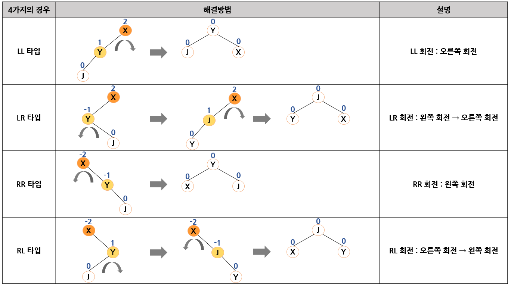

# 탐색

# 1. 탐색이란?

사람들은 항상 무엇인가를 찾아 헤매는데, 예를 들어 출근할 때 입을 옷을 찾는다거나 서랍속의 서류를 찾기도 한다. 컴퓨터에서도 마찬가지이다.

<b>탐색(search)</b>은 컴퓨터가 가장 많이 하는 작업 중의 하나이다.  
컴퓨터 프로그램에서 가장 많이 사용하는 작업임과 동시에 많은 시간이 요구되므로 탐색을 효율적으로 수행하는 것은 매우 중요하다.

탐색을 위하여 사용되는 자료 구조는 배열, 연결 리스트, 트리, 그래프 등 매우 다양할 수 있다.  
탐색 중 가장 기초적인 방법은 배열을 사용해 자료를 저장하고 찾는 것이다.  
그러나 탐색 성능을 향상하고자 한다면 이진 탐색 트리와 같이 진보된 방법으로 자료를 저장하고 탐색해야 한다.

탐색의 단위는 항목이다. 항목은 가장 간단하게는 숫자일 수도 있고 아니면 구조체가 될 수도 있다.  
항목 안에는 항목과 항목을 구별시켜주는 <b>키(key)</b>가 존재한다. 이를 <b>탐색키(serach key)</b>라고 한다.

탐색이란 탐색키와 데이터로 이루어진 여러 개의 항목 중, 원하는 탐색키를 가지고 있는 항목을 찾는 것이다.

# 2. 정렬되지 않은 배열에서의 탐색

## 순차 탐색

<b>순차 탐색(sequential search)</b>은 탐색 방법 중에서 가장 간단하고 직접적인 탐색 방법이다.

정렬되지 않은 배열의 항목들을 처음부터 마지막까지 하나씩 검사하여 원하는 항목을 찾아가는 방법으로서, 밑에 작성된 코드와 같다.

탐색의 대상이 되는 배열은 list[]라 가정하고 탐색의 범위는 low에서 high까지 함수의 매개변수로 주어진다.  
탐색 함수는 탐색에 성공하면 그 항목이 발견된 위치를 반환하고 그렇지 않으면 -1을 반환한다.

```C
int seq_search(int key, int low, int high)
{
    int i;
    
    for (i = low; i <= high; i++) {
        if (list[i] == key) {
            return i;	// 탐색 성공시 키 값의 인덱스를 반환
        }
    }
    return -1;			// 탐색 실패시 -1 반환
}
```

리스트의 앞부터 탐색값과 일치하는 항목을 찾을 때까지 순차적으로 탐색한다.

탐색이 성공적으로 수행되면 항목의 인덱스를 반환하고, 탐색이 실패하면 반복문 종료 후 -1을 반환한다.  
아래의 그림은 순차 탐색이 수행되는 예시이며 (a)는 탐색 성공, (b)는 탐색 실패하는 경우이다.


## 개선된 순차 탐색

순차 탐색의 코드를 보면 리스트 전체를 탐색하기 위한 반복문에서 리스트의 끝을 테스트하는 비교 연산이 있고 반복문 안에 키 값의 비교 연산이 있다.

비교 연산을 줄이기 위해 리스트의 끝에 찾고자 하는 키 값을 저장하고 반복문의 탈출 조건을 키 값을 찾을 때까지로 설정하도록 수정한 것이 아래의 개선된 순차 탐색이다.

개선된 순차탐색은 탐색이 성공했을 때 반복문의 인덱스i는 찾는 항목의 위치를 가리키게 되고 이 값을  반환하는 반면, 탐색에 실패 했을 경우 -1을 반환한다.

개선된 순차탐색은 비교 연산의 수를 반으로 줄일 수 있으므로 탐색 성능을 향상시킨다.  
즉 i의 값이 리스트의 끝에 도달하였는지를 매번 비교하지 않아도 된다.

```C
int seq_search2(int key, int low, int high)
{
    int i;
    
    list[high + 1] = key;
    for (i = low; list[i] != key; i++)	//키값을 찾으면 종료
        ;
    if (i == (high + 1)) return -1;		// 탐색 실패
    else return i;						// 탐색 성공
}
```

아래의 그림은 마찬가지로 개선된 순차탐색이 시행되는 예시이다.

(a)는 탐색 성공, (b)는 탐색 실패의 경우이다.


## 순차 탐색의 시간 복잡도

순차 탐색 알고리즘은 리스트의 처음부터 탐색을 시작해서 해당 항목을 찾거나 모든 항목을 검색할 때까지 키 값을 비교한다. 따라서 순차 탐색 알고리즘의 복잡도는 두 가지 경우로 나누어 볼 수 있다.  

1. 탐색이 성공하는 경우.  
   리스트에 있는 키의 위치에 따라 비교 횟수가 결정되는데, 모든 키가 탐색될 확률이 동일하다고 가정하면 평균 비교횟수는 (1 + 2 + 3 + ... + n) / n = (n+1) / 2 이 된다.  
   따라서 순차 탐색에 성공할 경우 평균 (n+1) / 2 번 비교하게 된다.
2. 탐색에 실패한 경우.  
   탐색에 실패한 경우 n번 비교하게 된다.

따라서 순차 탐색의 시간 복잡도는 O(n)이 된다.

# 3. 정렬된 배열에서의 탐색

정렬되어 있지 않은 배열이 많은 항목을 가지는 경우, 순차 탐색은 너무 비효율적인 방법이다.

예를 들어 10개 중의 하나를 찾는 것은 순차 탐색으로 가능하지만 1000000개 정도라면 많은 시간이 걸린다.  
만약 10억개 중에서 하나를 찾는 문제라면 순차 탐색은 상당히 비효율적이기 때문에 보다 빠른 방법이 요구된다. 

아주 효율적인 탐색 알고리즘인 이진 탐색을 살펴보자.

## 정렬된 배열에서의 이진 탐색

정렬된 배열의 탐색에는 <b>이진 탐색(binary search)</b>이 가장 적합하다.

이진 탐색은 배열의 중앙에 있는 값을 조사하여 찾고자 하는 항목이 왼쪽 또는 오른쪽 부분 배열에 있는지를 알아내어 탐색의 범위를 반으로 줄인다. 이러한 방법에 의해 매 단계에서 검색해야 할 리스트의 크기를 반으로 줄인다.

이진 탐색은 실제 우리가 일상생활에서 많이 이용하고 있는 방법인데, 하나를 보자면 영어 사전에서 단어를 찾을 때 항상 사용하고 있는 방법이 이진 탐색이다.

영어 사전에서 찾고자 하는 단어가 현재 페이지에 있는 단어보다 앞에 있는지, 뒤에 있는지를 결정한 다음에 단어가 있는 부분만을 다시 검색한다.

이진 탐색에서는 비교가 이루어질 때마다 탐색 범위가 급격하게 줄어든다.  
찾고자 하는 항목이 속해 있지 않은 부분은 전혀 고려할 필요가 없기 때문이다. 이런 방법을 반복적으로 사용하는 방법이 이진 탐색이다.

이진 탐색을 적용하려면 탐색하기 전에 배열이 반드시 정렬되어 있어야 한다.  
따라서 이진 탐색은 데이터의 삽입이나 삭제가 빈번할 시엔 적합하지 않고, 주로 고정된 데이터에 대한 탐색에 적합하다.

아래의 그림은 이진탐색의 예를 보인 그림이다.


## 이진 탐색 구현(순환 호출ver)

순환 호출로 구현하기 위해서 어떤 시점에서 탐색되어야할 범위는 low에서 high까지가 된다.  
맨 처음에는 low가 0, high가 n-1이 될 것이다.

그리고 순환 호출에는 항상 순환 호출을 끝내기 위한 코드가 들어가야 하므로 탐색 범위가 1보다 작다면,  
즉 탐색해야 될 항목이 없는 경우에는 순환 호출을 하지 않으면 된다.  
C언어로 구현된 코드는 아래와 같다.

```C
int search_binary(int key, int low, int high)
{
    int middle;
    
    if (low <= high) {			// 탐색해야 될 항목이 있는 경우만(1개 이상)
        middle = (low + high) / 2;
        if (key == list[middle]) {		// 탐색 성공
            return middle;
        }
        else if (key < list[middle]) {	// 왼쪽 부분리스트 탐색
            return search_binary(key, low, middle -1);
        }
        else return search_binary(key, middle + 1, high); // 오른쪽 부분리스트 탐색
    }
    return -1; // 탐색할 항목이 없는 경우 -1 리턴
}
```

## 이진 탐색 구현(반복ver)

이진 탐색은 반복문을 사용해 구현할 수도 있다. 효율성을 위해서는 반복 구조를 사용하는 것이 더 낫다.

```C
int search_binary2(int key, int low, int high)
{
    int middle;
    
    while (low <= high) {		// 탐색해야 할 숫자들이 남아 있으면
        middle = (low + high) / 2;
        if (key == list[middle]) {	// 탐색 성공
            return middle;
        }
        else if (key < list[middle]) { // 왼쪽 부분리스트 탐색을 위한 high값 변경
            high = middle - 1;
        }
        else low = middle + 1;		// 오른쪽 부분리스트 탐색을 위한 low값 변경
    }
    return -1;	// 발견되지 않은 경우
}
```

아래의 그림은 이진탐색이 동작하는 구체적인 예시이다. (34 탐색하는경우)


## 이진 탐색의 시간 복잡도

이진 탐색은 탐색을 반복할 때마다 탐색 범위를 반으로 줄인다.  
이러한 탐색 범위가 더 이상 줄일 수 없는 1이 될 때의 탐색 횟수를 k라 하면, 아래의 표와 같다.

| 비교 | 탐색범위 |
| :--: | :------: |
|  0   |   $n$    |
|  1   |  $n/2$   |
|  2   |  $n/4$   |
| ...  |   ...    |
| $k$  | $n/2^k$  |

마지막 행에서 n / 2^k는 1이 되므로 k=log_2n임을 알 수 있다.
결국 이진 탐색의 시간 복잡도는 O()이 된다.

## 정렬된 배열에서의 색인 순차 탐색

<b>색인 순차 탐색(indexed sequential search)</b> 방법은 <b>인덱스(index)</b>라 불리는 테이블을 사용하여 탐색의 효율을 높이는 방법이다. 인덱스 테이블은 주 자료 리스트에서 일정 간격으로 발췌한 자료를 가지고 있다.

인덱스 테이블에 m개의 항목이 있고, 주 자료 리스트의 데이터 수가 n이면 각 인덱스 항목은 주 자료 리스트의 각 n/m 번째 데이터를 가지고 있다.

이 때 주 자료 리스트와 인덱스 테이블은 모두 정렬되어 있어야 한다.


색인 순차 탐색 알고리즘은 우선 인덱스 테이블에서 index[i] <= key < index[i+1] 을 만족하는 항목을 찾는다.  
인덱스 테이블에서 이 조건을 만족하는 항목으로부터 주 자료 리스트에서 순차 탐색을 수행한다.

이 방법은 주 자료 리스트에서 탐색 시간을 상당히 줄일 수 있으므로 빠른 시간 안에 원하는 항목을 발견할 수 있게 해주므로 파일 처리, 데이터베이스 등의 응용 분야에서 많이 사용하는 방법이다.

색인 순차 탐색 알고리즘의 구현을 위해 인덱스 테이블을 다음과 같은 구조체로 선언한다.

```C
#define INDEX_SIZE 256
typedef struct {
    int key;
    int index;
} itable;
itable index_list[INDEX_SIZE];
```

index 필드에는 리스트의 인덱스 값이 저장되고 key 필드에는 인덱스가 가리키는 곳의 키 값이 저장된다.  
이를 이용해 색인 순차 탐색을 구현한 코드는 다음과 같다.

```C
// INDEX_SIZE는 인덱스 테이블의 크기, n은 전체 데이터의 수
int search_index(int key, int n)
{
    int i, low, high;
    
    // 키 값이 리스트 범위 내의 값이 아니라면 탐색 종료
    if (key < list[0] || key > list[n-1]) return -1;
    
    // 인덱스 테이블을 조사하여 해당 키의 구간 결정
    for (i = 0; i < INDEX_SIZE; i++) {
        if (index_list[i].key <= key && index_list[i + 1].key > key) break;
    }
    
    if (i == INDEX_SIZE) {	// 인덱스 테이블의 끝이라면
        low = index_list[i - 1].index;
        high = n;
    }
    else {
        low = index_list[i].index;
        high = index_list[i + 1].index;
    }
    // 예상되는 범위만 순차 탐색
    return seq_search(key, low, high);
}
```

색인 순차 탐색 알고리즘의 탐색 성능은 인덱스 테이블의 크기에 좌우된다.  
인덱스 테이블의 크기를 줄인다면 주 자료 리스트에서의 탐색 시간이 증가되고,  
인덱스 테이블의 크기를 크게 하면 인덱스 테이블의 탐색 시간을 증가시킨다.

인덱스 테이블의 크기를 m이라 하고 주 자료 리스트의 크기를 n이라 하면 색인 순차 탐색의 복잡도는
O(m + n/m)이다.

색인 순차 탐색에서 데이터의 수가 증가하여 1차 인덱스 테이블의 크기가 매우 커지면 2차 인덱스 테이블을 사용하고, 2차 인덱스 테이블은 1차 인덱스 테이블을 가리키도록 한다.

따라서 탐색은 2차 인덱스 테이블의 탐색에서 시작해 1차 인덱스를 거쳐 주 자료 리스트의 탐색으로 이어지게 된다.

## 보간 탐색

<b>보간 탐색(interpolation search)</b>은 사전이나 전화번호부를 탐색하는 방법처럼 탐색키가 존재할 위치를 예측하여 탐색하는 방법이다. 이는 사전을 찾을 때 'ㅎ' 으로 시작하는 단어는 사전의 뒷부분에서 찾고,  'ㄱ' 으로 시작하는 단어는 앞부분에서 찾는 것과 같은 원리이다.

보간 탐색은 이진 탐색과 유사하나 리스트를 반으로 분할하지 않고 불균등하게 분할하여 탐색한다.  
이진 탐색에서 탐색 위치는 항상 (low+high) / 2 이지만, 보간 탐색에서는 찾고자하는 키값과 현재의 low, high위치의 값을 고려하여 다음과 같이 탐색 위치를 결정한다.


여기에서 k는 찾고자 하는 키 값을, low와 high는 각각 탐색할 범위의 최소, 최대 인덱스 값을 나타낸다.  
즉, 위의 식은 탐색 위치를 결정할 때 찾고자 하는 키 값이 있는 곳에 근접하게 되도록 가중치를 주는 것이다.

위 식은 아래의 비례식을 정리한 것으로 생각할  수 있다.  
즉 값과 위치는 비례한다는 가정에서 탐색키에 해당되는 위치를 비례식으로 구한 것이다.


예를 들어 (3, 9, 15, 22, 31, 55, 67, 88, 89, 91)으로 구성된 리스트에서 탐색 구간이 0-9 이고, 찾을 키 값이 55인 경우를 살펴보자.  주어진 식에 의한 탐색위치를 구해보면 다음과 같다.


주의해야 할 점은 계산되어 나오는 값은 일반적으로 실수이다. 따라서 이 실수를 정수로 변환해 주어야 한다.  
보통은 소수점 이하를 버리는 방법을 사용하는데, 프로그램으로 구현할 때도 이점을 유의하여야 한다.  
이 경우 다행히도 한번 만에 원하는 탐색키를 찾을 수 있다.

많은 데이터가 비교적 균등하게 분포되어 있을 경우 보간 탐색은 이진 탐색보다 우수한 방법이 될 수 있으며 보간 탐색 알고리즘은 이진 탐색과 비슷한 O()의 복잡도를 가진다.

아래의 코드는 보간 탐색을 구현한 것이며, 나눗셈을 계산할 때 float로 형변환을 하지 않으면 정수로 계산이 되어 항상 0이 되므로 주의해야 한다.

```C
int interpol_search(int key, int n)
{
    int low, high, j;	// j : 탐색 위치
    
    low = 0;
    high = n - 1;
    while ( (list[high] >= key) && (key > list[low]) ) {
        j = ( (float)(key - list[low]) / (list[high] - list[low]) * (high - low) ) + low;
        if (key > list[j]) low = j + 1;	// key값이 더 크면 low 새로설정
        else if (key < list[j]) high = j - 1; // key값이 더 작으면 high 새로설정
        else low = j;
    }
    if (list[low] == key) return(low);	// 탐색 성공
    else return -1;	// 탐색 실패
}
```

# 4. 이진 탐색 트리

먼저 <b>이진 탐색(binary search)</b>과 <b>이진 탐색 트리(binary search tree)</b>와의 차이점을 살펴보자.  
<u>이진 탐색</u>과 <u>이진 탐색 트리</u>는 근본적으로 같은 원리에 의한 탐색 구조이다.

이진 탐색은 자료들이 배열에 저장되어 있으므로 삽입과 삭제가 상당히 힘들다.  
즉 자료를 삽입하고 삭제할 대마다 앞뒤의 원소들을 이동시켜야 한다.

반면 이진 탐색 트리는 비교적 빠른 시간 안에 삽입과 삭제를 끝마칠 수 있는 구조로 되어 있다.  
따라서 삽입과 삭제가 심하지 않은 정적인 자료를 대상으로 탐색이 이루어지는 경우에는 이진 탐색도 무난한 방법이지만 삽입, 삭제가 빈번히 이루어진다면 반드시 이진 탐색 트리를 사용하여야 한다.

이진 탐색 트리는 만약 트리가 균형 트리라면 탐색 연산은 O()의 시간 복잡도를 가지고 있다.  
만약 균형 트리가 아닌 경우엔 탐색의 시간 복잡도가 O(n)으로 높아지게 된다.

예를 들어 (5, 2, 8, 1, 7, 3, 9)와 같은 순서로 정수를 공백 이진 트리에 삽입한다면 아래 그림의 (a)와 같은 이진 탐색 트리가 만들어진다. 그러나 만약 (1, 2, 3, 5, 7, 8, 9)의 순으로 삽입한다면 (b)와 같은 트리가 만들어 진다.


모든 항목이 균일하게 탐색된다는 가정 하에 평균 비교 횟수를 보면 (a)의 경우 (1 + 2 + 2 + 3 + 3 + 3 + 3) / 7 = 2.4회인 반면, (b)는 (1 + 2 + 3 + 4 + 5 + 6 + 7) / 7 = 4회가 된다.  
따라서 만약 이진 탐색 트리가 (b)와 같이 경사 트리가 되면 탐색 시간은 순차 탐색과 같게 되어 효율이 떨어지게 된다.

그러므로 이진 탐색 트리에서는 균형을 유지하는 것이 무엇보다 중요하다.  
스스로 균형 트리를 만드는 AVL 트리를 비롯한 몇 가지 탐색 트리들을 살펴보자.

# 5. AVL 트리

AVL 트리는 Adelson-Velskii와 Landis에 의해 1962년 제안된 트리로서, 각 노드에서 왼쪽 서브 트리의 높이와 오른쪽 서브 트리의 높이 차가 1 이하인 이진 탐색 트리를 말한다.

AVL 트리는 트리가 비균형 상태로 된다면 스스로 노드들을 재배치하여 균형 상태로 만든다.  
따라서 AVL트리는 균형 트리가 항상 보장되어 O(logn)시간 안에 탐색이 끝나게 된다.  
또한 삽입과 삭제 연산도 O(logn)시간 안에 할 수 있다.

아래 그림에서 (a)는 모든 노드에서 양쪽 서브 트리의 높이의 차이가 1 이하이다.  
그러나 (b)는 노드 7에서 왼쪽 서브 트리의 높이가 2인 반면 오른쪽 서브 트리의 높이가 0이므로 높이 균형을 이루지 못하기 때문에 AVL 트리가 아니다.


쉽게 이해하기 위해 <b>균형 인수(balance factor)</b>를 정의하여 보자.

균형 인수는 (왼쪽 서브 트리의 높이 - 오른쪽 서브 트리의 높이)로 정의된다.  
모든 노드의 균형 인수가 1 이하이면  AVL 트리이다. 위 그림에서 각 노드 위의 숫자가 균형인수이다.

(a)는 모든 노드의 균형 인수가 1 이하이기 때문에 AVL 트리이지만 (b)는 노드 5와 7이 균형 인수가 2이기 때문에 AVL 트리가 아니다.

## AVL 트리의 탐색 연산

AVL 트리도 탐색에서는 일반적인 이진 탐색 트리와 동일하다. 따라서 시간 복잡도는 O()이다.

## AVL 트리의 삽입 연산

균형을 이룬 이진 탐색 트리에서 균형 상태가 깨지는 것은 삽입 연산과 삭제 연산 시이다.  
삽입 연산 시에는 삽입되는 위치에서 루트까지의 경로에 있는 조상 노드들의 균형 인수에 영향을 줄 수 있다.

따라서 새로운 노드의 삽입 후에 불균형 상태로 변한 가장 가까운 조상 노드, 즉 균형 인수가 2가 된 가장 가까운 조상 노드의 서브 트리들에 대하여 다시 균형을 잡아야 한다. 그외의 다른 노드들은 변경할 필요가 없다.

예를 들어 아래 그림에서 (a)는 균형을 이룬 AVL트리이다. 여기에 정수 1을 삽입하면 (b)처럼 노드5와 노드7이 균형 인수가 2가 되어 균형이 깨지게 된다.

따라서 여기서는 균형 인수가 2가 된 가장 가까운 조상 노드인 노드 5부터 그 아래에 있는 노드들을 다시 배치하여 균형 상태로 만들어야 한다.


균형이 깨진 트리를 다시 균형 있게 하는 방법을 알아보자.

해결하는 방법은 새로운 노드부터 균형 인수가 2가 된 가장 가까운 조상 노드까지를 회전시키는 것이다.  
위 그림의 경우 노드 1, 3, 5를 오른쪽으로 회전시킨다면 아래 그림처럼 되어서 다시 균형트리가 된다.


## 4가지의 경우

AVL 트리에 새로운 노드를 추가하면 균형이 깨어질 수 있다.

이때는 트리를 부분적으로 회전하여 균형 트리로 되돌려야 한다.  
균형이 깨지는 경우에는 다음의 4가지의 경우가 있다.  
새로 삽인된 노드 J로부터 가장 가까우면서 균형 인수가 2가 된 조상 노드를 X라고 하자.



## LL 타입

노드 X의 왼쪽 자식의 왼쪽에 노드가 추가됨으로 해서 발생한다. 노드들을 오른쪽으로 회전시키면 된다.


## RR 타입

노드 X의 오른쪽 자식의 오른쪽에 노드가 추가됨으로 해서 발생한다. 노드들을 왼쪽으로 회전시키면 된다.


## RL 타입

노드 X의 오른쪽 자식의 왼쪽에 노드가 추가됨으로 해서 발생한다.  
RL 타입은 균형 트리를 만들기 위해 2번의 회전이 필요하다.


## LR 타입

노드 X의 왼쪽 자식의 오른쪽에 노드가 추가됨으로 해서 발생한다.  
LR 타입도 균형 트리를 만들기 위해 2번의 회전이 필요하다.


## AVL 트리 예제

종합적인 예제로 데이터 (7, 8, 9, 2, 1)가 순서대로 주어졌다고 가정하고 AVL 트리가 만들어지는 과정을 살펴보자.

여기서는 삽입되는 노드는 황토색으로, 위치가 변경되는 노드는 노란색으로 표시되어 있다.


## AVL 트리의 정의

AVL 트리를 구현해보자.  먼저 유의할 점은 AVL 트리도 이진 탐색 트리의 일종이란 점이다.

따라서 노드의 구조는 이진 탐색 트리와 동일하게 왼쪽과 오른쪽 자식을 가리키는 포인터와 데이터가 저장되어 있는 필드로 구성된다.

```C
#include <stdio.h>
#include <stdlib.h>

// AVL 트리 노드 정의
typedef struct _AVLNode {
    int key;
    struct _AVLNode *left;
    struct _AVLNode *right;
} AVLNode;
```


## rotate_right() 함수 구현

AVL 트리를 구현하려면 2가지의 기본 회전 함수가 필요하다.  
왼쪽으로 회전시키는 함수 rotate_left()와 오른쪽으로 회전시키는 함수 rotate_right()을 작성한다.

이중에서 rotate_right() 함수를 살펴보자.  
해당 함수는 주어진 트리를 밑의 그림과 같이 오른쪽으로 회전시키는 함수이다.


모든 것은 포인터로 되어 있으므로 포인터만 이동시키면 된다.

```C
// 오른쪽으로 회전시키는 함수
AVLNode* rotate_right(AVLNode *parent)
{
    AVLNode* child = parent->left;
    parent->left = child->right; // 부모노드의 왼쪽에 자식노드의 오른쪽 노드를 연결하고
    child->right = parent;		// 자식노드의 오른쪽에 부모노드를 연결시킨다.
    // 새로운 루트를 반환
    return child;
}
```

## rotate_left()함수 구현


```C
// 왼쪽으로 회전시키는 함수
AVLNode* rotate_left(AVLNode *parent)
{
    AVLNode* child = parent->right;
    parent->right = child->left; // 부모노드의 오른쪽에 자식노드의 왼쪽 노드를 연결하고
    child->left = parent;		// 자식노드의 왼쪽에 부모노드를 연결시킨다.
    // 새로운 루트를 반환
    return child;
}
```

## 트리의 높이 계산

AVL 트리의 구현에서 중요한 것은 트리의 높이를 측정하는 것이다.

트리의 높이 계산은 순환 호출을 이용해 구현된다.  
즉 루트 노드의 왼쪽 서브 트리와 오른쪽 서브 트리에 대하여 각각 순환 호출을 하여 각각의 높이를 구한 다음, 이들 중에서 더 큰 값에 1을 더하면 트리의 높이가 된다.

또한 양쪽 서브 트리의 높이의 차이는 각각의 서브트리에 대하여 높이를 구한 다음, 왼쪽 서브 트리의 높이에서 오른쪽 서브 트리의 높이를 빼면 구할 수 있다.

```C
// 트리의 높이를 반환
int get_height(AVLNode *node)
{
    int height = 0;
    
    if (node != NULL) {
        height = 1 + MAX(get_height(node->left), get_height(node->right));
    }
    
    return height;
}
// 노드의 균형인수를 반환
int get_balance(AVLNode *node)
{
    if (node == NULL) return 0;
    
    return get_height(node->left) - get_height(node->right);
}
```

## 새로운 노드 추가 함수

새로운 노드가 추가되면 트리의 균형이 깨질 수 있다.  
이때 오른쪽 회전과 왼쪽 회전을 이용해 트리의 균형을 맞춘다. 이중 회전은 회전 함수를 연이어서 부르면 된다.

```C
// AVL 트리에 새로운 노드 추가 함수
AVLNode* insert(AVLNode *node, int key)
{
    // 이진 탐색 트리의 노드 추가 수행
    if (node == NULL) {	// 탐색이 실패한 위치가 삽입 위치가 된다.
        return (create_node(key));
    }
    
    if (key < node->key) {
        node->left = insert(node->left, key);
    }
    else if (key > node->key) {
        node->right = insert(node->right, key);
    }
    else return node;	// 동일한 키는 허용되지 않음
    
    // 노드들의 균형인수 계산
    int balance = get_balance(node);
    
    // 새 노드가 왼쪽 자식의 왼쪽에 추가되었다면 LL타입
    if (balance > 1 && key < node->left->key) {
        return rotate_right(node);
    }
    
    // 새 노드가 오른쪽 자식의 오른쪽에 추가되었다면 RR타입
    if (balance < -1 && key > node->right->key) {
        return rotate_left(node);
    }
    
    // 새로운 노드가 왼쪽 자식의 오른쪽에 추가되었다면 LR타입
    if (balance > 1 && key > node->left->key) {
        node->left = rotate_left(node->left);
        return rotate_right(node);
    }
    
    // 새로운 노드가 오른쪽 자식의 왼쪽에 추가되었다면 RL타입
    if (balance < -1 && key < node->right->key) {
        node->right = rotate_right(node->right);
        return rotate_left(node);
    }
    
    return node;	// 새로운 루트를 반환
}
```

## 전체 프로그램

```C
#include <stdio.h>
#include <stdlib.h>
#define MAX(a, b) ( (a) > (b) ? (a) : (b) )

// AVL 트리 노드 정의
typedef struct _AVLNode {
    int key;
    struct _AVLNode *left;
    struct _AVLNode *right;
} AVLNode;

// 트리의 높이를 반환
int get_height(AVLNode *node)
{
    int height = 0;
    
    if (node != NULL) {
        height = 1 + MAX(get_height(node->left), get_height(node->right));
    }
    
    return height;
}
// 노드의 균형인수를 반환
int get_balance(AVLNode *node)
{
    if (node == NULL) return 0;
    
    return get_height(node->left) - get_height(node->right);
}

// 노드를 동적으로 생성하는 함수
AVLNode* create_node(int key)
{
    AVLNode* node = (AVLNode*)malloc(sizeof(AVLNode));
    node->key = key;
    node->left = NULL;
    node->right = NULL;
    return node;
}

// 오른쪽으로 회전시키는 함수
AVLNode* rotate_right(AVLNode *parent)
{
    AVLNode* child = parent->left;
    parent->left = child->right; // 부모노드의 왼쪽에 자식노드의 오른쪽 노드를 연결하고
    child->right = parent;		// 자식노드의 오른쪽에 부모노드를 연결시킨다.
    // 새로운 루트를 반환
    return child;
}

// 왼쪽으로 회전시키는 함수
AVLNode* rotate_left(AVLNode *parent)
{
    AVLNode* child = parent->right;
    parent->right = child->left; // 부모노드의 오른쪽에 자식노드의 왼쪽 노드를 연결하고
    child->left = parent;		// 자식노드의 왼쪽에 부모노드를 연결시킨다.
    // 새로운 루트를 반환
    return child;
}

// AVL 트리에 새로운 노드 추가 함수
AVLNode* insert(AVLNode *node, int key)
{
    // 이진 탐색 트리의 노드 추가 수행
    if (node == NULL) {	// 탐색이 실패한 위치가 삽입 위치가 된다.
        return (create_node(key));
    }
    
    if (key < node->key) {
        node->left = insert(node->left, key);
    }
    else if (key > node->key) {
        node->right = insert(node->right, key);
    }
    else return node;	// 동일한 키는 허용되지 않음
    
    // 노드들의 균형인수 계산
    int balance = get_balance(node);
    
    // 새 노드가 왼쪽 자식의 왼쪽에 추가되었다면 LL타입
    if (balance > 1 && key < node->left->key) {
        return rotate_right(node);
    }
    
    // 새 노드가 오른쪽 자식의 오른쪽에 추가되었다면 RR타입
    if (balance < -1 && key > node->right->key) {
        return rotate_left(node);
    }
    
    // 새로운 노드가 왼쪽 자식의 오른쪽에 추가되었다면 LR타입
    if (balance > 1 && key > node->left->key) {
        node->left = rotate_left(node->left);
        return rotate_right(node);
    }
    
    // 새로운 노드가 오른쪽 자식의 왼쪽에 추가되었다면 RL타입
    if (balance < -1 && key < node->right->key) {
        node->right = rotate_right(node->right);
        return rotate_left(node);
    }
    
    return node;	// 새로운 루트를 반환
}

// 전위 순회 함수
void preorder(AVLNode *root)
{
    if (root != NULL)
    {
        printf("[%d] ",root->key);
        preorder(root->left);
        preorder(root->right);
    }
}

int main()
{
    AVLNode *root = NULL;

    // 예제 트리 구축
    root = insert(root, 10);
    root = insert(root, 20);
    root = insert(root, 30);
    root = insert(root, 40);
    root = insert(root, 50);
    root = insert(root, 29);

    printf("전위 순회 결과\n");
    preorder(root);

    return 0;
}
```

# 6. 2-3 트리

<b>2-3 트리</b>는 <u>차수가 2 또는 3인 노드를 가지는 트리</u>로서 삽입이나 삭제 알고리즘이 AVL 트리보다 간단하다.

<b>차수가 2인 노드</b>를 <u>2-노드</u>라고 하며 2-노드는 일반 이진 탐색 트리처럼 하나의 데이터 k1과 두 개의 자식노드를 가진다. <b>차수가 3인 노드</b>를 <u>3-노드</u>라고 하며 3-노드는 2개의 데이터 k1, k2와 3개의 자식노드를 가진다.

아래 그림의 예시에서, 왼쪽 서브 트리에 있는 데이터들은 모두 k1보다 작은 값이고, 중간 서브 트리에 있는 값들은 모두 k1보다 크고 k2보다 작다. 오른쪽에 있는 데이터들은 모두 k2보다 크다.


## 2-3 트리의 탐색 연산

2-3 트리의 탐색 연산은 이진 탐색 트리의 알고리즘을 확장하면 된다.  
노드가 2-노드이냐 3-노드이냐에 따라 탐색을 진행하면 된다.

위 그림에서 30을 탐색한다고 가정하자. 2-노드의 데이터값인 50보다 작으므로 왼쪽 서브트리로 가야한다.  
30은 다시 3-노드의 데이터 값인 10과 35와 비교된다.  
10과 35사이에 있으므로 중간 서브 트리로 진행한다.

중간 서브 트리에는 찾는 값인 30이 있으므로 탐색은 성공이다.  
코드는 아래와 같다.

```C
Tree23Node* tree23_search(Tree23Node *root, int key)
{
    if (root == NULL) {					// 트리가 비어 있으면
        return FALSE;
    }
    else if (key == root->data) {		// 루트의 키 == 탐색키라면
        return TRUE;
    }
    else if (root->type == TWO_NODE) {	// 2-노드인 경우
        if (key < root->key) {
            return tree23_search(root->left, key);
        }
        else return tree23_search(root->right, key);
    }
    else {		// 3-노드인 경우
        if (key < root->key1) {
            return tree23_search(root->left, key);
        }
        else if (key > root->key2) {
            return tree23_search(root->right, key);
        }
        else return tree23_search(root->middle, key);
    }
}
```

## 2-3 트리의 삽입 연산

2-3 트리의 노드는 2개의 데이터값을 저장할 수 있다.  
2-3 트리에 데이터 추가시에 노드에 추가할 수 있을 때까지 데이터는 추가되고 더 이상 저장할 장소가 없는 경우에는 노드를 분리하게 된다.

간단한 예를 들어 30, 60, 20의 순으로 데이터를 삽입한다고 가정하자.  
30을 삽입하면 노드가 하나 생성되고 이 새로운 노드의 데이터로 저장된다.  
60은 하나의 노드가 2개의 데이터까지 저장할 수 있으므로 기존의 노드에 저장된다.  
20은 현재의 노드가 더 이상 데이터를 저장할 수 없으므로 노드를 3개의 노드로 분리한다.

중간값을 한레벨 위로 올리고 제일 작은 값을 왼쪽 노드로, 제일 큰 값을 오른쪽 노드로 만드는 것이다.  
2-3 트리에서의 삽입 연산은 이런식으로 노드를 분리하는 과정을 통하여 이루어진다.


노드가 분리되는 상황을 좀 더 자세히 살펴보자. 3가지의 경우로 나누어진다.

- 단말 노드를 분리하는 경우
- 비단말 노드를 분리하는 경우
- 루트 노드를 분리하는 경우

### 단말 노드를 분리하는 경우


만약에 단말노드가 이미 2개의 데이터를 가지고 있는데 새로운 데이터가 삽입되어야 한다면 이 단말 노드는 분리되어야 한다. 단말 노드를 분리하는데 부모 노드가 2-노드라면 위 그림의 (a)처럼 새로운 노드와 기존 2개의 노드 중에서 중간값은 부모 노드로 올라가게 되고, 작은값과 큰값은 새로운 노드로 분리되게 된다.

그러나 (b)처럼 만약 부모 노드가 이미 2개의 데이터를 가지고 있는 3-노드라면 부모 노드가 다시 분리되어야 한다. 이것은 아래의 알고리즘을 이용해 분리된다.

### 비단말 노드를 분리하는 경우

비단말 노드가 분리 되야 하는 경우에도 마찬가지로 중간 값을 다시 부모 노드로 올려 보내고 작은 값과 큰 값을 별개의 노드로 분리한다. 서브 트리들도 아래의 그림처럼 분리된다.  
만약 부모 노드에 추가 받을만한 공간이 없다면 다시 이러한 분리 과정이 부모 노드에 대하여 되풀이된다.


### 루트 노드를 분리하는 경우

비슷하게 아래 그림처럼 루트 노드를 분리하게 되면 새로운 노드가 하나 생기게 되므로 트리의 높이가 하나 증가하게 된다. 새로 만들어지는 노드는 이 트리의 새로운 루트 노드가 된다.  
2-3트리에서 트리의 높이가 증가하게 되는 경우는 오직 이 경우뿐이다.


# 7. 2-3-4 트리

2-3-4 트리는 하나의 노드가 4개의 자식까지 가질 수 있도록 2-3 트리를 확장한 것이다.  
4개의 자식을 가질 수 있는 노드는 4-노드라고 불리우며 3개의 데이터를 가질 수 있다. 4-노드의 3개의 데이터를 각각 small, middle, large라고 하면 4-노드의 서브트리엔 그림과 같은 범위에 속하는 데이터들이 들어간다.


2-3-4 트리를 탐색하는 것은 2-3 트리의 탐색 알고리즘에 4- 노드를 처리하는 부분만 추가되면 된다.

## 2-3-4 트리의 삽입 연산

2-3-4 트리에서 키를 삽입해야 할 단말 노드가 만약 2-노드 또는 3-노드이면 간단하게 삽입만 하면 된다.
문제는 삽입해야할 단말노드가 4-노드이면 <b>후진 분할(backward split)</b>이 일어나게 된다.

따라서 2-3-4 노드에서는 후진 분할 연산을 방지하기 위해 삽입 노드를 찾는 순회(루트→단말)시에 4-노드를 만나면 미리 분할을 수행한다. 따라서 미리 분할을 수행하였으므로 후진 분할을 할 필요가 없다.

이는 2-3 트리와 비교되는데, 2-3 트리는 삽입 또는 삭제를 위한 순회(루트→단말)와 분할과 합병의 영향으로 인한 순회(단말→루트)가 필요하다.
따라서 2-3 트리에 비해 2-3-4 트리의 장점은 루트에서 단말 노드로 한번만 이동하면서 삽입이나 삭제가 가능하다는 것이다.

2-3-4 트리에서는 삽입을 위해 루트에서 단말 노드로 내려가는 동안 4-노드를 만나면 무조건 분할시킨다.  
따라서 단말 노드에 도달하게 되면 단말 노드의 부모 노드는 4-노드가 아니라는 것이 보장된다. 따라서 후진 이동을 막을 수 있다.

4-노드에 대하여 다음 3가지의 경우를 고려해 알고리즘을 만들어야 한다.

- 4-노드가 루트인 경우
- 4-노드의 부모가 2-노드인 경우
- 4-노드의 부모가 3-노드인 경우

노드를 삽입할 때 루트에서 단말노드로 내려가면서 4-노드를 분할한다면, 루트가 아닌 4-노드를 만날 때마다 그것의 부모는 적어도 4-노드가 아니다.


