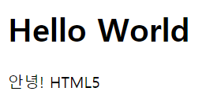
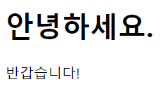
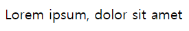

# HTML5

- HTML(HyperText Markup Language)
  - 웹 페이지를 기술하기 위한 마크업 언어이다.
  - 웹페이즈의 내용(content)과 구조(structure)를 담당하는 언어
  - HTML 태그를 통해 정보를 구조화 하는 것
- HTML5는 2014년 10월 28일 확정된 차세데 웹 표준이다.

# Hello HTML5

- HTML5 문서는 반드시 `<!DOCTYPE html>`으로 시작하여 문서 형식을 HTML5로 지정한다.
- 실제적인 HTML document는 2행부터 시작되는데, `<html>`과 `</html>`사이에 기술한다.
- `<head>`와 `</head>` 사이에는 document title, 외부 파일의 참조, 메타 데이터의 설정 등이 위치한다.
  - 이 정보들은 브라우저에 표시되지 않는다.
- 웹 브라우저에 출력되는 모든 요소는 `<body>`와 `</body>` 사이에 위치한다.

```html
<!DOCTYPE html>
<html>
    <head>
        <meta charset="utf-8">
        <title>Hello World</title>
    </head>
    <body>
        <h1>Hello World</h1>
        <p>안녕! HTML5</p>
    </body>
</html>
```



- HTML document는 .html 확장자를 갖는 순수한 텍스트 파일이다.  
  따라서 메모장 등으로 편집할 수 있지만 다양한 편의 기능을 제공하는 editor 또는 IDE(Intergrated Development Environment)를 사용하는 것이 일반적이다.  
  - Visual Studio Code
  - WebStorm
  - Atom
  - Brackets
  - Sublime text
  - ↑ 대표적인 에디터 또는 IDE

# HTML5의 기본 문법

## 요소 (Element)

- HTML 요소는 시작 태그(start tag)와 종료 태그(end tag) 그리고 태그 사이에 위치한 content로 구성된다.

```html
	┌콘텐츠(Contents)
<p>Hello</p>-종료태그
└시작태그(start tag)
```

- HTML document는 요소(Element)들의 집합으로 이루어진다.
- 태그는 대소문자를 구별하지 않으나, W3C(World Wide Web Consortium)에서는 HTML4의 경우 소문자를 추천하고 있어 HTML5에서도 소문자를 사용하는 것이 일반적이다.

### 요소의 중첩 (Nested Element)

- 요소는 중첩될 수 있다.
  - 즉, 요소는 다른 요소를 포함할 수 있다.
  - 이때 부자관계가 성립된다.  
    이러한 부자관계로 정보를 구조화 하는 것이다.

```html
<!DOCTYPE html>
<html>
    <head>
        <meta charset="utf-8">
        <title>Hello World</title>
    </head>
    <body>
        <h1>안녕하세요.</h1>
        <p>반갑습니다!</p>
    </body>
</html>
```



- html 요소는 웹페이지를 구성하는 모든 요소들을 포함한다.
  - 위의 예제에서는 html 요소는 body 요소를 포함하며 body 요소는 h1, p 요소를 포함한다.  
    이 중첩 관계(부자 관계)로 웹페이즈의 구조(structure)를 표현한다.

### 빈 요소 (Empty Element)

- content를 가질 수 없는 요소를 빈 요소(Eempty element or Self-Closing element)라 한다.
  - 아래의 예시처럼 빈 요소는 content가 없으며(필요가 없다) 어트리뷰트(Attribute)만을 가질 수 있다.

```html
<meta charset="utf-8">
```

- 빈 요소 중 대표적인 요소
  - br
  - hr
  - img
  - input
  - link
  - meta
- 어트리뷰트 (Atrribute)
  - 어트리뷰트(Atrribute: 속성)이란 요소의 성질, 특징을 정의하는 명세이다.
  - 요소는 어트리뷰트를 가질 수 있으며 어트리뷰트는 요소에 추가적 정보(이미지 파일의 경로, 크기 등)을 제공한다.
  - 어트리뷰트는 시작 태그에 위치해야 하며 이름과 값의 쌍을 이룬다.

```html
			┌ 어트리뷰트값(Attribute Value)

	  └ 어트리뷰트명(Attribute Name)
```

- 위의 예시는 어트리뷰트 src는 이미지 파일의 경로와 파일명,  
  width는 이미지의 너비, height는 이미지의 높이 정보를 브라우저에 알려준다.
  - 이 정보들을 사용하여 브라우저는 img 요소를 화면에 출력한다.

## 글로벌 어트리뷰트 (HTML Global Attribute)

- 글로벌 어트리뷰트는 모든 HTML 요소가 공통으로 사용할 수 있는 어트리뷰트이다.
  - 몇몇 요소에는 효과가 적용되지 않을 수 있지만, 글로벌 어트리뷰트는 대체로 모든 요소에 사용될 수 있다.
- 자주 사용되는 글로벌 어트리뷰트

| Atrribute | Description                                                  |
| --------- | ------------------------------------------------------------ |
| i d       | 유일한 식별자(id)를 요소에 저장한다. 중복 지정이 불가능하다. |
| class     | 스타일시트에 정의된 class를 요소에 지정한다. 중복 지정이 가능하다. |
| hidden    | css의 hidden과는 다르게 의미상으로도 브라우저에 노출되지 않게 된다. |
| lang      | 지정된 요소의 언어를 지정한다. 검색엔진의 크롤링 시 웹페이지의 언어를 인식할 수 있게 한다. |
| style     | 요소에 인라인 스타일을 지정한다.                             |
| tabindex  | 사용자가 키보드로 페이지를 내비게이션 시 이동 순서를 지정한다. |
| title     | 요소에 관한 제목을 지정한다.                                 |

## 주석 (Comments)

- 주석(Comments)
  - 주로 개발자에게 코드를 설명하기 위해 사용되며 브라우저는 주석을 화면에 표시하지 않는다.

```html
<!--주석은 화면에 표시되지 않는다.-->
<p>Lorem ipsum, dolor sit amet</p>
```



