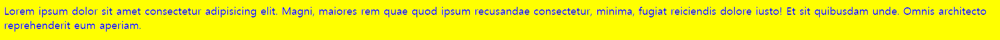
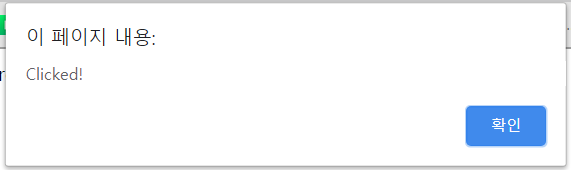
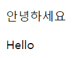

# 문서 형식 정의 tag

- 문서 형식 정의(Document Type Definition, DTD)태그는 출력할 웹페이지의 형식을 브라우저에게 전달한다.
  - 문서의 최상위에 위치해야 하며 대소문자를 구별하지 않는다.
  - 아래는 문서별 기술 양식

```html
<!-->HTML5<-->
<!DOCTYPE html>

<!-->HTML 4.01<-->
<!DOCTYPE HTML PUBLIC "-//W3C//DTD HTML 4.01 Transitional//EN" "http://www.w3.org/TR/html4/loose.dtd">

<!-->XHTML 1.0<-->
<!DOCTYPE html PUBLIC "-//W3C//DTD XHTML 1.0 Transitional//EN" "http://www.w3.org/TR/xhtml1/DTD/xhtml1-transitional.dtd">
```

# html tag

- html 태그는 모든 HTML 요소의 부모 요소이며 <u>웹페이지에 단 하나만 존재</u>한다.
  - 즉, 모든 요소는 html 요소의 자식 요소이며 html 요소 내부에 기술해야 한다.
  - 단 <!DOCTYPE>은 예외

```html
<!DOCTYPE html>
<html>
    <head>
        <meta charset="utf-8">
        <title>문서 제목</title>
    </head>
    <body>
        화면에 표시할 모든 콘텐츠는 이곳에 기술
    </body>
</html>
```

- html은 글로벌 어트리뷰트를 지원한다.
  - 특히 lang 어트리뷰트를 사용하는 경우가 많다.
  - 아래는 한국어를 주언어로 사용하는 경우의 예

```html
<html lang="ko">
    
</html>
```

# head tag

- head 요소는 <b>메타데이터</b>를 포함하기 위한 요소이며 <u>웹피이지에 단 하나만 존재</u>한다.
  - 메타데이터는 HTML 문서의 title, style, link, script에 대한 데이터로 화면에 표시되지 않는다.
  - head 요소에는 메타데이터 이외의 화면에 표시되는 일체의 요소를 포함시킬 수 없다.

## title tag

- title 요소는 문서의 제목을 정의한다.
  - 정의된 제목은 브라우저의 탭에 표시된다.

```html
<!DOCTYPE html>
<html>
    <head>
        <meta charset="utf-8">
        <title>문서 제목</title>
    </head>
    <body>
        Lorem ipsum, dolor sit amet consectetur adipisicing elit. Reprehenderit est distinctio commodi cumque velit? Distinctio ipsa nobis sit porro quidem voluptatibus labore sequi eius deserunt, architecto saepe maiores? Corrupti, rem.
    </body>
</html>
```

## style tag

- style 요소에는 HTML 문서를 위한 style 정보를 정의한다.

```html
<!DOCTYPE html>
<html>
    <head>
        <meta charset="utf-8">
        <title>문서 제목</title>
        <style>
            body {
                background-color: yellow;
                color: blue;
            }
        </style>
    </head>
    <body>
        Lorem ipsum dolor sit amet consectetur adipisicing elit. Magni, maiores rem quae quod ipsum recusandae consectetur, minima, fugiat reiciendis dolore iusto! Et sit quibusdam unde. Omnis architecto reprehenderit eum aperiam.
    </body>
</html>
```



## link tag

- link 요소에는 외부 리소스와의 연계 정보를 정의한다.
  - 주로 HTML과 외부 CSS 파일 연계에 사용된다.

```html
<!DOCTYPE html>
<html>
    <head>
        <meta charset="utf-8">
        <title>문서 제목</title>
        <link rel="stylesheet" href="style.css">
    </head>
    <body>
        Lorem ipsum dolor sit amet consectetur adipisicing elit. Magni, maiores rem quae quod ipsum recusandae consectetur, minima, fugiat reiciendis dolore iusto! Et sit quibusdam unde. Omnis architecto reprehenderit eum aperiam.
    </body>
</html>
```

## script tag

- script 요소에는 client-side JavaScript를 정의한다.

```html
<!DOCTYPE html>
<html>
    <head>
        <meta charset="utf-8">
        <script>
            document.addEventListener('click', function() {
                alert('Clicked!');
            });
        </script>
    </head>
    <body>
        Lorem ipsum dolor sit amet consectetur adipisicing elit. Magni, maiores rem quae quod ipsum recusandae consectetur, minima, fugiat reiciendis dolore iusto! Et sit quibusdam unde. Omnis architecto reprehenderit eum aperiam.
    </body>
</html>
```



- src 어트리뷰트를 사용하면 외부 JavaScript 파일을 로드할 수 있다.

```html
<!DOCTYPE html>
<html>
    <head>
        <meta charset="utf-8">
        <script src="main.js"></script>
    </head>
    <body>
        Lorem ipsum dolor sit amet consectetur adipisicing elit. Magni, maiores rem quae quod ipsum recusandae consectetur, minima, fugiat reiciendis dolore iusto! Et sit quibusdam unde. Omnis architecto reprehenderit eum aperiam.
    </body>
</html>
```

## meta tag

- meta 요소는 description, keywords, author, 기타 메타데이터 정의에 사용된다.
- 메타 데이터는 브라우저, 검색엔진(keywords) 등에 의해 사용된다.
  - charset 어트리뷰트는 브라우저가 사용할 문자셋을 정의한다.

```html
<!DOCTYPE html>
<html>
    <head>
        <meta charset="utf-8">
    </head>
    <body>
        <p>안녕하세요</p>
        <p>Hello</p>
    </body>
</html>
```



- SEO(검색엔진 최적화)를 위해 검색엔진이 사용할 keywords을 정의한다.

```html
<meta name="keywords" content="HTML, CSS, XML, XHTML, JavaScript">
```

- 웹페이지의 설명을 정의한다.

```html
<meta name="description" content="Web tutorials on HTML and CSS">
```

- 웹페이지의 저자를 명기한다.

```html
<meta name="author" content="John Doe">
```

- 웹페이지를 30초마다 Refresh한다.

```html
<meta http-equiv="refresh" content="30">
```

# body tag

- body tag는 HTML 문서의 내용을 나타내며 웹페이지에 단 하나만 존재한다.
  - 메타데이터를 제외한 웹페이지를 구성하는 대부분의 요소가 body 요소 내에 기술된다.

```html
<!DOCTYPE html>
<html>
    <head>
        <meta charset="utf-8">
        <title>문서 제목</title>
    </head>
    <body>
        Lorem ipsum, dolor sit amet consectetur adipisicing elit. Reprehenderit est distinctio commodi cumque velit? Distinctio ipsa nobis sit porro quidem voluptatibus labore sequi eius deserunt, architecto saepe maiores? Corrupti, rem.
    </body>
</html>
```

