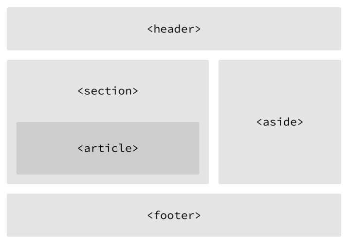

# 레이아웃을 구성하기 위한 공간분할 태그

- 웹페이지의 레이아웃을 구성하기 위해서는 공간을 분할할 필요가 있다.

- 공간을 분할할 수 있는 태그는 `div, span, table` 등이 있다.
  - 과거에는 table 태그를 사용하여 레이아웃을 구성하기도 하였으나 모던 웹에서는 주로 div를 사용하여 레이아웃을 구성한다.
- 그런데 `div` 태그는 의미론적으로 어떠한 의미도 가지고 있지 않기 때문에 아래처럼 HTML5에서 새롭게 추가된 시맨틱 태그를 사용하는 것이 더 나은 방법이다.
  - 그러나 IE에서 작동하지 않기 때문에 주의가 필요하다.

| tag     | Description                                           |
| ------- | ----------------------------------------------------- |
| header  | 헤더를 의미한다.                                      |
| nav     | 내비게이션을 의미한다.                                |
| aside   | 사이드에 위치하는 공간을 의미한다.                    |
| section | 본문의 여러 내용(article)을 포함하는 공간을 의미한다. |
| article | 본문의 주내용이 들어가는 공간을 의미한다.             |
| footer  | 푸터를 의미한다.                                      |

- 이와 같은 공간 분할 태그는 일반적으로 다른 요소를 포함하는 컨테이너 역할을 하게 된다.
- `div`와 `span`의 차이는 `block` 레벨 요소와 `inline` 레벨 요소를 이해하여야 한다.