# 변수와 타입

## 변수

### 변수란?

- <b>변수(Variable)</b>는 값을 저장할 수 있는 메모리의 공간
  - 변수란 이름을 갖게 된 이유?
    - 프로그램에 의해서 수시로 값이 변동될 수 있기 때문
  - 변수는 복수 개의 값을 저장할 수 없고, 하나의 값만 저장할 수 있음
  - 따라서, 변수란 <u>하나의 값을 저장할 수 있는 메모리 공간</u>

- 변수에는 다양한 타입의 값을 저장할 수 없고, 한 가지 타입의 값만 저장가능
  - 정수 타입 변수에는 정수값만 저장가능
  - 실수 타입의 변수에는 실수값만 저장가능

### 변수의 선언

- 변수를 사용하기 위해서는 먼저 변수를 <b>선언</b>해야 함
  - 변수 선언은 어떤 타입의 데이터를 저장할 것인지 그리고 변수 이름이 무엇인지를 결정

```java
int age;		// 정수값을 저장할 수 있는 age 변수 선언
double value;	// 실수값을 저장할 수 있는 value 변수 선언
```

- <b>타입</b>은 변수에 저장되는 값의 종류와 범위를 결정짓는 요소
  - 어떤 값을 변수에 저장할지 충분히 생각한 다음에 결정해야 함
  - 정수를 저장하고 싶다면 정수 타입(int)을 사용
  - 실수를 저장하고 싶다면 실수 타입(double)을 사용

- 같은 타입의 변수는 콤마(,)를 이용해서 한꺼번에 선언할 수도 있음

```java
// 정수타입 변수 x, y, z를 선언한 예시
int x, y, z;
```

- <b>변수 이름</b>은 메모리 주소에 붙여진 이름
  - 프로그램은 변수 이름을 통해 메모리 주소에 접근하고, 그곳에 값을 저장하거나 읽음
  - 변수 이름은 자바 언어에서 정한 <b>명명 규칙</b>을 따라야 함

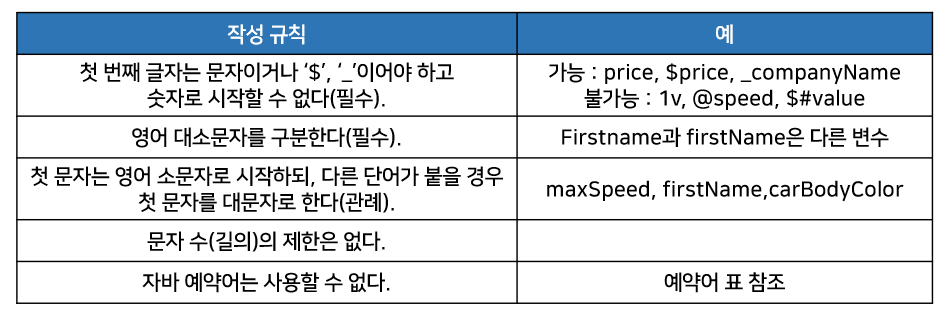

- 자바는 <b>예약어</b>를 가지고 있다.
  - 예약어들로 변수 이름을 지정하면 <u>컴파일 에러</u>가 발생

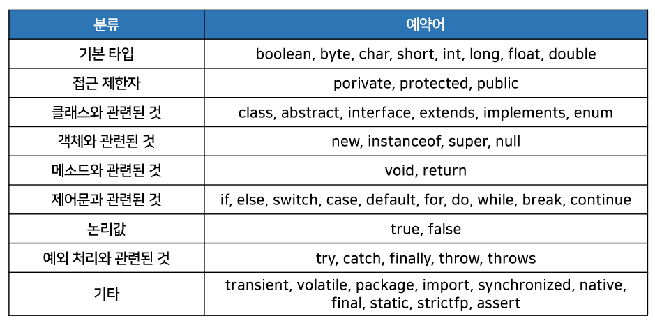

- 변수 이름을 보고 어떤 값을 저장하고 있는지 쉽게 알 수 있도록 의미 있는 변수 이름을 지어주는 것이 좋음
- 변수 이름의 길이는 프로그램 실행과는 무관하기 때문에 충분히 길어도 상관없음

- 변수 이름에 한글도 사용이 가능하지만 가능하면 한글을 포함하지 않는 것이 좋음

### 변수의 사용

- <b>변수를 사용한다</b>는 것은 <u>변수에 값을 저장하고 읽는 행위</u>

#### 변수값 저장

- 변수에 값을 저장할 때는 대입 연산자(=)를 사용
  - 일반 수학에서 = 은 ''같다'' 라는 의미지만, 자바에서는 우측의 값을 좌측 변수에 저장한다는 의미

- 변수를 선언하고 처음 값을 저장할 경우, 이러한 값을 <b>초기값</b>이라 함
- 변수에 초기값을 주는 행위를 <b>변수의 초기화</b>라고 함

```java
// 변수를 선언하고, 초기값 90을 저장하는 예시
int score;		// 변수 선언
score = 90;		// 값 저장
```

```java
// 초기값은 변수를 선언함과 동시에 줄 수도 있다.
int score = 90;
```

- 변수의 초기값은 코드에서 직접 입력하는 경우가 많음
  - 소스 코드 내에서 직접 입력된 값을 <b>리터럴(literal)</b>이라고 부름
  - 리터럴은 값의 종류에 따라 정수 리터럴, 실수 리터럴, 문자 리터럴, 논리 리터럴로 구분
    - 이 리터럴들은 정해진 표기법대로 작성되어야 한다.

- 리터럴은 상수(constant)와 같은 의미지만, 프로그램에서는 상수를 "값을 한 번 저장하면 변경할 수 없는 변수"로 정의하기 때문에 이와 구분하기 위해 "리터럴" 이라는 용어를 사용

##### 정수 리터럴

```java
// 소수점이 없는 정수 리터럴은 10진수로 간주
0, 75, -100
```

```java
// 0으로 시작되는 리터럴은 8진수로 간주
02, -04
```

```java
// 0x 또는 0X로 시작하고 0~9숫자나 A, B, C, D, E, F
// 또는 a, b, c, d, e, f로 구성된 리터럴은 16진수로 간주
0x5, 0xA, 0xB3, 0xAC08
```

- 정수 리터럴을 저장할 수 있는 타입 5개
  - byte
  - char
  - short
  - int
  - long

##### 실수 리터럴

```java
// 소수점이 있는 리터럴은 10진수 실수로 간주
0.25, -3.14
```

```java
// 대문자 E 또는 소문자 e가 있는 리터럴은 10진수 지수와 가수로 간주
5E7		// 5 x 10^
0.12E-5	// 0.12 x 10^-5
```

- 실수 리터럴을 저장할 수 있는 타입
  - float
  - double

##### 문자 리터럴

```java
// 작은 따옴표(') 로 묶은 텍스트는 하나의 문자 리터럴로 간주
'A', '한', '\t', '\n'
```

- 역슬래쉬(\\)가 붙은 문자 리터럴은 <u>이스케이프(escape)</u> 문자라고도 함
  - 특수한 용도로 사용

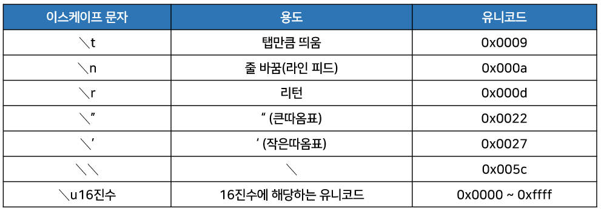

- 문자 리터럴을 저장할 수 있는 타입은 <u>char 하나뿐</u>

##### 문자열 리터럴

- 큰따옴표(")로 묶은 텍스트는 문자열 리터럴로 간주
  - 큰따옴표 안에는 텍스트가 없어도 문자열 리터럴로 간주
  - 문자열 리터럴 내부에서도 이스케이프 문자를 사용할 수 있음

```java
" 대한민국"
"탭 만큼 이동	\t 합니다."
"한줄 내려 쓰기 \n 합니다."
```

- 문자열 리터럴을 저장할 수 있는 타입은 <u>String 하나뿐</u>이다.

##### 논리 리터럴

```java
// true와 false는 논리 리터럴로 간주
true, false
```

- 논리 리터럴을 저장할 수 있는 타입은 <u>boolean 하나뿐</u>이다.

##### 변수값 읽기

- 변수는 <b>초기화</b>가 되어야 읽을 수가 있고, <u>초기화되지 않은 변수는 읽을 수가 없음</u>

```java
// 잘못된 코딩의 예
int value;					// 변수 value 선언 (초기화 안 됨)
int result = value + 10;	// 변수 value 값을 읽고 10을 더한 결과값을 변수 result에 저장
```

- 변수 value가 선언되었지만, 초기화가 되지 않았기 때문에 산술 연산식 value + 10에서 사용할 수 없음
  - 이런 경우 컴파일 에러가 발생하며 아래처럼 변경해야 함

```java
int value = 30;				// 변수 value가 30으로 초기화됨
int result = value + 10;	// 변수 value 값을 읽고 10을 더한 결과값(40)을 변수 result에 저장
```

```java
public class VariableExample {

    public static void main(String[] args) {
        // 10을 변수 value의 초기값으로 저장함
        int value = 30;
        
        // 변수 value 값을 읽고 10을 더하는 산술 연산을 수행
        // 연산의 결과값을 변수 reslut의 초기값으로 저장함
        int result = value + 10;
        
        // 변수 result 값을 읽고 콘솔에 출력
        System.out.println(result);
    }

}
```

#### 변수의 사용 범위

- 변수는 중괄호 {} 블록 내에서 선언되고 사용됨
  - 중괄호 블록을 사용하는 곳은 클래스, 생성자, 메소드

- 메소드 블록 내에서 선언된 변수를 <b>로컬 변수(local variable)</b>라고 함
  - 로컬 변수는 메소드 실행이 끝나면 <u>메모리에서 자동으로 없어짐</u>

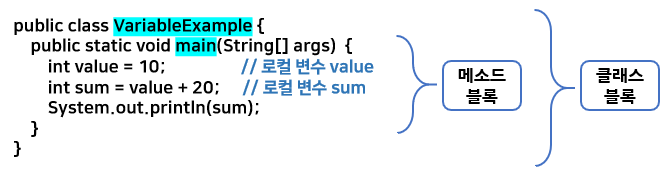

- 변수는 메소드 블록 내에 어디서든지 선언할 수 있음
  - 하지만 변수 사용은 제한이 따름
- 기본적으로 <u>변수는 선언된 블록 내에서만</u> 사용이 가능

- 메소드 블록 내에서도 여러가지 중괄호 블록들이 있을 수 있음
  - 조건문에 해당하는 if, 반복문에 해당하는 for, while 등이 중괄호를 가질 수 있음
    - 이러한 if, for, while 을 제어문이라고 함
    - <u>제어문 블록에서 선언된 변수는 해당 제어문 블록 내에서만</u> 사용이 가능
    - 블록 밖에서는 사용할 수 없음

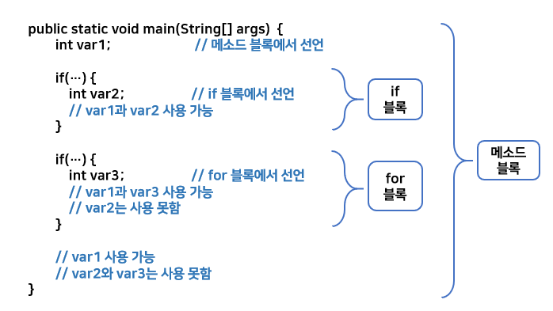

- 변수를 선언할 때는 변수가 어떤 범위에서 사용될 것인지를 생각하고 선언 위치를 결정해야 함
  - 메소드 블록에서 어떤 위치에서든 사용할 수 있도록 한다면 메소드 블록 첫머리에 선언하는 것이 좋음
  - 제어문 내에서 잠깐 사용되는 변수라면 제어문 내에서 선언하는 것이 좋음

```java
public class VariableScopeExample {
    
	public static void main(String[] args) {
		int v1 = 15;
		if(v1 > 10) {
			int v2 = v1 - 10;
		}
		int v3 = v1 + v2 + 5; // v2 변수 사용할 수 없어 컴파일에러
	}
    
}
```

- 위처럼 작성하면 if 블록 내부에 v2가 선언되어 컴파일에러
  - "v2 cannot be resolved to a variable" 라고 출력됨(변수 v2를 해석할 수 없다는 뜻)
  - 하지만 v1은 메소드 블록에서 선언되었기 때문에 main() 메소드 내부 어디에서든 사용 가능

## 데이터 타입

- 모든 변수에는 <b>타입(type)</b>이 있음
  - 타입에 따라 저장할 수 있는 값의 종류와 범위가 달라짐
  - 변수를 선언할 때 주어진 타입은 사용하는 도중에 변경할 수 없음
  - 따라서 변수를 선언할 때 어떤 타입을 사용할지 충분히 고려해야 함

### 기본(원시: primitive) 타입

- <b>기본(원시) 타입</b>이란 정수, 실수, 문자,논리 리터럴을 직접 저장하는 타입
- 정수 타입
  - byte
  - char
  - short
  - int
  - long
- 실수 타입
  - flaot
  - double
- 논리 타입
  - boolean

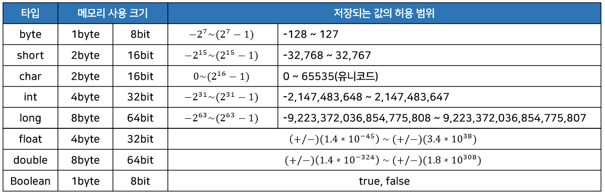

- 메모리에는 0과 1을 저장하는 최소 기억 단위인 비트(bit)가 있음
  - 그리고 8개의 비트를 묶어서 바이트(byte)라고 함
  - 기본 타입은 정해진 메모리 크기(바이트 크기)로 값을 저장
  - 바이트 크기가 클수록 표현하는 값의 범위가 큼

### 정수 타입(byte, char, short, int, long)

- 정수 타입에는 모두 다섯 개의 타입이 있고, 저장할 수 있는 값의 범위가 서로 다름

| 정수 타입 | byte | char | short | int  | long |
| --------- | ---- | ---- | ----- | ---- | ---- |
| 바이트 수 | 1    | 2    | 2     | 4    | 8    |

- 자바는 기본적으로 <u><b>정수 연산을 int 타입</b></u>으로 수행
  - 그러므로 저장하려는 값이 정수 리터럴이라면 특별한 이유가 없는 한 int 타입 변수에 저장하는 것이 좋음

- byte와 short가 int보다 메모리 사용 크기가 작아 메모리를 절약할 수는 있음
  - 하지만 값의 범위가 작은 편이라 연산 시에 범위를 초과하면 잘못된 결과를 얻기 쉬움

#### byte 타입

- byte 타입은 색상 정보 및 파일 또는 이미지 등의 이진(바이너리) 데이터를 처리할 때 주로 사용됨
  - byte 타입은 정수 타입 중에서 가장 작은 범위의 수를 저장
  - 표현할 수 있는 값의 범위는 -128~127
  - 양수가 하나가 적은이유는 0이 포함되기 때문
  - 만약 -128~127을 초과하는 값이 byte 타입 변수에 저장될 경우?
    -  컴파일 에러("Type mismatch: cannot convert from int to byte")가 발생

- 최상위 비트는 정수값의 부호를 결정
  - 최상위 비트가 0이면 양의 정수
  - 1이면 음의 정수
  - 실제 정수값은 나머지 7개의 bit로 결정

- 최상위 비트가 1인 음수의 경우
  - 나머지 7개의 bit를 모두 1의 보수(1은 0으로, 0은 1로)바꾸고 1을 더한값에 마이너스(-)를 붙여주면 십진수가 됨

- byte 타입보다 크기가 큰 short, int, long 타입도 전체 바이트 수만 다를 뿐 동일한 원리로 정수값을 표현

```java
public class ByteExample {
    
	public static void main(String[] args) {
		byte var1 = -128;
		byte var2 = -30;
		byte var3 = 0;
		byte var4 = 30;
		byte var5 = 127;
		byte var6 = 128; // 범위 벗어남. 컴파일 에러
		
		System.out.println(var1);
		System.out.println(var2);
		System.out.println(var3);
		System.out.println(var4);
		System.out.println(var5);
	}

}
```

- 코드에서 변수에 올바른 값을 저장하더라도 프로그램이 실행하는 도중에 변수의 값은 변경됨
  - 만약 실행 중에 저장할 수 있는 값의 범위를 초과한다면?
    - 최소값부터 다시 반복 저장됨.
    - byte일 경우 -128(최소값)부터 시작해서 127(최대값)을 넘으면 다시 -128부터 시작하게 됨

- short, int, long 역시 저장할 수 있는 값의 범위를 넘어서면 같은 방식으로 처리됨
  - 저장할 수 있는 값의 범위를 초과해서 값이 저장될 경우 엉터리 값이 변수에 저장
  - 이러한 값을 <b>쓰레기값</b>이라고 하며 <u>개발자는 쓰레기값이 생기지 않도록 주의해야 함</u>

```java
// 실행하면 byte 변수는 127을 넘어서는 순간 최소값인 -128부터 다시 저장되는 반면
// int 타입의 변수는 정상적으로 1 증가된 값을 계속 저장하게 된다.
public class GarbageValueExample {
    
	public static void main(String[] args) {
        byte var1 = 125;
        int var2 = 125;
        for (int i = 0; i < 5; i++) {
            var1++;
            var2++;
            System.out.println("var1: " + var1 + "\t" + "var2: " + var2);
        }
    }
    
}
```

#### char 타입

- 자바는 <u>모든 문자를</u> <b>유니코드(Unicode)</b>로 처리
  - 유니코드는 세계 각국의 문자들을 코드값으로 매핑한 국제 표준 규약
  - 유니코드는 하나의 문자에 대해 하나의 코드값을 부여
  - 그러므로 영문'A' 및 한글 '가'도 하나의 코드값을 가짐

- 유니코드는 0~65535 범위의 2byte 크기를 가진 정수값
  - 0~127까지는 아스키(ASCII) 문자(특수기호 및 영어 알파벳)가 할당
  - 44032~55203 까지는 한글 11172자가 할당
  - 유니코드에 대한 자세한 정보는 [유니코드 홈페이지](http://www.unicode.org)에서 찾을 수 있음

- 자바는 하나의 유니코드를 저장하기 위해 2byte 크기인 char 타입을 제공
  - 유니코드는 음수가 없기 때문에 char 타입의 변수에는 음수 값을 저장할 수 없음
  - char타입에 저장할 수 있는 값은 0~65535까지 2<sup>16</sup>개
  - char 타입 변수에 작은 따옴표(')로 감싼 문자를 대입하면 해당 문자의 유니코드가 저장

```java
// 'A', 'B', '가', '각' 문자를 char 변수에 저장할 경우 변수에 저장되는 유니코드값

char var1 = 'A';	// 유니코드:0x0041	2진수: 00000000 01000001
char var2 = 'B';	// 유니코드:0x0042	2진수: 00000000 01000010
char var3 = '가';   // 유니코드:0xAC00  2진수: 10101100 00000000
char var3 = '각';   // 유니코드:0xAC01  2진수: 10101100 00000001
```

- char 변수에 작은 따옴표(')로 감싼 문자가 아니라 직접 유니코드 정수값을 저장할 수 있음
  - 특정 문자의 유니코드를 안다면 10진수 또는 16진수로 저장하면 됨
  - 예를 들어 문자 A는 10진수로 65이고, 16진수로 0x41이므로 아래와 같이 char 변수에 저장할 수 있음
  - 16진수로 저장할 경우에는 유니코드라는 의미에서 '\u + 16진수값' 형태로 값을 저장

```java
char c = 65;
char c = '\u0041';
```

- 프로그램 코드에서 char 변수에 저장된 유니코드를 알고 싶다면?
  - char 타입 변수를 int 타입 변수에 저장

```java
char c = 'A';
int uniCode = c;
```

```java
public class CharExample {
    
	public static void main(String[] args) {
        char c1 = 'A';		// 문자를 직접 저장
        char c2 = '65';		// 10진수로 저장
        char c3 = '\u0041';	// 16진수로 저장
        
        char c4 = '가';		// 문자를 직접 저장
        char c5 = '44032';	// 10진수로 저장
        char c6 = '\uac00';	// 16진수로 저장
        
        int uniCode = c1;	// 유니코드 얻기
        
        System.out.println(c1);
        System.out.println(c2);
        System.out.println(c3);
        System.out.println(c4);
        System.out.println(c5);
        System.out.println(c6);
        System.out.println(uniCode);
    }
    
}
```

- char 타입 변수는 <b>단 하나의 문자만</b> 저장
  - 만약 문자열을 저장하고 싶다면?
    - String 타입을 사용해야 한다.
    - 아래처럼 String 변수를 선언하고, 큰 따옴표(")로 감싼 문자열 리터럴을 대입하면 됨

```java
String name = "홍길동";
```

- String은 기본 타입이 아니다.
  - String은 <b>클래스 타입</b>이며 String 변수는 <b>참조 변수</b>임
  - 문자열을 String 변수에 대입하면 문자열이 변수에 직접 저장되는 것이 아님
    - String 객체가 생성되고, String 변수는 String 객체의 번지를 참조하게 됨

- char 타입의 변수에 어떤 문자를 대입하지 않고 단순히 초기화를 할 목적으로 작은 따옴표(') 두 개를 연달아 붙인 빈(empty) 문자를 대입하면 컴파일 에러가 발생
  - 그렇기 때문에 공백(유니코드: 32) 하나를 포함해서 초기화해야 함

```java
char c = '';	// 컴파일 에러. char c = ' '; 로 변경해야 함
```

- 하지만 String 변수는 큰 따옴표(") 두 개를 연달아 붙인 빈 문자를 대입해도 괜찮음

```java
String str = "";
```

#### short 타입

- short 타입은 2byte(16bit)로 표현되는 정수값을 저장할 수 있는 데이터 타입
  - 저장할 수 있는 값의 범위는 ~32,768 ~ 32,767
  - c언어와의 호환을 위해 사용되며 비교적 자바에서는 잘 사용되지 않는 타입

#### int 타입

- int 타입은 4byte(32bit)로 표현되는 정수값을 저장할 수 있는 데이터 타입
  - 저장할 수 있는 값의 범위는 -2,147,483,648 ~ 2,147,473,647(-2<sup>15</sup>~(2<sup>15</sup>-1))

- <u>int 타입은 자바에서 <b>정수 연산을 하기 위한 기본 타입</b>이다.</u>
  - byte 타입 또는 short 타입의 변수를 + 연산하면 int 타입으로 변환된 후 연산
  - 연산의 결과도 int 타입이 됨
    - 자바에서 <u>정수 연산을 4byte로 처리</u>하기 때문
  - 따라서 byte 타입이나 short 타입을 변수를 선언한 것과 int 타입으로 변수를 선언한 것의 성능 차이는 거의 없음

- 정수값을 직접 코드에서 입력할 경우 8진수, 10진수, 16진수로 표현할 수 있음
  - 8진수일 경우 숫자 앞에 '0'을 붙임
  - 16진수는 '0x'를 붙임

```java
// 10진수 10을 각각 8진수와 16진수로 표현하여 변수에 저장한 것
int number = 10;
int octNumber = 012;
int hexNumber = 0xA;
```

- 변수에 어떤 진수로 입력을 하더라도 동일한 값이 2진수로 변환되어 저장
- 10이 int 타입 변수에 저장되면?
  - int는 4byte의 크기를 가지기 때문에 4바이트의 공간을 차지하면서 총 32bit로 10을 표현↓

```
00000000 00000000 00000000 00001010
```

- 10은 1byte로 충분하기 때문에 나머지 상위 3byte의 bit값은 모두 0

```java
public class IntExample {
    
	public static void main(String[] args) {
        int var1 = 10;	// 10진수로 저장
        int var2 = 012;	// 8진수로 저장
        int var3 = 0xA;	// 16진수로 저장
        
        System.out.println(var1);
        System.out.println(var2);
        System.out.println(var3);
    }
    
} // 모두 10이 출력된다.
```

#### long 타입

- long 타입은 8byte(64bit) 표현되는 정수값을 저장할 수 있는 데이터 타입
  - 저장할 수 있는 값의 범위는 (-2<sup>63</sup>~(2<sup>63</sup>-1))
  - 수치가 큰 데이터를 다루는 프로그램에서는 long 타입이 필수적으로 사용
  - ex) 은행 및 우주와 관련된 프로그램들

- long 타입의 변수를 초기화할 때에는 정수값 뒤에 <u>소문자 'l'이나 대문자 'L'</u>을 붙일 수 있음
  - 4byte 정수 데이터가 아니라 8byte 정수 데이터인것을 컴파일러에게 알려주기 위해
  - <u>int 타입의 <b>저장 범위를 넘어서는 큰 정수</b>는 반드시 붙여줘야하며 그렇지 않으면 에러가 남</u>
  - 일반적으로 소문자 'l'은 숫자 '1'과 비슷해서 혼돈하기 쉬우므로 대문자 'L'을 사용

```java
public class LongExample {
    
	public static void main(String[] args) {
		long var1 = 10;		
		long var2 = 20L;		
		//long var3 = 1000000000000;     // 컴파일 에러.
		long var4 = 1000000000000L;
		
		System.out.println(var1);
		System.out.println(var2);
		System.out.println(var4);
	} 
    
}
```

### 실수 타입(float, double)

- 실수 타입은 소수점이 있는 실수 데이터를 저장할 수 있는 타입
  - 메모리 사용 크기에 따라 float과 double이 있음

- float과 double의 메모리 사용 크기는 각각 int와 long의 크기와 같다.
  - 하지만 정수 타입과는 다른 저장방식 때문에 정수 타입보다 훨씬 더 큰 범위의 값을 저장할 수 있음
- 실수는 정수와 달리 <b>부동 소수점(floating-point)</b> 방식으로 저장됨
  - 부동 소수점 방식은 실수를 아래와 같은 형태로 표현한 것

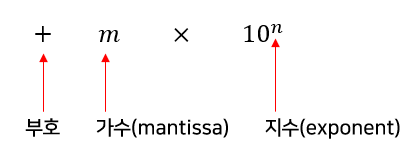

- 가수 m은 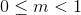범위의 실수여야 함
  - 만약 실수 1.2345는 부동 소수점 방식으로 표현하면 0.12345 x 10<sup>1</sup>이며
  - 가수는 0.12345이고 지수는 1

- float 타입과 double 타입은 가수와 지수를 저장하기 위해 전체 bit를 나누어 사용
- 아래 그림은 float과 double 타입이 전체 bit를 어떻게 사용하는지 나타낸 그림

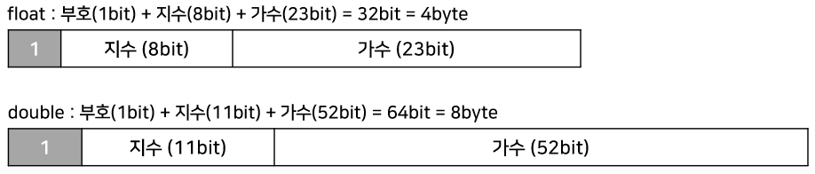

- 위의 그림에서 가수를 표현하는데 있어 float에 비해 double이 약 두배의 자릿수가 배정되어 있음
  - 따라서 float보다 double이 <u>더 정밀한 값</u>을 저장할 수 있다.
    - 높은 정밀도를 요구하는 계산에서는 double을 사용해야 함
- 자바는 실수 리터럴의 기본 타입을 double로 간주함
  - 즉 실수 리터럴을 float 타입 변수에 그냥 저장할 수 없다는 뜻
  - 실수 리터럴을 float 타입 변수에 저장하려면 리터럴 뒤에 <u>소문자 'f'나 대문자 'F'</u>를 붙여야 함

```java
double var1 = 3.14;
float var2 = 3.14;		// 컴파일 에러(Type mismatch: cannot convert from double to float)
float var2 = 3.14F;
```

- 만약 정수 리터럴에 10의 지수를 나타내는 E 또는 e를 포함하고 있다면?
  - 정수 타입 변수에 저장할 수 없고 실수 타입 변수에 저장해야 함

```java
// 정수값 3000000(3백만)을 저장하는 방법
int var6 = 3000000;		// 3000000
double var7 = 3e6;		// 3000000
float var7 = 3e6f;		// 3000000
double var9 = 2e-3;		// 0.002
```

```java
public class FloatDoubleExample {
    
	public static void main(String[] args) {
		// 실수값 저장
		//float var1 = 3.14;	// 컴파일 에러(Type mismatch)
		float var2 = 3.14f;
		double var3 = 3.14;		
		
		// 정밀도 테스트
		float var4 = 0.1234567890123456789f;
		double var5 = 0.1234567890123456789;
		
		System.out.println("var2: " + var2);	// 3.14
		System.out.println("var3: " + var3);	// 3.14
		System.out.println("var4: " + var4);	// 0.12345679
		System.out.println("var5: " + var5);	// 0.12345678901234568
		
		// e 사용하기
        int var6 = 3000000;
		double var7 = 3e6;
		float var8 = 3e6F;
		double var9 = 2e-3;
		System.out.println("var6: " + var6);	// 3000000
		System.out.println("var7: " + var7);	// 3000000.0
		System.out.println("var8: " + var8);	// 3000000.0
		System.out.println("var9: " + var9);	// 0.002
	} 
    
} 
```

- double타입인 var5가 float타입인 var4보다 두 배 이상 정밀하게 값이 저장되어 있는 것을 볼 수 있음
  - 이것은 double 타입의 가수 bit수가 float타입의 가수 bit 수보다 약 두 배 정도 크기 때문

### 논리 타입(boolean)

- boolean 타입은 1byte(8bit)로 표현되는 논리값(true/false)을 저장할 수 있는 데이터 타입이다.
  - boolean 타입은 두 가지 상태값을 저장할 필요성이 있을 경우에 사용됨
  - <u>상태값에 따라 조건문과 제어문의 실행 흐름을 변경</u>하는데 주로 이용됨

```java
public class BooleanExample {
    
	public static void main(String[] args) {
		boolean stop = true;
		if(stop) {	// stop 변수에 true가 저장되어 있다.
			System.out.println("중지합니다.");
		} else {	// 만약 stop 변수에 false가 저장되어 있다면 else블록 실행
			System.out.println("시작합니다.");
		}
	} 
    
}
```

## 타입 변환

- 타입 변환이란 데이터 타입을 <u>다른 데이터 타입</u>으로 <b>변환</b>하는 것
  - 예를 들어 byte 타입을 int 타입으로 변환하거나 반대로 int 타입을 byte 타입으로 변환하는 행위
- 타입 변환에는 두 가지 종류가 있음
  - 하나는 자동(묵시적) 타입 변환
  - 다른 하나는 강제(명시적) 타입 변환

### 자동 타입 변환

- <b>자동 타입 변환(Promotion)</b>은 프로그램 실행 도중에 <u>자동적으로 타입 변환</u>이 일어나는 것
  - 자동 타입 변환은 작은 크기를 가지는 타입이 큰 크기를 가지는 타입에 저장될 때 발생

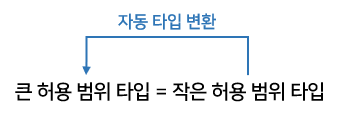

- 큰 크기 타입과 작은 크기 타입의 구분은 <u>사용하는 메모리 크기</u>
  - 예를 들어 byte 타입은 1byte 크기를 가지고, int 타입은 4byte 크기를 가지므로 int 타입이 큰 크기 타입
  - byte 타입이 작은 크기 타입

```java
// 크기별 타입
byte(1) < short(2) < int(4) < long(8) < float(4) < double(8)
```

- float은 4byte 크기인데 int(4byte)와 long(8byte)보다 더 큰 타입으로 표시되어있음
  - 그 이유는 표현할 수 있는 값의 범위가 float이 더 크기 때문

```java
byte byteValue = 10;
int intValue = byteValue;	// 자동 타입 변환이 일어난다.
```

- byteValue는 byte 타입 변수이므로 1byte의 크기를 가짐
- intValue는 int 타입 변수이므로 4byte 크기를 가짐

- 따라서 byte 타입 byteValue는 int 타입 intValue로 자동 타입 변환됨
  - 메모리에서 값이 복사되는것을 그림으로 표현하면 아래와 같음

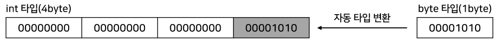

- 자동 타입 변환이 발생되면 변환 이전의 값과 변환 이후의 값은 동일
  - 즉, 변환 이전의 값은 변환 이후에도 손실 없이 그대로 보존됨
  - 작은 그릇의 물을 큰 그릇으로 옮기더라도 물의 양은 변하지 않는다는 것과 유사

- 정수  타입이 실수 타입으로 변환하는 것은 무조건 자동 타입 변환
  - 실수 타입으로 변환된 이후의 값은 정수값이 아닌 .0이 붙은 실수값이 됨

```java
int intValue = 200;
double doubleValue = intValue;	// 200.0
```

- char 타입의 경우 int 타입으로 자동 변환되면 유니코드 값이 int 타입에 저장됨

```java
char charValue = 'A';
int intValue = charValue;		// 65
```

- 자동 타입 변환에서 <u>단 하나의 예외</u>가 있다.
  - char는 2byte의 크기를 가지지만, char의 범위는 0~65535이므로 음수가 저장될 수 없음
  - 따라서 <u>음수가 저장될 수 있는 byte 타입을 char 타입으로 자동 변환시킬 수 없음</u>

```java
byte byteValue = 65;
char charValue = byteValue;			// x. 컴파일에러
char charData = (char) byteValue;	// o. 강제 타입 변환
```

```java
public class PromotionExample {
    
	public static void main(String[] args) {
		byte byteValue = 10;
		int intValue = byteValue;		// int ← byte
		System.out.println(intValue);	// 10

		char charValue = 'A';
		intValue = charValue;			// int ← char
		System.out.println(intValue);	// A
		
		intValue = 100;
		long floatValue = longValue;	// long ← int
		System.out.println(longValue);	// 100
		
		intValue = 200;
		double doubleValue = intValue;	// double ← int
		System.out.println(doubleValue);// 200.0
	} 
    
}
```

### 강제 타입 변환

- 큰 크기의 타입은 작은 타입으로 자동 타입 변환될 수 없음
  - 예를 들어 4byte인 int 타입을 1byte인 byte 타입에 담을 수 없음
  - 마치 큰 그릇의 물을 작은 그릇 안에 모두 넣을 수 없는것과 동일한 이치

- 하지만 큰 그릇을 작은 그릇 사이즈로 쪼개어서 한 조각만 작은 그릇에 넣는다면 가능
  - 즉, int 타입을 4개의 byte로 쪼갠 다음, 끝에 있는 1byte만 byte 타입 변수에 저장하는 것은 가능

- 이처럼 강제적으로 큰 데이터 타입을 작은 데이터 타입으로 쪼개어서 저장하는 것을 <b>강제 타입 변환(캐스팅: Casting)</b> 이라고 함
  - 강제 타입 변환은 캐스팅 연산자()를 사용하는데, 괄호 안에 들어가는 타입은 쪼개는 단위


- 아래의 코드를 보면 int 타입 intValue 변수는 4byte 이므로 1byte 크기를 가지는 byte 타입 byteValue 변수에 저장할 수 없음
  - 그래서 강제적으로 (byte) 캐스팅 연산자를 사용해서 int 타입 intValue를 1byte씩 쪼개고, 끝에 있는 1byte만 byteValue 변수에 저장

```java
int intValue = 103029770;
byte byteValue = (byte) intValue;	// 강제 타입 변환(캐스팅)
```

- 메모리에서 값이 복사되는 모양을 그림으로 표현한 그림

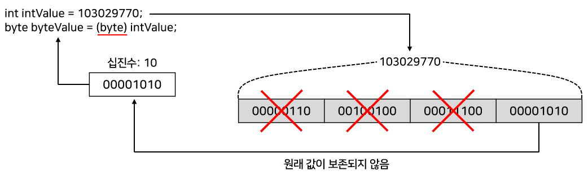

- 끝 1byte만 byte 타입 변수에 담게 되므로 <u>원래 int값은 보존되지 않음</u>
- 하지만 int값이 끝 1byte로만 표현이 가능하다면 byte 타입으로 변환해도 같은 값이 유지될 수 있음
  - 이럴 경우는 강제 타입 변환의 의미가 있음
  - 예를 들어 int 타입 변수에 10을 저장할 경우, 4byte 중 끝 1byte로 10을 충분히 표현할 수 있으며 앞 3byte는 모두 0으로 채워짐
  - 이것을 byte 타입으로 강제 타입 변환할 경우 앞의 3byte는 버려지고 끝 1byte만 byte 타입 변수에 저장되기 때문에 10이 그대로 유지됨

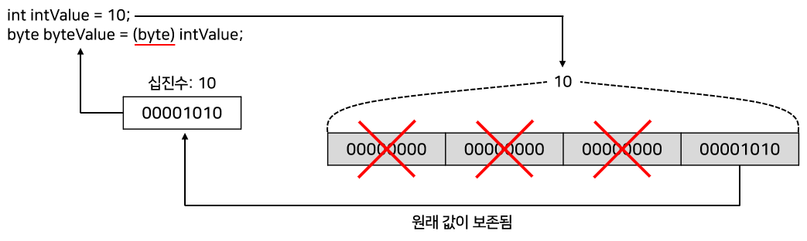

- 다른 예로 long 타입 변수에 300이 저장되어 있을 경우, 8byte 중의 끝 4byte로 300을 충분히 표현할 수 있음
  - 이것을 int 타입으로 강제 타입 변환하면 앞의 4byte는 버려지고 끝의 4byte만 int 타입 변수에 저장되어 300이 그대로 유지

```java
long longValue = 300;
int intValue = (int) longValue;	// intValue는 300이 그대로 저장됨
```

- int 타입은 char 타입으로 자동 변환되지 않기 때문에 강제 타입 변환을 사용해야 함
  - int 타입에 저장된 값이 유니코드 범위(0~65535)라면 아래처럼 (char) 캐스팅 연산자를 사용해서 char 타입으로 변환할 수 있음
  - char 타입으로 변환된 값을 출력하면 유니코드에 해당하는 문자가 출력됨

```java
int intValue = 'A';
char charValue = (char) intValue;
System.out.println(charValue);
```

- 실수 타입(float, double)은 정수 타입(byte, short, int, long)으로 자동 변환되지 않음
  - 그렇기 때문에 강제 타입 변환을 사용해야 함
  - 이 경우 소수점 이하 부분은 버려지고, 정수 부분만 저장됨

```java
double doubleValue = 3.14;
int intValue = (int) doubleValue;	// intValue는 정수 부분인 3만 저장됨
```

```java
public class CastingExample {
    
	public static void main(String[] args) {	
		int intValue = 44032;
		char charValue = (char) intValue;
		System.out.println(charValue);	// 가
		
		long longValue = 500;
		intValue = (int) longValue;
		System.out.println(intValue);	// 500
		
		double doubleValue = 3.14;
		intValue = (int) doubleValue;
		System.out.println(intValue);	// 3
	} 
    
}
```

- 강제 타입 변환에서 <u>주의할 점</u>
  - 사용자로부터 입력받은 값을 변환할 때 <b>값의 손실</b>이 발생하면 안됨
  - 강제 타입 변환을 하기 전에 우선 안전하게 값이 보존될 수 있는지 검사하는 것이 좋음

```java
/* byte 타입으로 변환하기 전에 변환될 값이 byte 타입으로 변환된 후에도 값의 손실이 발생하지 않는지 검사해서 올바른 타입 변환이 되도록 한다. */
public class CheckValueBeforeCasting {

    public static void main(String[] args) {
        int i = 128;

        if ((i < Byte.MIN_VALUE) || (i > Byte.MAX_VALUE)) { // (i<-128)||(i>127))과 동일
            System.out.println("byte 타입으로 변환할 수 없습니다.");
            System.out.println("값을 다시 확인해 주세요.");
        } else {
            byte b = (byte) i;
            System.out.println(b);
        }
    }

}
```

- 자바는 코드에서 데이터 값을 검사하기 위해 boolean과 char 타입을 제외하고 모든 기본 타입에 대해 최대값(max)과 최솟값(min)을 상수로 제공함
- 어떤 정수값과 실수값을 다른 타입으로 변환하고자 할 때는 변환될 타입의 최솟값과 최대값을 벗어나는지 반드시 검사하고, 만약 벗어난다면 타입 변환을 하지 말아야 함
- 강제 타입 변환에서 <u>또 다른 주의할 점</u>
  - 정수 타입을 실수 타입으로 변환할 때 <b>정밀도 손실</b>을 피해야함
  - 아래의 예제를 보면 int 타입 변수 num1과 num2에 동일한 123456780 값을 저장시키고, num2를 float 타입으로 변환시킨 후, 다시 int 타입으로 변환해서 num에 저장시킴
  - 그리고 num1에서 num2를 뺀 결과를 변수 result에 저장하고 콘솔에 출력
  - 결국 동일한 값을 뺏기 때문에 0이 출력되는것이 예상

```java
public class FromIntToFloat {

    public static void main(String[] args) {
        int num1 = 123456780;
        int num2 = 123456780;
        
        float num3 = num2;
        num2 = (int) num3;
        
        int result = num1 - num2;
        System.out.println(result);	// -4
    }
    
}
```

- 그러나 실행 결과를 보면 0이 나오지 않음
  - 이유는 int 값을 float 타입으로 자동 변환하면서 문제가 발생
  - float 타입은 아래와 같이 비트 수가 할당되어 있음

```
float: 부호(1비트) + 지수(8비트) + 가수(23비트)
```

- <u>int 값을 손실 없이 float 타입으로 변환할 수 있으려면</u> <b>가수 23비트로 표현 가능한 값</b>이어야 함
  - <u>123456780은 23비트로 표현할 수 없기 때문에 근사치로 변환</u>됨 즉, <b>정밀도 손실</b>이 발생함.  
    그렇기 때문에 float 값을 다시 int 타입으로 변환하면 원래의 int 값을 얻지 못함
  - 그러므로 `int result = num1 - num2;` 부분에서 num1과 num2는 동일한 값이 아님
  - 해결책은 모든 int 값을 실수 타입으로 안전하게 변환시키는 double 타입을 사용하는 것.  
    double 타입은 아래처럼 비트 수가 할당되어 있음

```
double : 부호(1비트) + 지수(11비트) + 가수(52비트)
```

- int의 크기는 32비트이므로 double의 가수 52비트보다는 작기 때문에 어떠한 int 값이라도 안전하게 정밀도 손실 없이 double 타입으로 변환될 수 있음
  - 그러므로 double 값을 원래 int 타입으로 변환해도 손실 없이 복원됨

```java
// 이전 예제를 수정하고 다시 실행하면 0이 나온다.
public class FromIntToFloat {

    public static void main(String[] args) {
        int num1 = 123456780;
        int num2 = 123456780;
        
        double num3 = num2;			// ◀수정
        num2 = (int) num3;
        
        int result = num1 - num2;
        System.out.println(result);	// 0
    }
    
}
```

### 연산식에서의 자동 타입 변환

- 연산은 기본적으로 <u>같은 타입의 피연산자(operand) 간에만</u> 수행되기 때문에 서로 다른 타입의 피연산자가있을 경우 <u>두 피연산자중 크기가 큰 타입으로 자동 변환</u>된 후 연산을수행
  - 예를 들어 int 타입 피연산자와 double 타입 피연산자를 덧셈 연산하면?
    - 먼저 int 타입 피연산자가 double 타입으로 자동 변환되고 연산을 수행
    - 그리고 연산의 결과는 double

```java
int intValue = 10;
double doubleValue = 5.5;
double result = intValue + doubleValue;	// result에 15.5가 저장됨
```

- 만약 int 타입으로 꼭 연산을 해야 한다면?
  - double 타입을 int 타입으로 강제 변환하고 덧셈 연산을 수행

```java
int intValue = 10;
double doubleValue = 5.5;
double result = intValue + (int)doubleValue;	// result에 15가 저장됨
```

- <u>자바는 <b>정수 연산일 경우 int 타입</b>을 기본</u>으로 함
  - 이유는 피연산자를 4byte 단위로 저장하기 때문임
  - 크기가 4byte보다 작은 타입(byte, char, short)은 4byte인 int 타입으로 변환된 후 연산이 수행
  - 따라서 연산의 결과도 int 타입

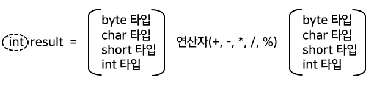

- 예를 들어 char 타입의 연산 결과는 int 타입으로 산출되므로 int 타입 변수에 결과를 저장해야 함
- 연산의 결과를 다시 문자로 출력하거나 저장하기 위해서는 int 결과값을 char 타입으로 강제 변환(casting) 해야 함

```java
char ai = 'A';
int result = ai + 1;		// 'A'의 유니코드보다 1이 큰 유니코드가 저장
char na = (char) result;	// 'B'가 저장됨
```

- 만약 피연산자 중 하나가  long 타입이라면 다른 피연산자도 long 타입으로 자동 타입 변환되고 연산의 결과도long 타입이 됨

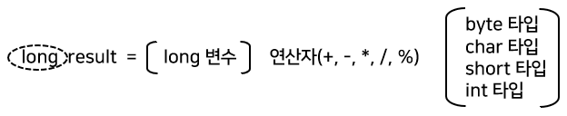

- float 타입과 float 타입을 연산하면 연산의 결과는 float 타입으로 나옴
  - 하지만 피연산자 중에 실수 리터럴이나 double 타입이 있다면 다른 피연산자도 double 타입으로 자동 타입 변환되어 연산되므로 결과는 double 타입으로 산출

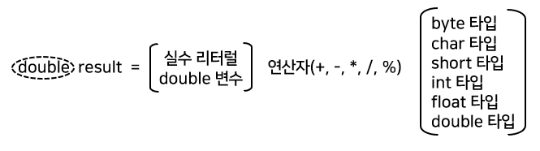

```java
public class OperationsPromotionExample {
    
	public static void main(String[] args) {	
		byte byteValue1 = 10;
		byte byteValue2 = 20;
		//byte byteValue3 = byteValue1 + byteValue2;   // 컴파일 에러
		int intValue1 = byteValue1 + byteValue2;	// ◀
		System.out.println(intValue1);			// 30
		
		char charValue1 = 'A';
		char charValue2 = 1;
		//char charValue3 = charValue1 + charValue2;   // 컴파일 에러
		int intValue2 = charValue1 + charValue2;	// ◀
		System.out.println("유니코드=" + intValue2);	// 66
		System.out.println("출력문자=" + (char)intValue2);	// B
		
		int intValue3 = 10;
		int intValue4 = intValue3/4;
		System.out.println(intValue4);
		
		int intValue5 = 10;
		//int intValue6 = 10 / 4.0;   // 컴파일 에러
		double doubleValue = intValue5 / 4.0;	// ◀
		System.out.println(doubleValue);	// 2.5
	} 
    
}
```