#  참조 타입

## 데이터 타입 분류

- 자바의 데이터 타입
  - 크게 <b>기본타입(원시 타입: primitive type)</b>과 <b>참조 타입(reference type)</b>으로 분류된다.
- <b>기본 타입</b>이란 <u>정수, 실수, 문자, 논리 리터럴을 저장하는 타입</u>을 말한다.
- <b>참조 타입</b>이란 <u>객체(Object)의 번지를 참조하는 타입</u>으로 <u>배열, 열거, 클래스, 인터페이스 타입</u>을 말한다.

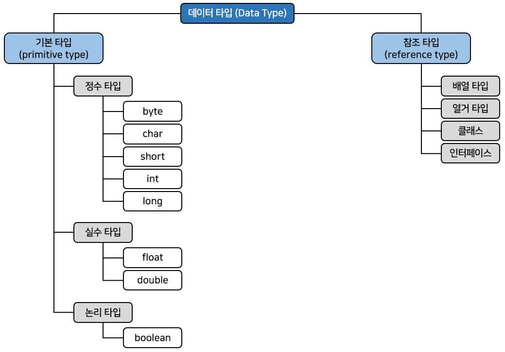

- 기본 타입으로 선언된 변수와 참조 타입으로 선언된 변수의 차이점?
  - 저장되는 값이 무엇이냐?
- 기본 타입을 이용해서 선언된 변수는 실제 값을 변수 안에 저장한다.
- 하지만 참조 타입인 배열, 열거, 클래스, 인터페이스를 이용해서 선언된 변수는 <u>메모리의 번지를 값으로</u> 갖는다.
  - 번지를 통해 객체를 참조한다는 뜻에서 <b>참조 타입</b>이라고 부른다.


- 예를 들어 int와 double로 선언된 변수 age와 price가 있고,  
  String 클래스로 선언된 name과 hobby가 아래처럼 선언되어 있다고 가정해보자.

```java
[기본 타입 변수]
int age = 25;
double price = 100.5;

[참조 타입 변수]
String name = "김자바";
String hobby = "자바";
```

- 메모리상에서 이 변수들이 갖는 값을 그림으로 표현하면 아래와 같다.

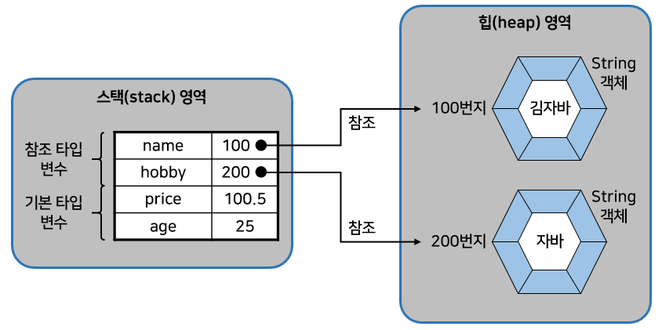

- int와 double 변수인 age와 price는 직접 값을 저장하고 있지만,  
  String 클래스 변수인 name과 hobby는 힙 영역의 String 객체 주소 값을 가지고 있다.
- 주소를 통해 객체를 참조한다는 뜻에서 <u>String 클래스 변수를</u> <b>참조 타입 변수</b>라고 한다.

## 메모리 사용 영역

- JVM이 사용하는 메모리 영역에 대해서 알아보자.
  - java.exe로 JVM이 시작되면 JVM은 운영체제에서 할당받은 메모리 영역(Runtime Data Area)을 아래 그림과 같이 구분해서 사용한다.

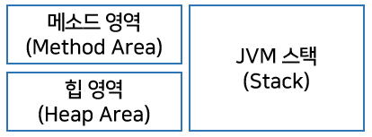

### 메소드(Method) 영역

- <b>메소드 영역</b>에는 코드에서 사용되는 클래스(~.class)들을 클래스 로더로 읽어 <u>클래스별</u>로
  - 런타임 상수풀(runtime constant pool)
  - 필드(field) 데이터
  - 메소드(method) 데이터
  - 메소드 코드
  - 생성자(constructor) 코드 등을 분류해서 저장한다.
- 메소드 영역은 JVM이 시작할 때 생성되고 모든 스레드가 공유하는 영역이다.

> 런타임 상수 풀 : 상수를 저장하여 참조하고 중복을 막는 역할을 한다.

### 힙(Heap) 영역

- <b>힙 영역</b>은 객체와 배열이 생성되는 영역이다.
  - 힙 영역에 생성된 객체와 배열은 JVM 스택 영역의 변수나 다른 객체의 필드에서 <b>참조</b>한다.
- <u>참조하는 변수나 필드가 없다면</u> 의미 없는 객체가 된다.
  - 그렇기 때문에 이것을 <u>쓰레기로 취급</u>하고 JVM은 <u>쓰레기 수집기(Garbage Collector)를 실행</u>시켜 쓰레기 객체를 힙 영역에서 <u>자동으로 제거</u>한다.
  - 그래서 개발자는 객체를 제거하기 위해 별도의 코드를 작성할 필요가 없다.
    - 자바는 코드로 객체를 직접 제거시키는 방법을 제공하지 않음

### JVM 스택(Stack) 영역

- <b>JVM 스택 영역</b>은 각 스레드마다 하나씩 존재하며 스레드가 시작될 때 할당된다.
  - 자바 프로그램에서 추가적으로 스레드를 생성하지 않았다면 main 스레드만 존재하므로 JVM 스택도 하나

> 스레드 : 프로세스 내에서 실행되는 흐름의 단위

- JVM 스택은 메소드를 호출할 때마다 프레임(Frame)을 추가(push)하고 메소드가종료되면 해당 프레임을 제거(pop)하는 동작을 수행한다.
- 프레임 내부에는 로컬 변수 스택이 있는데, 기본 타입 변수와 참조 타입 변수가 추가(push)되거나 제거(pop)된다.
  - 변수가 이 영역에 생성되는 시점은 초기화가 될 때, 즉 최초로 변수에 값이 저장될 때이다.
  - 변수는 선언된 블록 안에서만 스택에 존재하고 블록을 벗어나면 스택에서 제거된다.

```java
① char v1 = 'A';

② if (v1 == 'A') {
    int v2 = 100;
    double v3 = 3.14;
}

③ boolean v4 = true;
```

- 위의 코드에서, 선언된 변수는 실행 순서에 따라서 아래 그림과 같이 스택에 생성되고 소멸된다.
  - v2와 v3은 if 블록 내부가 실행되고 있을 때만 스택 영역에 존재한다.
  - 실행 흐름이 if 블록을 빠져나가면 소멸된다.

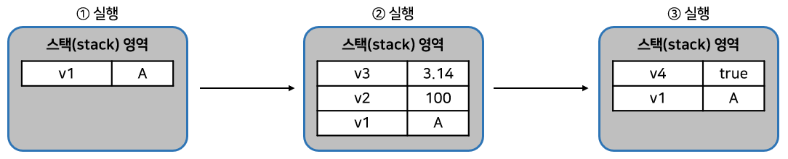

- 기본 타입 변수는 스택 영역에 직접 값을 가지고 있다.
- 하지만 <b>참조 타입 변수</b>는 값이 아니라 <u>힙 영역이나 메소드 영역의 객체 주소</u>를 가진다.
  - 아래처럼 배열 변수 scores는 스택 영역에 생성되지만 실제 10, 20, 30을 갖는 배열은 힙 영역에 생성된다.
  - 배열 변수 scores에는 배열의 힙 영역의 주소가 저장된다. 참고로 자바에서는 배열을 객체로 취급한다.

```java
int[] scores = {10, 20, 30};
```

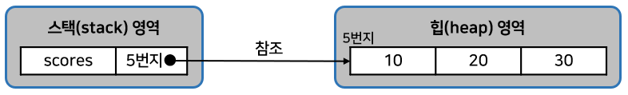

## 참조 변수의 ==, != 연산

- 기본 타입 변수의 ==, != 연산은 변수의 값이 같은지, 아닌지를 조사한다.
- 하지만 <b>참조 타입 변수</b>들 간의 ==, != 연산은 <u>동일한 객체를 참조하는지, 다른 객체를 참조하는지</u> 알아볼 때 사용된다.
  - 참조 타입 변수의 값은 힙 영역의 객체 주소이므로 결국 <u>주소 값을 비교</u>하는 것이 된다.
  - <u>동일한 주소 값</u>을 갖고 있다는 것은 <u>동일한 객체를 참조</u>한다는 의미이다.
  - 따라서 동일한 객체를 참조하고 있을 경우 == 연산의 결과는 true이고 != 연산의 결과는 false이다.

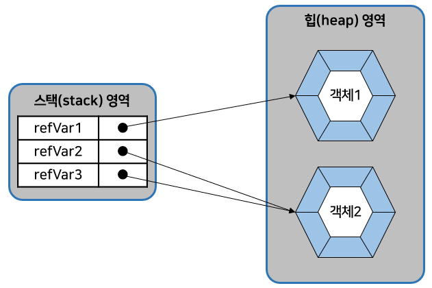

- 위의 그림에서 refVar1과 refVar2는 서로 다른 객체를 참조하고 있으므로 == 및 != 연산의 결과는 아래와 같다.

```java
refVar1 == refVar2	결과 : false
refvar1 != refVar2	결과 : true
```

- refVar2와 refVar2는 동일한 객체 2를 참조하고 있으므로 == 및 != 연산의 결과는 아래와 같다.

```java
refVar2 == refVar3	결과 : true
refVar2 != refVar3	결과 : false
```

- ==와 != 연산자로 객체를 비교하는 코드는 일반적으로 if문에서 많이 사용된다.
  - 아래는 변수 refVar2와 refVar3이 같은 객체를 참조할 경우 if블록을 실행하도록 하는 코드이다.

```java
if (refVar2 == refVar3) {...}
```

## null과 NullPointerException

- <b>참조 타입 변수</b>는 힙 영역의 <u>객체를 참조하지 않는다는 뜻</u>으로 <b>null(널)</b> 값을 가질 수 있다.
  - null 값도 초기값으로 사용할 수 있기 때문에 null로 초기화된 참조 변수는 스택 영역에 생성된다.

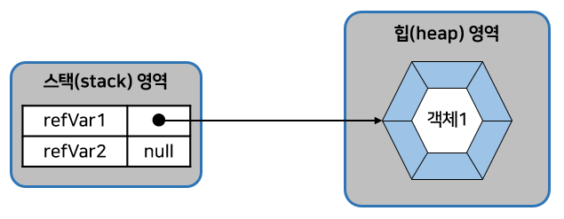

- 참조 타입 변수가 null 값을 가지는지 확인하려면 아래처럼 ==, != 연산을 수행하면 된다.
  - 위 그림에서 refVar1은 힙 영역의 객체를 참조하므로 연산의 결과는 다음과 같다.

```java
refVar1 == null	결과:false
refVar2 != null	결과:true
```

- refVar2는 null 값을 가지므로 연산의 결과는 아래와 같다.

```java
refVar2 == null	결과:true
refVar2 != null 결과:false
```

- 자바는 프로그램 실행 도중에 발생하는 오류를 예외(Exception)라고 부른다.
- 예외는 사용자의 잘못된 입력으로 발생할 수 있고, 프로그래머가 코드를 잘못 작성해서 발생할 수도 있다.
- 참조 변수를 사용하면서 가장 많이 발생하는 예외 중 하나로 <b>NullPointerException</b>이 있다.
  - 이 예외는 <u>참조 타입 변수를 잘못 사용</u>하면 발생한다.
- 참조 타입 변수가 null을 가지고 있을 경우, 참조 타입 변수는 사용할 수 없다.
  - 참조 타입 변수를 사용하는 것은 곧 객체를 사용하는 것을 의미하는데, <u>참조할 객체가 없기 때문</u>이다.
  - 그래서 프로그래머의 실수로 null 값을 가지고 있는 참조 타입 변수를 사용하면 NullPointerException이 발생한다.

```java
int[] intArray = null;
intArray[0] = 10;		// NullPointerException
```

- 위 코드에서 intArray는 배열 타입 변수이므로 <b>참조 타입 변수</b>이다.
  - 그래서 null로 초기화가 가능하다. 그런데 이 상태에서 intArray[0]에 10을 저장하려고 하면 NullPointerException이 발생한다.
  - 이유는 intArray 변수가 <b>참조</b>하는 <u>배열 객체가 없기 때문</u>이다.  
    다른 코드도 보자.

```java
String str = null;
System.out.println("총 문자수: " + str.length());	// NullPointerException
```

- String은 클래스 타입이므로 <b>참조 타입</b>이다.
  - 따라서 str 변수도 null로 초기화가 가능하다.
- 이 상태에서 String 객체의 length() 라는 메소드를 호출하면 NullPointerException이 발생한다.
  - 이유는 <u>str 변수가 참조하는 String 객체가 없기 때문</u>이다. 
- 프로그램 실행 도중 NullPointerException이 발생하면, 예외가 발생된 곳에서 객체를 참조하지 않은 상태로 참조 타입 변수를 사용하고 있음을 알아야 한다.
  - 대처 방법으로는, 이 변수를 추적해서 객체를 참조하도록 수정해야 한다.

## String 타입

- 자바는 문자열을 String 변수에 저장한다.
  - 그러므로 아래처럼 String 변수를 우선 선언해야 한다.

```java
String 변수;
```

- String 변수에 문자열을 저장하려면 큰 따옴표로 감싼 문자열 리터럴을 대입하면 된다.

```java
변수 = "문자열";
```

- 변수 선언과 동시에 문자열을 저장할 수도 있다.

```java
String 변수 = "문자열";
```

- 아래는 두 개의 String 변수를 선언하고 문자를 저장하는 코드이다.

```java
String name;
name = "김자바";
String hobby = "자바";
```

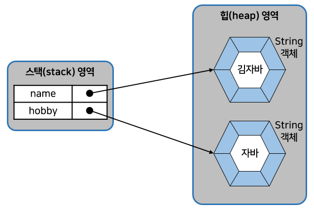

- <b>문자열은 String 객체로 생성</b>되고 <u>변수는 String 객체를 참조</u>한다.
  - 하지만 <u>일반적으로 String 변수에 저장</u>한다는 표현을 사용한다.
- 위 그림을 보면
  - name 변수와 hobby 변수는 스택 영역에 생성되고,
  - 문자열 리터럴인 "김자바"와 "자바"는 힙 영역에 String 객체로 생성된다.
  - 그리고 name 변수와 hobby 변수에는 String 객체의 주소 값이 저장된다.

- 자바는 <u>문자열 리터럴이 동일</u>하다면 <b>String 객체를 공유</b>하도록 되어 있다.
  - 예를 들어 밑에처럼 name1과 name2 변수가 동일한 문자열 리터럴인 "김자바"를 참조할 경우 name1과 name2는 동일한 String 객체를 참조한다.

```java
String name1 = "김자바";
String name2 = "김자바";
```

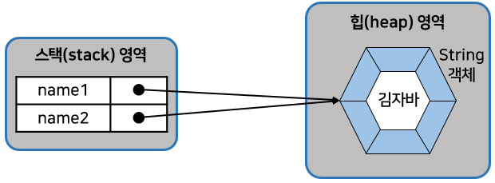

- 일반적으로 변수에 문자열을 저장할 경우에는 문자열 리터럴을 사용하지만, <b>new 연산자</b>를 사용해서 <u>직접 String 객체를 생성</u>시킬 수도 있다.
- <b>new 연산자</b>는 <u>힙 영역에 새로운 객체를 만들 때 사용하는 연산자</u>로 <b>객체 생성 연산자</b>라고 한다.

```java
String name1 = new String("김자바");
String name2 = new String("김자바");
```

- 위의 경우에 name1과 name2는 서로 다른 String 객체를 참조한다.

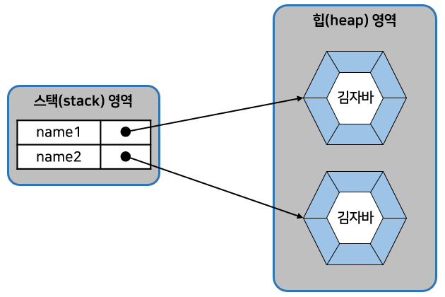

- 문자열 리터럴로 생성하느냐 new 연산자로 생성하느냐에 따라 비교 연산자의 결과가 달라질 수 있다.
  - 동일한 문자열 리터럴로 String 객체를 생성했을 경우 == 연산의 결과는 true가 나오지만,
  - new 연산자로 String 객체를 생성했을 경우 == 연산의 결과는 false가 나온다.
    - == 연산자는 변수에 저장된 객체 번지가 동일한지를 검사하기 때문이다.

```java
String name1 = "김객체";
String name2 = "김객체";
String name3 = new String("김객체");
```

- name1과 name2는 동일한 문자열 리터럴로 생성된 객체를 참조하기 때문에 name1 == name2 의 결과는 true가 나온다.
  - 그러나 name3은 new 연산자로 String 객체를 별도 생성했기 때문에 name1==name3은 false가 나온다.
- 동일한 String 객체이건 다른 String 객체이건 상관없이 <u>문자열만을 비교할 때에는 String 객체의 equals() 메소드를 사용해야 한다.</u>
  - `equals()`메소드는 원본 문자열과 매개값으로 주어진 비교 문자열이 동일한지 비교한 후 true 또는 false를 리턴한다.

```java
boolean result = str1.equals(str2);	// str1이 원본 문자열, str2가 비교 문자열
```

```java
public class StringEqualsExample {

    public static void main(String[] args) {
        String strVar1 = "김객체";
        String strVar2 = "김객체";

        if (strVar1 == strVar2) {
            System.out.println("strVar1과 strVar2는 참조가 같음");
        } else {
            System.out.println("strVar1과 strVar2는 참조가 다름");
        }

        if (strVar1.equals(strVar2)) {
            System.out.println("strVar1과 strVar2는 문자열이 같음");
        }

        String strVar3 = new String("김객체");
        String strVar4 = new String("김객체");

        if (strVar3 == strVar4) {
            System.out.println("strVar1과 strVar2는 참조가 같음");
        } else {
            System.out.println("strVar1과 strVar2는 참조가 다름");
        }

        if (strVar3.equals(strVar4)) {
            System.out.println("strVar3과 strVar4는 문자열이 같음");
        }
    }

}
//	strVar1과 strVar2는 참조가 같음
//	strVar1과 strVar2는 문자열이 같음
//	strVar1과 strVar2는 참조가 다름
//	strVar3과 strVar4는 문자열이 같음
```

- String 변수는 참조 타입이므로 초기값으로 null을 대입할 수 있다.
  - null은 String 변수가 참조하는 String 객체가 없다는 뜻이다.

```java
String hobby = null;
```

- 아래 코드처럼 hobby 변수가 String 객체를 참조하였으나, null을 대입함으로써 더 이상 String 객체를 참조하지 않도록 할 수도 있다.

```java
String hobby = "여행";
hobby = null;
```

- 그렇다면 참조를 잃은 String 객체는 어떻게 될까?
  - JVM은 <u>참조되지 않은 객체</u>를 <u>쓰레기 객체로 취급</u>하고 <u>쓰레기 수집기(Gabage Collector)를 구동시켜 메모리에서 자동 제거</u>한다.

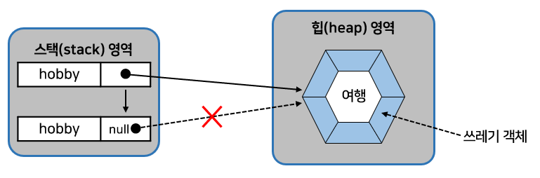

## 배열 타입

### 배열이란?

- 변수는 한 개의 데이터만 저장할 수 있다.
  - 따라서 저장해야 할 데이터의 수가 많아지면 그만큼 많은 변수가필요하다.
- 예를 들어 학생 30명의 성적을 저장하고, 평균값을 구한다고 가정하자.
  - 먼저 학생 30명의 성적을 저장하기 위해 변수 30개를 선언해야 한다.

```java
int score1 = 83;
int score2 = 90;
int score3 = 87;
...
int score30 = 75;
```

- 그리고 평점을 구하기 위해 변수들을 모두 더해야 한다.

```java
int sum = score1;
sum += score2;
sum += score3;
...
sum += score30;
int avg = sum  30;
```

- <u>같은 타입의 많은 양의 데이터</u>를 다루는 프로그램에서는 좀 더 효율적인 방법이 필요한데, 이것이 <b>배열</b>이다.
- <b>배열</b>은 <u>같은 타입의 데이터를 연속된 공간에 나열</u>시키고, <u>각 데이터에 인덱스(index)를 부여</u>해 놓은 자료구조이다. 
  - 예를 들어 학생들의 성적은 다음 그림과 같이 score 배열로 생성할 수 있다.

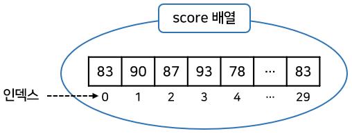


- score 배열의 각 인덱스는 각 항목의 데이터를 읽거나 저장하는데 사용되며 다음과 같이 배열이름 옆에 대괄호[]에 기입된다.

```java
score[인덱스]
```

- 예를 들어 score[0]은 83, score[1]은 90, score[2]는 87의 값을 가진다.
  - 이렇게 성적을 배열로 만들면 성적의 평균값은 배열의 인덱스를 이용해서 for문으로 쉽게 구할 수 있다.

```java
int sum = 0;
for (int i = 0; i < 30; i++) {
    sum += score[i];
}
int avg = sum / 30;
```

- for문이 30번 반복 실행하면서 i가 0~29까지 변한다.
  - 따라서 sum 변수에는 score[0]~score[29]까지 더해지고, 마지막으로 얻은 sum을 30으로 나누어 평균을 얻는다.
  - 학생 수가 30명이 아니라 수백 명이 되어도 for문의 i < 30만 변경하면 되므로 많은 양의 데이터를 적은 코드로 손쉽게 처리할 수 있다.
- 배열은 다음과 같은 특징을 가진다.
  - <b>배열은 같은 타입의 데이터만 저장할 수 있다.</b>
    - int 배열은 int 값만 저장 가능하고, String 배열은 문자열만 저장 가능하다.
    - <u>배열은 선언과 동시에 저장할 수 있는 데이터 타입이 결정</u>된다.
    - 그러므로 만약 다른 타입의 값을 저장하려고 하면 타입 <u>불일치(Type mismatch) 컴파일 오류</u>가 결정한다.
  - <b>한 번 생성된 배열은 길이를 늘리거나 줄일 수 없다.</b>
    - 3개의 값을 저장하는 배열을 생성했다고 가정하자.
    - 그러면 프로그램 실행 도중에 5개의 값을 저장하는 배열로 수정할 수 없고, 반대로 2개의 값만 저장하는 배열로 수정할 수도 없다.
    - 만약 5개의 값을 저장해야 하는 경우가 발생한다면, 길이 5의 <u>새로운 배열을 생성</u>하고, 기존 배열 항목을 새 배열로 <b>복사</b>해야 한다.

### 배열 선언

- 배열을 사용하기 위해서는 우선 배열 변수를 <b>선언</b>해야 한다.
- 배열 변수 선언은 다음과 같이 <u>두 가지 형태</u>로 작성할 수 있다.

```java
타입[] 변수;		|		타입 변수[];
```

- 대괄호 []는 배열 변수를 선언하는 기호로 사용된다.
  - <u>타입 뒤</u>에 붙을 수도 있고
  - <u>변수 뒤</u>에 붙을수도 있다.

- 타입은 배열에 저장될 데이터의 타입을 말한다.
  - 아래는 각 타입별로 배열을 선언하는 예이다.

```java
int[] intArray;				|		int intArray[];
double[] doubleArray;		|		double doubleArray[];
String[] strArray;			|		String strArray[];
```

- 배열 변수는 <b>참조 변수</b>에 속한다.
- 배열도 <b>객체</b>이므로 <u>힙 영역에 생성</u>되고 <u>배열 변수는 힙 영역의 배열 객체를 참조</u>하게 된다.
  - 참조할 객체가 없다면 배열 변수는 null 값으로 초기화될 수 있다.

```java
타입[] 변수 = null;
```

- 만약 배열 변수가 null 값을 가진 상태에서 변수[인덱스]로 값을 읽거나 저장하게 된다면?
  -  NullPointerException이 발생한다.
  - 배열 변수는 배열을 생성하고 <u>참조하는 상태</u>에서 <u>값을 저장하거나 읽어야</u> 한다.

### 값 목록으로 배열 생성

- 배열 항목에 저장될 값의 목록이 있다면, 다음과 같이 간단하게 배열 객체를 만들 수 있다.

```java
데이터타입[] 변수 = { 값0, 값1, 값2, 값3, ... };
```

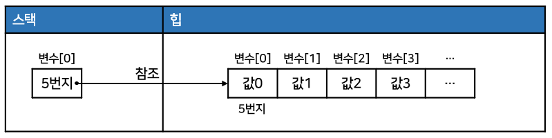

- 중괄호 {}는 주어진 값들을 항목으로 가지는 배열 객체를 힙에 생성하고, 배열 객체의 번지를 리턴한다.
- 배열 변수는 리턴된 번지를 저장함으로써 <b>참조</b>가 이루어진다.
  - 예를 들어 "김자바", "홍길동", "복숭아" 문자열을 갖는 배열은 아래처럼 생성할 수 있다.

```java
String[] names = { "김자바", "홍길동", "복숭아 "};
```

- 이렇게 생성된 배열에서 "김자바"는 names[0], "홍길동"은 names[1], "복숭아"는 names[2]로 읽을 수 있다.
- names[1]의 "홍길동"을 "홍삼원" 으로 바꾸고 싶다면 아래처럼 대입 연산자를 사용하면 된다.

```java
names[1] = "홍삼원";
```

```java
public class ArrayCreateByValueListExample1 {

    public static void main(String[] args) {
        int[] scores = {83, 90, 87};

        System.out.println("scores[0] : " + scores[0]);
        System.out.println("scores[1] : " + scores[1]);
        System.out.println("scores[2] : " + scores[2]);

        int sum = 0;
        for (int i = 0; i < 3; i++) {
            sum += scores[i];
        }
        System.out.println("총합 : " + sum);
        double avg = (double) sum / 3;
        System.out.println("평균 : " + avg);
    }

}
// scores[0] : 83
// scores[1] : 90
// scores[2] : 87
// 총합 : 260
// 평균 : 86.66666666666667
```

- 값의 목록으로 배열 객체를 생성할 때 <u>주의할 점</u>
  - <u>배열 변수를 이미 선언한 후</u>에 다른 실행문에서 <u>중괄호를 사용한 배열 생성은 허용되지 않는다.</u>

```java
타입[] 변수;
변수 = { 값0, 값1, 값2, 값3, ... };	// 컴파일 에러
```

- <u>배열 변수를 미리 선언한 후, 값 목록들이 나중에 결정되는 상황</u>이라면?
  - 아래와 같이 <b>new 연산자를 사용</b>해서 값 목록을 지정해주면 된다.
  - new 연산자 바로 뒤에는 배열 변수 선언에서 사용한 "타입[]"을 붙여주고 중괄호{}에는 값들을 나열해주면 된다.

```java
변수 = new 타입[] { 값0, 값1, 값2, 값3, ... };
```

- 예를 들어 배열 names를 아래처럼 생성할 수 있다.

```java
String[] names = null;
names = new String[] { "김자바", "홍길동", "복숭아" };
```

- 메소드의 매개값이 배열일 경우에도 마찬가지이다.
- 아래와 같이 <u>매개 변수로 int[] 배열이 선언된 add() 메소드가 있을 경우</u>, 값 목록으로 <u>배열을 생성함과 동시에 add() 메소드의 매개값으로 사용</u>하고자 할 때는 반드시 <b>new 연산자</b>를 사용해야 한다.

```java
int add(int[] scores) { ... }
----------------------------------
int result = add( {95, 85, 90} );	// 컴파일 에러
int result = add( new int[] {95, 85, 90} );
```

```java
public class ArrayCreateByValueListExample2 {

    public static void main(String[] args) {
        int[] scores;
        scores = new int[]{83, 90, 87};
        int sum1 = 0;
        for (int i = 0; i < 3; i++) {
            sum1 += scores[i];
        }
        System.out.println("총합 : " + sum1);

        int sum2 = add(new int[]{83, 90, 87});
        System.out.println("총합 : " + sum2);
        System.out.println();
    }

    public static int add(int[] scores) {
        int sum = 0;
        for (int i = 0; i < 3; i++) {
            sum += scores[i];
        }
        return  sum;
    }

}
// 총합 : 260
// 총합 : 260
```

### new 연산자로 배열 생성

- 값의 목록을 가지고 있진 않지만, <u>향후 값들을 저장할 배열을 미리 만들고 싶다면</u> <b>new 연산자</b>로 아래와 같이 배열 객체를 생성시킬 수 있다.

```java
타입[] 변수 = new 타입[길이];
```

- 길이는 배열이 저장할 수 있는 값의 수를 말한다.
- new 연산자로 배열을 생성할 경우에는 이미 배열변수가 선언된 후에도 가능하다.

```java
타입[] 변수 = null;
변수 = new 타입[길이];
```

- 아래는 길이 5인 int[] 배열을 생성한다.

```java
int[] intArray = new int[5];
```

- 자바는 intArray[0] ~ intArray[4]까지 값이 저장될 수 있는 <u>공간을 확보</u>하고, <u>배열의 생성 번지를 리턴</u>한다.
  - 리턴된 번지는 intArray 변수에 저장된다.
  - 각각의 항목 크기는 아래 그림과 같이 int 타입의 크기인 4byte이다.

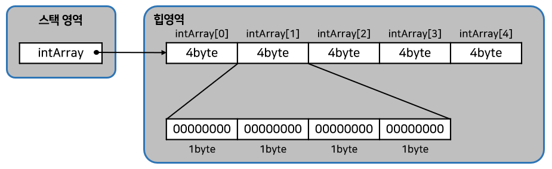

- <b>new 연산자</b>로 <u>배열을 처음 생성할 경우, 배열은 자동적으로 <b>기본값으로 초기화</b></u>된다.
- 학생 30명의 점수를 저장할 배열을 다음과 같이 생성한다고 가정하자.

```java
int[] scores = new int[30];
```

- scores 배열은 int 타입 배열이므로 아래처럼 scores[0] ~ scores[29]까지 모두 기본값 0으로 초기화된다.

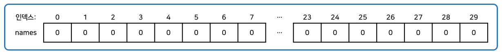

- 만약 String 배열을 생성했다면 names[0]에서 names[29]까지 모두 null 값으로 초기화된다.

```java
String[] names = new String[30];
```

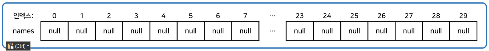

- 아래의 표는 타입별로 배열의 초기값을 보여주는 표이다.

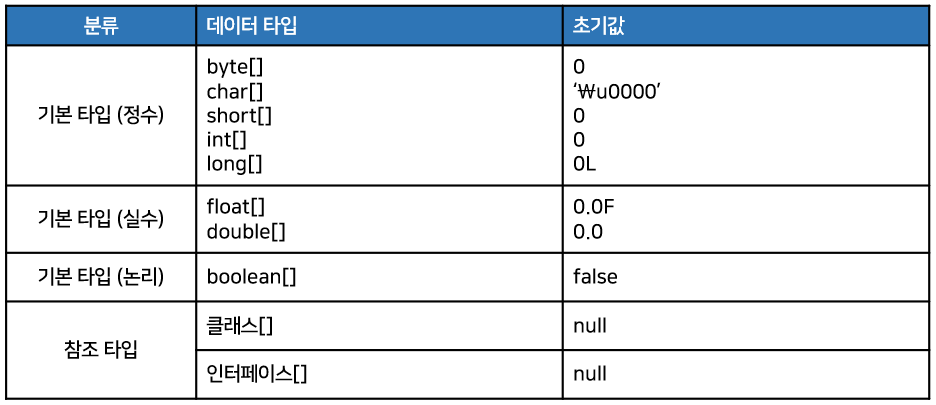

- 배열이 생성되고 나서 새로운 값을 저장하려면 대입 연산자를 사용하면 된다.

```java
변수[인덱스] = 값;
```

- 예를 들어 배열 scores의 0, 1, 2 인덱스에 각각 83, 90, 75를 저장하는 코드는 아래와 같다.

```java
int[] scores = new int[3];
scores[0] = 83;
scores[1] = 90;
scores[2] = 75;
```

```java
// 예제 코드
package chap05.sec06.exam03;

public class ArrayCreateByNewExample {

    public static void main(String[] args) {
        int[] arr1 = new int[3];
        for (int i = 0; i < 3; i++) {
            System.out.println("arr1[" + i + "] : " + arr1[i]);
        }
        arr1[0] = 10;
        arr1[1] = 20;
        arr1[2] = 30;
        for (int i = 0; i < 3; i++) {
            System.out.println("arr1[" + i + "] : " + arr1[i]);
        }

        double[] arr2 = new double[3];
        for (int i = 0; i < 3; i++) {
            System.out.println("arr2[" + i + "] : " + arr2[i]);
        }
        arr2[0] = 0.1;
        arr2[1] = 0.2;
        arr2[2] = 0.3;
        for (int i = 0; i < 3; i++) {
            System.out.println("arr2[" + i + "] : " + arr2[i]);
        }

        String[] arr3 = new String[3];
        for (int i = 0; i < 3; i++) {
            System.out.println("arr3[" + i + "] : " + arr3[i]);
        }
        arr3[0] = "1월";
        arr3[1] = "2월";
        arr3[2] = "3월";
        for (int i = 0; i < 3; i++) {
            System.out.println("arr3[" + i + "] : " + arr3[i]);
        }
    }

}
// arr1[0] : 0
// arr1[1] : 0
// arr1[2] : 0
// arr1[0] : 10
// arr1[1] : 20
// arr1[2] : 30
// arr2[0] : 0.0
// arr2[1] : 0.0
// arr2[2] : 0.0
// arr2[0] : 0.1
// arr2[1] : 0.2
// arr2[2] : 0.3
// arr3[0] : null
// arr3[1] : null
// arr3[2] : null
// arr3[0] : 1월
// arr3[1] : 2월
// arr3[2] : 3월
```

### 배열 길이

- 배열의 길이란 배열에 저장할 수 있는 전체 항목 수를 말한다.
- 코드에서 배열의 길이를 얻으려면 아래와 같이 <u>배열 객체의 length 필드</u>를 읽으면 된다.
  - 필드는 객체 내부의 데이터를 말한다.
  - 배열의 length 필드를 읽기 위해서는 배열 변수에 도트(.) 연산자를 붙이고 length를 적어주면 된다.

```java
배열변수.length;
```

- 아래는 배열 intArray의 길이를 알아보는 코드이다.
  - 배열 intArray가 3개의 값을 가지고 있기 때문에 변수 num에는 3이 저장된다.

```java
int[] intArray = {10, 20, 30};
int num = intArray.length;
```

- length 필드는 <u>읽기 전용 필드</u>이기 때문에 <u>값을 바꿀 수가 없다.</u>
  - 그래서 아래처럼 작성하면 안된다.

```java
intArray.length = 10;	// 잘못된 코드
```

- 배열의 length 필드는 for문을 사용해서 <u>배열 전체를 루핑</u>할 때 매우 유용하게 사용할 수 있다.

```java
public class ArrayLengthExample {

    public static void main(String[] args) {
        int[] scores = {83, 90, 87};

        int sum = 0;
        for (int i = 0; i < scores.length; i++) {
            sum += scores[i];
        }
        System.out.println("총합 : " + sum);

        double avg = (double) sum / scores.length;
        System.out.println("평균 : " + avg);
    }

}
// 총합 : 260
// 평균 : 86.66666666666667
```

### 커맨드 라인 입력

- main() 메소드의 매개값인 String[] args가 왜 필요할까?

```java
public static void main(String[] args) {...}
```

- "java 클래스"로 프로그램을 실행하면 JVM은 길이가 0인 String 배열을 먼저 생성하고 main() 메소드를 호출할 때 매개값으로 전달한다.

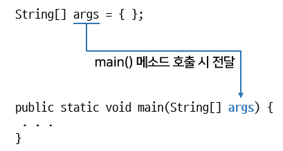

- 만약 아래처럼 "java 클래스" 뒤에 공백으로 구분된 문자열 목록을 주고 실행한다면?
  - 문자열 목록으로 구성된 String[]배열이 생성되고 main() 메소드를 호출할 때 <u>매개값</u>으로 전달된다.

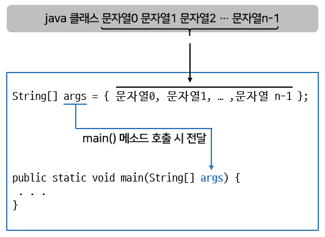

- main() 메소드는 String[] args 매개 변수를 통해서 커맨드 라인에서 입력된 데이터의 수(배열의 길이)와 입력된 데이터(배열의 항목 값)를 알 수 있게 된다.
- 아래의 예제는 프로그램을 실행할 때 2개의 문자열을 주지 않으면 프로그램의 사용법을 출력하고 강제 종료하도록 한 코드이다.
  - 만약 프로그램을 실행할 때 2개의 문자열이 정확히 입력되었다면 2개의 문자열을 int 타입 숫자로 변환하고 덧셈 연산을 수행한다.

```java
public class MainStringArrayArgument {

    public static void main(String[] args) {
        if (args.length != 2) {
            System.out.println("프로그램의 사용법");
            System.out.println("java MainStringArrayArgument num1 num2");
            System.exit(0);	// 강제 종료
        }

        String strNum1 = args[0];
        String strNum2 = args[1];

        int num1 = Integer.parseInt(strNum1);	// 문자열을 정수로 변환
        int num2 = Integer.parseInt(strNum2);	// 문자열을 정수로 변환

        int result = num1 + num2;
        System.out.println(num1 + " + " + num2 + " = " + result);
    }

}
// 그냥 실행시
// 프로그램의 사용법
// java MainStringArrayArgument num1 num2

// 매개값 10 20 주었을 때
// 10 + 20 = 30
```

- 실행시 매개값 10, 20을 주게 되면 args는 { "10", "20" } 배열을 참조하게 되고 args[0]은 "10", args[1]은 "20"을 얻을 수 있다.
- 문자열은 산술 연산을 할 수 없기 때문에 이 문자열들을 Integer.parseInt() 메소드를 이용해서 정수로 변환시킨다.

```java
int 변수 = Integer.parseInt("정수로 변환 가능한 문자열");
```

- 만약 정수로 변환할 수 없는 문자열이 주어졌을 경우에는 NumberFormatException 실행 예외가 발생한다.

### 다차원 배열

- 값들이 <u>행과 열</u>로서 구성된 배열을 <b>2차원 배열</b>이라고 한다.
  - 2차원 배열은 수학의 행렬을 떠올리면 되는데, 가로 인덱스와 세로 인덱스를 사용한다.
- 자바는 2차원 배열을 <u>중첩 배열 방식</u>으로 구현한다.
  - 예를 들어 2(행) x 3(열) 행렬을 만들기 위해 다음과 같은 코드를 사용한다.

```java
int[][] scores = new int[2][3];
```

이 코드는 메모리에 다음과 같이 세 개의 배열 객체를 생성한다.

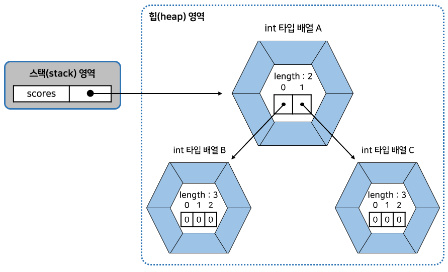

- 배열 변수인 <u>scores</u>는 길이 2인 <b>배열 A를 참조</b>한다.
- 배열 A의 <u>scores[0]</u>은 다시 길이 3인 <b>배열 B를 참조</b>한다.
- 그리고 <u>scores[1]</u> 역시 길이 3인 <b>배열 C를 참조</b>한다.
- scores[0]과 scores[1]은 모두 <u>배열을 참조하는 변수 역할</u>을 한다.
  - 따라서 각 배열의 길이는 다음과 같이 얻을 수 있다.

```java
scores.length		// 2(배열 A의 길이)
scores[0].length	// 3(배열 B의 길이)
scores[1].length	// 3(배열 C의 길이)
```

- 생성 원리는 수학 행렬과는 근본적으로 다르다. 하지만 사용 방식은 행렬과 동일하다.
  - `scores[0][1]`은 배열 B의 인덱스 1 값을 뜻한다. 수학 행렬의 (0, 1) 값이라고 볼 수 있다.
  - `scores[1][0]`은 배열 C의 인덱스 0 값을 뜻한다. 수학 행렬의 (1, 0) 값이라고 볼 수 있다.
- 자바는 <u>일차원 배열이 서로 연결된 구조</u>로 다차원 배열을 구현한다.
  - 그래서 수학 행렬 구조가 아닌 <b>계단식 구조</b>를 가질 수 있다.  
    아래의 코드를 보자.

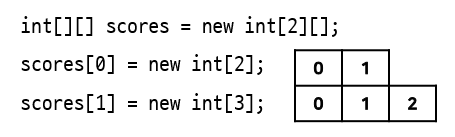

- 위 코드는 메모리에 아래의 그림처럼 배열 객체를 생성시킨다.

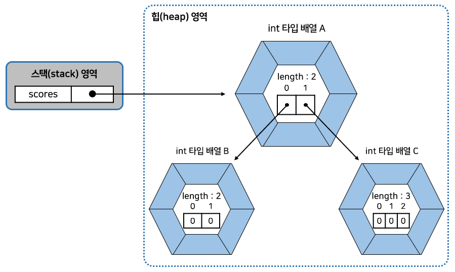

- 이 경우 배열 항목의 수를 조사해보면 다음과 같다.

```java
scores.length		// 2(배열 A의 길이)
scores[0].length	// 2(배열 B의 길이)
scores[1].length	// 3(배열 C의 길이)
```

- 이런 형태의 배열에서 주의할 점은 정확한 배열의 길이를 알고 인덱스를 사용해야 한다.
- `scores[0][2]`는 `ArrayIndexOutOfBoundsException`을 발생시킨다.
  - 왜냐하면 배열 B 객체의 마지막 인덱스는 1이기 때문이다.
- 하지만 `scores[1][2]`는 배열 C 객체의 세 번째 항목을 가르킨다.
- 만약 그룹화된 값 목록을 가지고 있다면 아래처럼 중괄호 안에 다시 중괄호를 사용해서 값 목록을 나열하면 된다.

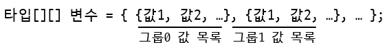

- 예를 들어 그룹화된 성적 점수를 이용해서 아래와 같은 배열을 만들 수 있다.
  - `scores[0]`에는 `{95, 80}` 배열을 참조하고, `scores[1]`에는 `{92, 96}` 배열을 참조한다.

```java
int[][] scores = { {95, 80}, {92, 96} };
```

- 위 코드로 생성된 scores 배열에서 항목 값은 다음과 같이 읽을 수 있다.

```java
int score = scores[0][0];	// 95
int score = scores[1][1];	// 96
```

```java
// 예제 코드
public class ArrayInArrayExample {

    public static void main(String[] args) {

        int[][] mathScores = new int[2][3];
        for (int i = 0; i < mathScores.length; i++) {
            for (int k = 0; k < mathScores[i].length; k++) {
                System.out.println("mathScores[" + i + "][" + k + "]="
                                   + mathScores[i][k]);

            }
        }
        System.out.println();

        int[][] englishScores = new int[2][];
        englishScores[0] = new int[2];
        englishScores[1] = new int[3];
        for (int i = 0; i < englishScores.length; i++) {
            for (int k = 0; k < englishScores[i].length; k++) {
                System.out.println("englishScores[" + i + "][" + k + "]="
                                   + englishScores[i][k]);
            }
        }
        System.out.println();

        int[][] javaScores = {{95, 80}, {92, 96, 80}};
        for (int i = 0; i < javaScores.length; i++) {
            for (int k = 0; k < javaScores[i].length; k++) {
                System.out.println("javaScores[" + i + "][" + k + "]="
                                   + javaScores[i][k]);
            }
        }
    }

}
// mathScores[0][0]=0
// mathScores[0][1]=0
// mathScores[0][2]=0
// mathScores[1][0]=0
// mathScores[1][1]=0
// mathScores[1][2]=0

// englishScores[0][0]=0
// englishScores[0][1]=0
// englishScores[1][0]=0
// englishScores[1][1]=0
// englishScores[1][2]=0

// javaScores[0][0]=95
// javaScores[0][1]=80
// javaScores[1][0]=92
// javaScores[1][1]=96
// javaScores[1][2]=80
```

### 객체를 참조하는 배열

- 기본 타입(byte, char, short, int, long, float, double, boolean) 배열은 각 항목에 직접 값을 가지고 있다.
- 하지만 참조 타입(클래스, 인터페이스) <u>배열은 각 항목에</u> <b>객체의 번지</b>를 가지고 있다.
  - 예를 들어 String은 클래스 타입이므로 String[] 배열은 각 항목에 문자열이 아니라 <u>String 객체의 주소</u>를 가지고 있다.
  - 즉, <b>String 객체를 참조</b>하게 된다.

```java
String[] strArray = new String[3];
strArray[0] = "Java";
strArray[1] = "C++";
strArray[2] = "C#";
```

- 위의 코드는 배열 변수 strArray를 선언하고 3개의 문자열을 <b>참조</b>하는 배열을 생성한다.  
  그림으로 표현하면 아래와 같다.

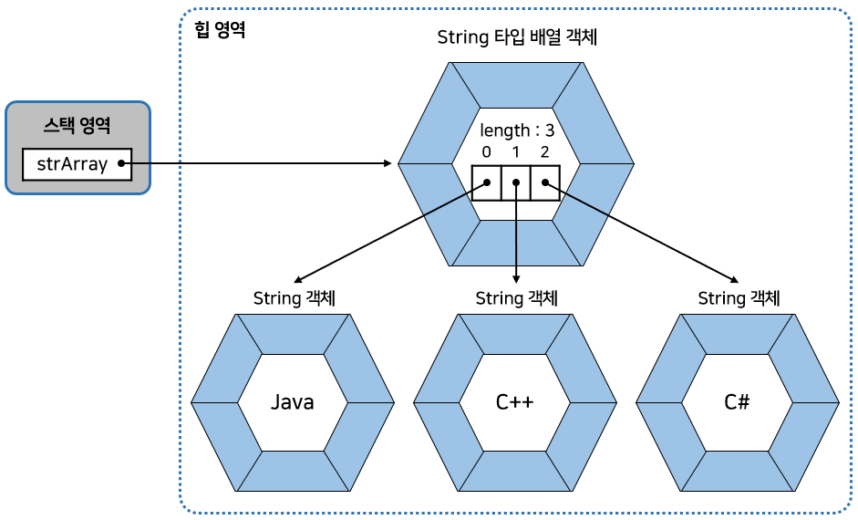

- 따라서 String[] 배열의 항목도 결국 String 변수와 동일하게 취급되어야 한다.
  - 예를 들어 String[] 배열 항목 간에 <u>문자열을 비교</u>하기 위해서는 == 연산자 대신 <u>equals() 메소드</u>를 사용해야 한다.
  - <u>==는 객체의 번지 비교</u>이기 때문에 문자열 비교에 사용할 수 없다.

```java
String[] strArray = new String[3];
strArray[0] = "Java";
strArray[1] = "Java";
strArray[2] = new String("Java");

System.out.println( strArray[0] == strArray[1] );		// true (같은 객체 참조)
System.out.println( strArray[0] == strArray[2] );		// false (같은 객체 참조)
System.out.println( strArray[0].equals(strArray[2]) );	// true (문자열 동일)
```

- 위 코드를 실행하면 메모리에 아래의 그림과 같이 배열 객체가 생성된다.

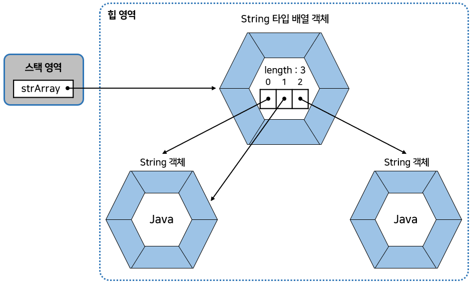

- strArray[0]과 strArray[1] 배열 항목을 == 연산하면 결과는 true가 나온다.
  - 이유는 <u>동일한 String 객체를 참조</u>하기 때문이다. 
- 반면에 String 객체를 <b>new 연산자로 생성</b>한다면?
  - <u>무조건 새로운 String 객체가 생성</u>되기 때문에 strArray[0]과 strArray[2] 배열 항목을 <u>== 연산하면 결과는 false</u>가 나온다.
  - strArray[0]과 strArray[2]는 <u>서로 다른 객체를 참조</u>하기 때문이다.
  - 하지만 <u>문자열을 비교</u>하는 `strArray[0].equals(strArray[2])`는 true값이 리턴된다.

```java
public class ArrayReferenceObjectExample {

    public static void main(String[] args) {
        String[] strArray = new String[3];
        strArray[0] = "Java";
        strArray[1] = "Java";
        strArray[2] = new String("Java");

        System.out.println( strArray[0] == strArray[1] );		// true
        System.out.println( strArray[0] == strArray[2] );		// false
        System.out.println( strArray[0].equals(strArray[2]) );	// true
    }

}
```

### 배열 복사

- 배열은 한 번 생성하면 <u>크기를 변경할 수 없다.</u>
- 더 많은 저장 공간이 필요하다면?
  - 보다 큰 배열을 <u>새로 만들고</u> 이전 배열로부터 항목 값들을 <b>복사</b>해야 한다.
- 배열 간의 항목 값들을 <b>복사</b>하려면 for문을 사용하거나 `System.arraycopy()` 메소드를 사용하면 된다.  
  아래는 for문으로 배열을 복사하는 코드이다.

```java
public class ArrayCopyByForExample {

    public static void main(String[] args) {
        int[] oldIntArray = {1, 2, 3};
        int[] newIntArray = new int[5];

        for (int i = 0; i < oldIntArray.length; i++) {
            newIntArray[i] = oldIntArray[i];
        }

        for (int i = 0; i < newIntArray.length; i++) {
            System.out.print(newIntArray[i] + ",");
        }
    }

}
```

- 위의 코드는 아래 그림과 같이 배열을 복사시킨다.
  - 복사되지 않은 항목은 int[] 배열의 기본 초기값 0이 그대로 유지된다.

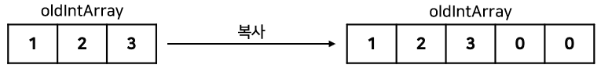

- 또 다른 방법으로 `System.arraycopy()` 메소드를 이용해서 배열을 복사할 수 있다.
  - `System.arraycopy()` 메소드를 호출하는 방법은 아래와 같다.

```java
System.arraycopy(Object src, int srcPos, Object dest, int destPos, int length);
```

1. <u>src 매개값</u>은 <b>원본 배열</b>이고
2. <u>srcPos</u>는 <u>원본 배열에서 복사할 항목의 <b>시작 인덱스</b></u>이다.
3. <u>dest매개값</u>은 <b>새 배열</b>이고
4. <u>destPos</u>는 <u>새 배열에서 붙여넣을 <b>시작 인덱스</b></u>이다.
5. 마지막으로 <u>length</u>는 <b>복사할 개수</b>이다.

- 예를 들어 원본 배열이 arr1이고 새 배열이 arr2일 경우 arr1의 모든 항목을 arr2에 복사하려면?
  - 아래와 같이 System.arraycopy() 메소드를 호출하면 된다.

```java
System.arraycopy(arr1, 0, arr2, 0, arr1.length);
```

```java
// 예제코드
public class ArrayCopyExample {

    public static void main(String[] args) {
        String[] oldStrArray = {"java", "array", "copy"};
        String[] newStrArray = new String[5];

        System.arraycopy(oldStrArray, 0, newStrArray, 0, oldStrArray.length);

        for (int i = 0; i < newStrArray.length; i++) {
            System.out.print(newStrArray[i] + ",");
        }
    }

}
```

- 위 코드는 아래의 그림과 같이 배열을 복사시킨다.
  - <u>복사되지 않은 항목</u>은 String[] 배열의 <u>기본 초기값</u>인 null이 <u>그대로 유지</u>된다.

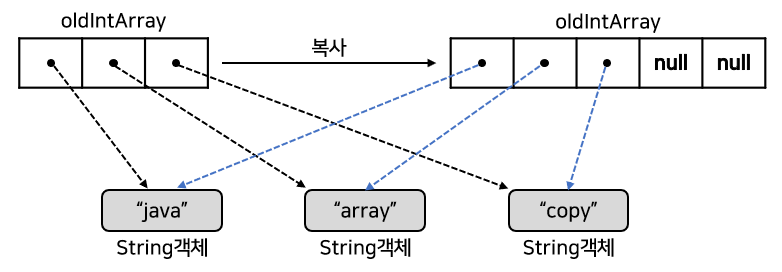

- <b>참조 타입 배열</b>일 경우, 배열 복사가 되면 <u>복사되는 값이 객체의 번지</u>이므로 <u>새 배열의 항목은 이전 배열의 항목이 참조하는 객체</u>와 <b>동일</b>하다.
  - 이것을 얕은 복사(shallow copy)라고 한다.
  - 반대로 깊은 복사(deep copy)는 참조하는 객체도 <u>별도로 생성</u>하는 것을 말한다.

### 향상된 for문(for-each)

- <b>향상된 for문</b>은 반복 실행을 하기 위해 카운터 변수와 증감식을 사용하지 않는다.
  - 배열 및 컬렉션 항목의 개수만큼 반복하고, 자동적으로 for문을 빠져나간다.  
    다음은 향상된 for문을 작성하는 형식과 흐름이다.

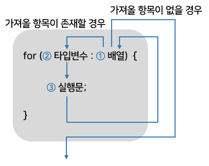

- for문의 괄호() 에는 배열에서 꺼낸 항목을 저장할 변수 선언과 콜론(:) 그리고 배열을 나란히 작성한다.
- for문이 처음 실행될 때
  - ①배열에서 가져올 첫 번째 값이 존재하는지 평가한다.
  - 가져올 값이 존재하면 해당 값을 ②변수에 저장한다.
  - 그리고 ③실행문을 실행한다.
  - 블록 내부의 ③실행문이 모두 실행되면 다시 루프를 돌아 ①배열에서 가져올 다음 값이 존재하는지 평가한다.
  - 만약 다음 항목이 존재하면 ②→③→①로 다시 진행하고, 가져올 항목이 없으면 for문이 종료된다.
  - 따라서 for문의 반복 횟수는 <u>배열의 항목 수</u>가 된다.

```java
public class AdvancedForExample {

    public static void main(String[] args) {
        int[] scores = {95, 71, 84, 93, 87};

        int sum = 0;
        for (int score : scores) {
            sum = sum + score;
        }
        System.out.println("점수 총합 = " + sum);

        double avg = (double) sum / scores.length;
        System.out.println("점수 평균 = " + avg);
    }

}
// 점수 총합 = 430
// 점수 평균 = 86.0
```

## 열거 타입

- 데이터 중에는 몇 가지로 한정된 값만을 갖는 경우가 있다.
  - 예를 들어요일에 대한 데이터는 월, 화, 수, 목, 금, 토, 일 이라는 일곱 개의 값만을 가진다.
  - 다른 예로, 계절에 대한 데이터는 봄, 여름, 가을, 겨울이라는 네 개의 값만을 가진다.
- 이처럼 <u>한정된 값만을 갖는 데이터 타입</u>이 <b>열거 타입(enumeration type)</b>이다.
  - 열거 타입은 몇 개의 <u>열거 상수(enumeration constant) 중에서 하나의 상수를 저장</u>하는 데이터 타입이다.

### 열거 타입 선언

- 열거 타입을 선언하기 위해서는 먼저 열거 타입의 이름을 정하고 <u>열거 타입 이름으로 소스파일(.java)을 생성</u>해야 한다.
  - 열거 타입 이름은 <u>관례적으로 첫 문자를 대문자</u>로 하고 나머지는 소문자로 구성한다.
  - <u>만약 여러 단어로 구성된 이름이라면 단어 첫 문자는 대문자</u>로 하는 것이 관례이다.

```java
// 잘 만들어진 열거 타입 소스 파일들의 이름이다.
Week.java
MemberGrade.java
ProductKind.Java
```

- 소스 파일의 내용으로는 아래와 같이 <b>열거 타입 선언</b>이 온다.
  - `public enum`키워드는 <u>열거 타입을 선언하기 위한 <b>키워드</b></u>이다.
    - <b>반드시 소문자로 작성</b>
- 열거 타입 이름은 소스 파일명과 대소문자가 모두 일치해야 한다.

```java
public enum 열거타입이름 {...}
```

- 열거 타입을 선언했다면?
  - <b>열거 상수를 선언</b>하면 된다.
  - 열거 상수는 <u>열거 타입의 값</u>으로 사용되는데, <u>관례적으로 열거 상수는 모두 대문자</u>로 작성한다.

```java
public enum Week {MONMAY, TUESDAY, WEDNESDAY, THURSDAY, FRIDAY, ...}
```

- 만약 열거 상수가 <u>여러 단어</u>로 구성될 경우?
  - 단어 사이를 밑줄(_)로 연결하는 것이 관례이다.  
    예를 들면 아래와 같다.

```java
public enum LoginResult {LOGIN_SUCCESS, LOGIN_FAILED}
```

```java
// 열거 타입 선언
public enum Week {
    MONDAY,
    TUESDAY,
    WEDNESDAY,
    THURSDAY,
    FRIDAY,
    SATURDAY,
    SUNDAY
}
```

### 열거 타입 변수

- 열거 타입을 선언했다면 열거 타입을 사용할 수 있다.
  - <u>열거 타입도 하나의 데이터 타입</u>이므로 <b>변수를 선언</b>하고 사용해야 한다.
- 아래는 열거 타입 변수를 선언하는 방법이다.

```java
열거타입 변수;
```

- 예를 들어서 열거 타입 Week로 변수를 선언한다면?

```java
Week today;
Week reservationDay;
```

- 열거 타입 변수를 선언했다면 아래처럼 열거 상수를 저장할 수 있다.
  - <u>열거 상수는 단독으로 사용할 수는 없고 <b>반드시 열거타입.열거상수</b>로 사용</u>된다.

```java
열거타입 변수 = 열거타입.열거상수
```

- 예를 들어서 today 열거 변수에 열거 상수인 SUNDAY를 저장하면?

```java
Week today = Week.SUNDAY;
```

- <u>열거 타입 변수는 null 값을 저장</u>할 수 있다.
  - <u>열거 타입도 <b>참조 타입</b></u>이기 때문

```java
Week birthday = null;
```

- <u>참조 타입 변수</u>는 <u>객체를 참조하는 변수</u>이다.
  - 그렇기 때문에 <u>열거 상수는 객체</u>이다.  
- 열거 상수는 객체로 생성된다.
  - 열거 타입 Week의 경우 MONDAY부터 SUNDAY까지의 열거 상수는 아래 그림처럼 총 7개의 Week 객체로 생성된다.
  - 그리고 <u>메소드 영역에 생성된 열거 상수</u>가 <u><b>해당 Week 객체를 각각 참조</b></u>하게 된다.

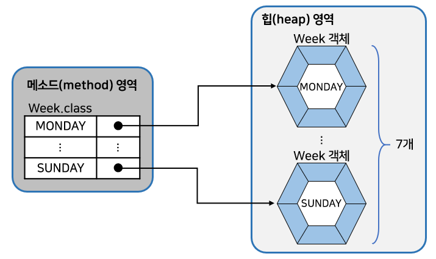

- 그렇다면 아래의 코드는 어떻게 이해하면 좋을까?

```java
Week today = Week.SUNDAY;
```

- 열거 타입 변수 today는 스택 영역에 생성된다.
  - today에 저장되는 값은 Week.SUNDAY 열거 상수가 참조하는 <u>객체의 번지</u>이다.
  - 따라서 열거 상수 Week.SUNDAY와 today 변수는 <u>서로 같은 Week 객체를 참조</u>하게 된다.

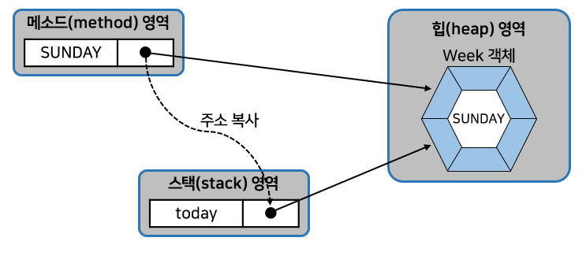

- 그렇기 때문에 today 변수와 Week.SUNDAY 상수의 == 연산 결과는 true가 된다.

```java
today == Week.SUNDAY	// true
```

- 그래서 아래의 코드에서 변수 week1과 week2의 == 연산 결과는 true이다.

```java
Week week1 = Week.SATURDAY;
Week week2 = Week.SATURDAY;
System.out.println(wee1 == week2);	// true
// week1과 week2는 모두 Week.SATURDAY 상수와 같이 동일한 Week 객체를 참조하기 때문
```

- 자바는 컴퓨터의 날짜 및 요일, 시간을 프로그램에서 사용할 수 있도록 하기 위해
  - Date, Calendar, LocalDateTime 등의 클래스를 제공한다.
- 예제 작성을 위해 Calendar를 이용해서 날짜와 시간을 얻는 방법을 알아보자.
  - 우선 Calendar 변수를 선언하고 `Calendar.getInstance() `메소드가 리턴하는 <u>Calendar 객체</u>를 얻는다.

```java
Calendar now = Calendar.getInstance();
```

- Canlendar 객체를 얻었다면 get() 메소드를 이용해서 년, 월, 일, 요일, 시간, 분, 초를 아래와 같이 얻을 수 있다.

```java
int year = now.get(Calendar.YEAR);			// 년
int month = now.het(Calendar.MONTH) + 1;	// 월(1~12)
int day = now.get(Calendar.DAY_OF_MONTH);	// 일
int week = now.get(Calendar.DAY_OF_WEEK);	// 요일(1~7)
int hour = now.get(Calendar.HOUR);			// 시간
int minute = now.get(Calendar.MINUTE);		// 분
int second = now.get(Calendar.SECOND);		// 초
```

- Calendar를 이용해서 오늘의 요일을 얻고, 열거 타입 변수 today에 해당 열거 상수를 대입하는 예제를 보자.

```java
import java.util.Calendar;

public class EnumWeekExample {

    public static void main(String[] args) {
        Week today = null;  // 열거 타입 변수 선언

        Calendar cal = Calendar.getInstance();	// Calendar를 얻는다.
        int week = cal.get(Calendar.DAY_OF_WEEK);   // 일(1)~토(7) 까지의 숫자를 얻는다.

        switch (week) {	// 스위치문을 이용해서 열거 타입 변수 today에 열거 상수를 대입
            case 1:
                today = Week.SUNDAY;
                break;
            case 2:
                today = Week.MONDAY;
                break;
            case 3:
                today = Week.TUESDAY;
                break;
            case 4:
                today = Week.WEDNESDAY;
                break;
            case 5:
                today = Week.THURSDAY;
                break;
            case 6:
                today = Week.FRIDAY;
                break;
            case 7:
                today = Week.SATURDAY;
        }

        System.out.println("오늘 요일: " + today);

        if (today == Week.SUNDAY) {
            System.out.println("일요일에는 축구를 합니다.");
        } else {
            System.out.println("열심히 자바 공부합니다.");
        }
    }

}
```

### 열거 객체의 메소드

- <b>열거 객체</b>는 <u>열거 상수의 문자열을 내부 데이터로</u> 가지고 있다.
- 아래의 그림은 열거 객체가 가지는 데이터 및 메소드들을 보여준다.
  - 메소드는 java.lang.Enum 클래스에 선언된 메소드인데, 열거 객체에서 사용할 수 있는 이유는 모든 열거 타입은 컴파일 시에 Enum 클래스를 상속하게 되어 있기 때문이다.

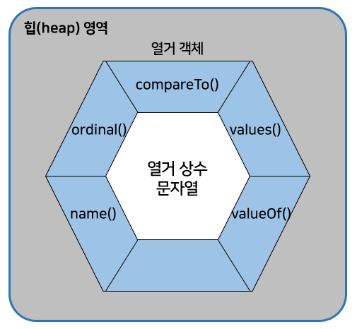

| 리턴 타입 | 메소드(매개 변수)    | 설명                                  |
| --------- | -------------------- | ------------------------------------- |
| String    | name()               | 열거 객체의 문자열을 리턴             |
| int       | ordinal()            | 열거 객체의 순번(0부터 시작)을 리턴   |
| int       | compareTo()          | 열거 객체를 비교해서 순번 차이를 리턴 |
| 열거 타입 | valueOf(String name) | 주어진 문자열의 열거 객체를 리턴      |
| 열거 배열 | values()             | 모든 열거 객체들을 배열로 리턴        |

#### name() 메소드

- `name()` 메소드는 열거 객체가 가지고 있는 <b>문자열</b>을 리턴한다.
  - 이때 리턴되는 문자열은 열거 타입을 정의할 때 사용한 <u>상수 이름과 동일</u>하다.
- 아래의 코드는 today가 참조하는 열거 객체에서 `name()` 메소드를 호출하여 <u>문자열</u>을 얻어낸다.
  - name() 메소드는 열거 객체 내부의 문자열인 "SUNDAY"를 리턴하고 name 변수에 저장한다.

```java
Week today = Week.SUNDAY;
String name = today.name();
```

#### ordinal() 메소드

- `ordinal()` 메소드는 <u>전체 열거 객체 중</u> <b>몇 번째 열거 객체</b>인지 알려준다.
- 열거 객체의 순번은 열거타입을 정의할 때 주어진 순번을 말하는데, <u>0번부터 시작</u>한다.
  - 예를 들어 열거 타입 Week의 열거 객체 순번은 아래와 같이 결정된다.

```java
public enum Week {
    MONDAY,		// 0
    TUESDAY,	// 1
    WEDNESDAY,	// 2
    THURSDAY,	// 3
    FRIDAY,		// 4
	SATURDAY,	// 5
    SUNDAY		// 6
}
```

```java
// today가 참조하는 열거 객체가 전체 열거 객체에서 몇 번째 순번인지 알아내는 코드
Week today = Week.SUNDAY;
int ordinal = today.ordinal();	// 6을 리턴해서 변수에 저장
```

#### compareTo() 메소드

- `compareTo()` 메소드는 <u>매개값으로 주어진 열거 객체를 기준으로</u> <b>전후로 몇 번째 위치하는지</b>를 비교한다.
  - 만약 열거 객체가 매개값의 열거 객체보다 순번이 빠르다면 음수가, 순번이 늦다면 양수가 리턴된다.
  - 아래의 코드는 day1과 day2의 상대적 위치를 비교하는 코드이다.

```java
Week day1 = Week.MONDAY;			// 0번째 위치함
Week day2 = Week.WEDNESDAY;			// 2번째 위치함
int result1 = day1.compareTo(day2);	// -2
int result2 = day2.compareTo(day1);	// 2
```

#### valueOf() 메소드

- `valueOf()` 메소드는 <u>매개값으로 주어지는 문자열</u>과 <b>동일한 문자열을 가지는 열거 객체를 리턴</b>한다.
  - 이 메소드는 외부로부터 문자열을 입력받아 열거 객체로 변환할 때 유용하게 사용할 수 있다.

```java
Week weekDay = Week.valueOf("SATURDAY")
```

#### values() 메소드

- `values()` 메소드는 열<u>거 타입의 모든 열거 객체들을</u> <b>배열로 만들어 리턴</b>한다.
  - 다음은 Week 열거 타입의 모든 열거 객체를 배열로 만들어 향상된 for문을 이용해서 반복하는 코드이다.

```java
Week[] days = Week.values();
for (Week day : days) {
    System.out.println(day);
}
```

- Week 배열은 아래의 그림과 같이 생성된다.
  - 배열의 인덱스는 열거 객체의 순번과 같고 각 인덱스 값은 해당 순번의 열거 객체 번지이다.

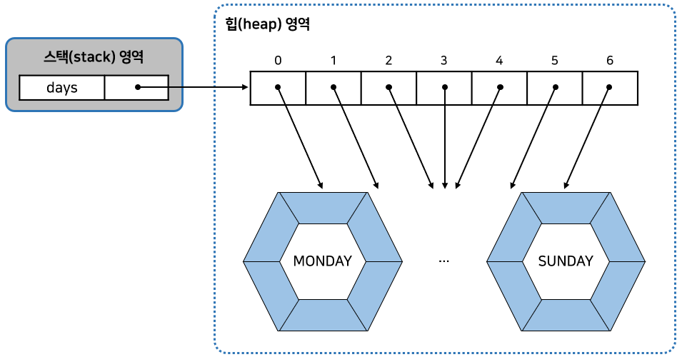

```java
public class EnumMethodExample {

    public static void main(String[] args) {
        // name() 메소드
        Week today = Week.SUNDAY;
        String name = today.name();
        System.out.println(name);	// SUNDAY

        // ordinal() 메소드
        int ordinal = today.ordinal();
        System.out.println(ordinal);	// 6

        // compareTo() 메소드
        Week day1 = Week.MONDAY;
        Week day2 = Week.WEDNESDAY;
        int result1 = day1.compareTo(day2);
        int result2 = day2.compareTo(day1);
        System.out.println(result1);	// -2
        System.out.println(result2);	// 2

        // valueOf() 메소드
        if (args.length == 1) {	// 실행시 인자를 넘겨주었을 때
            String strDay = args[0];
            Week weekDay = Week.valueOf(strDay);
            if (weekDay == Week.SATURDAY || weekDay == Week.SUNDAY) {
                System.out.println("주말 이군요");
            } else {
                System.out.println("평일 이군요");
            }
        }

        // values() 메소드
        Week[] days = Week.values();
        for (Week day : days) {
            System.out.println(day);
        }
    }

}
```

