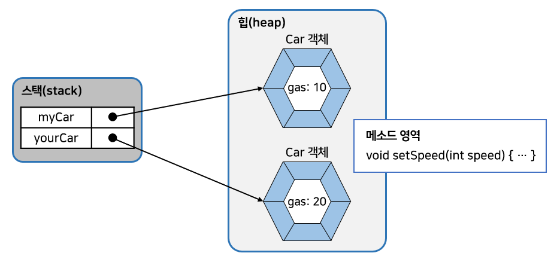
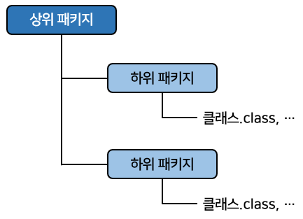
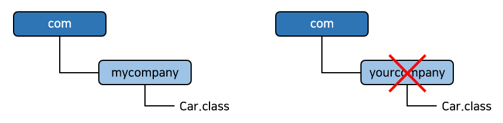
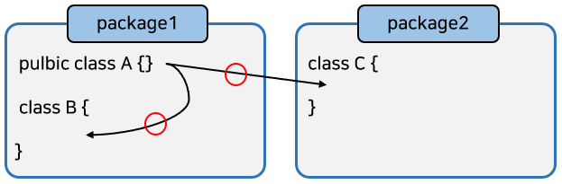

# 클래스

## 객체 지향 프로그래밍

- <b>객체 지향 프로그래밍(OOP: Object Oriented programming)</b>이란?
  - 현실 세계에서 어떤 제품을 만들 때, 부품을 먼저 개발하고 이 부품들을 하나씩 조립해서 완성된 제품을 만들 듯이 소프트웨어를 개발할 때에도 <u>부품에 해당하는 객체들</u>을 먼저 만들고, <u>이것들을 하나씩 조립</u>해서 완성된 프로그램을 만드는 기법
- 객체 지향 프로그래밍을 이해하기 위해서는 객체의 개념과 객체 상호작용에 대해서 알아야 한다.

### 객체란?

- <b>객체(Object)</b>란?
  - <u>물리적으로 존재</u>하거나 <u>추상적으로 생각할 수 있는 것</u> 중에서 <u>자신의 속성</u>을 가지고 있고 <u>다른 것과 식별 가능한 것</u>을 말한다.
- 예를 들어 물리적으로 존재하는 자동차, 자전거, 책, 사람과  
  추상적인 학과, 강의, 주문 등이 모두 객체가 될 수 있다.
- 객체는 <b>속성</b>과 <b>동작</b>으로 구성되어 있다.
  - 예를 들어 사람은 이름, 나이 등의 <u>속성</u>과 웃다, 걷다 등의 <u>동작</u>이 있다.
  - 자동차는 색상, 모델명 등의 <u>속성</u>과 달린다, 멈춘다 등의 <u>동작</u>이 있다.
  - 자바는 이 <u>속성과 동작들을</u> 각각 <b>필드(field)</b>와 <b>메소드(method)</b>라고 부른다.


- <b>객체 모델링(Object Modeling)</b> 이란?
  - 현실 세계의 객체를 소프트웨어 객체로 설계하는 것
  - <u>현실 세계 객체의 속성과 동작을 추려내어</u> 소프트웨어 객체의 <u>필드와 메소드로 정의</u>하는 과정

### 객체의 상호작용

- 현실 세계에서 일어나는 모든 현상은 <u>객체와 객체 간</u>의 <b>상호작용</b>으로 이루어져 있다.
  - 예를 들어 사람은 전자계산기의 기능을 이용하고, 전자계산기는 계산 결과를 사람에게 알려주는 상호작용을 한다.


- 마찬가지로 소프트웨어에서도 객체들은 각각 독립적으로 존재하고, 다른 객체와 서로 <b>상호작용</b>하면서 동작한다.
- 객체들 사이의 상호작용 수단은 <b>메소드</b>이다.
- 객체가 다른 객체의 기능을 이용하는 것이 바로 <b>메소드 호출</b>이다.


- <b>메소드 호출</b>은 아래와 같은 형태를 가지고 있다.
  - 객체에 도트(.) 연산자를 붙이고 메소드 이름을 기술하면 된다.
  - <b>도트 연산자</b>는 <u>객체의 필드와 메소드에 접근</u>할 때 사용한다.

```java
리턴값 = 전자계산기객체.메소드(매개값1, 매개값2, ...);
```

- <b>매개값</b>은 <u>메소드를 실행하기 위해 필요한 데이터</u>이다.
  - 예를 들어 10과 20을 주고 더하기 기능을 이용한다라고 했을 때, 10과 20이 더하기 기능의 매개값이다.

- <b>리턴값</b>은 메소드가 실행하고 나서 <u>호출한 곳으로 돌려주는(리턴하는) 값</u>이다.
- 아래 그림은 자바 코드로 본 메소드 호출이다.


```java
int result = Calculator.add(10, 20);
// 리턴한 값을 int 변수에 저장
```

- <u>객체의 상호작용</u>은 <b>객체 간의 메소드 호출을 의미</b>한다.
  - 매개값과 리턴값을 통해서 데이터를 주고 받는다.

### 객체 간의 관계

- 객체는 개별적으로 사용될 수 있지만, 대부분 다른 객체와 관계를 맺고 있다.
- 관계의 종류에는 아래와 같이 3가지가 있다.
  - 집합 관계
  - 사용 관계
  - 상속 관계


- <b>집합 관계</b>에 있는 객체는 하나의 부품이고 하나는 완성품에 해당한다.
  - 예를 들어 자동차는 엔진, 타이어, 핸들 등으로 구성되므로 자동차와 이 부품들은 <b>집합의 관계</b>
- <b>사용관계</b>는 <u>객체 간의 상호작용</u>을 말한다.
  - 객체는 다른 객체의 메소드를 호출하여 원하는 결과를 얻어낸다.
  - 예를 들어 사람은 자동차를 사용하므로 사람과 자동차는 사용의 관계라고 볼 수 있다.
  - 사람은 자동차를 사용할 때마다 달린다, 멈춘다 등의 메소드를 호출
- <b>상속관계</b>는 <u>상위(부모) 객체를 기반으로 하위(자식) 객체를 생성하는 관계</u>를 말한다.
  - 일반적으로 상위 객체는 종류를 의미하고, 하위 객체는 구체적인 사물에 해당한다.
  - 예를 들어 "자동차는 기계의 종류이다."에서 기계(상위)와 자동차(하위)는 상속 관계에 있다고 볼 수 있다.

- <b>객체 지향 프로그래밍</b>은
  - 만들고자 하는 완성품인 <u>객체를 모델링</u>하고,
  - 집합 관계에 있는 부품 객체와 사용 관계에 있는 객체를 하나씩 설계한 후
  - 조립하는 방식으로 프로그램을 개발하는 기법이다.

### 객체 지향 프로그래밍의 특징

- 객체 지향 프로그램의 특징은 크게 3가지로 들 수 있다.
  - 캡슐화
  - 상속
  - 다형성

#### 캡슐화(Encapsulation)

- <b>캡슐화</b>란?
  - 객체의 필드, 메소드를 하나로 묶고, <u>실제 구현 내용을 감추는 것</u>
  - 외부 객체는 객체 내부의 구조를 알지 못하며 객체가 노출해서 제공하는 필드와 메소드만 이용할 수 있다.


- 필드와 메소드를 캡슐화하여 보호하는 이유?
  - 외부의 잘못된 사용으로 인해 <u>객체가 손상되지 않도록</u> 하기 위해
  - 예를 들어 TV의 중요한 부품이 바깥으로 노출되어 있다면, 사용자의 실수로 인해 고장날 수도 있다.  
    이런 중요한 부품은 함부로 만지지 못하도록TV 안쪽으로 <b>캡슐화</b>하여 숨겨두어야 한다.
- 자바 언어는 캡슐화된 멤버를 노출시킬 것인지, 숨길 것인지를 결정하기 위해 <b>접근 제한자(Access Modifier)</b>를 사용한다.
  - 접근 제한자는 객체의 필드와 메소드의 사용 범위를 제한함으로써 <u>외부로부터 보호</u>한다.

#### 상속(Inheritance)

- 현실에서 상속은 부모가 가지고 있는 재산을 자식에게 물려주는 것
  - 자식은 특별한 노력없이 부모가 물려준 재산을 갖게 된다.
- 객체 지향 프로그래밍에서도 부모 역할의 상위 객체와 자식 역할의 하위 객체가 있다.
  - <b>상위 객체</b>는 자기가 가지고 있는 필드와 메소드를 <u>하위 객체에게</u> <b>물려주어</b> 하위 객체가 사용할 수 있도록 해준다.


- 상속은 상위 객체를 재사용해서 하<u>위 객체를 쉽고 빨리 설계할 수 있도록</u> 도와주고, 이미 잘 개발된 객체를 재사용해서 새로운 객체를 만들기 때문에 <u>반복된 코드의 중복을 줄여준다.</u>

- <b>상속</b>은 상위 개체의 수정이 모든 하위 객체들의 수정 효과를 가져와 <u>유지 보수 시간을 최소화</u>시켜주기도 한다.
  - 예를 들어 객체 B, C가 객체 A를 상속할 경우 A의 필드와 메소드를 수정한다면?
    - 객체 B, C를 수정하지 않아도 객체 A의 수정된 필드와 메소드를 사용할 수 있다.

#### 다형성(Polymorphism)

- <b>다형성</b>은 같은 타입이지만 <u>실행 결과가 다양한 객체를 이용할 수 있는 성질</u>을 말한다.
  - 코드 측면에서 보면 다형성은 하나의 타입에 여러 객체를 대입함으로써 다양한 기능을 이용할 수 있도록 해준다.
- 자바는 다형성을 위해 부모 클래스 또는 인터페이스의 타입 변환을 허용한다.
  - 부모 타입에는 모든 자식 객체가 대입될 수 있고, 인터페이스 타입에는 모든 구현 객체가 대입될 수 있다.
- 다형성의 효과로 객체는 <b>부품화</b>가 가능하다.
  - 예를 들어 자동차를 설계할 때 타이어 인터페이스 타입을 적용했다면?
    - 이 인터페이스를 구현한 실제 타이어들은 어떤 것이든 상관없이 장착(대입)이 가능하다.

## 객체와 클래스

- 현실에서 객체는 갑자기 하늘에서 떨어지는 것이 아니다.
  - 설계도를 바탕으로 만들어진다.
  - 예를 들어 사람들이 자동차를 이용하기 위해서는?
    - 공장에서 설계도를 보고 자동차를 만들어야 한다.
- 객체 지향 프로그래밍에서도 마찬가지이다.
  - 메모리에서 사용하고 싶은 객체가 있다면 우선 설계도로 해당 객체를 만드는 작업이 필요하다.
  - 자바에서는 설계도가 바로 <b>클래스(calss)</b>이다.
- 클래스에는 객체를 생성하기 위한 <u>필드와 메소드가 정의</u>되어 있다.
  - <u>클래스로부터 만들어진 객체를 해당 클래스의</u> <b>인스턴스(instance)</b>라고 한다.
  - 자동차 객체는 자동차 클래스의 인스턴스인 셈이다.
- 클래스로부터 객체를 만드는 과정을 <b>인스턴스화</b>라고 한다.
- 하나의 클래스로부터 여러 개의 인스턴스를 만들 수 있는데, 이것은 동일한 설계도로부터 여러 대의 자동차를 만드는 것과 동일하다.


- 객체 지향 프로그래밍 개발은 세 가지 단계가 있다.
  1. 클래스를 설계해야 한다.
  2. 설계된 클래스를 가지고 사용할 객체를 생성해야 한다.
  3. 생성된 객체를 이용
- 지금까지 단순히 main() 메소드만 작성해서 실행할 목적으로 클래스를 이용하였다.
  - main() 메소드가 없는 클래스는 <b>객체 생성 과정</b>을 거쳐 사용해야 한다.

## 클래스 선언

- 사용하고자 하는 객체를 구상했다면?
  - 그 객체의 <u>대표 이름</u>을 하나 결정하고 이것을 <b>클래스 이름</b>으로 한다.
  - 예를 들어 사람 객체의 클래스는 Person으로, 자동차 객체의 클래스는 Car라는 이름으로 줄 수 있다.
- 클래스 이름은 다른 클래스와 <u>식별할 목적</u>으로 사용되므로 자바의 <b>식별자 작성 규칙</b>에 따라서 만들어야 한다.


- 클래스 이름은 한글이든 영어든 상관없지만, 한글로 클래스 이름을 만드는 경우는 거의 없다.
- 자바 언어는 영어 대소문자를 다른 문자로 취급하기 때문에 클래스 이름도 영어 대소문자를 구분한다.
  - 관례적으로 클래스 이름이 단일 단어라면 <u>첫 자를 대문자</u>로 하고 <u>나머지는 소문자</u>로 작성
  - 만약 서로 다른 단어가 혼합된 이름을 사용한다면 <u>각 단어의 첫 머리 글자는 대문자</u>로 작성하는 것이 관례

```java
Calculator, Car, Member, ChatClient, ChatServer, Web_Browser
```

- 클래스 이름을 정했다면 "클래스이름.java"로 소스 파일을 생성해야 한다.
  - 소스 파일 이름도 대소문자를 구분하므로 <b>반드시 클래스 이름과 대소문자가 같도록</b> 해야한다.
- 소스 파일을 생성했다면 소스 파일을 열고 아래와 같이 클래스를 선언한다.

```java
public class 클래스 이름 {
    
}
```

- `public class` 키워드는 클래스를 선언할 때 사용한다.
  - <b>반드시 소문자</b>로 작성해야 한다.
- 클래스 이름 뒤에는 반드시 중괄호 {}를 붙여준다.
  - 중괄호 시작 은 클래스 선언의 시작을 알려주고 중괄호 끝은 클래스 선언의 끝을 알려준다.  
    아래는 Car 클래스를 선언한 것이다.

```java
public class Car {
    
}
```

- 일반적으로 소스 파일당 하나의 클래스를 선언한다.
  - 하지만, 두 개 이상의 클래스 선언도 가능하다.

```java
public class Car {
    
}

class Tire {
    
}
```

- 두 개 이상의 클래스가 선언된 소스 파일을 컴파일하면 바이트 코드 파일은 <u>클래스를 선언한 개수만큼</u> 생긴다.
  - 결국 소스 파일은 <b>클래스 선언을 담고 있는 저장 단위일 뿐</b>, 클래스 자체가 아니다.
- 위의 코드를 컴파일하면 Car.class와 Tire.class가 각각 생성된다.
- <u>주의할 점</u>
  - <b>파일 이름과 동일한 이름의 클래스 선언에만</b> `public` 접근 제한자를 붙일 수 있다.
  - 만약 파일 이름과 일치하지 않는 클래스 선언에 `public` 접근 제한자를 붙인다면?
    - 컴파일 에러가 발생
    - 가급적이면 <u>소스파일 하나당 동일한 이름의 클래스 하나</u>를 선언하는 것이 좋다.

## 객체 생성과 클래스 변수

- 클래스로부터 객체를 생성하는 방법은 아래와 같이 <b>new 연산자</b>를 사용하면 된다.

```java
new 클래스();
```


- <b>new</b>는 클래스로부터 객체를 생성시키는 연산자이다.
  - new 연산자 뒤에는 생성자가 오는데, 생성자는 클래스() 형태를 가지고 있다.
  - new 연산자로 생성된 객체는 메모리 힙(heap) 영역에 생성된다.
- 현실 세계에서 물건의 위치를 모르면 물건을 사용할 수 없듯, 객체 지향 프로그램에서도 메모리 내에서 생성된 객체의 위치를 모르면 객체를 사용할 수 없다.
  - 그래서 <b>new 연산자</b>는 힙 영역에서 생성시킨 후, <u>객체의 주소를 리턴</u>하도록 되어 있다.
  - 이 주소를 참조 타입인 클래스 변수에 저장해 두면, 변수를 통해 객체를 사용할 수 있다.
  - 아래는 클래스 타입으로 선언된 변수에 new 연산자가 리턴한 객체의 주소를 저장하는 코드이다.

```java
클래스 변수;
변수 = new 클래스();
```

- 클래스 변수 선언과 객체 생성을 한 개의 실행문으로 작성할 수도 있다.

```java
클래스 변수 = new 클래스();
```

- new 연산자로 객체를 생성하고 리턴된 객체의 주소를 변수에 저장하면 아래의 그림과 같이 변수가 객체를 참조하게 된다.


- 아래의 Student.java는 Student 클래스를 선언한다.
- StudentExample.java는 해당 클래스의 main() 메소드에서 Student 객체를 생성한다.

```java
// Student.java
public class Student {
}
```

```java
// StudentExample.java
public class StudentExample {

    public static void main(String[] args) {
        Student s1 = new Student();
        System.out.println("s1 변수가 Student 객체를 참조합니다.");

        Student s2 = new Student();
        System.out.println("s2 변수가 또 다른 Student 객체를 참조합니다.");
    }

}
```


- 위의 예제가 실행되면 아래의 그림처럼 메모리에 클래스 변수와 객체가 생성된다.
- Student 클래스는 하나지만 <u>new 연산자를 사용한 만큼</u> 객체가 메모리에 생성된다.
  - 이러한 객체들은 Student 클래스의 <b>인스턴스</b>들이다.
- 같은 클래스로부터 생성되었지만 각각의 Student 객체는 <u>자신만의 고유 데이터</u>를 가지면서 메모리에서 활동하게 된다.
  - s1과 s2가 참조하는 Student 객체는 <u>완전히 독립된 서로 다른 객체</u>이다.


- 클래스는 두 가지 용도가 있다.
  - 하나는 <b>라이브러리(API: Application Program Interface)</b>용
  - 다른 하나는 <b>실행용</b>
- <u>라이브러리 클래스</u>는 다른 클래스에서 <b>이용할 목적</b>으로 설계된다.
  - 프로그램 전체에서 사용되는 클래스가 100개라면 99개는 라이브러리이고 <u>단 하나가</u> <b>실행 클래스</b>이다.
- <b>실행 클래스</b>는 프로그램의 실행 진입점인 main() 메소드를 제공하는 역할을 한다.

- 그러므로 Student는 라이브러리 클래스이고 <u>StudentExample은 실행 클래스이다.
- Student에 main() 메소드를 작성해서 라이브러리인 동시에 실행 클래스로 만들 수도 있다.

```java
public class Student {
    // 라이브러리로서의 코드(필드, 생성자, 메소드)
    // ...
    
    // 실행하기 위한 코드
    public static void main(String[] args) {
        Student s1 = new Student();
        System.out.println("s1 변수가 Student 객체를 참조합니다.");

        Student s2 = new Student();
        System.out.println("s2 변수가 또 다른 Student 객체를 참조합니다.");
    }

}
```

- 프로그램이 단 하나의 클래스로 구성된다면 위 예저처럼 작성하는 것이 좋은 방법일 수 있다.
  - 하지만 대부분의 객체 지향 프로그램은 라이브러리(부품 객체 및 완성 객체)와 실행 클래스가 분리되어 있다. 그러므로 가급적이면 클래스를 분리해서 작성하는 것이 좋다.

## 클래스의 구성 멤버

- 클래스에는 객체가 가져야 할 구성 멤버가 선언된다.
- 구성 멤버에는 3가지가 있다.
  - 필드(Field)
  - 생성자(Constructor)
  - 메소드(method)
- 구성 멤버들은 생략되거나 복수 개가 작성될 수 있다.


### 필드

- <b>필드</b>란?
  - 객체의 고유 데이터, 부품 객체, 상태 정보를 저장하는 곳이다.
  - 선언 형태는 변수(variable)과 비슷하지만, 필드를 변수라고 부르지 않는다.
- 변수는 생성자와 메소드 내에서만 사용되고 생성자와 메소드가 실행 종료되면 자동 소멸된다.
  - 하지만 필드는 생성자와 메소드 전체에서 사용되며 <u>객체가 소멸되지 않는 한 객체와 함께 존재</u>한다.

### 생성자

- <b>생성자</b>란?
  - new 연산자로 호출되는 특별한 중괄호 블록이다.
- 생성자의 역할은 <u>객체 생성 시 초기화를 담당</u>한다.
  - 필드를 초기화하거나, 메소드를 호출해서 객체를 사용할 준비를 한다.
  - 생성자는 메소드와 비슷하게 생겼지만, 클래스 이름으로 되어 있고 리턴 타입이 없다.

### 메소드

- <b>메소드</b>란?
  - 객체 동작에 해당하는 중괄호 블록을 말한다.
  - 중괄호 블록은 이름을 가지고 있는데, 이것이 메소드 이름이다.
- 메소드를 호출하게 되면 중괄호 블록에 있는 모든 코드들이 일괄적으로 실행된다.
- 메소드는 필드를 읽고 수정하는 역할도 하지만, 다른 객체를 생성해서 다양한 기능을 수행하기도 한다.
- 메소드는 <u>객체 간의 데이터 전달의 수단</u>으로 사용된다.
  - 외부로부터 매개값을 받을 수도 있고, 실행 후 어떤 값을 리턴할 수도 있다.

## 필드

- <b>필드</b>란?
  - 객체의 고유 데이터, 객체가 가져야 할 부품, 객체의 현재 상태 데이터를 저장하는 곳이다.
  - 자동차 객체를 예로 들면 <u>제작회사, 모델, 색깔, 최고 속도</u>는 <b>고유 데이터</b>에 해당하고,  
    <u>현재 속도, 엔진 회전 수</u>는 <b>상태 데이터</b>에 해당,  
    그리고 <u>차체, 엔진, 타이어</u>는 <b>부품</b>에 해당한다.
  - 그러므로 자동차 클래스를 설계할 때 이 정보들은 필드로 선언되어야 한다.


### 필드 선언

- <b>필드 선언</b>은 <u>클래스 중괄호 블록 어디서든</u> 존재할 수 있다.
  - 생성자 선언과 메소드 선언의 앞과 뒤 어떤 곳에서도 필드 선언이 가능하다.
- 하지만 생성자와 메소드 중괄호 블록 내부에는 선언될 수 없다.
  - 생성자와 메소드 중괄호 블록 내부에 선언된 것은 모두 <u>로컬 변수</u>가 된다.
- 필드 선언은 변수의 선언 형태와 비슷해서 일부 사람들은 클래스 멤버 변수라고 부르기도 한다.
  - 하지만 될 수 있으면 필드라는 용어를 그대로 사용하는 것이 좋다.

```java
타입 필드 [ = 초기값];
```

- 타입은 필드에 저장할 데이터의 종류를 결정한다.
  - 타입에는 <u>기본타입과 참조타입이 모두</u> 올 수 있다.
- 필드의 초기값은 필드 선언 시 주어질 수도 있고, 생략될 수도 있다.  
  아래는 올바르게 필드를 선언한 예를 보여준다.

```java
String company = "현대자동차";
String model = "그랜저";
int maxSpeed = 300;
int productionYear;
int currentSpeed;
boolean engineStart;
```

- 초기값이 지정되지 않은 필드들은 객체 생성 시 자동으로 <b>기본 초기값</b>으로 설정된다.
  - 필드의 타입에 따라 초기값이 다르다.
  - 아래의 표는 필드 타입별 기본 초기값을 보여준다.


### 필드 사용

- <b>필드를 사용한다</b>는 것은?
  - <u>필드값을 읽고, 변경하는 작업</u>을 말한다.
- 클래스 내부의 생성자나 메소드에서 사용할 경우 단순히 필드 이름으로 읽고 변경하면 된다.
  - 하지만 클래스 <u>외부에서 사용할 경우</u> 우선적으로 <b>클래스로부터 객체를 생성한 뒤</b> 필드를 사용해야 한다.
  - 이유는 <u>필드는 객체에 소속된 데이터</u>이므로 객체가 존재하지 않으면 필드도 존재하지 않기 때문이다


- 위 그림을 보면 Car 클래스의 speed 필드는 생성자와 메소드에서 변경이 가능하다.
- 사용 방법은 변수와 동일하다.
  - 차이점
    - 변수는 자신이 선언된 생성자 또는 메소드 블록 내부에서만 사용할 수 있는 반면, <u>필드는 생성자와 모든 메소드에서 사용이 가능</u>하다.
- 외부 Person 클래스에서 Car 클래스의 Speed 필드값을 사용하려면 Car 객체를 우선 생성해야 한다

```java
Car myCar = new Car();
```

- myCar 변수가 Car 객체를 참조하게 되면 도트(.) 연산자를 사용해서 speed 필드에 접근할 수 있다.
  - 도트(.) 연산자는 객체 접근 연산자로 객체가 가지고 있는 필드나, 메소드를 사용하고자 할 때 사용된다. 
  - 아래 코드는 Car 객체의 speed 필드값을 60으로 변경하는 예제이다.

```java
// Car.java
package chap06.sec06.exam01_field_declaration;

public class Car {
    // 필드
    String company = "현대자동차";
    String model = "그랜저";
    String color = "검정";
    int maxSpeed = 350;
    int speed;
}
```

```java
// CarExample.java
public class CarExample {

    public static void main(String[] args) {
        // 객체 생성
        Car myCar = new Car();

        // 필드값 읽기
        System.out.println("제작회사: " + myCar.company);
        System.out.println("모델명: " + myCar.model);
        System.out.println("색깔: " + myCar.color);
        System.out.println("최고속도: " + myCar.maxSpeed);
        System.out.println("현재속도: " + myCar.speed);

        // 필드값 변경
        myCar.speed = 60;
        System.out.println("수정된 속도: " + myCar.speed);
    }

}
```


- Car 클래스는 speed 필드 선언 시 초기값을 주지 않았다.
  - 하지만 출력해보면 기본값인 0이 들어있는 것을 볼 수 있다.
- 아래의 예제는 여러 가지 타입의 필드가 어떤 값으로 자동 초기화되는지 확인시켜주는 코드이다.

```java
// FieldInitValue.java
public class FieldInitValue {
    // 필드
    byte byteField;
    short shortField;
    int intField;
    long longField;

    boolean booleanField;
    char charField;

    float floatField;
    double doubleField;

    int[] arrField;
    String referenceField;
}
```

```java
// FieldInitValueExample.java
public class FieldInitValueExample {

    public static void main(String[] args) {
        FieldInitValue fiv = new FieldInitValue();

        System.out.println("byteField: " + fiv.byteField);
        System.out.println("shortField: " + fiv.shortField);
        System.out.println("intField: " + fiv.intField);
        System.out.println("longField: " + fiv.longField);
        System.out.println("booleanField: " + fiv.booleanField);
        System.out.println("charField: " + fiv.charField);
        System.out.println("floatField: " + fiv.floatField);
        System.out.println("doubleField: " + fiv.doubleField);
        System.out.println("arrField: " + fiv.arrField);
        System.out.println("referenceField: " + fiv.referenceField);
    }

}
```


## 생성자

- <b>생성자(Constructor)</b>는 new 연산자와 같이 사용되어 클래스로부터 객체를 생성할 때 호출되어 <u>객체의 초기화</u>를 담당한다.
  - <b>객체 초기화</b>란 필드를 초기화하거나, 메소드를 호출해서 <u>객체를 사용할 준비</u>를 하는 것
- 생성자를 실행시키지 않고는 클래스로부터 객체를 만들 수 없다.
- new 연산자에 의해 생성자가 성공적으로 실행되면?
  - 힙(heap) 영역에 객체가 생성되고 객체의 주소가 리턴된다.
  - 리턴된 객체의 주소는 클래스 타입 변수에 저장되어 객체에 접근할 때 이용된다.
- 만약 생성자가 성공적으로 실행되지 않고 예외(에러)가 발생했다면?
  - 객체는 생성되지 않는다.

### 기본 생성자

- <u>모든 클래스</u>는 <b>생성자가 반드시 존재</b>하며, 하나 이상을 가질 수 있다.
- 클래스 내부에 생성자 선언을 생략했다면 컴파일러는 아래와 같이 중괄호 블록이 비어있는 <b>기본생성자(Default Constructor)</b>를 바이트 코드에 자동 추가시킨다.

```java
[public] 클래스() { }
```

- 클래스가 public class로 선언되면 기본 생성자에서도 public이 붙는다.
- 하지만 클래스가 public 없이 class로만 선언되면 기본 생성자에도 public이 붙지 않는다.
- 아래는 Car 클래스를 설계할 때 생성자를 생략하면 기본 생성자가 생성되는 예이다.

```java
// 소스 파일(Car.java)		 // 바이트 코드 파일(Car.class)
// -----------------------------------------------------------
public class Car {			| public class Car {
							|    public Car() { } // 기본생성자 자동 추가
}							|}
```

- 생성자를 선언하지 않아도 아래와 같이 new 연산자 뒤에 기본 생성자를 호출해서 객체를 생성시킬 수 있다.

```java
car myCar = new Car();
```

- 그러나 클래스에 <b>명시적으로 선언</b>한 생성자가 한 개라도 있다면?
  - 컴파일러는 기본 생성자를 추가하지 않는다.
- 명시적으로 생성자를 선언하는 이유는 <u>객체를 다양하게 초기화</u>하기 위해서이다.

### 생성자 선언

- 기본 생성자 대신 생성자를 명시적으로 선언하려면 아래와 같은 형태로 작성하면 된다.

```java
클래스( 매개변수 선언, ... ) {
    // 객체의 초기화 코드
}
```

- 생성자는 메소드와 비슷한 모양을 가지고 있으나, 리턴 타입이 없고 <b>클래스 이름과 동일</b>하다.
- 생성자 블록 내부에는 <u>객체 초기화 코드</u>가 작성된다.
  - 일반적으로 필드에 초기값을 저장하거나 메소드를 호출하여 객체 사용 전에 필요한 준비를 한다.
- 생산자의 매개 변수 선언은 <u>생략할 수도 있고, 여러 개를 선언해도</u> 좋다.
  - 매개 변수는 new 연산자로 생성자를 호출할 때 외부의 값을 생성자 블록 내부로 전달하는 역할을 한다.
  - 예를 들어 아래와 같이 Car 생성자를 호출할 때 세 개의 값을 제공한다고 하자.

```java
Car myCar = new Car("그랜저", "검정", 300);
```

- 두 개의 매개값은 String 타입이고 마지막 매개값은 int 타입인 것을 볼 수 있다.
- 세 매개값을 생성자가 받기 위해서는 아래와 같이 생성자를 선언해야 한다.

```java
public class Car {
    // 생성자
    Car(String model, String color, int maxSpeed) { ... }
}
```

- 클래스에 <u>생성자가 명시적으로 선언되어 있을 경우</u>엔?
  - <b>반드시 선언된 생성자를 호출</b>해서 객체를 생성해야한다.
  - 아래의 예제를 보면 Car 클래스에 생성자 선언이 있기 때문에 기본 생성자인Car()를 호출해서 객체를 생성할 수 없고 Car(String color, int cc)를 호출해서 객체를 생성해야 한다.

```java
// Car.java
public class Car {
    // 명시적 생성자 선언
    Car(String color, int cc) {
    }
}
```

```java
// CarExample.java
public class CarExample {

    public static void main(String[] args) {
        Car myCar = new Car("검정", 3000);
        // Car myCar = new Car();	// 기본 생성자 호출 불가
    }

}
```

### 필드 초기화

- 클래스로부터 객체가 생성될 때 필드는 기본 초기값으로 자동 설정된다.
- 만약 다른 값으로 초기화를 하고 싶다면 두 가지 방법이 있다.
  - 하나는 <u>필드를 선언</u>할 때 초기값을 주는 방법
  - 또 다른 하나는 <u>생성자</u>에서 초기값을 주는 방법
- 필드를 선언할 때 초기값을 주게 된다면?
  - 동일한 클래스로부터 생성되는 객체들은 모두 같은 데이터를 갖게 된다.
  - 객체 생성 후 변경할 수 있지만, 객체 생성 시점에는 필드의 값이 모두 같다.
  - 예를 들어 아래와 같이 korean 클래스에 nation 필드를 선언하면서 "대한민국"으로 초기값을 준 경우, Korean 클래스로부터 k1과 k2 객체를 생성하면 k1과 k2객체의 nation 필드에는 모두 "대한민국"이 저장되어 있다.

```java
public class Korean {			|	
    String nation = "대한민국";	  |	 
    String name;				|
    String ssn;					|	Korean k1 = new Korean();
}								|	Korean k2 = new Korean();
```

- 하지만 객체 생성 시점에 <u>외부에서 제공되는 다양한 값들로</u> 초기화되어야 한다면?
  - 생성자에서 초기화를 해야 한다.
- 위의 코드에서 name(이름)과 ssn(주민번호) 필드값은 클래스를 작성할 때 초기값을 줄 수 없다.
  - 그러므로 객체 생성 시점에 다양한 값을 가져야 한다.
  - 따라서 아래처럼 생성자의 매개값으로 이 값들을 받아 초기화하는 것이 맞다.

```java
public class Korean {
    // 필드
    String nation = "대한민국";
    String name;
    String ssn;
    
    // 생성자
    public Korean(String n, String s) {
        name = n;
        ssn = s;
    }
}
```

- 아래의 코드를 보면 "박자바", "김자바"는 매개 변수 n을 통해 전달된다.
- "011225-1234567", "930525-0654321"은 매개 변수 s를 통해 전달된다.
- 이 값들은 각각 name 필드와 ssn 필드의 <b>초기값</b>으로 사용된다.

```java
Korean k1 = new Korean("박자바", "011225-1234567");
Korean K2 = new Korean("김자바", "930525-0654321");
```

- 예제코드

```java
// Korean.java
public class Korean {
    // 필드
    String nation = "대한민국";
    String name;
    String ssn;

    // 생성자
    public Korean(String n, String s) {
        name = n;
        ssn = s;
    }
}
```

```java
// KoreanExample.java
public class KoreanExample {

    public static void main(String[] args) {
        Korean k1 = new Korean("박자바", "011225-1234567");
        System.out.println("k.name : " + k1.name);
        System.out.println("k.ssn : " + k1.ssn);

        Korean k2 = new Korean("김자바", "930525-0654321");
        System.out.println("k2.name : " + k2.name);
        System.out.println("k2.ssn : " + k2.ssn);
    }

}
```


- 위의 예제에서는 Korean 생성자의 매개 변수 이름우로 각각 n과 s가 사용되었다.
- 매개 변수의 이름이 너무 짧으면 코드의 가독성이 좋지 않다.
  - 그러므로 가능하면 초기화시킬 필드 이름과 비슷하거나 동일한 이름을 사용하는것이 좋다.
- 관례적으로 필드와 동일한 이름을 갖는 매개 변수를 사용한다.
  - 이 경우 필드와 매개 변수 이름이 동일하기 때문에 생성자 내부에서 해당 필드에 접근할 수 없다.
  - 왜냐하면 동일한 이름의 매개 변수가 사용 우선순위가 높기 때문이다.
  - 해결 방법은 필드 앞에 `this.`를 붙이면 된다.
  - this는 <b>객체 자신의 참조</b>인데, 자신을 "나"라고 하듯이 <u>객체가 객체 자신을 this</u>라고 한다.

- `this.필드`는 this라는 참조 변수로 필드를 사용하는 것과 동일하다.
  - this를 이용해서 위쪽의 Korean 생성자를 수정하면 아래와 같다.

```java
public class Korean {
    public Korean(String name, String ssn) {
        this.name = name;
        this,ssn = ssn;
    }
}
```

- 객체의 필드는 하나가 아니라 여러 개가 있다.  
  그러므로 이 필드들을 모두 생성자에서 초기화한다면 생성자의 매개 변수의 수는 객체의 필드 수만큼 선언되어야 한다.
- 그러나 실제로는 중요한 몇 개 필드만 매개변수를 통해 초기화되고 나머지 필드들은 필드 선언 시에 초기화하거나 생성자 내부에서 임의의 값 또는 계산된 값으로 초기화한다.
  - 아니면 객체 생성 후에 필드값을 별도로 저장하기도 한다.

### 생성자 오버로딩(Overloading)

- 외부에서 제공되는 다양한 데이터들을 이용해서 객체를 초기화하려면 생성자도 다양화될 필요가 있다.
- Car 객체를 생성할 때 외부에서 제공되는 데이터가 없다면?
  - 기본 생성자로 Car 객체를 생성해야 한다.
- 외부에서 model 데이터가 제공되거나 model과 color가 제공될 경우에도 Car 객체를 생성할 수 있어야 한다.
- 생성자가 하나뿐이라면 이러한 요구 조건을 수용할 수 없다.
  - 그래서 자바는 다양한 방법으로 객체를 생성할 수 있도록 <b>생성자 오버로딩(Overloading)</b>을 제공한다.
  - 생성자 오버로딩이란 매개 변수를 달리하는 <u>생성자를 <b>여러 개 선언</b></u>하는 것을 말한다.

```java
// 생성자의 오버로딩. 매개 변수의 타입, 개수, 순서가 다르게 선언
public class 클래스 {
    클래스 ( [타입 매개변수, ...] ) { 
        ...
    }

    클래스 ( [타입 매개변수, ...] ) {
        ...
    }
}
```

- 아래는 Car 클래스에서 생성자를 오버로딩한 예를 보여준다.

```java
public class Car {
    Car() { ... }
    Car(String model) { ... }
    Car(String model, String color) { ... }
    Car(String model, String color, int maxSpeed) { ... }
}
```

- 생성자 오버로딩 시 <b>주의할 점</b>
  - <u>매개 변수의 타입</u>과 <u>개수</u> 그리고 <u>선언된 순서</u>가 <u>똑같을 경우</u> 매개변수 이름만 바꾸는 것은 생성자 오버로딩이라고 볼 수 없다. 다음과 같은 경우에 해당된다.

```java
Car(String model, String color) { ... }
Car(String color, String model) { ... }	// 오버로딩이 아님.
```

- 생성자가 오버로딩되어 있을 경우
  - new 연산자로 생성자를 호출할 때 제공되는 <u>매개값의 타입과 수에 의해</u> 호출될 생성자가 결정된다.
  - 아래는 다양한 방법으로 Car 객체를 생성하는 경우이다.

```java
Car car1 = new Car();
Car car2 = new Car("그랜저");
Car car3 = new Car("그랜저", "흰색");
Car car4 = new Car("그랜저", "흰색", 300);
```

1. new Car()는 기본 생성자로 객체를 생성하고
2. new Car("그랜저")는 Car(String model) 생성자로 객체를 생성한다.
3. new Car("그랜저", "흰색")는 Car(String model, String color) 생성자로 객체를 생성하고
4. new Car("그랜저",  "흰색", 300)는 Car(String model, String color, int maxSpeed) 생성자로 생성한다.

- 아래의 예제는 Car 생성자를 오버로딩해서 CarExample클래스에서 다양한 방법으로 Car 객체를 생성한 것

```java
// Car.java
public class Car {
    // 필드
    String company = "현대자동차";
    String model;
    String color;
    int maxSpeed;

    // 생성자
    Car() {

    }

    Car(String model) {
        this.model = model;
    }

    Car(String model, String color) {
        this.model = model;
        this.color = color;
    }

    Car(String model, String color, int maxSpeed) {
        this.model = model;
        this.color = color;
        this.maxSpeed =maxSpeed;
    }
}
```

```java
public class CarExample {

    public static void main(String[] args) {
        Car car1 = new Car();       // 첫번째 생성자 선택
        System.out.println("car1.company : " + car1.company);
        System.out.println();

        Car car2 = new Car("자가용");       // 두번째 생성자 선택
        System.out.println("car2.company : " + car2.company);
        System.out.println("car2.model : " + car2.model);
        System.out.println();

        Car car3 = new Car("자가용", "빨강");       // 세번째 생성자 선택
        System.out.println("car3.company : " + car3.company);
        System.out.println("car3.model : " + car3.model);
        System.out.println("car3.model : " + car3.color);
        System.out.println();

        Car car4 = new Car("택시", "검정", 200);       // 네번째 생성자 선택
        System.out.println("car4.company : " + car4.company);
        System.out.println("car4.model : " + car4.model);
        System.out.println("car4.model : " + car4.color);
        System.out.println("car4.model : " + car4.maxSpeed);
        System.out.println();
    }

}
```


### 다른 생성자 호출(this())

- 생성자 오버로딩이 많아질 경우?
  - 생성자 간의 중복된 코드가 발생할 수 있다.
  - 매개 변수의 수만 달리하고 필드 초기화 내용이 비슷한 생성자에서 이러한 현상을 볼 수 있다.
- 이 경우에는 필드 초기화 내용은 한 생성자에만 집중적으로 작성
  - 나머지 생성자는 초기화 내용을 가지고 있는 생성자를 호출하는 방법으로 개선할 수 있다.
  - 생성자에서 다른 생성자를 호출할 때에는 다음처럼 this() 코드를 사용한다.

```java
클래스( [매개변수선언, ...] ) {
    this( 매개변수, ..., 값, ...);	// 클래스의 다른 생성자 호출
    실행문;
}
```

- <b>this()는 자신의 다른 생성자를 호출하는 코드</b>이다.
  - <u>반드시 생성자의 첫줄에서만</u> 허용된다.
  - this()의 매개값은 <u>호출되는 생성자의 매개 변수 타입에 맞게</u> 제공해야 한다.
- this() 다음에는 추가적인 실행문들이 올 수 있다.
  - 즉, 호출되는 생성자의 실행이 끝나면 원래 생성자로 돌아와서 다음 실행문을 진행한다는 뜻이다.

```java
Car(String model) {
    this.model = model;
    this.color = "은색";
    this.maxSpeed = 250;
}

Car(String model, String color) {
    this.model = model;
    this.color = color;
    this.maxSpeed = 250;
}

Car(String model, String color, int maxSpeed) {
    this.model = model;
    this.color = color;
    this.maxSpeed = maxSpeed;
}
```

- 위의 코드를 보면 세 개의 생성자 내용이 비슷하다.
- 그러므로 아래처럼 앞에 두 개의 생성자에서 this()를 사용한다.
  - 마지막 생성자인 Car(String model, String color, int maxSpeed)를 호출하도록 수정하면 <u>중복 코드를 최소화</u>할 수 있다.
  - 전체 예제

```java
// Car.java
public class Car {
    // 필드
    String company = "현대자동차";
    String model;
    String color;
    int maxSpeed;

    // 생성자
    Car() {
    }

    Car(String model) {
        this(model, "은색", 250);
    }

    Car(String model, String color) {
        this(model, color, 250);
    }

    Car(String model, String color, int maxSpeed) { // 공통 실행 코드
        this.model = model;
        this.color = color;
        this.maxSpeed = maxSpeed;
    }
}

```

```java
// CarExample.java
public class CarExample {

    public static void main(String[] args) {
        Car car1 = new Car();
        System.out.println("car1.company : " + car1.company);
        System.out.println("car1.model : " + car1.model);
        System.out.println("car1.color : " + car1.color);
        System.out.println("car1.maxSpeed : " + car1.maxSpeed);
        System.out.println();

        Car car2 = new Car("자가용");
        System.out.println("car2.company : " + car2.company);
        System.out.println("car2.model : " + car2.model);
        System.out.println("car2.color : " + car2.color);
        System.out.println("car2.maxSpeed : " + car2.maxSpeed);
        System.out.println();

        Car car3 = new Car("자가용", "빨강");
        System.out.println("car3.company : " + car3.company);
        System.out.println("car3.model : " + car3.model);
        System.out.println("car3.color : " + car3.color);
        System.out.println("car3.maxSpeed : " + car3.maxSpeed);
        System.out.println();

        Car car4 = new Car("택시", "검정", 200);
        System.out.println("car4.company : " + car4.company);
        System.out.println("car4.model : " + car4.model);
        System.out.println("car4.color : " + car4.color);
        System.out.println("car4.maxSpeed : " + car4.maxSpeed);
        System.out.println();
    }

}
```


## 메소드

- <b>메소드</b>란?
  - <u>객체의 동작에 해당하는 중괄호 블록</u>을 말한다.
- 중괄호 블록은 이름을 가지고 있는데, 이것이 메소드 이름이다.
- 메소드를 호출하게 되면 중괄호 블록에 있는 모든 코드들이 일괄적으로 실행된다.
- 메소드는 필드를 읽고 수정하는 역할도 하지만, 다른 객체를 생성해서 다양한 기능을 수행하기도 한다.
- 메소드는 <u>객체 간의 데이터 전달의 수단</u>으로 사용된다.
  - 외부로부터 매개값을 받을 수도 있고, 실행 후 어떤 값을 리턴할 수도 있다.

### 메소드 선언

- 메소드 선언은 선언부(리턴타입, 메소드이름, 매개변수선언)와 실행 블록으로 구성된다.
  - 메소드 선언부를 시그너쳐(signature)라고도 한다.


#### 리턴 타입

- <b>리턴 타입</b>은 메소드가 실행 후 <u>리턴하는 값의 타입</u>을 말한다.
  - 메소드는 리턴값이 있을 수도 있고 없을 수도 있다.
- 메소드가 실행 후 결과를 호출한 곳에 넘겨줄 경우에는 리턴값이 있어야 한다.
  - 예를 들어 전자계산기 객체에서 전원을 켜는 powerOn() 메소드와 두 수를 나누는 기능인 divide() 메소드가 있다고 가정하자.
  - divide() 메소드는 나눗셈의 결과를 리턴해야 하지만 powerOn() 메소드는 전원만 켜면 된다.
  - 따라서 powerOn() 메소드는 리턴값이 없고, divide() 메소드는 리턴값이 있다고 볼 수 있다.
- 리턴값이 없는 메소드는 리턴 타입에 void가 와야 하며 리턴값이 있는 메소드는 리턴값의 타입이 와야 한다.
  - divide() 메소드의 결과가 double 값이라면 double을 리턴 타입으로 사용해야 한다.

```java
void powerOn() { ... }
double divide(int x, int y) { ... }
```

- 리턴값이 있느냐 없느냐에 따라 메소드를 호출하는 방법이 다르다.
  - 위의 두 메소드는 아래와 같이 호출할 수 있다.

```java
powerOn();
double result = divide(10, 20);
```

- powerOn() 메소드는 리턴값이 없기 때문에 변수에 저장할 내용이 없다.
  - 그러므로 단순히 메소드만 호출하면 된다.
- 그러나 divide() 메소드는 10을 20으로 나눈 후 0.5를 리턴하므로 이것을 저장할 변수가 있어야 한다.
  - 리턴값을 받기 위해서는 <u>메소드의 리턴 타입</u>인 double 타입으로 선언되어야 한다.
- 만약 result 변수를 int 타입으로 선언하게 되면?
  - double 값을 저장할 수 없기 때문에 컴파일 에러가 발생한다.

```java
int result = divide(10, 20);	//  컴파일 에러
```

- 리턴 타입이 있다고 해서 반드시 리턴값을 변수에 저장할 필요는 없다.
  - 리턴값이 중요하지 않고, 메소드 실행이 중요할 경우라면?
    - 아래와 같이 변수 선언 없이 메소드를 호출할 수도 있다.

```java
divide(10, 20);
```

#### 메소드 이름

- <b>메소드 이름</b>은 자바 식별자 규칙에 맞게 작성하면 된다.
  - 숫자로 시작하면 안 되고, $와 _ 를 제외한 특수 문자는 사용하지 말아야 한다.
  - 관례적으로 메소드명은 소문자로 작성한다.
  - 서로 다른 단어가 혼합된 이름이라면 뒤이어 오는 단어의 첫머리 글자는 대문자로 작성한다.
  - 아래는 작성된 메소드의 이름을 보여준다.

```java
void run() { ... }
void startEngine() { ... }
String getName() { ... }
int[] getScores() { ... }
```

- 메소드 이름은 이 메소드가 어떤 기능을 수행하는지 쉽게 알 수 있도록 기능 이름으로 지어주는 것이 좋다.
  - 메소드명의 길이는 프로그램 실행과는 무관하므로 너무 짧게 주지 않도록 한다.

#### 매개 변수 선언

- <b>매개 변수</b>는 메소드가 실행할 때 필요한 데이터를 외부로부터 받기 위해 사용된다.
- 매개 변수도 필요한 경우가 있고 필요 없는 경우가 있다.
  - 예를 들어 powerOn() 메소드는 그냥 전원만 켜면 되지만, divide() 메소드는 나눗셈할 두 수가 필요하다.
  - 따라서 powerOn() 메소드는 매개 변수가 필요 없고, divide() 메소드는 매개 변수가 두 개 필요하다.
  - 다음은 매개 변수가 있는 divide() 메소드 선언 예시이다.

```java
double divide(int x, int y) { ... }
```

- 이렇게 선언된 divide() 메소드를 호출할 때에는 반드시 두 개의 int 값을 주어야 한다.

```java
double result = divide(10, 20);
```

- 호출 시 넘겨준 매개값인 10과 20은 해당 위치의 매개 변수인 x와 y에 각각 저장되고, 이 매개 변수들을 이용해서 메소드 블록을 실행하게 된다.
- <u>매개값은 반드시 매개변수의 타입에 부합되는 값</u>이어야 한다.
  - 만약 divide() 메소드가 int 타입 매개 변수를 가지고 있다면?
    - 호출 시 매개값으로 int 값이나 int 타입으로 변환될 수 있는 값을 넘겨주어야 한다.
  - 아래는 잘못된 매개값을 사용해서 컴파일 오류가 발생한다.

```java
double result = divide( 10.5, 20.0 );
```

- 10.5와 20.0은 double 값이므로 int 타입으로 변환될 수 없다.
  - 하지만 아래의 코드는 컴파일 오류가 생기지 않고 정상적으로 실행된다.
  - 매개값의 타입(byte)과 매개 변수의 타입(int)이 달라도 byte 타입은 int 타입으로 <u>자동 타입 변환</u>되기 때문에 컴파일 오류가 생기지 않는다.

```java
byte b1 = 10;
byte b2 = 20;
double result = divide(b1, b2);
```

- 아래는 Calculator 클래스에서 powerOn(), plus(), divide(), powerOff() 메소드를 선언한 예시이다.

```java
// Calculator.java
public class Calculator {
    // 메소드
    void powerOn() {
        System.out.println("전원을 켭니다.");
    }
    
    int plus(int x, int y) {
        int result = x + y;
        return result;
    }
    
    double divide(int x, int y) {
        double result = (double) x / (double) y;
        return result;
    }
    
    void powerOff() {
        System.out.println("전원을 끕니다.");
    }
}
```

- 외부 클래스에서 Calculator 클래스의 메소드를 호출하기 위해서는?
  - 아래 예제처럼 Calculator 객체를 생성하고 참조 변수인 myCalc를 이용해야 한다.
  - myCalc 변수에 도트(.)와 함께 메소드이름(매개값, ...) 형태로 호출하면 메소드 블록이 실행된다.

```java
public class CalculatorExample {

    public static void main(String[] args) {
        Calculator myCalc = new Calculator();
        myCalc.powerOn();

        int result1 = myCalc.plus(5, 6);
        System.out.println("result1: " + result1);

        byte x = 10;
        byte y = 4;
        double result2 = myCalc.divide(x, y);
        System.out.println("result2: " + result2);
    }

}
// 전원을 켭니다.
// result1: 11
// result2: 2.5
```

#### 매개 변수의 수를 모를 경우

- 메소드의 매개 변수는 개수가 이미 정해져 있는 것이 일반적이다.
  - 하지만 경우에 따라서는 메소드를 선언할 때 매개 변수의 개수를 알 수 없는 경우가 있다.
  - 예를 들어 여러 개의 수를 모두 합산하는 메소드를 선언해야 한다면?
    - 몇 개의 매개 변수가 입력될지 알 수 없기 때문에 매개 변수의 개수를 결정할 수 없다.
  - 해결책은 아래와 같이 매개 변수를 <u>배열 타입</u>으로 선언하는 것이다.

```java
int sum1(int[] values) { }
```

- sum1() 메소드를 호출할 때 배열을 넘겨줌으로써 배열의 항목 값들을 모두 전달할 수 있다.
  - 배열의 항목 수는 호출할 때 결정된다.

```java
int[] values = {1, 2, 3};
int result = sum1(values);
int result = sum1(new int[] {1, 2, 3, 4, 5})
```

- 매개 변수를 배열 타입으로 선언하면, 메소드를 호출하기 전에 배열을 생성해야 하는 불편한 점이 있다.
- 배열을 생성하지 않고 값의 리스트만 넘겨주는 방법도 있다.
  - 아래와 같이 sum2() 메소드의 매개 변수를 `...` 를 사용해서 선언하게 되면, 메소드 호출 시 넘겨준 값의 수에 따라 <u>자동으로 배열이 생성</u>되고 매개값으로 사용된다.

```java
int sum2(int ... values) { }
```

- `...`로 선언된 매개 변수의 값은 아래처럼 메소드 호출 시 리스트로 나열해주면 된다.

```java
int result = sum2(1, 2, 3);
int result = sum2(1, 2, 3, 4, 5);
```

- `...`로 선언된 매개 변수는 배열 타입이므로 아래처럼 배열을 직접 매개값으로 사용해도 좋다.

```java
int[] values = {1, 2, 3};
int result = sum2(values);
int result = sum2(new int[] {1, 2, 3, 4, 5});
```

- 아래의 예제는 매개 변수를 배열로 선언한 sum1()과 매개 변수를 `...`로 선언한 sum2()이다.

```java
// Computer.java
public class Computer {
    int sum1(int[] values) {
        int sum = 0;
        for (int i = 0; i < values.length; i++) {
            sum += values[i];
        }
        return sum;
    }

    int sum2(int... values) {
        int sum = 0;
        for (int i = 0; i < values.length; i++) {
            sum += values[i];
        }
        return sum;
    }
}
```

- 위 코드에서 sum1()과 sum2() 메소드의 실행문들이 완전 일치하는 것을 볼 수 있다.
  - 매개 변수의 선언 방법만 다를 뿐, 매개 변수의 타입이 배열이므로 처리 내용이 같을 수밖에 없다.

```java
public class ComputerExample {

    public static void main(String[] args) {
        Computer myCom = new Computer();

        int[] values1 = {1, 2, 3};
        int result1 = myCom.sum1(values1);
        System.out.println("result1: " + result1);

        int result2 = myCom.sum1(new int[]{1, 2, 3, 4, 5});
        System.out.println("result2: " + result2);
		// ↑위와 ↓아래는 같음
        int result3 = myCom.sum2(1, 2, 3);
        System.out.println("result3: " + result3);

        int result4 = myCom.sum2(1, 2, 3, 4, 5);
        System.out.println("result4: " + result4);
    }

}
```


### 리턴(return)문

#### 리턴값이 있는 메소드

- 메소드 선언에 <u>리턴 타입이 있는 메소드</u>는 <b>반드시 리턴(return)문을 사용</b>해서 리턴값을 지정해야 한다. 
  - 만약 return문이 없다면 컴파일 오류가 발생한다.
- return문이 실행되면 메소드는 즉시 종료된다.

```java
return 리턴값;
```

- return문의 리턴값은 리턴 타입이거나 리턴 타입으로 변환될 수 있어야 한다.
  - 예를 들어 리턴 타입이 int인 plus() 메소드에서 byte, short, int 타입의 값이 리턴되어도 상관없다.
  - 왜냐하면 byte와 short는 int로 자동 타입 변환되어 리턴되기 때문

```java
int plus(int x, int y) {		|	int plus(int x, int y) {
    int result = x + y;			|		byte result = (byte) (x + y);
    return result;				|		return result;
}								|	}
```

- return문을 사용할 때 <u>주의할 점</u>
  - return문 이후에 실행문이 오면 "Unreachable code"이라는 컴파일 오류가 발생한다.
  - 왜냐하면 <u>return문 이후의 실행문은 절대 실행되지 않기 때문</u>  
    따라서 아래는 잘못된 코딩이다.

```java
int plus(int x, int y) {
    int result = x + y;
    return result;
    System.out.println(result);	// Unreachable code
}
```

- 그런데 아래와 같은 경우 컴파일 에러가 발생하지 않는다.

```java
boolean isLeftGas() {
    if (gas == 0) {
        System.out.println("gas가 없습니다.");
        return false;
    }
    System.out.println("gas가 있습니다.");
    return true;
}
```

- if 아래의 실행문은 `return false;` 다음에 있지만, if문의 조건식이 false가 될 경우 정상적으로 아래의 실행문이 실행되기 때문에 "Unreachable code" 에러를 발생시키지 않는다.

#### 리턴값이 없는 메소드(void)

- void로 선언된 리턴값이 없는 메소드에서도 return문을 사용할 수 있다. 
- 아래와 같이 return 문을 사용하면 메소드 실행을 강제 종료시킨다.

```java
return;
```

- 아래의 코드는 gas 값이 0보다 클 경우 계속해서 while문을 실행하고, 0일 경우 return문을 실행해서 run() 메소드를 즉시 종료하는 예제이다.
- while문이 한 번 루핑할 때마다 gas를 1씩 감소하기 때문에 언젠가는 0이 되어 run() 메소드를 종료한다.

```java
void run() {
    while (true) {
        if (gas > 0) {
            System.out.println("달립니다.(gas잔량:" + gas + ")");
            gas -= 1;
        } else {
            System.out.println("멈춥니다.(gas잔량:" + gas + ")");
            return;	// run() 메소드 실행 종료
        }
    }
}
```

- 전체 예제

```java
// Car.java
public class Car {
    // 필드
    int gas;

    // 생성자(기본 생성자)

    // 메소드
    void setGas(int gas) {
        this.gas = gas;
    }

    boolean isLeftGas() {
        if (gas == 0) {
            System.out.println("gas가 없습니다.");
            return false;
        }
        System.out.println("gas가 있습니다.");
        return true;
    }

    void run() {
        while (true) {
            if (gas > 0) {
                System.out.println("달립니다.(gas잔량:" + gas + ")");
                gas -= 1;
            } else {
                System.out.println("멈춥니다.(gas잔량:" + gas + ")");
                return;	// run() 메소드 실행 종료
            }
        }
    }
}
```

```java
// CarExample.java
public class CarExample {

    public static void main(String[] args) {
        Car myCar = new Car();

        myCar.setGas(5);    // Car의 setGas() 메소드 호출

        boolean gasState = myCar.isLeftGas();   // Car의 isLeftGas() 메소드 호출
        if (gasState) {
            System.out.println("출발합니다.");
            myCar.run();    // Car의 run() 메소드 호출
        }

        if (myCar.isLeftGas()) {    // Car의 isLeftGas() 메소드 호출
            System.out.println("gas를 주입할 필요가 없습니다.");
        } else {
            System.out.println("gas를 주입하세요.");
        }
    }

}
```


### 메소드 호출

- 메소드는 클래스 내/외부의 호출에 의해 실행된다.
- 클래스 내부의 다른 메소드에서 호출할 경우엔?
  - 단순한 메소드 이름으로 호출하면 된다.
- <u>클래스 외부에서 호출할 경우엔?</u>
  - 우선 클래스로부터 <u>객체를 생성한 뒤, 참조 변수를 이용해서</u> 메소드를 호출해야 한다.
  - 이유는 객체가 존재해야 메소드도 존재하기 때문


#### 객체 내부에서 호출

- <u>클래스 내부</u>에서 다른 메소드를 호출할 경우에는 아래와 같은 형태로 작성하면 된다.
- 메소드가 매개 변수를 가지고 있을 때에는 매개변수의 타입과 수에 맞게 매개값을 제공한다.

```java
메소드( 매개값, ... );
```

- 예를 들어 method2() 메소드에서 method1() 메소드를 호출하려면 아래처럼 작성하면 된다.

```java
public class ClassName {
    void method1( String p1, int p2 ) {
        ...
    }
    
    void method2() {
        method1("홍길동", 100);	// 호출
    }
}
```

- 메소드가 리턴값이 없거나, 있어도 받고 싶지 않을 경우 그냥 호출이 가능하다.
- 리턴값이 있는 메소드를 호출하고 리턴값을 받고 싶다면 아래처럼 변수를 선언하고 대입하면 된다.

```java
타입 변수 = 메소드(매개값, ...);
```

- 주의해야 할 점
  - 변수 타입은 메소드 리턴 타입과 동일하거나, 타입 변환이 될 수 있어야 한다.
  - 예를 들어 int 타입은 double 타입으로 자동 변환되기 때문에 int 리턴값은 double 변수에 대입할 수 있다.

```java
public class ClassName {
    int method1(int x, int y) {
        int result = x + y;
        return result;
    }
    
    void method2() {
        int result1 = method1(10, 20);		// result1에는 30 이 저장됨
        double result2 = method(10, 20);	// result2에는 30.0 이 저장됨
    }
}
```

- 전체 예제

```java
// Calculator.java
public class Calculator {
    int plus(int x, int y) {
        int result = x + y;
        return result;					// 4. 리턴
    }

    double avg(int x, int y) {
        double sum = plus(x, y);		// 3. plus 호출
        double result = sum / 2;
        return result;					// 5. 리턴
    }

    void execute() {
        double result = avg(7, 10);		// 2. avg 호출
        println("실행결과: " + result);	 // 6. println 호출 
    }

    void println(String message) {
        System.out.println(message);	// 7. 받은 매개값을 출력
    }
}
```

```java
// CalculatorExample.java
public class CalculatorExample {

    public static void main(String[] args) {
        Calculator myCal = new Calculator();
        myCal.execute();	// 1. Calculator 객체의 execute() 메소드 호출
    }

}
// 실행결과: 8.5
```

#### 객체 외부에서 호출

- 외부 클래스에서 메소드를 호출하려면 아래처럼 클래스로부터 객체를 생성해야 한다.
  - <b>메소드는 객체에 소속된 멤버</b>이므로 <u>객체가 존재하지 않으면 메소드도 존재하지 않기 때문</u>이다.

```java
클래스 참조변수 = new 클래스(매개값, ...);
```

- 객체가 생성되었다면 참조 변수와 함께 도트(.) 연산자를 사용해서 메소드를 호출할 수 있다.
  - 도트(.) 연산자는 객체 접근 연산자로 객체가 가지고 있는 필드나, 메소드에 접근할 때 사용된다.

```java
참조변수.메소드( 매개값, ... );		// 리턴값이 없거나, 있어도 리턴값을 받지 않을 경우
타입 변수 = 참조변수.메소드(매개값, .. )// 리턴값이 있고, 리턴값을 받고 싶을 경우	
```

- 아래는 Car 객체의 KeyTurnOn() 메소드와 run() 메소드를 호출하는 코드이다.
  - keyTurnOn() 과 run() 메소드는 리턴값이 없기 때문에 단순 호출만, getSpeed() 메소드는 리턴값이 있으므로 리턴값을 받아 변수 speed에 저장한다.

```java
Car myCar = new Car();
myCar.keyTurnOn();
myCar.run();
int speed = myCar.getSpeed();
```

- 전체 예제

```java
// Car.java
public class Car {
    // 필드
    int speed;

    // 생성자(기본)

    // 메소드
    int getSpeed() {
        return speed;
    }

    void keyTurnOn() {
        System.out.println("키를 돌립니다.");
    }

    void run() {
        for (int i = 10; i <= 50; i += 10) {
            speed = i;
            System.out.println("달립니다.(시속:" + speed + "km/h)");
        }
    }
}
```

```java
// CarExample.java
public class CarExample {

    public static void main(String[] args) {
        Car myCar = new Car();
        myCar.keyTurnOn();
        myCar.run();
        int speed = myCar.getSpeed();
        System.out.println("현재 속도: " + speed + "km/h");
    }

}
```


### 메소드 오버로딩

- 클래스 내에 <u>같은 이름의 메소드를 여러 개 선언</u>하는 것을 <b>메소드 오버로딩(overloading)</b>이라고한다.
- 메소드 오버로딩의 조건은 매개변수의 타입, 개수, 순서 중 하나가 달라야 한다.

```java
class 클래스 {
    리턴 타입 메소드이름 ( 타입 변수, ... ) { ... }
    	|   ---------  --------
        |		|			|
       무관     동일		매개 변수의 타입, 개수, 순서가 달라야 함
        |		|			|
		|	---------  --------
	리턴 타입 메소드이름 ( 타입 변수, ... ) { ... } 
}
```

- 메소드 오버로딩이 필요한 이유는?
  - <u>매개값을 다양하게 받아 처리할 수 있도록</u> 하기 위해서이다.
  - 예를 들어 아래와 같은 plus() 메소드가 있다고 가정하자.

```java
int plus(int x, int y) {
    int result = x + y;
    return result;
}
```

- plus() 메소드를 호출하기 위해서는 두 개의 int 매개값이 필요하다.
  - 하지만 int 타입이 아니라 double 타입의 값을 덧셈하기 위해서는 plus() 메소드를 호출할 수 없다.
  - 해결 방법은 매개 변수가 double 타입으로 선언된 plus() 메소드를 하나 더 선언하는 것이다.

```java
double plus(double x, double y) {
    double result = x + y;
    return result;
}
```

- 이렇게 오버로딩된 메소드를 호출할 경우 JVM은 매개값의 타입을 보고 메소드를 선택한다.
  - 예를 들어 아래처럼 plus() 메소드를 호출하면 plus(int x, int y)가 실행된다.

```java
plus(10, 20);
```

- 그리고 아래처럼 plus() 메소드를 호출하면 plus(double x, double y)가 실행된다.

```java
plus(10.5, 20.3);
```

- 그렇다면 아래의 코드는 어떻게 될까?

```java
int x = 10;
double y = 20.3;
plus(x, y);
```

- 첫 번째 매개 변수가 int 타입이고 두 번째 매개 변수가 double 타입인 plus() 메소드가 없기 때문에 컴파일 오류가 날 것 같다.
  - 하지만 사실은 plus(double x, double y) 메소드가 실행된다.
- 자바 가상 기계는 일차적으로 매개 변수 타입을 본다.
  - 하지만 매개 변수의 타입이 일치하지 않을 경우, 자동 타입 변환이 가능한지를 검사한다.
  - 첫 번째 매개 변수인 in 타입은 double 타입으로 변환이 가능하므로 최종적으로 plus(double x, double y) 메소드가 선택된다.
- 메소드를 오버로딩할 때 주의할 점
  - 매개 변수의 <u>타입과 개수</u>, <u>순서가 똑같을 경우</u> 매개 변수 이름만 바꾸는 것은 메소드 오버로딩이라고 볼 수 없다.
  - 또한 리턴 타입만 다르고 매개 변수가 동일하다면 이것은 메소드 오버로딩이 아니다.
  - 왜냐하면 리턴 타입은 자바 가상 기계가 메소드를 선택할 때 아무런 도움을 주지 못하기 때문이다.  
    만약 아래와 같이 선언했다면 오버로딩이 아니기 때문에 컴파일 오류가 발생한다.

```java
int divide(int x, int y) { ... }
double divide(int boonja, int boonmo) { ... }
```

- 메소드 오버로딩의 가장 대표적인 예는 System.out.println() 메소드이다.
- println() 메소드는 호출할 때 주어진 매개값의 타입에 따라서 오버로딩된 println() 메소드를 호출한다.  
  아래는 오버로딩된 println() 메소드를 보여준다.

```java
void println() { ... }
void println(boolean x) { ... }
void println(char x) { ... }
void println(char[] x) { ... }
void println(double x) { ... }
void println(float x) { ... }
void println(int x) { ... }
void println(long x) { ... }
void println(Object ) { ... }
```

- 아래 예제를 보면 Calculator 클래스에 areaRectangle() 메소드를 오버로딩해서 매개값이 한 개면 정사각형의 넓이를, 두 개이면 직사각형의 넓이를 계산하여 리턴한다.
  - 어떤 메소드가 호출될 것인지는 매개값의 수에 달려있다.

```java
// Calculator.java
public class Calculator {
    // 정사각형의 넓이
    double areaRectangle(double width) {
        return width * width;
    }

    // 직사각형의 넓이
    double areaRectangle(double width, double height) {
        return width * height;
    }
}
```

```java
// CalculatorExample
public class CalculatorExample {

    public static void main(String[] args) {
        Calculator myCalc = new Calculator();

        // 정사각형의 넓이
        double result1 = myCalc.areaRectangle(10);

        // 직사각형의 넓이
        double result2 = myCalc.areaRectangle(10, 20);

        // 결과 출력
        System.out.println("정사각형의 넓이=" + result1);	// 100.0
        System.out.println("직사각형의 넓이=" + result2);	// 200.0
    }

}
```

## 인스턴스 멤버와 this

- <b>인스턴스(instance) 멤버</b>란?
  - 객체(인스턴스)를 생성한 후 사용할 수 있는 필드와 메소드를 말한다.
  - 이들은 각각 인스턴스 필드, 인스턴스 메소드라고 부른다.

- 지금까지 작성했던 모든 필드와 메소드는 인스턴스 멤버들
  - 인스턴스 필드와 메소드는 <u>객체에 소속된 멤버</u>이기 때문에 객체 없이는 사용할 수 없다.
  - Car 클래스에 gas 필드와 setSpeed() 메소드가 다음과 같이 선언되어 있다고 가정하자.

```java
public class Car {
    // 필드
    int gas;
    
    // 메소드
    void setSpeed(int speed) { ... }
}
```

- gas 필드와 setSpeed() 메소드는 <u>인스턴스 멤버</u>이기 때문에 외부 클래스에서 사용하기 위해서는 우선 Car 객체(인스턴스)를 생성하고 <u>참조 변수</u> myCar 또는 yourCar로 접근해야 한다.

```java
Car myCar = new Car();
myCar.gas = 10;
myCar.setSpeed(60);

Car yourCar = new Car();
yourCar.gas = 20;
yourCar.setSpeed(80);
```

- 그래서 접근하기 위해 위 코드가 실행된 후 메모리 상태를 그림으로 표현하면 아래와 같다.
- 인스턴스 필드 gas는 객체마다 따로 존재하고, 인스턴스 메소드 setSpeed()는 객체마다 존재하지 않고 메소드 영역에 저장되고 공유된다.



- 객체 외부에서 인스턴스 멤버에 접근하기 위해 참조 변수를 사용하는 것과 마찬가지로 <u>객체 내부에서도 인스턴스 멤버에 접근하기 위해 this</u>를 사용할 수 있다.
  - 우리가 자기 자신을 "나"라고 하듯이, 객체는 자신을 "this" 라고 한다.
  - 따라서 this.model은 나 자신이 가지고 있는 model 필드라는 뜻
- this는 주로 생성자와 메소드의 매개 변수 이름이 필드와 동일한 경우, 인스턴스 멤버임을 명시하고자 할 때 사용된다.
  - 아래코드는 매개 변수 model의 값을 필드 model에 저장한다.

```java
Car(String model) {
    this.model = model;
}
void setModel(String model) {
    this.model = model;
}
```

- 전체 예제

```java
// Car.java
public class Car {
    // 필드
    String model;
    int speed;

    // 생성자
    Car(String model) {
        this.model = model;
    }

    // 메소드
    void setSpeed(int speed) {
        this.speed = speed;
    }

    void run() {
        for (int i = 10; i <= 50; i += 10) {
            this.setSpeed(i);
            System.out.println(this.model + "가 달립니다.(시속:" + this.speed + "km/h)");
        }
    }
}
```

```java
// CarExample.java
public class CarExample {

    public static void main(String[] args) {
        Car myCar = new Car("포르쉐");
        Car yourCar = new Car("벤츠");

        myCar.run();
        yourCar.run();
    }

}
```


## 정적 멤버와 static

- <b>정적(static)</b>은 '고정된'이란 의미를 가지고 있다.
- 정적 멤버는 <u>클래스에 고정된 멤버</u>로서 <u>객체를 생성하지 않고 바로 사용할 수 있는 필드와 메소드</u>를 말한다.
  - 이들은 각각 정적 필드, 정적 메소드라고 부른다.
- 정적 멤버는 객체(인스턴스)에 소속된 멤버가 아니라 클래스에 소속된 멤버이기 때문에 클래스멤버라고도 한다.

### 정적 멤버 선언

- 정적 필드와 정적 메소드를 선언하는 방법은 필드와 메소드 선언 시 <b>static 키워드</b>를 추가적으로 붙이면 된다.
  - 아래는 정적 필드와 정적 메소드를 선언하는 방법을 보여주는 예시이다.

```java
public calss 클래스 {
    // 정적 필드
    static 타입 필드 [= 초기값];
    
    // 정적 메소드
    static 리턴 타입 메소드( 매개변수선언, ...) { ... }
}
```

- 정적 필드와 정적 메소드는 클래스에 고정된 멤버이므로 클래스 로더가 클래스(바이트 코드)를 로딩해서 메소드 메모리영역에 적재할 때 클래스별로 관리된다.
  - 따라서 클래스의 로딩이 끝나면 바로 사용할 수 있다.


- 필드를 선언할 때, 인스턴스 필드로 선언할 것인가 아니면 정적 필드로 선언할 것인가의 판단 기준은
  - 객체마다 가지고 있어야 할 데이터라면 인스턴스 필드로 선언,
  - 객체마다 가지고 있을 필요성이 없는 공용적인 데이터라면 정적 필드로 선언 하는것이 좋다.
    - 예를 들어 Calculator 클래스에서 원의 넓이나 둘레를 구할 때 필요한 파이()는 변하지 않는 공용적인 데이터이므로 Calculator 객체마다 가지고 있을 필요가 없어 정적 필드로 선언하는 것이 좋다.
  - 그러나 객체별로 색깔이 다르다면 색깔은 인스턴스 필드로 선언해야 한다.

```java
public class Calculator {
    String color;				// 계산기별로 색깔이 다를 수 있다.
    static double pi = 3.14159;	// 게산기에서 사용하는 파이값은 동일하다.
}
```

- 메소드의 경우, 인스턴스 메소드로 선언할 것인가 아니면 정적 메소드로 선언할 것인가의 판단 기준은
  - 인스턴스 필드를 이용해서 실행해야 한다면 인스턴스 메소드로 선언,
  - 인스턴스 필드를 이용하지 않는다면 정적 메소드로 선언한다.
    - 예를 들어 Calculator 클래스의 덧셈, 뺄셈 기능은 인스턴스 필드를 이용하기보다는 외부에서 주어진 매개값들을 가지고 덧셈과 뺄셈을 수행하므로 정적 메소드로 선언하는 것이 좋다.
  - 그러나 인스턴스 필드인 색깔을 변경하는 메소드는 인스턴스 메소드로 선언해야 한다.

```java
public class Calculator {
    String color;					// 인스턴스 필드
    void setColor(String color) {	// 인스턴스 메소드
        this.color = color;			
    }
    
    static int plus(int x, int y) {	// 정적 메소드
        return x + y;
    }
    static int minus(intx, int y) {	// 정적 메소드
        return x - y;
    }
}
```

### 정적 멤버 사용

- 클래스가 메모리로 로딩되면 정적 멤버를 바로 사용할 수 있다.
  - 클래스 이름과 함께 도트(.) 연산자로 접근한다.

```java
클래스.필드;
클래스.메소드( 매개값, ... );
```

- 예를 들어 Calculator 클래스가 아래와 같이 작성되었다면

```java
public class Calculator {
    static double pi = 3.14159;
    static int plus(int x, int y) { ... }
    static int minus(int x, int y) { ... }
}
```

- 정적 필드 pi와 메소드 plus(), minus()는 아래와 같이 사용할 수 있다.

```java
double result = 10 * 10 * Calculator.pi;
int result2 = Calculator.plus(10, 5);
int result3 = Calculator.minus(10, 5);
```

- 정적 필드와 정적 메소드는 <u>원칙적으로는 클래스 이름으로 접근</u>해야 하지만 아래와 <u>같이 객체 참조 변수로도 접근</u>이 가능하다.

```java
Calculator myCalcu = new Calculator();
double result1 = 10 * 10 * myCalcu.pi;
int result2 = myCalcu.plus(10, 5);
int result3 = myCalcu.minus(10, 5);
```

- 하지만 <u>정적 요소는 클래스 이름으로 접근하는 것이 좋다.</u>

- 정적 멤버 사용 전체예제

```java
// Calculator.java
public class Calculator {
    static  double pi = 3.14159;

    static int plus(int x, int y) {
        return x + y;
    }

    static int minus(int x, int y) {
        return  x - y;
    }
}
```

```java
// CalculatorExample.java
public class CalculatorExample {

    public static void main(String[] args) {
        double result1 = 10 * 10 * Calculator.pi;
        int result2 = Calculator.plus(10, 5);
        int result3 = Calculator.minus(10, 5);

        System.out.println("result1 : " + result1);
        System.out.println("result2 : " + result2);
        System.out.println("result3 : " + result3);
    }

}
result1 : 314.159
result2 : 15
result3 : 5
```

### 정적 초기화 블록

- 정적 필드는 아래처럼 필드 선언과 동시에 초기값을 주는 것이 보통이다.

```java
static double pi = 3.14159;
```

- 그러나 계산이 필요한 초기화 작업이 있을 수 있다.
- 인스턴스 필드는 생성자에서 초기화하지만, 정적 필드는 객체 생성 없이도 사용해야 하므로 생성자에서 초기화 작업을 할 수는 없다. 
  - 왜냐하면 생성자는 객체 생성 시에만 실행되기 때문이다.

- <u>정적 필드의 복잡한 초기화 작업을 위해</u>서 <b>정적 블록(static block)</b>을 제공한다.  
  아래는 정적 블록의 형태이다.

```java
static {
    ...
}
```

- 정적 블록은
  - 클래스가 메모리로 로딩될 때 자동적으로 실행된다.
  - 클래스 내부에 여러개가 선언되어도 상관없다.
  - 클래스가 메모리로 로딩될 때 선언된 순서대로 실행된다.

- 아래의 예제를 보면 Television은 세 개의 정적 필드를 가지고 있는데, company와 model은 선언 시 초기값을 주었고 info는 초기화하지 않았다.
- info 필드는 정적 블록에서 company와 model 필드값을 서로 연결해서 초기값으로 설정한다.

```java
// Television.java
public class Television {
    static String company = "Samsung";
    static String model = "LCD";
    static String info;

    static {
        info = company + "-" + model;
    }
}
```

```java
// TelevisionExample.java
public class TelevisionExample {

    public static void main(String[] args) {
        System.out.println(Television.info);
    }

}
// Samsung-LCD
```

### 정적 메소드와 블록 선언 시 주의할 점

- 정적 메소드와 정적 블록을 선언할 때 주의할 점
  - <u>객체가 없어도 실행된다는 특징 때문에</u> 이들 내부에 <u>인스턴스 필드나 인스턴스 메소드를 사용할 수 없다.</u>
  - 또한 객체 자신의 참조인 <u>this 키워드도 사용이 불가</u>능하다.  
    그래서 아래의 코드는 컴파일 오류가 발생한다.

```java
public class ClassName {
    // 인스턴스 필드와 메소드
    int field1;
    void method1() { ... }
    
    // 정적 필드와 메소드
    static int field2;
    static void method2() { ... }
    
    // 정적 블록
    static {
        field1 = 10;	// 컴파일 에러
        method1();		// 컴파일 에러
        field2 = 10;
        method2();
    }
    
    // 정적 메소드
    static void method3() {
        this.field1 = 10;	// 컴파일 에러
        this.method1();		// 컴파일 에러
        field2 = 10;
        method2();
    }
}
```

- 정적 메소드와 정적 블록에서 인스턴스 멤버를 사용하고 싶다면?
  - 아래처럼 <u>객체를 먼저 생성</u>하고 참조 변수로 접근해야 한다.

```java
static void method3() {
    ClassName obj = new ClassName();
    obj.field1 = 10;
    obj.method1();
}
```

- main() 메소드도 동일한 규칙이 적용된다.
  - main() 메소드도 정적(static) 메소드이므로 객체 생성 없이 인스턴스 필드와 인스턴스 메소드를 main() 메소드에서 바로 사용할 수 없다. 따라서 아래는 잘못 코딩된 것이다.

```java
public class Car {
    int speed;
    
    void run() { ... }
    
    public static void main(String[] args) {
        speed = 60;	// 컴파일 에러
        run();		// 컴파일 에러
    }
}
```

- main() 메소드를 올바르게 수정하면 아래와 같다.

```java
public static void main(String[] args) {
	Car mycar = new Car();
    speed = 60;
    run();
}
```

- 전체 예제

```java
public class Car {
    int speed;

    void run() {
        System.out.println(speed + "으로 달립니다.");
    }

    public static void main(String[] args) {
        Car myCar = new Car();
        myCar.speed = 60;
        myCar.run();
    }

}
// 60으로 달립니다.
```

### 싱글톤(Singleton)

- 가끔 전체 프로그램에서 <u>단 하나의 객체만 만들도록</u> 보장해야 하는 경우가 있다.
  - 단 하나만 생성된다고 해서 이 객체를 <b>싱글톤(Singleton)</b>이라고 한다.
- 싱글톤을 만들려면 클래스 외부에서 new 연산자로 <u>생성자를 호출할 수 없도록</u> 막아야 한다.
  - 왜냐하면 생성자를 호출한 만큼 객체가 생성되기 때문이다.
  - 생성자를 외부에서 호출할 수 없도록 하려면 [<u>생성자 앞에 private 접근 제한자</u>](#생성자의-접근-제한)를 붙여주면 된다.  
- 그리고 자신의 타입인 정적 필드를 하나 선언하고 자신의 객체를 생성해 초기화한다.
  - <u>정적 필드도 private 접근제한자를 붙여서</u> 외부에서 필드값을 변경하지 못하도록 막는다.
- 대신 외부에서 호출할 수 있는 정적 메소드인 getInstance()를 선언하고 정적 필드에서 참조하고 있는 자신의 객체를 리턴해준다. 아래는 싱글톤을 만드는 코드이다.

```java
public class 클래스 {
    // 정적 필드
    private static 클래스 singleton = new 클래스();
    
    // 생성자
    private 클래스() {}
    
    // 정적 메소드
    static 클래스 getInstance() {
        return singleton;
    }
}
```

- 외부에서 객체를 얻는 유일한 방법은 getInstance() 메소드를 호출하는 방법이다.
  - getInstance() 메소드는 <u>단 하나의 객체만 리턴</u>하기 때문에 아래 코드에서 변수 1과 변수 2는 <u>동일한 객체를 참조</u>한다.

```java
클래스 변수1 = 클래스.getInstance();
클래스 변수2 = 클래스.getInstance();
```


```java
// Singleton
public class Singleton {
    private  static Singleton singleton = new Singleton();

    private Singleton() {}

    static Singleton getInstance() {
        return singleton;
    }
}
```

```java
// SingletonExample.java
public class SingletonExample {

    public static void main(String[] args) {
        /*
        Singleton obj1 = new Singleton();   // 컴파일 에러
        Singleton obj2 = new Singleton();   // 컴파일 에러
         */

        Singleton obj1 = Singleton.getInstance();
        Singleton obj2 = Singleton.getInstance();

        if (obj1 == obj1) {
            System.out.println("같은 Singleton 객체 입니다.");
        } else {
            System.out.println("다른 Singleton 객체 입니다.");
        }
    }

}
// 같은 Singleton 객체 입니다.
```

## final 필드와 상수

### final 필드

- final의 의미는 최종적이란 뜻을 가지고 있다.
  - 즉 <b>final 필드</b>는 초기값이 저장되면 이것이 최종적인 값이 되어서 <u>프로그램 실행 도중에 수정할 수 없다.</u>
- final 필드는 아래와 같이 선언한다.

```java
final 타입 필드 [= 초기값];
```

- final 필드의 초기값을 줄 수 있는 방법은 딱 두 가지 밖에 없다.
  - 첫 번째는 필드 선언 시에 주는 방법이고,
  - 두 번째는 생성자에서 주는 방법이다.

- 단순한 값이라면 필드 선언 시에 주는 것이 제일 간단하다.
  - 하지만 복잡한 초기화 코드가 필요하거나 객체 생성 시에 외부 데이터로 초기화해야 한다면 생성자에서 초기값을 지정해야 한다.
  - 생성자는 final 필드의 최종 초기화를 마쳐야 하는데, <u>만약 초기화되지 않은 final 필드를 그대로 남겨두면 컴파일 에러가 발생</u>한다.
- 아래의 예제를 보면 주민등록번호 필드는 한 번 값이 저장되면 변경할 수 없도록 final 필드로 선언했다.
  - 하지만 주민등록번호는 Person 객체가 생성될 때 부여되므로 Person 클래스 설계 시 초기값을 미리 줄 수 없다.
  - 그래서 생성자 매개값으로 주민등록번호를 받아서 초기값으로 지정된다.
- 반면 nation은 항상 고정된 값을 갖기 때문에 필드 선언 시 초기값으로 "Korea"를 주었다.

```java
// Person.java
public class Person {
    final String nation = "Korea";
    final String ssn;
    String name;

    public Person(String ssn, String name) {
        this.ssn = ssn;
        this.name = name;
    }
}
```

```java
// PersonExample.java
public class PersonExample {

    public static void main(String[] args) {
        Person p1 = new Person("123456-1234567", "계백");

        System.out.println(p1.nation);
        System.out.println(p1.ssn);
        System.out.println(p1.name);

        //p1.nation = "usa";            // final 필드는 값 수정 불가
        //p1.ssn = "654321-7654321";    // final 필드는 값 수정 불가
        p1.name = "을지문덕";
    }

}
// Korea
// 123456-1234567
// 계백
```

### 상수(static final)

- 일반적으로 불변의 값을 상수라고 부른다.
- 불변의 값은 수학에서 사용되는 원주율 파이()나, 지구의 무게 및 둘레 등이 해당된다.
  - 이런 <u>불변의 값을 저장하는 필드</u>를 자바에서는 <b>상수(constant)</b>라고 한다.
- final 필드는 한 번 초기화되면 수정할 수 없는 필드인데, 그렇다면 final 필드를 상수라고 불러도 될까?
  - final 필드를 상수라고 부르진 않는다.
  - 왜냐하면 불변의 값은 객체마다 저장할 필요가 없는 공용성을 띠고 있으며, 여러 가지 값으로 초기화될 수 없기 때문이다.
  - final 필드는 객체마다 저장되고, 생성자의 매개값을 통해서 여러 가지 값을 가질 수 있기 때문에 상수가 될 수 없다.
- 상수는 static이면서 final이어야 한다.
- static final 필드는 객체마다 저장되지 않고, 클래스에만 포함된다.
  - 그리고 한 번 초기값이 저장되면 변경할 수 없다.

```java
static final 타입 상수 [= 초기값];
```

- 초기값이 단순 값이라면 선언 시에 주는 것이 일반적다.
  - 하지만 복잡한 초기화일 경우 정적 블록에서도 할 수 있다.

```java
static final 타입 상수;
static {
    상수 = 초기값;
}
```

- 상수 이름은 모두 대문자로 작성하는 것이 관례이다.
  - 만약 서로 다른 단어가 혼합된 이름이라면 언더바(_)로 단어들을 연결해준다.
- 아래는 상수 필드를 올바르게 선언한 예이다..

```java
static final double PI = 3.14159;
static final double EARTH_SURFACE_AREA;
```

```java
// Earth.java
public class Earth {
    static final double EARTH_RADIUS = 6400;
    static final double EARTH_SURFACE_AREA;

    static {
        EARTH_SURFACE_AREA = 4 * Math.PI * EARTH_RADIUS * EARTH_RADIUS;
    }
}
```

```java
// EarthExample.java
public class EarthExample {

    public static void main(String[] args) {
        System.out.println("지구의 반지름: " + Earth.EARTH_RADIUS + " km");
        System.out.println("지구의 표면적: " + Earth.EARTH_SURFACE_AREA + " km^2");
    }

}
// 지구의 반지름: 6400.0 km
// 지구의 표면적: 5.147185403641517E8 km^2
```

## 패키지

- 프로젝트를 개발하다 보면 적게는 수십 개, 많게는 수백 개의 클래스를 작성해야 한다.
  - 클래스를 체계적으로 관리하지 않으면 클래스 간의 관계가 뒤엉켜서 복잡하고 난해한 프로그램이 되어 결국 유지 보수가 어렵게 된다.
- <u>자바에서는 클래스를 체계적으로 관리하기 위해</u> <b>패키지(package)</b>를 사용한다.
  - 폴더를 만들어 파일을 저장 관리하듯이 패키지를 만들어 클래스를 저장 관리한다.
  - 패키지의 물리적인 형태는 파일 시스템의 폴더이다



- 패키지는 단순히 파일 시스템의 폴더 기능만 하는 것이 아니라 클래스의 일부분이다.
- 패키지는 클래스를 유일하게 만들어주는 <b>식별자 역할</b>을 한다.
  - 클래스 이름이 동일하더라도 패키지가 다르면 다른 클래스로 인식한다.
- <u>클래스의 전체 이름은 "패키지명+클래스명"</u>인데, 패키지가 상/하위로 구분되어 있다면?
  - 도트(.)를 사용해서 아래처럼 표현한다.

```java
상위패키지.하위패키지.클래스
```

- 예를 들어 Car 클래스가 com.mycompany 패키지에 속해 있다면?
  - Car 클래스의 전체 이름은 com.mycompany.Car가 되고 실제 파일 시스템에서는 com\mycompany\ 폴더에 Car.class가 위치한다.
- 패키지가 중요한 이유?
  - 클래스만 따로 복사해서 다른 곳으로 이동하면 클래스는 사용할 수 없기 때문이다.
  - 예를 들어 Car 클래스가 com.mycompany 패키지에 소속되어 있을 경우, 파일 시스템 com\yourcompany 폴더에 Car.class를 저장하면 Car 클래스를 사용할 수 없다. 
- 클래스를 이동할 경우에는 패키지 전체를 이동시켜야 한다.



### 패키지 선언

- 패키지는 클래스를 컴파일하는 과정에서 자동적으로 생성되는 폴더이다.
- 컴파일러는 클래스에 포함되어 있는 패키지 선언을 보고, 파일 시스템의 폴더로 자동 생성시킨다.

```java
// 패키지 선언하는 방법
package 상위패키지.하위패키지;

public class ClassName() { ... }
```

- 패키지 이름은 개발자가 임의대로 지어주면 되지만, 지켜야 할 규칙이 있다.
  - 숫자로 시작해서는 안 되고, _, $를 제외한 특수 문자를 사용해서는 안 된다.
  - java로 시작하는 패키지는 자바 표준 API에서만 사용하므로 사용해서는 안 된다.
  - 모두 소문자로 작성하는 것이 관례이다.

```java
// 예시
com.samsung.projectname
com.hyndai.projectname
com.lg.projectname
org.apache.projectname
```

### 패키지 선언이 포함된 클래스 컴파일

- 패키지 선언이 포함된 클래스를 명령 프롬프트에서 컴파일한다면?
  - 단순히 javac ClassName.java로 컴파일해서는 패키지 폴더가 생성되지 않는다.

- 패키지 폴더가 자동으로 생성되려면 javac 명령어 다음에 -d 옵션을 추가하고 패키지가 생성될 경로를 다음과 같이 지정해야 한다.

```
javac -d .				ClassName.java ← 현재 폴더 내에 생성
javac -d ..\bin			ClassName.java ← 현재 폴더와 같은 위치의 bin 폴더에 생성
javac -d C:\Temp\bin	ClassName.java ← C:\Temp\bin 폴더에 생성
```

- 예를들어 아래의 Application.java가 C:\Temp 폴더에서 작성되었다고 가정하자.

```java
package sec12.exam01_package_compile;

public class Application {
    
    public static void main(String[] args) {
        System.out.println("Hello World.");
    }
    
}
```

- 명령 프롬프트를 실행하고 C:\Temp로 이동한 후 아래와 같이 컴파일하면 패키지 폴더들이 생성되고 마지막에 Application.class가 저장된다.

```
C:\Temp>javac -d . Application.java
```


- Application 클래스는 main() 메소드가 선언되어 있기 때문에 실행이 가능하다.
- 패키지에 소속된 클래스를 명령 프롬프트에서 실행하려면 바이트 코드 파일(*.class)이 있는 폴더에서 java 명령어를 사용해서는 안 된다.
  - 패키지는 클래스의 일부분이므로 패키지가 시작하는 폴더에서 java 명령어를 사용해야 한다.
  - Application 클래스의 패키지 sec12는 C:\Temp 폴더에 있기 때문에 C:\Temp 폴더에서 아래와 같이 java 명령어를 실행해야 한다.

```
C:\Temp>java sec12.exam01_package_compile.Application
```

### import문

- 같은 패키지에 속하는 클래스들은 아무런 조건 없이 다른 클래스를 사용할 수 있다.  
  하지만 다른 패키지에 속하는 클래스를 사용하려면 두 가지 방법 중 하나를 선택해야 한다.

- 첫 번째 방법은 패키지와 클래스를 모두 기술하는 것이다.
  - 아래는 com.hankook 패키지에 소속된 Tire 클래스를 이용해서 필드를 선언하고 객체를 생성한 것

```java
package com.mycompany;

public class Car {
    com.hankook.Tire tire = new com.hankook.Tire();
}
```

- 패키지 이름이 길거나 사용해야할 클래스 수가 많다면 전체 코드를 난잡해 보이게 할 수 있다.
  - 그래서 주로 두 번째 방법인 import문을 사용한다.
- 사용하고자 하는 패키지를 import 문으로 선언하고, 클래스를 사용할 때에는 패키지를 생략한다.

```java
package com.mycompany;

import com.hankook.Tire;
[ 또는 import com.hankook.*; ]

public class Car {
    Tire tire = new Tire();
}
```

- import문이 작성되는 위치는 패키지 선언과 클래스 선언 사이
- 패키지에 포함된 다수의 클래스를 사용해야 한다면?
  - 클래스별로 import문을 작성할 필요 없이 클래스 이름을 생략하고 대신 *을 사용해서 import문을 한 번 작성하면 된다.
  - *는 패키지에 속하는 모든 클래스들을 의미한다.
- import문의 개수는 제한이 없고 필요한 패키지가 있다면 얼마든지 추가할 수 있다.
- 주의할 점
  - import문으로 지정된 하위 패키지는 import 대상이 아니다.
  - 만약 하위 패키지에 있는 클래스들도 사용하고 싶다면 import문을 하나 더 작성해야 한다.
  - 예를 들어 com.mycompany 패키지에 있는 클래스도 사용해야 하고, com.mycompany.project 패키지에 있는 클래스도 사용해야 한다면 아래와 같이 두개의 import문이 필요하다.

```java
import com.mycompany.*;
import com.mycompany.project.*;
```

- 패키지 이름 전체를 기술하는 첫 번째 방법이 꼭 필요한 경우가 있다면?
  - 서로 다른 패키지에 동일한 클래스 이름이 존재하고, 두 패키지가 모두 import되어 있을 경우이다.
  - 이 경우 자바 컴파일러는 어떤 패키지에서 클래스를 로딩할지 결정할 수 없기 때문에 컴파일 에러가 발생한다.
  - 이럴 땐 정확하게 패키지 이름 전체를 기술해야 한다.
  - 예를 들어 아래에 세 패키지를 모두 사용하는 Car.java 소스를 보면 Tire 클래스는 import된 두 패키지에 모두 있기 때문에 패키지 이름과 함께 전체 이름이 기술되어야 한다.

```java
package sec12.exam03_import.mycompany;

import sec12.exam03_import.hankook.*;
import sec12.exam03_import.hyndai.Engine;
import sec12.exam03_import.kumho.*;

public class Car {
    // 필드
    Engine engine = new Engine();
    SnowTire tire1 = new SnowTire();
    BigWidthTire tire2 = new BigWidthTire();
    // ↓ Tire 클래스는 import된 두 패키지에 모두 있다.
    sec12.exam03_import.hankook.Tire tire3 = new sec12.exam03_import.hankook.Tire();
    sec12.exam03_import.kumho.Tire tire4 = new sec12.exam03_import.kumho.Tire();
}
```

## 접근 제한자

- main() 메소드를 가지지 않는 대부분의 클래스는 외부 클래스에서 이용할 목적으로 설계된 라이브러리 클래스이다.
- 라이브러리 클래스를 설계할 때에는
  - 외부 클래스에서 접근할 수 있는 멤버와
  - 접근할 수 없는 멤버로 구분해서 필드, 생성자, 메소드를 생성하는 것이 좋다.
- 객체 생성을 막기 위해 생성자를 호출하지 못하게 하거나 객체의 특정 데이터를 보호하기 위해서는 해당 필드에 접근하지못하도록 막아야 한다.
- 특정 메소드를 호출할 수 없도록 제한할 필요가 있을 수 있다.
- 자바는 이러한 기능을 구현하기 위해 <b>접근 제한자(Access Modifier)</b>를 제공하고 있다.
- 접근 제한자는 public, protected, default, private와 같이 네 가지 종류가 있다.  
  - <b>public 접근 제한자</b>는 단어 듯 그대로, 공개한다는 의미를 가지고 있다.
    - public 접근 제한자는 외부 클래스가 <u>자유롭게 사용</u>할 수 있는 공개 멤버를 만든다.
  - <b>protected 접근 제한자</b>는 <u>같은 패키지 또는 자식 클래스에서 사용</u>할 수 있는 멤버를 만든다.
  - <b>private 접근 제한자</b>는 단어의 뜻 그대로 개인적인 것이라 <u>외부에 노출되지 않는</u> 멤버를 만든다.

- 위 세 가지 접근 제한자가 적용되지 않은 멤버는 default 접근 제한을 가진다.
  - <b>default 접근 제한자</b>는 <u>같은 패키지에 소속된 클래스에서만</u> 사용할 수 있는 멤버를 만든다.


| 접근 제한 | 적용 대상                    | 접근할 수 없는 클래스                          |
| --------- | ---------------------------- | ---------------------------------------------- |
| public    | 클래스, 필드, 생성자, 메소드 | 없음                                           |
| protected | 필드, 생성자, 메소드         | 자식 클래스가 아닌 다른 패키지에 소속된 클래스 |
| default   | 클래스, 필드, 생성자, 메소드 | 다른 패키지에 소속된 클래스                    |
| private   | 필드, 생성자, 메소드         | 모든 외부 클래스                               |

### 클래스의 접근 제한

- 클래스를 선언할 때 고려해야 할 사항
  - 같은 패키지 내에서만 사용할 것인지
  - 아니면 다른 패키지에서도 사용할 수 있도록 할 것인지를 결정해야 한다.
- 클래스에 적용할 수 있는 접근 제한은 public과 default 단 두 가지인데, 아래와 같은 형식으로 작성한다.

```java
// default 접근제한
class 클래스 { ... }

// public 접근제한
public class 클래스 { ... }
```

#### default 접근 제한

- 클래스를 선언할 때 public을 생략했다면?
  - 클래스는 default 접근 제한을 가진다.
- 클래스가 default 접근 제한을 가지게 된다면?
  - 같은 패키지에서는 아무런 제한 없이 사용할 수 있지만 <u>다른 패키지에서는 사용할 수 없도록 제한</u>된다.


#### public 접근제한

- 클래스를 선언할 때 public 접근제한을 붙였다면 클래스는 public 접근 제한을 가진다.
- 클래스가 public 접근 제한을 가지게 된다면?
  - 같은 패키지뿐만 아니라 다른 패키지에서도 아무런 제한 없이 사용할 수 있다.
  - 클래스를 다른 개발자가 사용할 수 있도록 라이브러리 클래스로 개발되어야 한다면, 반드시 public 접근 제한을 갖도록 해야 한다.
- 인터넷으로 배포되는 라이브러리 클래스들은 모두 public 접근 제한을 가지고 있다.



- 전체 예제

```java
// A.java
package chap06.sec13.exam01_class_access.package1;

class A {	// default 접근 제한
}
```

```java
// B.java
package chap06.sec13.exam01_class_access.package1;

public class B {
    A a;	// A 클래스 접근 가능(필드로 선언할 수 있다.)
}
```

```java
// C.java
package chap06.sec13.exam01_class_access.package2;	// 다른 패키지

import chap06.sec13.exam01_class_access.package1.*;

public class C {
    // A a; ◀ A 클래스 접근 불가
    B b;	// B 클래스 접근 가능
}
```

### 생성자의 접근 제한

- 객체를 생성하기 위해서는 new 연산자로 생성자를 호출해야 한다.
  - 하지만 생성자를 어디에서나 호출할 수 있는 것은 아니다.
- 생성자가 어떤 접근 제한을 갖느냐에 따라 호출 가능 여부가 결정된다.
- 생성자는 아래와 같이 public, protected, default, private 접근 제한을 가질 수 있다.

```java
public class ClassName {
    // public 접근제한
    public ClassName(...) {...}
    
    // protected 접근 제한
    protected ClassName(...) {...}
    
    // default 접근 제한
    ClassName(...) {...}
    
    // private 접근 제한
    private ClassName(...) {...}
}
```

- 클래스에 생성자를 선언하지 않으면?
  - 컴파일러에 의해 자동적으로 기본 생성자가 추가된다.
  - 자동적으로 생성되는 기본 생성자의 접근 제한은 <u>클래스의 접근 제한과 동일</u>하다.
  - 클래스가 default 접근 제한을 가지면 기본 생성자도 default 접근 제한을 가지고,
  - 클래스가 public 접근 제한을 가지면 기본 생성자도 public 접근 제한을 가진다.

- <b>public 접근 제한</b>
  - 모든 패키지에서 <u>아무런 제한 없이</u> 생성자를 호출할 수 있도록 한다.
  - 생성자가 public 접근 제한을 가진다면 클래스도 public 접근 제한을 가지는 것이 정상적이다.
  - 클래스가 default 접근 제한을 가진다면 클래스 사용이 같은 패키지로 한정되므로, 비록 생성자가 public 접근 제한을 가지더라도 같은 패키지에서만 생성자를 호출할 수 있다.
- <b>protected 접근 제한</b>
  - default 접근 제한과 마찬가지로 <u>같은 패키지에 속하는 클래스</u>에서 생성자를 호출할 수 있도록 한다.
  - 차이점은 <u>다른 패키지에 속한 클래스</u>가 <u>해당 클래스의 자식(child)클래스라면 생성자를 호출</u>할 수 있다.
- <b>default 접근 제한</b>
  - 생성자를 선언할 때 public 또는 private을 <u>생략했다면</u> 생성자는 default 접근 제한을 가진다.
  - default 접근 제한은 <u>같은 패키지에서는 아무런 제한 없이</u> 생성자를 호출할 수 있지만,  
    다른 패키지에서는 생성자를 호출할 수 없도록 한다.
- <b>private 접근 제한</b>
  - private 접근 제한은 동일 패키지이건 다른 패키지이건 상관없이 생성자를 호출하지 못하도록 제한한다.
  - 따라서 외부에서 new 연산자로 객체를 만들 수 없다.
  - 오로지 클래스 내부에서만 생성자를 호출할 수 있고, 객체를 만들 수 있다.


- 예제

```java
// A.java
package chap06.sec13.exam02_constructor_access.package1;

public class A {
    // 필드
    A a1 = new A(true);
    A a2 = new A(1);
    A a3 = new A("문자열");

    // 생성자
    public A(boolean b) {}  // public 접근 제한
    A(int b) {}             // default 접근 제한
    private A(String s) {}  // private 접근 제한
}
```

```java
// B.java
package chap06.sec13.exam02_constructor_access.package1;

public class B {
    // 필드
    A a1 = new A(true);
    A a2 = new A(1);
    //A a3 = new A("문자열");	◀ private 생성자 접근 불가
}
```

- 패키지가 동일한 B 클래스에서는 A 클래스의 private 생성자를 제외하고 다른 생성자를 호출할 수 있다.
- 아래처럼 패키지가 다른 C 클래스에서는 A 클래스의 public 생성자를 제외하고 다른 생성자를 호출할 수 없다.

```java
package chap06.sec13.exam02_constructor_access.package2;	// 패키지가 다르다.

import chap06.sec13.exam02_constructor_access.package1.A;

public class C {
    // 필드
    A a1 = new A(true);
    //A a2 = new A(1);		  ◀ default 생성자 접근 불가
    //A a3 = new A("문자열");	◀ private 생성자 접근 불가
}
```

- 가끔 전체 프로그램에서 단 하나의 객체만 만들도록 보장해야 하는 경우가 있다.
  - 그러면 여러 개의 객체를 만들지 못하도록 설계해야 하는데 이것을 [싱글톤(Singleton)](#싱글톤(Singleton)) 패턴이라고 한다.
- 싱글톤 패턴은 생성자를 private 접근제한으로 선언하고, 자신의 유일한 객체를 리턴하는 getInstance() 정적 메소드를 선언하는 것을 말한다.

### 필드와 메소드의 접근 제한

- 필드와 메소드를 선언할 때 고려해야 할 사항
  - 클래스 내부에서만 사용할 것인지
  - 패키지 내에서만 사용할 것인지
  - 아니면 다른 패키지에서도 사용할 수 있도록 할 것인지를 결정해야 한다.
- 이것은 필드와 메소드가 어떤 접근 제한을 갖느냐에 따라 결정된다.
  - 필드와 메소드는 다음과 같이 public, protected, default, private 접근 제한을 가질 수 있다.

```java
// 필드 선언
[ public | protected | private ] [static] 타입 필드;

// 메소드 선언
[ public | protected | private ] [static] 리턴타입 메소드(...) {...}
```

- <b>public 접근 제한</b>
  - 모든 패키지에서 <u>아무런 제한 없이</u> 필드와 메소드를 사용할 수 있도록 해준다.
  - 필드와 메소드가 public 접근 제한을 가질 경우 클래스도 public 접근 제한을 가져야 한다.
  - 클래스가 default 접근 제한을 가지게 되면 같은 패키지 안에서만 클래스가 사용되기 때문이다.
- <b>protected  접근 제한</b>
  - protected 접근 제한은 default 접근 제한과 마찬가지로 <u>같은 패키지에 속하는 클래스에서</u> 필드와 메소드를 사용할 수 있도록 한다.
  - 차이점은 <u>다른 패키지에 속한 클래스</u>가 <u>해당 클래스의 자식 클래스라면 필드와 메소드를 사용</u>할 수 있다.
- <b>default  접근 제한</b>
  - 필드와 메소드를 선언할 때 public 또는 private을 생략했다면 default 접근 제한을 가진다.
  - default 접근 제한은 <u>같은 패키지에서는 아무런 제한 없이</u> 필드와 메소드를 사용할 수 있으나,  
    다른 패키지에서는 필드와 메소드를 사용할 수 없도록 한다.
- <b>private 접근 제한</b>
  - private 접근 제한은 동일 패키지이건 다른 패키지이건 상관없이 필드와 메소드를 사용하지 못하도록 제한한다. 오로지 클래스 내부에서만 사용할 수 있다.


- 예제

```java
// A.java
package chap06.sec13.exam03_field_method_access.package1;

public class A {
    // 필드
    public int field1;
    int field2;
    private int field3;

    // 생성자
    public A() {
        field1 = 1;
        field2 = 1;
        field3 = 1;

        method1();
        method2();
        method3();
    }

    // 메소드
    public void method1() {}
    void method2() {}
    private void method3() {}
}
// A 클래스 내부에서는 접근 제한과는 상관없이 필드와 메소드를 모두 사용할 수 있다.
```

```java
// B.java
package chap06.sec13.exam03_field_method_access.package1;

public class B {
    public B() {
        A a = new A();
        a.field1 = 1;
        a.field2 = 1;
        //a.field3 = 1;	◀ private 필드 접근 불가

        a.method1();
        a.method2();
        //a.method3();	◀ private 메소드 접근 불가
    }
}
```

```java
// C.java
package chap06.sec13.exam03_field_method_access.package2;	// 패키지가 다르다.

import chap06.sec13.exam03_field_method_access.package1.A;

public class C {
    public C() {
        A a = new A();
        a.field1 = 1;
        //a.field2 = 1;	◀ defualt 필드 접근 불가 (다른 패키지)
        //a.field3 = 1; ◀ private 필드 접근 불가

        a.method1();
        //a.method2();	◀ default 메소드 접근 불가 (다른 패키지)
        //a.method3();	◀ private 메소드 접근 불가
    }
}
```

## Getter와 Setter 메소드

- 일반적으로 객체 지향 프로그래밍에서 객체의 데이터는 객체 외부에서 직접적으로 접근하는 것을 막는다.
  - 이유는 객체의 데이터를 외부에서 마음대로 읽고 변경할 경우 객체의 <u>무결성</u>(결점이 없는 성질)이 깨질 수 있기 때문이다.
  - 예를 들어 자동차의 속도는 음수가 될 수 없는데, 외부에서 음수로 변경하면 객체의 무결성이 깨진다.
  - 아래의 코드는 Car 객체의 speed 필드값을 -100으로 변경시킨다.

```java
myCar.speed = -100;
```

- 이러한 문제점을 해결하기 위해 객체 지향 프로그래밍에서는 <u>메소드를 통해서 데이터를 변경하는 방법을 선호</u>한다.
  - 데이터는 외부에서 접근할 수 없도록 막고 메소드는 공개해서 외부에서 메소드를 통해 데이터에 접근하도록 유도한다.
  - 그 이유는 <u>메소드는 매개값을 검증해서 유효한 값만 데이터로 저장</u>할 수 있기 때문이다.
  - 이러한 <u>역할을 하는 메소드</u>가 <b>Setter</b>이다.
  - 예를 들어 자동차의 속도를 setSpeed() 메소드로 변경할 경우, 아래처럼 검증 코드를 작성할 수 있다.

```java
void setSpeed(double speed) {
    if (speed < 0) { // 매개값이 음수일 경우 speed 필드에 0으로 저장하고, 메소드 실행 종료
        this.speed = 0;
        return;
    } else {
        this.speed = speed;
    }
}
```

- 외부에서 객체의 데이터를 읽을 때도 메소드를 사용하는 것이 좋다.
  - 객체 외부에서 객체의 필드값을 사용하기에 부적절한 경우도 있다.
  - 이런 경우 <u>메소드로 필드값을 가공한 후 외부로 전달</u>하면 된다.
  - 이런 메소드가 바로 <b>Getter</b>이다.
  - 예를 들어 자동차의 속도를 마일에서 KM 단위로 환산해서 외부로 리턴해주는 getSpeed() 메소드를 아래처럼 작성할 수 있다.

```java
double getSpeed() {	// 필드값인 마일을 km 단위로 환산 후 외부로 리턴
    double km = speed * 1.6;
    return km;
}
```

- 클래스를 선언할 때 가능하다면 필드를 private으로 선언해서 외부로부터 보호하고, 필드에 대한 Setter와 Getter 메소드를 작성해서 필드값을 안전하게 변경/사용하는 것이 좋다.
- 아래는 Setter와 Getter 메소드를 선언하는 방법이다.
  - 검증 코드나 변환 코드는 필요에 따라 추가해야 한다.

```java
private 타입 fieldName;	// 필드 접근 제한자 : private

// Getter
// 접근 제한자 : public
// 리턴 타입 : 필드타입
// 메소드 이름 : get + 필드이름(첫문자 대문자)
// 리턴값 : 필드값
public 리턴타입 getFieldName() {
    return fieldName;
}

// Setter
// 접근 제한자 : public
// 리턴 타입 : void
// 메소드 이름 : set + 필드이름(첫문자 대문자)
// 매개 변수 타입 : 필드 타입
public void setFieldName(타입 fieldName) {
    this.fieldName = fieldName;
}
```

- 필드 타입이 boolean일 경우에는 Getter는 get으로 시작하지 않고 is로 시작하는 것이 관례이다.
  - 예를 들어 stop 필드의 Getter와 Setter는 다음과 같이 작성할 수 있다.

```java
private boolean stop;	// 접근 제한자 : private

// Getter
// 접근 제한자 : public
// 리턴 타입 : 필드타입
// 메소드 이름 : is + 필드이름(첫문자 대문자)
// 리턴값 : 필드값
public boolean isStop() {
    return stop;
}

// Setter
// 접근 제한자 : public
// 리턴 타입 : void
// 메소드 이름 : is + 필드이름(첫문자 대문자)
// 매개 변수 타입 : 필드 타입
public void setStop(boolean stop) {
    this.stop = stop;
}
```

- 만약 외부에서 필드값을 읽을 수만 있고 변경하지 못하도록 한다면?(읽기 전용)
  - Getter 메소드만 선언해도 좋고, 아니면 Setter 메소드를 private 접근 제한을 갖도록 선언해도 좋다.
- 아래의 예제는 Car 클래스의 speed와 stop 필드에 대한 Getter와 Setter를 작성한 것이다.

```java
// Car.java
public class Car {
    // 필드
    private int speed;
    private boolean stop;

    // 생성자

    // 메소드
    public int getSpeed() {
        return speed;
    }
    
    public void setSpeed(int speed) {
        if (speed < 0) {
            this.speed = 0;
            return;
        } else {
            this.speed = speed;
        }
    }

    public boolean isStop() {
        return stop;
    }

    public void setStop(boolean stop) {
        this.stop = stop;
        this.speed = 0;
    }
}
```

```java
// CarExample.java
public class CarExample {

    public static void main(String[] args) {
        Car myCar = new Car();

        // 잘못된 속도 변경
        myCar.setSpeed(-50);

        System.out.println("현재 속도: " + myCar.getSpeed());

        // 올바른 속도 변경
        myCar.setSpeed(60);

        // 멈추기 위함
        if(!myCar.isStop()) {	// 달리고있다면 멈춘다.
            myCar.setStop(true);
        }

        System.out.println("현재 속도: " + myCar.getSpeed());
    }

}
// 현재 속도: 0
// 현재 속도: 0
```

## 어노테이션

- 어노테이션(Annotation)은 메타데이터(metadata)라고 볼 수 있다.
- <b>메타데이터</b>란?
  - 애플리케이션이 처리해야 할 데이터가 아니라, 컴파일 과정과 실행 과정에서 <u>코드를 어떻게 컴파일하고 처리할 것인지를 알려주는 정보</u>.
- 어노테이션은 아래와 같은 형태로 작성된다.

```java
@AnnotationName
```

- 어노테이션은 세 가지 용도로 사용된다.
  - 컴파일러에게 코드 문법 에러를 체크하도록 정보를 제공
  - 소프트웨어 개발 툴이 빌드나 배치 시 코드를 자동으로 생성할 수 있도록 정보를 제공
  - 실행 시(런타임 시) 특정 기능을 실행하도록 정보를 제공
- 컴파일러에게 코드 문법 에러를 체크하도록 정보를 제공하는 대표적인 예는 @Override 어노테이션이다.
  - @Override는 메소드 선언 시 사용하는데, 메소드가 오버라이드(재정의)된 것임을 컴파일러에게 알려주어 컴파일러가 오버라이드 검사를 하도록 해준다.
  - 정확히 오버라이드가 되지 않았다면 컴파일러는 에러를 발생시킨다.
- 어노테이션은 빌드 시 자동으로 XML 설정 파일을 생성하거나, 배포를 위해 JAR 압축 파일을 생성하는데도 사용된다.
- 또한 실행 시 클래스의 역할을 정의하기도 한다.

### 어노테이션 타입 정의와 적용

- 다음과 같이 @interface를 사용해서 어노테이션을 정의하며, 그 뒤에 사용할 어노테이션 이름이 온다.

```java
public @interface AnnotationName {
}
```

- 이렇게 정의한 어노테이션은 코드에서 아래와 같이 사용한다.

```java
@AnnotationName
```

- 어노테이션은 엘리먼트(element)를 멤버로 가질 수 있다.
  - 각 엘리먼트는 타입과 이름으로 구성되며, 디폴트 값을 가질 수 있다.

```java
public @interface AnnotationName {
    타입 elementName() [default 값];	// 엘리먼트 선언
    ...
}
```

- 엘리먼트의 타입으로는
  - int나 double과 같은 기본 데이터 타입이나
  - String, 열거 타입, Class 타입, 그리고 이들의 배열 타입을 사용할 수 있다.
  - 엘리먼트의 이름 뒤에는 메소드를 작성하는 것처럼 ()를 붙여야 한다.
  - 예를 들어 String 타입의 엘리먼트와 int 타입의 엘리먼트를 아래와 같이 선언할 수 있다.

```java
public @interface AnnotationName {
    String elementName1();
    int elementName2() default 5;
}
```

- 이렇게 정의한 어노테이션을 코드에서 적용할 때에는 아래와 같이 기술한다.

```java
@AnnotationName(elementName1="값", elementName2=3);
또는
@AnnotationName(elementName1="값");
```

- 위에서 elementName1 은 디폴트 값이 없기 때문에 반드시 기술해야 하고, elementName2는 디폴트 값이 있기 때문에 생략 가능하다.
- 어노테이션은 기본 엘리먼트인 value를 가질 수 있다.

```java
public @interface AnnotationName {
    String value();	// 기본 엘리먼트 선언
    int elementName() default 5;
}
```

- value 엘리먼트를 가진 어노테이션을 코드에서 적용할 때에는 아래와 같이 값만 기술할 수 있다.
  - 이 값은 기본 엘리먼트인 value 값으로 자동 설정된다.

```java
@AnnotationName("값");
```

- 만약 value 엘리먼트와 다른 엘리먼트의 값을 동시에 주고 싶다면?
  - 아래와 같이 정상적인 방법으로 지정하면 된다.

```java
@AnnotationNmae(value="값", elementName=3);
```

### 어노테이션 적용 대상

- 어노테이션을 적용할 수 있는 대상은 java.lang.annotation.ElementType 열거 상수로 정의되어 있다.


- 어노테이션이 적용될 대상을 지정할 때에는 @Target 어노테이션을 사용한다.
  - @Target의 기본 엘리먼트인 value는 ElementType 배열을 값으로 가진다.
  - 이것은 어노테이션이 적용될 대상을 복수개로 지정하기 위해서이다.  
    예를 들어 아래와 같이 어노테이션을 정의하는 경우를 보자.

```java
@Target({ElementType.Type, ElementType.FIELD, ElementType.METHOD})
public @interface AnnotationName {
}
```

- 아래처럼 같이 클래스, 필드, 메소드만 어노테이션을 적용할 수 있고 생성자는 적용할 수 없다.

```java
@AnnotationName
public class ClassName {
    @AnnotationName
    private String fieldName;
    
    //@AnnotationName ▶ @Target에 CONSTRUCT가 없어 생성자는 적용 못함
    public ClassName() {}
    
    @AnnotationName
    public void methodName() {}
}
```

### 어노테이션 유지 정책

- 어노테이션 정의 시 한 가지 더 추가해야 할 내용은 사용 용도에 따라 @AnnotationName을 어느범위까지 유지할 것인지 지정해야 한다.
  - 소스상에만 유지할 건지, 컴파일된 클래스까지 유지할 건지, 런타임 시에도 유지할 건지를 지정해야 한다.
  - 어노테이션 유지 정책은 java.lang.annotation.RetentionPolicy 열거 상수로 아래와 같이 정의되어 있다.


- 리플렉션(Reflection)이란?
  - 런타임 시에 클래스의 메타 정보를 얻는 기능을 말한다.
  - 예를 들어 클래스가 가지고 있는 필드가 무엇인지, 어떤 생성자를 갖고 있는지, 어떤 메소드를 갖고 있는지, 적용된 어노테이션이 무엇인지 알아내는 것이 리플렉션이다.
- 리플렉션을 이용해서 런타임 시에 어노테이션 정보를 얻으려면?
  - 어노테이션 유지 정책을 RUNTIME으로 설정해야 한다.
  - 어노테이션 유지 정책을 지정할 때에는 @Retention 어노테이션을 사용한다.
  - @Retention의 기본 엘리먼트인 value는 RetentionPolicy 타입이므로 위 세 가지 상수 중 하나를 지정하면 된다.
- 코드 자동 생성 툴을 개발하지 않는 이상 작성하는 대부분의 어노테이션은 런타임 시점에 사용하기 위한 용도로 만들어진다. 아래는 런타임 유지 정책을 적용한 어노테이션이다.

```java
@Target({ElementType.Type, ElementType.FIELD, ElementType.METHOD})
@Retention(RetentionPolicy.RUNTIME)
public @interface AnnotationName {
}
```

### 런타임 시 어노테이션 정보 사용하기

- 어노테이션 자체는 아무런 동작을 가지지 않는 단지 표식일 뿐이지만, <u>리플렉션을 이용</u>해서 어노테이션의 적용 여부와 엘리먼트 값을 읽고 적절히 처리할 수 있다.
- 클래스에 적용된 어노테이션 정보를 얻으려면 java.lang.Class를 이용하면 되지만 필드, 생성자, 메소드에 적용된 어노테이션 정보를 얻으려면 아래에 있는 Class의 메소드를 통해서 java.lang.reflect 패키지의 Field, Constructor, Method 타입의 배열을 얻어야 한다.


- 그런 다음 Class, Field, Constructor, Method가 가지고 있는 다음 메소드를 호출해서 적용된 어노테이션 정보를 얻을 수 있다.


- 어노테이션과 리플렉션을 이용한 예제

```java
// PrintAnnotation.java 어노테이션 정의

import java.lang.annotation.*;

@Target({ElementType.METHOD})		// 메소드에만 적용
@Retention(RetentionPolicy.RUNTIME)	// 런타임 시까지 어노테이션 정보를 유지
public @interface PrintAnnotation {
    String value() default "-";		// 기본 엘리먼트 value는 구분선에 사용될 문자
    int number() default 15;		// 반복 출력 횟수
}
```

```java
// Service.java 어노테이션 적용 클래스
public class Service {
    @PrintAnnotation		// 엘리먼트의 기본값 적용
    public void method1() {
        System.out.println("실행 내용1");
    }
    
    @PrintAnnotation("*")	// 기본 엘리먼트인 value값을 "*"로 설정
    public void method2() {
        System.out.println("실행 내용2");
    }
    
    @PrintAnnotation(value="#", number=20)
    public void method3() {
        System.out.println("실행 내용3");
    }
}
```

- 아래의 PrintAnnotationExample 클래스는 <u>리플렉션을 이용</u>해서 Service 클래스에 적용된 어노테이션 정보를 읽고 엘리먼트 값에 따라 출력할 문자와 출력 횟수를 콘솔에 출력한 후, 해당 메소드를 호출한다.

```java
// PrintAnnotationExample.java

import java.lang.reflect.*;

public class PrintAnnotationExample {

    public static void main(String[] args) {
        // Service 클래스로부터 메소드 정보를 얻음
        // Serivce 클래스에 선언된 메소드 얻기(리플렉션)
        Method[] declaredMethods = Service.class.getDeclaredMethods();
        System.out.println(declaredMethods[0]);
        System.out.println(declaredMethods[1]);
        System.out.println(declaredMethods[2]);

        // Method 객체를 하나씩 처리
        for (Method method : declaredMethods) {
            // PrintAnnotation이 적용되었는지 확인
            if (method.isAnnotationPresent(PrintAnnotation.class)) {
                // PrintAnnotation 객체 얻기
                PrintAnnotation printAnnotation =
                        method.getAnnotation(PrintAnnotation.class);

                // 메소드 이름 출력
                System.out.println("[" + method.getName() + "]");
                // 구분선 출력
                for (int i = 0; i < printAnnotation.number(); i++) {
                    System.out.print(printAnnotation.value());;
                }
                System.out.println();

                // 예외처리
                try {
                    // 메소드 호출
                    // Service 객체를 생성하고 생성된 Serivce 객체의 메소드를 호출하는 코드
                    // Service service = new Service();
                    // service.method[1~3]();
                    method.invoke(new Service());
                } catch (Exception e) {}
                System.out.println();
            }
        }
    }

}
```


