# 상속

## 상속 개념

- 현실에서 상속(Inheritance)은 부모가 자식에게 물려주는 행위
  - 자식은 상속을 통해서 부모가 물려준 것을 자연스럽게 이용할 수 있다.
- 객체 지향 프로그램에서도 <u>부모 클래스의 멤버를 자식 클래스에게</u> 물려줄 수 있다.
  - 프로그램에서는 부모 클래스를 상위 클래스라고 부르기도 하고,
  - 자식 클래스를 하위 클래스, 또는 파생 클래스라고 부른다.

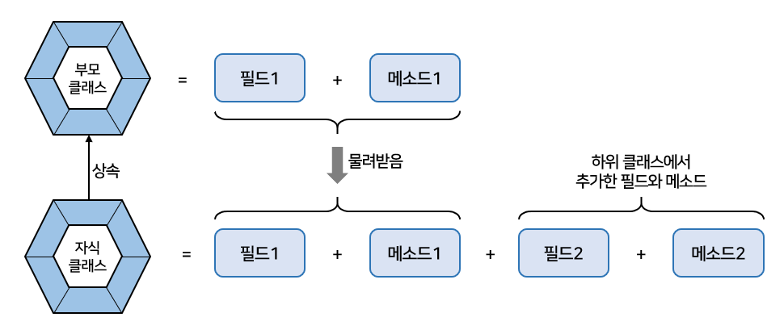

- 상속은 이미 잘 개발된 클래스를 재사용해서 새로운 클래스를 만든다.
  - <u>코드의 중복을 줄여준다.</u>
- field1, field2, method1(), method2()를 가지는 클래스 작성시
  - 4개를 모두 처음부터 작성하는 것보다는 field1과 method1()을 가지고 있는 클래스가 있다면?
    - 이것을 <b>상속</b>하고, field와 method2()만 추가 작성하는것이 효율적이며 개발 시간이 절약됨

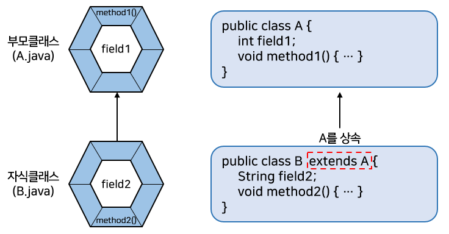

```java
// B 클래스를 객체 생성해서 사용할 때 마치 B가 field1과 method1() 을 가지고 있는 것처럼 보인다.
B b = new B();
b.field1 = 10;		// A로부터 물려받은 필드
b.method1();		// A로부터 물려받은 메소드

b.field2 = "홍길동"; // B가 추가한 필드
b.method2();		// B가 추가한 메소드
```

- <u>상속을 해도 부모 클래스의 모든 필드와 메소드들을 물려받는 것은 아니다.</u> 
  - 부모 클래스에서 private 접근 제한을 갖는 필드와 메소드는 상속 대상에서 제외
- 부모 클래스와 자식 클래스가 다른 패키지에 존재한다면 default 접근 제한을 갖는 필드와 메소드도 상속 대상에서 제외된다.
  - 그 이외의 경우는 모두 상속의 대상
- 상속을 이용하면 클래스의 수정을 최소화시킬 수 있다.
  - 부모 클래스의 수정으로 모든 자식 클래스들의 수정 효과를 가져옴
    - <u>유지 보수 시간을 최소화</u>시켜준다.
  - ex) 클래스 B, C가 클래스 A를 상속할 경우
    - A의 필드와 메소드를 수정함으로써 B, C를 수정하지 않아도 수정된 A의 필드와 메소드를 이용가능

## 클래스 상속

- 현실과 달리 프로그램에서는 <u>자식이 부모를 선택</u>
  - 자식 클래스를 선언할 때 어떤 부모 클래스를 상속받을 것인지를 결정
- 선택된 부모 클래스는 extends 뒤에 기술

```java
class 자식클래스 extends 부모클래스 {
    // 필드
    // 생성자
    // 메소드
}
```

- Car 클래스를 상속해서 SportsCar 클래스 설계시

```java
class SportsCar extends Car {
}
```

- 자바는 <u>다중 상속을 허용하지 않는다.</u>
  - 즉, 여러 개의 부모 클래스를 상속할 수 없다.
  - extends 뒤에는 <u>단 하나의 부모 클래스만</u> 와야한다.

```java
class 자식클래스 extends 부모클래스1 { // , 부모클래스2 는 오지 못함.
}
```

- 핸드폰(CellPhone) 클래스를 상속해서 DMB폰(DmbCellPhone) 클래스가 작성된 예

```java
// CellPhone.java 부모 클래스
public class CellPhone {
    // 필드
    String model;
    String color;

    // 생성자

    // 메소드
    void powerOn() {
        System.out.println("전원을 켭니다.");
    }

    void powerOff() {
        System.out.println("전원을 끕니다.");
    }
    
    void bell() {
        System.out.println("벨이 울립니다.");
    }

    void sendVoice(String message) {
        System.out.println("자기: " + message);
    }
    
    void receiveVoice(String message) {
        System.out.println("상대방: " + message);
    }
    
    void hangUp() {
        System.out.println("전화를 끊습니다.");
    }
}
```

```java
// DmbCellPhone.java 자식 클래스
public class DmbCellPhone extends CellPhone {
    // 필드
    int channel;

    // 생성자
    DmbCellPhone(String model, String color, int channel) {
        this.model = model;	// CellPhone으로부터 상속받은 필드
        this.color = color; // CellPhone으로부터 상속받은 필드
        this.channel = channel;
    }

    // 메소드
    void turnOnDmb() {
        System.out.println("채널 " + channel + "번 DMB 방송 수신을 시작합니다.");
    }

    void changeChannelDmb(int channel) {
        this.channel = channel;
        System.out.println("채널 " + channel + "번으로 바꿉니다.");
    }

    void turnOffDmb() {
        System.out.println("DMB 방송 수신을 멈춥니다.");
    }
}
```

```java
//DmbCellPhoneExample.java 자식 클래스 사용
public class DmbCellPhoneExample {

    public static void main(String[] args) {
        // DmbCellPhone 객체 생성
        DmbCellPhone dmbCellPhone = new DmbCellPhone("자바폰", "검정", 10);

        // CellPhone으로부터 상속받은 필드
        System.out.println("모델: " + dmbCellPhone.model);
        System.out.println("색상: " + dmbCellPhone.color);

        // DmbCellPhone의 필드
        System.out.println("채널: " + dmbCellPhone.channel);

        // CellPhone으로부터 상속받은 메소드 호출
        dmbCellPhone.powerOn();
        dmbCellPhone.bell();

        dmbCellPhone.sendVoice("여보세요");
        dmbCellPhone.receiveVoice("안녕하세요! 저는 홍길동인데요");
        dmbCellPhone.sendVoice("아~ 예 반갑습니다.");
        dmbCellPhone.hangUp();

        // DmbCellPhone의 메소드 호출
        dmbCellPhone.turnOnDmb();
        dmbCellPhone.changeChannelDmb(12);
        dmbCellPhone.turnOffDmb();
    }

}
```

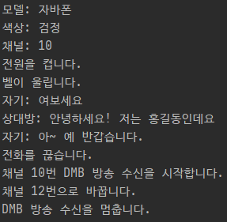

## 부모 생성자 호출

- 현실에서 부모 없는 자식이 있을 수 없듯 자바에서도 마찬가지
  - 자식 객체를 생성하면, <u>부모 객체가 먼저 생성되고 자식 객체가 그 다음에 생성</u>
- 아래의 코드는 DmbCellPhone 객체만 생성하는 것이 아니다.
  - <u>내부적으로 부모인 CellPhone 객체가 먼저 생성되고, DmbCellPhone 객체가 생성</u>

```java
DmbCellPhone dmbCellPhone = new DmbCellPhone();
```

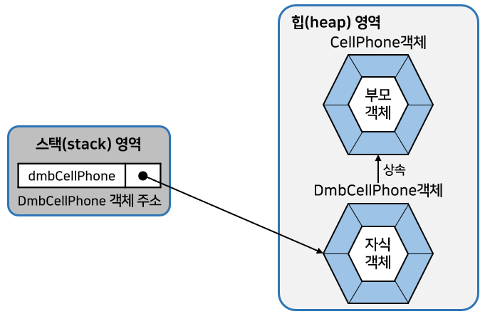

- <u>모든 객체는 클래스의 생성자를 호출해야만 생성</u>된다.
  - 부모 객체도 예외는 아니다.
- <u>부모 생성자는 자식 생성자의 맨 첫 줄에서 호출</u>된다.
  - ex) DmbCellPhone의 생성자가 명시적으로 선언되지 않았다면?
    - 컴파일러는 기본 생성자를 생성해낸다.

```java
public DmbCellPhone() {
    super();
}
```

- super()는 부모의 기본 생성자를 호출한다.
  - 즉, CellPhone 클래스의 아래 생성자를 호출

```java
public CellPhone() {
}
```

- 부모인 CellPhone.java 소스 코드에서도 CellPhone의 생성자가 선언되지 않아도 된다.
  -  컴파일러에 의해 기본 생성자가 만들어지므로 문제없이 실행
- 만약 직접 자식 생성자를 선언하고 명시적으로 부모 생성자를 호출하고 싶다면?
  - 아래와 같이 작성

```java
자식클래스( 매개변수선언, ... ) {
    super ( 매개값, ... );
    ...
}
```

- super(매개값, ...)는 매개값의 타입과 일치하는 부모 생성자를 호출한다.
  - 만약 매개값의 타입과 일치하는 부모 생성자가 없을 경우 컴파일 오류가 발생한다.
- super(매개값, ...)가 생략되면 컴파일러에 의해 super()가 자동적으로 추가된다.
  - 그렇기 때문에 부모의 기본 생성자가 존재해야 한다.
- 부모 클래스에 기본 생성자가 없고 매개 변수가 있는 생성자만 있다면?
  - <u>자식 생성자에서 반드시</u> 부모 생성자 호출을 위해 super(매개값, ...)를 <u>명시적으로 호출</u>해야 한다.
- super(매개값, ...)는 반드시 자식 생성자 첫 줄에 위치해야 한다.
  - 그렇지 않으면 컴파일 에러 발생

```java
// People.java 부모 클래스
public class People {
    public String name;
    public String ssn;
    
    public People(String name, String ssn) {
        this.name = name;
        this.ssn = ssn;
    }
}
```

- People 클래스는 기본 생성자가 없다.
  - name과 ssn을 매개값으로 받아 객체를 생성시키는 생성자만 있다.
- People을 상속하는 Student 클래스는 생성자에서 super(name, ssn)으로 People 클래스의 생성자를 호출해야 한다.

```java
// Student.java 자식 클래스
public class Student extends People {
    public int studentNo;

    public Student(String name, String ssn, int studentNo) {
        super(name, ssn);		// 부모 생성자 호출
        this.studentNo = studentNo;
    }
}
```

- 위 코드에서 Student 클래스의 생성자는 name, ssn, studentNo를 매개값으로 받는다.
  - 그리고 name과 ssn은 부모 생성자를 호출하기 위해서 다시 매개값으로 넘겨준다.

- `super(name, ssn)`은 People 생정자인 People(String name, String ssn)을 호출한다.
  - 해당 라인을 주석처리하면?
    - "Implicit super constructor People() is undefined. Must explicitly inovoke another constructor" 라는 컴파일 오류가 발생
    - 부모의 기본 생성자가 없으니 다른 생성자를 명시적으로 호출하라는 뜻

```java
// StudentExample.java 자식 객체 이용
public class StudentExample {

    public static void main(String[] args) {
        Student student = new Student("홍길동", "123456-1234567", 1);
        System.out.println("name : " + student.name);	// 부모에서 물려받은 필드 출력
        System.out.println("ssn : " + student.ssn);		// 부모에서 물려받은 필드 출력
        System.out.println("studentNo : " + student.studentNo);
    }

}
```

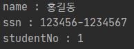

## 메소드 재정의

- 부모 클래스의 모든 메소드가 자식 클래스에게 맞게 설계되어 있다면 가장 이상적인 상속
  - 하지만 어떤 메소드는 자식 클래스가 사용하기에 적합하지 않을 수도 있다.
    - 이런 경우, 상속된 <u>일부 메소드는 자식 클래스에서 다시 수정</u>해서 사용해야 한다.
  - 그래서 자바는 메소드 <b>오버라이딩(Overriding)</b>기능을 제공

### 메소드 재정의(@Override)

- <b>메소드 오버라이딩</b>이란?
  - 상속된 메소드의 내용이 자식 클래스에 맞지 않을 경우, 자식 클래스에서 <u>동일한 메소드를 재정의</u>하는 것
- 메소드가 오버라이딩 되었다면 부모 객체의 메소드는 숨겨진다.
  - 그러므로 자식 객체에서 메소드를 호출하면 오버라이딩된 자식 메소드가 호출된다.

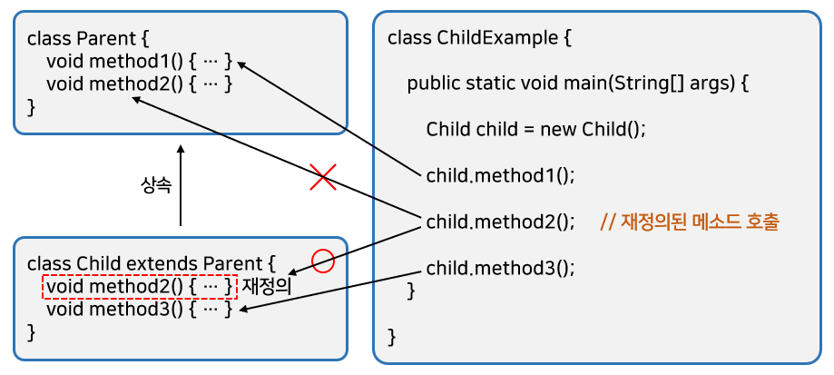

- 메소드를 오버라이딩할 때는 아래와 같은 규칙에 주의해서 작성
  - 부모의 메소드와 동일한 시그너처(리턴 타입, 메소드 이름, 매개 변수 리스트)를 가져야 한다.
  - 접근 제한을 더 강하게 오버라이딩할 수 없다.
  - 새로운 예외(Exception)을 throws할 수 없다.
- 접근 제한을 더 강하게 오버라이딩할 수 없다?
  - 만약 부모 메소드가 public 접근 제한을 가지고 있을 경우
    - 오버라이딩하는 자식 메소드는 default나 private 접근 제한으로 수정할 수 없다는 뜻
  - 반대로는 가능.  
    만약 부모 메소드가 default 접근 제한을 가진다면?
    - 재정의되는 자식 메소드는 default또는 public 접근 제한을 가질 수 있다.
- 좀 더 정확한 원의 넓이를 구하도록 오버라이딩 된 예제

```java
// Calculator.java 부모 클래스
public class Calculator {
    double areaCircle(double r) {
        System.out.println("Calculator 객체의 areaCircle() 실행");
        return  3.14159 * r * r;
    }
}
```

```java
// Computer.java 자식 클래스
public class Computer extends Calculator{
    @Override	// 정확히 오버라이딩된 것인지 컴파일러가 체크함
    double areaCircle(double r) {
        System.out.println("Computer 객체의 areaCircle() 실행");
        return Math.PI * r * r;
    }
}
```

- 위에서 Calculator의 areaCircle() 메소드는 파이의 값을 3.14159로 계산하였다.
  - 하지만 좀 더 정밀한 계산을 위해 Computer의 areaCircle() 메소드는 Math.PI 상수를 이용
  - Math는 수학 계산과 관련된 필드와 메소드들을 가지고 있는 클래스로, 자바 표준 API를 제공
- `@Override`어노테이션은 생략해도 좋다.
  - 하지만 이것을 붙여주게 되면 areaCircle() 메소드가 정확히 오버라이딩된 것인지 컴파일러가 체크한다.
    - <u>개발자의 실수를 줄여준다.</u>
  - ex) 개발자가 areaCircl() 처럼 끝에 e를 빼먹게 되면 컴파일 에러가 발생

```java
// ComputerExample.java 메소드 오버라이딩 테스트
public class ComputerExample {

    public static void main(String[] args) {
        int r = 10;

        Calculator calculator = new Calculator();
        System.out.println("원면적 : " + calculator.areaCircle(r));
        System.out.println();


        Computer computer = new Computer();
        System.out.println("원면적 : " + computer.areaCircle(r));	// 재정의된 메소드 호출
    }

}
```

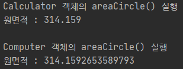

### 부모 메소드 호출(super)

- 자식 클래스에서 부모 클래스의 메소드를 오버라이딩하게 된다면?
  - 부모 클래스의 메소드는 숨겨지고 오버라이딩된 자식 메소드만 사용된다.
- 그러나 <u>자식 클래스 내부에서 오버라이딩된 부모 클래스의 메소드를 호출해야 하는 상황</u>이 발생한다면?
  - <u>명시적으로 super 키워드를 붙여서 부모 메소드를 호출</u>할 수 있다.
  - super는 부모 객체를 참조하고 있기 때문에 부모 메소드에 직접 접근할 수 있다.

```java
super.부모메소드();
```

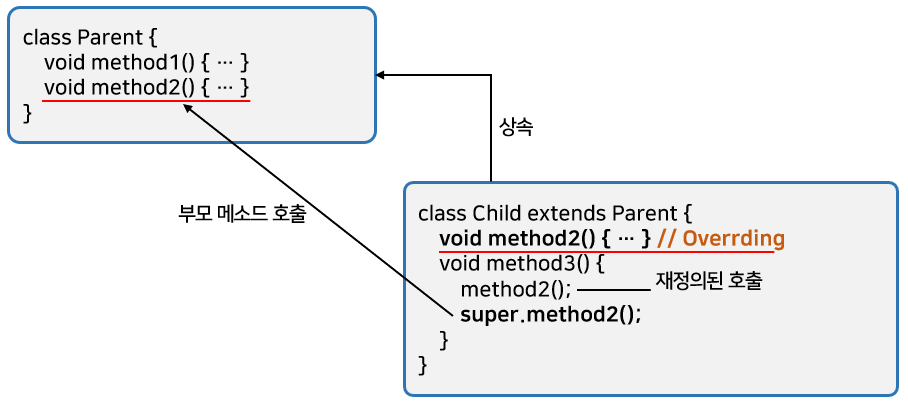

- 예제

```java
// Airplane의 fly() 메소드는 일반 비행이지만
// SupersonicAirplane의 fly()는 초음속 비행 모드와 일반 비행 모드 두가지로 동작하도록 설계됨

// Airplane.java
public class Airplane {
    public void land() {
        System.out.println("착륙합니다.");
    }

    public  void fly() {
        System.out.println("일반비행합니다.");
    }

    public void takeOff() {
        System.out.println("이륙합니다.");
    }
}
```

```java
// SupersonicAirplane.java
public class SupersonicAirplane extends Airplane {
    public static final int NORMAL = 1;
    public static final int SUPERSONIC = 2;

    public int flyMode = NORMAL;

    @Override
    public void fly() { // 오버라이딩 됨
        // flyMode가 SUPERSONIC 상수값을 가질 경우에는 "초음속비행합니다."를 출력
        if (flyMode == SUPERSONIC) {
            System.out.println("초음속비행합니다.");
        } else { 
            // Airplane 객체의 fly() 메소드 호출
            super.fly();
        }
    }
}
```

```java
// SupersonicAirplaneExample.java
public class SupersonicAirplaneExample {

    public static void main(String[] args) {
        SupersonicAirplane sa = new SupersonicAirplane();
        sa.takeOff();;
        sa.fly();
        sa.flyMode = SupersonicAirplane.SUPERSONIC;
        sa.fly();
        sa.flyMode = SupersonicAirplane.NORMAL;
        sa.fly();
        sa.land();
    }

}
```

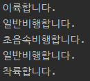

## final 클래스와 final 메소드

- final 키워드는 클래스, 필드, 메소드 선언 시에 사용할 수 있다.
  - <b>final 키워드</b>는 <u>해당 선언이 최종상태이고, 결코 수정될 수 없음</u>을 뜻한다.
- final 키워드가 클래스, 필드, 메소드 선언에 사용될 경우 해석이 조금씩 달라진다.
  - 필드 선언 시에 final이 지정되면 초기값 설정 후, 더 이상 값을 변경할 수 없다.
- 클래스와 메소드와 final이 지정되면?
  - 상속과 관련이 있다.

### 상속할 수 없는 final 클래스

- 클래스를 선언할 때 final 키워드를 class 앞에 붙이게 된다면?
  - 이 클래스는 최종적인 클래스이므로 상속할 수 없는 클래스가 된다.
  - 즉, final 클래스는 부모 클래스가 될 수 없어 자식 클래스를 만들 수 없다.

```java
public final class 클래스 {...}
```

- final 클래스의 대표적인 예
  - 자바 표준 API에서 제공하는 String 클래스
  - String 클래스는 아래와 같이 선언되어 있다.

```java
public final class String {...}
```

- 아래처럼 자식 클래스를 만들 수 없다.

```java
public class NewString extends String {...} // X
```

- 아래 예제는 Member 클래스 선언 시 final을 지정
  - 그러므로 Member를 상속해서 VeryVeryImportantPerson을 선언할 수 없다.

```java
// Member.java 상속할 수 없는 final 클래스
public final class Member {
}
```

```java
// VeryVeryImportantPerson.java
// Member를 상속할 수 없음.
public class VeryVeryImportantPerson extends Member { // X
}
```

### 오버라이딩 할 수 없는 final 메소드

- 메소드를 선언할 때 final 키워드를 붙이게 된다면?
  - 이 메소드는 최종적인 메소드이므로 오버라이딩(Overriding)할 수 없는 메소드가 된다.
  - 즉, 부모 클래스에 선언된 final 메소드는 자식 클래스에서 재정의할 수 없다.

```java
public final 리턴타입 메소드( [매개변수, ...] ) {...}
```

- 아래의 예제는 Car 클래스의 stop() 메소드를 final로 선언
  - 그러므로 Car를 상속한 SportsCar 클래스에서 stop() 메소드를 오버라이딩할 수 없다.

```java
// Car.java 재정의할 수 없는 final 메소드
public class Car {
    // 필드
    public int speed;

    // 메소드
    public void speedUp() {
        speed += 1;
    }

    // final 메소드
    public final void stop() {
        System.out.println("차를 멈춤");
        speed = 0;
    }
}
```

```java
// SportsCar.java
public class SportsCar extends Car {
    @Override
    public void speedUp() {
        speed += 10;
    }

    // 오버라이딩을 할 수 없음-----------------
    @Override
    public void stop() {
        System.out.println("스포츠카를 멈춤");
        speed = 0;
    }
}
```

## protected 접근 제한자

- 접근 제한자는 public, protected, default, private와 같이 네 가지 종류가 있다.

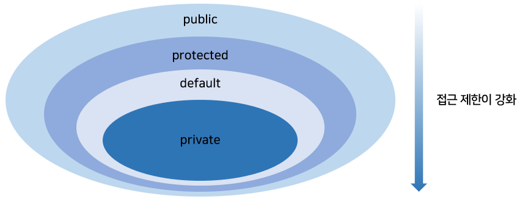

| 접근 제한 | 적용할 내용                  | 접근할 수 없는 클래스                          |
| --------- | ---------------------------- | ---------------------------------------------- |
| public    | 클래스, 필드, 생성자, 메소드 | 없음                                           |
| protected | 필드, 생성자, 메소드         | 자식 클래스가 아닌 다른 패키지에 소속된 클래스 |
| default   | 클래스, 필드, 생성자, 메소드 | 다른 패키지에 소속된 클래스                    |
| private   | 필드, 생성자, 메소드         | 모든 외부 클래스                               |

- protected는 public과  default 접근 제한의 중간쯤에 해당
- 같은 패키지에서는 default와 같이 접근 제한이 없지만 <u>다른 패키지</u>에서는 <u>자식 클래스만 접근을 허용</u>한다.

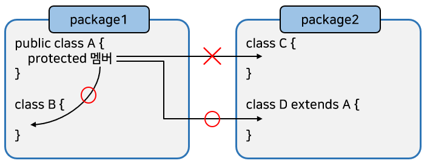

- protected는 필드와 생성자, 메소드 선언에 사용될 수 있다.

```java
package package1;

public class A {
    protected String field; // protected로 선언된 필드
    
    protected A() { // protected로 선언된 생성자
    }
    
    protected void method() { // protected로 선언된 메소드
    }
}
```

- 아래의 B 클래스는 A 클래스와 동일한 패키지에 있다.
  - 그러므로 default 접근 제한과 마찬가지로 B 클래스의 생성자와 메소드에서는 A 클래스의 protected 필드, 생성자, 메소드에 얼마든지 접근이 가능

```java
package package1;

public class B {
    public void method() {
        A a = new A();
        a.field = "value";
        a.method();
    }
}
```

- 아래의 C 클래스는 A 클래스와 다른 패키지에 있다.
  - default 접근 제한과 마찬가지로 C 클래스의 생성자와 메소드에서는 A 클래스의 protected 필드, 생성자, 메소드에 접근할 수 없다.

```java
package package2;

import package1.A;

public class C {
    public void method() {
        A a = new A();		// X
        a.field = "value";	// X
        a.method();			// X
    }
}
```

- 아래의 D 클래스는 A 클래스와 다른 패키지에 있다.
  - 그런데 C 클래스와는 달리 <u>D는 A의 자식 클래스</u>이다.
    - 그렇기 때문에 A 클래스의 protected 필드, 생성자, 메소드에 접근이 가능하다.
  - 자식 생성자에서 super()로 A 생성자를 호출할 수 있다.

```java
package package2;

import package1.A;

public class D extends A {
    public D {
        super();
        this.field = "value";
        this.method();
    }
}
```

## 타입 변환과 다형성

- 다형성이란?
  - 같은 타입이지만 실행 결과가 다양한 객체를 이용할 수 있는 성질
- 코드 측면에서 보면 다형성은 하나의 타입에 여러 객체를 대입함으로써 다양한 기능을 이용할 수 있도록 해줌
  - 다형성을 위해 자바는 부모 클래스로 <b>타입 변환</b>을 허용한다.
  - 즉, <u>부모 타입에 모든 자식 객체가 대입될 수 있다.</u>
  - 이것을 이용하면 객체는 <u>부품화</u>가 가능
- 만약 자동차를 설계할 때 타이어 클래스 타입을 적용했다면?
  - 이 클래스를 상속한 실제 타이어들은 어떤 것이든 상관없이 장착(대입)이 가능하다.

```java
public class Car {
    Tire t1 = new HankookTire();	// 타이어 타입에 자식타입의 객체를 대입함
    Tire t2 = new KumhoTire();
}
```

- 타입 변환이란?
  - 데이터 타입을 다른 데이터 타입으로 변환하는 행위
- 기본 타입의 변환뿐만 아니라 클래스 타입도 마찬가지로 타입 변환이 있다.
  - 클래스 타입의 변환은 상속 관계에 있는 클래스 사이에서 발생한다.
- <u>자식 타입은 부모 타입으로 자동 타입 변환</u>이 가능하다.
  - 위의 코드에서 HankookTire와 KumhoTire는 Tire를 상속했기 때문에 Tire 변수에 대입할 수 있다.

### 자동 타입 변환(Promotion)

- <b>자동 타입 변환(Promotion)</b>이란?
  - 프로그램 실행 도중에 자동적으로 타입 변환이 일어나는 것
  - 자동 타입 변환은 아래와 같은 조건에서 일어난다.

```
		  자동 타입 변환
		  -----------
		  ↓			|
부모클래스 변수 = 자식클래스타입
```

- 자동 타입 변환의 개념
  - 자식은 부모의 특징과 기능을 상속받기 때문에 부모와 동일하게 취급될 수 있다.
- 고양이는 동물의 특징과 기능을 상속받았다고 가정하자.
  - "고양이는 동물이다"가 성립한다.

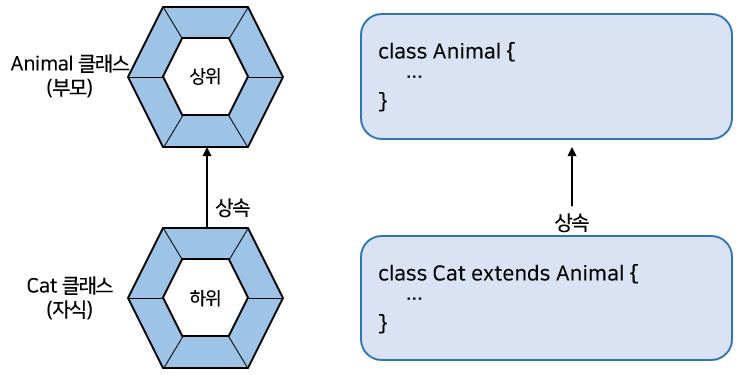

- Cat 클래스로부터 Cat 객체를 생성하고 이것을 Animal 변수에 대입하면 자동 타입 변환이 일어난다.

```java
Cat cat = new Cat();
Animal animal = cat;	// Animal animal = new Cat(); 도 가능
```

- 위 코드로 생성되는 메모리 상태를 그림으로 묘사하면 아래 그림과 같다.
  - cat과 animal 변수는 타입만 다를 뿐, 동일한 Cat 객체를 참조

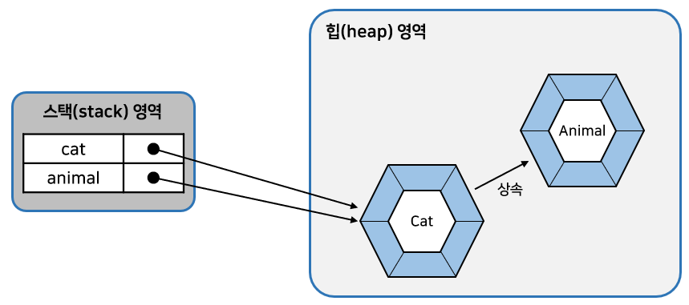


- 아래처럼 cat과 animal 변수를 == 연산해보면 true가 나온다.
  - 참조 변수의 == 연산은 참조 주소값이 같을 경우 true를 산출
    - 두 변수가 동일한 객체를 참조하고 있다는 뜻

```java
cat == animal	// true
```

- 바로 위의 부모가 아니더라도 <u>상속 계층에서 상위 타입이라면 자동 타입 변환</u>이 일어날 수 있다.

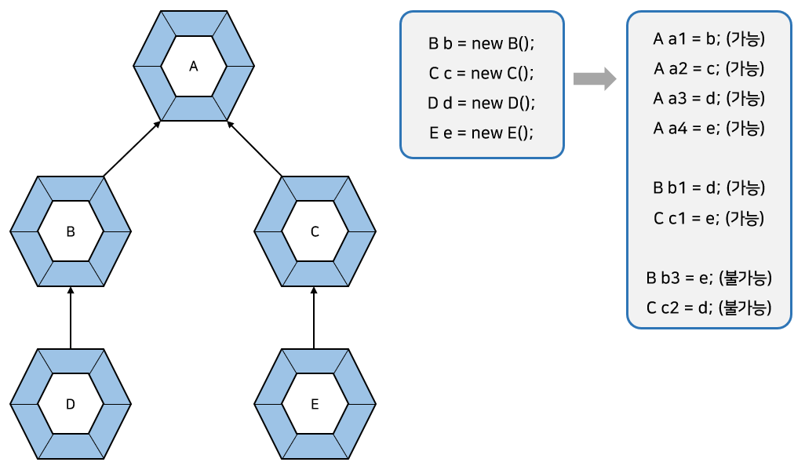

- D 객체는 B와 A 타입으로 자동 타입 변환이 될 수 있고, E 객체는 C와 A 타입으로 자동 타입 변환이 될 수 있다
- 그러나 D 객체는 C 타입으로 변환될 수 없고, 마찬가지로 E 객체는 B 타입으로 변환될 수 없다.
  - <u>상속 관계가 아니기 때문</u>

```java
class A {}

class B extends A {}
class C extends A {}

class D extends B {}
class E extends C {}

public class PromotionExample {

    public static void main(String[] args) {
        B b = new B();
        C c = new C();
        D d = new D();
        E e = new E();

        A a1 = b;
        A a2 = c;
        A a3 = d;
        A a4 = e;

        B b1 = d;
        C c1 = e;

        //B b3 = e;	◀ 컴파일 에러
        //C c2 = d;	◀ (상속 관계에 있지 않다.)
    }

}
```

- 부모 타입으로 <u>자동 타입 변환된 이후</u>에는 <u>부모 클래스에 선언된 필드와 메소드만 접근</u>이 가능하다.
  - 비록 변수는 자식 객체를 참조하지만, 변수로 접근 가능한 멤버는 부모 클래스 멤버로만 한정된다. 

- 그러나 <u>예외</u>가 있다.
  - 메<u>소드가 자식 클래스에서 오버라이딩되었다면 자식 클래스의 메소드가 대신 호출</u>
    - 이것은 <b>다형성(Polymorphism)</b>과 관련이 있기 때문에 매우 중요한 성질

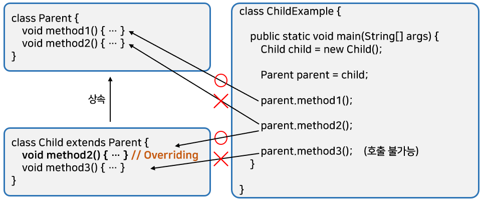

- Child 객체는 method3() 메소드를 가지고 있다.
  - 하지만 <u>Parent 타입으로 변환된 이후에는 method3()을 호출할 수 없다.</u>
- method2() 메소드는 <u>부모와 자식 모두</u>에게 있다.
  - 이렇게 <u>오버라이딩된 메소드는 타입 변환 이후에도 자식 메소드가 호출</u>된다.

```java
// Parent.java 자동 타입 변환 후의 멤버 접근
public class Parent {
    public void method1() {
        System.out.println("Parent-method1()");
    }

    public void method2() {
        System.out.println("Parent-method2()");
    }
}
```

```java
// Child.java 자동 타입 변환 후의 멤버 접근
public class Child extends Parent {
    @Override
    public void method2() {
        System.out.println("Child-method2()");
    }	// 재정의

    public void method3() {
        System.out.println("Child-method3()");
    }
}
```

```java
// ChildExample.java 자동 타입 변환 후의 멤버 접근
public class ChildExample {

    public static void main(String[] args) {
        Child child = new Child();

        Parent parent = child;	// 자동 타입 변환
        parent.method1();
        parent.method2();		// 재정의된 메소드가 호출됨
        //parent.method3();		// (호출 불가능)
    }

}
```

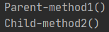

### 필드의 다형성

- 그냥 자식 타입으로 사용하면 될 것을 부모 타입으로 변환해서 사용하는 이유?
  - <u>다형성을 구현하는 기술적 방법</u> 때문

- <b>다형성</b>이란?
  - <u>동일한 타입을 사용하지만 다양한 결과가 나오는 성질</u>
- 주로 필드의 값을 다양화함으로써 실행 결과가 다르게 나오도록 구현한다.
  - 필드의 타입은 변함이 없지만, 실행 도중에 <u>어떤 객체를 필드로 저장하느냐에 따라 실행 결과가 달라질 수 있다.</u>
- 프로그램은 수많은 객체들이 서로 연결되고 각자의 역할을 하게 되는데, 이 객체들은 다른 객체로 교체될 수 있어야 한다.
- 부모 클래스를 상속하는 자식 클래스는 부모가 가지고 있는 필드와 메소드를 가지고 있다.
  - 그러므로 사용 방법이 동일할 것이고, <u>자식 클래스는 부모의 메소드를 오버라이딩(재정의)해서 메소드의 실행 내용을 변경함으로써 더 우수한 실행 결과가 나오게 할 수 있다.</u>
  - 자식 타입을 부모 타입으로 변환할 수 있다.

```java
// 필드의 다형성 예제
class Car {
    // 필드
    Tire frontLeftTire = new Tire();
    Tire frontRightTire = new Tire();
    Tire backLeftTire = new Tire();
    Tire backRightTire = new Tire();
    // 메소드
    void run() { ... }
}
```

- Car 클래스는 4개의 Tire 필드를 가지고 있다.
  - Car 클래스로부터 Car 객체를 생성하면 4개의 Tire 필드에 각각 하나씩 Tire 객체가 들어가게 된다.
- `frontRightTire`와 `backLeftTire`를 `HankookTire`와 `KumhoTire`로 교체할 필요성이 생겼다면?
  - 아래와 같은 코드를 사용해서 교체할 수 있다.

```java
Car myCar = new Car();
myCar.frontRightTire = new HankookTire();
myCar.backLeftTire = new KumhoTire();
myCar.run();
```

- Tire 클래스 타입인 `frontRightTire`와 `backLeftTire`는 원래 Tire 객체가 저장되어야 한다.
  - 하지만 Tire의 자식 객체가 저장되어도 문제가 없다.
    - 자식 타입은 부모 타입으로 자동 타입 변환이 되기 때문
- `frontRightTire`와 `backLeftTire`에 Tire 객체가 저장되어도 Car 객체는 Tire 클래스에 선언된 필드와 메소드만 사용하므로 전혀 문제가 되지 않는다.
  - `HankookTire`와 `KumhoTire`는 부모인 Tire의 필드와 메소드를 가지고 있기 때문
- Car 객체의 `run()` 메소드가 있고, `run()` 메소드는 각 Tire 객체의 `roll()` 메소드를 아래와 같이 호출한다고 가정하자.

```java
void run() {
    frontLeftTire.roll();
    frontRightTire.roll();
    backLeftTire.roll();
    backRightTire.roll();
}
```

- `frontRightTire`와 `backLeftTire`를 교체하기 전에는 Tire 객체의 roll() 메소드가 호출된다.
  - 하지만 `HankookTire`와 `KumhoTire`로 교체가 되면 `HankookTire`와 `KumhoTire`가 roll() 메소드를 재정의하고 있다.
    - 그러므로 교체 이후에는 `HankookTire`와 `KumhoTire`의 `roll()` 메소드가 호출됨
- 자동 타입 변환을 이용해서 Tire 필드값을 교체함으로써 Car의 run() 메소드 수정 없이도 다양한 roll() 메소드의 실행 결과를 얻게 된다.
  - 필드의 다형성
- 전체적인 예제

```java
// Tire.java 타이어 클래스
public class Tire {
    // 필드
    public int maxRotation;             // 최대 회전수(타이어 수명), 도달시 펑크
    public int accumulatedRotation;     // 누적 회전수, 회전마다 1씩 증가
    public String location;             // 타이어의 위치
    									// 앞왼쪽, 앞오른쪽, 뒤왼쪽, 뒤오른쪽을 구분하는 필드

    // 생성자
    public Tire(String location, int maxRotation) {
        // 타이어의 위치와 최대 회전수를 매개값으로 받아 각각의 필드에 저장
        this.location = location;
        this.maxRotation = maxRotation;
    }

    // 메소드
    // 1번 실행할 때마다 누적 회전수를 1씩 증가
    public boolean roll() {
        ++accumulatedRotation;      			// 누적 회전수 1증가
        if (accumulatedRotation < maxRotation) { // 정상 회전(누적회전수 < 최대회전수)일경우
            System.out.println(location + " Tire 수명: " +
                    (maxRotation - accumulatedRotation) + "회"); // 남은 회전수 출력
            return true; // 정상회전일 때 리턴
        } else {                                 // 펑크(누적회전수 = 최대회전수)일경우
            System.out.println("***" + location + " Tire 펑크 ***"); // 펑크 출력
            return false; // 펑크일 때 리턴
        }
    }
}
```

```java
// Car.java | Tire를 부품으로 가지는 클래스
public class Car {
    // 필드. 타이어 4개
    // 위치와 최대 회전수를 생성자의 매개값으로 지정
    Tire frontLeftTire = new Tire("앞왼쪽", 6);
    Tire frontRightTire = new Tire("앞오른쪽", 2);
    Tire backLeftTire = new Tire("뒤왼쪽", 3);
    Tire backRightTire = new Tire("뒤오른쪽", 4);
    // 자동차에 타이어 4개 장착

    //생성자

    // 메소드
    // 네 개의 타이어를 한 번씩 1회전시키는 메소드
    int run() {
        System.out.println("[자동차가 달립니다.]");
        
        // 모든 타이어를 1회전 시키기 위해 각 Tire객체의 roll()메소드 호출
        // false 리턴시 stop()메소드를 호출하고 해당 타이어 번호를 리턴(위치를 알기위해)
        if (frontLeftTire.roll() == false) {
            stop();
            return 1;
        }
        if (frontRightTire.roll() == false) {
            stop();
            return 2;
        }
        if (backLeftTire.roll() == false) {
            stop();
            return 3;
        }
        if (backRightTire.roll() == false) {
            stop();
            return 4;
        }
        return 0;
    }

    void stop() {	// 펑크나면 실행. 자동차가 멈춤
        System.out.println("[자동차가 멈춥니다.]");
    }
}
```

```java
// HankookTire.java | Tire의 자식클래스
public class HankookTire extends Tire {
    // 필드

    // 생성자
    public HankookTire(String location, int maxRotation) {
        super(location, maxRotation);
    }

    // 메소드
    @Override
    public boolean roll() { // 오버라이딩 됨. 출력 내용이 Tire클래스의 roll()과 다름
        ++accumulatedRotation;
        if (accumulatedRotation < maxRotation) {
            System.out.println(location + " HankookTire 수명: " +
                    (maxRotation - accumulatedRotation) + "회");
            return true;
        } else {
            System.out.println("***" + location + " HankookTire 펑크 ***");
            return false;
        }
    }
}
```

```java
// KumhoTire.java | Tire의 자식클래스
public class KumhoTire extends Tire {
    // 필드

    // 생성자
    public KumhoTire(String location, int maxRotation) {
        super(location, maxRotation);
    }

    // 메소드
    @Override
    public boolean roll() { // 오버라이딩 됨. 출력 내용이 Tire클래스의 roll()과 다름
        ++accumulatedRotation;
        if (accumulatedRotation < maxRotation) {
            System.out.println(location + " KumhoTire 수명: " +
                    (maxRotation - accumulatedRotation) + "회");
            return true;
        } else {
            System.out.println("*** " + location + " KumhoTire 펑크 ***");
            return false;
        }
    }
}
```

```java
// CarExample.java 실행 클래스
// Tire, Car, HankookTire, KumhoTire 클래스를 이용하는 실행 클래스
public class CarExample {

    public static void main(String[] args) {
        Car car = new Car();	// Car 객체 생성

        for (int i = 1; i <= 5; i++) {	// Car 객체의 run() 메소드 5번실행
            int problemLocation = car.run();

            switch (problemLocation) {
                case 1:				// 앞왼쪽 타이어 펑크시
                    System.out.println("앞왼쪽 HankookTire로 교체");
                    car.frontLeftTire = new HankookTire("앞왼쪽", 15);
                    break;
                case 2:				// 앞오른쪽 타이어 펑크시
                    System.out.println("앞오른쪽 KumhoTire로 교체");
                    car.frontRightTire = new KumhoTire("앞오른쪽", 13);
                    break;
                case 3:				// 뒤왼쪽 타이어 펑크시
                    System.out.println("뒤왼쪽 HankookTire로 교체");
                    car.backLeftTire = new HankookTire("뒤왼쪽", 14);
                    break;
                case 4:				// 뒤오른쪽 타이어 펑크시
                    System.out.println("뒤오른쪽 KumhoTire로 교체");
                    car.backRightTire = new KumhoTire("뒤오른쪽", 17);
                    break;
            }
            // 1회전 끝난 후 구분선
            System.out.println("-----------------------------");
        }
    }

}
```

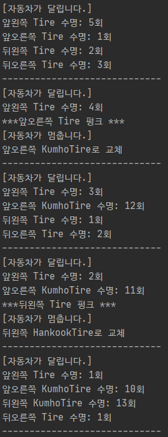

### 하나의 배열로 객체 관리

- 동일한 타입의 값들은 배열로 관리하는 것이 유리하다.
  - 그러므로 타이어 객체들도 타이어 배열로 관리하는 것이 코드를 깔끔하게 만들어줌

```java
class Car {
    Tire frontLeftTire = new Tire("앞왼쪽", 6);
    Tire frontRightTire = new Tire("앞오른쪽", 2);
    Tire backLeftTire = new Tire("뒤왼쪽", 3);		
    Tire backRightTire = new Tire("뒤오른쪽", 4);
}
//ㅡㅡㅡㅡㅡㅡㅡㅡㅡㅡㅡㅡㅡㅡㅡㅡㅡㅡㅡㅡㅡㅡㅡㅡㅡㅡㅡㅡㅡㅡ
class Car {
    Tire[] tires = {
        new Tire("앞왼쪽", 6),
        new Tire("앞오른쪽", 2),
        new Tire("뒤왼쪽", 3),
        new Tire("뒤오른쪽", 4)
    };
}
```

- `frontLeftTire`는`tires[0]`,
- `frontRightTire`는 `tires[1]`, 
- `backLeftTire`는 `tires[2]`,
- `backRightTire`는 `tires[3]`과 같이 인덱스로 표현되므로 대입이나 제어문에서 활용하기 매우 쉽다.
  - ex) 인덱스 1을 이용해서 앞오른쪽 타이어를 KumhoTire로 교체하기 위해 아래처럼 작성할 수 있다.

```java
tires[1] = new KumhoTire("앞오른쪽", 13);
```

- tires 배열의 각 항목은 Tire 타입이다.
  - 자식 객체인 KumhoTire를 대입하면 자동 타입 변환이 발생하기 때문에 아무런 문제가 없다.
  - 배열의 타입은 Tire이지만 실제 저장 항목이 Tire의 자식 객체라면 모두 가능하다.
- 상속 관계에 있는 객체들을 배열로 관리하면 제어문에서 가장 많이 혜택을 본다.

```java
// 전체 타이어의 roll() 메소드를 호출하는 Car 클래스의 run() 메소드는 for문으로 작성가능
int run() {
    System.out.println("[자동차가 달립니다.]");
    for (int i = 0; i < tires.length; i++) {
        if (tires[i].roll() == false) {
            stop();
            return (i + 1);
        }
    }
    return 0;
}
```

- Car 클래스의 타이어 필드를 배열로 수정

```java
// Car.java
public class Car {
    // 필드
    Tire[] tires = {
            new Tire("앞왼쪽", 6),
            new Tire("앞오른쪽", 2),
            new Tire("뒤왼쪽", 3),
            new Tire("뒤오른쪽", 4)
    };

    // 생성자

    // 메소드
    int run() {
        System.out.println("[자동차가 달립니다.]");
        for (int i = 0; i < tires.length; i++) {
            if (tires[i].roll() == false) {
                stop();
                return (i + 1);
            }
        }
        return 0;
    }

    void stop() {
        System.out.println("[자동차가 멈춥니다.]");
    }
}
```

- Car 클래스를 이용하는 CarExample 클래스도 간결하게 수정할 수 있다.

```java
// CarExample.java | 실행 클래스
public class CarExample {

    public static void main(String[] args) {
        Car car = new Car();

        for (int i = 1; i <= 5; i++) {
            int problemLocation = car.run();	// 1~4까지의 값을 가짐

            if (problemLocation != 0) {
                System.out.println(car.tires[problemLocation - 1].location +
                                   " HankookTire로 교체"); // 인덱스는 0~3까지
                car.tires[problemLocation - 1] =
                        new HankookTire(car.tires[problemLocation - 1].location, 15);
            }
            System.out.println("-----------------------------");
        }
    }

}
```

### 매개 변수의 다형성

- <b>자동 타입 변환</b>은 주로 메소드를 호출할 때 많이 발생</u>
- 메소드를 호출할 때에는 매개 변수의 타입과 동일한 매개값을 지정하는 것이 정석
  - <u>매개값을 다양화하기 위해 매개 변수에 자식 타입 객체를 지정할 수도 있다.</u>

```java
class Driver {
    void drive(Vehicle vehicle) { // Vehicle 타입의 매개 변수가 선언되어 있다.
        vehicle.run();
    }
}
```

```java
// drive 메소드를 정상적으로 호출할때
Driver driver = new Driver();
Vehicle vehicle = new Vehicle();
driver.dirve(vehicle);
```

- 만약 Vehicle의 자식 클래스인 Bus 객체를 drive() 메소드의 매개값으로 넘겨준다면?

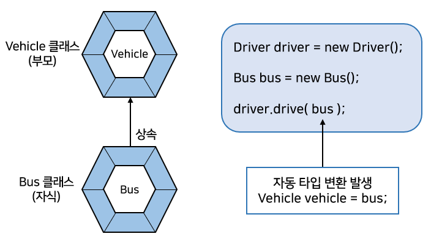

- drive() 메소드는 Vehicle 타입을 매개 변수로 선언했지만, Vehicle을 상속받는 Bus 객체가 매개값으로 사용되면 자동 타입 변환이 발생한다.

```java
Vehicle vehicle = bus;
```

- <b>매우 중요한 것</b>
  - 매개 변수의 타입이 클래스일 경우, 해당 클래스의 객체뿐만 아니라 <u>자식 객체까지도 매개값으로 사용할 수 있다</u>
- 매개값으로 어떤 자식 객체가 제공되느냐에 따라 메소드의 실행 결과는 다양해질 수 있다(매개 변수의 다형성).
- <u>자식 객체가 부모의 메소드를 재정의(오버라이딩)했다면</u> 메소드 내부에서 오버라이딩된 메소드를 호출함으로써 <u>메소드의 실행 결과는 다양</u>해진다.

```java
		| 자식 객체 |
void drive(Vehicle vehicle) {
    vehicle.run();	// 자식 객체가 재정의한 run() 메소드 실행
}
```

- 전체 예제

```java
// Vehicle.java 부모 클래스
public class Vehicle {
    public void run() {
        System.out.println("차량이 달립니다.");
    }
}
```

```java
// Driver.java | Vehicle을 이용하는 클래스
public class Driver {
    // drive() 메소드에서 Vehicle 타입의 매개값을 받아 run() 메소드를 호출
    public void drive(Vehicle vehicle) {
        vehicle.run();
    }
}
```

```java
// Bus.java 자식 클래스
public class Bus extends Vehicle {
    // Vehicle 클래스를 상속받아 run() 메소드를 오버라이딩 
    @Override
    public void run() {
        System.out.println("버스가 달립니다.");
    }
}
```

```java
// Taxi.java 자식 클래스
public class Taxi extends Vehicle {
    // Vehicle 클래스를 상속받아 run() 메소드를 오버라이딩 
    @Override
    public void run() {
        System.out.println("택시가 달립니다.");
    }
}
```

```java
// DriverExample.java 실행 클래스
public class DriverExample {

    public static void main(String[] args) {
        Driver driver = new Driver();

        Bus bus = new Bus();
        Taxi taxi = new Taxi();

        driver.drive(bus);	// 자동 타입 변환 : Vehicle vehicle = bus;
        driver.drive(taxi);	// 자동 타입 변환 : Vehicle vehicle = taxi;
    }

}
```

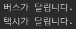

- 매개타입은 Vehicle이지만 각각 Bus객체와 Taxi 객체의 run() 메소드의 실행 결과가 나온다.
  - 매개값의 <u>자동 타입 변환과 메소드 오버라이딩을 이용해서 매개변수의 다형성을 구현</u>할 수 있다.

### 강제 타입 변환(Casting)

- <b>강제 타입 변환(Casting)</b>이란?
  - <u>부모 타입을 자식 타입으로 변환</u>하는 것
  - 모든 부모 타입을 자식 클래스 타입으로 강제 변환할 수 있는 것은 아니다.
- <u>자식 타입이 부모 타입으로 자동 변환한 후, 다시 자식 타입으로 변환할 때</u> 강제 타입 변환을 사용할 수 있다.

```java
자식클래스 변수 = (자식클래스) 부모클래스타입;
//							└-→ 자식 타입이 부모 타입으로 변환된 상태
```

- 자식 타입이 부모 타입으로 자동 변환하면, 부모 타입에 선언된 필드와 메소드만 사용 가능하다.
- 자식 타입에 선언된 필드와 메소드를 꼭 사용해야 한다면?
  - 강제 타입 변환을 해서 다시 자식 타입으로 변환한 다음 자식 타입의 필드와 메소드를 사용하면 된다.

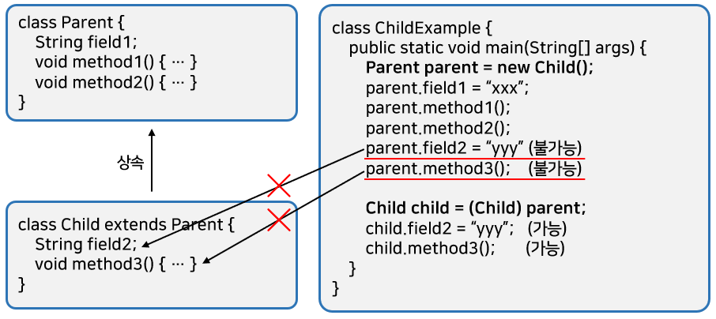

- field2 필드와 method3() 메소드는 Child 타입에만 선언되어 있으므로 Parent 타입으로 자동 타입변환하면 사용할 수 없다.
  - 그러므로 field2 필드와 method3() 메소드를 사용하고 싶다면 <u>다시 Child 타입으로 강제 타입 변환</u>을 해야한다.

```java
// Parent.java 부모 클래스
public class Parent {
  public String field1;

  public void method1() {
    System.out.println("Parent-method1()");
  }

  public void method2() {
    System.out.println("Parent-method2()");
  }
}
```

```java
// Child.java 자식 클래스
public class Child extends Parent {
  public String field2;

  public void method3() {
    System.out.println("Child-method3()");
  }
}
```

```java
// ChildExample.java 강제 타입 변환(캐스팅)
public class ChildExample {

  public static void main(String[] args) {
    Parent parent = new Child();
    parent.field1 = "data1";
    parent.method1();
    parent.method2();
    /*
    parent.field2 = "data2";  // 불가능
    parent.method3();         // 불가능
     */
    
    Child child = (Child) parent;
    child.field1 = "yyy";     // 가능
    child.method3();          // 가능
  }
  
}
```

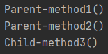

### 객체 타입 확인(instanceof)

- <b>강제 타입 변환</b>은 <u>자식 타입이 부모 타입으로 변환되어 있는 상태</u>에서만 가능하다.
  - 아래와 같이 부모 타입의 변수가 부모 객체를 참조할 경우 자식 타입으로 변환할 수 없다.

```java
Parent parent = new Parent();
Child child = (Child) parent;	// 강제 타입 변환을 할 수 없음
```

- 어떤 객체가 <u>어떤 클래스의 인스턴스인지 확인</u>하려면 <b>instanceof 연산자</b>를 사용할 수 있다.
  - instanceof 연산자의 좌항은 객체가 오고, 우항은 타입이 온다.
  - 좌항의 객체가 우항의 인스턴스이면 true, 아니면 false를 산출한다.
  - 즉, 우항의 타입으로 객체가 생성되었다면 true, 아니면 false이다.

```java
boolean result = 좌항(객체) instanceof 우항(타입)
```

- instanceof 연산자는 매개값의 타입을 조사할 때 주로 사용된다.
- 메소드 내에서 <u>강제 타입 변환</u>이 필요할 경우 <b>반드시</b> <u>매개값이 어떤 객체인지 instanceof 연산자로 확인</u>하고 안전하게 강제 타입 변환을 해야 한다.

```java
//							┌ Parent객체 혹은 Child객체
public void method(Parent parent) {
    if (parent instanceof Child) {	// Parent 매개 변수가 참조하는 객체가 Child인지 조사
        Child child = (Child) parent;
    }
}
```

- 타입을 확인하지 않고 강제 타입 변환을 시도한다면?
  - ClassCastException 예외가 발생할 수 있다.
- 아래 예제에서 InstanceofExample 클래스에서 method1()과 method2()는 모두 Parent 타입의 매개값을 받도록 선언되어있다.

```java
// Parent.java 부모 클래스
public class parent{
}
```

```java
// Child.java 자식 클래스
public class Child extends Parent {
}
```

```java
// InstanceofExample.java 객체 타입 확인
public class InstanceofExample {

  public static void method1(Parent parent) {
    if (parent instanceof Child) {  // Child 타입으로 변환이 가능한지 확인
      Child child = (Child) parent;
      System.out.println("method1 - Child로 변환 성공");
    } else {
      System.out.println("method1 - Child로 변환되지 않음");
    }
  }

  public static void method2(Parent parent) {
    Child child = (Child) parent; // ClassCastException 발생 가능성이 있다.
    System.out.println("method2 - Child로 변환 성공");
  }

  public static void main(String[] args) {
    Parent parentA = new Child();
    method1(parentA);
    method2(parentA);
    
    Parent parentB = new Parent();
    method1(parentB);
    method2(parentB); // 예외 발생
  }

}
```

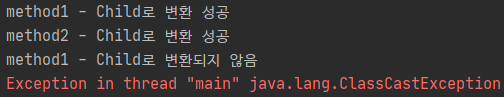

- InstanceofExample 클래스에서 method1()과 method2()를 호출할 경우
  - Child 객체를 매개값으로 전달하면 두 메소드 모두 예외가 발생하지 않는다.
  - 하지만 Parent 객체를 매개값으로 전달하면 method2() 에서는 ClassCastException이 발생한다.
    - method1()은 instanceof 연산자로 변환이 가능한지 확인한 후 변환을 하지만, method2()는 무조건 변환하려고 했기 때문
- 예외가 발생하면 프로그램은 즉시 종료된다.
  - 그러므로 method1()과 같이 <u>강제 타입 변환을 하기 전에 instanceof 연산자로 변환시킬 타입의 객체인지 조사</u>해서 잘못된 매개값으로 인해 프로그램이 종료되는 것을 막아야 한다.

## 추상 클래스

### 추상 클래스의 개념

- 사전적 의미로 추상(abstract)은 실체 간에 <u>공통되는 특성을 추출한 것</u>을 말한다.
  - 구체적인 실체라기보다는 실체들의 <u>공통되는 특성을 가지고 있는 추상적인 것</u>
- <b>추상 클래스</b>란?
  - 클래스들의 공통적인 특성을 추출해서 선언한 클래스
- <u>추상 클래스와 실체 클래스는 상속의 관계</u>를 가지고 있다.
  - 추상 클래스가 부모이고 실체 클래스가 자식으로 구현되어 있다.
  - <u>실체 클래스는 추상 클래스의 모든 특성을 물려받고, 추가적인 특성을 가질 수 있다.</u>
    - 여기서, 특성은 필드와 메소드들
- ex) `Bird.class`, `Insect.class`, `Fish.class` 등의 실체클래스에서 공통되는 필드와 메소드를 따로 선언한 Animal.class 추상 클래스를 만들 수 있다.

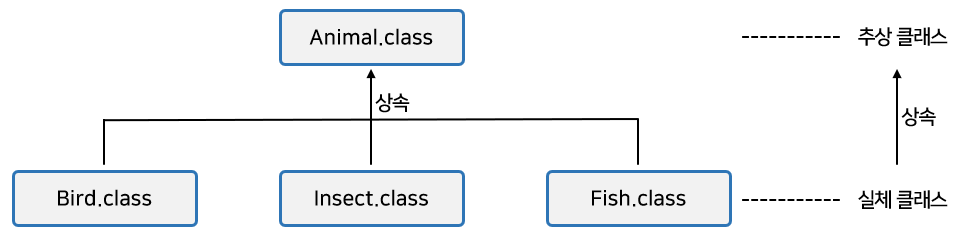

- <u>추상 클래스는</u> 실체 클래스의 공통되는 필드와 메소드를 추출해서 만든다.
  - 그렇기 때문에 객체를 <u>직접 생성해서 사용할 수 없다.</u>
  - 즉, 추상 클래스는 new 연산자를 사용해서 인스턴스를 생성시키지 못한다.

```java
Animal animal = new Animal;	( X )
```

- 추상 클래스는 새로운 실체 클래스를 만들기 위해 부모 클래스로만 사용된다.
  - 코드상으론 extends 뒤에만 올 수 있는 클래스
  - ex) Ant 클래스를 만들기 위한 Animal 클래스는 아래처럼 사용할 수 있다.

```java
class Ant extends Animal { ... }	( O )
```

### 추상 클래스의 용도

- 실체 클래스들의 공통적인 특성(필드, 메소드)을 뽑아내서 추상 클래스로 만드는 이유는 두 가지가 있다.
  - <b>첫 번째, 실체 클래스들의 공통된 필드와 메소드의 이름을 통일할 목적</b>
    - 실체 클래스를 설계하는 사람이 여러 사람일 경우,
      - 실체 클래스마다 필드와 메소드가 제각기 다른 이름을 가질 수 있다.
      - 동일한 데이터와 기능임에도 불구하고 이름이 달라 객체마다 사용 방법이 달라질수 있다.
  - <b>두 번째, 실체 클래스를 작성할 때 시간을 절약</b>
    - 공통적인 필드와 메소드는 추상 클래스에 모두 선언해 두고, 실체 클래스마다 다른 점만 실체 클래스에 선언하게 되면 <u>실체 클래스를 작성하는데 시간을 절약</u>할 수 있다.
    - 아래 그림에서 Telephone과 SmartPhone은 Phone을 상속받기 때문에 `owner` 필드와 `turnOn()` 메소드를 선언할 필요가 없다.

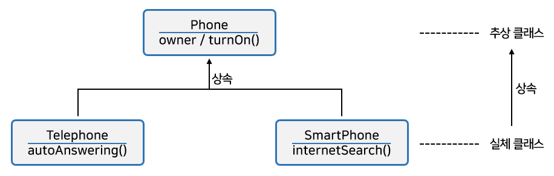


- 개발 프로젝트에서 설계자와 코더(코드를 작성하는 사람)는 일반적으로 다른사람
  - <u>설계자는 코더에게 클래스는 어떤 구조로 작성해야 한다는 것을 알려줄 필요성</u>이 있다.
  - 단순히 문서로 코더에게 전달한다면?
    - 코더가 실수로 필드와 메소드 이름을 다르게 코딩할 수 있다.
  - 코더가 작성해야 할 클래스가 다수이고, 이 클래스들이 동일한 필드와 메소드를 가져야 할 경우
    - 설계자는 이 내용들을 추려내여 <u>추상 클래스로 설계 규격</u>을 만드는 것이 좋다.  
      그리고 코더에게 추상 클래스를 상속해서 구체적인 클래스를 만들도록 지시하면 된다.

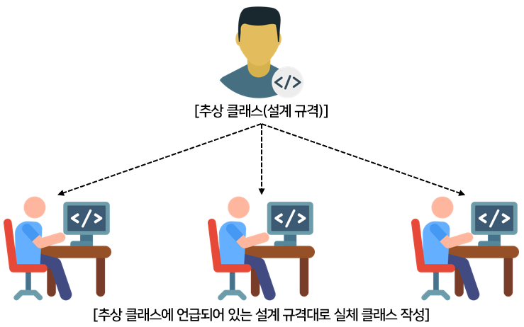

- 예로 자동차를 설계할 때에는 일반적인 타이어 규격에 맞추어서 작성
  - 일반적인 타이어 규격에 준수하는 어떠한 타이어든 부착할 수 있도록 하기 위해
- 타이어의 규격은 추상 클래스라고 볼 수 있다.
  - 타이어 규격에 준수하는 한국 타이어나 금호 타이어는 추상 클래스를 상속하는 실체 타이어 클래스라고 볼 수 있다.

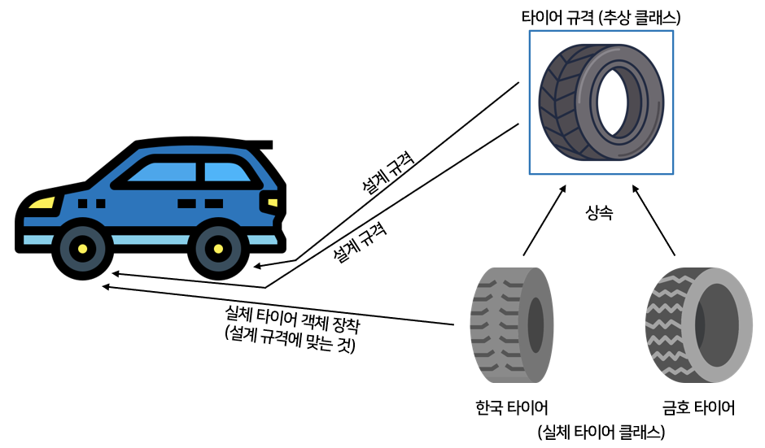

### 추상 클래스 선언

- 추상 클래스를 선언할 때에는 <u>클래스 선언에 abstract 키워드</u>를 붙여야 한다.
  - abstract를 붙이게 되면 <u>new 연산자를 이용해서 객체를 만들지 못하고 상속을 통해 자식 클래스만</u> 만들 수 있다.

```java
public abstract class 클래스 {
    // 필드
    // 생성자
    // 메소드
}
```

- 추상 클래스도 일반 클래스와 마찬가지로 필드, 생성자, 메소드 선언을 할 수 있다.
- new 연산자로 직접 생성자를 호출할 수는 없지만 자식 객체가 생성될 때 super(...)를 호출해서 추상 클래스 객체를 생성하므로 <u>추상 클래스도 생성자가 반드시 있어야 한다.</u>
- Phone 클래스를 추상 클래스로 선언한 예제

```java
// Phone.java 추상 클래스
public abstract class Phone {
  // 필드
  public String owner;

  // 생성자
  public Phone(String owner) {
    this.owner = owner;
  }

  // 메소드
  public void turnOn() {
    System.out.println("폰 전원을 켭니다.");
  }

  public void turnOff() {
    System.out.println("폰 전원을 끕니다.");
  }
}
```

- 아래는 Phone 추상 클래스를 상속해서 SmartPhone 자식 클래스를 정의한 예제
  - SmartPhone클래스의 생성자를 보면 `super(owner);` 코드로 Phone의 생성자를 호출하고 있다.

```java
// SmartPhone.java 실체 클래스
public class SmartPhone extends Phone {
  // 생성자
  public SmartPhone(String owner) {
    super(owner);
  }

  // 메소드
  public void internetSearch() {
    System.out.println("인터넷 검색을 합니다.");
  }
}
```

- 자식 클래스인 SmartPhone으로 객체를 생성해 Phone의 turnOn(), turnOff() 메소드를 사용할 수 있다.

```java
// PhoneExample.java 추상 클래스
public class PhoneExample {

  public static void main(String[] args) {
    //Phone phone = new Phone(); // Phone의 생성자를 호출해서 객체를 생성할 수 없음

    SmartPhone smartPhone = new SmartPhone("홍길동");

    smartPhone.turnOn();			// Phone의 메소드
    smartPhone.internetSearch();
    smartPhone.turnOff();			// Phone의 메소드
  }

}
```

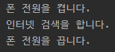

### 추상 메소드와 오버라이딩

- <b>추상 클래스</b>
  - 실체 클래스가 공통적으로 가져야 할 필드와 메소드들을 정의해 놓은 추상적인 클래스
  - <u>실체 클래스의 멤버(필드, 메소드)를 통일화하는데 목적</u>이 있다.
- 모든 실체들이 가지고 있는 메소드의 실행 내용이 동일하다면?
  - 추상 클래스에 메소드를 작성하는 것이 좋다.
- <u>하지만 메소드의 선언만 통일화</u>하고, <u>내용은 실체 클래스마다 달라</u>야 하는 경우
  - 이런 경우를 위해 <u>추상 클래스는 추상 메소드</u>를 선언할 수 있다.
- <b>추상 메소드란?</b>
  - 추상 클래스에서만 선언
  - 메소드의 선언부만</u> 있고 메소드 실행 내용인 중괄호가 없는 메소드
- 추상 클래스를 설계할 때, <u>하위 클래스가 반드시 실행 내용을 채우도록 강요하고 싶은 메소드</u>가 있을 경우?
  - 해당 메소드를 <u>추상 메소드로 선언</u>하면 된다.
  - <u>자식 클래스</u>는 <b>반드시 추상 메소드를 재정의(오버라이딩)</b>해서 실행 내용을 작성해야 한다.
    - 그렇지 않으면 컴파일 에러가 발생한다.

```java
// 추상 메소드를 선언하는 방법
[public | protected] abstract 리턴타입 메소드명(매개변수, ...);
```

- 일반 메소드 선언과의 차이점
  - abstract 키워드가 붙어 있고 메소드 중괄호 {}가 없다.

```java
// Animal 클래스를 추상 클래스로 선언하고 sound() 메소드를 추상 메소드로 선언
public abstract class Animal {
    public abstract void sound();
}
```

- 어떤 소리를 내는지는 결정할 수 없지만 동물은 소리를 낸다는 공통적인 특징이 있다.
  - 그러므로 sound() 메소드를 추상 메소드로 선언
- Animal 클래스를 상속하는 하위 클래스는 고유한 소리를 내도록 sound() 메소드를 재정의해야 한다.
  - ex) Dog는 "멍멍", Cat은 "야옹" 소리를 내도록 Dog, Cat 클래스에서 sound() 메소드를 재정의

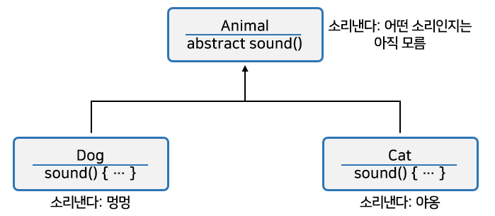

- 전체 예제

```java
// Animal.java 추상 메소드 선언
public abstract class Animal {  // 추상 클래스
  public String kind;

  public void breathe() {
    System.out.println("숨을 쉽니다.");
  }

  public abstract void sound(); // 추상 메소드 선언
}
```

- 오버라이딩한것을 주석 처리하면 컴파일 에러가 발생한다.(추상메소드 미구현)

```java
// Dog.java 추상 메소드 오버라이딩
public class Dog extends Animal { // 추상 클래스인 Animal을 상속
  public Dog() {
    this.kind = "포유류";
  }

  @Override
  public void sound() {	// 추상 메소드 재정의
    System.out.println("멍멍");
  }
}
```

```java
// Cat.java 추상 메소드 오버라이딩
public class Cat extends Animal { // 추상 클래스인 Animal을 상속
  public Cat() {
    this.kind = "포유류";
  }

  @Override
  public void sound() {	// 추상 메소드 재정의
    System.out.println("야옹");
  }
}
```

- 아래의 AnimalExample 실행 클래스는 Dog와 Cat 객체를 생성해서 sound() 메소드를 호출한다.

```java
// AnimalExample.java 실행 클래스
public class AnimalExample {

  public static void main(String[] args) {
    Dog dog = new Dog();
    Cat cat = new Cat();

    // 일반적인 방식으로 Dog와 Cat 변수로 호출
    dog.sound();
    cat.sound();
    System.out.println("-----");

    // 변수의 자동 타입 변환
    // Animal 변수로 타입 변환해서 sound() 메소드를 호출
    Animal animal = null;
    animal = new Dog();
    animal.sound();
    animal = new Cat();
    animal.sound();
    System.out.println("-----");

    // 메소드의 다형성
    // 부모 타입의 매개 변수에 자식 객체를 대입해서 메소드의 다형성이 적용
    animalSound(new Dog());
    animalSound(new Cat());
  }
// 								(자동 타입변환이 됨)
  public static void animalSound(Animal animal) {
    animal.sound();	// 재정의된 메소드 호출
  }

}
```

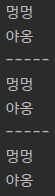

