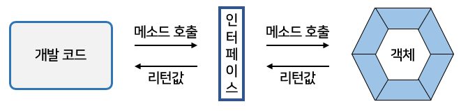

# 인터페이스

## 인터페이스의 역할

- 자바에서 <b>인터페이스(interface)</b>란?
  - <u>객체의 사용 방법을 정의한 타입</u>
- <u>인터페이스는 객체의 교환성을 높여</u>주기 때문에 <u>다형성을 구현하는 매우 중요</u>한 역할을 한다.
  - 특히 자바 8에서 인터페이스의 중요성은 더욱 커졌다.
  - 자바 8의 람다식은 함수적 인터페이스의 구현 객체를 생성하기 때문이다.
- 인터페이스(interface)는 <u>개발 코드와 객체가 서로 통신하는 접점 역할</u>을 한다.
  - 개발 코드가 인터페이스의 메소드를 호출하면 인터페이스는 객체의 메소드를 호출시킨다.  
    그렇기 때문에 개발 코드는 객체의 내부 구조를 알 필요가 없고 인터페이스의 메소드만 알고 있으면 된다.



- 개발 코드가 직접 객체의 메소드를 호출하면 간단한데, 왜 중간에 인터페이스를 둘까?
  - 그 이유는 <u>개발 코드를 수정하지 않고, 사용하는 객체를 변경할 수 있도록</u> 하기 위해서이다.
  - 인터페이스는 하나의 객체가 아니라 여러 객체들과 사용이 가능하다.
    - 그러므로 어떤 객체를 사용하느냐에 따라서 실행 내용과 리턴값이 다를 수 있다.
  - 개발 코드 측면에서는 코드 변경 없이 실행 내용과 리턴값을 다양화할 수 있다는 장점을 가지게 된다.


## 인터페이스 선언

- 인터페이스는 "~.java" 형태의 소스 파일로 작성되고 컴파일러(javac.exe)를 통해서 "~.class" 형태로 컴파일되기 때문에 물리적인 형태는 클래스와 동일하다.
- 차이점은 소스를 작성할 때 선언하는 방법이 다르다.

### 인터페이스 선언

- 인터페이스 선언은 class 키워드 대신에 <b>interface 키워드</b>를 사용한다.

```java
[ public ] interface 인터페이스명 { ... }
```

- 인터페이스 이름은 클래스 이름을 작성하는 방법과 동일하다.
  - 영어 대소문자를 구분하며, 첫 문자를 대문자로 하고 나머지는 소문자로 작성하는 것이 관례이다.
- public 접근 제한은 다른 패키지에서도 인터페이스를 사용할 수 있도록 해준다.

```java
public interface RemoteControl {}
```

- 클래스는 필드, 생성자, 메소드를 구성 멤버로 가지는데 비해 인터페이스는 상수와 메소드만을 구성 멤버로 가진다.
- 인터페이스는 객체로 생성할 수 없기 때문에 생성자를 가질 수 없다.
- 자바 7이전까지는 인터페이스의 메소드는 실행 블록이 없는 추상 메소드로만 선언이 가능했다.
  - 하지만 자바 8부터는 디폴트 메소드와 정적 메소드도 선언이 가능하다.

```java
interface 인터페이스명 {
    // 상수
    타입 상수명 = 값;
    // 추상 메소드
    타입 메소드명(매개변수, ...);
    // 디폴트 메소드
    default 타입 메소드명(매개변수, ...) {...}
    // 정적 메소드
    static 타입 메소드명(매개변수) {...}
}
```

#### 상수 필드(Constant Field)

- 인터페이스는 객체 사용 설명서이므로 런타임 시 데이터를 저장할 수 있는 필드를 선언할 수 없다.
  - 그러나 상수 필드는 선언이 가능하다.
- <b>상수</b>는 인터페이스에 고정된 값으로 런타임 시에 데이터를 바꿀 수 없다.
  - 상수를 선언할 때에는 <u>반드시 초기값을 대입</u>해야 한다.

#### 추상 메소드(Abstract Method)

- <b>추상 메소드</b>는 <u>객체가 가지고 있는 메소드를 설명한 것</u>으로 호출할 때 어떤 매개값이 필요하고, 리턴 타입이 무엇인지만 알려준다.
- <u>실제 실행부는 객체(구현 객체)가 가지고</u> 있다.

#### 디폴트 메소드(Default Method)

- <b>디폴트 메소드</b>는 인터페이스에 선언된다.
  - 하지만 사실 <u>객체(구현 객체)가 가지고 있는 인스턴스 메소드</u>라고 생각해야 한다.
  - 자바 8에서 디폴트 메소드를 허용한 이유는?
    - <u>기존 인터페이스를 확장해서 새로운 기능을 추가하기 위해</u>서

#### 정적 메소드(Static Method)

- <b>정적 메소드</b>도 자바8부터 작성할 수 있는데, 디폴트 메소드와는 달리 객체가 없어도 <u>인터페이스만으로 호출</u>이 가능하다.

### 상수 필드 선언

- 인터페이스는 데이터를 저장할 수 없기 때문에 데이터를 저장할 인스턴스 또는 정적 필드를 선언할 수 없다.
  - 대신 <b>상수</b> 필드만 선언할 수 있다.
- 상수는 public static final로 선언한다.
  - 따라서 인터페이스에 선언된 필드는 모두 public static final의 특성을 갖는다.
  - public, static, final을 생략해도 자동적으로 컴파일 과정에서 붙게 된다.

```java
[ public static final ] 타입 상수명 = 값;
```

- 상수명은 대문자로 작성하되, 서로 다른 단어로 구성되어 있을 경우에는 언더바(_)로 연결하는 것이 관례이다.
  - 예를 들어 MODEL, MAX_VALUE와 같이 선언하면 된다.
- 인터페이스 상수는 static {} 블록으로 초기화할 수 없다.
  - 그렇기 때문에 반드시 선언과 동시에 초기값을 지정해야 한다.
  - 아래는 RemoteControl 인터페이스에 MAX_VOLUME과 MIN_VOLUME을 선언한 모습이다.

```java
public interface RemoteControl {
    public int MAX_VOLUME = 10;
    public int MIN_VOLUME = 0;
}
```

### 추상 메소드 선언

- 인터페이스를 통해 <u>호출된 메소드는 최종적으로 객체에서 실행</u>된다.
  - 그렇기 때문에 인터페이스의 메소드는 실행 블록이 필요 없는 <u>추상 메소드로 선언</u>한다.
- <b>추상 메소드</b>는 리턴 타입, 메소드명, 매개변수만 기술되고 중괄호 {}를 붙이지 않는 메소드이다.
- <u>인터페이스에 선언된 추상 메소드는 모두 public abstract의 특성</u>을 갖기 때문에 public abstract를 생략하더라도 자동적으로 컴파일 과정에서 붙게 된다.


- 아래 예제는 RemoteControl 인터페이스에서 turnOn(), turnOff(), setVolume() 추상 메소드를 선언한 것이다.
- 세 메소드는 모두 리턴 타입이 void라는 것과 turnOn(), turnOff() 메소드는 호출 시 매개값이 필요 없고, setVolume() 메소드만 int 매개값이 필요함을 알려주고 있다.

```java
public interface RemoteControl {
    // 상수
    public int MAX_VOLUME = 10;
    public int MIN_VOLUME = 0;
    
    // 추상 메소드
    public void turnOn();
    public void turnOff();
    public void SetVolume(int volume);
}
```

### 디폴트 메소드 선언

- <b>[디폴트 메소드](#디폴트 메소드 사용)</b>는 자바 8에서 추가된 인터페이스의 새로운 멤버이다.
  - 형태는 클래스의 인스턴스 메소드와 동일한데, default 키워드가 리턴 타입 앞에 붙는다.
- <u>디폴트 메소드는 public 특성</u>을 갖기 때문에 public을 생략하더라도 자동적으로 컴파일 과정에서 붙게 된다.

```java
[public] default 리턴타입 메소드명(매개변수, ...) { ... }
```

- 아래는 RemoteControl 인터페이스에서 SetMute() 디폴트 메소드를 선언한 것이다.

```java
interface RemoteControl {
    // 상수
    int MAX_VOLUME = 10;
    int MIN_VOLUME = 0;
    
    // 추상 메소드
    void turnOn();
    void turnOff();
    void setVolume(int volume);
    
    // 디폴트 메소드
    default void setMute(boolean mute) {
        if (mute) {
            System.out.println("무음 처리합니다.");
        } else {
            System.out.println("무음 해제합니다.");
        }
    }
}
```

### 정적 메소드 선언

- [정적 메소드](#정적 메소드 사용)는 디폴트 메소드와 마찬가지로 자바 8에서 추가된 인터페이스의 새로운 멤버이다.
  - 형태는 클래스의 정적 메소드와 완전 동일하다.
- 정적 메소드는 public 특성을 갖기 때문에 public을 생략하더라도 자동적으로 컴파일 과정에서 붙게 된다.

```java
[public] static 리턴타입 메소드명(매개변수, ...) { ... }
```

- 아래는 RemoteControl 인터페이스에서 changeBattery() 정적 메소드를 선언한 것이다.

```java
public interface RemoteControl {
    // 상수
    int MAX_VOLUME = 10;
    int MIN_VOLUME = 0;
    
    // 추상 메소드
    void turnOn();
    void turnOff();
    void setVolume(int volume);
    
    // 디폴트 메소드
    default void setMute(boolean mute) {
        if (mute) {
            System.out.println("무음 처리합니다.");
        } else {
            System.out.println("무음 해제합니다.");
        }
    }
    
    // 정적 메소드
    static void changeBattery() {
        System.out.println("건전지를 교환합니다.");
    }
}
```

## 인터페이스 구현

- 개발 코드가 인터페이스 메소드를 호출하면 인터페이스는 객체의 메소드를 호출한다.
- 객체는 인터페이스에서 정의된 추상 메소드와 동일한 메소드 이름, 매개 타입, 리턴 타입을 가진 실체 메소드를 가지고 있어야 한다.
  - 이러한 객체를 <b>인터페이스 구현(implement)</b> 객체라고 한다.
  - <u>구현 객체를 생성하는 클래스를 구현 클래스</u>라고 한다.


### 구현 클래스

- 구현 클래스는 보통의 클래스와 동일한데, 인터페이스 타입으로 사용할 수 있음을 알려주기 위해 클래스 선언부에 implements 키워드를 추가하고 인터페이스명을 명시해야 한다.

```java
public class 구현클래스명 implements 인터페이스명 {
    // 인터페이스에 선언된 추상 메소드의 실체 메소드 선언
}
```

- 또한 인터페이스에 선언된 추상 메소드의 실체 메소드를 선언해야 한다.
- 아래는 Television과 Audio라는 이름을 가지고 있는 RemoteControl 구현 클래스를 작성한 예제이다.
  - 클래스 선언부 끝에 `implements RemoteControl`이 붙어있기 때문에 두 클래스는 RemoteControl 인터페이스로 사용이 가능하다.

- 또한 RemoteControl에는 3개의 추상 메소드가 있기 때문에 Television과 Audio는 이 추상 메소드들에 대한 실체 메소드를 가지고 있어야 한다.

```java
// Television.java 구현 클래스
public class Television implements RemoteControl {
  // 필드
  private int volume;
  
  // turnOn() 추상 메소드의 실체 메소드
  @Override
  public void turnOn() {
    System.out.println("TV를 켭니다.");
  }

  // turnOff() 추상 메소드의 실체 메소드
  @Override
  public void turnOff() {
    System.out.println("TV를 끕니다.");
  }

  // setVolume() 추상 메소드의 실체 메소드
  @Override
  public void setVolume(int volume) {	// 인터페이스 상수를 이용해서 volume 필드의 값을 제한
    if (volume > RemoteControl.MAX_VOLUME) {
      this.volume = RemoteControl.MAX_VOLUME;
    } else if (volume < RemoteControl.MIN_VOLUME) {
      this.volume = RemoteControl.MIN_VOLUME;
    } else {
      this.volume = volume;
    }
    System.out.println("현재 TV 볼륨: " + this.volume);
  }
}
```

```java
// Audio.java 구현 클래스
public class Audio implements RemoteControl {
  // 필드
  private int volume;
  
  // turnOn() 추상 메소드의 실체 메소드
  @Override
  public void turnOn() {
    System.out.println("Audio를 켭니다.");
  }

  // turnOff() 추상 메소드의 실체 메소드
  @Override
  public void turnOff() {
    System.out.println("Audio를 끕니다.");
  }

  // setVolume() 추상 메소드의 실체 메소드
  @Override
  public void setVolume(int volume) {
    if (volume > RemoteControl.MAX_VOLUME) {
      this.volume = RemoteControl.MAX_VOLUME;
    } else if (volume < RemoteControl.MIN_VOLUME) {
      this.volume = RemoteControl.MIN_VOLUME;
    } else {
      this.volume = volume;
    }
    System.out.println("현재 Audio 볼륨: " + this.volume);
  }
}
```

- 구현 클래스에서 인터페이스의 추상 메소드들에 대한 <u>실체 메소드를 작성할 때 주의할 점</u>
  - 인터페이스의 모든 메소드는 <u>기본적으로 public 접근 제한</u>을 가지기 때문에 <u>public보다 더 낮은 접근 제한으로 작성할 수 없다.</u>
  - public을 생략한다면?
    -  "Cannot reduce the visibility of the inherited method" 라는 컴파일 에러를 만나게 된다.
  - 만약 인터페이스에 선언된 추상 메소드에 대응하는 실체메소드를 구현 클래스가 작성하지 않으면?
    - 구현 클래스는 자동적으로 추상 클래스가 된다.
    - 그렇기 때문에 클래스 선언부에 abstract 키워드를 추가해야 한다.

```java
public abstract class Television implements RemoteControl {
    public void turnOn() {...}
    public void turnOff() {...}
    // setVolume() 실체 메소드가 없다.
}
// 일부만 구현됨
```

- 구현 클래스가 작성되면 new 연산자로 객체를 생성할 수 있는데, 문제는 어떤 타입의 변수에 대입하느냐이다.
- 아래처럼 Television 객체를 생성하고 Television 변수에 대입한다고 인터페이스를 사용하는 것이 아니다.

```java
Television tv = new Television();
```

- 인터페이스로 구현 객체를 사용하려면?
  - 아래와 같이 <u>인터페이스 변수를 선언하고 구현 객체를 대입</u>해야 한다.
  - <u>인터페이스 변수는 참조 타입</u>이기 때문에 구현 객체가 대입될 경우 구현 객체의 번지를 저장한다.

```java
인터페이스 변수;
변수 = 구현객체;
//ㅡㅡㅡㅡㅡㅡㅡㅡㅡㅡㅡㅡ//
인터페이스 변수 = 구현객체;
```

- RemoteControl 인터페이스로 구현 객체인 Television과 Audio를 사용하려면?
  - 아래와 같이 RemoteControl 타입 변수 rc를 선언하고 구현 객체를 대입해야 한다.

```java
public class RemoteControlExample {
    
    public static void main(String[] args) {
        RemoteControl rc;
        rc = new Television();
        rc = new Audio();
    }
    
}
```

### 익명 구현 객체

- 구현 클래스를 만들어 사용하는 것이 일반적이고, 클래스를 재사용할 수 있기 때문에 편리하지만, 일회성의 구현 객체를 만들기 위해 소스 파일을 만들고 클래스를 선언하는 것은 비효율적이다.
- 자바는 <u>소스 파일을 만들지 않고도 구현 객체를 만들 수 있는 방법</u>을 제공하는데 그것이 <b>익명 구현 객체</b>이다.
- 자바는 <u>UI 프로그래밍에서 이벤트를 처리</u>하기 위해, 그리고 <u>임시 작업 스레드를 만들기 위해</u> 익명 구현 객체를 많이 활용한다.
- 아래는 익명 구현 객체를 생성해서 인터페이스 변수에 대입하는 코드이다.
  - 작성 시 <u>주의할 점</u>은 하나의 <u>실행문이므로 끝에는 세미콜론(;)을 반드시 붙여</u>야 한다.

```java
인터페이스 변수 = new 인터페이스() {
    // 인터페이스에 선언된 추상 메소드의 실체 메소드 선언
};
```

- new 연산자 뒤에는 클래스 이름이 와야 하는데, 클래스 이름이 없다.
- 인터페이스() {}는 인터페이스를 구현해서 중괄호 {}와 같이 클래스를 선언하라는 듯이고, new 연산자는 이렇게 선언된 클래스를 객체로 생성한다.
- 중괄호 {}에는 인터페이스에 선언된 모든 추상 메소드들의 실체 메소드를 작성해야 한다.
  - 만약 그렇게 하지 않으면 컴파일 에러가 발생한다.
- 추가적으로 <u>필드와 메소드</u>를 선언할 수 있다.
  - 하지만 <u>익명 객체 안에서만</u> 사용할 수 있고 인터페이스 변수로 접근할 수 없다.
- 아래는 RemoteControl의 익명 구현 객체를 만든 예제 코드이다.

```java
public class RemoteControlExample {
    
    public static void main(String[] args) {
        RemoteControl rc = new RemoteControl() {
            public void turnOn() { /*실행문*/ }
            public void turnOff() { /*실행문*/ }
            public void setVolume(int volume) { /*실행문*/ }
        };
    }
    
}
```

- 모든 객체는 클래스로부터 생성되는데, 익명 구현 객체도 예외는 아니다.
  - RemoteControlExample.java를 컴파일하면?
    - 자바 컴파일러에 의해 자동으로 아래처럼 클래스 파일이 만들어진다.

```java
RemoteControlExample$1.class
```

- RemoteControlExample 이름 뒤에 $가 붙고 생성 번호가 붙는데, 생성 번호는 1번부터 시작한다.
  - 만약 두 번째 익명 구현 객체를 만들었다면 클래스 파일명은 `RemoteControlExample$2.class`가 된다.

### 다중 인터페이스 구현 클래스

- 객체는 아래 그림처럼 다수의 인터페이스 타입으로 사용할 수 있다.


- 인터페이스 A와 인터페이스 B가 객체의 메소드를 호출할 수 있으려면 객체는 이 두 인터페이스를 모두 구현해야 한다. 따라서 구현 클래스는 아래와 같이 작성되어야 한다.

```java
public class 구현클래스명 implements 인터페이스A, 인터페이스 B {
    // 인터페이스 A에 선언된 추상 메소드의 실체 메소드 선언
    // 인터페이사 B에 선언된 추상 메소드의 실체 메소드 선언
}
```

- 다중 인터페이스를 구현할 경우, 구현 클래스는 <u>모든 인터페이스의 추상 메소드에 대해 실체 메소드를 작성</u>해야 한다. 만약 하나라도 없으면 추상 클래스로 선언해야 한다.
- 아래의 예제는 인터넷을 검색할 수 있는 Searchable 인터페이스이다.
  - search() 추상 메소드는 매개값으로 URL을 받는다.
  - 만약 SmartTelevision이 인터넷 검색 기능도 제공한다면 RemoteControl과 Searchable을 모두 구현한 SmartTelevision 클래스를 아래처럼 작성할 수 있다.

```java
// Searchable.java 인터페이스
public interface Searchable {
    void search(String url);
}
```

```java
// SmartTelevision 다중 인터페이스 구현 클래스
public class SmartTelevision implements RemoteControl, Searchable {
  private int volume;

  @Override
  public void turnOn() {
    System.out.println("TV를 켭니다.");
  }

  @Override
  public void turnOff() {
    System.out.println("TV를 끕니다.");
  }

  @Override
  public void setVolume(int volume) {
    if (volume > RemoteControl.MAX_VOLUME) {
      this.volume = RemoteControl.MAX_VOLUME;
    } else if (volume < RemoteControl.MIN_VOLUME) {
      this.volume = RemoteControl.MIN_VOLUME;
    } else {
      this.volume = volume;
    }
    System.out.println("현재 TV 볼륨: " + this.volume);
  }

  @Override
  public void search(String url) {	// Searchable의 추상 메소드에 대한 실체 메소드
    System.out.println(url + "을 검색합니다.");
  }
}
```

## 인터페이스 사용

- 인터페이스로 구현 객체를 사용하려면 아래와 같이 인터페이스 변수를 선언하고 <u>구현 객체를 대입</u>해야 한다.
- 인터페이스 변수는 참조 타입이기 때문에 구현 객체가 대입될 경우<u> 구현 객체의 번지를 저장</u>한다.

```java
인터페이스 변수;
변수 = 구현객체;
//ㅡㅡㅡㅡㅡㅡㅡㅡㅡㅡㅡㅡ
인터페이스 변수 = 구현객체
```

- 예를 들어서 RemoteControl 인터페이스로 구현 객체인 Television과 Audio를 사용하려면?
  - RemoteControl 타입 변수 rc를 선언하고 구현 객체를 대입해야 한다.

```java
RemoteControl rc;
re = new Television();
re = new Audio();
```

- 개발 코드에서 인터페이스는
  - 클래스의 필드, 생성자 또는 메소드의 매개 변수
  - 클래스의 메소드의 로컬 변수로 선언될 수 있다.

```java
public class MyClass {
    // 필드
    RemoteControl rc = new Television();
    
    // 생성자
    MyClass( RemoteControl rc ) {
        this.rc = rc;
    }
    
    // 메소드
    void methodA() {
        // 로컬 변수
        RemoteControl rc = new Audio();
    }
    
    void methodB( RemoteControl rc ) { ... }
}
```

### 추상 메소드 사용

- 구현 객체가 인터페이스 타입에 대입되면?
  - 인터페이스에 선언된 추상 메소드를 개발 코드에서 호출할 수 있게 된다.
- 만약 개발 코드에서 RemoteControl의 변수 rc로 `turnOn()` 또는 `turnOff()` 메소드를 호출하면 구현 객체의 `turnOn()`과 `turnOff()` 메소드가 자동 실행된다.

```java
RemoteControl rc = new Television();
rc.turnOn(); 	// Television의 turnOn() 실행
rc.turnOff();	// Television의 turnOff() 실행
```

```java
// RemoteControlExample.java 인터페이스 사용
public class RemoteControlExample {

  public static void main(String[] args) {

    RemoteControl rc = null;

    rc = new Television();
    rc.turnOn();
    rc.turnOff();

    rc = new Audio();
    rc.turnOn();
    rc.turnOff();

  }

}
```


### 디폴트 메소드 사용

- <b>디폴트 메소드</b>는 인터페이스에 선언되지만, <u>인터페이스에서 바로 사용할 수 없다.</u>
- 디폴트 메소드는 추상 메소드가 아닌 <u>인스턴스 메소드이므로 구현 객체가 있어야 사용</u>할 수 있다.
- 예를 들어 RemoteControl 인터페이스는 setMute() 라는 [디폴트 메소드](#디폴트 메소드 선언)를 가지고 있지만, 이 메소드를 아래처럼 호출할 수는 없다.

```java
RemoteControl.setMute(true);
```

- setMute() 메소드를 호출하려면?
  - RemoteControl의 구현 객체가 필요하다.
  - 아래와 같이 Television 객체를 인터페이스 변수에 대입하고 나서 setMute()를 호출할 수 있다.
- `setMute()`가 Television에 선언되지는 않았다.  
  하지만 <u>Television 객체가 없다면</u> `setMute()`도 호출할 수 없다.

```java
RemoteControl rc = new Television();
rc.setMute();
```

- 디폴트 메소드는 <u>인터페이스의 모든 구현 객체가 가지고 있는 기본 메소드</u>라고 생각하면 된다.
  - 그러나 어떤 구현 객체는 디폴트 메소드의 내용이 맞지 않아 <u>수정이 필요</u>할 수도 있다.
- 구현 클래스를 작성할 때 <u>디폴트 메소드를 재정의(오버라이딩)</u>해서 자신에게 맞게 수정하면 디폴트 메소드가 호출될 때 자신을 재정의한 메소드가 호출된다.
- 아래 예제를 보면 Audio는 디폴트 메소드를 재정의한다.
- Television과 Audio 중 어떤 객체가 인터페이스에 대입되느냐에 따라서 setMute() 디폴트 메소드의 실행 결과는 달라진다.

```java
// Audio.java 구현 클래스
public class Audio implements RemoteControl {
  // 필드
  private int volume;
  private boolean mute;
  
  // turnOn() 추상 메소드의 실체 메소드
  @Override
  public void turnOn() {
    System.out.println("Audio를 켭니다.");
  }

  // turnOff() 추상 메소드의 실체 메소드
  @Override
  public void turnOff() {
    System.out.println("Audio를 끕니다.");
  }

  // setVolume() 추상 메소드의 실체 메소드
  @Override
  public void setVolume(int volume) {
    if (volume > RemoteControl.MAX_VOLUME) {
      this.volume = RemoteControl.MAX_VOLUME;
    } else if (volume < RemoteControl.MIN_VOLUME) {
      this.volume = RemoteControl.MIN_VOLUME;
    } else {
      this.volume = volume;
    }
    System.out.println("현재 Audio 볼륨: " + this.volume);
  }

  @Override	// 디폴트 메소드 재정의
  public void setMute(boolean mute) {
    this.mute = mute;
    if (mute) {
      System.out.println("Audio 무음 처리합니다.");
    } else {
      System.out.println("Audio 무음 해제합니다");
    }
  }
}
```

```java
// RemoteControlExample.java 디폴트 메소드 사용
public class RemoteControlExample {

  public static void main(String[] args) {

    RemoteControl rc = null;

    rc = new Television();
    rc.turnOn();
    rc.setMute(true);	// 디폴트 메소드 사용

    rc = new Audio();
    rc.turnOn();
    rc.setMute(true);	// 디폴트 메소드 사용

  }

}
```


### 정적 메소드 사용

- 인터페이스의 <b>정적 메소드</b>는 <u>인터페이스로 바로 호출이 가능</u>하다.
- 아래의 예제는 RemoteControl의 changeBattery() [정적 메소드](#정적 메소드 선언)를 호출한다.

```java
// RemoteControlExample.java 정적 메소드 사용
public class RemoteControlExample {

  public static void main(String[] args) {
    RemoteControl.changeBattery();	// 정적 메소드 사용
  }

}
```


## 타입 변환과 다형성

- 상속에서 타입 변환과 다형성이 있다. <u>인터페이스도 다형성을 구현하는 기술이 사용</u>된다. 
  - 오히려 요즘은 <u>상속보다는 인터페이스를 통해 다형성을 구현</u>하는 경우가 더 많다.

- <b>다형성</b>은 <u>하나의 타입에 대입되는 객체에 따라서 실행 결과가 다양한 형태로 나오는 성질</u>이다.
  - 부모 타입에 어떤 자식 객체를 대입하느냐에 따라 실행 결과가 달라지듯이, 인터페이스 타입에 어떤 구현 객체를 대입하느냐에 따라 실행 결과가 달라진다.
- <b>상속</b>은 <u>같은 종류의 하위 클래스를 만드는 기술</u>이고,  
  <b>인터페이스</b>는 <u>사용 방법이 동일한 클래스를 만드는 기술</u>이라는 개념적 차이점은 있다.
  - 그러나 둘 다 다형성을 구현하는 기술이다.
- 프로그램을 개발할 때 인터페이스를 사용해서 메소드를 호출하도록 코딩을 했다면?
  - 구현 객체를 교체하는 것은 매우 손쉽고 빠르게 할 수 있다. 
- 프로그램 소스 코드는 변함이 없는데, 구현 객체를 교체함으로써 프로그램의 실행 결과가 다양해진다.  
  이것이 <b>인터페이스의 다형성</b>이다.

---

- 예를 들어 아래 그림과 같이 I 인터페이스를 이용해서 프로그램을 개발하였다고 하자.
  - I 인터페이스를 구현한 클래스로 처음에는 A 클래스를 선택한다.
  - 개발 완료 후 테스트를 해보니 A 클래스에 문제가 생겨 다른 클래스를 사용해야 한다.
  - 이런 경우 I 인터페이스를 구현한 B 클래스를 만들고 단 한줄만 수정해서 프로그램을 재실행할 수 있다.


---

- 인터페이스는 메소드의 매개 변수로 많이 등장한다.
  - 인터페이스 타입으로 매개 변수를 선언하면 메소드 호출 시 매개값으로 여러 가지 종류의 구현 객체를 줄 수 있기 때문에 메소드 실행 결과가 다양하게 나온다.
  - 이것이 <b>인터페이스 매개 변수의 다형성</b>이다.
- 만약 `useRemoteControl()` 메소드의 매개 변수가 RemoteControl 인터페이스 타입일 경우?
  - 매개값으로 Television 객체 또는 Audio 객체를 선택적으로 줄 수 있다.


- 메소드 호출 시 어떤 구현 객체를 매개값으로 주느냐에 따라서 `useRemoteControl()` 메소드의 실행 결과는 다르게 나온다.

### 자동 타입 변환(Promotion)

- <u>구현 객체가 인터페이스 타입으로 변환되는 것</u>은 자동 타입 변환(Promotion)에 해당한다.
- 자동 타입 변환은 프로그램 실행 도중에 자동적으로 타입 변환이 일어나는 것이다.

```java
인터페이스 변수 = 구현객체;
```

- 인터페이스 구현 클래스를 상속해서 자식 클래스를 만들었다면 자식 객체 역시 인터페이스 타입으로 자동 변환시킬 수 있다.


- 자동 타입 변환을 이용하면 필드의 다형성과 매개 변수의 다형성을 구현할 수 있다.
- 필드와 매개 변수의 타입을 인터페이스로 선언하면 여기에 다양한 구현 객체를 대입해서 실행 결과를 다양하게 만들 수 있다.

### 필드의 다형성

- 아래의 그림은 상속에서의 다형성을 살펴볼 때의 그림과 유사하다.
  - 타이어 클래스 타입에 한국 타이어와 금호 타이어라는 자식 객체를 대입해서 교체할 수 있었다.
- 아래 그림은 타이어 클래스가 클래스 타입이 아니고 <u>인터페이스</u>라는 점과 <u>한국 타이어와 금호 타이어는</u> 자식 클래스가 아니라 <u>구현 클래스</u>라는 점이다.
- 한국 타이어와 금호 타이어는 공통적으로 타이어 인터페이스를 구현했다.
  - 그래서 모두 타이어 인터페이스에 있는 메소드를 가지고 있다.
  - 따라서 타이어 인터페이스로 동일하게 사용할 수 있는 교체가능한 객체에 해당한다.


- 자동차를 설계할 때 아래와 같이 필드 타입으로 타이어 인터페이스를 선언하게 되면 필드값으로 한국 타이어 또는 금호 타이어 객체를 대입할 수 있다.
- 자동 타입 변환이 일어나기 때문에 아무런 문제가 없다.

```java
public class Car {
    Tire frontLeftTire = new HankookTire();
    Tire frontRightTire = new HankookTire();
    Tire backLeftTire = new HankookTire();
    Tire backRightTire = new HankookTire();
}
```

- 아래처럼 Car 객체를 생성한 후, 초기값으로 대입한 구현 객체 대신 다른 구현 객체를 대입할 수도 있다.
  - 이것이 타이어 교체에 해당한다.

```java
Car myCar = new Car();
myCar.frontLeftTire = new KumhoTire();
mycar.frontRightTire = new KumhoTire();
```

- 만약 `frontLeftTire`와 `frontRightTire`에 어떠한 타이어 구현 객체가 저장되어도 Car 객체는 타이어 인터페이스에 선언된 메소드만 사용하므로 전혀 문제가 되지 않는다.
- 아래는 코드는 Car 객체의 `run()` 메소드에서 타이어 인터페이스에 선언된 `roll()` 메소드를 호출한다.

```java
void run() {
    frontLeftTire.roll();
    frontRightTire.roll();
    backLeftTire.roll();
    backRightTire.roll();
}
```

- `frontLeftTire`와 `frontRightTire`를 교체하기 전에는 HankookTire 객체의 roll() 메소드가 호출되지만, KumhoTire로 교체된 후에는 KumhoTire 객체의 `roll()` 메소드가 호출된다.
- Car의 `run()` 메소드 수정 없이도 다양한 roll() 메소드의 실행 결과를 얻을 수 있게 된다.
  - 이것이 바로 <b>필드의 다형성</b>이다.

- 전체 예제

```java
// Tire.java 인터페이스
public interface Tire {
  public void roll();
}
```

```java
// HankookTire.java 구현 클래스
public class HankookTire implements Tire {
  @Override				// Tire 인터페이스 구현
  public void roll() {
    System.out.println("한국 타이어가 굴러갑니다.");
  }
}
```

```java
// KumhoTire.java 구현 클래스
public class KumhoTire implements Tire {
  @Override				// Tire 인터페이스 구현
  public void roll() {
    System.out.println("금호 타이어가 굴러갑니다.");
  }
}
```

```java
// Car.java 필드 다형성
public class Car {
  // 인터페이스 타입 필드 선언과 초기 구현 객체 대입
  Tire frontLeftTire = new HankookTire();
  Tire frontRightTire = new HankookTire();
  Tire backLeftTire = new HankookTire();
  Tire backRightTire = new HankookTire();

  void run() {
    // 인터페이스에서 설명된 roll() 메소드 호출
    frontLeftTire.roll();
    frontRightTire.roll();
    backLeftTire.roll();
    backRightTire.roll();
  }
}
```

```java
// CarExample.java 필드 다형성 테스트
public class CarExample {

  public static void main(String[] args) {
    Car myCar = new Car();

    myCar.run();

    myCar.frontLeftTire = new KumhoTire();
    myCar.frontRightTire = new KumhoTire();

    myCar.run();
  }

}
```


### 인터페이스 배열로 구현 객체 관리

- 위의 예제는 Car 클래스에서 4개의 타이어 필드를 인터페이스로 각각 선언했다.
  - 하지만 아래처럼 인터페이스 배열로 관리할 수도 있다.

```java
Tire[] tires = {
    new HankookTire(),
    new HankookTire(),
    new HankookTire(),
    new HankookTire()
};
```

- frontLeftTire는 `tires[0]`, frontRightTire는 `tires[1]`, backLeftTire는 `tires[2]`, backRightTire는 `tires[3]`과 같이 인덱스로 표현되므로 대입이나 제어문에서 활용하기 매우 쉽다.
  - 예를 들어 인덱스 1을 이용해 앞오른쪽 타이어를 KumhoTire로 교체하기 위해 아래처럼 작성할 수 있다.

```java
tires[1] = new KumhoTire();
```

- tires 배열의 각 항목은 Tire 인터페이스 타입이다.
  - 그러므로 구현 객체인 KumhoTire를 대입하면 자동 타입 변환이 발생하기 때문에 아무런 문제가 없다.
- 구현 객체들을 배열로 관리하면 제어문에서 가장 많은 혜택을 본다.
  - 예를 들어 전체 타이어 `roll()` 메소드를 호출하는 Car 클래스의 `run()` 메소드는 아래처럼 for문으로 작성할 수 있다.

```java
void run() {
    for (Tire tire : tires) {
        tire.roll();
    }
}
```

- 아래는 이전 예제에서 작성한 Car 클래스의 타이어 필드를 배열로 수정한 예제이다.

```java
public class Car {
  Tire[] tires = {
      new HankookTire(),
      new HankookTire(),
      new HankookTire(),
      new HankookTire()
  };

  void run() {
    for (Tire tire : tires) {
      tire.roll();
    }
  }
}
```

- Car 클래스가 수정되었으므로 CarExample 클래스도 아래처럼 수정해야 한다.

```java
public class CarExample {

  public static void main(String[] args) {
    Car myCar = new Car();

    myCar.run();

    myCar.tires[0] = new KumhoTire();
    myCar.tires[1] = new KumhoTire();

    myCar.run();
  }

}
```


### 매개 변수의 다형성

- 자동 타입 변환은 필드의 값을 대입할 때에도 발생하지만, 주로 메소드를 호출할 때 많이 발생한다.
- 매개값을 다양화하기 위해서 상속에서는 매개 변수를 부모 타입으로 선언하고 호출할 때에는 자식 객체를 대입했었다.
- 이젠 매개 변수를 인터페이스 타입으로 선언하고 호출할 때에는 구현 객체를 대입한다.
  - 예를 들어 아래처럼 Driver 클래스에는 `drive()` 메소드가 정의되어 있는데 Vehicle 타입의 매개 변수가 선언되어 있다.

```java
public class Driver {
    public void drive(Vehicle vehicle) {
        vehicle.run();
    }
}
```

- Vehicle을 아래와 같이 인터페이스 타입이라고 가정해보자.

```java
public interface Vehicle {
    public void run();
}
```

- 만약 Bus가 구현 클래스라면 아래와 같이 Driver의 `drive()` 메소드를 호출할 때 Bus 객체를 생성해서 매개값으로 줄 수 있다.


- `drive()` 메소드는 Vehicle 타입을 매개 변수로 선언했다.
  - 하지만 Vehicle을 구현한 Bus 객체가 매개값으로 사용되면 자동 타입 변환이 발생한다.

```java
Vehicle vehicle = bus;
```

- 매개 변수의 타입이 인터페이스일 경우, <u>어떠한 구현 객체도 매개값으로 사용</u>할 수 있다.
- 어떤 구현 객체가 제공되느냐에 따라 <u>메소드의 실행 결과는 다양</u>해질 수 있다(매개 변수의 다형성).

```java
//					 ┌ㅡㅡ 구현 객체
//					 ↓
void drive(Vehicle vehicle) {
    vehicle.run();	// 구현 객체의 run() 메소드가 실행됨
}
```

- 전체 예제

```java
// Vehicle.java 인터페이스
public interface Vehicle {
  public void run();
}
```

```java
// Driver.java 매개 변수의 인터페이스화
public class Driver {
  public void drive(Vehicle vehicle) {
    vehicle.run();
  }
}
```

```java
// Bus.java 구현 클래스
public class Bus implements Vehicle {
  @Override
  public void run() {
    System.out.println("버스가 달립니다");
  }
}
```

```java
// Taxi.java 구현 클래스
public class Taxi implements Vehicle {
  @Override
  public void run() {
    System.out.println("택시가 달립니다.");
  }
}
```

```java
// DriverExample.java 매개 변수의 다형성 테스트
public class DriverExample {

  public static void main(String[] args) {
    Driver driver = new Driver();


    Bus bus = new Bus();
    Taxi taxi = new Taxi();

    driver.drive(bus);	// 자동 타입 변환: Vehicle vehicle = bus;
    driver.drive(taxi);	// 자동 타입 변환: Vehicle vehicle = taxi;
  }

}
```


### 강제 타입 변환(Casting)

- 구현 객체가 인터페이스 타입으로 <b>자동 변환</b>하면, <u>인터페이스에 선언된 메소드만 사용 가능</u>하다는 제약 사항이 따른다.
- 예를 들어 인터페이스에는 세 개의 메소드가 선언되어 있고, 클래스에는 다섯개의 메소드가 선언되어 있다면?
  - 인터페이스로 호출 가능한 메소드는 세 개뿐이다.


- 하지만 경우에 따라서는 구현 클래스에 선언된 필드와 메소드를 사용해야 할 경우도 발생한다.
  - 이 때 <u>강제 타입 변환</u>을 해서 다시 구현 클래스 타입으로 변환한 다음, <u>구현 클래스의 필드와 메소드를 사용</u>할 수 있다.

```java
구현클래스 변수 = (구현클래스) 인터페이스변수;
```


- 전체 예제

```java
// Vehicle.java 인터페이스
public interface Vehicle {
  public void run();
}
```

```java
// Bus.java
public class Bus implements Vehicle {
  @Override
  public void run() {
    System.out.println("버스가 달립니다.");
  }

  public void checkFare() {
    System.out.println("승차요금을 체크합니다.");
  }
}
```

```java
// VehicleExample.java 강제 타입 변환
public class VehicleExample {

  public static void main(String[] args) {
    Vehicle vehicle = new Bus();

    vehicle.run();
    //vehicle.checkFare(); Vehicle 인터페이스에는 checkFare()가 없음

    Bus bus = (Bus) vehicle;	// 강제 타입 변환

    bus.run();
    bus.checkFare();	// Bus 클래스에는 checkFare()가 있음
  }

}
```


### 객체 타입 확인(instanceof)

- 강제 타입 변환은 구현 객체가 인터페이스 타입으로 변환되어 있는 상태에서 가능하다.
  - 그러나 어떤 구현객체가 변환되어 있는지 알 수 없는 상태에서 무작정 변환을 할 경우 ClassCastException이 발생할 수도 있다.
  - 예를 들어 아래와 같이 Taxi 객체가 인터페이스로 변환되어 있을 경우?
    - Bus 타입으로 강제 타입 변환하면 구현 클래스 타입이 다르므로 ClassCastException이 발생한다.

```java
Vehicle vehicle = new Taxi();
Bus bus = (Bus) vehicle;
```

- 메소드의 <u>매개 변수가 인터페이스로 선언</u>된 경우
  - <u>메소드를 호출할 때 다양한 구현 객체들을 매개값으로 지정</u>할 수 있다(매개 변수의 다형성).
- 어떤 구현 객체가 지정될지 모르는 상황에서 아래와 같이 매개값을 Bus로 강제 타입 변환하면 ClassCastException이 발생할 수 있다.

```java
public void drive(Vehicle vehicle) {
    Bus bus = (Bus) vehicle;
    bus.checkFare();
    vehicle.run();
}
```

- 상속에서 객체 타입 확인을 위해 instanceof 연산자를 사용한것처럼 인터페이스 타입에서도 사용할 수 있다.
  - 예를 들어 Vehicle 인터페이스 타입으로 변환된 객체가 Bus인지 확인하려면 아래처럼 작성하면 된다.

```java
if ( vehicle instanceof Bus ) {
    Bus bus = (Bus) vehicle;
}
```

- 인터페이스 타입으로 자동 변환된 매개값을 메소드 내에서 다시 구현 클래스 타입으로 강제 타입 변환해야 한다면?
  - <u>반드시 매개값이 어떤 객체인지 instanceof 연산자로 확인하고 안전하게 강제 타입변환</u>을 해야 한다.
- 아래처럼 `drive()` 메소드에서 매개값이 Bus 객체인 경우, Bus의 `checkFare()` 메소드를 호출해야 한다면?
  - Bus 타입으로 강제 타입 변환을 해야 한다.
    - Vehicle 인터페이스에는 checkFare() 메소드가 없기 때문이다.
  - 매개값으로 어떤 구현 객체가 대입될지 모르기 때문에 instanceof 연산자로 Bus 타입인지 꼭 확인해야 한다.

```java
public class Driver {//			┌Bus 객체, Taxi 객체가 올 수 있음
    public void drive(Vehicle vehicle) {
        if (vehicle instanceof Bus) {	// vehicle 매개 변수가 참조하는 객체가 Bus인지 조사
            Bus bus = (Bus) vehicle;	// Bus 객체일 경우 안전하게 강제 타입 변환
            bus.checkFare();
        }
    }
}
```

## 인터페이스 상속

- 인터페이스도 다른 인터페이스를 상속할 수 있다.
- 인터페이스는 클래스와는 달리 <u>다중 상속을 허용</u>한다.
  - 아래와 같이 extends 키워드 뒤에 상속할 인터페이스들을 나열할 수 있다.

```java
public interface 하위인터페이스 extends 상위인터페이스1, 상위인터페이스2 { ... }
```

- <u>하위 인터페이스를 구현하는 클래스는</u> 하위 인터페이스의 메소드뿐만 아니라 <u>상위 인터페이스의 모든 추상 메소드에 대한 실체 메소드를 가지고 있어야 한다.</u>
- 그렇기 때문에 구현 클래스로부터 객체를 생성하고 나면 아래와 같이 <u>하위 및 상위 인터페이스 타입</u>으로 변환가능하다.

```java
하위인터페이스 변수 = new 구현클래스(...);
상위인터페이스1 변수 = new 구현클래스(...);
상위인터페이스2 변수 = new 구현클래스(...);
```

- 하위 인터페이스로 타입 변환이 되면 상/하위 인터페이스에 선언된 모든 메소드를 사용할 수 있다.
  - 하지만 <u>상위 인터페이스로 타입 변환되면 상위 인터페이스에 선언된 메소드만 사용가능</u>하다.
  - 하위 인터페이스에 선언된 메소드는 사용할 수 없다.
- 예를 들어서 아래 그림처럼 인터페이스가 상속 관계에 있다고 가정하자.


- InterfaceC 인터페이스 변수는 `methodA()`, `methodB()`, `methodC()`를 모두 호출할 수 있다.
  - 하지만 InterfaceA와 InterfaceB 변수는 각각 methodA()와 methodC()만 호출할 수 있다
- 전체 예제

```java
// InterfaceA.java 부모 인터페이스
public interface InterfaceA {
  public void methodA();
}
```

```java
// InterfaceB.java 부모 인터페이스
public interface InterfaceB {
  public void methodB();
}
```

```java
// InterfaceC.java 하위 인터페이스
public interface InterfaceC extends InterfaceA, InterfaceB {
  public void methodC();
}
```

```java
// ImplementationC.java 하위 인터페이스 구현
public class ImplementationC implements InterfaceC {
  @Override
  public void methodA() {
    System.out.println("ImplementationC-methodA() 실행");
  }

  @Override
  public void methodB() {
    System.out.println("ImplementationC-methodB() 실행");
  }

  @Override
  public void methodC() {
    System.out.println("ImplementationC-methodC() 실행");
  }
}
```

```java
// Example.java 호출 가능 메소드
public class Example {

  public static void main(String[] args) {
    ImplementationC impl = new ImplementationC();

    InterfaceA ia = impl;
    ia.methodA();			// InterfaceA 변수는 methodA()만 호출 가능
    System.out.println();

    InterfaceB ib = impl;
    ib.methodB();			// InterfaceB 변수는 methodB()만 호출 가능
    System.out.println();

    InterfaceC ic = impl;
    ic.methodA();	// InterfaceC 변수는 methodA(),
    ic.methodB();	// methodB(), methodC() 모두
    ic.methodC();	// 호출 가능
  }

}
```


## 디폴트 메소드와 인터페이스 확장

- <b>디폴트 메소드</b>는 인터페이스에 선언된 <u>인스턴스 메소드이기 때문에 구현 객체가 있어야 사용</u>할 수 있다.
- 선언은 인터페이스에서 하고, <u>사용은 구현 객체를 통해</u> 한다.
- 디폴트 메소드는 모든 구현 객체에서 공유하는 기본 메소드처럼 보이지만, 사실은 인터페이스에서 디폴트 메소드를 허용한 다른 이유가 있다.

### 디폴트 메소드의 필요성

- 인터페이스에서 디폴트 메소드를 허용한 이유
  - <u>기존 인터페이스를 확장해서 새로운 기능을 추가하기 위해</u>서이다.
- 기존 인터페이스의 이름과 추상 메소드의 변경 없이 디폴트 메소드만 추가할 수 있기 때문에 <u>이전에 개발한 구현 클래스를 그대로 사용</u>할 수 있으면서 <u>새롭게 개발하는 클래스는 디폴트 메소드를 활용</u>할 수 있다.
- 예를들어 기존에 MyInterface라는 인터페이스와 이를 구현한 MyClassA 라는 클래스가 있었다고하자.
  - 시간이 흘러 MyInterface에 기능을 추가해야할 필요성이 생겼다.
  - 그래서 MyInterface에 추상 메소드를 추가했는데, 엉뚱하게도 MyClassA에서 문제가 발생한다.
    - 그 이유는 추가된 추상 메소드에 대한 실체 메소드가 MyClassA에 없기 때문이다.
    - MyClassA를 수정할 여건이 안된다면 결국 MyInterface에 추상 메소드를 추가할 수 없다.
  - 그래서 MyInterface에 디폴트 메소드를 선언한다.
  - 디폴트 메소드는 추상 메소드가 아니기 때문에 구현 클래스에서 실체 메소드를 작성할 필요가 없다.
  - 따라서 MyClassA는 아무런 문제 없이 계속해서 사용이 가능하다.


- 수정된 MyInterface를 구현한 새로운 클래스인 MyClassB는 `method1()`의 내용은 반드시 채워야 한다.
  - 하지만 디폴트 메소드인 `method2()`는 MyInterface에 정의된 것을 사용해도 되고, 필요에 따라 재정의해서 사용할 수도 있다.
- 아래는 위의 내용을 코드로 표현한 전체 예제이다.
- 기존엔 아래처럼 MyInterface와 MyClassA가 있었다고 하자.

```java
// MyInterface.java 기존 인터페이스
public interface MyInterface {
  public void method1();
}
```

```java
// MyClassA.java 기존 구현 클래스
public class MyClassA implements MyInterface {
  @Override
  public void method1() {
    System.out.println("MyClassA-method1() 실행");
  }
}
```

- 아래처럼 MyInterface에 디폴트 메소드인 method2()를 추가해서 수정된 MyInterface를 만들었다.

```java
// MyInterface.java 수정 인터페이스
public interface MyInterface {
  public void method1();
  
  public default void method2() {	// 디폴트 메소드 추가
    System.out.println("MyInterface-method2() 실행");
  }
}
```

- 인터페이스를 수정하더라도 MyClassA는 컴파일 에러가 발생하지 않는다.
- 아래는 수정된 인터페이스를 구현한 새로운 구현 클래스인 MyClassB이다.
  - MyClassB는` method2()`를 재정의해서 내용을 변경하였다.

```java
// MyClass.java 새로운 구현 클래스
public class MyClassB implements MyInterface {
  @Override
  public void method1() {
    System.out.println("MyClassB-method1() 실행");
  }

  @Override					// 디폴트 메소드 재정의
  public void method2() {
    System.out.println("MyClassB-method2() 실행");
  }
}
```

- 아래는 MyClassA와 MyClassB를 객체로 생성해서 인터페이스 변수로 `method1()`과 `method2()`를 호출한 예제이다.

```java
// DefaultMethodExample.java 디폴트 메소드 사용
public class DefaultMethodExample {

  public static void main(String[] args) {
    MyInterface mi1 = new MyClassA();
    mi1.method1();
    mi1.method2();

    MyInterface mi2 = new MyClassB();
    mi2.method1();
    mi2.method2();
  }

}
```


- 실행 결과를 보면 MyClassA의 `method2()`는 MyInterface에 정의된 디폴트 메소드가 실행되었고,  
  MyClassB의 `method2()`는 재정의한 MyClassB의 `method2()`가 실행되었다.

### 디폴트 메소드가 있는 인터페이스 상속

- 부모 인터페이스에 디폴트 메소드가 정의되어 있을 경우,  
  자식 인터페이스에서 디폴트 메소드를 활용하는 방법은 세 가지가 있다.
  - 디폴트 메소드를 단순히 상속만 받는다.
  - 디폴트 메소드를 재정의(Override)해서 실행 내용을 변경한다.
  - 디폴트 메소드를 추상 메소드로 재선언한다.
- 아래처럼 추상 메소드와 디폴트 메소드가 선언된 ParentInterface가 있다고 가정해보자.

```java
// ParentInterface.java 부모 인터페이스
public interface ParentInterface {
    public void method1();
    public default void method2() { /* 실행문 */ }
}
```

- 다음 ChildInterface1은 ParentInterface를 상속하고 자신의 추상 메소드인 method3()을 선언한다.

```java
// ChildInterface1.java 자식 인터페이스
public interface ChildInterface1 extends ParentInterface {
    public void method3();
}
```

- 이런 경우 ChildInterface1 인터페이스를 구현하는 클래스는 `method1()`과 `method3()`의 실체 메소드를 가지고 있어야 하며 ParentInterface의 `method2()`를 호출할 수 있다.

```java
ChildInterface1 ci1 = new ChildInterface1() {
    @Override
    public void method1() { /* 실행문 */ }
    @Override
    public void method3() { /* 실행문 */ }
};

ci1.method1();
ci1.method2();	// ParentInterface의 method2() 호출
ci1.method3();
```

---

- 아래의 ChildInterface2는 ParentInterface를 상속하고 ParentInterface의 디폴트 메소드인 `method2()`를 재정의한다. 그리고 자신의 추상 메소드인 `method3()`을 선언한다.

```java
// ChildInterface2.java 자식 인터페이스
public interface ChildInterface2 extends ParentInterface {
    @Override
    public default void method2() { /* 실행문 */ }	// 재정의
    
    public void method3();
}
```

- 이 경우도 ChildInterface2 인터페이스를 구현하는 클래스는 `method1()`과 `method3()`의 실체 메소드를 가지고 있어야 하며, ChildInterface2에서 재정의한 `method2()`를 호출할 수 있다.

```java
ChildInterface2 ci2 = new ChildInterface2() {
    @Override
    public void method1() { /* 실행문 */ }
    @Override
    public void method3() { /* 실행문 */ }
};

ci2.method1();
ci2.method2();	// ChildInterface2의 method2() 호출
ci2.method3();
```

---

- 아래의 ChildInterface3는 ParentInterface를 상속하고 ParentInterface의 디폴트 메소드인 `method2()`를 추상 메소드로 재선언한다. 그리고 자신의 추상 메소드인 method3()을 선언한다.

```java
// ChildInterface3.java 자식 인터페이스
public interface ChildInterface3 extends ParentInterface {
    @Override
    public void method2(); // 추상 메소드로 재선언
    public void method3();
}
```

- 이 경우에는 chileInterface3 인터페이스를 구현하는 클래스는 `method1()`과 `method2()`, `method3()`의 실체 메소드를 모두 가지고 있어야 한다.

```java
ChildInterface3 ci3 = new ChildInterface3() {
    @Override
    public void method1() { /* 실행문 */ }
    @Override
    public void method2() { /* 실행문 */ }
    @Override
    public void method3() { /* 실행문 */ }
};

ci3.method1();
ci3.method2();	// ChildInterface3 구현 객체의 method2() 호출
ci3.method3();
```