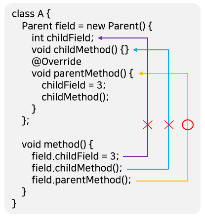

# 중첩 클래스와 중첩 인터페이스

## 중첩 클래스와 중첩 인터페이스란?

- 객체 지향 프로그램에서 클래스들은 서로 긴밀한 관계를 맺고 상호작용을 한다.
  - 어떤 클래스는여러 클래스와 관계를 맺지만 어떤 클래스는 특정 클래스와 관계를 맺는다.
- 클래스가 여러 클래스와 관계를 맺는 경우에는 독립적으로 선언하는 것이 좋으나, 특정 클래스와 관계를 맺을 경우에는 관계 클래스를 클래스 내부에 선언하는 것이 좋다.
- <b>중첩 클래스(Nested Class)</b>란?
  - <u>클래스 내부에 선언한 클래스</u>를 말한다.
  - 중첩 클래스를 사용하면 <u>두 클래스의 멤버들을 서로 쉽게 접근</u>할 수 있다는 <u>장점과 외부에는 불필요한 관계 클래스를 감춤</u>으로써 코드의 복잡성을 줄일 수 있다.
- 아래는 중첩 클래스의 코드 형태를 보여준다.

```java
class ClassName {
    class NestedClassname { // 중첩 클래스
    }
}
```

- 인터페이스도 클래스 내부에 선언할 수 있다.
  - 이런 인터페이스를 중첩 인터페이스라고 한다.
- 인터페이스를 클래스 내부에 선언하는 이유?
  - 해당 클래스와 <u>긴밀한 관계를 맺는 구현 클래스를 만들기 위해</u>서이다.

```java
class ClassName {
    interface NestedInterfacename {	// 중첩 인터페이스
    }
}
```

- 중첩 인터페이스는 주로 UI 프로그래밍에서 이벤트를 처리할 목적으로 많이 활용된다.
- 예를들어 안드로이드에서는 아래처럼 View 클래스의 클릭 이벤트를 처리하는 구현 클래스를 만들 수 있도록 View 클래스 내부에 OnClickListener라는 중첩 인터페이스를 가진다.

```java
public class View {
    public interface OnClickListener {
        public void onClick(View v);
    }
}
```

## 중첩 클래스

- 중첩 클래스는 클래스 내부에 선언되는 위치에 따라서 두 가지로 분류된다.
  - 클래스의 멤버로서 선언되는 중첩 클래스를 멤버 클래스라고 하고,
  - 메소드 내부에서 선언되는 중첩 클래스를 로컬 클래스라고 한다.
- 멤버 클래스는 클래스나 객체가 사용 중이라면 언제든지 재사용이 가능하지만, 로컬 클래스는 메소드 실행 시에만 사용되고, 메소드가 실행 종료되면 없어진다.


- 멤버 클래스도 하나의 클래스이기 때문에 컴파일하면 바이트 코드 파일(.class)이 별도로 생성된다.

```
		A $ B .class
바깥 클래스	 멤버 클래스
```

- 로컬 클래스일 경우에는 $1 이 포함된 바이트 코드 파일이 생성된다.

```
		A $1 B .class
바깥 클래스	  로컬 클래스
```

### 인스턴스 멤버 클래스

- <b>인스턴스 멤버 클래스</b>는 <u>static 키워드 없이 선언된 클래스</u>를 말한다.
- 인스턴스 멤버 클래스는 인스턴스 필드와 메소드만 선언이 가능하고 <u>정적 필드와 메소드는 선언할 수 없다.</u>

```java
class A {
    /** 인스턴스 멤버 클래스 **/
    class B {
        B() {}						// 생성자
        int field1;					// 인스턴스 필드
        //static int field2			// 정적 필드 (X)
        void method1() {}			// 인스턴스 메소드
        //static void method2() {}	// 정적 메소드 (X)
    }
}
```

- A 클래스 외부에서 인스턴스 멤버 클래스 B의 객체를 생성하려면 아래처럼 먼저 <u>A 객체를 생성하고 B 객체를 생성</u>해야 한다.

```java
A a = new A();
A.B b = a.new B();
b.field = 3;
b.method1();
```

### 정적 멤버 클래스

- <b>정적 멤버 클래스</b>는 <u>static 키워드로 선언된 클래스</u>를 말한다.
- 정적 멤버 클래스는 모든 종류의 필드와 메소드를 선언할 수 있다.

```java
class A {
    /** 정적 멤버 클래스 **/
    static class C {
        C() {}						// 생성자
        int field1;					// 인스턴스 필드
        static int field2			// 정적 필드
        void method1() {}			// 인스턴스 메소드
        static void method2() {}	// 정적 메소드
    }
}
```

- A 클래스 외부에서 정적 멤버 클래스 C의 객체를 생성하기 위해서는 A 객체를 생성할 필요가 없고, 아래와 같이 C 객체를 생성하면 된다.

```java
A.C c = new A.C();
c.field1 = 3;	// 인스턴스 필드 사용
c.method1();	// 인스턴스 메소드 호출
A.C.field2 = 3;	// 정적 필드 사용
A.C.method2();	// 정적 메소드 호출
```

### 로컬 클래스

- <u>중첩 클래스는 메소드 내에서도 선언</u>할 수 있다.
  - 이것을 <b>로컬(local) 클래스</b>라고 한다.
- 로컬 클래스는 <u>접근 제한자(public, private) 및 static을 붙일 수 없다.</u>
  - 로컬 클래스는 <u>메소드 내부에서만 사용되므로 접근을 제한할 필요가 없기 때문</u>이다.
  - 로컬 클래스 내부에는 인스턴스 필드와 메소드만 선언이 가능하고 정적 필드와 메소드는 선언할 수 없다.

```java
void method() {
    /** 로컬 클래스 **/
    class D {
        D() {}						// 생성자
        int field1;					// 인스턴스 필드
        //static int field2;		// 정적 필드 (X)
        void method1() {}			// 인스턴스 메소드
        //static void method2() {}	// 정적 메소드 (X)
    }
    D d = new D();
    d.field1 = 3;
    d.method1();
}
```

- 로컬 클래스는 메소드가 실행될 때 메소드 내에서 객체를 생성하고 사용해야 한다.
  - 주로 아래와 같이 비동기 처리를 위해 스레드 객체를 만들 때 사용한다.

```java
void method() {
    class DownloadThread extends Thread { ... }
    DownloadThread thread = new DownloadThread();
    thread.start();
}
```

- 전체 예제

```java
// A.java 중첩 클래스

/** 바깥 클래스 **/
class A {
    
  A() {
    System.out.println("A 객체가 생성됨");
  }
  
  /** 인스턴스 멤버 클래스 **/
  class B {
    B() {
      System.out.println("B 객체가 생성됨");
    }
    int field1;
    //static int field2;
    void method1() {}
    //static void method2() {}
  }
  
  /** 정적 멤버 클래스 **/
  static class C {
    C() {
      System.out.println("C 객체가 생성됨");
    }
    int field1;
    static int field2;
    void method1() {}
    static void method2() {}
  }
  
  void method() {
    /** 로컬 클래스 **/
    class D {
      D() {
        System.out.println("D 객체가 생성됨");
      }
      int field1;
      //static int field2;
      void method1() {}
      //static void method2() {}
    }
    D d = new D();
    d.field1 = 3;
    d.method1();
  }
    
}
```

```java
// Main.java 중첩 클래스 객체 생성
public class Main {

  public static void main(String[] args) {
    A a = new A();

    // 인스턴스 멤버 클래스 객체 생성
    A.B b = a.new B();
    b.field1 = 3;
    b.method1();

    // 정적 멤버 클래스 객체 생성
    A.C c = new A.C();
    c.field1 = 3;
    c.method1();
    A.C.field2 = 3;
    A.C.method2();

    // 로컬 클래스 객체 생성을 위한 메소드 호출
    a.method();
  }

}
```


## 중첩 클래스의 접근 제한

### 바깥 필드와 메소드에서 사용 제한

- 멤버 클래스가 인스턴스 또는 정적으로 선언됨에 따라 <u>바깥 클래스의 필드와 메소드에 사용 제한</u>이 생긴다.
  - 아래의 코드에서 인스턴스 멤버 클래스(B)는 바깥 클래스의 인스턴스 필드(field1)의 초기값이나 인스턴스 메소드(method1())에서 객체를 생성할 수 있다.
    - 하지만 정적 필드(filed3)의 초기값이나 정적 메소드(method2())에서는 객체를 생성할 수 없다.
    - 반면 정적 멤버 클래스(C)는 모든 필드의 초기값이나 모든 메소드에서 객체를 생성할 수 있다.

```java
// A. java 바깥 필드와 메소드에서 사용 제한
public class A{
    // 인스턴스 필드
    B field1 = new B();
    C filed2 = new C();
    
    // 인스턴스 메소드
    void method1() {
        B var1 = new B();
        C var2 = new C();
    }
    
    // 정적 필드 초기화
    //static B field3 = new B();	(X)
    static C field4 = new C();
    
    // 정적 메소드
    static void method2() {
        //B var1 = new B();			(X)
        C var2 = new C();
    }
    
    // 인스턴스 멤버 클래스
    class B {}
    
    // 정적 멤버 클래스
    static class C {}
}
```

### 멤버 클래스에서 사용 제한

- 멤버 클래스가 인스턴스 또는 정적으로 선언됨에 따라 <u>멤버 클래스 내부에서 바깥 클래스 필드와 메소드를 접근할 때에도 제한</u>이 따른다.
- 인스턴스 멤버 클래스(B) 안에서는 바깥 클래스의 모든 필드와 모든 메소드에 접근할 수 있다.
  - 하지만 정적 멤버 클래스(C) 안에서는 바깥 클래스의 정적 필드(field2)와 메소드(method2())에만 접근할 수 있고 인스턴스 필드(filed1)와 메소드(method1())는 접근할 수 없다.


```java
public class A{
    int field1;
    void method1() {}
    
    static int field2;
    static void method2() {}
    
    class B {			// 모든 필드와 메소드에 접근할 수 있다.
        void method() {
            field1 = 10;
            method1();
            
            field2 = 10;
            method2();
        }
    }
    
    static class C {	// 인스턴스 필드와 메소드는 접근할 수 없다.
        void method() {
            //field1 = 10;
            //method1();
            
            field2 = 10;
            method2();
        }
    }
}
```

### 로컬 클래스에서 사용 제한

- 로컬 클래스 내부에서는 바깥 클래스의 필드나 메소드를 제한 없이 사용할 수 있다.
  - <b>문제</b>는 <u>메소드의 매개 변수나 로컬 변수를 로컬 클래스에서 사용할 때</u>이다.
- 로컬 클래스의 객체는 메소드 실행이 끝나도 힙 메모리에 존재해서 계속 사용될 수 있다.
  - 그런데 매개 변수나 로컬 변수는 <u>메소드 실행이 끝나면 스택 메모리에서 사라지기 때문에</u> 로컬 객체에서 사용할 경우 문제가 발생한다.
- 자바는 이 문제를 해결하기 위해 <u>컴파일 시 로컬 클래스에서 사용하는 매개 변수나 로컬 변수의 값을 로컬 클래스 내부에 복사</u>해 두고 사용한다.
  - 그리고 매개 변수나 로컬 변수가 수정되어 값이 변경되면 로컬 클래스에 복사해 둔 값과 달라지는 문제를 해결하기 위해 <u>매개 변수나 로컬 변수를 final로 선언</u>해서 수정을 막는다.
  - <u>결론적으로 로컬 클래스에서 사용 가능한 것은 final로 선언된 매개 변수와 로컬 변수뿐</u>이다.
- 자바 7 이전까지는 final 키워드 없이 선언된 매개 변수나 로컬 변수를 로컬 클래스에서 사용하면 컴파일 에러가 발생하였다.
  - 하지만 자바 8부터는 final 키워드 없이 선언된 매개 변수와 로컬 변수를 사용해도 컴파일 에러가 나지 않는다.
  - 그렇다고해서 자바 8부터는 final이 아닌 매개 변수와 로컬 변수를 허용한다는 것은 아니다.
- final 선언을 하지 않아도 여전히 값을 수정할 수 없는 final의 특성을 갖는다.
  - <u>final 키워드 존재 여부의 차이점은 로컬 클래스의 복사 위치</u>이다.
  - final 키워드가 있다면 로컬 클래스의 메소드 내부에 지역 변수로 복사되지만, final 키워드가 없다면 로컬 클래스의 필드로 복사된다.


- 로컬 클래스의 내부 복사 위치에 신경 쓸 필요 없이 <u>로컬 클래스에서 사용된 매개 변수와 로컬 변수는 모두 final 특성을 갖는다는 것만</u> 알면 된다.
- 아래의 예제는 매개 변수와 로컬 변수가 로컬 클래스에서 사용할 때 final 특성을 갖고 있는것을 보여준다.
- 자바 7까지는 반드시 final 키워드를 붙여야 되지만, <u>자바 8부터는 붙이지 않아도 final 특성</u>을 가지고 있다.

```java
// Outter.java 로컬 클래스에서 사용 제한
public class Outter {
    // 자바 7 이전
    public void method1(final int arg) {
        final int localVariable = 1;
        //arg = 100; (X) final
        //localVariable = 100; (X)
        class Inner {
            public void method() {
                int result = arg + localVariable;
            }
        }
    }
    
    // 자바 8 이후
    public void method2(int arg) {
        int localVariable = 1;
        //arg = 100; (X)
        //localVariable = 100; (X)
        class Inner {
            public void method() {
                int result = arg + localVariable;
            }
        }
    }
}
```

### 중첩 클래스에서 바깥 클래스 참조 얻기

- 클래스 내부에서 this는 객체 자신의 참조이다.
  - 중첩 클래스에서 this 키워드를 사용하면 바깥 클래스의 객체 참조가 아니라, 중첩 클래스의 객체 참조가 된다.
  - 따라서 중첩 클래스 내부에서 `this.필드`, `this.메소드()`로 호출하면 중첩 클래스의 필드와 메소드가 사용된다.
- 중첩 클래스 내부에서 바깥 클래스의 객체 참조를 얻으려면 <u>바깥 클래스의 이름을 this 앞에</u> 붙여주면 된다.
  - 아래는 바깥 클래스의 필드와 메소드에 접근하기 위해 바깥클래스.this를 사용한 예시이다.

```java
바깥클래스.this.필드;
바깥클래스.this.메소드();
```

```java
// Outter.java 중첩 클래스에서 바깥 클래스 참조 얻기
public class Outter {

  String field = "Outter-field";

  void method() {
    System.out.println("Outter-method");
  }

  class Nested {
    String field = "Nested-field";

    void method() {
      System.out.println("Nested-method");
    }

    void print() {
      System.out.println(this.field);		 // 중첩 객체 참조
      this.method();						 // 중첩 객체 참조

      System.out.println(Outter.this.field); // 바깥 객체 참조
      Outter.this.method();					 // 바깥 객체 참조
    }
  }

}
```

```java
// OutterExample.java 실행 클래스
public class OutterExample {

  public static void main(String[] args) {
    Outter outter = new Outter();
    Outter.Nested nested = outter.new Nested();
    nested.print();
  }

}
```


## 중첩 인터페이스

- 중첩 인터페이스는 클래스의 멤버로 선언된 인터페이스를 말한다.
- 인터페이스를 클래스 내부에 선언하는 이유
  - <u>해당 클래스와 긴밀한 관계를 맺는 구현 클래스를 만들기 위해</u>서이다.
  - 특히 UI 프로그래밍에서 이벤트를 처리할 목적으로 많이 활용된다.

```java
class A {
    interface I {		// 중첩 인터페이스
        void method();
    }
}
```

- 예를 들어서 Button을 클릭했을 때 이벤트를 처리하는 객체를 받고 싶다고 가정하자.
  - 그렇다고 아무 객체나 받으면 안 되고, Button 내부에 선언된 중첩 인터페이스를 구현한 객체만 받아야 한다면 아래와 같이 Button 클래스를 선언하면 된다.

```java
// Button.java 중첩 인터페이스
public class Button {

  OnClickListener listener; // 인터페이스 타입 필드

  void setOnClickListener(OnClickListener listener) { // 매개 변수의 다형성
    this.listener = listener;
  }

  void touch() {  // 구현 객체의 onClick() 메소드 호출
    listener.onClick();
  }

  interface OnClickListener { // 중첩 인터페이스
    void onClick();
  }

}
```

- Button 클래스 내용을 보면 중첩 인터페이스(OnClickListener) 타입으로 필드(listener)를 선언하고 Setter 메소드(setOnClickListener())로 구현 객체를 받아 필드에 대입한다.
- 버튼 이벤트가 발생했을 때(touch() 메소드가 실행되었을 때) 인터페이스를 통해 구현 객체의 메소드를 호출(listener.onClick())한다.
- 아래는 Button의 중첩 인터페이스인 OnClickListener를 구현한 두개의 클래스이다.

```java
// CallListener.java 구현 클래스
public class CallListener implements Button.OnClickListener {
  
  @Override
  public void onClick() {
    System.out.println("전화를 겁니다.");
  }
  
}
```

```java
// MessageListener.java 구현 클래스
public class MessageListener implements Button.OnClickListener {

  @Override
  public void onClick() {
    System.out.println("메시지를 보냅니다.");
  }

}
```

- 아래는 버튼을 클릭했을 때 두 가지 방법으로 이벤트를 처리하는 예제이다.
- 어떤 구현 객체를 생성해서 Button 객체의 setOnClickListener() 메소드로 세팅하느냐에 따라서 Button의 touch() 메소드의 실행 결과가 달라진다.

```java
// ButtonExample.java 버튼 이벤트 처리
public class ButtonExample {

  public static void main(String[] args) {
    Button btn = new Button();

    btn.setOnClickListener(new CallListener());
    btn.touch();

    btn.setOnClickListener(new MessageListener());
    btn.touch();
  }

}
```


## 익명 객체

- <b>익명(anonymous) 객체</b>는 <u>이름이 없는 객체</u>를 말한다.
  - 익명 객체는 단독으로 생성할 수 없고 클래스를 상속하거나 인터페이스를 구현해야만 생성할 수 있다. 
- 익명 객체는 필드의 초기값이나 로컬 변수의 초기값, 매개 변수의 매개값으로 주로 대입된다.
  - UI 이벤트 처리 객체나 스레드 객체를 간편하게 생성할 목적으로 익명 객체가 많이 활용된다.

### 익명 자식 객체 생성

- 부모 타입으로 필드나 변수를 선언하고, 자식 객체를 초기값으로 대입할 경우를 생각해보자.
- 우선 부모 클래스를 상속해서 자식 클래스를 선언하고, new 연산자를 이용해서 자식 객체를 생성한 후, 필드나 로컬 변수에 대입하는 것이 기본이다.

```java
class child extends Parent { } // 자식 클래스 선언

class A {
    Parent field = new child();	// 필드에 자식 객체를 대입
    void method() {
        Parent localVar = new child();	// 로컬 변수에 자식 객체를 대입
    }
}
```

- 그러나 자식 클래스가 재사용되지 않고, <u>오로지 해당 필드와 변수의 초기값으로만 사용</u>할 경우라면 익명 자식 객체를 생성해서 초기값으로 대입하는 것이 좋은 방법이다.
- 익명 자식 객체를 생성하는 방법은 아래와 같다.
  - <u>주의할 점</u>은 하나의 실행문이므로 <u>끝에는 세미콜론(;)을 반드시 붙여</u>야 한다.

```java
부모 클래스 [필드|변수] = new 부모클래스(매개값, ...) {
    // 필드
    // 메소드
};
```

- 부모 클래스(매개값, ...) {}은 부모 클래스를 상속해서 중괄호 {}와 같이 자식 클래스를 선언하라는 뜻이다.
  - new 연산자는 이렇게 선언된 자식 클래스를 객체로 생성한다.
- 부모 클래스(매개값, ...)는 부모 생성자를 호출하는 코드로, 매개값은 부모 생성자의 매개 변수에 맞게 입력하면 된다.
  - 중괄호 {} 내부에는 필드나 메소드를 선언하거나 부모 클래스의 메소드를 재정의(오버라이딩)하는 내용이 온다.
- 일반 클래스와의 차이점?
  -  생성자를 선언할 수 없다.
- 아래의 코드는 필드를 선언할때 초기값으로 익명 자식 객체를 생성해서 대입한다.

```java
class A {
    Parent field = new Parent() {	// A 클래스의 필드 선언
        int childField;
        void childMethod() {}
        @Override				// Parent의 메소드를 오버라이딩
        void parentMethod() {}
    }
}
```

- 아래 코드는 메소드 내에서 로컬 변수를 선언할 때 초기값으로 익명 자식 객체를 생성해서 대입한다.

```java
class A {
    void method() {
        Parent localVar = new Parent() {	// 로컬 변수 선언
            int childField;
            void childMethod() {}
            @Override				// Parent의 메소드를 오버라이딩
            void parentMethod() {}
        }
    }
}
```

- 메소드의 매개 변수가 부모 타입일 경우 메소드 호출 코드에서 익명 자식 객체를 생성해서 매개값으로 대입할 수도 있다.

```java
class A {
    void method1(Parent parent) {}
    
    void method2() {
        method1(			// method1() 메소드 호출
            new Parent() {		// method1()의 매개값으로 익명 자식 객체를 대입
                int childField;
                void childMethod() {}
                @Override
                void parentMethod() {}
            }
        );
    }
}
```

- 익명 자식 객체에 새롭게 정의된 필드와 메소드는 익명 자식 객체 내부에서만 사용되고, 외부에서는 필드와 메소드에 접근할 수 없다.
  - 왜냐하면 익명 자식 객체는 부모 타입 변수에 대입되므로 부모타입에 선언된 것만 사용할 수 있기 때문
  - 예를 들어 아래의 코드에서 필드 `childField`와 메소드`childMethod()`는 `parentMethod()` 메소드 내에서 사용이 가능하나, A 클래스의 필드인 field로는 접근할 수 없다.



- 전체 예제

```java
// Person.java 부모 클래스
public class Person {
  void wake() {
    System.out.println("7시에 일어납니다.");
  }
}
```

```java
// Anonymous.java 익명 자식 객체 생성
public class Anonymous {
  // 필드 초기값으로 대입
  Person field = new Person() {
    void work() {
      System.out.println("출근합니다.");
    }

    @Override
    void wake() {
      System.out.println("6시에 일어납니다.");
      work();
    }
  };

  void method1() {
    // 로컬 변수값으로 대입
    Person localVar = new Person() {
      void walk() {
        System.out.println("산책합니다.");
      }

      @Override
      void wake() {
        System.out.println("7시에 일어납니다.");
        walk();
      }
    };

    // 로컬 변수 사용
    localVar.wake();
  }

  void method2(Person person) {
    person.wake();
  }
  
}
```

```java
// AnonymousExample.java 익명 자식 객체 생성
public class AnonymousExample {

  public static void main(String[] args) {
    Anonymous anony = new Anonymous();

    // 익명 객체 필드 사용
    anony.field.wake();

    // 익명 객체를 로컬 변수로 사용
    anony.method1();

    // 익명 객체를 매개값으로 사용
    anony.method2(  // 매개값
        new Person() {
          void study() {
            System.out.println("공부합니다.");
          }

          @Override
          void wake() {
            System.out.println("8시에 일어납니다.");
            study();
          }
        }
    );
  }

}
```


### 익명 구현 객체 생성

- 인터페이스 타입으로 필드나 변수를 선언하고, 구현 객체를 초기값으로 대입하는 경우를 생각해보자.
- 우선 구현 클래스를 선언하고, new 연산자를 이용해서 구현 객체를 생성한 후, 필드나 로컬 변수에 대입하는 것이 기본이다.

```java
class TV implements RemoteControl { }

class A {
    RemoteControl field = new TV();	// 필드에 구현 객체를 대입
    void method() {
        RemoteControl localVar = new TV();	// 로컬 변수에 구현 객체를 대입
    }
}
```

- 그러나 구현 클래스가 재사용되지 않고, <u>오로지 해당 필드와 변수의 초기값으로만 사용</u>하는 경우라면 익명 구현 객체를 초기값으로 대입하는 것이 좋다.

```java
인터페이스 [필드|변수] = new 인터페이스() {
    // 인터페이스에 선언된 추상 메소드의 실체 메소드 선언
    // 필드
    // 메소드
};
```

- 인터페이스 () {}는 인터페이스를 구현해서 중괄호 {}와 같이 클래스를 선언하라는 뜻이고, new 연산자는 이렇게 선언된 클래스를 객체로 생성한다.
- 중괄호 {}에는 <u>인터페이스에 선언된 모든 추상 메소드들의 실체 메소드를 작성</u>해야 한다.
  - <u>그렇지 않으면 컴파일 에러</u>가 발생한다.
  - 추가적으로 <u>필드와 메소드를 선언</u>할 수 있지만, <u>실체 메소드에서만 사용이 가능</u>하고 외부에서는 사용하지 못한다.
- 아래는 필드를 선언할 때 초기값으로 익명 구현 객체를 생성해서 대입하는 예이다.

```java
class A {
    RemoteControl field = new RemoteControl() {	// 클래스 A의 필드 선언
        @Override			// RemoteControl 인터페이스의
        void turnOn() {}	// 추상 메소드에 대한 실체 메소드
    }
}
```

- 아래는 메소드 내에서 로컬 변수를 선언할 때 초기값으로 익명 구현 객체를 생성해서 대입하는 예이다.

```java
void method() {
    RemoteControl localVar = new RemoteControl() {	// 로컬 변수 선언
        @Override		// RemoteControl 인터페이스의
        void turn() {}	// 추상 메소드에 대한 실체 메소드
    }
}
```

- 메소드의 매개 변수가 인터페이스 타입일 경우, 메소드 호출 코드에서 익명 구현 객체를 생성해서 매개값으로 대입할 수도 있다.

```java
class A {
    void method1(RemoteControl rc) {}
    
    void method2() {
        method1(	// method1() 메소드 호출
            new RemoteControl() {	// method1()의 매개값으로 익명 구현 객체를 대입
                @Override
                void turnOn() {}
            }
        );
    }
}
```

```java
// RemoteControl.java 인터페이스
public interface RemoteControl {
  public void turnOn();
  public void turnOff();
}
```

```java
// Anonymous.java 익명 구현 클래스와 객체 생성

public class Anonymous {
  // 필드 초기값으로 대입
  RemoteControl field = new RemoteControl() {	// 필드 선언과 초기값 대입
    @Override
    public void turnOn() {
      System.out.println("TV를 켭니다.");
    }

    @Override
    public void turnOff() {
      System.out.println("TV를 끕니다.");
    }
  };
  
  void method1() {
    // 로컬 변수값으로 대입
    RemoteControl localVar = new RemoteControl() {	// 로컬 변수 선언과 초기값 대입
      @Override
      public void turnOn() {
        System.out.println("Audio를 켭니다.");
      }

      @Override
      public void turnOff() {
        System.out.println("Audio를 끕니다.");
      }
    };
    
    // 로컬 변수 사용
    localVar.turnOn();
  }

  void method2(RemoteControl rc) {
    rc.turnOn();
  }

}
```

```java
// AnonymousExample.java 익명 구현 클래스와 객체 생성
public class AnonymousExample {

  public static void main(String[] args) {
    Anonymous anony = new Anonymous();

    // 익명 객체 필드 사용
    anony.field.turnOn();

    // 익명 객체 로컬 변수 사용
    anony.method1();

    // 익명 객체 매개값 사용
    anony.method2(
        new RemoteControl() {
          @Override
          public void turnOn() {
            System.out.println("SmartTV를 켭니다.");
          }

          @Override
          public void turnOff() {
            System.out.println("SmartTV를 끕니다.");
          }
        }
    );
  }

}
```


- 아래는 UI 프로그램에서 흔히 사용되는 버튼의 클릭 이벤트 처리를 익명 구현 객체를 이용해서 처리하는 방법이다.

```java
// Button.java UI 클래스
public class Button {

  OnClickListener listener;	// 인터페이스 타입 필드

  void setOnClickListener(OnClickListener listener) {	// 매개 변수의 다형성
    this.listener = listener;
  }

  void touch() {
    listener.onClick();	// 구현 객체의 onClick() 메소드 호출
  }

  interface OnClickListener {	// 중첩 인터페이스
    void onClick();
  }
  
}
```

- Button 클래스의 내용을 보면 중첩 인터페이스(OnClickListener) 타입으로 필드(listener)를 선언하고 Setter메소드(setOnClickListener())로 외부에서 구현 객체를 받아 필드에 대입한다.
- 버튼 이벤트가 발생했을 때(touch() 메소드가 실행되었을 때) 인터페이스를 통해 구현 객체의 메소드를 호출(listener.onClick())한다.
- 아래의 Window 클래스는 두 개의 Button 객체를 가지고 있는 윈도우 창을 만드는 클래스라고 가정하자.
  - 첫 번째 button1 의 클릭 이벤트 처리는 필드로 선언한 익명 구현 객체가 담당하고,
  - 두 번째 button2 의 클릭 이벤트 처리는 `setOnClickListener()`를 호출할 때 매개값으로 준 익명  구현 객체가 담당하도록 한 예제이다.

```java
// Window.java UI 클래스
public class Window {
    
  Button button1 = new Button();
  Button button2 = new Button();
  
  // 필드 초기값으로 대입
  Button.OnClickListener listener = new Button.OnClickListener() {
    @Override
    public void onClick() {
      System.out.println("전화를 겁니다.");
    }
  };

  Window() {
    button1.setOnClickListener( listener );
    button2.setOnClickListener(new Button.OnClickListener() {
      @Override
      public void onClick() {
        System.out.println("메시지를 보냅니다.");
      }
    });
  }
  
}
```

```java
// Main.java 실행 클래스
public class Main {

  public static void main(String[] args) {
    Window w = new Window();
    w.button1.touch();  // 버튼 클릭
    w.button2.touch();  // 버튼 클릭
  }

}
```


### 익명 객체의 로컬 변수 사용

- 익명 객체 내부에서는 바깥 클래스의 필드나 메소드는 제한 없이 사용할 수 있다.
- 하지만 메소드의 매개 변수나 로컬 변수를 익명 객체에서 사용할 때에 문제가 발생한다.
  - 메소드 내에서 생성된 익명 객체는 메소드 실행이 끝나도 힙 메모리에 존재해서 계속 사용할 수 있다.
  - 그런데 매개 변수나 로컬 변수는 메소드 실행이 끝나면 스택 메모리에서 사라지기 때문에 익명 객체에서 사용할 수 없게 되므로 문제가 발생한다.
- 문제에 대한 해결방법
  - <a href="#로컬 클래스에서 사용 제한">로컬 클래스에서 사용제한 참고</a>
  - 로컬 클래스와 익명 클래스와의 차이점은 클래스 이름의 존재 여부만 다르고 동작 방식은 동일하다.
- 익명 객체 내부에서 메소드의 매개 변수나 로컬 변수를 사용할 경우, 이 변수들은 final 특성을 가져야 한다.
  - 로컬 클래스에서 사용제한과 마찬가지로 익명 객체에서 사용된 매개 변수와 로컬 변수는 모두 final 특성을 갖는다.
- 전체 예제

```java
public interface Calculatable {
  int sum();
}
```

```java
public class Anonymous {
  private int field;

  public void method(final int arg1, int arg2) {
    final int var1 = 0;
    int var2 = 0;

    field = 10;

    //arg1 = 20; (X)
    //arg2 = 20; (X)

    //var1 = 30; (X)
    //var2 = 30; (X)

    Calculatable calc = new Calculatable() {
      @Override
      public int sum() {
        int result = field + arg1 + arg2 + var1 + var2;
        return result;
      }
    };

    System.out.println(calc.sum());
  }
}
```

```java
public class AnonymousExample {

  public static void main(String[] args) {
    Anonymous anony = new Anonymous();
    anony.method(0, 0);
  }

}
```

