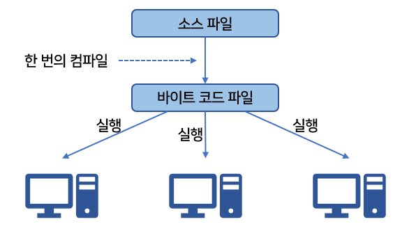
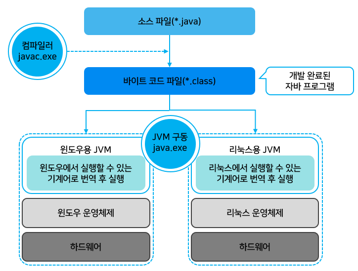
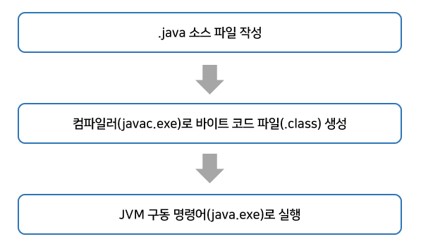
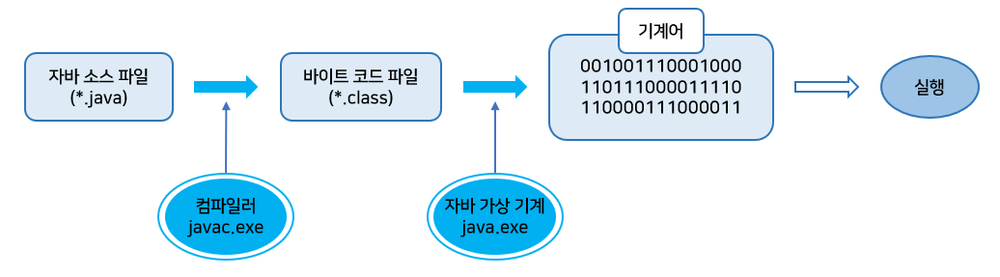
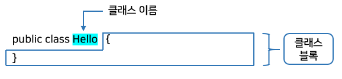
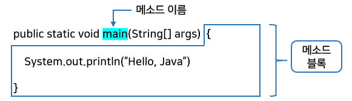

# 자바란?

- 자바는 1991년에 썬의 엔지니어들에 의해서 고안된 오크(Oak)라는 언어에서부터 시작  
  - 오크는 처음에는 가전제품에서 사용될 목적이었는데 인터넷의 등장과 함께 인터넷에서 실행되는 프로그래밍 언어로 사용되었고, 이름도 자바(Java)로 변경됨

- 자바 언어를 발표한 1995년부터 1999년까지는 윈도우(Windows) 프로그램 개발이 주류였기 때문에 C++ 언어에 비해 자바는 아주 열세였음
  - 왜냐하면 메모리 및 CPU를 지나치게 많이 사용하기 때문에 윈도우 프로그래밍 언어로는 부적합하다는 문제점

- 하지만 1999년도부터 인터넷이 활성화되면서 웹 애플리케이션 구축용 언어로 자바가 급부상  
  - 이유는 기업체 및 공공기관의 다양한 서버 운영체제에서 단 한 번의 작성으로 모든 곳에서 실행 가능한 언어는 자바뿐

# 자바의 특징

## 이식성이 높은 언어

- 이식성이란 서로 다른 실행 환경을 가진 시스템 간에 프로그램을 옮겨 실행할 수 있는 것
  - 예를 들어 MS 윈도우에서 실행하는 프로그램을 리눅스 또는 유닉스에서 실행할 수 있다면 이식성이 높은 것이고, 실행할 수 없다면 이식성이 낮다고 볼 수 있음
- MS윈도우에서 실행되는 대부분의 프로그램들은  MS윈도우 환경에 최적화되어 있기 때문에 유닉스나 리눅스에서 실행하려면 프로그램 소스 파일을 수정한 후, 재컴파일 과정을 거쳐야 함

- 자바 언어로 개발된 프로그램은 소스 파일을 다시 수정하지 않아도 자바 실행환경(JRE : Java Runtime Environment)이 설치되어 있는 모든 운영체제에서 실행 가능



## 객체 지향 언어

- 프로그램을 개발하는 기법으로 부품에 해당하는 객체들을 먼저 만들고, 이것들을 하나씩 조립 및 연결해서 전체 프로그램을 완성하는 기법을 <b>객체 지향 프로그래밍(OOP : Object Oriented Programming)</b>
  - 이때 사용되는 언어가 객체 지향 언어

- 자바는 100% 객체 지향 언어
  - 객체를 만들기 위해 클래스를 작성
  - 객체와 객체를 연결해 목적에 맞는 프로그램을 만든다.
  - 아무리 작은 프로그램이라도 객체를 만들어 사용

- 처음부터 객체를 고려해 설계되어 객체 지향 언어가 가져야 할 캡슐화, 상속, 다형성 기능을 완벽하게 지원


## 함수적 스타일 코딩을 지원

- 자바는 함수적 프로그래밍을 위해 람다식 (Lambda Expressions)을 자바 8부터 지원
  - 람다식을 사용하면 컬렉션의 요소를 필터링, 매핑, 집계 처리하는데 쉬워지고, 코드가 매우 간결해짐

## 메모리를 자동으로 관리

- 자바는 개발자가 직접 메모리에 접근할 수 없도록 설계되었으며, 메모리는 자바가 직접 관리
-  객체 생성 시 자동적으로 메모리 영역을 찾아서 할당하고, 사용이 완료되면 <b>쓰레기 수집기(Garbage Collector)</b>를 실행시켜서 자동적으로 사용하지 않는 객체를 제거시켜줌
  - 따라서 개발자는 메모리 관리의 수고를 덜고, 핵심 기능 코드 작성에 집중가능

## 다양한 애플리케이션을 개발

- 자바는 윈도우, 리눅스, 유닉스, 맥 등 다양한 운영체제(OS)에서 실행되는 프로그램을 개발할 수 있음
  - 자바는 다양한 운영체제에서 사용할 수 있는 개발 도구와 API를 묶어 Edition 형태로 정의하고 있음

> Java SE (Standard Edition) - 기본 에디션
>
> Java SE는 자바 프로그램들이 공통적으로 사용하는 자바 가상 기계(JVM : Java Virtual Machine)를 비롯해서 자바 프로그램 개발에 필수적인 도구와 라이브러리 API를 정의
>
> 클라이언트와 서버 프로그램에 상관없이 자바 프로그램을 개발하고 실행하기 위해서는 반드시 Java SE 구현체인 자바 개발 키트(JDK : Java Developement Kit)를 설치해야 함

---

> Java EE (Enterprise Edition) - 서버용 애플리케이션 개발 에디션
>
> Java EE는 분산 환경(네트워크, 인터넷)에서 서버용 애플리케이션을 개발하기 위한 도구 및 라이브러리 API를 정의한다.

## 멀티 스레드(Multi-Thread)를 쉽게 구현

- 하나의 프로그램이 동시에 여러 가지 작업을 처리해야 할 경우와 대용량 작업을 빨리 처리하기 위해 서브 작업으로  분리해서 병렬 처리하려면 멀티 스레드 프로그래밍이 필요함

- 프로그램이 실행되는 운영체제에 따라서 멀티 스레드를 구현하는 방법이 다르지만, 자바는 스레드 생성 및 제어와 관련된 라이브러리 API를 제공
  - 실행되는 운영체제 상관없이 멀티 스레드를 쉽게 구현할 수 있음

## 동적 로딩(Dynamic Loading)을 지원

- 애플리케이션이 실행될 때 모든 객체가 생성되지 않고, 객체가 필요한 시점에 클래스를 동적 로딩해서 객체를 생성

- 개발 완료 후 유지보수가 발생하더라도 해당 클래스만 수정하면 되므로 전체 애플리케이션을 다시 컴파일할 필요가 없음
  - 따라서 유지보수를 쉽고 빠르게 진행할 수 있음

## 막강한 오픈소스 라이브러리가 풍부

- 자바는 Open Source 언어이기 때문에 자바 프로그램에서 사용하는 라이브러리 또한 오픈소스가 넘쳐남
- 고급 기능을 구현하는 코드를 직접 작성할 경우, 시간과 노력이 필요하고, 실행 안정성을 보장할 수 없음
  - 하지만 검증된 오픈소스 라이브러리를 사용하면 개발 기간을 단축하면서 안전성이 높은 애플리케이션을 쉽게 개발할 수 있음
  - 많은 회사들이 자바를 선택하는 이유 중의 하나가 막강하고 풍부한 자바 오픈소스 라이브러리가 있기 때문

# 자바 가상 기계(JVM)

- 운영체제는 자바 프로그램을 바로 실행할 수 없음.
  - 그 이유는 자바 프로그램은 완전한 기계어가 아닌, <u>중간 단계의 바이트 코드</u>이기 때문에 이것을 해석하고 실행할 수 있는 가상의 운영체제가 필요함
  - 그것이 바로 <b>자바 가상 기계(JVM : Java Virtual Machine)</b>

- JVM은 실제 운영체제를 대신해서 자바 프로그램을 실행하는 가상의 운영체제 역할을 함
- 운영체제별로 프로그램을 실행하고 관리하는 방법이 다름
  - 운영체제별로 자바 프로그램을 별도로 개발하는 것보다 운영체제와 자바 프로그램을 중계하는 JVM을 두어서 자바 프로그램이 여러 운영체제에서 동일한 실행결과가 나오도록 설계
  - 따라서 개발자는 운영체제와 상관없이 자바 프로그램을 개발할 수 있음

- 바이트 코드는 모든 JVM에서 동일한 실행 결과를 보장함
  - 하지만 JVM은 운영체제에 종속적임
  - 자바 프로그램을 운영체제가 이해하는 기계어로 번역해서 실행해야 하므로 JVM은 운영체제에 맞게 설치되어야 함
  - JVM은 JDK 또는 JRE를 설치하면 자동으로 설치가 되는데, JDK와 JRE가 운영체제별로 제공됨



- 자바 프로그램은 확장자가 .java인 파일을 작성하는 것부터 시작되는데, 이것을 <b>소스파일</b>이라고 함
- 소스파일을 컴파일러(javac.exe)로 컴파일하면 확장자가 .class인 <b>바이트 코드</b> 파일이 생성됨
- 바이트 코드 파일은 JVM 구동 명령어(java.exe)에 의해서 JVM에서 해석되고 해당 운영체제에 맞게 기계어로 번역됨.
  - 바이트 코드는 하나지만, JVM에 의해서 번역되는 기계어는 운영체제에 따라서 달라짐

- 자바의 가장 큰 장점 중 하나인 <b>"Write once, run anywhere.(한 번 작성하면 어디서든 실행된다.)"</b>
  - 하지만 한 번의 컴파일링으로 실행 가능한 기계어가 만들어지지 않고 JVM에 의해 기계어로 번역되고 실행되기 때문에 C/C++ 컴파일 단계에서 만들어지는 완전한 기계어보단 속도가 느리다는 단점
  - 그러나 기계어로 빠르게 변환해주는 JVM내부의 최적화된 JIT 컴파일러를 통해서 속도의 격차는 줄고있음

# 자바 프로그램 개발 순서



- 파일 확장명이 .java인 텍스트 파일을 생성하고 프로그램 소스를 작성
  - 이렇게 만들어진 파일을 <b>자바 소스 파일</b>이라고 함

- 작성 완료된 자바 소스 파일은 컴파일러(javac.exe)로 컴파일해야 함
  - 컴파일에 성공하면 확장명이 .class인 바이트 코드 파일이 생성
  - 만약 명령 프롬프트에서 Hello.java 소스 파일을 아래처럼 컴파일한다면 Hello.class 파일이 생성

```
javac Hello.java
```

- 생성된 바이트 코드 파일은 완전한 기계어가 아니므로 단독으로 실행할 수 없고, JVM이 실행되어야 함
  - JVM을 구동시키는 명령어는 java.exe
  - 만약 Hello.class라는 바이트 코드 파일을 java.exe로 실행하려면 명령 프롬프트에서 아래와 같이 입력

```java
java Hello
```

> 주의할점  
> java.exe로 바이트 코드 파일을 실행할 때는 .class 확장명을 제외한 이름을 입력해야 한다.

1. java. exe 명령어가 실행되면 JVM은 바이트 코드 파일(Hello.class)을 메모리로 로드
2. 최적의 기계어로 번역
3. 그리고 main() 메소드를 찾아 실행



# 실습

```java
public class Hello {
    
    public static void main(String[] args) {
        System.out.println("Hello, Java");
    }
    
}
```

- 주의할 점
  - 클래스 이름 Hello의 H가 대문자로 작성되어야 함(파일명과 대소문자가 동일해야 한다.)
  - String의 S가 대문자로 작성되어야 함
  - System의 S가 대문자로 작성되어야 함
  - 라인의 끝에 세미콜론(;) 붙이기

# 프로그램 소스 분석

- 자바 실행 프로그램은 반드시 클래스(class) 블록과 main() 메소드(method) 블록으로 구성되어야 함
  - 메소드 블록은 단독으로 작성될 수 없으며 항상 클래스 블록 내부에서 작성되어야 함
  - 클래스 : 필드 또는 메소드를 포함하는 블록
  - 메소드 : 어떤 일을 처리하는 실행문들을 모아 놓은 블록

- 클래스는 이름이 있는데, 아래 그림에선 Hello가 클래스 이름이고, 그 다음에 있는 중괄호 부터 그와 짝을 이루는 중괄호 까지가 클래스 블록



- 클래스의 이름은 개발자가 마음대로 정할 수 있지만 주의할 점이 있음
  - 소스 파일명과 대소문자가 일치해야 함
  - 숫자로 시작할 수 없음
  - 공백을 포함해서도 안 됨

- 클래스 블록에는 메소드를 작성할 수 있는데, 메소드는 클래스처럼 이름과 블록을 가짐
  - main이 메소드 이름
  - 중괄호 부터 그와 짝을 이루는 중괄호 까지가 메소드 블록



- 메소드 이름도 개발자가 마음대로 정할 수 있지만 <b>main() 메소드 만큼은 다른 이름으로 바꾸면 안됨</b>
  - 왜냐하면 java.exe로 JVM을 구동시키면 제일 먼저 main() 메소드를 찾아서 실행시키기 때문
  - 그래서 main() 메소드를 프로그램 실행 진입점(entry point)이라고 함

- 만약 클래스 내부에 main() 메소드가 없거나 잘못 작성하면 클래스를 실행할 수 없음
- main() 메소드가 없는 클래스를 java.exe로 실행시키면 기본 메소드를 찾을 수 없다는 에러발생

- 메소드 블록에는 실행문이 작성됨
  - main() 메소드 블록의 `System.out.println("Hello, Java");` 가 실행문에 해당
  - 실행문 끝에는 반드시 세미콜론(;)을 붙여야 함. 그렇지 않으면 컴파일 에러 발생

- `System.out.println("Hello, java");`는 괄호 안에 있는 "Hello, Java" 문자열을 출력
  - main() 메소드 블록이 모두 실행되면 프로그램은 종료

# 주석과 실행문

## 주석 사용하기

- 주석은 프로그램 실행과는 상관없이 코드에 설명을 붙인 것
  - 컴파일 과정에서 주석은 무시되고 실행문만 바이트 코드로 번역됨
  - 주석을 많이 작성한다고 해서 전체 프로그램의 크기가 커지는 것은 아님
  - 가급적이면 설명이 필요한 코드에 주석을 달아 두는 것이 좋음

- 복잡한 코드일수록 주석을 달면 전체 코드를 이해하기 쉽고, 수정이 용이
  - 다른 사람이 작성한 코드를 주석 없이 해석하는 것은 쉬운 일이 아님
  - 다른 사람이 볼 필요가 있다면 주석을 꼭 넣어주는 것이 좋음

- 주석의 내용
  - 작성자
  - 작성일과 시간
  - 프로그램의 버전과 변경 이력등의 정보
  - 주요 코드에 대한 설명 등이 포함
  - 코드에서 사용하는 주석문의 종류는 아래처럼 두 가지가 있음

| 주석기호 | 설명                                                       |
| -------- | ---------------------------------------------------------- |
| //       | // 부터 라인 끝까지 주석으로 처리(행 주석)                 |
| /* ~ */  | /* 와 */ 사이에 있는 모든 범위를 주석으로 처리 (범위 주석) |

- 주석문은 코드 내 어디서든 작성이 가능
  - 하지만, 문자열(" ") 내부에는 올 수 없음
  - 문자열 안에서의 주석문은 주석이 아니라 문자열 데이터로 인식
  - 따라서 아래처럼 하면X

```java
System.out.println("Hello, /*주석이 될수 없음*/welcome to the java World!");
```

## 실행문과 세미콜론(;)

- 실행문은 변수 선언, 값 저장, 메소드 호출에 해당하는 코드
- 실행문을 작성할 때 주의할 점
  - 마지막에 반드시 세미콜론(;)을 붙여 실행문이 끝났음을 표시해주어야 함

```java
// 실행문 작성 예
int x;						// 변수 x를 선언하고 1을 저장
int y = 2;					// 변수 y를 선언하고 2를 저장
int result = x + y;			// 변수 result를 선언하고 변수 x와 y를 더한 값을 저장
System.out.println(result);	// 콘솔에 출력하는 println 메소드 호출
```

- 컴파일러는 세미콜론(;)이 나올 때까지 실행문이 계속해서 연결된 것으로 봄
  -  그래서 한 실행문이 여러 줄에 걸쳐 있어도 되고, 한 줄에 여러 개의 실행문이 있어도 됨

```java
// 실행문 작서 예시를 아래처럼 바꾸어도 된다.
int x = 1; int y = 2;
int result =
x + y;
System.out.println(result);
```

## 연습

```java
public class RunStatementExample {

    public static void main(String[] args) {
        int x = 1;
        int y = 2;
        int result = x + y;			// 3
        System.out.println(result);	// 메소드 호출
    }

}
```