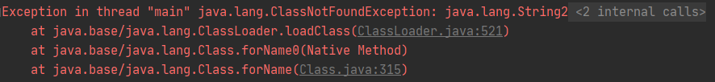

# 예외 처리

## 예외와 예외 클래스

- 에러(error)
  - 하드웨어 오동작 또는 고장으로 인한 실행 오류
  - 에러에 대처할 방법은 없다.
- 예외
  - 사용자의 잘못된 조작
  - 또는 개발자의 잘못된 코딩으로 발생
  - 예외 처리(Exception Handling)를 통해 정상 실행상태 유지가능
- 예외의 두 가지 종류
  - 일반예외(Exception)
    - 컴파일 과정에서 예외 처리가 필요한지 검사
    - 예외 처리가 없다면 컴파일 오류 발생
  - 실행 예외(Runtime Exception)
    - 컴파일 과정에서 예외 처리 코드를 검사하지 않는 예외
    - 실행 시 예측할 수 없이 갑자기 발생
  - 두 가지 모두 예외처리가 필요하다.
- 자바에서는 예외를 클래스로 관리
  - JVM이 예외발생시 해당 예외 클래스로 객체를 생성한다.
  - 예외 처리 코드에서 예외 객체를 이용할 수 있도록 해준다.
- 모든 예외 클래스들은 java.lang.Exception 클래스를 상속받는다.


- 일반 예외와 실행 예외 클래스를 구별하는 방법
  - 일반 예외 클래스
    - Exception을 상속받는다.
    - RuntimeException을 상속받지 않는다.
  - 실행 예외 클래스
    - RuntimeException을 상속받는다.
    - Exception도 상속받지만 JVM은 RuntimeException을 상속했는지 여부를 보고 실행 예외를 판단


## 실행 예외

- 실행 예외
  - 컴파일러가 체크를 하지 않는다.
  - 개발자의 경험만으로 예외 처리를 해야한다.
  - 예외 처리를 넣지 않은 경우, 해당 예외 발생시 프로그램 곧바로 종료

### NullPointerException

- NullPointerException
  - 가장 빈번하게 발생하는 실행 예외
  - 객체 참조가 없는 상태인 null 값을 갖는 참조 변수로 객체 접근 연산자인 도트(.) 사용시 발생
  - 객체가 없는 상태에서 객체를 사용하려 하므로 예외발생

```java
public class NullPointerExceptionExample {

  public static void main(String[] args) {
    String data = null; // data 변수는 String 객체를 참조하고 있지 않음
    System.out.println(data.toString()); // 참조가 없는데 메소드호출
  }

}
```


### ArrayIndexOutOfBoundsException

- java.lang.ArrayIndexOutOfBoundsException
  - 배열에서 인덱스 범위를 초과하여 사용할 경우의 실행 예외

```java
public class ArrayIndexOutOfBoundsException {

  public static void main(String[] args) {
    // 실행 시 매개값을 주지 않으면 예외 발생
    String data1 = args[0];
    String data2 = args[1];

    System.out.println("args[0]: " + data1);
    System.out.println("args[1]: " + data2);
  }

}
```


- 배열값을 읽기 전 배열의 길이를 조사하면 좋다.

```java
public class ArrayIndexOutOfBoundsExceptionExample {

  public static void main(String[] args) {
    if (args.length == 2) { // 배열 길이를 조사하여 예외가 발생하지 않도록 한다.
      String data1 = args[0];
      String data2 = args[1];

      System.out.println("args[0]: " + data1);
      System.out.println("args[1]: " + data2);
    } else {
      System.out.println("[실행 방법]");
      System.out.print("java ArrayIndexOutOfBoundsExceptionExample ");
      System.out.print("값1 값2");
    }
  }

}
```

### NumberFormatException

- 문자열을 숫자로 변환하는 방법중 가장 많이 사용되는 코드


- Integer와 Double
  - 포장(Wrapper) 클래스
  - 정적 메소드인 parseXXX()를 이용하여 문자열을 숫자로 변환가능
  - 문자열이 숫자로 변환될 수 있다면 숫자를 리턴
  - 숫자로 변환될 수 없는 문자가 포함되어 있다면 java.lang.NumberFormatException을 발생시킴

```java
public class NumberFormatException {

  public static void main(String[] args) {
    String data1 = "100";
    String data2 = "a100";

    int value1 = Integer.parseInt(data1);
    int value2 = Integer.parseInt(data2); // 예외발생

    int result = value1 + value2;
    System.out.println(data1 + "+" + data2 + "=" + result);
  }

}

```


### ClassCastException

- ClassCastException
  - 억지로 타입 변환을 시도할 경우 발생


- 위의 그림과 같은 상황에서 올바른 타입 변환

```java
Animal animal = new Dog();
Dog dog = (Dog) animal;
// Animal 타입 변수에 대입된 객체가 Dog
// 다시 Dog 타입으로 변환하는 것은 문제없음
```

```java
RemoteControl rc = new Television();
Television tv = (Television) rc;
// RemoteControl 타입 변수에 대입된 객체가 Television
// 다시 Television 타입으로 변환하는 것은 문제없음
```

- ClassCastException 발생하는 경우

```java
Animal animal = new Dog();
Cat cat = (Cat) animal;
// 다른 클래스 타입으로 변환됨
```

```java
RemoteControl rc = new Television();
Audio audio = (Audio) rc;
// 다른 클래스 타입으로 변환됨
```

- 예외를 발생시키지 않으려면?
  - 타입 변환 전에 타입 변환이 가능한지 `instanceof` 연산자로 확인하는것이 좋음
  - `instanceof` 연산의 결과가 ture이면 좌항 객체를 우항 타입으로 변환가능

```java
Animal animal = new Dog();

if (animal instanceof Dog) {  // 실행
    Dog dog = (Dog) animal;
} else if (animal instanceof Cat) {
    Cat cat = (Cat) animal;
}
```

```java
Remocon rc = new Audio();

if (rc instanceof Television) {
    Television tv = (Television) rc;
} else if (rc instanceof Audio) { // 실행
    Audio audio = (Audio) rc;
}
```

- 실행 예제

```java
public class ClassCastExceptionExample {

  public static void main(String[] args) {
    Dog dog = new Dog();
    changeDog(dog);

    Cat cat = new Cat();
    changeDog(cat);
  }

  public static void changeDog(Animal animal) {
    if (animal instanceof Dog) { // 타입체크
      Dog dog = (Dog) animal;
    } // 타입체크 안할 시 예외발생
  }

}
```

## 예외 처리 코드

- 예외 처리 코드?
  - 예외 발생시 갑작스러운 종료를 막고, 정상 실행을 유지하도록 처리하는 코드
- 컴파일러는 일반 예외 발생 가능성이 있다면 컴파일 오류발생
  - 실행 오류는 컴파일러가 체크해주지 않는다.
    - 경험을 바탕으로 작성해야 함
- `try-catch-finally`블록을 이용
  - 생성자 내부와 메소드 내부에서 작성된다.
  - 일반 예외, 실행 예외가 발생할 경우 예외 처리를 할 수 있다.


- try 블록 내의 코드가 예외 발생 없이 실행되면 catch 블록 미실행
  - 마지막에 finally 블록 코드 실행
- try 블록 내의 코드에서 예외가 발생하면 즉시 catch 블록으로 이동하여 예외 처리 코드 실행
  - 마지막에 finally 블록 코드 실행
- finally 블록은 생략 가능
  - 예외 여부와 상관없이 항상 실행할 내용이 있을 경우에 작성
  - try와 catch에서 return을 사용해도 finally 블록은 항상 실행
- 일반 예외 예제

```java
public class TryCatchFinallyExample {

  public static void main(String[] args) {
    try {
      // Class.forName() 메소드 : 매개값으로 주어진 클래스가 존재하면 Class 객체를 리턴
      // 존재하지 않으면 ClassNotFoundException 예외 발생
      Class clazz = Class.forName("java.lang.String2");
    } catch (ClassNotFoundException e) { // 일반예외
      System.out.println("클래스가 존재하지 않습니다.");
    }
  }

}
```


- 실행 예외 예제

```java
public class TryCatchFinallyRuntimeExceptionExample {

  public static void main(String[] args) {
    String data1 = null;
    String data2 = null;

    try {
      data1 = args[0];
      data2 = args[1];
    } catch (ArrayIndexOutOfBoundsException e) {
      System.out.println("실행 매개값의 수가 부족합니다.");
      System.out.println("[실행 방법]");
      System.out.println("java TryCatchFinallyRuntimeExceptionExample num1 num2");
      return;
    }

    try {
      int value1 = Integer.parseInt(data1);
      int value2 = Integer.parseInt(data2);
      int result = value1 + value2;
      System.out.println(data1 + "+" + data2 + "=" + result);
    } catch (NumberFormatException e) {
      System.out.println("숫자로 변환할 수 없습니다.");
    } finally {
      System.out.println("다시 실행하세요.");
    }
  }

}
```

- 실행 매개값을 주지 않았을 때


- 실행 매개값을 잘못 주었을 때


## 예외 종류에 따른 처리 코드

### 다중 catch

- 다중 catch
  - 발생되는 예외별로 예외 처리 코드를 다르게 할 수 있다.
- catch 블록이 여러개라도 단 하나의 catch 블록만 실행된다.
  - 하나의 예외가 발생하면 즉시 해당 catch블록으로 이동하기 때문
- 예제

```java
public class CatchByExceptionKindExample {

  public static void main(String[] args) {
    try {
      String data1 = args[0];
      String data2 = args[1];
      int value1 = Integer.parseInt(data1);
      int value2 = Integer.parseInt(data2);
      int result = value1 + value2;
      System.out.println(data1 + "+" + data2 + "=" + result);
    } catch (ArrayIndexOutOfBoundsException e) {
      System.out.println("실행 매개값의 수가 부족합니다.");
      System.out.println("[실행 방법]");
      System.out.println("java TryCatchFinallyRuntimeExceptionExample num1 num2");
    } catch (NumberFormatException e) {
      System.out.println("숫자로 변환할 수 없습니다.");
    } finally {
      System.out.println("다시 실행하세요.");
    }
  }

}
```

- 실행 매개값을 주지 않았을 때


- 실행 매개값을 잘못 주었을 때


### catch 순서

- 다중 catch 블록 작성시 주의할 점
  - 상위 예외 클래스가 하위 예외 클래스보다 아래쪽에 위치해야 한다.
  - try 블록에서 예외가 발생했을 때
    - 예외를 처리해줄 catch 블록은 위에서부터 차례대로 검색됨
    - 만약 상위 예외 클래스의 catch 블록이 위에 있다면?
      - 하위 예외 클래스의 catch 블록은 실행되지 않음

```java
// 잘못된 예시
try {
    ArrayIndexOutOfBoundsException 발생
        ...
    NumberFormatException 발생
// 두 예외 모두 Exception을 상속받기 때문에 첫 번째 catch 블록만 실행됨
} catch (Exception e) {
    예외 처리 1
} catch (ArrayIndexOutOfBoundsException e) { // 실행되지 않음
    예외 처리 2
}
```

```java
// 수정된 예시
try {
    ArrayIndexOutOfBoundsException 발생
        ...
    다른 Exception 발생
} catch (ArrayIndexOutOfBoundsException e) { // ArrayIndexOutOfBoundsException 발생시
    예외 처리 1
} catch (Exception e) { // 다른 예외 발생시
    예외 처리 2
}
```

- 전체 예제

```java
public class CatchOrderExample {

  public static void main(String[] args) {
    try {
      String data1 = args[0];
      String data2 = args[1];
      int value1 = Integer.parseInt(data1);
      int value2 = Integer.parseInt(data2);
      int result = value1 + value2;
      System.out.println(data1 + "+" + data2 + "=" + result);
    } catch (ArrayIndexOutOfBoundsException e) { // ArrayIndexOutOfBoundsException 발생시
      System.out.println("실행 매개값의 수가 부족합니다.");
    } catch (Exception e) { // 다른 예외 발생시 실행
      System.out.println("실행에 문제가 있습니다.");
    } finally {
      System.out.println("다시 실행하세요.");
    }
  }

}
```


### 멀티 catch

- 멀티 catch
  - 하나의 catch 블록에서 여러 개의 예외를 처리할 수 있다.
  - 자바 7부터 추가됨
  - catch 괄호 안에 동일하게 처리하고 싶은 예외를 | 로 연결

```java
try {
    ArrayIndexOutOfBoundsException 또는 NumberFormatException 발생
        ...
    다른 Exception 발생
} catch (ArrayIndexOutOfBoundsException | NumberFormatException e) {
      예외 처리 1
} catch (Exception e) {
      예외 처리 2
}
```

- 전체 예제

```java
public class MultiCatchExample {

  public static void main(String[] args) {
    try {
      String data1 = args[0];
      String data2 = args[1];
      int value1 = Integer.parseInt(data1);
      int value2 = Integer.parseInt(data2);
      int result = value1 + value2;
      System.out.println(data1 + "+" + data2 + "=" + result);
    } catch (ArrayIndexOutOfBoundsException | NumberFormatException e) {
      System.out.println("실행 매개값의 수가 부족하거나 숫자로 변환할 수 없습니다.");
    } catch (Exception e) {
      System.out.println("알수 없는 예외 발생");
    } finally {
      System.out.println("다시 실행하세요.");
    }
  }

}
```


## 자동 리소스 닫기

- try-with-resources
  - 자바 7에 새로 추가됨
  - 예외 발생 여부와 상관없이 사용했던 리소스 객체(각종 입출력 스트림, 서버 소켓, 소켓, 각종 채널)의 close() 메소드를 호출해서 안전하게 리소스를 닫아준다.
  - 리소스 - 데이터를 읽고 쓰는 객체
    - ex) 파일 데이터를 읽는 FileInputStream , 파일에 쓰는 FileOutputStream은 리소스 객체
- 리소스 객체를 안전하게 닫기 위해 자바 6 이전까지 사용되었던 코드

```java
FileInputStream fis = null;
try {
    fis = new FileInputStream("file.txt");
    ...
} catch (IOException e) {
    ...
} finally {
    if (fis != null) {
        try {
            fis.close();
        } catch (IOException e) { }
    }
}
// finally 블록에서 다시 try-catch를 사용해 close() 메소드를 예외 처리해야 한다.
```

- 자바 7에서 추가된 try-with-resources를 사용하면 간단해진다.

```java
try(FileInputStream fis = new FileInputStream("file.txt")) {
    ...
} catch (IOException e) {
    ...
}
```

- try 블록 정상 실행되거나 또는 예외가 발생하면 자동으로 FileInputStream의 close() 메소드가 호출
- try 에서 예외 발생시 우선 close()로 리소스를 닫고 catch 블록을 실행

```java
// 복수 개의 리소스를 사용해야 할 때
try(
	FileInputStream fis = new FileInputStream("file1.txt");
	FileOutputStream fos = new FileInputStream("file2.txt")
) {
    ...
} catch(IOException e) {
    ...
}
```

- try-with-resources를 사용하기 위한 조건
  - 리소스 객체는 java.lang.AutoCloseable 인터페이스를 구현하고 있어야 한다.
    - try-with-resources는 AutoCloseable에 있는 close() 메소드를 자동 호출한다.
    - API 도큐먼트에서 AutoCloseable 인터페이스를 찾아 "All Known Implementing Classes. : " 를 확인하면 try-with-resources와 함께 사용할 수 있는 리소스가 무엇인지 알 수 있다.
- 직접 AutoCloseable을 구현해서 FileInputStream 클래스가 작성된 예제

```java
// AutoCloseable 구현 클래스
public class FileInputStream implements AutoCloseable {
  private String file;

  public FileInputStream(String file) {
    this.file = file;
  }

  public void read() {
    System.out.println(file + "을 읽습니다.");
  }

  @Override
  public void close() throws Exception {
    System.out.println(file + "을 닫습니다.");
  }
}
```

```java
// 사용
public class TryWithResourceExample {

  public static void main(String[] args) {
    try (FileInputStream fis = new FileInputStream("file.txt")) {
      fis.read();
      throw new Exception(); // 예외 강제발생
    } catch (Exception e) {
      System.out.println("예외 처리 코드가 실행되었습니다.");
    }
  }

}
// try-with-resources를 사용하면
// 예외가 발생하는 즉시 자동으로 FileInputStream의 close()가 호출됨
```


## 예외 떠넘기기

- throws
  - 메소드를 호출한 곳으로 예외를 떠넘길 때 사용하는 키워드
  - 메소드 선언부 끝에 작성된다.
  - 메소드에서 처리하지 않은 예외를 호출한 곳으로 떠넘긴다.
  - throws 키워드 뒤엔 떠넘길 예외 클래스를 쉼표로 구분해서 나열

```java
리턴타입 메소드명(매개변수, ...) throws 예외클래스1, 예외클래스2, ... {
}
```

- thorws Exception만으로 모든 예외를 떠넘길 수도 있다.

```java
리턴타입 메소드명(매개변수, ...) throws Exception {
}
```

- throws 키워드가 붙어있는 메소드는 반드시 try 블록 내에서 호출되어야 한다.
  - 또한 catch 블록에서 떠넘겨 받은 예외를 처리해야 한다.
- throws 키워드가 있는 메소드 호출방법

```java
public void method1() {
    try {
        method2();
    } catch (ClassNotFoundException e) { // 떠넘겨받은 예외 처리
        // 예외 처리
        System.out.println("클래스가 존재하지 않습니다.");
    }
}

public void method2() thorws ClassNotFoundException { // 호출한 곳에서 예외처리
    Class clazz = class.forName("Java.lang.String2");
}
```

- 떠넘겨 받은 예외를 throws 키워드로 또다시 떠넘길 수 있다.

```java
public void method1() throws ClassNotFoundException {
    method2();
}
// 결국 method1() 을 호출하는 곳에서 try-catch 블록으로 예외를 처리해야 한다.
```

- 자바 API 도큐먼트에서 클래스 생성자와 메소드 선언부에 throws 키워드가 붙은걸 사용하고 싶다면?
  - 반드시 try-catch 블록으로 예외처리
  - 혹은 throws를 다시 사용해서 호출한 곳으로 예외를 떠넘겨야 한다.
  - 예외처리가 없거나 떠넘기지 않으면 컴파일 오류 발생
    - ex) Class의 forName() 메소드엔 throws ClassNotFoundException이 붙어 있다.  
      forName() 메소드를 호출할 때 try-catch 블록으로 예외를 처리하거나, throws로 떠넘겨야 한다.
- 예제

```java
public class ThrowsExample {

  public static void main(String[] args) {
    try {
      findClass(); // 호출
    } catch (ClassNotFoundException e) { // 넘겨받은 예외 처리
      System.out.println("클래스가 존재하지 않습니다.");
    }
  }

  public static void findClass() throws ClassNotFoundException { // 예외를 떠넘김
    Class clazz = Class.forName("java.lang.String2");
  }
}
```

- main() 메소드에서도 throws 키워드를 사용해서 예외를 떠넘길 수 있다.
  - JVM이 최종적으로 예외를 처리
  - 예외의 내용을 콘솔에 출력하는 것으로 예외 처리를 함

```java
// main()에서 예외 떠넘기기
public static void main(String[] args) throws ClassNotFoundException {
    findClass();
}
```



- main()에서 try-catch 블록으로 예외를 최종 처리하는 것이 바람직
  - 알 수 없는 예외 내용을 출력하고 종료되는 것을 좋지 않다.

## 사용자 정의 예외와 예외 발생

- 자바 표준 API에서 제공하는 예외 클래스만으로는 다양한 종류의 예외를 표현할 수 없음
  - 애플리케이션 서비스와 관련된 예외를 애플리케이션 예외(Application Exception)라고 한다.
  - 애플리케이션 예외는 직접 정의해서 만들어야 하므로 사용자 정의 예외라고도 한다.

### 사용자 정의 예외 클래스 선언

- 사용자 정의 예외 클래스
  - 컴파일러가 체크하는 일반 예외 선언 가능
  - 컴파일러가 체크하지 않는 실행 예외도 선언 가능
- 일반 예외로 선언할 경우
  - Exception을 상속한다.
- 실행 예외로 선언할 경우
  - RuntimeException을 상속한다.

```java
public class XXXException extends [Exception | RuntimeException] {
    public XXXException() { }
    public XXXException(String message) { super(message); }
}
```

- 사용자 예외 클래스 이름은 Exception으로 끝나는 것이 좋다.
- 대부분 생성자 선언만을 포함한다.
  - 두 개 선언하는 것이 일반적
    - 매개 변수가 없는 기본 생성자
    - 예외 발생 원인(예외 메시지)을 전달하기 위해 String 타입의 매개 변수를 갖는 생성자
      - String 타입의 매개 변수를 갖는 생성자는 상위 클래스의 생성자를 호출하여 예외 메시지를 넘김
- 예외 메시지의 용도
  - catch {} 블록의 예외 처리 코드에서 이용하기 위해

```java
// 잔고 부족 예외를 사용자 정의 예외 클래스로 선언한 예시
public class BalanceInsufficientException extends Exception { // 일반 예외가 됨. 예외처리 필요
    public BalanceInsufficientException() { }
    public BalanceInsufficientException(String message) {
        super(message);
    }
}
```

### 예외 발생시키기

- 사용자 정의 예외 또는 자바 표준 예외를 발생시키는 방법

```java
throw new XXXException(); // 예외 객체 생성시 기본 생성자 사용
throw new XXXException("메시지"); // 예외 객체 생성시 예외 메시지 갖는 생성자 사용
```

- catch 블록에서 예외 메시지가 필요하다면?
  - 예외 메시지를 갖는 생성자를 이용해야 한다.
- 대부분 자신을 호출한 곳에서 예외를 처리하도록 throws 키워드로 예외를 떠넘긴다.

```java
public void method() throws XXXException {
    throw new XXXException("메시지");
}
```

```java
// 호출한 곳에서 예외 처리를 해주어야 한다.
try {
    method();
} catch (XXXException e) {
    // 예외 처리
}
```

- BalanceInsufficientException 발생시키는 클래스

```java
public class Account {
  
  private long balance;

  public Account() {}

  public long getBalance() {
    return balance;
  }

  public void deposit(int money) {
    balance += money;
  }

  //                              사용자 정의 예외 떠넘기기
  public void withdraw(int money) throws BalanceInsufficientException {
    if (balance < money) {
      throw new BalanceInsufficientException("잔고부족:" + (money-balance) + " 모자람");
      // 사용자 정의 예외 발생
    }
  }
  
}
```

### 예외 정보 얻기

- try 블록에서 예외가 발생되면 예외 객체는 catch 블록의 매개 변수에서 참조하게 된다.
  - 매개 변수를 이용하면 예외 객체의 정보를 알 수 있다.
- 모든 예외는 Exception 클래스를 상속한다.
  - Exception이 가지고 있는 메소드들은 모든 예외 객체에서 호출할 수 있다.
  - 많이 사용되는 메소드
    - getMessage()
    - printStackTrace()
- 예외를 발생시킬 때 String 타입의 메시지를 갖는 생성자를 이용하면 자동적으로 예외 객체 내부에 저장됨

```java
throw new XXXException("예외 메시지");
```

- 예외 메시지의 내용
  - 왜 예외가 발생했는지에 대한 설명이 포함
  - 예외 코드를 포함하기도 한다.
- 예외 메시지는 catch 블록에서 getMessage() 메소드의 리턴값으로 얻을 수 있다.

```java
} catch (Exception e) {
    String message = e.getMessage();
}
```

- printStackTrace()
  - 예외 발생 코드를 추적해서 모두 콘솔에 출력

```java
try {
    // 예외 객체 생성
} catch (예외클래스 e) {
    // 예외가 가지고 있는 Message 얻기
    String message = e.getMessage();
    
    // 예외의 발생 경로를 추적
    e.printStackTrace();
}
```

- 사용자 정의 예외 발생 실행예제

```java
public class AccountExample {

  public static void main(String[] args) {
    Account account = new Account();
    // 예금하기
    account.deposit(10000);
    System.out.println("예금액: " + account.getBalance());
    // 출금하기
    try {
      account.withdraw(30000);
    } catch (BalanceInsufficientException e) { // 예외 메시지 얻기
      String message = e.getMessage();
      System.out.println(message);
      System.out.println();
      e.printStackTrace();
    }

  }

}
```

