# 기본 API 클래스

## 자바 API 도큐먼트

- <b>API(Application Programming Interface)</b>
  - 프로그램 개발에 자주 사용되는 클래스 및 인터페이스의 모음
  - 라이브러리(library)라고 부르기도 한다.
  - String 클래스와 System 클래스도 모두 API에 속하는 클래스
  - <JDK 설치 경로> \ jre \ lib \ rt.jar 이라는 압축파일에 저장되어 있다.
- <b>API 도큐먼트</b>
  - 쉽게 API를 찾아 이용할 수 있도록 문서화한 것
  - HTML페이지로 작성되어 있다.
  - [버전별 보기](https://docs.oracle.com/en/java/javase/index.html)
- JDK 8과 JDK 11의 도큐먼트 레이아웃이 다르다.
  - JDK 8은 전체 자바 표준 API를 패키지별로 정리하여 보여줌
  - JDK 11 이후 버전은 전체 자바 표준 API를 모듈별로 구분해서 정리함
- JDK 8 API 도큐먼트에서 String 클래스를 찾는법
  - 왼쪽 상단 Packages 목록에서 java.lang 패키지 링크를 찾아 클릭
    - 왼쪽 하단에 java.lang 패키지의 내용이 나옴
  - Classes 목록에서 String 클래스를 찾아 클릭
  - 오른쪽에 Class String 페이지가 나옴
- JDK 11 이후 버전 API 도큐먼트에서 String 클래스를 찾는법
  - 방법 1
    - All Modules 목록에서 java.base 링크를 찾아 클릭
    - java.base 모듈 페이지의 Package 목록에서 java.lang 패키지 링크를 찾아 클릭
    - java.lang 패키지 페이지의 Class Summary 목록에서 String 클래스 링크를 찾아 클릭
  - 방법 2
    - 오른쪽 상단의 Search 검색란에 "String"을 입력
    - 드롭다운 목록에서 java.lang.String 항목을 선택

## 클래스 페이지 읽는법

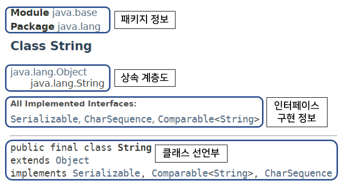

- 페이지 상단 부분
  - 클래스가 포함된 패키지 정보
  - 상속 정보
  - 인터페이스 구현 정보를 표시
- 페이지 중앙 부분
  - 클래스의 설명과 사용 방법을 간략하게 보여준다.

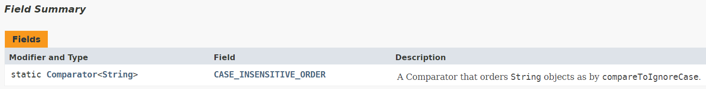

- 필드목록
  - static 또는 protected 여부와 타입
  - 필드 이름 클릭시 상세 설명 페이지로 이동

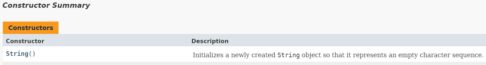

- 생성자 목록
  - 생성자 이름과 매개 변수의 타입
  - 간단한 설명
  - 생성자 이름 클릭시 상세 설명 페이지로 이동

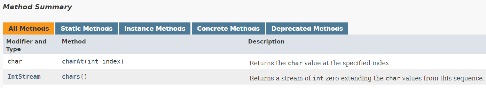

- 메소드 목록
  - 메소드의 접근제한자와 리턴타입
  - 메소드 이름과 매개 변수에 대한 정보
  - 메소드 이름 클릭시 상세 설명 페이지로 이동


- 클래스가 가지고 있는 중첩 클래스, 필드, 생성자, 메소드의 목록으로 바로 가고 싶다면?
  - 최상단의 SUMMARY: NESTED | FIELD | CONSTR | METHOD 링크를 바로 클릭

## java.lang과 java.util 패키지

- 공통적으로 가장 많이 사용하는 패키지
  - java.lang 패키지
  - java.util 패키지
  - java.time 패키지

### java.lang 패키지

- java.lang 패키지
  - 자바 프로그램의 기본적인 클래스를 담고 있는 패키지
  - java.lang 패키지에 있는 클래스와 인터페이스는 import 없이 사용할 수 있다.
- 주요 클래스

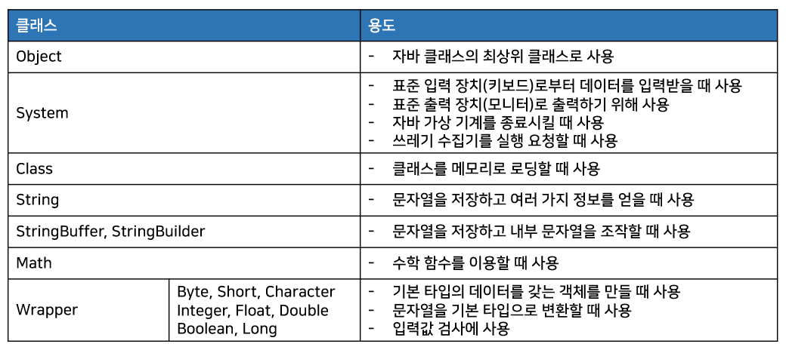

### java.util 패키지

- java.util 패키지
  - 자바 프로그램 개발에 조미료 같은 역할을 하는 클래스를 담고 있다.
  - 컬렉션 클래스들이 대부분 차지
- 주요 클래스

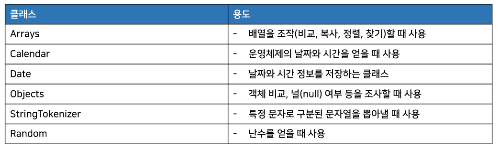

##  Object 클래스

- 클래스를 선언할 때 extends 키워드로 다른 클래스를 상속하지 않으면 암시적으로 lang.Object 클래스를 상속
  - 자바의 모든 클래스는 Object 클래스의 자식이거나 자손 클래스이다.
  - Object는 자바의 최상위 부모 클래스에 해당

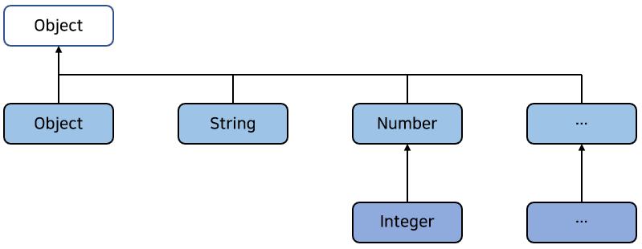

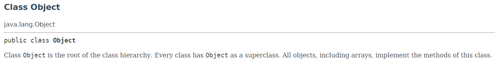

- Object 클래스는 필드가 없고, 메소드들로 구성됨
  - 모든 클래스가 Object를 상속하기 때문에 이 메소드들은 모든 클래스에서 사용이 가능

### 객체 비교(equals())

```java
// Object의 equals() 메소드
public boolean equals(Object obj) { ... }
```

- equals() 메소드의 매개 타입은 Object
  - 모든 객체가 매개값으로 대입될 수 있음을 말함
  - Object가 최상위 타입이므로 모든 객체는 Object 타입으로 자동 타입 변환될 수 있다.
- 비교 연산자(==)와 동일한 결과를 리턴
- 두 객체가 동일한 객체라면 true를 리턴, 그렇지 않으면 false를 리턴

```java
Object obj1 = new Object();
Object obj2 = new Object();

boolean result = obj1.equals(obj2); // obj1 : 기준객체 | obj2 : 비교 객체
boolean result = (obj1 == obj2)	// 위와 결과가 동일(false)
```

- 두 객체를 동등 비교할 때 equals() 메소드를 사용
  - 두 객체를 비교해서 논리적으로 동등하면 true리턴, 그렇지 않으면 false리턴
- 논리적으로 동등하다?
  - 같은 객체이건 다른 객체이건 상관없이 객체가 저장하고 있는 데이터가 동일함을 뜻함
  - ex) String 객체의 equals() 메소드
    - String 객체의 번지 비교가 아니고, 문자열이 동일한지 조사해서 같다면 true를, 그렇지 않다면 false를 리턴
    - String 클래스가 Object의 equals() 메소드를 재정의(오버라이딩)해서 번지 비교가 아닌 문자열 비교로 변경했기 때문에 가능
- Object의 equals() 메소드는 직접 사용되지 않는다.
  - 하위 클래스에서 재정의하여 논리적으로 동등 비교할 때 이용됨
  - ex) Member 객체는 다르지만 id 필드값이 같으면 논리적으로 동등한 객체로 취급하고 싶을 경우  
    Object의 equlas() 메소드를 재정의해서 id 필드값이 같음을 비교
- equals() 메소드를 재정의 할 때
  - 매개값(비교 객체)이 기준 객체와 동일한 타입의 객체인지 확인해야 한다.
    - Object 타입의 매개 변수는 모든 객체가 매개값으로 제공될 수 있다.
  - instanceof 연산자로 기준 객체와 동일한 타입인지 확인해야 함
    - 다른 타입이라면 false를 리턴해야 한다.
    - 같은 타입이라면 기준 객체 타입으로 강제 타입 변환해서 필드값이 동일한지 검사
      - 필드값이 모두 동일하다면 true, 그렇지 않으면 false를 리턴하도록 작성

```java
// Member 클래스에서 equals() 메소드를 재정의
// Member 타입이면서 id 필드값이 같을 경우 true를 리턴
public class Member {

  public String id;

  public Member(String id) {
    this.id = id;
  }

  @Override
  public boolean equals(Object obj) {
    if (obj instanceof Member) {  // 매개값이 Member 타입인지 확인
      Member member = (Member) obj;
      if (id.equals(member.id)) { // id필드값이 동일한지 검사
        return true;  // 동일하다면 true를 리턴
      }
    }
    return false; // 매개값이 Member 타입이 아니거나 id 필드값이 다른 경우 false리턴
  }
  
}
```

```java
// 실행 클래스
public class MemberExample {

  public static void main(String[] args) {
    Member obj1 = new Member("blue");
    Member obj2 = new Member("blue");
    Member obj3 = new Member("red");

    if (obj1.equals(obj2)) { // 매개값과 id 필드값이 동일하므로 true
      System.out.println("obj1과 obj2는 동등합니다.");
    } else {
      System.out.println("obj1과 obj2는 동등하지 않습니다.");
    }

    if (obj1.equals(obj3)) { // 매개값은 Member로 같지만, id 필드값이 다르므로 false
      System.out.println("obj1과 obj3은 동등합니다.");
    } else {
      System.out.println("obj1과 obj3은 동등하지 않습니다.");
    }
  }

}
```

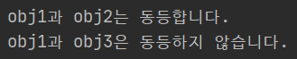

### 객체 해시코드(hashCode())

- <b>객체 해시코드란?</b>
  - 객체를 식별할 하나의 정수값
- Object의 hashCode() 메소드는 객체의 메모리 번지를 이용해서 해시코드를 만들어 리턴한다.
  - 때문에 객체마다 다른 값을 가지고 있다.
- 논리적 동등 비교 시 hashCode()를 오버라이딩할 필요성이 있다.
  - 컬렉션 프레임워크에서 HashSet, HashMap, Hashtable은 아래처럼 방법으로 두 객체가 동등한지 비교
    - 우선 hashCode() 메소드를 실행해 리턴된 해시코드 값이 같은지 본다.
    - 해시코드 값이 다르면 다른 객체로 판단
    - 해시코드 값이 같으면 equals() 메소드로 다시 비교
    - 때문에 hashCode() 메소드가 true가 나와도 equals()의 리턴값이 다르면 다른 객체가 됨

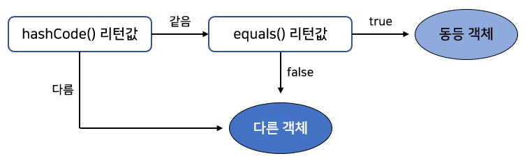

- 아래 예제의 Key 클래스는 equals() 메소드를 재정의해서 number 필드값이 같으면 true를 리턴
  - 하지만 hashCode() 메소드는 재정의하지 않았기 때문에 Object의 hashCode() 사용

```java
public class Key {

  public int number;

  public Key(int number) {
    this.number = number;
  }

  @Override
  public boolean equals(Object obj) {
    if (obj instanceof Key) {
      Key compareKey = (Key) obj;
      if (this.number == compareKey.number) {
        return true;
      }
    }
    return false;
  }
  
}
// 결과는 null이 나옴
```

- 위와 같은 경우 HashMap의 식별키로 Key 객체를 사용하면 저장된 값을 찾아오지 못함
  - number 필드값이 같더라도 hashCode() 메소드에서 리턴하는 해시코드가 다르기 때문
    - 다른 식별키로 인식한다.

```java
// "new Key(1)" 객체로 "홍길동"을 저장하고
// 다시 "new Key(1)" 객체로 저장된 "홍길동"을 읽으려고 하는 예제
import java.util.HashMap;

public class KeyExample {

  public static void main(String[] args) {
    // Key 객체를 식별키로 사용해 String 값을 저장하는 HashMap 객체 생성
    HashMap<Key, String> hashMap = new HashMap<Key, String>();

    // 식별키 "new Key(1)" 로 "홍길동" 을 저장
    hashMap.put(new Key(1), "홍길동");

    // 식별키 "new Key(1)" 로 "홍길동" 을 읽어옴
    String value = hashMap.get(new Key(1));
    System.out.println(value);
  }

}
```

- 의도한 "홍길동"을 읽기 위해서 hashCode() 메소드를 Key 클래스에 추가하면 된다.

```java
public class Key {

  public int number;

  public Key(int number) {
    this.number = number;
  }

  @Override
  public boolean equals(Object obj) {
    if (obj instanceof Key) {
      Key compareKey = (Key) obj;
      if (this.number == compareKey.number) {
        return true;
      }
    }
    return false;
  }

  @Override
  public int hashCode() {
    return number;
  }
  // hashCode()의 리턴값을 number 필드값으로 함
  // 때문에 저장할 때의 "new Key(1)"과 읽을 때의 "new Key(1)"은 같은 해시코드가 리턴됨
    
}
```

- 저장할 때의 `new Key(1)`과 읽을 때의 `new Key(1)`은 서로 다른 객체
  - 하지만 위 예제처럼 오버라이딩 시 HashMap은 `hashCode()`의 리턴값이 같고, `equals()` 리턴값이 true가 나오기 때문에 동등 객체로 평가
    - 즉, 같은 식별키로 인식함
- 결론
  - 객체의 동등 비교를 위해서는 Object의 equals() 뿐만아니라 hashCode() 메소드도 재정의해서 논리적 동등 객체일 경우 동일한 해시코드가 리턴되도록 해야 한다.

```java
// 위쪽에서 사용한 Member 클래스를 보완
// 추가로 hashCode() 메소드도 재정의
public class Member {

  public String id;

  public Member(String id) {
    this.id = id;
  }

  @Override
  public boolean equals(Object obj) {
    if (obj instanceof Member) {  // 매개값이 Member 타입인지 확인
      Member member = (Member) obj;
      if (id.equals(member.id)) { // id필드값이 동일한지 검사
        return true;  // 동일하다면 true를 리턴
      }
    }
    return false; // 매개값이 Member 타입이 아니거나 id 필드값이 다른 경우 false리턴
  }

  @Override
  public int hashCode() {
    return id.hashCode(); // id가 동일한 문자열인 경우 같은 해시 코드를 리턴함
  }

}
```

### 객체 문자 정보(toString())

- Object 클래스의 toString() 메소드
  - 객체의 문자 정보를 리턴
  - 기본적으로 "클래스명@16진수해시코드"로 구성된 문자 정보를 리턴
- 객체의 문자 정보란?
  - 객체를 문자열로 표현한 값

```java
// 기본적인 toString() 메소드는 "클래스명@16진수해시코드"로 구성된 문자정보 리턴
Object obj = new Object();
System.out.println( obj.toString() );
```

- Object 클래스의 toString() 메소드의 기본 리턴값은 값어치가 별로 없는 정보
  - Object 하위 클래스는 toString() 메소드를 재정의(오버라이딩)하여 간결하고 유익한 정보를 리턴
  - ex1 ) java.util 패키지의 Date 클래스는 toString() 메소드를 재정의하여 현재 시스템의 날짜와 시간 정보를 리턴
  - ex2 ) String 클래스는 toString() 메소드를 재정의하여 저장하고 있는 문자열을 리턴

```java
// Object 클래스와 Date 클래스의 toString() 메소드의 리턴값을 출력하는 예
import java.util.Date;

public class ToStringExample {

  public static void main(String[] args) {
    Object obj1 = new Object();
    Date obj2 = new Date();
    System.out.println(obj1.toString());
    System.out.println(obj2.toString());
  }

}
```

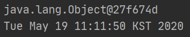

- 직접 만드는 클래스도 toString() 메소드를 재정의하여 좀 더 유용한 정보를 리턴하도록 할 수 있다.

```java
// SmartPhone 클래스에서 toString() 메소드를 오버라이딩하여 제작회사와 운영체제를 리턴
public class SmartPhone {
  
  private String company;
  private String os;

  public SmartPhone(String company, String os) {
    this.company = company;
    this.os = os;
  }

  @Override
  public String toString() { // toString() 재정의
    return company + ", " + os;
  }
  
}
```

```java
// 실행 클래스
public class SmartPhoneExample {

  public static void main(String[] args) {
    SmartPhone myPhone = new SmartPhone("구글", "안드로이드");

    String strObj = myPhone.toString();
    System.out.println(strObj);

    System.out.println(myPhone); // myPhone.toString() 자동호출
  }

}
```

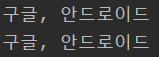

- System.out.println() 메소드
  - 매개값이 기본타입일 경우, 해당 값을 그대로 출력
  - 매개값이 객체일 경우 객체의 toString() 메소드를 호출해서 리턴값을 받아 출력

### 객체 복제(clone())

- 객체 복제
  - 원본 객체의 필드값과 동일한 값을 가지는 새로운 객체를 생성하는 것
- 객체를 복제하는 이유
  - 원본 객체를 안전하게 보호하기 위해
    - 신뢰하지 않는 영역으로 원본 객체를 넘길경우 원본 객체의 데이터가 훼손될 수 있다.
    - 신뢰하지 않는 영역으로 복제된 객체를 넘기는 것이 좋다.
    - 복제된 객체의 데이터가 훼손되더라도 원본 객체는 아무런 영향을 받지 않는다.
  - 안전하게 데이터를 보호할 수 있게 됨
- 객체를 복제하는 방법
  - 얕은 복제
  - 깊은 복제

#### 얕은 복제(thin clone)

- 얕은 복제(thin clone)란?
  - 단순히 필드값을 복사해서 객체를 복제하는 것
  - 필드값만 복제하기 때문에 필드가 기본 타입일 경우 값 복사
    - 참조 타입일 경우 객체의 번지가 복사
- ex) 원본 객체에 int타입 필드와 배열 타입 필드가 있을 경우의 얕은 복제된 객체의 필드값

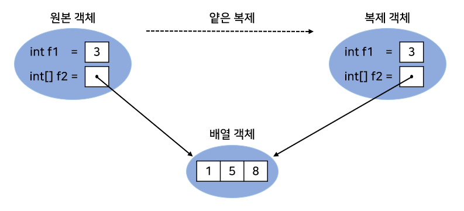

- Object의 clone() 메소드는 자신과 동일한 필드값을 가진 얕은 복제된 객체를 리턴
- clone() 메소드로 객체를 복제하려면 원본 객체는 반드시 java.lang.Cloneable 인터페이스를 구현해야한다.
  - 클래스 설계자가 복제를 허용한다는 의도적인 표시를 하기 위해서
- 클래스 설계자가 복제를 허용하지 않는다면 Cloneable 인터페이스를 구현하지 않으면 된다.
  - 구현하지 않으면 clone() 메소드를 호출할 때 CloneNotSupportedException 예외 발생
  - clone() 메소드는 CloneNotSupportedException 예외 처리가 필요한 메소드
    - try-catch 구문이 필요

```java
try {
    Object obj = clone();
} catch (CloneNotSupportedException e) { }
```

- 예제

```java
// Member 클래스가 Cloneable 인터페이스를 구현
// 때문에 getMember() 메소드에서 clone() 메소드로 자신을 복제하여 외부로 리턴할 수 있다.
public class Member implements Cloneable {
  public String id;
  public String name;
  public String password;
  public int age;
  public boolean adult;

  public Member(String id, String name, String password, int age, boolean adult) {
    this.id = id;
    this.name = name;
    this.password = password;
    this.age = age;
    this.adult = adult;
  }

  public Member getMemeber() {
    Member cloned = null;
    try {
      cloned = (Member) clone(); // clone() 메소드의 리턴 타입은 Object
        						 // Member 타입으로 캐스팅이 필요
    } catch (CloneNotSupportedException e) { }
    return cloned;
  }

}
```

```java
// 실행 클래스
  public static void main(String[] args) {
    // 원본 객체 생성
    Member original = new Member("blue", "홍길동", "12345", 25, true);

    // 복제 객체를 얻은 후에 패스워드 변경
    Member cloned = original.getMemeber();
    cloned.password = "67890"; // 복제 객체에서 패스워드 변경

    System.out.println("[복제 객체의 필드값]");
    System.out.println("id: " + cloned.id);
    System.out.println("name: " + cloned.name);
    System.out.println("password: " + cloned.password);
    System.out.println("age: " + cloned.age);
    System.out.println("adult: " + cloned.adult);

    System.out.println();

    System.out.println("[원본 객체의 필드값]");
    System.out.println("id: " + original.id);
    System.out.println("name: " + original.name);
    System.out.println("password: " + original.password); // 변함없음
    System.out.println("age: " + original.age);
    System.out.println("adult: " + original.adult);
  }

}
```

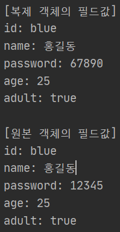

#### 깊은 복제(deep clone)

- 얕은 복제(thin clone)의 경우 참조 타입 필드는 번지만 복제됨
  - 원본 객체의 필드와 복제 객체의 필드는 같은 객체를 참조하게 됨
  - 복제 객체에서 참조 객체 변경시 원본 객체도 변경된 객체를 가지게 됨(얕은 복제의 단점)
- 깊은 복제(deep clone)
  - 얕은 복제의 반대
  - 참조하고 있는 객체도 복제한다.
- ex) 원본 객체를 깊은 복제했을 경우

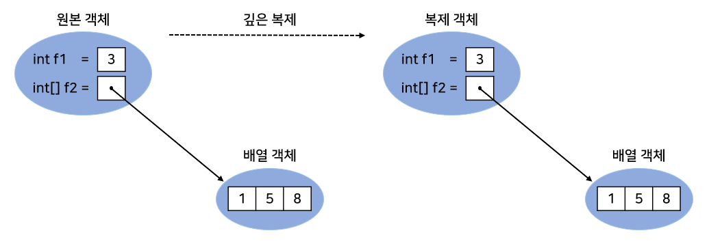

- 깊은 복제를 하려면?
  - Object의 clone() 메소드를 재정의해서 참조 객체를 복제하는 코드를 직접 작성
- 예제

```java
public class Member implements Cloneable {

  public String name;
  public int age;
  public int[] scores; // 참조 타입 필드(깊은 복제의 대상)
  public Car car; // 참조 타입 필드(깊은 복제의 대상)

  public Member(String name, int age, int[] scores, Car car) {
    this.name = name;
    this.age = age;
    this.scores = scores;
    this.car = car;
  }

  @Override
  protected Object clone() throws CloneNotSupportedException {
    // 얕은 복사를 해서 name, age를 복제
    Member cloned = (Member) super.clone();
    // scores를 깊은 복제
    cloned.scores = Arrays.copyOf(this.scores, this.scores.length);
    // car를 깊은 복제
    cloned.car = new Car(this.car.model);
    // 깊은 복제된 Member 객체를 리턴
    return cloned;
  }

  public Member getMember() {
    Member cloned = null;
    try {
      cloned = (Member) clone(); // 재정의된 clone() 메소드 호출
    } catch (CloneNotSupportedException e) {
      e.printStackTrace();
    }
    return cloned;
  }
  
}
```

```java
// Car 클래스
public class Car {

  public String model;

  public Car(String model) {
    this.model = model;
  }

}
```

```java
// 실행 클래스
public class MemberExample {

  public static void main(String[] args) {
    // 원본 객체 생성
    Member original = new Member("홍길동", 25, new int[]{90, 90}, new Car("소나타"));

    // 복제 객체를 얻은 후 참조 객체의 값 변경
    Member cloned = original.getMember();
    cloned.scores[0] = 100;
    cloned.car.model = "그랜저";

    System.out.println("[복제 객체의 필드값]");
    System.out.println("name: " + cloned.name);
    System.out.println("age: " + cloned.age);
    System.out.print("scores: {");
    for (int i = 0; i < cloned.scores.length; i++) {
      System.out.print(cloned.scores[i]);
      System.out.print((i == (cloned.scores.length - 1)) ? "" : ",");
        										// 마지막 원소면 ',' 미출력
    }
    System.out.println("}");
    System.out.println("car: " + cloned.car.model);

    System.out.println();

    System.out.println("[원본 객체의 필드값]");
    System.out.println("name: " + original.name);
    System.out.println("age: " + original.age);
    System.out.print("scores: {");
    for (int i = 0; i < original.scores.length; i++) {
      System.out.print(original.scores[i]);
      System.out.print((i == (original.scores.length - 1)) ? "" : ",");
        										// 마지막 원소면 ',' 미출력
    }
    System.out.println("}");
    System.out.println("car: " + original.car.model);
  }

}
// 깊은 복제 후 복제본을 변경해도 원본에 영향을 미치지 않음
```

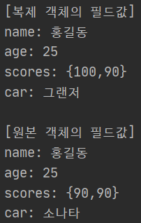

### 객체 소멸자(finalize())

- 문제가 있어 자바9부터 <b>Deprecated</b>됨
  - Deprecated : 예전 자바 버전에서는 사용되었으나, 현재 버전과 차후 버전에서는 사용하지 말라는 뜻
- 오류/시점/성능/수행성 모두 보장하지 못함

## Objects 클래스

- Object와 유사한 java.util.Objects 클래스
  - 객체 비교, 해시코드 생성, null 여부, 객체 문자열 리턴 등의 연산을 수행하는 정적 메소드들로 구성된 Object의 유틸리티 클래스
- Objects 클래스가 가지고 있는 정적 메소드들

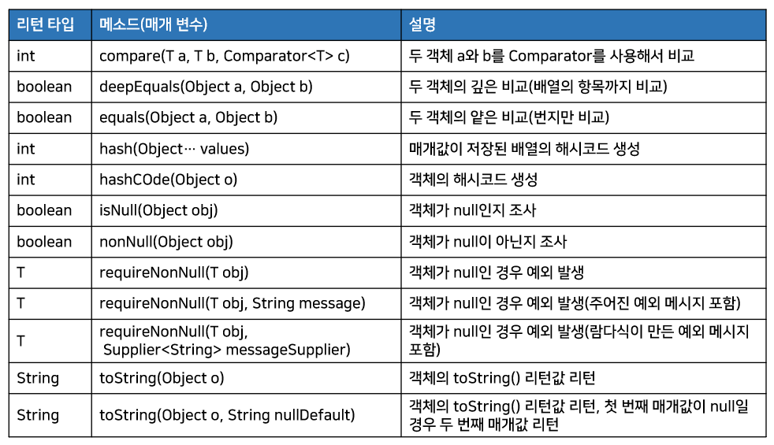

### 객체 비교(compare(T a, T b, comparator\<T>c))

- Objects.compare(T a, T b, Comparator\<T>c) 메소드
  - 두 객체를 비교자(Comparator)로 비교해서 int 값을 리턴
- java.util.Comparator\<T>
  - 제네릭 인터페이스 타입으로 두 객체를 비교하는 Compare(T a, T b) 메소드가 정의되어 있음
  - compare() 메소드의 리턴 타입은 int
    - a가 b보다 작으면 음수, 같으면 0, 크면 양수를 리턴하도록 구현 클래스를 만들어야 한다.

```java
public interface Comparator<T> {
    int compare(T a, T b);
}
```

```java
// 학생 객체에서 학생 번호로 비교하는 StudentComparator 구현 클래스
public class StudentComparator implements Comparator<Student> {
  @Override
  public int compare(Student a, Student b) {
    if (a.sno < b.sno) return -1;
    else if (a.sno == b.sno) return 0;
    else return 1;
    // return Integer.compare(a.sno, b.sno); 으로 대체가능
  }
}
```

- 세 개의 학생 객체를 StudentComparator로 비교해서 결과를 리턴하는 예제

```java
public class CompareExample {

  public static void main(String[] args) {
    Student s1 = new Student(1);
    Student s2 = new Student(1);
    Student s3 = new Student(2);

    int result = Objects.compare(s1, s2, new StudentComparator());
    System.out.println(result);
    result = Objects.compare(s1, s3, new StudentComparator());
    System.out.println(result);
  }

  static class Student {
    int sno;

    Student(int sno) {
      this.sno = sno;
    }
  }

  static class StudentComparator implements Comparator<Student> {
    @Override
    public int compare(Student o1, Student o2) {
      /*if (o1.sno < o2.sno) return -1;
      else if(o1.sno == o2.sno) return 0;
      else return -1;*/
      return Integer.compare(o1.sno, o2.sno);
    }
  }

}
```


### 동등 비교(equals()와 deepEquals())

- Objects.equals(Object a, Object b)는 두 객체의 동등을 비교
  - 아래 표와같은 결과를 리턴
  - 특이한 점으로, a와 b가 모두 null일 경우 true를 리턴
  - a와 b가 null이 아닌 경우 a.equals(b)의 결과를 리턴

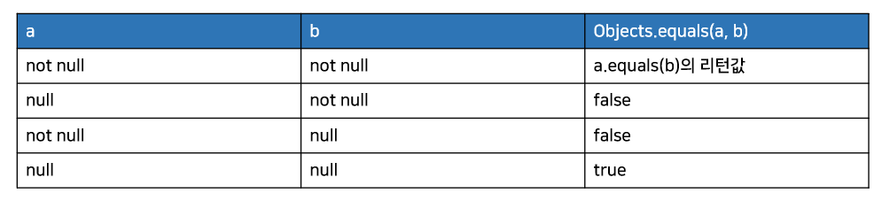

- Objects.deepEqulas(Object a, Object b)역시 두 객체의 동등을 비교
  - a와 b가 서로 다른 배열일 경우
    - 항목 값이 모두 같다면 true를 리턴
  - Arrays.deepEquals(Object[] a, Object[] b)와 동일

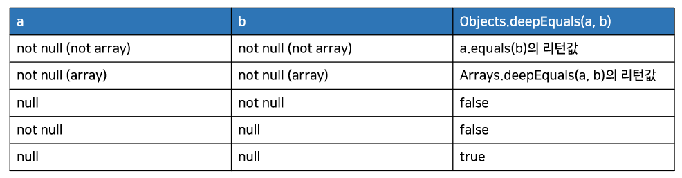

```java
import java.util.Arrays;
import java.util.Objects;

public class EqualsAndDeepEqualsExample {

  public static void main(String[] args) {
    Integer o1 = 1000;
    Integer o2 = 1000;
    System.out.println(Objects.equals(o1, o2));
    System.out.println(Objects.equals(o1, null));
    System.out.println(Objects.equals(null, o2));
    System.out.println(Objects.equals(null, null));
    System.out.println(Objects.deepEquals(o1, o2) + "\n");

    Integer[] arr1 = {1, 2};
    Integer[] arr2 = {1, 2};
    System.out.println(Objects.equals(arr1, arr2));
    System.out.println(Objects.deepEquals(arr1, arr2));
    System.out.println(Arrays.deepEquals(arr1, arr2));
    System.out.println(Objects.deepEquals(null, arr2));
    System.out.println(Objects.deepEquals(arr1, null));
    System.out.println(Objects.deepEquals(null, null));
  }

}
```

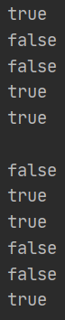

### 해시코드 생성(hash(), hashCode())

- Objects.hash(Object... values) 메소드
  - 매개값으로 주어진 값들을 이용해 해시코드를 생성하는 역할을 함
  - 주어진 매개값들로 배열을 생성하고 Arrays.hashCode(Object[])를 호출해서 해시코드를 얻는다.
    - 이 값을 리턴
  - 클래스가 hashCode()를 재정의할 때 리턴값을 생성하기 위해 사용하면 좋다.
  - 클래스가 여러 필드를 가지고 있을 때 이 필드들로부터 해시 코드를 생성하게 된다면
    - 동일한 필드값을 가지는 객체는 동일한 해시코드를 가질 수 있다.

```java
@Override
public int hashCode() { // hashCode()재정의
    return Objects.hash(field1, field2, field3);
}
```

- Objects.hashCode(Object o)는 매개값으로 주어진 객체의 해시코드를 리턴한다.
  - 때문에 o.hashCode()의 리턴값과 동일하다.
  - 차이점은 매개값이 null이면 0을 리턴

```java
// Student 객체의 해시코드를 생성하기 위해 Student의 필드인
// sno와 name을 매개값으로 해서 Objects.hash() 메소드를 호출.
import java.util.Objects;

public class HashCodeExample {

  public static void main(String[] args) {
    Student s1 = new Student(1, "홍길동");
    Student s2 = new Student(1, "홍길동");
    System.out.println(s1.hashCode());
    System.out.println(Objects.hashCode(s2));
  }

  static class Student {
    int sno;
    String name;

    Student(int sno, String name) {
      this.sno = sno;
      this.name = name;
    }

    @Override
    public int hashCode() {
      return Objects.hash(sno, name);
      // 학생 번호와 이름이 동일하다면 같은 해시코드를 얻음
    }
  }

}
```

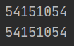

### 널 여부 조사(isNull(), nonNull(), requireNonNull())

- Objects.isNull(Object obj)
  - 매개값이 null일 경우 true를 리턴
- nonNull(Object obj)
  - 매개값이 not null일 경우 true를 리턴
- requireNonNull()은 아래의 세 가지로 오버로딩 되어 있음

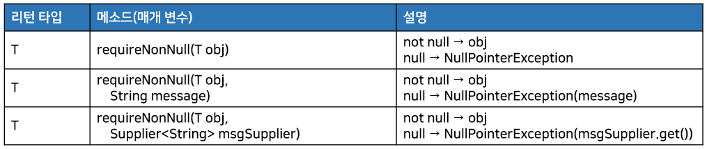

- 첫 번째 매개값이 not null이라면 첫 번째 매개값을 리턴
  - null 이면 모두 NullPointerException을 발생
- 두 번째 매개값은 NullPointerException의 예외 메시지를 제공

```java
import java.util.Objects;

public class NullExample {

  public static void main(String[] args) {
    String str1 = "홍길동";
    String str2 = null;

    System.out.println(Objects.requireNonNull(str1));


    try {
      String name = Objects.requireNonNull(str2);
    } catch (Exception e) {
      System.out.println(e.getMessage());
    }

    try {
      String name = Objects.requireNonNull(str2, "이름이 없습니다.");
    } catch (Exception e) {
      System.out.println(e.getMessage());
    }

    try {										// 두 번째 매개값으로 람다식
      String name = Objects.requireNonNull(str2, () -> "이름이 없다니깐요");
    } catch (Exception e) {
      System.out.println(e.getMessage());
    }
  }

}
```

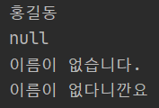

### 객체 문자 정보(toString())

- Objects.toString()
  - 객체의 문자 정보를 리턴
  - 두 가지로 오버로딩 되어있다.

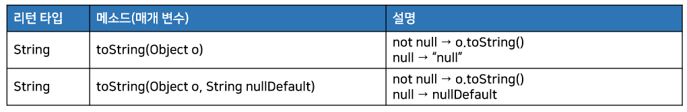

- 첫 번째 매개값이 not null 이면 toString()으로 얻은 값을 리턴
  - null 이면 "null" 또는 두 번째 매개값인 nullDefault를 리턴한다.

```java
import java.util.Objects;

public class ToStringExample {

  public static void main(String[] args) {
    String str1 = "홍길동";
    String str2 = null;

    System.out.println(Objects.toString(str1));
    System.out.println(Objects.toString(str2));
    System.out.println(Objects.toString(str2, "이름이 없습니다."));
  }

}
```

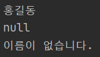

## System 클래스

- 자바 프로그램은 운영체제상에서 바로 실행되는 것이 아니다.
  - JVM 위에서 실행된다.
- 따라서 운영체제의 모든 기능을 자바 코드로 직접 접근하기 어렵다.
  - 하지만 java.lang 패키지에 속하는 System 클래스를 이용하면 운영체제의 일부 기능을 이용할 수 있다.
  - 즉, 프로그램 종료, 키보드로부터 입력, 모니터로 출력, 메모리 정리, 현재 시간 읽기, 시스템 프로퍼티 읽기, 환경 변수 읽기 등이 가능
- System 클래스의 모든 필드와 메소드는 정적(static) 필드와 정적(static) 메소드로 구성되어 있다.

### 프로그램 종료(exit())

- System 클래스의 exit() 메소드
  - 현재 실행되고 있는 프로세스를 강제 종료시키는 역할
- exit() 메소드는 int 매개값을 지정하도록 되어 있다.
  - 이 값을 종료 상태값이라고 한다.
  - 일반적으로 정상 종료일 경우 0으로 지정
    - 비정상 종료일 경우 0 이외의 다른 값을 준다.

```java
System.exit(0);
```

- 어떠한 값을 주더라도 종료가 된다.
  - 만약 특정 값이 입력되었을 경우에만 종료하고 싶다면?
    - 자바의 보안 관리자를 직접 설정해서 종료 상태값을 확인하면 된다.
- System.exit()가 실행되면 보안 관리자의 checkExit() 메소드가 자동 호출
  - 이 메소드에서 종료 상태값을 조사해서 특정 값이 입력되지 않으면  SecurityException을 발생시킴
    - System.exit()를 호출한 곳에서 예외 처리를 할 수 있도록 해준다.
- checkExit() 가 정상적으로 실행되면 JVM은 종료가 된다.

```java
// 종료 상태 값으로 5가 입력되면 JVM을 종료하도록 보안 관리자를 설정
System.setSecurityManager(new SecurityManager(){
    @Override
    public void checkExit(int status) {
        if (status != 5) {
            throw new SecurityException();
        }
    }
});
```

- 종료 상태값이 5일 경우에만 프로세스를 종료하는 예제

```java
public class ExitExample {

  public static void main(String[] args) {
    // 보안 관리자 설정
    System.setSecurityManager(new SecurityManager() {
      @Override
      public void checkExit(int status) {
        if (status != 5) {
          throw new SecurityException();
        }
      }
    });

    for (int i = 0; i < 10; i++) {
      // i값 출력
      System.out.println(i);
      try {
        // JVM 종료 요청
        System.exit(i);
      } catch (SecurityException e) { }
    }
  }

}
```

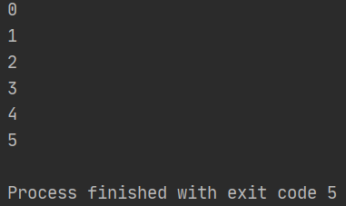

### 쓰레기 수집기 실행(gc())

- 자바는 JVM이 알아서 메모리를 자동으로 관리
  - JVM은 메모리가 부족할 때, CPU가 한가할 때 쓰레기 수집기 (Garbage Collector)를 실행
    - 사용하지 않는 객체를 자동 제거
- new 연산자로 Car 객체를 생성하고 변수 myCar에 객체 번지를 대입했다면?

```java
Car myCar = new Car();
```

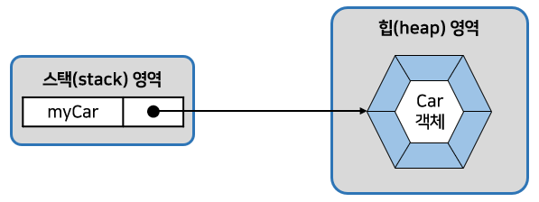

- 만약 변수 myCar = null을 대입하면 myCar는 객체의 번지를 읽게된다.
  - 더 이상 Car 객체는 사용할 수가 없고, 쓰레기가 된다.

```java
myCar = null;
```

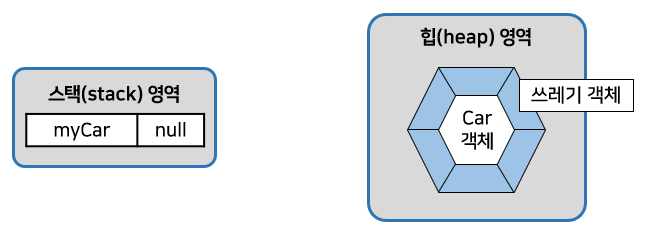

- 변수 myCar가 다른 Car 객체를 참조할 경우도 마찬가지
  - 이전 객체의 번지를 잃기 때문에 이전 객체는 쓰레기가 된다.

```java
Car myCar = new Car();	// 이전 참조 객체
myCar = new Car();		// 현재 참조 객체
```

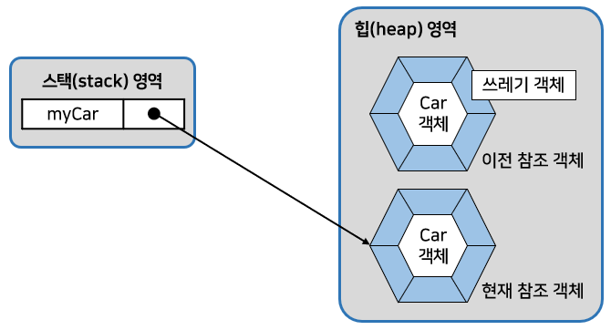

- 쓰레기 수집기는 개발자가 직접 코드로 실행시킬 수 없다.
  - System.gc() 메소드로 JVM에게 가능한한 빨리 실행해 달라고 요청할 수는 있다.
- System.gc() 메소드가 호출되면 쓰레기 수집기가 바로 실행되는 것은 아니다.
  - JVM은 빠른 시간 내에 실행시키기 위해 노력한다.

```java
System.gc();
```

- 쓰레기가 생길 때마다 쓰레기 수집기가 동작한다면?
  - 수행되어야 할 프로그램의 속도가 떨어지기 때문에 성능 측면에서 좋지 않다.
  - 메모리가 충분하다면 굳이 쓰레기 수집기를 실행할 필요가 없다.
- gc() 메소드는 메모리가 열악하지 않은 환경이라면 거의 사용할 일이 없다.
- 쓰레기 수집기는 객체를 삭제하기 전에 마지막으로 객체의 [소멸자](#객체 소멸자(finalize())를 실행한다.

### 현재 시각 읽기(currentTimeMillis(), nano Time())

- System 클래스의 currentTimeMillis() 메소드와 nanoTime 메소드
  - 컴퓨터의 시계로부터 현재 시간을 읽어
    - 밀리세컨드(1/1000)초 단위와
    - 나노세컨드(1/10<sup>9</sup>초) 단위의 long 값을 리턴한다.

```java
long time = System.currentTimeMillis();
long time = System.nanoTime();
```

- 리턴값은 주로 프로그램의 실행 소요 시간 측정에 사용된다.
  - 프로그램 시작 시 시각을 읽고, 프로그램이 끝날 때 시각을 읽어 차이를 구하면 프로그램 실행 소요 시간

```java
// for문을 사용해서 1부터 1000000 까지의 합을 구하는데 걸린 시간출력 예제
public class SystemTimeExample {

  public static void main(String[] args) {
    long time1 = System.nanoTime(); // 시작 시간 읽기

    int sum = 0;
    for (int i = 1; i <= 1000000; i++) {
      sum += i;
    }

    long time2 = System.nanoTime(); // 끝 시간 읽기

    System.out.println("1~1000000까지의 합 : " + sum);
    System.out.println("계산에 " + (time2 - time1) + " 나노초가 소요됨");
  }

}
```

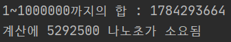

### 시스템 프로퍼티 읽기(getProperty())

- 시스템 프로퍼티(System Property)는 JVM이 시작할 때 자동 설정되는 시스템의 속성값을 말한다.
  - ex)
    - 운영체제의 종류 및 자바 프로그램을 실행시킨 사용자 아이디
    - JVM의 버전
    - 운영체제에서 사용되는 파일 경로 구분자 등
- 시스템 프로퍼티는 키(key)와 값(value)으로 구성되어 있다.
- (표)대표적인 키와 값

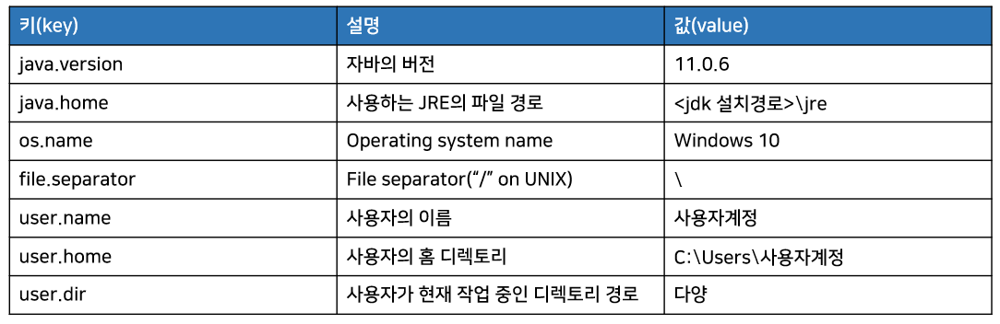

- 시스템 프로퍼티를 읽어오기 위해 System.getProperty() 메소드를 이용
  - 시스템 프로퍼티의 키 이름을 매개값으로 받고, 해당 키에 대한 값을 문자열로 리턴한다.

```java
String value = System.getProperty(String key);
```

```java
// 운영체제 이름, 사용자 이름, 사용자 홈 디렉토리를 알아내고 출력하는 예제
// 또한 모든 시스템 프로퍼티를 키와 값으로 출력
import java.util.Properties;
import java.util.Set;

public class GetPropertyExample {

  public static void main(String[] args) {
    String osName = System.getProperty("os.name");
    String userName = System.getProperty("user.name");
    String userHome = System.getProperty("user.home");

    System.out.println("운영체제 이름: " + osName);
    System.out.println("사용자 이름: " + userName);
    System.out.println("사용자 홈디렉토리: " + userHome);

    System.out.println("----------------------------");
    System.out.println(" [ key ]  value ");
    System.out.println("----------------------------");
    Properties props = System.getProperties();
    Set keys = props.keySet();
    // Set객체로부터 키를 하나씩 얻어내어 문자열로 변환한 다음,
    // System.getProperty() 메소드로 값을 얻어 키와 값을 모두 출력
    for (Object objKey : keys) {
      String key = (String) objKey;
      String value = System.getProperty(key);
      System.out.println("[ " + key + " ]  " + value);
    }
  }

}
```

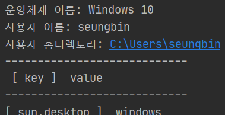

- System.getProperties() 메소드
  - 모든 (키, 값) 쌍을 저장하고 있는 Properties 객체를 리턴한다.
  - 이 객체의 keySet() 메소드를 호출하면 키만으로 구성된 Set 객체를 얻을 수 있다.

### 환경 변수 읽기(getenv())

- 환경 변수(Environment Variable)
  - 대부분의 운영체제가 실행되는 프로그램들에게 유용한 정보를 제공할 목적으로 제공
  - 운영체제에서 이름(Name)과 값(Value)으로관리되는 문자열 정보
  - 운영체제가 설치될 때 기본적인 내용이 설정된다.
  - 사용자가 직접 설정하거나 응용 프로그램이 설치될 때 자동적으로 추가 설정되기도 한다.
- 자바는 환경 변수의 값이 필요할 경우 System.getenv() 메소드를 사용
  - 매개값으로 환경 변수 이름을 주면 값을 리턴한다.

```java
String value = System.getenv(String name);
```

- JAVA_HOME 환경 변수의 값을 얻어와서 출력하는 예제

```java
public class SystemEnvExample {

  public static void main(String[] args) {
    String javaHome = System.getenv("JAVA_HOME");
    System.out.println("JAVA_HOME: " + javaHome);
  }

}
```

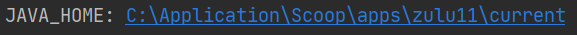

## Class 클래스

- 자바는 클래스와 인터페이스의 메타 데이터를 java.lang 패키지에 소속된 Class 클래스로 관리
  - 메타 데이터란?
    - 클래스의 이름, 생성자 정보, 필드 정보, 메소드 정보를 말한다.

### Class 객체 얻기(getClass(), forName())

- 프로그램에서 Class 객체를 얻기 위해서는 Object 클래스가 가지고 있는 getClass() 메소드를 이용
  - Object는 모든 클래스의 최상위 클래스이므로 모든 클래스에서 getClass() 메소드를 호출할 수 있다.

```java
Class clazz = obj.getClass();
```

- getClass() 메소드는 해당 클래스로 객체를 생성했을 때만 사용할 수 있다.
  - 객체를 생성하기 전에 직접 Class 객체를 얻을 수도 있다.
- Class는 생성자를 감추고 있기 때문에 new 연산자로 객체를 만들 수 없다.
  - 정적 메소드인 forName()을 이용해야 한다.
- forName() 메소드
  - 클래스 전체 이름(패키지가 포함된 이름)을 매개값으로 받고 Class 객체를 리턴한다.

```java
try {
    Class clazz = Class.forName(String className);
} catch (ClassNotFoundException e) {
}
```

- Class.forName() 메소드는 매개값으로 주어진 클래스를 찾지 못하면 ClassNotFoundException 예외를 발생
  - 예외 처리가 필요하다.

```java
// 두 가지 방법으로 Car 클래스의 Class 객체를 얻고,
// Class의 메소드를 이용해 클래스의 전체 이름과 간단한 이름 그리고 패키지 이름을 얻어 출력하는 예제
public class ClassExample {

  public static void main(String[] args) {
    Car car = new Car();
    Class clazz1 = car.getClass();
    System.out.println(clazz1.getName());
    System.out.println(clazz1.getSimpleName());
    System.out.println(clazz1.getPackage().getName());
    System.out.println();

    try {
      Class clazz2 = Class.forName("test.Car");
      System.out.println(clazz2.getName());
      System.out.println(clazz2.getSimpleName());
      System.out.println(clazz2.getPackage().getName());
    } catch (ClassNotFoundException e) {
      e.printStackTrace();
    }
  }

}

class Car {
}
```

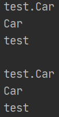

### 리플렉션(getDeclaredConstructors(), getDeclaredFields(), getDeclaredMethods())

- Class 객체를 이용하면 클래스의 생성자, 필드, 메소드 정보를 알아낼 수 있다.
  - 이것을 리플렉션(Reflection) 이라고 한다.
- Class 객체는 리플렉션을 위해 `getDeclaredConstructors()`, `getDeclaredFields()`, `getDeclaredMethods()`를 제공하고 있다.

```java
Constructor[] constructors = clazz.getDeclaredConstructors();
Field[] fields = clazz.getDeclaredFields();
Method[] methods = clazz.getDeclaredMethods();
```

- 세 메소드는 각각 Constructor 배열, Field 배열, Method 배열을 리턴한다.
- Constructor, Field, Method 클래스는 모두 java.lang.reflect 패키지에 소속되어 있다.
- `getDeclaredFields()`, `getDeclaredMethods()`는 클래스에 선언된 멤버만 가져온다.
  - 상속된 멤버는 가져오지 않는다.
  - 상속된 멤버로 얻고 싶다면?
    - `getFields()`, `getMethods()`를 이용해야 한다.
      - 단, public 멤버만 가져온다.

```java
// Car 클래스에서 선언된 생성자, 필드, 메소드의 정보를 얻고 출력하는 예제
import java.lang.reflect.Constructor;
import java.lang.reflect.Field;
import java.lang.reflect.Method;

public class ReflectionExample {

  public static void main(String[] args) throws Exception {
    Class clazz = Class.forName("test.Car");

    System.out.println("[클래스 이름]");
    System.out.println(clazz.getName());
    System.out.println();

    // 생성자 이름과 매개 변수 정보를 출력
    System.out.println("[생성자 정보]");
    Constructor[] constructors = clazz.getDeclaredConstructors();
    for (Constructor constructor : constructors) {
      System.out.print(constructor.getName() + "(");
      Class[] parameters = constructor.getParameterTypes();
      printParameters(parameters);
      System.out.println(")");
    }
    System.out.println();

    // 필드 타입과 필드 이름을 출력
    System.out.println("[필드 정보]");
    Field[] fields = clazz.getDeclaredFields();
    for (Field field : fields) {
      System.out.println(field.getType().getSimpleName() + " " + field.getName());
    }
    System.out.println();

    // 메소드 이름과 매개 변수를 출력
    System.out.println("[메소드 정보]");
    Method[] methods = clazz.getDeclaredMethods();
    for (Method method : methods) {
      System.out.print(method.getName() + "(");
      Class[] parameters = method.getParameterTypes();
      printParameters(parameters);
      System.out.println(")");
    }

  }

  private static void printParameters(Class[] parameters) {
    for (int i = 0; i < parameters.length; i++) {
      System.out.print(parameters[i].getName());
      if (i < (parameters.length - 1)) {
        System.out.print(",");
      }
    }
  }

}

class Car {
  private String model;
  private String owner;

  public String getOwner() {
    return owner;
  }

  public void setModel(String model) {
    this.model = model;
  }

  public String getModel() {
    return model;
  }

  public void setOwner(String owner) {
    this.owner = owner;
  }

}
```

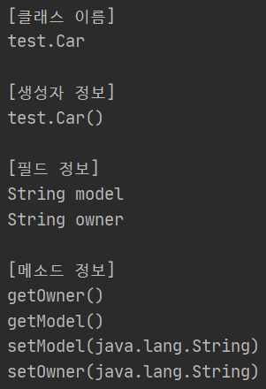

- Car 클래스가 자체적으로 가지고 있는 멤버 전체가 출력

### 동적 객체 생성(newInstance())

- Class 객체를 이용하면 new 연산자를 사용하지 않아도 동적으로 객체를 생성할 수 있다.
  - 코드 작성 시에 클래스 이름을 결정할 수 없고, 런타임 시에 클래스 이름이 결정되는 경우에 매우 유용

```java
// Class.forName() 메소드로 Class 객체를 얻은다음
// newInstance() 메소드를 호출하면 Object 타입의 객체를 얻을 수 있다.
try {
    Class clazz = Class.forName("런타임 시 결정되는 클래스 이름");
    Object obj = clazz.newInstance();
} catch (ClassNotFoundException e) {
} catch (InstantiationException e) {
} catch (IllegalAccessException e) {
}
```

- newInstacne() 메소드
  - 기본 생성자를 호출한다.
    - 때문에 객체를 생성하기 때문에 반드시 클래스에 기본 생성자가 존재해야 한다.
  - 만약 매개 변수가 있는 생성자를 호출하고 싶다면?
    - 리플렉션으로 Constructor 객체를 얻어 newInstance() 메소드를 호출하면 된다.
  - 두 가지 예외가 발생할 수 있다.
    - InstantiationException 예외 : 해당 클래스가 추상 클래스이거나 인터페이스일 경우에 발생
    - IllegalAccessException 예외 : 해당 클래스나 생성자가 접근 제한자로 인해 접근할 수 없을 경우 발생
    - 예외 처리가 필요하다.
  - 리턴 타입
    - Object이므로 원래 클래스 타입으로 변환해야만 메소드를 사용할 수 있다.
      - 강제 타입 변환을 해야함.
      - 하지만 클래스 타입을 모르는 상태이므로 변환을 할 수가 없다.
    - 문제를 해결하려면 인터페이스 사용이 필요하다.
- ex) Action 인터페이스와 구현 클래스인 SendAction, ReceiveAction

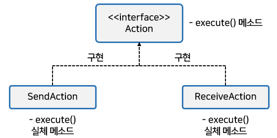

- Class.forName() 메소드의 매개값으로 "SendAction" 또는 "ReceiveAction"을 주면?
  - Class 객체가 만들어지고, Class 객체의 newInstance() 메소드로 Object 객체를 얻을 수 있다.
  - 얻어진 객체는 모두 Action 인터페이스를 구현하고 있기 때문에 Action 인터페이스 타입으로 변환가능
- Action 인터페이스의 `execute()` 메소드를 호출하면 개별 클래스의 실체 메소드인 `execute()` 메소드 실행

```java
Class clazz = Class,forName("SendAction" 또는 "ReceiveAction");
Action action = (Action) clazz.newInstance();
action.execute(); // SendAction 또는 ReceiveAction의 execute()가 실행됨
```

- 전체 예제

```java
// Action.java 인터페이스
public interface Action {
  public void execute();
}
```

```java
// SendAction.java 발신 클래스
public class SendAction implements Action {
  @Override
  public void execute() {
    System.out.println("데이터를 보냅니다.");
  }
}
```

```java
// ReceiveAction.java 수신 클래스
public class ReceiveAction implements Action {
  @Override
  public void execute() {
    System.out.println("데이터를 받습니다.");
  }
}
```

```java
// NewInstanceExample.java 동적 객체 생성 및 실행
public class NewInstanceExample {

  public static void main(String[] args) {
    try {
      Class clazz = Class.forName("test.exam_new_instance.SendAction");
      //Class clazz = Class.forName("test.exam_new_instance.ReceiveAction");
      Action action = (Action) clazz.newInstance();
      action.execute();
    } catch (ClassNotFoundException e) {
      e.printStackTrace();
    } catch (IllegalAccessException e) {
      e.printStackTrace();
    } catch (InstantiationException e) {
      e.printStackTrace();
    }
  }

}
```

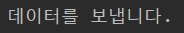

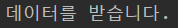

## String 클래스

### String 생성자

- 자바의 문자열
  - java.lang 패키지의 String 클래스의 인스턴스로 관리된다.
- 소스상의 문자열 리터럴은 String 객체로 자동생성된다.
  - 하지만 String 클래스의 다양한 생성자를 이용해서 직접 String 객체를 생성할 수도 있다.
- String 클래스는 Deprecated(비권장)된 생성자를 제외하고 약 13개의 생성자를 제공
  - Deprecated : 예전 자바 버전에서는 사용되었으나, 현재 버전과 차후 버전에서는 사용하지 말라는 뜻
- 사용 빈도수가 높은 생성자들

```java
/* 파일의 내용을 읽거나, 네트워크를 통해 받은 데이터는 보통 byte[] 배열.
이것을 문자열로 변환하기 위해 사용된다.*/

// 배열 전체를 String 객체로 생성
String str = new String(byte[] bytes);
// 지정한 문자셋으로 디코딩
String str = new String(byte[] bytes, String charsetName);

// 배열의 offset 인덱스 위치부터 length만큼 String 객체로 생성
String str = new String(byte[] bytes, int offset, int length);
// 지정한 문자셋으로 디코딩
String str = new String(byte[] bytes, int offset, int length, String charsetName)
```

- 바이트 배열을 문자열로 변환하는 예제

```java
public class ByteToStringExample {

  public static void main(String[] args) {
    byte[] bytes = {72, 101, 108, 108, 111, 32, 74, 97, 118, 97};

    String str1 = new String(bytes);
    System.out.println(str1);

    String str2 = new String(bytes, 6, 4); // 74가 들어있는 위치부터 4개
    System.out.println(str2);
  }
  
}
```

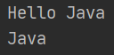

- 키보드로부터 읽은 바이트 배열을 문자열로 변환하는 방법?
  - System.in.read() 메소드는 키보드에서 입력한 내용을 매개값으로 주어진 바이트 배열에 저장
    - 읽은 바이트 수를 리턴한다.
  - ex) Hello를 입력하고 Enter키를 눌렀다면?
    - Hello + 캐리지리턴(\\r) + 라인피드(\\n)의 코드값이 바이트 배열에 저장됨
    - 총 7개의 바이트를 읽었기 때문에 7을 리턴
- 영어는 알파벳 한 자가 1바이트로 표현된다.
  - 한글과 기타 다른 나라 언어는 2바이트로 표현됨
  - 때문에 입력된 문자 수와 읽은 바이트 수가 다를 수 있다.

```java
// 바이트 배열을 문자열로 변환하는 예
import java.io.IOException;

public class KeyboardToStringExample {

  public static void main(String[] args) throws IOException {
    byte[] bytes = new byte[100]; // 읽은 바이트를 저장하기 위한 배열

    System.out.print("입력: ");
    int readByteNo = System.in.read(bytes); // 배열에 읽은 바이트를 저장, 읽은 바이트수 리턴

    						// 인텔리제이 환경에서는 캐리지리턴을 읽지 않아서 -1
    String str = new String(bytes, 0, readByteNo-1); // 배열을 문자열로 변환
    System.out.println(str);
  }

}
```

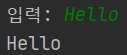

### String 메소드

- String은 문자열의 추출, 비교, 찾기, 분리, 변환 등과 같은 다양한 메소드를 가지고 있다.
- 사용 빈도수가 높은 메소드들

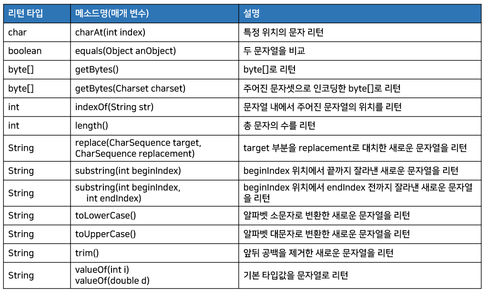

#### 문자 추출(charAt())

- charAt() 메소드는 매개값으로 주어진 인덱스의 문자를 리턴한다.
  - 인덱스 : 0부터 "문자열길이-1" 까지의 번호

```java
String subject = "자바 프로그래밍";
char charValue = subject.charAt(3); // '프' 문자에 해당
```

- "자바 프로그래밍" 문자열의 인덱스

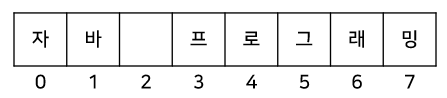

```java
// 주민등록 번호에서 인덱스 7번 문자를 읽어 남자와 여자를 구별하는 예제
public class StringCharAtExample {

  public static void main(String[] args) {
    String ssn = "010624-1230123";
    char sex = ssn.charAt(7);
    switch (sex) {
      case '1':
      case '3':
        System.out.println("남자 입니다.");
        break;
      case '2':
      case '4':
        System.out.println("여자 입니다.");
        break;
    }
  }

}
```

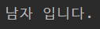

#### 문자열 비교(equals())

- 기본 타입(byte, char, short, int, long, float, double, boolean) 변수의 값을 비교할 때
  - == 연산자를 사용
- 그러나 문자열을 비교할 때 == 연산자 사용시 원치않는 결과가 나올 수 있다.

```java
String strVar1 = new String("김승빈");
String strVar2 = "김승빈";
String strVar3 = "김승빈";
```

- 자바는 문자열 리터럴이 동일하다면 동일한 String 객체를 참조한다.
  - strVar2 와 strVar3은 동일한 String 객체를 참조
  - 그러나 strVar1은 new 연산자로 생성된 다른 String 객체를 참조

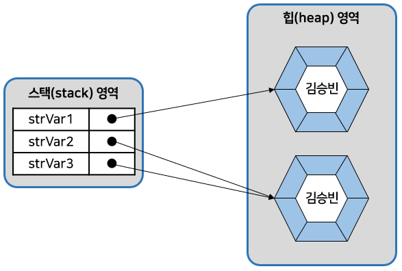

- 그림과 같은 경우 strVar1 == strVar2 연산은 false를 산출
  - strVar2 == strVar3 연산은 true를 산출
- 만약 두 String 객체의 문자열만을 비교하고 싶다면?
  - == 연산자 대신 equals() 메소드 사용

```java
strVar1.equals(strVar2) // true
strVar2.equals(strVar3) // true
```

- 원래 equals()는 Object의 번지 비교 메소드
  - String 클래스가 오버라이딩해서 문자열을 비교하도록 변경하였다.

```java
// 예제
public class StringEqualsExample {

  public static void main(String[] args) {
    String strVar1 = new String("신민철");
    String strVar2 = "신민철";

    if (strVar1 == strVar2) {
      System.out.println("같은 String 객체를 참조");
    } else {
      System.out.println("다른 String 객체를 참조");
    }

    if (strVar1.equals(strVar2)) {
      System.out.println("같은 문자열을 가짐");
    } else {
      System.out.println("다른 문자열을 가짐");
    } 
  }

}
```

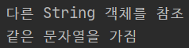

#### 바이트 배열로 변환(getBytes())

- 문자열을 바이트 배열로 변환하는 대표적인 예
  - 네트워크로 문자열을 전송
  - 문자열을 암호화 할 때
- 문자열을 바이트 배열로 변환하는 메소드는 두 가지가 있다.

```java
byte[] bytes = "문자열".getBytes();
byte[] bytes = "문자열".getBytes(Charset charset);
```

- getBytes() 메소드는 시스템의 기본 문자셋으로 인코딩된 바이트 배열을 리턴한다.
- 특정 문자셋으로 인코딩된 바이트 배열을 얻으려면?
  - `getBytes(Charset charset)`를 사용

```java
// EUC-KR과 UTF-8로 각각 인코딩된 바이트 배열을 리턴하는 예시
try {
    byte[] bytes = "문자열".getBytes("EUC-KR");
    byte[] bytes = "문자열".getBytes("UTF-8");
} catch (UnsupportedEncodingException e) {
}
```

- 어떤 문자셋으로 인코딩하느냐에 따라 바이트 배열의 크기가 달라진다.
  - EUC-KR은 getBytes()와 마찬가지로 알파벳 1바이트, 한글 2바이트로 변환
  - UTF-8은 알파벳 1바이트, 한글 3바이트로 변환
- getBytes(Charset charset) 메소드는 잘못된 문자셋을 매개값으로 줄 경우 `java.io.UnsupportedEncodingException` 예외가 발생하므로 예외처리가 필요
- 바이트 배열을 다시 문자열로 변환(디코딩)할 때
  - 어떤 문자셋으로 인코딩된 바이트 배열이냐에 따라 디코딩 방법이 다르다.
  - 단순히 String(byte[] bytes) 생성자를 이용해 디코딩하면 시스템의 기본 문자셋을 이용

```java
// 시스템 기본 문자셋과 다른 문자셋으로 인코딩된 바이트 배열일 경우
String str = new String(byte[] bytes, String CharsetName);
```

```java
// 문자열을 바이트 배열로 인코딩하고, 길이를 출력
// 다시 String 생성자를 이용해 문자열로 디코딩하는 예제
import java.io.UnsupportedEncodingException;

public class StringGetBytesExample {

  public static void main(String[] args) {
    String str = "안녕하세요";

    // 기본 문자셋으로 인코딩과 디코딩
    byte[] bytes1 = str.getBytes();
    System.out.println("bytes1.length: " + bytes1.length);
    String str1 = new String(bytes1);
    System.out.println("bytes1 -> String: " + str1);

    try {

      byte[] bytes2 = str.getBytes("EUC-KR");
      System.out.println("bytes2.length: " + bytes2.length);
      String str2 = new String(bytes2, "EUC-KR");
      System.out.println("bytes2 -> String: " + str2);

      byte[] bytes3 = str.getBytes("UTF-8");
      System.out.println("bytes3.length: " + bytes3.length);
      String str3 = new String(bytes3, "UTF-8");
      System.out.println("bytes3 -> String: " + str3);
      
    } catch (UnsupportedEncodingException e) {
      e.printStackTrace();
    }
  }

}
```

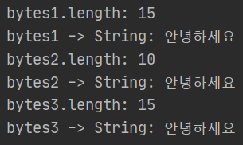

#### 문자열 찾기(indexOf())

- indexOf() 메소드
  - 매개값으로 주어진 문자열이 시작되는 인덱스를 리턴
  - 만약 주어진 문자열이 포함되어 있지 않으면 -1을 리턴

```java
String subject = "자바 프로그래밍";
int index = subject.indexOf("프로그래밍"); // 3이 저장되게 됨
```

- "자바 프로그래밍"에서 "프로그래밍" 문자열의 인덱스 위치가 3이다.

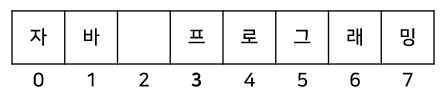

- indexOf() 메소드는 if문의 조건식에서 특정 문자열이 포함되어 있는지 여부에 따라 실행 코드를 달리할 때 자주 사용
  - -1 값을 리턴하면 특정 문자열이 포함되어 있지 않다는 뜻

```java
if (문자열.indexOf("찾는문자열") != -1) {
    // 포함되어 있는 경우
} else {
    // 포함되어 있지 않은 경우
}
```

```java
// 문자열 포함 여부 조사 예제
public class StringIndexOfExample {

  public static void main(String[] args) {
    String subject = "자바 프로그래밍";

    int location = subject.indexOf("프로그래밍");
    System.out.println(location);

    if (subject.indexOf("자바") != -1) {
      System.out.println("자바와 관련된 책이네요.");
    } else {
      System.out.println("자바와 관련없는 책이네요.");
    }
  }

}
```

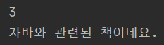

#### 문자열 길이(length())

- length() 메소드
  - 문자열의 길이(문자의 수)를 리턴한다.

```java
String subject = "자바 프로그래밍";
int length = subject.length(); // 8이 저장된다.
```

- subject 객체의 문자열 길이는 공백을 포함해서 8개

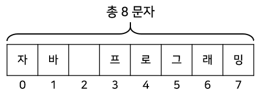

```java
// 문자열의 문자 수 얻기
public class StringLengthExample {

  public static void main(String[] args) {
    String ssn = "7306241230123";
    int length = ssn.length();
    if (length == 13) {
      System.out.println("주민번호 자리수가 맞습니다.");
    } else {
      System.out.println("주민번호 자리수가 틀립니다.");
    }
  }

}
```

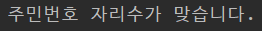

#### 문자열 대치(replace())

- replace() 메소드
  - 첫 번째 매개값인 문자열을 찾아 두 번째 매개값인 문자열로 대치한 새로운 문자열을 생성하고 리턴

```java
String oldStr = "자바 프로그래밍";
String newStr = oldStr.replace("자바", "JAVA");
```

- String 객체의 문자열은 변경이 불가한 특성을 갖는다.
  - 때문에 replace() 메소드가 리턴하는 문자열은 원래 문자열의 수정본이 아니라 완전히 새로운 문자열


```java
// 문자열 대치 예제
public class StringReplaceExample {

  public static void main(String[] args) {
    String oldStr = "자바는 객체지향언어 입니다. 자바는 풍부한 API를 지원합니다.";
    String newStr = oldStr.replace("자바", "JAVA");
    System.out.println(oldStr);
    System.out.println(newStr);
  }

}
```


#### 문자열 잘라내기(substring())

- substring() 메소드
  - 주어진 인덱스에서 문자열을 추출
- 매개값의 수에 따라 두 가지 형태로 사용된다.
  - substring(int beginIndex, int endIndex)
    - 주어진 시작과 끝 인덱스 사이의 문자열을 추출
  - substring(int beginIndex)
    - 주어진 인덱스부터 끝까지 문자열을 추출

```java
String ssn = "880815-1234567";
String firstNum = ssn.substring(0, 6); // 인덱스0(포함) ~ 6(제외) 사이의 문자열을 추출
String secondNum = ssn.substring(7); // 인덱스 7부터의 문자열을 추출
```

```java
// 문자열 추출 예제
public class StringSubstringExample {

  public static void main(String[] args) {
    String ssn = "970528-1234567";

    String firstNum = ssn.substring(0, 6);
    System.out.println(firstNum);

    String secondNum = ssn.substring(7);
    System.out.println(secondNum);
  }

}
```


#### 알파벳 소/대문자 변경(toLowerCase()m, toUpperCase())

- toLowerCase() 메소드
  - 문자열을 모두 소문자로 바꾼 새로운 문자열을 생성한 후 리턴
- toUpperCase() 메소드
  - 문자열을 모두 대문자로 바꾼 새로운 문자열을 생성한 후 리턴

```java
String original = "Java Programming";
String lowerCase = original.toLowerCase(); // 새로 생성된 "java programming" 문자열을 참조
String upperCase = original.toUpperCase(); // 새로 생성된 "JAVA PROGRAMMING" 문자열을 참조
```

- 원래의 "Java Programming" 문자열이 변경된 것이 아니다.


- toLowerCase()와 toUpperCase() 메소드
  - 영어로 된 두 문자열을 대소문자와 관계없이 비교할 때 주로 이용된다.

```java
// 두 문자열이 대소문자가 다를 경우 비교하는 예제
public class StringToLowerUpperCaseExample {

  public static void main(String[] args) {
    String str1 = "Java Programming";
    String str2 = "JAVA PROGRAMMING";

    System.out.println(str1.equals(str2));

    String lowerStr1 = str1.toLowerCase();
    String lowerStr2 = str2.toLowerCase();
    System.out.println(lowerStr1.equals(lowerStr2));

    // 대소문자를 맞추는 작업을 생략할 수 있다.
    System.out.println(str1.equalsIgnoreCase(str2));
  }

}
```


#### 문자열 앞뒤 공백 잘라내기(trim())

- trim() 메소드
  - 문자열의 앞뒤 공백을 제거한 새로운 문자열을 생성하고 리턴
  - 앞뒤의 공백만 제거할 뿐 중간의 공백은 제거하지 않는다.

```java
String oldeStr = "   자바 프로그래밍   ";
String newStr = oldStr.trim();
```

- 원래 문자열의 공백이 제거되는 것이 아니다.
  - oldStr.trim()은 oldStr의 공백을 제거하는 것이 아니다.


```java
// 앞뒤 공백 제거 예제
public class StringTrimExample {

  public static void main(String[] args) {
    String tel1 = "   02";
    String tel2 = "123   ";
    String tel3 = "   1234   ";

    String tel = tel1.trim() + tel2.trim() + tel3.trim();
    System.out.println(tel);
  }

}
```


#### 문자열 변환(valueOf())

- valueOf() 메소드
  - 기본 타입의 값을 문자열로 변환하는 기능

```java
// String 클래스에는 매개 변수의 타입별로 valueOf() 메소드가 오버로딩되어 있다.
static String valueOf(boolean b)
static String valueOf(char c)    
static String valueOf(int i)
static String valueOf(long l)    
static String valueOf(double d)    
static String valueOf(float f)    
```

```java
// 기본 타입 값을 문자열로 변환하는 예제
public class StringValueOfExample {

  public static void main(String[] args) {
    String str1 = String.valueOf(10);
    String str2 = String.valueOf(10.5);
    String str3 = String.valueOf(true);

    System.out.println(str1);
    System.out.println(str2);
    System.out.println(str3);
  }

}
```

