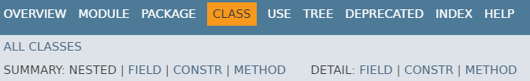

# 기본 API 클래스

## 자바 API 도큐먼트

- <b>API(Application Programming Interface)</b>
  - 프로그램 개발에 자주 사용되는 클래스 및 인터페이스의 모음
  - 라이브러리(library)라고 부르기도 한다.
  - String 클래스와 System 클래스도 모두 API에 속하는 클래스
  - <JDK 설치 경로> \ jre \ lib \ rt.jar 이라는 압축파일에 저장되어 있다.
- <b>API 도큐먼트</b>
  - 쉽게 API를 찾아 이용할 수 있도록 문서화한 것
  - HTML페이지로 작성되어 있다.
  - [버전별 보기](https://docs.oracle.com/en/java/javase/index.html)
- JDK 8과 JDK 11의 도큐먼트 레이아웃이 다르다.
  - JDK 8은 전체 자바 표준 API를 패키지별로 정리하여 보여줌
  - JDK 11 이후 버전은 전체 자바 표준 API를 모듈별로 구분해서 정리함
- JDK 8 API 도큐먼트에서 String 클래스를 찾는법
  - 왼쪽 상단 Packages 목록에서 java.lang 패키지 링크를 찾아 클릭
    - 왼쪽 하단에 java.lang 패키지의 내용이 나옴
  - Classes 목록에서 String 클래스를 찾아 클릭
  - 오른쪽에 Class String 페이지가 나옴
- JDK 11 이후 버전 API 도큐먼트에서 String 클래스를 찾는법
  - 방법 1
    - All Modules 목록에서 java.base 링크를 찾아 클릭
    - java.base 모듈 페이지의 Package 목록에서 java.lang 패키지 링크를 찾아 클릭
    - java.lang 패키지 페이지의 Class Summary 목록에서 String 클래스 링크를 찾아 클릭
  - 방법 2
    - 오른쪽 상단의 Search 검색란에 "String"을 입력
    - 드롭다운 목록에서 java.lang.String 항목을 선택

## 클래스 페이지 읽는법

- 페이지 상단 부분
  - 클래스가 포함된 패키지 정보
  - 상속 정보
  - 인터페이스 구현 정보를 표시
- 페이지 중앙 부분
  - 클래스의 설명과 사용 방법을 간략하게 보여준다.

- 필드목록
  - static 또는 protected 여부와 타입
  - 필드 이름 클릭시 상세 설명 페이지로 이동

- 생성자 목록
  - 생성자 이름과 매개 변수의 타입
  - 간단한 설명
  - 생성자 이름 클릭시 상세 설명 페이지로 이동

- 메소드 목록
  - 메소드의 접근제한자와 리턴타입
  - 메소드 이름과 매개 변수에 대한 정보
  - 메소드 이름 클릭시 상세 설명 페이지로 이동

- 클래스가 가지고 있는 중첩 클래스, 필드, 생성자, 메소드의 목록으로 바로 가고 싶다면?
  - 최상단의 SUMMARY: NESTED | FIELD | CONSTR | METHOD 링크를 바로 클릭

## java.lang과 java.util 패키지

- 공통적으로 가장 많이 사용하는 패키지
  - java.lang 패키지
  - java.util 패키지
  - java.time 패키지

### java.lang 패키지

- java.lang 패키지
  - 자바 프로그램의 기본적인 클래스를 담고 있는 패키지
  - java.lang 패키지에 있는 클래스와 인터페이스는 import 없이 사용할 수 있다.
- 주요 클래스

### java.util 패키지

- java.util 패키지
  - 자바 프로그램 개발에 조미료 같은 역할을 하는 클래스를 담고 있다.
  - 컬렉션 클래스들이 대부분 차지
- 주요 클래스

 
