# 멀티 스레드

## 멀티 스레드 개념

### 프로세스와 스레드

- 프로세스(process)
  - 운영체제에서는 실행 중인 하나의 애플리케이션을 프로세스(process)라고 부른다.
  - 사용자가 애플리케이션을 실행하면 운영체제로부터 실행에 필요한 메모리를 할당받아 애플리케이션의 코드를 실행한다.
  - 하나의 애플리케이션은 다중 프로세스를 만들기도 한다.
    - ex) Chrome 브라우저를 두 개 실행했다면 두 개의 Chrome 프로세스가 생성된 것

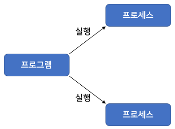

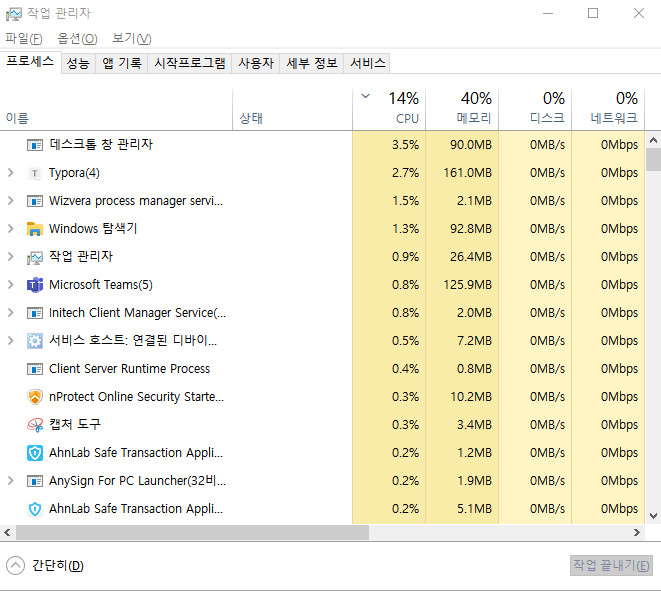

- 멀티 태스킹(multi tasking)
  - 두 가지 이상의 작업을 동시에 처리하는 것을 말한다.
- 운영체제는 멀티 태스킹을 할 수 있도록 CPU 및 메모리 자원을 프로세스마다 적절히 할당해주고, 병렬로 실행시킨다.
  - ex) 워드로 문서 작업을 하면서 동시에 윈도우 미디어 플레이어로 음악을 들을 수 있다.
- 멀티 태스킹은 꼭 멀티 프로세스를 뜻하진 않는다.
  - 한 프로세스 내에서 멀티 태스킹을 할 수 있도록 만들어진 애플리케이션들도 있다.
  - 대표적인 것
    - 미디어 플레이어(Media player) : 미디어 플레이어는 동영상 재생과 음악 재생이라는 두 작업을 동시에 처리
    - 메신저(Messenger) : 채팅 기능을 제공하면서 동시에 파일 전송 기능을 수행
- 하나의 프로세스가 어떻게 두 가지 이상의 작업을 처리할까?
  - 멀티 스레드(multi thread)
- 멀티 스레드(multi thread)
  - 스레드(thread)는 사전적 의미로 한 가닥의 실이라는 뜻
  - 한 가지 작업을 실행하기 위해 순차적으로 실행할 코드를 실처럼 이어 놓았다고 해서 유래된 이름
- 하나의 스레드는 하나의 코드 실행 흐름이다.
  - 때문에 한 프로세스 내에 스레드가 두 개라면 두 개의 코드 실행 흐름이 생긴다는 의미
- 멀티 프로세스가 애플리케이션 단위의 멀티 태스킹이라면  
  멀티 스레드는 애플리케이션 내부에서의 멀티 태스킹이라고 볼 수 있다.
- 멀티 프로세스와 멀티 스레드의 개념

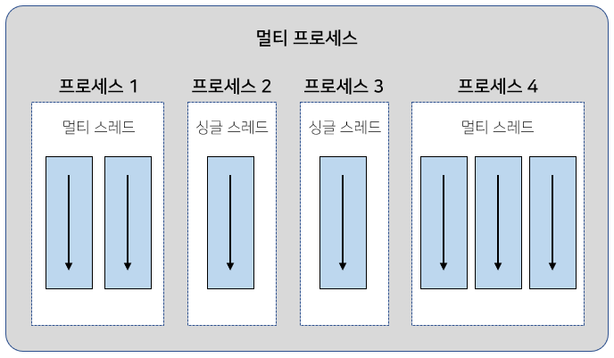

- 멀티 프로세스들은 운영체제에서 할당받은 자신의 메모리를 가지고 실행한다.
  - 때문에 서로 독립적이다.
  - 하나의 프로세스에서 오류가 발생해도 다른 프로세스에게 영향을 미치지 않는다.
    - ex) 워드와 엑셀을 동시에 사용하던 도중, 워드에 오류가 생겨 먹통이 되어도 엑셀은 여전히 사용 가능
- 멀티 스레드는 하나의 프로세스 내부에 생성된다.
  - 때문에 하나의 스레드가 예외를 발생시키면 프로세스 자체가 종료될 수 있어 다른 스레드에게 영향을 미치게 된다.
    - ex) 메신저의 경우 파일을 전송하는 스레드에서 예외가 발생되면?  
      메신저 프로세스 자체가 종료되기 때문에 채팅 스레드도 같이 종료됨
- 멀티 스레드에서는 예외 처리에 최선을 다해야 한다.
- 멀티 스레드는 다양한 곳에서 사용된다.
  - ex) 대용량의 데이터 처리 시간을 줄이기 위해 데이터를 분할해서 병렬로 처리하는 곳에서 사용  
    UI를 가지고 있는 애플리케이션에서 네트워크 통신을 하기 위해 사용  
    다수 클라이언트 요청을 처리하는 서버를 개발할 때에도 사용
- 멀티 스레드는 애플리케이션을 개발하는데 꼭 필요한 기능이다.
  - 반드시 이해하고 활용할 수 있도록 해야 한다.

### 메인 스레드

- 모든 자바 애플리케이션은 메인 스레드(main thread)가 main() 메소드를 실행하면서 시작
- 메인 스레드는 main() 메소드의 첫 코드부터 아래로 순차적으로 실행
  - main() 메소드의 마지막 코드를 실행하거나 return문을 만나면 실행이 종료된다.

```java
public static void main(String[] args) {
    String data = null;			// ↓
    if (...) {					// ↓
    }							// ↓
    while(...) {				// ↓
    }							// ↓
    System.out.println("...");  // ↓ 코드의 실행 흐름 → 스레드
}
```

- 메인 스레드는 필요에 따라 작업 스레드들을 만들어 병렬로 코드를 실행할 수 있다.
  - 즉 멀티 스레드를 생성해서 멀티 태스킹을 수행한다.

- 메인 스레드가 작업 스레드1을 생성하고 실행한 다음, 곧이어 작업 스레드2를 생성하고 실행하는 그림

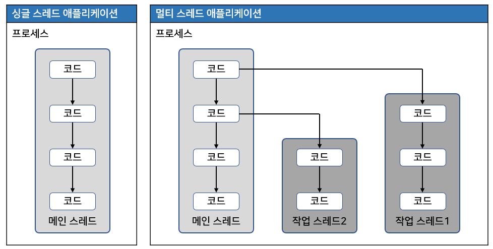

- 싱글 스레드 애플리케이션에서는 메인 스레드가 종료하면 프로세스도 종료된다.
  - 하지만 멀티 스레드 애플리케이션에서는 실행 중인 스레드가 하나라도 있다면, 프로세스는 종료되지 않는다.
- 메인 스레드가 작업 스레드보다 먼저 종료되더라도 작업 스레드가 계속 실행 중이라면 프로세스는 종료되지 않는다.

## 작업 스레드 생성과 실행

- 멀티 스레드로 실행하는 애플리케이션을 개발하려면?
  - 몇 개의 작업을 병렬로 실행할지 결정하고, 각 작업별로 스레드를 생성해야 한다.

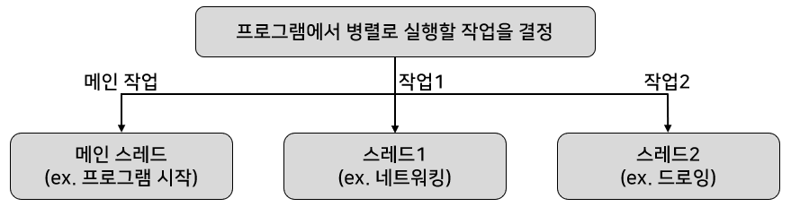

- 메인 스레드는 반드시 존재하기 때문에 메인작업 이외에 추가적인 병렬 작업의 수만큼 스레드를 생성하면 된다.
- 자바에선 작업 스레드도 객체로 생성되기 때문에 클래스가 필요
- java.lang.Thread 클래스를 직접 객체화해서 생성
  - Thread를 상속해서 하위 클래스를 만들어 생성할 수도 있다.

### Thread 클래스로부터 직접 생성

- java.lang.Thread 클래스로부터 작업 스레드 객체를 직접 생성하려면?
  - Runnable을 매개값으로 갖는 생성자를 호출해야 한다.

```java
Thread thread = new Thread(Runnable target);
```

- Runnable
  - 작업 스레드가 실행할 수 있는 코드를 가지고 있는 객체라 해서 붙여진 이름
  - 인터페이스 타입이기 때문에 구현 객체를 만들어 대입해야 한다.
- Runnable에는 run() 메소드 하나가 정의되어 있다.
  - 구현 클래스는 run()을 재정의해서 작업 스레드가 실행할 코드를 작성해야 한다.

```java
// Runnable 구현 클래스를 작성하는 방법
Class Task implements Runnable {
    public void run() {
        스레드가 실행할 코드;
    }
}
```

- Runnable은 작업 내용을 가지고 있는 객체
  - 실제 스레드는 아니다.
- Runnable 구현 객체를 생성하여 매개값으로 Thread 생성자를 호출하면 작업 스레드가 생성된다.

```java
Runnalbe task = new Task();

Thread thread = new Thread(task);
```

- 코드를 절약하기 위해 Thread 생성자를 호출할 때 Runnable 익명 객체를 매개값으로 사용할 수 있다.
  - 이 방법이 더 많이 사용됨

```java
Thread thread new Thread(new Runnable() {
    public void run() {
        스레드가 실행할 코드;
    }
});
```

- Runnable 인터페이스는 run() 메소드 하나만 정의되어 있기 때문에 함수적 인터페이스이다.
  - 람다식을 매개값으로 사용할 수도 있다.
    - 가장 간단하지만, 자바 8부터 지원

```java
Thread thread = new Thread( () -> {
    스레드가 실행할 코드;
} );
```

- 작업 스레드는 생성되는 즉시 실행되는 것이 아니다.
  - start() 메소드를 호출해야만 실행된다.

```java
thread.start();
```

- start() 메소드가 호출되면?
  - 작업 스레드는 매개값으로 받은 Runnable의 run() 메소드를 실행하면서 자신의 작업을 처리
- 0.5초 주기로 비프(beep)음을 발생시키며 동시에 프린팅하는 작업을 가정할 때
  - 비프음 발생과 프린팅은 서로 다른 작업이므로 메인 스레드가 동시에 두 가지 작업을 처리할 수 없음

```java
// 메인 스레드만 이용한 경우 비프음을 모두 발생한 다음, 프린팅을 시작
import java.awt.*;

public class BeepPrintExample1 {

  public static void main(String[] args) {
    Toolkit toolkit = Toolkit.getDefaultToolkit();  // Toolkit 객체 얻기
    for (int i = 0; i < 5; i++) {
      toolkit.beep(); // 비프음 발생
      try {
        Thread.sleep(500); // 0.5초 일시 정지
      } catch (Exception e) { }
    }

    for (int i = 0; i < 5; i++) {
      System.out.println("띵");
      try {
        Thread.sleep(500); // 0.5초 일시 정지
      } catch (Exception e) { }
    }
  }

}
```


- 비프음을 발생시키면서 동시에 프린팅을 하려면?
  - 하나의 작업을 메인 스레드가 아닌 다른 스레드에서 실행시켜야 한다.
- 프린팅은 메인 스레드가, 비프음을 들려주는건 작업 스레드가 담당하도록 수정한 예제

```java
// 작업을 정의하는 Runnable 구현 클래스
import java.awt.*;

public class BeepTask implements Runnable {

  public void run() {
    Toolkit toolkit = Toolkit.getDefaultToolkit();  // Toolkit 객체 얻기
    for (int i = 0; i < 5; i++) {
      toolkit.beep(); // 비프음 발생
      try {
        Thread.sleep(500); // 0.5초 일시 정지
      } catch (Exception e) { }
    }
  }

}
```

```java
// 작업 스레드 생성 및 실행
public class BeepPrintExample2 {

  public static void main(String[] args) {
    Runnable beepTask = new BeepTask(); // BeepTask 객체 생성
    Thread thread = new Thread(beepTask); // 매개값으로 스레드 생성
    thread.start();

    for (int i = 0; i < 5; i++) {
      System.out.println("띵");
      try {
        Thread.sleep(500);
      } catch (Exception e) { }
    }
  }

}
```

- 또 다른 방법

```java
// Runnable 익명 객체 이용
Thread thread = new Thread(new Runnable() {
    @Override
    public void run() {
        Toolkit toolkit = Toolkit.getDefaultToolkit();  // Toolkit 객체 얻기
        for (int i = 0; i < 5; i++) {
            toolkit.beep(); // 비프음 발생
            try {
                Thread.sleep(500); // 0.5초 일시 정지
            } catch (Exception e) { }
        }
    }
});
```

```java
// 람다식 이용
Thread thread = new Thread(() -> {
    Toolkit toolkit = Toolkit.getDefaultToolkit();
    for (int i = 0; i < 5; i++) {
        toolkit.beep();
        try {
            Thread.sleep(500);
        } catch (Exception e) { }
    }
});
```

### Thread 하위 클래스로부터 생성

- 작업 스레드가 실행할 작업을 Runnable로 만들지 않고, Thread의 하위 클래스로 작업 스레드를 정의하면서 작업 내용을 포함시킬 수도 있다.
  - Thread 클래스를 상속한 후 run 메소드를 재정의해서 스레드가 실행할 코드를 작성

```java
public class WorkerThread extends Thread {
    @Override
    public void run() {
        // 스레드가 실행할 코드;
    }
    Thread thread = new WorkerThread();
}
```

- Thread 익명 객체로 작업 스레드 객체를 생성할 수도 있다.

```java
Thread thread = new Thread() { // 익명 자식 객체
    public void run() {
        // 스레드가 실행할 코드;
    }
}
```

- 작업 스레드 객체에서 start() 메소드 호출시 작업 스레드는 자신의 run() 메소드를 실행한다.

```java
// Runnable을 생성하지 않고 Thread의 하위 클래스로 작업 스레드를 정의한 예제
import java.awt.*;

public class BeepThread extends Thread {
  @Override
  public void run() {
    Toolkit toolkit = Toolkit.getDefaultToolkit();
    for (int i = 0; i < 5; i++) {
      toolkit.beep();
      try {
        Thread.sleep(500);
      } catch (Exception e) { }
    }
  }
}
```

```java
public class BeepPrintExample3 {

  public static void main(String[] args) {
    Thread thread = new BeepThread(); // BeepThread 객체 생성
    thread.start(); // start() 메소드 호출

    for (int i = 0; i < 5; i++) {
      System.out.println("띵");
      try {
        thread.sleep(500);
      } catch (Exception e) { }
    }
  }

}
```

- 익명 자식 객체를 사용한 예시

```java
Thread thread = new Thread() { // 익명 자식 객체
    @Override
    public void run() {
        Toolkit toolkit = Toolkit.getDefaultToolkit();
        for (int i = 0; i < 5; i++) {
            toolkit.beep();
            try {
                Thread.sleep(500);
            } catch (Exception e) { }
        }
    }
}
```

### 스레드의 이름

- 스레드는 자신의 이름을 가지고 있다.
  - 스레드의 이름이 큰 역할을 하는 것은 아니지만, 디버깅할 때 어떤 스레드가 어떤 작업을 하는지 조사할 목적으로 가끔 사용됨
- 메인 스레드는 "main" 이라는 이름을 가지고 있다.
  - 직접 생성한 스레드는 자동적으로 "Thread-n" 이라는 이름으로 설정된다.
    - n은 스레드의 번호
- Thread-n 대신 다른 이름으로 설정하고 싶다면 Thread 클래스의 setName() 메소드로 변경하면 된다.

```java
thread.setName("스레드 이름");
```

- 스레드 이름을 알고 싶을 경우에는 getName() 메소드를 호출

```java
thread.getName();
```

- setName()과 getName()은 Thread의 인스턴스 메소드이므로 스레드 객체의 참조가 필요하다.
  - 만약 스레드 객체의 참조를 가지고 있지 않다면?
    - Thread의 정적 메소드인 currentThread()로 코드를 실행하는 현재 스레드의 참조를 얻을 수 있다.

```java
Thread thread = Thread.currentThread();
```

- 예제

```java
// 메인 스레드의 참조를 얻어 스레드 이름을 콘솔에 출력,
// 새로 생성한 스레드의 이름을 setName() 메소드로 설정한 후, getName() 메소드로 읽어오는 예제
public class ThreadNameExample {

  public static void main(String[] args) {
    Thread mainThread = Thread.currentThread(); // 이 코드를 실행하는 스레드 객체 얻기
    System.out.println("프로그램 시작 스레드 이름: " + mainThread.getName());

    ThreadA threadA = new ThreadA(); // ThreadA 생성
    System.out.println("작업 스레드 이름: " + threadA.getName());
    threadA.start(); // ThreadA 시작

    ThreadB threadB = new ThreadB(); // ThreadB 생성
    System.out.println("작업 스레드 이름: " + threadB.getName());
    threadB.start(); // ThreadB 시작
  }

}
```

```java
// ThreadA 클래스
public class ThreadA extends Thread {
  
  public ThreadA() {
    setName("ThreadA"); // 스레드 이름 설정
  }

  @Override
  public void run() {
    for (int i = 0; i < 2; i++) {
      System.out.println(getName() + "가 출력한 내용");
    }
  }

}
```

```java
// ThreadB 클래스
public class ThreadB extends Thread {

  @Override
  public void run() {
    for (int i = 0; i < 2; i++) {
      System.out.println(getName() + "가 출력한 내용");
    }
  }
  
}
```

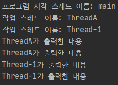

## 스레드 우선순위

- 멀티 스레드는 동시성(Concurrency) 또는 병렬성(Parallelism)으로 실행된다.
- 동시성
  - 멀티 작업을 위해 하나의 코어에서 멀티 스레드가 번갈아가며 실행하는 성질
- 병렬성
  - 멀티 작업을 위해 멀티 코어에서 개별 스레드를 동시에 실행하는 성질
- 싱글 코어 CPU를 이용한 멀티 스레드 작업은 병렬적으로 실행되는 것처럼 보인다.
  - 사실은 번갈아가며 실행하는 동시성 작업
  - 번갈아 실행하는 것이 매우 빨라 병렬성으로 보일 뿐

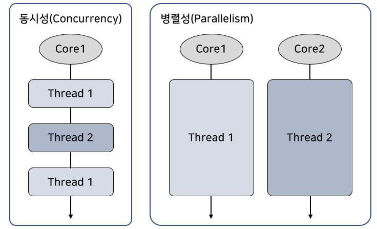

- 스레드의 개수가 코어의 수보다 많을 경우
  - 스레드를 어떤 순서에 의해 동시성으로 실행할 것인가를 결정해야 한다.
    - 스레드 스케줄링이라고 한다.
- 스레드 스케줄링에 의해 스레드들은 아주 짧은 시간에 번갈아가면서 그들의 run() 메소드를 조금씩 실행한다.

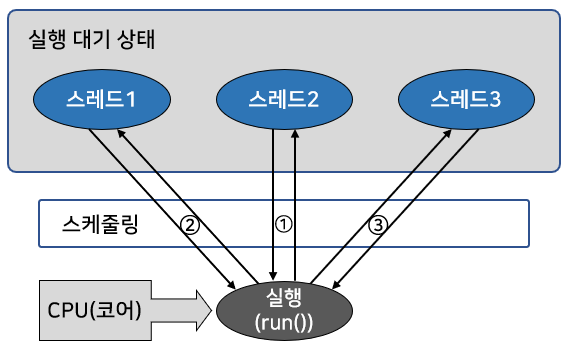

- 자바의 스레드 스케줄링
  - 우선순위 (Priority) 방식
  - 순환 할당 (Round-Robin) 방식을 사용
- 우선 순위 방식
  - 우선순위가 높은 스레드가 실행 상태를 더 많이 가지도록 스케줄링 하는 것
- 순환 할당 방식
  - 시간 할당량 (Time Slice)을 정해서 하나의 스레드를 정해진 시간만큼 실행하고 다시 다른 스레드를 실행하는 방식
- 스레드 우선순위 방식은 스레드 객체에 우선 순위 번호를 부여할 수 있기 때문에 개발자가 코드로 제어할 수 있다.
- 순환 할당 방식은 자바 가상 기계에 의해서 정해지기 때문에 코드로 제어할 수 없다.

---

- 우선 순위 방식에서 우선순위는 1에서부터 10까지 부여된다.
  - 1이 가장 우선순위가 낮고, 10이 가장 높다.
  - 우선순위를 부여하지 않으면 모든 스레드들은 기본적으로 5의 우선순위를 할당받는다.
- 만약 우선순위를 변경하고 싶다면
  - Thread 클래스가 제공하는 setPriority() 메소드를 이용

```java
thread.setPriority(우선순위);
```

- 우선선위의 매개값으로 1~10까지의 값을 주어도 되지만,
  - 코드의 가독성을 높이기 위해 Thread 클래스의 상수를 사용할 수도 있다.

```java
thread.setPriority(Thread.MAX_PRIORITY);	// MAX_PRIORITY는 10
thread.setPriority(Thread.NORM_PRIORITY);	// NORM_PRIORITY는 5
thread.setPriority(Thread.MIN_PRIORITY);	// MIN_PRIORITY는 1의 값을 가진다.
```

- 다른 스레드에 비해 실행 기회를 더 많이 가지려면 MAX_PRIORITY로 우선순위를 높게 설정하면 된다.
- 동일한 계산 작업을 하는 스레드들이 있고, 싱글 코어에서 동시성으로 실행할 경우
  - 우선 순위가 높은 스레드가 실행 기회를 더 많이 가지기 때문에 우선순위가 낮은 스레드보다 계산 작업을 빨리 끝낸다.
- 쿼드 코어일 경우
  - 4개의 스레드가 병렬성으로 실행될 수 있기 때문에 4개 이하의 스레드를 실행할 경우 우선순위 방식이 크게 영향을 미치지 못한다.
  - 최대한 5개 이상의 스레드가 실행되어야 우선순위의 영향을 받음
- 스레드 10개를 생성하고 20억 번의 루핑을 누가 더 빨리 끝내는가를 테스트하는 예제

```java
// 작업 스레드
public class CalcThread extends Thread {

  public CalcThread(String name) {
    setName(name);
  }

  @Override
  public void run() {
    for (int i = 0; i < 2000000000; i++) {
    }
    System.out.println(getName());
  }
  
}
```

```java
// 우선순위를 설정해서 스레드 실행
public class PriorityExample {

  public static void main(String[] args) {
    for (int i = 1; i <= 10; i++) {
      Thread thread = new CalcThread("thread" + i);
      if (i != 10) { // Thread1~9는 우선순위를 가장 낮게 준다.
        thread.setPriority(Thread.MIN_PRIORITY); // 가장 낮은 우선순위 설정
      } else {
        thread.setPriority(Thread.MAX_PRIORITY); // 가장 높은 우선순위 설정
      }
      thread.start();
    }
  }

}
```

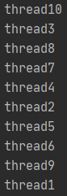

## 동기화 메소드와 동기화 블록

### 공유 객체를 사용할 때의 주의할 점

- 싱글 스레드 프로그램
  - 한 개의 스레드가 객체를 독차지해서 사용하면 된다.
- 멀티 스레드 프로그램
  - 스레드들이 객체를 공유해서 작업해야 하는 경우가 있다.
  - 이 경우, 스레드 A를 사용하던 객체가 스레드 B에 의해 상태가 변경될 수 있다.
    - 때문에 스레드 A가 의도했던 것과 다른 결과를 산출할 수도 있다.
    - ex) 계산기를 나눠쓰는 상황에서 A가 계산결과를 저장하였는데, B가 계산기를 만져 저장한 값을 다른 값으로 변경
      - 결국 A가 저장된 값을 이용해서 작업을 진행하면 엉터리 값을 이용하게 된다.
- 예제

```java
// 공유 객체
public class Calculator {
  
  private int memory;

  public int getMemory() {
    return memory;
  }

  public void setMemory(int memory) {
    this.memory = memory;
    try {
      Thread.sleep(2000); // 스레드를 2초간 일시 정지
    } catch (Exception e) { }
    System.out.println(Thread.currentThread().getName() + ": " + this.memory);
  }
  
}
```

```java
// User1 스레드
public class User1 extends Thread {

  private Calculator calculator;

  public void setCalculator(Calculator calculator) {
    this.setName("User1"); // 스레드 이름을 User1 으로 설정
    this.calculator = calculator; // 공유 객체인 Calculator를 필드에 저장
  }

  public void run() {
    calculator.setMemory(100); // 공유 객체인 Calculator의 메모리에 100을 저장
  }

}
```

```java
// User2 스레드
public class User2 extends Thread {

  private Calculator calculator;

  public void setCalculator(Calculator calculator) {
    this.setName("User2"); // 스레드 이름을 User2 으로 설정
    this.calculator = calculator; // 공유 객체인 Calculator를 필드에 저장
  }

  public void run() {
    calculator.setMemory(50); // 공유 객체인 Calculator의 메모리에 50을 저장
  }

}
```

```java
// 메인 스레드가 실행하는 코드
public class MainThreadExample {

  public static void main(String[] args) {
    Calculator calculator = new Calculator();
    
    User1 user1 = new User1(); // User1 스레드 생성
    user1.setCalculator(calculator); // 공유 객체 설정
    user1.start(); // User1 스레드 시작

    User2 user2 = new User2(); // User2 스레드 생성
    user2.setCalculator(calculator); // 공유 객체 설정
    user2.start(); // User2 스레드 시작
  }

}
```

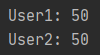

### 동기화 메소드 및 동기화 블록

- 스레드가 사용 중인 객체를 다른 스레드가 변경할 수 없도록 하려면?
  - 스레드 작업이 끝날 때까지 객체에 잠금을 걸어서 다른 스레드가 사용할 수 없도록 해야 한다.
- 임계 영역(critical section)
  - 멀티 스레드 프로그램에서 단 하나의 스레드만 실행할 수 있는 코드 영역
  - 자바는 임계 영역을 지정하기 위해 동기화(synchronized) 메소드와 동기화 블록을 제공
  - 스레드가 객체 내부의 동기화 메소드 또는 블록에 들어가면 즉시 객체에 잠금을 걸어 다른 스레드가 임계 영역 코드를 실행하지 못하도록 한다.
- 동기화 메소드를 만드는 방법
  - 메소드 선언에 synchronized 키워드를 붙이면 된다.
  - synchronized 키워드는 인스턴스와 정적 메소드 어디든 붙일 수 있다.

```java
public synchronized void method() {
    임계 영역; // 단 하나의 스레드만 실행
}
```

- 동기화 메소드
  - 메소드 전체 내용이 임계 영역이므로 스레드가 동기화 메소드를 실행하는 즉시 객체에는 잠금이 일어난다.
  - 스레드가 동기화 메소드를 실행 종료하면 잠금이 풀린다.
- 메소드 전체 내용이 아니라 일부 내용만 임계 영역으로 만들고 싶다면?
  - 동기화 블록(synchronized) 블록을 만들면 된다.

```java
public void method() {
    // 여러 스레드가 실행 가능 영역
    ...
    synchronized(공유객체) { // 공유 객체가 객체 자신이면 this를 넣을 수 있다.
        임계 영역 // 단 하나의 스레드만 실행
    }
    // 여러 스레드가 실행 가능 영역
    ...
}
```

- 동기화 블록의 외부 코드들은 여러 스레드가 동시에 실행할 수 있다.
  - 동기화 블록의 내부 코드는 임계 영역이므로 한 번에 한 스레드만 실행할 수 있고 다른 스레드는 실행할 수 없다.
- 만약 동기화 메소드와 동기화 블록이 여러 개 있을 경우
  - 스레드가 이들 중 하나를 실행할 때 다른 스레드는 해당 메소드는 물론 다른 동기화 메소드 및 블록도 실행할 수 없다.
    - 하지만 일반 메소드는 실행이 가능하다.
- 이전 예제의 공유 객체인 Calculator를 수정한 예제
  - setMemory() 메소드를 동기화 메소드를 만들어 User1 스레드가 setMemory()를 실행하면?
    - User2 스레드가 setMemory() 메소드를 실행할 수 없다.

```java
// 동기화 메소드로 수정된 공유 객체
public class Calculator {

  private int memory;

  public int getMemory() {
    return memory;
  }

  public synchronized void setMemory(int memory) {
    this.memory = memory;
    try {
      Thread.sleep(2000); // 스레드를 2초간 일시 정지
    } catch (Exception e) { }
    System.out.println(Thread.currentThread().getName() + ": " + this.memory);
  }

}
```

- MainThreadExample을 다시 실행하면 User1은 100, User2는 50이라는 출력값을 얻을 수 있다.

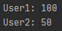

- User1 스레드는 Calculator 객체의 동기화 메소드인 setMemory() 를 실행하는 순간 Calculator 객체를 잠근다.
  - 메인 스레드가 User2 스레드를 실행시키지만, 동기화 메소드인 setMemory()를 실행시키지 못한다.
  - User1이 setMemory()를 모두 실행할 동안 대기해야 한다.
- User1 스레드가 setMemory() 메소드를 모두 실행하고 나면 User2 스레드가 setMemory() 메소드를 실행한다.
  - 결국 User1 스레드가 Calculator 객체를 사용할 동안 User2 스레드는 Calculator 객체를 사용하지 못한다.
  - 그러므로 User1 스레드는 안전하게 방해받지 않고 Calculator 객체를 사용할 수 있게 된다.
- 동기화 블록으로도 만들 수 있다.

```java
public void setMemory(int memory) {
    synchronized (this) { // 잠금대상: 공유 객체인 Calculator
        this.memory = memory;
        try {
            Thread.sleep(2000); // 스레드를 2초간 일시 정지
        } catch (Exception e) { }
        System.out.println(Thread.currentThread().getName() + ": " + this.memory);
    }
}
```

- 스레드가 동기화 블록으로 들어가면 this(Calculator 객체)를 잠그고, 동기화 블록을 실행
  - 동기화 블록을 모두 실행할 때까지 다른 스레드들은 this(Calculator 객체)의 모든 동기화 메소드 또는 동기화 블록을 실행할 수 없게 된다.

## 스레드 상태

- 스레드 객체를 생성하고 start() 메소드를 호출하면 곧바로 스레드가 실행되는 것처럼 보인다.
  - 하지만 사실은 실행 대기 상태가 된다.
- 실행 대기 상태란?
  - 아직 스케줄링이 되지 않아 실행을 기다리고 있는 상태
- 실행 대기 상태에 있는 스레드 중에서 스레드 스케줄링으로 선택된 스레드가 CPU를 점유하고 run() 메소드를 실행
  - 이때를 실행(Running) 상태라고 한다.
- 실행 상태의 스레드는 run() 메소드를 모두 실행하기 전에 스레드 스케줄링에 의해 다시 실행 대기 상태로 돌아갈 수 있다.
  - 그리고 실행 대기 상태에 있는 다른 스레드가 선택되어 실행 상태가 된다.
  - 스레드는 실행 대기 상태와 실행 상태를 번갈아가면서 자신의 run() 메소드를 조금씩 실행한다.
- 실행 상태에서 run() 메소드가 종료되면?
  - 더 이상 실행할 코드가 없기 때문에 스레드의 실행은 멈추게 됨.
    - 이 상태를 종료 상태라고 한다.

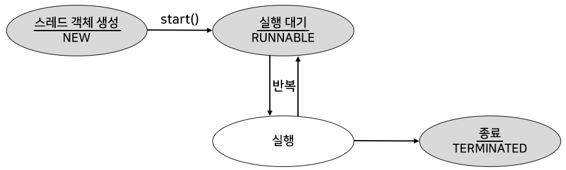

- 경우에 따라서 스레드는 실행 상태에서 실행 대기 상태로 가지 않을 수도 있다.
  - 실행 상태에서 일시 정지 상태로 가기도 한다.
  - 일시 정지 상태는 스레드가 실행할 수 없는 상태.
  - 다시 실행 상태로 가기 위해서는 일시 정지 상태에서 실행 대기 상태로 가야 한다.
- 일시 정지 상태
  - WAITING
  - TIMED_WAITING
  - BLOCKED

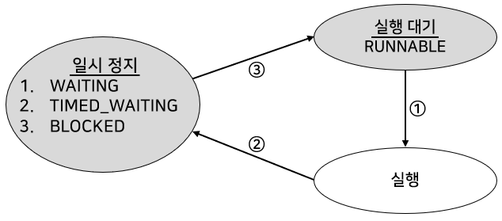

- 스레드의 상태를 코드에서 확인할 수 있도록 하기 위해 자바 5부터 Thread 클래스에 getState() 메소드가 추가되었다.
  - getState() 메소드는 스레드 상태에 따라 Thread.State 열거 상수를 리턴

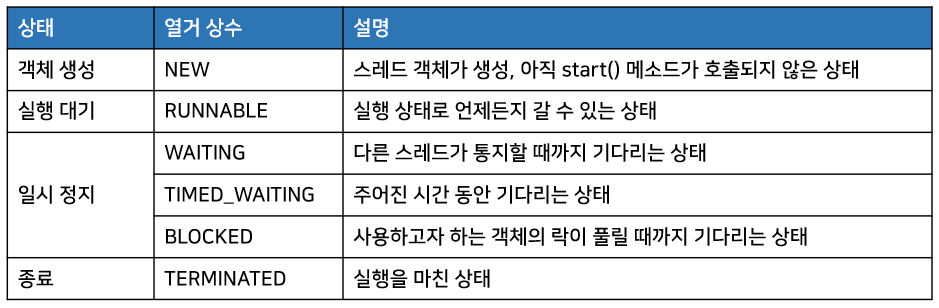

- 스레드의 상태를 출력하는 StatePrintThread 클래스 예제
  - 생성자 매개값으로 받은 타겟 스레드의 상태를 0.5초 주기로 출력

```java
// 타겟 스레드의 상태를 출력하는 스레드
public class StatePrintThread extends Thread {
  
  private Thread targetThread;
  
                          // 상태를 조사할 스레드
  public StatePrintThread(Thread targetThread) {
    this.targetThread = targetThread;
  }

  @Override
  public void run() {
    while (true) {
      Thread.State state = targetThread.getState(); // 스레드 상태 얻기
      System.out.println("타겟 스레드 상태: " + state);

      if (state == Thread.State.NEW) { // 객체 생성 상태일 경우
        targetThread.start();         // 실행 대기 상태로 만든다.
      }

      if (state == State.TERMINATED) { // 종료 상태일 경우
        break;                        // while문을 종료
      }

      try {
        // 0.5초간 일시 정지
        Thread.sleep(500);
      } catch (Exception e) { }
    }
  }

}
```

```java
// 타겟 스레드
public class TargetThread extends Thread {

  @Override
  public void run() {
    for (long i = 0; i < 1000000000; i++) { } // RUNNABLE 상태를 유지

    try {
      // 1.5초간 일시 정지
      Thread.sleep(1500); // 1.5초간 TIMED_WAITING 상태를 유지
    } catch (Exception e) { }

    for (long i = 0; i < 1000000000; i++) { } // RUNNABLE 상태를 유지
  }

}
```

- TargetThread가 객체로 생성되면 NEW 상태를 가진다.
  - run() 메소드가 종료되면 TERMINATED 상태가 된다.

```java
// 상태 변화
NEW → RUNNABLE → TIMED+WAITING → RUNNABLE → TERMINATED
```

- StatePrintThread를 생성해서 매개값으로 전달받은 TargetThread의 상태를 출력하는 실행 클래스

```java
// 실행 클래스
public class ThreadStateExample {

  public static void main(String[] args) {
    StatePrintThread statePrintThread = new StatePrintThread(new TargetThread());
    statePrintThread.start();
  }

}
```


## 스레드 상태 제어

- 스레드 상태 제어
  - 실행 중인 스레드의 상태를 변경하는 것
- 멀티 스레드 프로그램을 만들기 위해 정교한 스레드 상태 제어가 필요하다.
  - 상태 제어가 잘못되면 프로그램은 불안정해져 먹통이 되거나 다운된다.
    - 멀티 스레드 프로그래밍이 어렵다고 하는 이유이다.
- 스레드는 잘 사용하면 약이 되지만, 잘못 사용하면 치명적인 프로그램 버그가 된다.
  - 때문에 스레드를 정확하게 제어하는 방법을 잘 알고 있어야 한다.
- 스레드 제어를 제대로 하기 위해서는 스레드의 상태 변화를 가져오는 메소드들을 파악하고 있어야 한다.

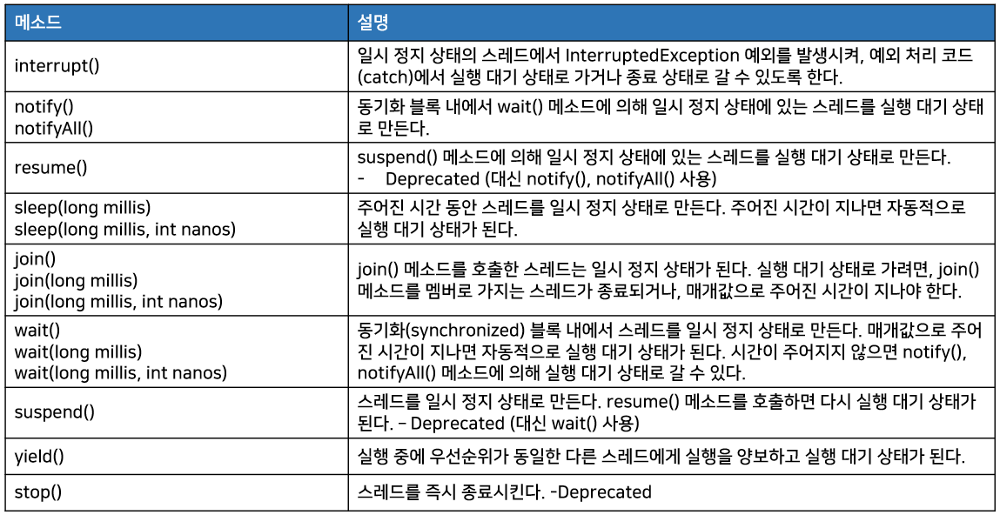

- `wait()`, `notify()`, `notifyAll()`은 Object 클래스의 메소드이다.
  - 그 이외의 메소드는 모두 Thread 클래스의 메소드들

### 주어진 시간동안 일시 정지(sleep())

- 실행 중인 스레드를 일정 시간 멈추게 하고 싶다면?
  - Thread 클래스의 정적 메소드인 sleep()을 사용하면 된다.
- Thread.sleep() 메소드를 호출한 스레드는 주어진 시간 동안 일시 정지 상태가 되고, 다시 실행 대기 상태로 돌아간다.

```java
try {
    Thread.sleep(1000);
} catch (InterruptedException e) {
    // interrupt() 메소드가 호출되면 실행
}
```

- 매개값에는 얼마 동안 일시 정지 상태로 있을 것인지, 밀리세컨드(1/1000) 단위로 시간을 주면 된다.
  - 1000이라는 값을 주면 스레드는 1초가 경과할 동안 일시 정지 상태로 있게 된다.
- 일시 정지 상태에서 주어진 시간이 되기 전에 interrupt() 메소드가 호출되면 InterruptedException이 발생한다.
  - 예외 처리가 필요하다.

```java
// 3초 주기로 비프(beep)음을 10번 발생시키는 예제
import java.awt.*;

public class SleepExample {

  public static void main(String[] args) {
    Toolkit toolkit = Toolkit.getDefaultToolkit();
    for (int i = 0; i < 10; i++) {
      toolkit.beep();
      try {
        Thread.sleep(3000);
      } catch (InterruptedException e) {
      }
    }
  }

}
```

### 다른 스레드에게 실행 양보(yield())

- 스레드가 처리하는 작업은 반복적인 실행을 위해 for문이나 while문을 포함하는 경우가 많다.
  - 가끔 반복문들이 무의미한 반복을 하는 경우가 있다.

```java
public void run() {
    while (true) {
        if (work) {
            System.out.println("ThreadA 작업 내용");
        }
    }
}
```

- 스레드가 시작되어 run() 메소드를 실행하면 while(true) {} 블록을 무한 반복 실행한다.
  - 만약 work의 값이 false에서 true로 변경되는 시점이 불명확하다면?
    - while문은 어떠한 실행문도 실행하지 않고 무의미한 반복을 한다.
    - 다른 스레드에게 실행을 양보하고 자신은 실행 대기 상태로 가는 것이 전체 프로그램 성능에 도움이 된다.
- yield() 메소드
  - yield() 메소드를 호출한 스레드는?
    - 실행 대기 상태로 돌아가고 동일한 우선순위 또는 높은 우선순위를 갖는 다른 스레드가 실행 기회를 가질 수 있도록 해준다.

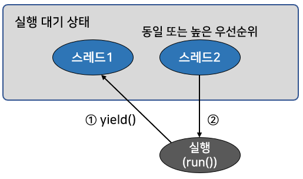

- 의미 없는 반복을 줄이기 위해 yield() 메소드를 호출해서 다른 스레드에게 실행 기회를 주도록 수정한 예시

```java
public void run() {
    while (true) {
        if (work) {
            System.out.println("ThreadA 작업 내용");
        } else {
            Thread.yield();
        }
    }
}
```

- 예제
  - 처음 실행 후 3초 동안 ThreadA와 ThreadB가 번갈아가며 실행
  - 3초 뒤에 메인 스레드가 ThreadA의 work 필드를 false로 변경
  - ThreadA는 yield() 메소드를 호출한다.
    - 따라서 이후 3초동안에는 ThreadB가 더 많은 실행 기회를 얻게 됨
  - 메인 스레드는 3초 뒤에 다시 ThreadA의 work 필드를 true로 변경
    - ThreadA와 ThreadB가 번갈아가며 실행됨
  - 마지막으로, 메인 스레드는 3초 뒤에 ThreadA와 ThreadB의 stop 필드를 true로 변경
    - 두 스레드가 반복 작업을 중지하고 종료하도록 한다.

```java
// ThreadA 클래스
public class ThreadA extends Thread {

  public boolean stop = false; // 종료 플래그
  public boolean work = true; // 작업 진행 여부 플래그

  @Override
  public void run() {
    while (!stop) { // stop이 true가 되면 while문 종료
      if (work) {
        System.out.println("ThreadA 작업 내용");
      } else { // work가 false가 되면 다른 스레드에게 실행 양보
        Thread.yield();
      }
    }
    System.out.println("ThreadA 종료");
  }
}
```

```java
// ThreadB 클래스
public class ThreadB extends Thread {

  public boolean stop = false; // 종료 플래그
  public boolean work = true; // 작업 진행 여부 플래그

  @Override
  public void run() {
    while (!stop) { // stop이 true가 되면 while문 종료
      if (work) {
        System.out.println("ThreadB 작업 내용");
      } else { // work가 false가 되면 다른 스레드에게 실행 양보
        Thread.yield();
      }
    }
    System.out.println("ThreadB 종료");
  }
  
}
```


```java
// 스레드 실행 양보 예제 실행클래스
public class YieldExample {

  public static void main(String[] args) {
    ThreadA threadA = new ThreadA();
    ThreadB threadB = new ThreadB();

    threadA.start();
    threadB.start();

    try {
      Thread.sleep(3000);
    } catch (InterruptedException e) { }
    threadA.work = false; // ThreadB만 실행

    try {
      Thread.sleep(3000);
    } catch (InterruptedException e) { }
    threadA.work = true;

    try {
      Thread.sleep(3000);
    } catch (InterruptedException e) { }
    threadA.stop = true;
    threadB.stop = true;
  }

}
```

### 다른 스레드의 종료를 기다림(join())

- 스레드는 다른 스레드와 독립적으로 실행하는 것이 기본이다.
  - 하지만 다른 스레드가 종료될 때까지 기다렸다가 실행해야 하는 경우가 발생할 수도 있다.
  - ex) 계산 작업을 하는 스레드가 모든 스레드가 모든 계산 작업을 마쳤을 때, 계산 결과값을 받아 이용하는 경우
- join() 메소드
  - 만약 ThreadA가 ThreadB의 join() 메소드를 호출하면 ThreadA는 ThreadB가 종료할 때까지 일시 정지 상태가 된다.
  - ThreadB의 run() 메소드가 종료되면 ThreadA는 일시 정지에서 풀려 다음 코드를 실행한다.

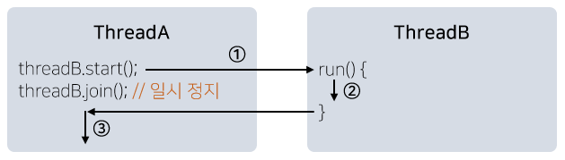

- SumThread가 계산 작업을 모두 마칠 때까지 일시 정지 상태에 있다가 종료되면 결과값을 받아 출력하는 예제

```java
// 1부터 100까지 합을 계산하는 스레드
public class SumThread extends Thread {

  private long sum;

  public long getSum() {
    return sum;
  }

  public void setSum(long sum) {
    this.sum = sum;
  }

  public void run() {
    for (int i = 1; i <= 100; i++) {
      sum += i;
    }
  }

}
```

```java
// 실행클래스. 다른 스레드가 종료될 때까지 일시 정지 상태 유지
public class JoinExample {

  public static void main(String[] args) {
    SumThread sumThread = new SumThread();
    sumThread.start();

    try {
      sumThread.join(); // sumThread가 종료될 때까지 메인 스레드 일시정지
    } catch (InterruptedException e) { }

    System.out.println("1~100 합: " + sumThread.getSum());
  }

}
```

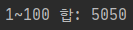

- 만약 try-catch 블록이 없다면?
  - 결과는 0이 나오게 된다.(컴퓨터 성능에 따라 다를 수도 있음)
  - 왜냐하면 SumThread가 계산 작업을 완료하지 않은 상태에서 출력을 먼저 하기 때문이다.

### 스레드 간 협업(wait(), notify(), notifyAll())

- 경우에 따라서 두 개의 스레드를 교대로 번갈아가며 실행해야 할 경우가 있다.
- 정확한 교대 작업이 필요할 경우
  - 자신의 작업이 끝나면 상대방 스레드를 일시 정지 상태에서 풀어주고, 자신은 일시 정지 상태로 만드는 것
  - 공유 객체가 핵심
    - 공유 객체는 두 스레드가 작업할 내용을 각각 동기화 메소드로 구분해 놓는다.
    - 한 스레드가 작업을 완료하면 `notify()` 메소드를 호출해서 일시 정지 상태에 있는 다른 스레드를 실행 대기 상태로 만들고,  
      자신은 두 번 작업을 하지 않도록 `wait()` 메소드를 호출하여 일시 정지 상태로 만듬

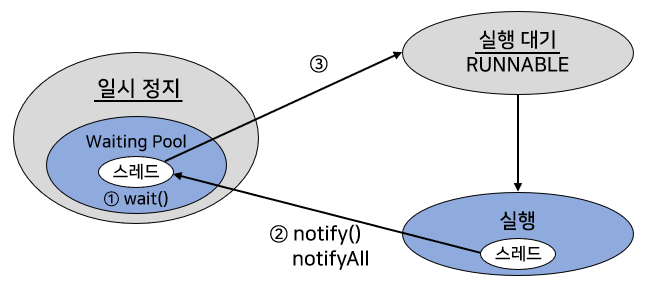

- 만약 `wait()` 대신 `wait(long timeout)`이나, `wait(long timeout, int nanos)` 를 사용하면?
  - notify()를 호출하지 않아도 지정된 시간이 지나면 스레드가 자동적으로 실행 대기 상태가 된다.
- `notifyAll()` 메소드
  - `notify()` 메소드와 동일한 역할
    - `notify()`는 `wait()`에 의해 일시 정지된 스레드 중 한 개를 실행 대기 상태로 만든다.
  - `notifyAll()` 메소드는 wait()에 의해 일시 정지된 모든 스레드들을 실행 대기 상태로 만든다.
- `wait(), notify(), notifyAll()` 메소드들은 모두 Object 클래스에 선언된 메소드이므로 모든 공유 객체에서 호출이 가능
  - 주의할 점
    - 동기화 메소드 또는 동기화 블록 내에서만 사용할 수 있다.
- 예제

```java
// 두 스레드의 작업을 WorkObject의 methodA()와 methodB()에 정의하고,
// 두 스레드 ThreadA와 ThreadB가 교대로 methodA()와 methodB()를 호출하도록 한 예제
public class WorkObject {

  public synchronized void methodA() {
    System.out.println("ThreadA의 methodA() 작업 실행");
    notify(); // 일시 정지 상태에 있는 ThreadB를 실행 대기 상태로 만든다.
    try {
      wait(); // ThreadA를 일시 정지 상태로 만든다.
    } catch (InterruptedException e) { }
  }

  public synchronized void methodB() {
    System.out.println("ThreadB의 methodB() 작업 실행");
    notify(); // 일시 정지 상태에 있는 ThreadA를 실행 대기 상태로 만든다.
    try {
      wait(); // ThreadB를 일시 정지 상태로 만든다.
    } catch (InterruptedException e) { }
  }

}
```

```java
// WorkObject의 methodA()를 실행하는 스레드
public class ThreadA extends Thread {

  private WorkObject workObject;

  public ThreadA(WorkObject workObject) {
    this.workObject = workObject; // 공유 객체를 매개값으로 받아 필드에 저장
  }

  @Override
  public void run() {
    for (int i = 0; i < 10; i++) {
      workObject.methodA(); // 공유 객체의 methodA()를 10번 반복 호출
    }
  }

}
```

```java
// WorkObject의 methodB()를 실행하는 스레드
public class ThreadB extends Thread {

  private WorkObject workObject;

  public ThreadB(WorkObject workObject) {
    this.workObject = workObject; // 공유 객체를 매개값으로 받아 필드에 저장
  }

  @Override
  public void run() {
    for (int i = 0; i < 10; i++) {
      workObject.methodB(); // 공유 객체의 methodB()를 10번 반복 호출
    }
  }

}
```

```java
// 두 스레드를 생성하고 실행하는 메인 스레드
public class WaitNotifyExample {

  public static void main(String[] args) {
    WorkObject sharedObject = new WorkObject(); // 공유 객체 생성

    // ThreadA와 ThreadB 생성
    ThreadA threadA = new ThreadA(sharedObject);
    ThreadB threadB = new ThreadB(sharedObject);

    // ThreadA와 ThreadB를 실행
    threadA.start();
    threadB.start();
  }

}
```

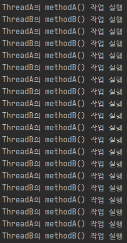

- 데이터를 저장하는 스레드(생산자 스레드)가 데이터를 저장하면, 데이터를 소비하는 스레드(소비자 스레드)가 데이터를 일고 처리하는 교대 작업 예제
  - 생산자 스레드는 소비자 스레드가 읽기 전에 새로운 데이터를 두 번 생성하면 안 된다.
    - setData() 메소드를 두 번 실행하면 안됨
  - 소비자 스레드는 생산자 스레드가 새로운 데이터를 생성하기 전에 이전 데이터를 두 번 읽어서도 안 된다.
    - getData() 메소드를 두 번 실행하면 안 됨
  - 구현 방법
    - 공유 객체에 데이터를 저장할 수 있는 data 필드의 값이 null이면?
      - 생산자 스레드를 실행 대기 상태로 만들고, 소비자 스레드를 일시 정지 상태로 만든다.
    - 반대로 data 필드의 값이 null이 아니면?
      - 소비자 스레드를 실행 대기 상태로 만들고, 생산자 스레드를 일시 정지 상태로 만든다.


- 전체 코드

```java
// 두 스레드의 작업 내용을 동기화 메소드로 작성한 공유 객체
public class DataBox {

  private String data;

  public synchronized String getData() {
    // data 필드가 null이면 소비자 스레드를 일시 정지 상태로 만듬
    if (this.data == null) {
      try {
        wait();
      } catch (InterruptedException e) { }
    }
    String returnValue = data;
    System.out.println("ConsummerThread가 읽은 데이터: " + returnValue);
    // data 필드를 null로 만들고 생산자 스레드를 실행 대기 상태로 만든다.
    data = null;
    notify();
    return returnValue;
  }

  public synchronized void setData(String data) {
    // data 필드가 null이 아니면 생산자 스레드를 일시 정지 상태로 만듬
    if (this.data != null) {
      try {
        wait();
      } catch (InterruptedException e) { }
    }
    // data 필드에 값을 저장하고 소비자 스레드를 실행 대기 상태로 만듬
    this.data = data;
    System.out.println("ProducerThread가 생성한 데이터: " + data);
    notify();
  }

}
```

```java
// 데이터를 생산(저장)하는 스레드
public class ProducerThread extends Thread {

  private DataBox dataBox;

  public ProducerThread(DataBox dataBox) {
    this.dataBox = dataBox; // 공유 객체를 필드에 저장
  }

  @Override
  public void run() {
    for (int i = 1; i <= 3; i++) {
      String data = "Data-" + i;
      dataBox.setData(data); // 새로운 데이터를 저장
    }
  }

}
```

```java
// 데이터를 소비(읽는)하는 스레드
public class ConsumerThread extends Thread {

  private DataBox dataBox;

  public ConsumerThread(DataBox dataBox) {
    this.dataBox = dataBox; // 공유 객체를 필드에 저장
  }

  @Override
  public void run() {
    for (int i = 1; i <= 3; i++) {
      String data = dataBox.getData(); // 새로운 데이터를 읽음
    }
  }
  
}
```

```java
// 두 스레드를 생성하고 실행하는 메인 스레드
public class WaitNotifyExample {

  public static void main(String[] args) {
    DataBox dataBox = new DataBox();

    ProducerThread producerThread = new ProducerThread(dataBox);
    ConsumerThread consumerThread = new ConsumerThread(dataBox);

    producerThread.start();
    consumerThread.start();
  }

}
```

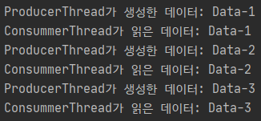

### 스레드의 안전한 종료(stop 플래그, interrupt())

- 스레드는 자신의 run() 메소드가 모두 실행되면 자동적으로 종료된다.
- 경우에 따라서는 실행 중인 스레드를 즉시 종료할 필요가 있다.
  - ex) 동영상을 끝까지 보지 않고, 사용자가 멈춤을 요구할 수 있다.
- Thread는 스레드를 즉시 종료시키기 위해 stop() 메소드를 제공하고 있다.
  - deprecated 되었다.
    - 이유 : stop() 메소드로 스레드를 갑자기 종료하게 되면 스레드가 사용 중이던 자원들이 불안전한 상태로 남겨지기 때문
    - 자원 : 파일, 네트워크 연결 등을 말한다.
- 스레드를 즉시 종료시키기 위한 최선의 방법은?

#### stop 플래그를 이용하는 방법

- 스레드는 run() 메소드가 끝나면 자동적으로 종료된다.
  - 따라서 run() 메소드가 정상적으로 종료되도록 유도하는 것이 최선의 방법

```java
// stop 플래그를 이용해서 run() 메소드의 종료를 유도
public class XXXThread extends Thread {
    private boolean stop; // stop 플래그 필드
    
    public void run() {
        while( !stop ) { // stop이 true가 되면 run()이 종료된다.
            스레드가 반복 실행하는 코드;
        }
        // 스레드가 사용한 자원 정리
    }
}
```

- stop 필드가 false일 경우 while문의 조건식이 true가 되어 반복 실행한다.
  - 하지만 stop 필드가 true일 경우 while문의 조건식이 false가 되어 while문을 빠져나온다.
    - 그 후 스레드가 사용한 자원을 정리하고, run() 메소드가 끝나 스레드는 안전하게 종료된다.
- PrintThread1을 실행한 후 1초 후에 PrintThread1을 멈추도록 setStop() 메소드를 호출하는 예제

```java
// 1초 후 출력 스레드를 중지
public class StopFlagExample {

  public static void main(String[] args) {
    PrintThread1 printThread = new PrintThread1();
    printThread.start();

    try {
      Thread.sleep(1000);
    } catch (InterruptedException e) { }

    printThread.setStop(true); // 스레드를 종료시키기 위해 stop 필드를 true로 변경
  }

}
```

```java
// 무한 반복해서 출력하는 스레드
public class PrintThread1 extends Thread {

  private boolean stop;

  public void setStop(boolean stop) {
    this.stop = stop;
  }

  @Override
  public void run() {
    while (!stop) {
      System.out.println("실행 중");
    }
    System.out.println("자원 정리");
    System.out.println("실행 종료");
  }

}
```


#### interrupt() 메소드를 이용하는 방법

- interrupt() 메소드는 스레드가 일시 정지 상태에 있을 때 InterruptedException 예외를 발생시키는 역할을 한다.
  - 이것을 이용해 run() 메소드를 정상 종료시킬 수 있다.
- 예제

```java
// 1초 후 출력 스레드를 중지시키는 실행 클래스
public class InterruptExample {

  public static void main(String[] args) {
    Thread thread = new PrintThread2();
    thread.start();

    try {
      Thread.sleep(1000);
    } catch (InterruptedException e) { }

    thread.interrupt();
  }

}
```

```java
// 무한 반복해서 출력하는 스레드
public class PrintThread2 extends Thread {

  @Override
  public void run() {
    try {
      while (true) {
        System.out.println("실행 중");
        Thread.sleep(1); // InterruptedException 발생가능
      }
    } catch (InterruptedException e) { }

    System.out.println("자원 정리");
    System.out.println("실행 종료");
  }
  
}
```


- 주목할 점
  - 스레드가 실행 대기 또는 실행 상태에 있을 때 interrupt() 메소드가 실행되면 즉시 InterruptedException 예외가 발생하지 않는다.
  - 스레드가 미래에 일시 정지 상태가 되면 InterruptedException 예외가 발생한다.
    - 따라서 스레드가 일시 정지 상태가 되지 않으면 interrupt() 메소드 호출은 아무 의미가 없다.
    - 짧은 시간이나마 일시 정지시키기 위해 Thread.sleep(1)을 사용
- 일시 정지를 만들지 않고도 interrupt() 호출 여부를 알 수 있는 방법
  - interrupt() 메소드가 호출되었다면?
    - 스레드의 interrupted()와 isInterrupted() 메소드는 true를 리턴한다.
      - interrupted()는 정적 메소드로, 현재 스레드가 interrupted 되었는지 확인
      - isInterrupted()는 인스턴스 메소드로, 현재 스레드가 interrupted 되었는지 확인할 때 사용

```java
boolean status = Thread.interrupted();
boolean status = objThread.isInterrupted();
```

- 일시 정지 코드인 Thread.sleep(1)을 사용하지 않고 Thread.interrupted() 를 사용해 interrupt()가 호출되었는지 확인하는 수정된 예제

```java
public class PrintThread2 extends Thread {

  @Override
  public void run() {
      while (true) {
          System.out.println("실행 중");
          if (Thread.interrupted()) {
              break; // while문을 빠져나옴
          }
      }

    System.out.println("자원 정리");
    System.out.println("실행 종료");
  }

}
```

## 데몬 스레드

- 데몬(daemon) 스레드
  - 주 스레드의 작업을 돕는 보조적인 역할을 수행하는 스레드
  - 주 스레드가 종료되면 데몬 스레드는 강제적으로 자동 종료된다.
    - 이유 : 주 스레드의 보조 역할을 수행하므로 주 스레드가 종료되면 데몬 스레드의 존재 의미가 없어지기 때문
  - 일반 스레드와 크게 차이가 없다.
  - ex) 워드 프로세서의 자동 저장, 미디어 플레이어의 동영상 및 음악 재생, 가비지 컬렉터 등
    - 주 스레드(워드 프로세스, 미디어 플레이어, JVM)가 종료되면 같이 종료됨
- 스레드를 데몬으로 만들기 위해서는?
  - 주 스레드가 데몬이 될 스레드의 setDaemon(true)를 호출해주면 된다.

```java
// 메인 스레드가 주 스레드, AutoSaveThread가 데몬 스레드가 되는 예시
public static void main(String[] args) {
    AutoSaveThread thread = new AutoSaveThread();
    thread.setDaemon(true);
    thread.start();
}
```

- 주의할 점
  - start() 메소드가 호출되고 나서 setDaemon(true)를 호출하면 IllegalThreadStateException 발생
  - start() 메소드 호출 전에 setDaemon(true)를 호출해야 한다.
- 현재 실행 중인 스레드가 데몬 스레드인지 아닌지를 구별하는 방법
  - isDeamon() 메소드의 리턴값을 조사
    - 데몬 스레드일 경우 true를 리턴

```java
// 1초 주기로 save() 메소드를 자동 호출하는 AutoSaveThread,  
// 메인스레드가 3초 후 종료되면  AutoSaveThread도 같이 종료되도록 하는 예제
public class AutoSaveThread extends Thread {
  
  public void save() {
    System.out.println("작업 내용을 저장함.");
  }

  @Override
  public void run() {
    while (true) {
      try {
        Thread.sleep(1000);
      } catch (InterruptedException e) {
        break;
      }
      save();
    }
  }

}
```

```java
public class DaemonExample {

  public static void main(String[] args) {
    AutoSaveThread autoSaveThread = new AutoSaveThread();
    autoSaveThread.setDaemon(true); // AutoSaveThread를 데몬 스레드로 만든다.
    autoSaveThread.start();

    try {
      Thread.sleep(3000);
    } catch (InterruptedException e) { }

    System.out.println("메인 스레드 종료");
  }

}
```


## 스레드 그룹

- 스레드 그룹(ThreadGroup)은 관련된 스레드를 묶어서 관리할 목적으로 이용된다.
- JVM이 실행되면 system 스레드 그룹을 만들고, JVM 운영에 필요한 스레드들을 생성해서 system 스레드 그룹에 포함시킨다.
  - system 하위 스레드 그룹으로 main을 만들고 메인 스레드를 main 스레드 그룹에 포함시킨다.
- 스레드는 반드시 하나의 스레드 그룹에 포함된다.
  - 명시적으로 스레드 그룹에 포함시키지 않는다면?
    - 기본적으로 자신을 생성한 스레드와 같은 스레드 그룹에 속하게 된다.
    - main 스레드가 생성하면 기본적으로 main 스레드 그룹에 속하게 된다.

### 스레드 그룹 이름 얻기

- 현재 스레드가 속한 스레드 그룹의 이름을 얻고 싶다면?

```java
ThreadGroup group = Thread.currentThread().getThreadGroup();
String groupName = group.getName();
```

- Thread의 정적 메소드인 getAllStackTraces()를 이용하면 프로세스 내에서 실행하는 모든 스레드에 대한 정보를 얻을 수 있다.

```java
Map<Thread, StackTraceElement[]> map = Thread.getAllStackTraces();
```

- getAllStackTraces() 메소드는 Map 타입의 객체를 리턴한다.
  - 키는 스레드 객체이고 값은 스레드의 상태 기록들을 갖고 있는 StackTraceElement[] 배열

```java
// 현재 실행하고 있는 스레드의 이름과 데몬 여부, 그리고 속한 스레드 그룹 이름이 무엇인지 출력하는 예제
import java.util.Map;
import java.util.Set;

public class ThreadInfoExample {

  public static void main(String[] args) {
    AutoSaveThread autoSaveThread = new AutoSaveThread();
    autoSaveThread.setName("AutoSaveThread");
    autoSaveThread.setDaemon(true);
    autoSaveThread.start();

    Map<Thread, StackTraceElement[]> map = Thread.getAllStackTraces();
    Set<Thread> threads = map.keySet();
    for (Thread thread : threads) {
      System.out.println("Name: " + thread.getName() +
          (thread.isDaemon() ? "(데몬)" : "(주)"));
      System.out.println("\t" + "소속그룹: " + thread.getThreadGroup().getName());
      System.out.println();
    }
  }

}
```

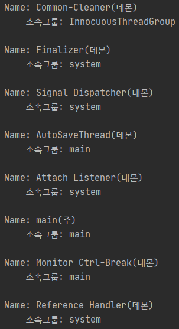

- main 스레드는 system 그룹의 하위 그룹인 main에 속하는 것 확인가능
  - main 스레드가 실행시킨 AutoSaveThread는 main 스레드가 소속된 main 그룹에 포함되어 있다.

### 스레드 그룹 생성

- 명시적으로 스레드 그룹을 만들고 싶다면?
  - 생성자를 이용하여 ThreadGroup 객체를 만든다.
  - ThreadGroup 이름만 주거나, 부모 ThreadGroup과 이름을 매개값으로 줄 수 있다.

```java
ThreadGroup tg = new ThreadGroup(String name);
ThreadGroup tg = new ThreadGroup(ThreadGroup parent, String name);
```

- 스레드 그룹 생성 시 부모(parent) 스레드 그룹을 지정하지 않는다면?
  - 현재 스레드가 속한 그룹의 하위 그룹으로 생성된다.
  - ex) main 스레드가 ThreadGroup(String name)을 이용해서 새로운 스레드 그룹을 생성하면 main 스레드 그룹의 하위 스레드 그룹이 됨
- 새로운 스레드 그룹을 생성한 후, 이 그룹에 스레드를 포함시키려면?
  - Thread 객체를 생성할 때 생성자 매개값으로 스레드 그룹을 지정하면 된다.

```java
// 스레드 그룹을 매개값으로 갖는 Thread 생성자 네 가지
Thread t = new Thread(ThreadGroup group, Runnable target);
Thread t = new Thread(ThreadGroup group, Runnable target, String name);
Thread t = new Thread(ThreadGroup group, Runnable target, String name, long stackSize);
Thread t = new Thread(ThreadGroup group, String name);
```

- Runnable 타입의 target은 Runnable 구현 객체
- String 타입의 name은 스레드의 이름
- long 타입의 stackSize는 JVM이 스레드에 할당할 stack 크기

### 스레드 그룹의 일괄 interrupt()

- 스레드를 스레드 그룹에 포함시켰을 때 이점
  - 스레드 그룹에서 제공하는 interrupt() 메소드를 이용하면 그룹 내에 포함된 모든 스레드들을 일괄 interrupt할 수 있다.
  - ex) 10개의 스레드들을 모두 종료시키기 위해 각 스레드에서 interrupt() 메소드를 10번 호출할 수 있다.  
    하지만 이 스레드들이 같은 스레드 그룹에 소속되어 있을 경우, 스레드 그룹의 interrupt() 메소드를 한 번만 호출해주면 된다.
    - 가능한 이유 : 스레드 그룹의 interrupt() 메소드는 포함된 모든 스레드의 interrupt() 메소드를 내부적으로 호출해주기 때문
- 스레드 그룹의 interrupt() 메소드는 소속된 스레드의 interrupt() 메소드를 호출만 한다.
  - 개별 스레드에서 발생하는 InterruptedException에 대한 예외 처리를 하지 않는다.
  - 안전한 종료를 위해 개별 스레드가 예외 처리를 해야 한다.
- 스레드 그룹의 interrupt() 메소드 이외에도 suspend(), resume(), stop() 메소드들이 있다.
  - 하지만 모두 Deprecated 되었다.
- stop() 메소드를 호출하면 그룹에 포함된 모든 스레드들의 stop() 메소드가 일괄 호출되어 모든 스레드들을 쉽게 종료할 수 있다.
  - 하지만 스레드의 안전성 문제때문에 가급적 사용하지 말아야 한다.
  - 대신 interrupt() 메소드로 스레드들을 안전하게 종료하도록 유도하는 것이 좋다.
- ThreadGroup이 가지고 있는 주요 메소드들

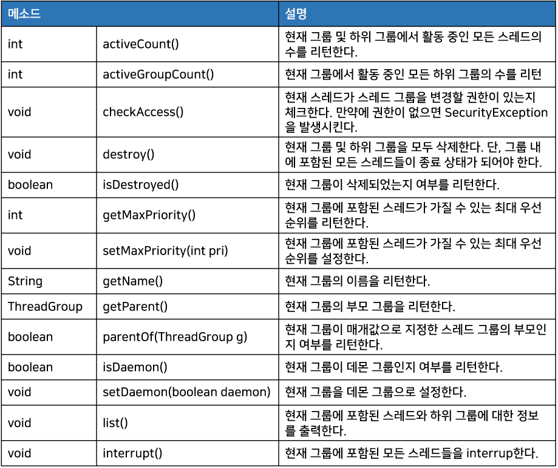

```java
// 스레드 그룹을 생성하고, 정보를 출력
// 3초 후 스레드 그룹의 interrupt() 메소드를 호출해 스레드 그룹에 포함된 모든 스레드들을 종료하는 예제

public class WorkThread extends Thread {

  public WorkThread(ThreadGroup threadGroup, String threadName) {
    super(threadGroup, threadName);
  }

  @Override
  public void run() {
    while (true) {
      try {
        Thread.sleep(1000);
      } catch (InterruptedException e) {
        System.out.println(getName() + " Interrupted");
        break;
      }
    }
    System.out.println(getName() + " 종료됨");
  }
}

-------------------------------------------------------------------------------------------

public class ThreadGroupExample {

  public static void main(String[] args) {
    ThreadGroup myGroup = new ThreadGroup("myGroup");
    WorkThread workThreadA = new WorkThread(myGroup, "workThreadA");
    WorkThread workThreadB = new WorkThread(myGroup, "workThreadB");

    workThreadA.start();
    workThreadB.start();

    System.out.println("[ main 스레드 그룹의 list() 메소드 출력 내용 ");
    ThreadGroup mainGroup = Thread.currentThread().getThreadGroup();
    mainGroup.list(); // list() 메소드는 현재 스레드 그룹의 이름과 최대 우선순위를 헤더로 출력
      				  // 아래에 현재 스레드 그룹에 포함된 스레드와 하위 스레드 그룹의 내용을 보여줌
      				  // 스레드는 [스레드이름, 우선순위, 소속 그룹명]으로 출력
    System.out.println();

    try {
      Thread.sleep(3000);
    } catch (InterruptedException e) { }

    System.out.println("[ myGroup 스레드 그룹의 interrupt() 메소드 호출 ");
    myGroup.interrupt(); // myGroup에 포함된 두 스레드에서 InterruptedException이 발생되어 스레드가 종료
  }

}
```

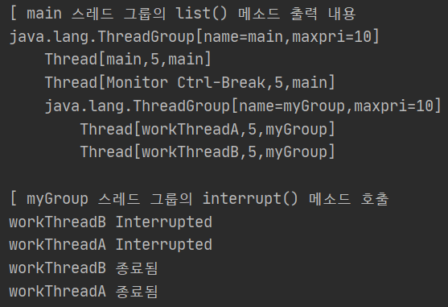