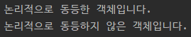
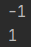
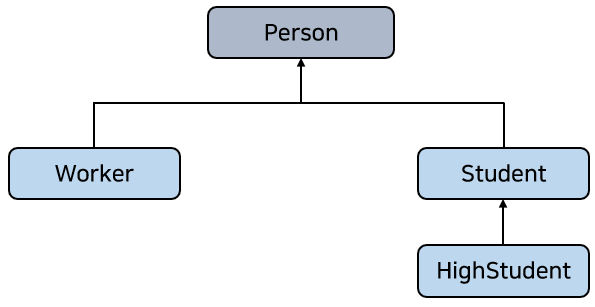
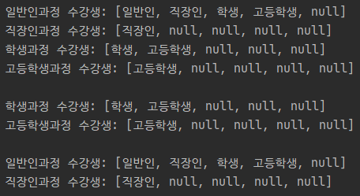

# 제네릭

## 왜 제네릭을 사용해야 하는가?

- Java 5부터 제네릭(Generic) 타입이 새로 추가되었다.
  - 제네릭 타입을 이용함으로써 잘못된 타입이 사용될 수 있는 문제를 컴파일 과정에서 제거할 수 있게 되었다.
- 제네릭은 컬렉션, 람다식, 스트림, NIO에서 널리 사용된다.
- API 도큐먼트를 보면 제네릭 표현이 많다.
- 제네릭은 클래스와 인터페이스, 그리고 메소드를 정의할 때 타입(type)을 파라미터(parameter)로 사용할 수 있도록 한다.
  - 타입 파라미터는 코드 작성 시 구체적은 타입으로 대체되어 다양한 코드를 생성하도록 해준다.
- 제네릭을 사용하는 코드는 비제네릭 코드에 비해 이점을 가지고 있다.

### 컴파일 시 강한 타입 체크를 할 수 있다.

- 자바 컴파일러는 코드에서 잘못 사용된 타입 때문에 발생하는 문제점을 제거하기 위해 제니릭 코드에 대해 강한 타입 체크를 한다.
  - 실행 시 타입 에러가 나는 것보다 컴파일 시에 미리 타입을 강하게 체크해서 에러를 사전에 방지하는 것이 좋다.

### 타입 변환(casting)을 제거한다.

- 비제네릭 코드는 불필요한 타입 변환을 하기 때문에 프로그램 성능에 악영향을 미친다.

```java
// List에 문자열 요소를 저장했지만, 요소를 찾아올 때는 반드시 String으로 타입 변환을 해야 한다.
List list = new ArrayList();
list.add("hello");
String str = (String) list.get(0); // 타입 변환을 해야함
```

- 제네릭 코드로 수정시 List에 저장되는 요소를 String 타입으로 국한하기 때문에 요소를 찾아올 때 타입 변환을 할 필요가 없다.
  - 프로그램 성능이 향상된다.

```java
List<String> list = new ArrayList<String>();
list.add("hello");
String str = list.get(0); // 타입 변환을 하지 않음
```

## 제네릭 타입(class<T>, interface<T>)

- 제네릭 타입은 타입을 파라미터로 가지는 클래스와 인터페이스를 말한다.
  - 제네릭 타입은 클래스 또는 인터페이스 이름 뒤에 "<>" 부호가 붙고, 사이에 타입 파라미터가 위치한다.

```java
// 아래 코드에서 타입 파라미터의 이름은 T
public class 클래스명<T> { ... }
public interface 인터페이스명<T> { ... }
```

- 타입 파라미터는 변수명과 동일한 규칙에 따라 작성할 수 있다.
  - 일반적으로 대문제 알파벳 한 글자로 표현한다.
- 제네릭 타입을 실제 코드에어 사용하려면 타입 파라미터에 구체적인 타입을 지정해야 한다.
- 타입 파라미터를 사용해야 하는 이유?

```java
public class Box {
    private Object object;
    public void set(Object object) {
        this.object = object;
    }
    public Object get() {
        return object;
    }
}
```

- Box 클래스의 필드 타입을 Object 타입으로 선언한 이유
  - 모든 종류의 객체를 저장하고 싶어서.
  - Object 클래스는 모든 자바 클래스의 최상위 부모클래스이다.
  - 자식 객체는 부모 타입에 대입할 수 있다는 성질 때문에 모든 자바 객체는 Object 타입으로 자동 타입 변환되어 저장된다.

```java
Object object = 자바의 모든 객체;
```

- set() 메소드는 매개 변수 타입으로 Object를 사용함으로써 매개값으로 자바의 모든 객체를 받을 수 있게 했다.
- get() 메소드는 Object 필드에 저장된 객체를 Object 타입으로 리턴한다.
  - 필드에 저장된 원래 타입의 객체를 얻으려면 강제 타입 변환을 해야 한다.

```java
Box box = new Box();
box.set("hello");				// String 타입을 Object 타입으로 자동 타입 변환해서 저장
String str = (String) box.get(); // Object 타입을 String 타입으로 강제 타입 변환해서 얻음
```

- 실제 예제

```java
// Box 클래스
public class Box {
  private Object object;

  public void set(Object object) {
    this.object = object;
  }

  public Object get() {
    return object;
  }
}
```

```java
// Apple 클래스
public class Apple {
}
```

```java
// 실행 클래스
public class BoxExample {

  public static void main(String[] args) {
    Box box = new Box();
    box.set("홍길동");                   // String -> Object (자동 타입 변환)
    String name = (String) box.get();   // Object -> String (강제 타입 변환)

    box.set(new Apple());               // Apple -> Object (자동 타입 변환)
    Apple apple = (Apple) box.get();    // Object -> Apple (강제 타입 변환)
  }

}
```

- Object 타입을 사용하면 모든 종류의 자바 객체를 저장할 수 있다는 장점이 있다.
  - 하지만 저장할 때 타입 변환이 필요하고, 읽어올 때도 타입 변환이 발생한다.
  - 타입 변환이 빈번해지면 전체 프로그램 성능에 좋지 못한 결과를 가져올 수 있다.
- 모든 종류의 객체를 저장하면서 타입 변환이 발생하지 않도록 하는 방법?
  - 제네릭이 해결책

```java
// 제네릭을 이용해서 Box 클래스를 수정한 것
public class Box<T> {
  private T t;

  public T get() {
    return t;
  }

  public void set(T t) {
    this.t = t;
  }
}
```

- 타입 파라미터 T를 사용해서 Object 타입을 모두 T로 대체
  - T는 Box 클래스로 객체를 생성할 때 구체적인 타입으로 변경된다.

```java
Box<String> box = new Box<String>();
// 타입 파라미터 T는 String 타입으로 변경되어 Box 클래스의 내부가 자동으로 재구성된다.
public class Box<String> {
  private String t;

  public String get() {
    return t;
  }

  public void set(String t) {
    this.t = t;
  }
}
```

- 필드 타입도 String으로, set() 메소드도 String 타입만 매개값으로 받을 수 있게 변경되었다.
  - get() 메소드 역시 String 타입으로 리턴하도록 변경
  - 저장할 때와 읽어올 때 전혀 타입 변환이 발생하지 않는다.

```java
Box<String> box = new Box<String>();
box.set("hello");
String str = box.get();
```

```java
// 아래처럼 Box 객체 생성을 가정하면
Box<Integer> box = new Box<Integer>();
// 타입 파라미터 T는 Integer 타입으로 변경되어 Box 클래스 내부가 자동으로 재구성됨
public class Box<Integer> {
  private Integer t;

  public Integer get() {
    return t;
  }

  public void set(Integer t) {
    this.t = t;
  }
}
```

- 필드 타입이 Integer로, set() 메소드도 Integer 타입만 매개값으로 받을 수 있게 변경되었다.
  - get() 메소드도 Integer 타입으로 리턴하도록 변경됨
  - 저장할 때와 읽어올 때 전혀 타입 변환이 발생하지 않는다.

```java
Box<Integer> box = new Box<Integer>();
box.set(6);				// 자동 Boxing
int value = box.get();	 // 자동 UnBoxing
```

- 제네릭은 클래스를 설계할 때 구체적인 타입을 명시하지 않고, 타입 파라미터로 대체한다.
  - 실제 클래스가 사용될 때 구체적인 타입을 지정함으로써 타입 변환을 최소화시킨다.
- 제네릭 타입 예제

```java
// Box.java
public class Box<T> {
  private T t;

  public T get() {
    return t;
  }

  public void set(T t) {
    this.t = t;
  }
}
```

```java
// 제네릭 타입 사용
public class BoxExample {

  public static void main(String[] args) {
    Box<String> box1 = new Box<>();
    box1.set("hello");

    String str = box1.get();

    Box<Integer> box2 = new Box<>();
    box2.set(6);
    int value = box2.get();
  }

}
```

## 멀티 타입 파라미터(class<K, V, ...>, interface<K, V, ...>)

- 제네릭 타입은 두 개 이상의 멀티 타입 파라미터를 사용할 수 있다.
  - 이 경우 각 타입 파라미터를 콤마로 구분

```java
// Product<T, M> 제네릭 타입을 정의하고 사용하는 예제
public class Product<T, M> {
  private T kind;
  private M model;

  public T getKind() {
    return this.kind;
  }

  public M getModel() {
    return this.model;
  }

  public void setKind(T kind) {
    this.kind = kind;
  }

  public void setModel(M model) {
    this.model = model;
  }
}
```

```java
// 실행 클래스
public class ProductExample {

  public static void main(String[] args) {
    Product<Tv, String> product1 = new Product<>();

    product1.setKind(new Tv());
    product1.setModel("스마트Tv");
    Tv tv = product1.getKind();
    String tvModel1 = product1.getModel();

    Product<Car, String> product2 = new Product<>();
    product2.setKind(new Car());
    product2.setModel("디젤");
    Car car = product2.getKind();
    String carModel = product2.getModel();
  }

}

class Tv {
}

class Car {
}
```

- 제네릭 타입 변수 선언과 객체 생성을 동시에 할 때 타입 파라미터 자리에 구체적인 타입을 지정하는 코드가 중복해서 나온다.
  - 복잡해질 수 있어 자바 7부터 제네릭 타입 파라미터 중복 기술을 줄이기 위해 다이아몬드 연산식 <>를 제공한다.
  - 자바 컴파일러는 타입 파라미터 부분에 <> 연산자를 사용하면 타입 파라미터를 유추해서 자동으로 설정해준다.

```java
// 예를 들어 자바 6 이전 버전에서 사용한 제네릭 타입 변수 선언과 객체 생성 코드
Product<Tv, String> product = new Product<Tv, String>();
// 자바 7부터는 다이아몬드 연산자를 사용해 간단하게 작성할 수 있다.
Product<Tv, String> product = new Product<>();
```

## 제네릭 메소드(<T, R>  R method(T t))

- 제네릭 메소드는 매개 타입과 리턴 타입으로 타입 파라미터를 갖는 메소드이다.
- 제네릭 메소드를 선언하는 방법
  - 리턴 타입 앞에 <> 기호를 추가하고 타입 파라미터를 기술한 다음, 리턴 타입과 매개 타입으로 타입 파라미터를 사용

```java
public <타입파라미터, ...> 리턴타입 메소드명(매개변수, ...) { ... }
```

```java
// boxing() 제네릭 메소드는 <> 기호 안에 타입 파라미터 T를 기술한 뒤,
// 매개 변수 타입으로 T를 사용, 리턴 타입으로 제네릭 타입 Box<T>를 사용
public <T> Box<T> boxing(T t) { ... }
```

- 제네릭 메소드는 두 가지 방식으로 호출할 수 있다.
  - 코드에서 타입 파라미터의 구체적인 타입을 명시적으로 지정
  - 컴파일러가 매개값의 타입을 보고 구체적인 타입을 추정

```java
리턴타입 변수 = <구체적타입> 메소드명(매개값);	// 명시적으로 구체적 타입 지정
리턴타입 변수 = 메소드명(매개값);			   // 매개값을 보고 구체적 타입을 추정
```

```java
// boxing() 메소드를 호출하는 코드
Box<Integer> box = <Integer>boxing(100);	// 타입 파라미터를 명시적으로 Integer로 지정
Box<Integer> box = boxing(100);			   // 타입 파라미터를 Integer로 추정
```

- Util 클래스에 정적 제네릭 메소드로 boxing()을 정의하고 BoxingMethodExample 클래스에서 호출하는 예제

```java
public class Util {

  public static <T> Box<T> boxing(T t) {
    Box<T> box = new Box<T>();
    box.set(t);
    return box;
  }

}
```

```java
// 실행 클래스
public class BoxingMethodExample {

  public static void main(String[] args) {
    Box<Integer> box1 = Util.<Integer>boxing(100);
    int intValue = box1.get();

    Box<String> box2 = Util.boxing("홍길동");
    String strValue = box2.get();
  }

}
```

- Util 클래스에 정적 제네릭 메소드로 compare()를 정의하고 CompareMethodExample 클래스에서 호출하는 예제

```java
// 제네릭 메소드
public class Util {

  public static <K, V> boolean compare(Pair<K, V> p1, Pair<K, V> p2) {
    boolean keyCompare = p1.getKey().equals(p2.getKey());
    boolean valueCompare = p1.getValue().equals(p2.getValue());
    return keyCompare && valueCompare;
  }

}
```

```java
// 제네릭 타입
public class Pair<K, V> {
  private K key;
  private V value;

  public Pair(K key, V value) {
    this.key = key;
    this.value = value;
  }

  public K getKey() {
    return key;
  }

  public void setKey(K key) {
    this.key = key;
  }

  public V getValue() {
    return value;
  }

  public void setValue(V value) {
    this.value = value;
  }
}
```

```java
// 제네릭 메소드 호출
public class CompareMethodExample {

  public static void main(String[] args) {
    Pair<Integer, String> p1 = new Pair<>(1, "사과");
    Pair<Integer, String> p2 = new Pair<>(1, "사과");
    boolean result1 = Util.<Integer, String>compare(p1, p2); // 명시적 지정
    if (result1) {
      System.out.println("논리적으로 동등한 객체입니다.");
    } else {
      System.out.println("논리적으로 동등하지 않은 객체입니다");
    }

    Pair<String, String> p3 = new Pair<>("user1", "홍길동");
    Pair<String, String> p4 = new Pair<>("user2", "홍길동");
    boolean result2 = Util.compare(p3, p4); // 타입 추정
    if (result2) {
      System.out.println("논리적으로 동등한 객체입니다.");
    } else {
      System.out.println("논리적으로 동등하지 않은 객체입니다.");
    }
  }

}
```



## 제한된 타입 파라미터(<T extends 최상위타입>)

- 타입 파라미터에 지정되는 구체적인 타입을 제한할 필요가 종종 있다.
  - ex) 숫자를 연산하는 제네릭 메소드  
    매개값으로 Number 타입 또는 하위 클래스 타입(Byte, Short, Integer, Long, Double)의 인스턴스만 가져야 한다.
- 제한된 타입 파라미터를 선언하려면?
  - 타입 파라미터 뒤에 extends 키워드를 붙이고 상위 타입을 명시하면 된다.
  - 상위 타입은 클래스뿐만 아니라 인터페이스도 가능

```java
public <T extends 상위타입> 리턴타입 메소드(매개변수, ...) { ... }
```

- 타입 파라미터에 지정되는 구체적인 타입은 상위 타입이거나 상위 타입의 하위 또는 구현 클래스만 가능하다.
  - 주의할 점
    - 메소드의 중괄호 { } 안에서 타입 파라미터 변수로 사용 가능한 것은 상위 타입의 멤버(필드 메소드)로 제한된다.
    - 하위 타입에만 있는 필드와 메소드는 사용할 수 없다.

```java
// 숫자 타입만 구체적인 타입으로 갖는 제네릭 메소드 compare()
// 두 개의 숫자 타입을 매개값으로 받아 차이를 리턴
public <T extends Number> int compare(T t1, T t2) {
    double v1 = t1.doubleValue();	// Number의 doubleValue() 메소드 사용
    double v2 = t2.doubleValue();	// Number의 doubleValue() 메소드 사용
    return Double.compare(v1, v2);
    // Double.compare() 메소드는 첫 번째 매개값이 작으면 -1을, 같으면 0을, 크면 1을 리턴
}
```

- 예제

```java
public class Util {

  public static <T extends Number> int compare(T t1, T t2) {
    double v1 = t1.doubleValue();
    double v2 = t2.doubleValue();
    return Double.compare(v1, v2);
  }

}
```

```java
public class BoundedTypeParameterExample {

  public static void main(String[] args) {
    // String str = Util.compare("a", "b"); (X) String은 Number 타입이 아니다.

    int result1 = Util.compare(10, 20); // 자동 Boxing
    System.out.println(result1);

    int result2 = Util.compare(4.5, 3); // 자동 Boxing
    System.out.println(result2);
  }

}
```



## 와일드카드 타입(<?>, <? extends ...>, <? super ...>)

- 코드에서 ?를 일반적으로 와일드카드(wildcard)라고 부른다.
  - 제네릭 타입을 매개값이나 리턴 타입으로 사용할 때 구체적인 타입 대신 와일드카드를 세 가지 형태로 사용할 수 있다.
- 제네릭 타입<?> : Unbounded Wildcards (제한 없음)  
  타입 파라미터를 대치하는 구체적인 타입으로 모든 클래스나 인터페이스 타입이 올 수 있다.
- 제네릭타입<? extends 상위타입> : Upper Bounded Wildcards (상위 클래스 제한)  
  타입 파라미터를 대치하는 구체적인 타입으로 상위 타입이나 하위 타입만 올 수 있다.
- 제네릭타입<? super 하위타입> : Lower Bounded Wildcards (하위 클래스 제한)  
  타입 파라미터를 대치하는 구체적인 타입으로 하위 타입이나 상위 타입이 올 수 있다.

- 예제

```java
// 제네릭 타입 Course는 과정 클래스로 과정 이름과 수강생을 저장할 수 있는 배열을 가지고 있다.
// 타입 파라미터 T가 적용된 곳은 수강생 타입 부분
public class Course<T> {
  private String name;
  private T[] students;

  public Course(String name, int capacity) {
    this.name = name;
    // 타입 파라미터로 배열을 생성하려면 new T[n] 형태로 생성할 수 없다.
    // (T[]) (new Object[n])으로 생성해야 한다.
    students = (T[]) (new Object[capacity]);
  }

  public String getName() {
    return name;
  }

  public T[] getStudents() {
    return students;
  }

  public void add(T t) {
    // 배열에 비어있는 부분을 찾아서 수강생을 추가
    for (int i = 0; i < students.length; i++) {
      if (students[i] == null) {
        students[i] = t;
        break;
      }
    }
  }
}
```

- 수강생이 될 수 있는 타입을 4가지 클래스라고 가정



- Course<?>  
  수강생은 모든 타입이 될 수 있다.
- Course<? extends Student>  
  수강생은 Student와 HighStudent만 될 수 있다.
- Course<? super Worker>  
  수강생은 Worker와 Person만 될 수 있다.

```java
// registerCourseXXX() 메소드의 매개값으로 와일드카드 타입을 사용한 예제
public class Course<T> {
  private String name;
  private T[] students;

  public Course(String name, int capacity) {
    this.name = name;
    // 타입 파라미터로 배열을 생성하려면 new T[n] 형태로 생성할 수 없다.
    // (T[]) (new Object[n])으로 생성해야 한다.
    students = (T[]) (new Object[capacity]);
  }

  public String getName() {
    return name;
  }

  public T[] getStudents() {
    return students;
  }

  public void add(T t) {
    // 배열에 비어있는 부분을 찾아서 수강생을 추가
    for (int i = 0; i < students.length; i++) {
      if (students[i] == null) {
        students[i] = t;
        break;
      }
    }
  }
}
```

```java
import java.util.Arrays;

public class WildCardExample {

  public static void registerCourse(Course<?> course) { // 모든 과정
    System.out.println(course.getName() + " 수강생: " +
        Arrays.toString(course.getStudents()));
  }

  public static void registerCourseStudent(Course<? extends Student> course) { // 학생 과정
    System.out.println(course.getName() + " 수강생: " +
        Arrays.toString(course.getStudents()));
  }

  public static void registerCourseWorker(Course<? super Worker> course) { // 직장인과 일반인 과정
    System.out.println(course.getName() + " 수강생: " +
        Arrays.toString(course.getStudents()));
  }

  public static void main(String[] args) {
    Course<Person> personCourse = new Course<>("일반인과정", 5);
    personCourse.add(new Person("일반인"));
    personCourse.add(new Worker("직장인"));
    personCourse.add(new Student("학생"));
    personCourse.add(new HighStudent("고등학생"));

    Course<Worker> workerCourse = new Course<>("직장인과정", 5);
    workerCourse.add(new Worker("직장인"));

    Course<Student> studentCourse = new Course<>("학생과정", 5);
    studentCourse.add(new Student("학생"));
    studentCourse.add(new HighStudent("고등학생"));

    Course<Student> highStudentCourse = new Course<>("고등학생과정", 5);
    highStudentCourse.add(new HighStudent("고등학생"));

    registerCourse(personCourse);
    registerCourse(workerCourse);
    registerCourse(studentCourse);
    registerCourse(highStudentCourse);
    System.out.println();

    // registerCourseStudent(personCourse); (X)
    // registerCourseStudent(workerCourse); (X)
    // 학생 과정만 등록 가능
    registerCourseStudent(studentCourse);
    registerCourseStudent(highStudentCourse);
    System.out.println();

    // 직장인과 일반인 과정만 등록 가능
    registerCourseWorker(personCourse);
    registerCourseWorker(workerCourse);
    // registerCourseStudent(studentCourse); (X)
    // registerCourseStudent(highStudentCourse); (X)
  }

}
```



## 제네릭 타입의 상속과 구현

- 제네릭 타입도 다른 타입과 마찬가지로 부모 클래스가 될 수 있다.

```java
// Product<T, M> 제네릭 타입을 상속해서 ChildProduct<T, M> 타입을 정의
public class ChildProduct<T, M> extends Product<T, M> { ... }
```

- 자식 제네릭 타입은 추가적으로 타입 파라미터를 가질 수 있다.

```java
// 세 가지 타입 파라미터를 가진 자식 제네릭 타입 선언
public class ChildProduct<T, M, C> extends Product<T, M> { ... }
```

- 예제

```java
// 부모 제네릭 클래스
public class Product<T, M> {
  private T kind;
  private M model;

  public T getKind() {
    return kind;
  }

  public void setKind(T kind) {
    this.kind = kind;
  }

  public M getModel() {
    return model;
  }

  public void setModel(M model) {
    this.model = model;
  }
}
```

```java
// 자식 제네릭 클래스
public class ChildProduct<T, M, C> extends Product<T, M> {
  private C company;

  public C getCompany() {
    return company;
  }

  public void setCompany(C company) {
    this.company = company;
  }
}
```

```java
// 제네릭 인터페이스를 구현한 클래스도 제네릭 타입이 된다.
public interface Storage<T> {
  public void add(T item, int index);
  public T get(int index);
}
```

```java
// 제네릭 인터페이스인 Storage<T> 타입을 구현한 StorageImpl 클래스로 제네릭 타입이어야 한다.
public class StorageImple<T> implements Storage<T> {
  private T[] array;

  public StorageImple(int capacity) {
    this.array = (T[]) (new Object[capacity]);
  }

  @Override
  public void add(T item, int index) {
    array[index] = item;
  }

  @Override
  public T get(int index) {
    return array[index];
  }
}
```

```java
// 제네릭 타입 사용 클래스
public class ChildProductAndStorageExample {

  public static void main(String[] args) {
    ChildProduct<Tv, String, String> product = new ChildProduct<>();
    product.setKind(new Tv());
    product.setModel("SmartTV");
    product.setCompany("Samsung");

    Storage<Tv> storage = new StorageImple<>(100);
    storage.add(new Tv(), 0);
    Tv tv = storage.get(0);
  }

}

class Tv {

}
```

