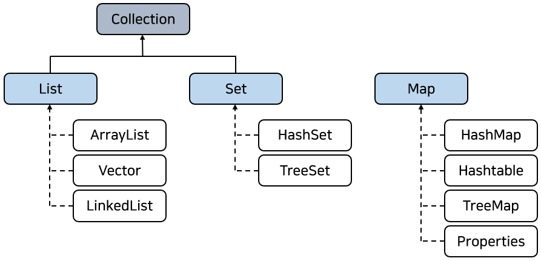
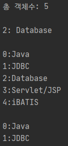
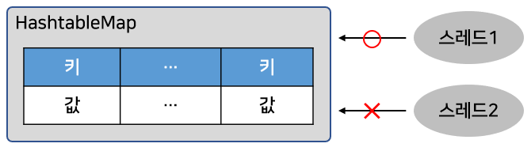

# 컬렉션 프레임워크

## 컬렉션 프레임워크란

- 애플리케이션 개발시 다수의 객체를 저장해 필요할 때마다 꺼내서 사용하는경우
  - ex) 10개의 Product 객체를 저장해 두고, 필요할 때마다 하나씩 꺼내서 이용할 때
  - 어떻게 Product 객체를 효율적으로 추가, 검색, 삭제?
    - 배열을 이용

```java
// 길이 10인 배열을 생성
Product[] array = new Product[10];
// 객체를 추가
array[0] = new Product("Model1");
array[1] = new Product("Model2");
// 객체 검색
Product model1 = array[0];
Product model1 = array[1];
// 객체 삭제
array[0] = null;
array[1] = null;
```

- 배열은 쉽게 생성하고 사용할 수 있다.
  - 하지만 저장할 수 있는 객체 수가 배열을 생성할 때 결정되기 때문에 불특정 다수 객체를 저장하기엔 문제가 있다.
  - 객체를 삭제했을 때 해당 인덱스가 비게되어서 새로운 객체를 저장하려면 어디가 비어 있는지 확인하는 코드도 필요하다.
- 자바는 위와같은 배열의 문제점을 해결하기위해
  - 널리 알려져 있는 자료구조(Data Structure)를 바탕으로 객체들을 효율적으로 추가, 삭제, 검색할 수 있도록하였다.
    - java.util 패키지에 컬렉션과 관련된 인터페이스와 클래스들을 포함시켜 놓았다.
    - 이들을 총칭해서 컬렉션 프레임워크(Collection Framework)라고 한다.
- 컬렉션(Collection)이란
  - 사전적 의미로 요소를 수집해서 저장하는 것
    - 자바 컬렉션은 객체를 수집해서 저장하는 역할을 한다.
- 프레임워크(Framework)란
  - 사용 방법을 미리 정해 놓은 라이브러리를 말한다.
- 자바 컬렉션 프레임워크는 몇 가지 인터페이스를 통해 다양한 컬렉션 클래스를 이용할 수 있도록 하고 있다.
- 컬렉션 프레임워크의 주요 인터페이스
  - List, Set, Map
    - 컬렉션을 사용하는 방법을 정의한 것이다.
    - 그림은 이 3가지 인터페이스로 사용 가능한 컬렉션 클래스



- ArrayList, Vector, LinkedList는 List 인터페이스를 구현한 클래스
  - List 인터페이스로 사용 가능한 컬렉션
- HashSet, TreeSet은 Set 인터페이스를 구현한 클래스
  - Set 인터페이스로 사용 가능한 컬렉션
- HashMap, Hashtable, TreeMap, Properties는 Map 인터페이스를 구현한 클래스
  - Map 인터페이스로 사용 가능한 컬렉션
- List와 Set은 객체를 추가, 삭제, 검색하는 방법에 많은 공통점이 있다.
  - 그렇기 때문에 이 인터페이스들의 공통된 메소드들만 모아 Collection 인터페이스로 정의해 두고 있다.
- Map은 키와 값을 하나씩 쌍으로 묶어서 관리하는 구조이다.
  - List 및 Set 과는 사용 방법이 완전히 다르다.


## List 컬렉션

- List 컬렉션
  - 객체를 일렬로 늘어놓은 구조
  - 객체를 인덱스로 관리하기 때문에 객체를 저장하면 자동 인덱스가 부여되고 인덱스로 객체를 검색, 삭제할 수 있는 기능을 제공
  - 객체 자체를 저장하는 것이 아니라 객체의 번지를 참조한다.
  - 동일한 객체를 중복 저장할 수 있는데, 이 경우 동일한 번지가 참조된다.
  - null도 저장이 가능하지만 이 경우엔 해당 인덱스는 객체를 참조하지 않는다.


- List 컬렉션에는 ArrayList, Vector, LinkedList 등이 있다.
  - List 컬렉션에서 공통적으로 사용 가능한 List 인터페이스의 메소드들
  - 인덱스로 객체를 관리하기 때문에 인덱스로 매개값으로 갖는 메소드가 많다.


- 리턴타입에 E라는 타입 파라미터는 List 인터페이스가 제네릭 타입이기 때문이다.
  - 구체적인 타입은 구현 객체를 생성할 때 결정된다.
- 객체 추가는 add() 메소드를 사용하고, 객체를 찾아올 때에는 get() 메소드를 사용한다.
- 객체 삭제는 remove() 메소드를 사용한다.

```java
// List 컬렉션에 저장되는 구체적 타입을 String으로 정해놓고,
// 추가, 삽입, 찾기 그리고 삭제하는 방법
List<String> list = ...;
list.add("홍길동");		// 맨끝에 객체 추가
list.add(1, "김승빈");		// 지정된 인덱스에 객체 삽입
String str = list.get(1); // 인덱스로 객체 찾기
list.remove(0);			  // 인덱스로 객체 삭제
list.remove("김승빈");		// 객체 삭제
```

- 만약 전체 객체를 대상으로 하나씩 반복해서 저장된 객체를 얻고 싶다면?

```java
List<String> list = ...;
for (int i = 0; i < list.size(); i++) {	// 저장된 총 객체 수만큼 반복
    String str = list.get(i);
}
```

- 인덱스 번호가 필요 없다면 향상된 for문을 이용하는 것이 더 편리하다.

```java
for (String str : list) { // 저장된 총 객체 수만큼 반복
}
```

### ArrayList

- ArrayList는 List 인터페이스의 구현 클래스로, ArrayList에 객체를 추가하면 객체가 인덱스로 관리된다.
  - 일반 배열과 ArrayList는 인덱스로 객체를 관리한다는 점에서 유사
- 큰 차이점
  - 배열은 생성할 때 크기가 고정되고 사용 중에 크기를 변경할 수 없지만,  
    ArrayList는 저장 용량(capacity)을 초과한 객체들이 들어오면 자동적으로 저장 용량이 늘어난다.
  - ArrayList 객체의 내부 구조


- ArrayList를 생성하기 위해서는 저장할 객체 타입을 타입 파라미터로 표기하고 기본 생성자를 호출하면 된다.

```java
// String을 저장하는 ArrayList생성
List<String> list = new ArrayList<String>();
```

- 기본 생성자로 ArrayList 객체를 생성하면 내부에 10개의 객체를 저장할 수 있는 초기 용량(capacity)을 가지게 된다.
- 저장되는 객체 수가 늘어난다면?
  - 용량이 자동적으로 증가한다.
- 처음부터 용량을 크게 잡고 싶다면?
  - 용량의 크기를 매개값으로 받는 생성자를 이용하면 된다.

```java
List<String> list = new ArrayList<String>(30); // String 객체 30개를 저장할 수 있는 용량을 가진다.
```

- 자바 4 이전까지는 타입 파라미터가 없었다.
  - 그렇기 때문에 `List list = new ArrayList();` 처럼 객체를 생성하였다.
    - 위처럼 생성된 ArrayList는 모든 종류의 객체를 저장할 수 있다.
      - 객체가 저장될 때 Object 타입으로 변환되어 저장되기 때문
    - 모든 종류의 객체를 저장할 수 있다는 장점이 있다.
      - 하지만 저장할 때 Object로 변환하고, 찾아올 때 원래 타입으로 변환해야 하므로 실행 성능에 안좋은 영향을 미친다.
- 일반적으로 컬렉션에는 단일 종류의 객체들만 저장된다.
  - 자바 5부터 제네릭을 도입하여 ArrayList 객체를 생성할 때 타입 파라미터로 저장할 객체의 타입을 지정한다.
    - 불필요한 타입 변환을 하지 않게 되었다.
- 자바 4 이전과 자바 5 이후의 차이점

```java
// 자바 4 이전
List list = new ArrayList();				// 컬렉션 생성
list.add("홍길동");				 		  // 컬렉션에 객체를 추가
Object obj = list.get(0);					// 컬렉션에서 객체 검색
String name = (String) obj;					// 타입 변환 후 홍길동을 얻을 수 있다.

// 자바 5 이후
List<String> list = new ArrayList<String>(); // 컬렉션 생성
list.add("홍길동");						   // 컬렉션에 객체를 추가
String name = list.get(0);					 // 컬렉션에서 객체를 검색, 홍길동을 바로 얻을 수 있다.
```

- ArrayList에 객체를 추가하면 인덱스 0부터 차례대로 저장된다.
  - ArrayList에서 특정 인덱스의 객체를 제거하면 바로 뒤 인덱스부터 마지막 인덱스까지 모두 앞으로 1씩 당겨진다.
  - 특정 인덱스에 객체를 삽입하면 해당 인덱스부터 마지막 인덱스까지 모두 1씩 밀려난다.
- 따라서 빈번한 객체 삭제와 삽입이 일어나는 곳에서는 ArrayList를 사용하는 것이 바람직하지 않다.
  - LinkedList를 사용하는 것이 좋다.
- 인덱스 검색이나, 맨 마지막에 객체를 추가하는 경우에는 ArrayList가 더 좋은 성능을 발휘한다.

```java
// ArrayList에 String 객체를 추가, 검색, 삭제하는 예제

import java.util.ArrayList;
import java.util.List;

public class ArrayListExample {

  public static void main(String[] args) {
    List<String> list = new ArrayList<>();

    // String 객체 저장
    list.add("Java");
    list.add("JDBC");
    list.add("Servlet/JSP");
    list.add(2, "Database");
    list.add("iBATIS");

    int size = list.size(); // 저장된 총 객체 수 얻기
    System.out.println("총 객체수: " + size);
    System.out.println();

    String skill = list.get(2); // 2번 인덱스의 객체 얻기
    System.out.println("2: " + skill);
    System.out.println();

    for (int i = 0; i < list.size(); i++) {
      String str = list.get(i);
      System.out.println(i + ":" + str);
    }
    System.out.println();

    list.remove(2); // 2번 인덱스 객체(Database) 삭제
    list.remove(2); // 2번 인덱스 객체(Servlet/JSP) 삭제
    list.remove("iBATIS");

    for (int i = 0; i < list.size(); i++) {
      String str = list.get(i);
      System.out.println(i + ":" + str);
    }
  }

}
```



- ArrayList를 생성하고 런타임 시 필요에 의해 객체들을 추가하는 것이 일반적이다.
  - 그런데 고정된 객체들로구성된 List를 생성할 때도 있다.
  - 이런 경우 Arrays.asList(T... a) 메소드를 사용하는 것이 간편하다.

```java
List<T> list = Arrays.asList(T... a);
```

- T 타입 파라미터에 맞게 asList()의 매개값을 순차적으로 입력하거나, T[] 배열을 매개값으로 주면된다.

```java
// 고정된 String 객체를 요소로 갖는 ArrayList 객체를 생성하는 예제
import java.util.Arrays;
import java.util.List;

public class ArraysAsListExample {

  public static void main(String[] args) {
    List<String> list1 = Arrays.asList("홍길동", "김승빈", "김자바");
    for (String name : list1) {
      System.out.println(name);
    }

    List<Integer> list2 = Arrays.asList(1, 2, 3);
    for (int value : list2) {
      System.out.println(value);
    }
  }

}
```


### Vector

- Vector
  - ArrayList와 동일한 내부 구조를 가지고 있다.
  - Vector를 생성하기 위해서는 저장할 객체 타입을 타입 파라미터로 표기하고 기본 생성자를 호출하면 된다.

```java
List<E> list = new Vector<E>();
```

- ArrayList와 다른 점
  - Vector는 동기화된(synchronized) 메소드로 구성되어 있기 때문에 멀티 스레드가 동시에 이 메소드들을 실행할 수 없다.
    - 하나의 스레드가 실행을 완료해야만 다른 스레드가 실행할 수 있다.
    - 멀티 스레드 환경에서 안전하게 객체를 추가, 삭제할 수 있다.
      - 이것을 스레드가 안전(Thread Safe)하다라고 한다.


```java
// Vector를 이용해서 Board 객체를 추가, 삭제, 검색하는 예제
import java.util.List;
import java.util.Vector;

public class VectorExample {

  public static void main(String[] args) {
    List<Board> list = new Vector<>();

    list.add(new Board("제목1", "내용1", "글쓴이1"));
    list.add(new Board("제목2", "내용2", "글쓴이2"));
    list.add(new Board("제목3", "내용3", "글쓴이3"));
    list.add(new Board("제목4", "내용4", "글쓴이4"));
    list.add(new Board("제목5", "내용5", "글쓴이5"));

    list.remove(2);
    list.remove(3);

    for (int i = 0; i < list.size(); i++) {
      Board board = list.get(i);
      System.out.println(board.subject + "\t" + board.content + "\t" + board.writer);
    }
  }

}
```

```java
// Board 클래스
public class Board {

  String subject;
  String content;
  String writer;

  public Board(String subject, String content, String writer) {
    this.subject = subject;
    this.content = content;
    this.writer = writer;
  }

}
```


### LinkedList

- LinkedList는 List 구현 클래스이므로 ArrayList와 사용 방법은 똑같지만 내부 구조는 완전히 다르다.
  - ArrayList는 내부 배열에 객체를 저장해서 인덱스로 관리하지만, LinkedList는 인접 참조를 링크해서 체인처럼 관리한다.


- LinkedList에서 특정 인덱스의 객체를 제거하면 앞뒤 링크만 제거하면 앞뒤 링크만 변경되고 나머지 링크는 변경되지 않는다.
  - 특정 인덱스의 객체를 삽입할 때에도 마찬가지
  - 빈번한 객체 삭제와 삽입이 일어나는 곳에서는 ArrayList보다 LinkedList가 좋은 성능을 발휘한다.
- LinkedList를 생성하기 위해서는 저장할 객체 타입을 타입 파라미터(E)에 표기하고 기본 생성자를 호출하면 된다.
  - LinkedList가 처음 생성될 때에는 어떠한 링크도 만들어지지 않기 때문에 내부는 비어 있다고 보면 된다.

```java
List<E> list = new LinkedList<E>();
```

```java
// ArrayList와 LinkedList에 10000개의 객체를 삽입하는데 걸린 시간을 측정한 예제
import java.util.ArrayList;
import java.util.LinkedList;
import java.util.List;

public class LinkedListExample {

  public static void main(String[] args) {
    List<String> list1 = new ArrayList<>();
    List<String> list2 = new LinkedList<>();

    long startTime;
    long endTime;

    startTime = System.nanoTime();
    for (int i = 0; i < 10000; i++) {
      list1.add(0, String.valueOf(i));
    }
    endTime = System.nanoTime();
    System.out.println("ArrayList 걸린시간: " + (endTime - startTime) + " ns");

    startTime = System.nanoTime();
    for (int i = 0; i < 10000; i++) {
      list2.add(0, String.valueOf(i));
    }
    endTime = System.nanoTime();
    System.out.println("LinkedList 걸린시간: " + (endTime - startTime) + " ns");
  }

}
```


- 끝에서부터 추가/삭제하는 경우 ArrayList가 더 빠르지만, 중간에 추가 또는 삭제할 경우 앞뒤 링크 정보만 변경하면 되는 LinkedList가 더 빠르다.
  - ArrayList는 뒤쪽 인덱스들을 모두 1씩 증가 또는 감소시키는 시간이 필요해 처리 속도가 느리다.

| 구분       | 순차적으로 추가/삭제 | 중간에 추가/삭제 | 검색   |
| ---------- | -------------------- | ---------------- | ------ |
| ArrayList  | 빠르다               | 느리다           | 빠르다 |
| LinkedList | 느리다               | 빠르다           | 느리다 |

## Set 컬렉션

- List 컬렉션은 저장 순서를 유지하지만, Set 컬렉션은 저장 순서가 유지되지 않는다.
  - 또한 객체를 중복해서 저장할 수 없고, 하나의 null만 저장할 수 있다.
  - Set 컬렉션은 수학의 집합에 비유될 수 있다.
    - 집합은 순서와 상관없고 중복이 허용되지 않기 때문
    - 구슬 주머니와도 같다.


- Set 컬렉션에는 HashSet, LinkedHashSet, TreeSet 등이 있다.
- Set 컬렉션에서 공통적으로 사용 가능한 Set 인터페이스의 메소드들
  - 인덱스로 관리하지 않기 때문에 인덱스를 매개값으로 갖는 메소드가 없다.


- E라는 타입 파라미터는 Set 인터페이스가 제네릭 타입이기 때문
  - 구체적인 타입은 구현 객체를 생성할 때 결정된다.

```java
// Set 컬렉션에 저장되는 구체적인 타입을 String 으로 정해놓고, String 객체를 저장하고 삭제하는 방법
Set<String> set = ...;
set.add("홍길동");		// 객체 추가
set.add("김승빈");
set.remove("홍길동");	// 객체 삭제
```

- Set 컬렉션은 인덱스로 객체를 검색해서 가져오는 메소드가 없다.
  - 대신 전체 객체를 대상으로 한번씩 반복해서 가져오는 반복자(Iterator)를 제공
  - 반복자는 iterator 인터페이스를 구현한 객체, iterator() 메소드를 호출하면 얻을 수 있다.

```java
Set<String> set = ...;
Iterator<String> iterator = set.iterator();
```

- Iterator 인터페이스에 선언된 메소드들


- Iterator에서 하나의 객체를 가져올 때는 next() 메소드를 사용
  - next() 메소드를 사용하기 전에 먼저 가져올 객체가 있는지 확인하는 것이 좋다.
- hasNext() 메소드는 가져올 객체가 있으면 true를 리턴하고 더 이상 가져올 객체가 없으면 false를 리턴
  - true가 리턴될 때 next() 메소드를 사용해야 한다.

```java
// Set 컬렉션에서 String 객체들을 반복해서 하나씩 가져오는 코드
Set<String> set = ...;
Iterator<String> iterator = set.iterator();
while(iterator.hasNext()) {		// 저장된 객체 수만큼 반복
    // String 객체 하나를 가져옴
    String str = iterator.next();
}
```

- Iterator를 사용하지 않더라도 향상된 for문을 이용해 전체 객체를 대상으로 반복할 수 있다.

```java
Set<String> set = ...;
for (String str : set) {
}
```

- Set 컬렉션에서 Iterator의 next() 메소드로 가져온 객체를 제거하고 싶다면?
  - remove() 메소드를 호출
  - Iterator의 메소드이지만, 실제 Set 컬렉션에서 객체가 제거된다.

```java
// Set 컬렉션에서 "홍길동"을 제거
while(iterator.hasNext()) {
    String str = iterator.next();
    if (str.equals("홍길동")) {
        iterator.remove();
    }
}
```

### HashSet

- HashSet은 Set 인터페이스의 구현 클래스이다.
  - HashSet을 생성하기 위해서는 기본 생성자를 호출하면 된다.

```java
Set<E> set = new HashSet<E>();
```

- 타입 파라미터 E에는 컬렉션에 저장할 객체 타입을 지정하면 된다.

```java
// String 객체를 저장하는 HashSet 생성
Set<String> set = new HashSet<String>();
```

- HashSet은 객체들을 순서 없이 저장하고 동일한 객체는 중복 저장하지 않는다.
  - HashSet이 판단하는 동일한 객체란 같은 인스턴스를 뜻하지는 않는다.
  - HashSet은 객체를 저장하기 전, 먼저 객체의 hashCode() 메소드를 호출해서 해시코드를 얻어낸다.
    - 이미 저장되어 있는 객체들의 해시코드와 비교해서 동일한 해시코드가 있다면 다시 eqauls() 메소드로 두 객체를 비교한다.
    - true가 나오면 동일한 객체로 판단하고 중복 저장을 하지 않는다.


- 문자열을 HashSet에 저장할 경우, 같은 문자열을 갖는 String 객체는 동등한 객체로 간주되고 다른 문자열을 갖는 String 객체는 다른 객체로 간주된다.
  - String 클래스가 hashCode()와 eqauls() 메소드를 재정의해서  
    같은 문자열일 경우 hashCode()의 리턴값을 같게, equals()의 리턴값은 true가 나오도록 했기 때문이다.

```java
// HashSet에 String 객체를 추가, 검색, 제거하는 방법 예제
import java.util.HashSet;
import java.util.Iterator;
import java.util.Set;

import java.util.HashSet;
import java.util.Iterator;
import java.util.Set;

public class HashSetExample {

  public static void main(String[] args) {
    Set<String> set = new HashSet<>();

    set.add("Java");
    set.add("JDBC");
    set.add("Servlet/JSP");
    set.add("Java");
    set.add("iBATIS");
    // "Java"는 한 번만 저장된다.

    int size = set.size();
    System.out.println("총 객체수: " + size);

    Iterator<String> iterator = set.iterator(); // 반복자 얻기
    while (iterator.hasNext()) { // 객체 수만큼 반복
      String element = iterator.next();
      System.out.println("\t" + element);
    }

    set.remove("JDBC");
    set.remove("iBATIS");

    System.out.println(" 총 객체수: " + set.size());

    iterator = set.iterator();
    while (iterator.hasNext()) {
      String element = iterator.next();
      System.out.println("\t" + element);
    }
    
    set.clear(); // 모든 객체를 제거하고 비운다.
    if (set.isEmpty()) {
      System.out.println("비어 있음");
    }
  }

}
```


```java
// 사용자 정의 클래스인 Member를 만들고 hashCode()와 equals() 메소드를 오버라이딩 한 예제
// 인스턴스가 달라도 이름과 나이가 동일하다면 동일한 객체로 간주하여 중복 저장되지 않도록 하기 위함
public class Member {

  public String name;
  public int age;

  public Member(String name, int age) {
    this.age = age;
    this.name = name;
  }

  @Override
  public int hashCode() { // name과 age 값이 같으면 동일한 hashCode가 리턴
    return name.hashCode() + age;
  }

  @Override
  public boolean equals(Object obj) { // name과 age 값이 같으면 true를 리턴
    if (obj instanceof Member) {
      Member member = (Member) obj;
      return member.name.equals(this.name) && (member.age == this.age);
    } else {
      return false;
    }
  }
  
}
```

```java
// 실행 클래스
import java.util.HashSet;
import java.util.Set;

public class HashSetExample2 {

  public static void main(String[] args) {
    Set<Member> set = new HashSet<>();

    // 인스턴스는 다르지만 내부 데이터가 동일하므로 객체 1개만 저장됨
    set.add(new Member("홍길동", 30));
    set.add(new Member("홍길동", 30));

    System.out.println("총 객체수 : " + set.size());
  }

}
```


## Map 컬렉션

- Map 컬렉션은 키(key)와 값(value)으로 구성된 Entry 객체를 저장하는 구조를 가지고 있다.
  - 키와 값은 모두 객체이다.
- 키는 중복 저장될 수 없지만 값은 중복 저장될 수 있다.
  - 만약 기존에 저장된 키와 동일한 키로 값을 저장하면 기존의 값은 없어지고 새로운 값으로 대치된다.


- Map 컬렉션에는 HashMap, Hashtable, LinkedHashMap, Properties, TreeMap 등이 있다.
- Map 컬렉션에서 공통적으로 사용 가능한 Map 인터페이스의 메소드들
  - 키로 객체들을 관리하기 때문에 키를 매개값으로 갖는 메소드가 많다.


- 메소드의 매개 변수 타입과 리턴 타입에 K와 V라는 타입 파라미터는 Map 인터페이스가 제네릭 타입이기 때문이다.
  - 구체적인 타입은 구현 객체를 생성할 때 결정된다.

```java
// 객체 추가. 찾기, 삭제
Map<String, Integer> map = ~;
map.put("홍길동", 30);			// 객체 추가
int score = map.get("홍길동"); // 객체 찾기
map.remove("홍길동");			// 객체 삭제
```

- 키를 알고 있다면 get() 메소드로 간단하게 객체를 찾아오면 된다.
  - 저장된 전체 객체를 대상으로 하나씩 얻고 싶을 경우에는?
    - 1. keySet() 메소드로 모든 키를 Set 컬렉션으로 얻은 다음, 반복자를 통해 키를 하나씩 얻고 get() 메소드를 통해 값을 얻으면 된다.
      2. entrySet() 메소드로 모든 Map.Entry를 Set 컬렉션으로 얻은 다음, 반복자를 통해 Map.Entry를 하나씩 얻고 getKey()와 getValue() 메소드 이용

```java
// 1
Map<K, V> map = ~;
Set<K> keySet = map.keySet();
Iterator<K> keyIterator = keySet.iterator();
while(keyIterator.hasNext()) {
    K key = keyIterator.next();
    V value = map.get(key);
}

// 2
Set<Map.Entry<K, V>> entrySet = map.entrySet();
Iterator<Map.Entry<K, V>> entryIterator = entrySet.iterator();
while(entryIterator.hasNext()) {
    Map.Entry<K, V> entry = entryIterator.next();
    K key = entry.getKey();
    V value = entry.getValue();
}
```

### HashMap

- HashMap은 Map 인터페이스를 구현한 대표적인 Map 컬렉션이다.
- HashMap의 키로 사용할 객체는 hashCode()와 equals() 메소드를 재정의해서 동등 객체가 될 조건을 정해야 한다.
  - 동등 객체(동일한 키가 될)조건은 hashCode()의 리턴값이 같아야 하고, equals() 메소드가 true를 리턴해야 한다.


- 주로 키 타입은 String을 많이 사용한다.
  - String은 문자열이 같을 경우 동등 객체가 될 수 있도록 hashCode()와 equals() 메소드가 재정의되어 있다.
- HashMap 을 생성하기 위해서는 키 타입과 값 타입을 파라미터로 주고 기본 생성자를 호출하면 된다.

```java
Map<K, V> map = new HashMap<K, V>();
```

- 키와 값의 타입은 기본 타입(byte, short, int, float, double, boolean, char)을 사용할 수 없다.
  - 클래스 및 인터페이스 타입만 가능하다.

```java
// 키로 String 타입을 사용하고 값으로 Integer 타입을 사용하는 HashMap 생성
Map<String, Integer> map = new HashMap<String, Integer>();
```

- 이름을 키로, 점수를 값으로 저장하는 HashMap 사용방법 예제

```java
import java.util.HashMap;
import java.util.Iterator;
import java.util.Map;
import java.util.Set;

public class HashMapExample1 {

  public static void main(String[] args) {
    // Map 컬렉션 생성
    Map<String, Integer> map = new HashMap<>();

    // 객체 저장
    map.put("김승빈", 85);
    map.put("홍길동", 90);
    map.put("박혜원", 80);
    // 기존 "홍길동"키가 같기 때문에 제일 마지막에 저장한 값으로 대치
    map.put("홍길동", 95);
    System.out.println("총 Entry 수: " + map.size());

    // 객체 찾기
    System.out.println("\t홍길동 : " + map.get("홍길동"));
    System.out.println();
    
    // 객체를 하나씩 처리
    Set<String> keySet = map.keySet(); // key Set 얻기
    Iterator<String> keyIterator = keySet.iterator();
    while (keyIterator.hasNext()) {
      String key = keyIterator.next();
      Integer value = map.get(key);
      System.out.println("\t" + key + " : " + value);
    }
    System.out.println();

    // 객체 삭제
    map.remove("홍길동"); // 키로 Map.Entry 제거
    System.out.println("총 Entry 수: " + map.size());

    // 객체를 하나씩 처리
    Set<Map.Entry<String, Integer>> entrySet = map.entrySet(); // Map.Entry Set 얻기
    Iterator<Map.Entry<String, Integer>> entryIterator = entrySet.iterator();

    while (entryIterator.hasNext()) {
      Map.Entry<String, Integer> entry = entryIterator.next();
      String key = entry.getKey();
      Integer value = entry.getValue();
      System.out.println("\t" + key + " : " + value);
    }
    System.out.println();

    // 객체 전체 삭제
    map.clear(); // 모든 Map.Entry 삭제
    System.out.println("총 Entry 수: " + map.size());
 }
 
}
```


```java
// 사용자 정의 객체인 Student를 키로하고 점수를 저장하는 HashMap 사용 방법 예제
// 학번과 이름이 동일한 Student를 동등 키로 간주하기 위해 Student 클래스에는 hashCode()와 equals() 메소드 재정의
public class Student {

  public int sno;
  public String name;

  public Student(int sno, String name) {
    this.sno = sno;
    this.name = name;
  }

  @Override
  public int hashCode() {
    return sno + name.hashCode();
  }

  @Override
  public boolean equals(Object obj) {
    if (obj instanceof Student) {
      Student student = (Student) obj;
      return (this.sno == student.sno) && (this.name.equals(student.name));
    } else {
      return false;
    }
  }
  
}
```

```java
// 실행 클래스
import java.util.HashMap;
import java.util.Map;

public class HashMapExample2 {

  public static void main(String[] args) {
    Map<Student, Integer> map = new HashMap<>();

    // 학번과 이름이 동일한 Student를 키로 저장
    map.put(new Student(1, "홍길동"), 95);
    map.put(new Student(1, "홍길동"), 95);

    System.out.println("총 Entry 수: " + map.size());
  }

}
```


### Hashtable

- Hashtable은 HashMap과 동일한 내부 구조를 가지고 있다.
  - Hashtable도 키로 사용할 객체는 hashCode()와 equals() 메소드를 재정의해서 동등 객체가 될 조건을 정해야 한다.
- HashMap과의 차이점
  - Hashtable은 동기화된(synchronized) 메소드로 구성되어 있기 때문에 멀티 스레드가 동시에 이 메소드들을 실행할 수 없다.
    - 하나의 스레드가 실행을 완료해야만 다른 스레드를 실행할 수 있다.
    - 멀티 스레드 환경에서 안전하게 객체를 추가, 삭제할 수 있다.
    - 이것을 스레드가 안전(thread safe)하다라고 말한다



- Hashtable의 생성 방법은 HashMap과 크게 다르지 않다.
  - 키 타입과 값 타입을 지정하고 기본 생성자를 호출하면 된다.

```java
Map<K, V> map = new Hashtable<K, V>();
```

```java
// 키로 String 타입을 사용하고, 값으로 Integer 타입을 사용하는 Hashtable 생성
Map<String, Integer> map = new Hashtable<String, Integer>();
```

- 키보드로 아이디와 비밀번호를 입력받아 Hashtable에 저장되어 있는 키(아이디)와 값(비밀번호)으로 비교한 후 로그인 여부를 출력하는 예제

```java
import java.util.Hashtable;
import java.util.Map;
import java.util.Scanner;

public class HashtableExample {

  public static void main(String[] args) {
    Map<String, String> map = new Hashtable<>();

    map.put("spring", "12");
    map.put("summer", "123");
    map.put("fall", "1234");
    map.put("winter", "12345");

    Scanner scanner = new Scanner(System.in);

    while (true) {
      System.out.println("아이디와 비밀번호를 입력해주세요");
      System.out.print("아이디: ");
      String id = scanner.nextLine();

      System.out.print("비밀번호: ");
      String password = scanner.nextLine();
      System.out.println();

      if (map.containsKey(id)) {
        if (map.get(id).equals(password)) {
          System.out.println("로그인 되었습니다.");
          break;
        } else {
          System.out.println("비밀번호가 일치하지 않습니다.");
        }
      } else {
        System.out.println("입력하신 아이디가 존재하지 않습니다.");
      }
    }
  }

}
```


### Properties

- Properties는 Hashtable의 하위 클래스이기 때문에 Hashtable의 모든 특징을 그대로 가지고 있다.
  - 차이점
    - Hashtable은 키와 값을 다양한 타입으로 지정이 가능한데 비해 Properties는 키와 값을 String 타입으로 제한한 컬렉션이다.
    - Properties는 애플리케이션의 옵션 정보, 데이터베이스 연결 정보  
      그리고 국제화(다국어) 정보가 저장된 프로퍼티(~.properties) 파일을 읽을 때 주로 사용한다.
- 프로퍼티 파일은 키와 값이 = 기호로 연결되어 있는 텍스트 파일로 ISO 8859-1 문자셋으로 저장된다.
  - 이 문자셋으로 직접 표현할 수 없는 한글은 유니코드(Unicode)로 변환되어 저장된다.
  - ex) contry와 language 키로 각각 "대한민국", "한글"을 입력하면 자동으로 유니코드로 변환되어 저장된다.

```java
contry=대한민국		=>		contry=\uB300\uD55C\uBBFC\uAD6D
language=한글				 language=\uD55C\uAE00
```

- 데이터베이스 연결 정보가 있는 프로퍼티 파일의 내용을 보여주는 예

```java
// database.properties
// driver, url, username, password는 키가 되고 그 뒤의 문자열은 값
driver=oracle.jdbc.OracleDriver
url=jdbc:oracle:thin:@localhost:1521:orcl
username=scott
password=tiger
```

- 프로퍼티 파일을 읽기 위해서는 properties 객체를 생성하고, load() 메소드를 호출하면 된다.
- load() 메소드는 프로퍼티 파일로부터 데이터를 읽기 위해 FileReader 객체를 매개값으로 받는다.

```java
Properties properties = new Properties();
properties.load(new FileReader("C:/~/database.properties")); // 프로퍼티 파일 경로
```

- 프로퍼티 파일은 일반적으로 클래스 파일(~.class)과 함께 저장된다.
- 클래스 파일을 기준으로 상대 경로를 이용해서 프로퍼티 파일의 경로를 얻으려면?
  - Class의 getResource() 메소드를 이용
  - getResource()는 주어진 파일의 상대 경로를 URL 객체로 리턴하는데, URL의 getPath()는 파일의 절대 경로를 리턴

```java
// 클래스 파일과 동일한 위치에 있는 "database.properties" 파일을 읽고 Properties 객체를 생성하는 코드
String path = 클래스.class.getResource("database.properties").getPath();
path = URLDecoder.decode(path, "utf=8"); // 경로에 한글이 있을 경우 한글을 복원
Properties properties = new Properties();
properties.load(new FileReader(path));
```

- 만약 다른 패키지에 프로퍼티 파일이 있을 경우 경로 구분자로 "/" 를 사용한다.
  - ex) A.class가 com.mycompany 패키지에 있고, database.properties 파일이 com.mycompany.config 패키지에 있을 경우  
    `String Path = A.class.getResource("config/database.properties").getPath();`
- Properties 객체에서 해당 키의 값을 읽으려면 getProperty() 메소드를 사용한다.
  - Properties도 Map 컬렉션이므로 get() 메소드로 값을 얻을 수 있으나 get() 메소드는 값을 Object 타입으로 리턴한다.
    - 강제 타입 변환해서 String을 얻어야 하기 때문에 일반적으로 getProperty() 메소드를 사용한다.

```java
String value = properties.getProperty("key");
```

- database.properties 파일로부터 값을 읽어 출력하는 예제

```java
import java.io.FileReader;
import java.net.URLDecoder;
import java.util.Properties;

public class PropertiesExample {

  public static void main(String[] args) throws Exception {
    Properties properties = new Properties();
    String path = PropertiesExample.class.getResource("database.properties").getPath();
    path = URLDecoder.decode(path, "utf-8");
    properties.load(new FileReader(path));

    String driver = properties.getProperty("driver");
    String url = properties.getProperty("url");
    String username = properties.getProperty("username");
    String password = properties.getProperty("password");

    System.out.println("driver : " + driver);
    System.out.println("url : " + url);
    System.out.println("username : " + username);
    System.out.println("password : " + password);
  }

}
```


## 검색 기능을 강화시킨 컬렉션

- 컬렉션 프레임워크는 검색 기능을 강화시킨 TreeSet과 TreeMap을 제공하고 있다.
  - TreeSet은 Set 컬렉션
  - TreeMap은 Map 컬렉션
  - 이 컬렉션들은 이진 트리(binary tree)를 이용해서 계층적 구조(Tree 구조)를 가지면서 객체를 저장한다.

### TreeSet

- TreeSet은 이진 트리(binary tree)를 기반으로한 Set 컬렉션이다.
  - 하나의 노드는 노드값인 value와 왼쪽과 오른쪽 자식 노드를 참조하기 위한 두 개의 변수로 구성된다.
- TreeSet에 객체를 저장하면 자동으로 정렬되는데 부모값과 비교해서 낮은 것은 왼쪽 자식 노드에, 높은 것은 오른쪽 자식 노드에 저장한다.


- TreeSet을 생성하기 위해서는 저장할 객체 타입을 파라미터로 표기하고 기본 생성자를 호출하면 된다.

```java
TreeSet<E> treeSet = new TreeSet<E>();
```

- String 객체를 저장하는 TreeSet 생성

```java
TreeSet<String> treeSet = new TreeSet<String>();
```

- Set 인터페이스 타입 변수에 대입해도 되지만 TreeSet 클래스 타입으로 대입한 이유
  - 객체를 찾거나 범위 검색과 관련된 메소드를 사용하기 위해서이다.
- TreeSet이 가지고 있는 검색 관련 메소드들


- 점수를 무작위로 저장하고 특정 점수를 찾는 예제

```java
// 특정 객체 찾기
public class TreeSetExample1 {

  public static void main(String[] args) {
    TreeSet<Integer> scores = new TreeSet<>();
    scores.add(new Integer(87));
    scores.add(new Integer(98));
    scores.add(new Integer(75));
    scores.add(new Integer(95));
    scores.add(new Integer(80));

    Integer score = null;

    score = scores.first();
    System.out.println("가장 낮은 점수: " + score);

    score = scores.last();
    System.out.println("가장 높은 점수: " + score + "\n");

    score = scores.lower(new Integer(95));
    System.out.println("95점 아래 점수: " + score);

    score = scores.higher(new Integer(95));
    System.out.println("95점 위의 점수: " + score);

    score = scores.floor(new Integer(95));
    System.out.println("95점 이거나 바로 아래 점수: " + score);

    score = scores.ceiling(new Integer(85));
    System.out.println("85점 이거나 바로 위의 점수: " + score + "\n");

    while (!scores.isEmpty()) {
      score = scores.pollFirst();
      System.out.println(score + "(남은 객체 수: " + scores.size() + ")");
    }
  }

}
```


- TreeSet이 가지고 있는 정렬과 관련된 메소드들


- `descendingIterator() ` 메소드는 내림차순으로 정렬된 Iterator 객체를 리턴한다.
- `descendingSet()`  메소드는 내림차순으로 정렬된 NavigableSet 객체를 리턴
  - NavigableSet은 TreeSet과 마찬가지로 first(), last(), lower(), higher(), floor(), ceiling() 메소드를 제공
  - 정렬 순서를 바꾸는 descendingSet() 메소드도 제공
  - 오름차순으로 정렬하고 싶다면?
    - descendingSet() 메소드를 두 번 호출하면 된다.

```java
NavigableSet<E> descendingSet = treeSet.descendingSet();
NavigableSet<E> ascendingSet = descendingSet.descendingSet();
```

- 객체 정렬하기 예제

```java
import java.util.NavigableSet;
import java.util.TreeSet;

public class TreeSetExample2 {

  public static void main(String[] args) {
    TreeSet<Integer> scores = new TreeSet<>();
    scores.add(new Integer(87));
    scores.add(new Integer(98));
    scores.add(new Integer(75));
    scores.add(new Integer(95));
    scores.add(new Integer(80));

    NavigableSet<Integer> descendingSet = scores.descendingSet();
    for (Integer score : descendingSet) {
      System.out.print(score + " ");
    }
    System.out.println();

    NavigableSet<Integer> ascendingSet = descendingSet.descendingSet();

    for (Integer score : ascendingSet) {
      System.out.print(score + " ");
    }
  }

}
```


- TreeSet이 가지고 있는 범위 검색과 관련된 메소드들


```java
// 영어 단어를 정렬하고, 범위 검색해보는 예제
import java.util.NavigableSet;
import java.util.TreeSet;

public class TreeSetExample3 {

  public static void main(String[] args) {
    TreeSet<String> treeSet = new TreeSet<>();
    treeSet.add("apple");
    treeSet.add("forever");
    treeSet.add("description");
    treeSet.add("ever");
    treeSet.add("zoo");
    treeSet.add("base");
    treeSet.add("guess");
    treeSet.add("cherry");

    System.out.println("[c~f 사이의 단어 검색]");
    NavigableSet<String> rangeSet = treeSet.subSet("c", true, "f", true);
    for (String word : rangeSet) {
      System.out.println(word);
    }
  }

}
```


### TreeMap

- TreeMap은 이진 트리를 기반으로 한 Map 컬렉션이다.
- TreeSet과의 차이점
  - 키와 값이 저장된 Map.Entry를 저장한다는 점
- TreeMap에 객체를 저장하면 자동으로 정렬되는데,  
  기본적으로 부모 키값과 비교해서 키 값이 낮은 것은 왼쪽 자식 노드에, 키 값이 높은 것은 오른쪽 자식 노드에 Map.Entry 객체를 저장한다.
- TreeMap을 생성하기 위해서는 키로 저장할 객체 타입과 값으로 저장할 객체 타입을 타입 파라미터로 주고 기본 생성자를 호출하면 된다.

```java
TreeMap<K, V> treeMap = new TreeMap<K, V>();
```

- 키로 String 타입을 사용하고 값으로 Integer 타입을 사용하는 TreeMap 생성

```java
TreeMap<String, Integer> treeMap = new TreeMap<String, Integer>();
```

- Map 인터페이스 타입 변수에 대입해도 되지만 TreeMap 클래스 타입으로 대입한 이유
  - 특정 객체를 찾거나 범위 검색과 관련된 메소드를 사용하기 위해서
- TreeMap이 가지고 있는 검색 관련 메소드들


- 점수를 키로, 이름을 값으로 해서 무작위로 저장하고 특정 Map.Entry를 찾는 예제

```java
import java.util.Map;
import java.util.TreeMap;

public class TreeMapExample1 {

  public static void main(String[] args) {
    TreeMap<Integer, String> scores = new TreeMap<>();
    scores.put(new Integer(87), "홍길동");
    scores.put(new Integer(98), "김승빈");
    scores.put(new Integer(75), "김자바");
    scores.put(new Integer(95), "박혜원");
    scores.put(new Integer(80), "박자바");

    Map.Entry<Integer, String> entry = null;

    entry = scores.firstEntry();
    System.out.println("가장 낮은 점수: " + entry.getKey() + "-" + entry.getValue());

    entry = scores.lastEntry();
    System.out.println("가장 높은 점수: " + entry.getKey() + "-" + entry.getValue() + "\n");

    entry = scores.lowerEntry(new Integer(95));
    System.out.println("95점 아래 점수: " + entry.getKey() + "-" + entry.getValue());

    entry = scores.higherEntry(new Integer(95));
    System.out.println("95점 위의 점수: " + entry.getKey() + "-" + entry.getValue() + "\n");

    entry = scores.floorEntry(new Integer(95));
    System.out.println("95점 이거나 바로 아래 점수: " +
        entry.getKey() + "-" + entry.getValue());

    entry = scores.floorEntry(new Integer(85));
    System.out.println("85점 이거나 바로 아래 점수: " +
        entry.getKey() + "-" + entry.getValue() + "\n");

    while (!scores.isEmpty()) {
      entry = scores.pollFirstEntry();
      System.out.println(entry.getKey() + "-" + entry.getValue() +
          "(남은 객체 수: " + scores.size() + ")");
    }
  }

}
```


- TreeMap이 가지고 있는 정렬과 관련된 메소드들


- descendingKeySet() 메소드는 내림차순으로 정렬된 키의 NavigableSet 객체를 리턴
  - 리턴된 NavigableSet 객체는 firstEntry(), lastEntry(), lowerEntry, higherEntry(), floorEntry(), ceilingEntry() 메소드를 제공
  - 오름차순과 내림차순을 번갈아가며 정렬 순서를 바꾸는 descendingMap() 메소드도 제공

```java
// 오름차순으로 정렬하고 싶다면 descendingMap() 메소드를 두 번 호출하면 된다.
NavigableMap<K, V> descendingMap = treeMap.descendingMap();
NavigableMap<K, V> ascendingMap = descendingMap.descendingMap();
```

- 객체 정렬 예제

```java
import java.util.Map;
import java.util.NavigableMap;
import java.util.Set;
import java.util.TreeMap;

public class TreeMapExample2 {

  public static void main(String[] args) {
    TreeMap<Integer, String> scores = new TreeMap<>();
    scores.put(new Integer(87), "홍길동");
    scores.put(new Integer(98), "김승빈");
    scores.put(new Integer(75), "김자바");
    scores.put(new Integer(95), "박혜원");
    scores.put(new Integer(80), "박자바");

    NavigableMap<Integer, String> descendingMap = scores.descendingMap();
    Set<Map.Entry<Integer, String>> descendingEntrySet = descendingMap.entrySet();
    for (Map.Entry<Integer, String> entry : descendingEntrySet) {
      System.out.print(entry.getKey() + "-" + entry.getValue() + " ");
    }
    System.out.println();

    NavigableMap<Integer, String> ascendingMap = descendingMap.descendingMap();
    Set<Map.Entry<Integer, String>> ascendingEntrySet = descendingMap.entrySet();
    for (Map.Entry<Integer, String> entry : descendingEntrySet) {
      System.out.print(entry.getKey() + "-" + entry.getValue() + " ");
    }
  }

}
```


- TreeMap이 가지고 있는 범위 검색과 관련된 메소드들


- subMap() 메소드는 네 개의 매개 변수가 있는데, 시작 키와 끝 키, 그리고 이 키들의 Map.Entry를 포함할지 여부의 boolean 값을 받는다.

```java
NavigableMap<K, V> subMap = treeMap.subMap(K fromKey, boolean fromInclusive,
                                          K toKey, boolean toInclusive);
```

- 영어 단어와 페이지 정보를 저장한 후 단어 검색을 하는 예제

```java
import java.util.Map;
import java.util.NavigableMap;
import java.util.TreeMap;

public class TreeMapExample3 {

  public static void main(String[] args) {
    TreeMap<String, Integer> treeMap = new TreeMap<String, Integer>();
    treeMap.put("apple", new Integer(10));
    treeMap.put("forever", new Integer(60));
    treeMap.put("description", new Integer(40));
    treeMap.put("ever", new Integer(50));
    treeMap.put("zoo", new Integer(10));
    treeMap.put("base", new Integer(20));
    treeMap.put("guess", new Integer(70));
    treeMap.put("cherry", new Integer(30));

    System.out.println("[c~f 사이의 단어 검색]");
    NavigableMap<String, Integer> rangeMap = treeMap.subMap("c", true, "f", true);
    for (Map.Entry<String, Integer> entry : rangeMap.entrySet()) {
      System.out.println(entry.getKey() + "-" + entry.getValue() + "페이지");
    }
  }

}
```


### Comparable과 Comparator

- TreeSet의 객체와 TreeMap의 키는 저장과 동시에 자동 오름차순으로 정렬되는데,  
  숫자(Integer, Double) 타입일 경우에는 값으로 정렬하고, 문자열(String) 타입일 경우에는 유니코드로 정렬한다.
  - TreeSet과 TreeMap은 정렬을 위해 java.lang.Comparable을 구현할 객체를 요구한다.
  - Integer, Double, String은 모두 Comparable 인터페이스를 구현하고 있다.
  - 사용자 정의 클래스도 Comparable을 구현한다면 자동 정렬이 가능하다.
- Comparable에는 compareTo() 메소드가 정의되어 있기 때문에 사용자 정의 클래스에서는 이 메소드를 오버라이딩하여 리턴값을 만들어 내야 한다.


- 나이를 기준으로 Person 객체를 오름차순 정렬하기 위해 Comparable 인터페이스를 구현한 예제

```java
// 나이가 적을 경우 -1, 동일한 경우 0, 클 경우 1을 리턴하도록 compareTo() 메소드 재정의
public class Person implements Comparable<Person> {

  public String name;
  public int age;

  public Person(String name, int age) {
    this.name = name;
    this.age = age;
  }

  @Override
  public int compareTo(Person o) {
    if (this.age < o.age) {
      return -1;
    } else if (this.age == o.age) {
      return 0;
    } else {
      return 1;
    }
  }
  
}
```

```java
// 실행 클래스
import java.util.Iterator;
import java.util.TreeSet;

public class ComparableExample {

  public static void main(String[] args) {
    TreeSet<Person> treeSet = new TreeSet<>();

    // 저장될 때 나이순 정렬
    treeSet.add(new Person("홍길동", 45));
    treeSet.add(new Person("김자바", 25));
    treeSet.add(new Person("김승빈", 24));

    // 오름차순으로 가져오기
    Iterator<Person> iterator = treeSet.iterator();
    while (iterator.hasNext()) {
      Person person = iterator.next();
      System.out.println(person.name + ":" + person.age);
    }
  }

}
```


- TreeSet의 객체와 TreeMap의 키가 Comparable을 구현하고 있지 않을 경우에는 저장하는 순간 ClassCastException이 발생한다.
- Comparable 비구현 객체를 정렬하는 방법?
  - TreeSet 또는 TreeMap 생성자의 매개값으로 정렬자(Comparator)를 제공하면 Comparable 비구현 객체도 정렬시킬 수 있다.

```java
TreeSet<E> treeSet = new TreeSet<E>(new AscendingComparator()); // 오름차순 정렬자
TreeSet<E> treeSet = new TreeSet<E>(new DescendingComparator()); // 내림차순 정렬자
```

- 정렬자는 Comparator 인터페이스를 구현한 객체를 말하는데, Comparator 인터페이스에는 아래처럼 메소드가 정의되어 있다.


- compare() 메소드는 비교하는 두 객체가 동등하면 0, 비교하는 값보다 앞에 오게 하려면 음수, 뒤에 오게 하려면 양수를 리턴하도록 구현하면 된다.

```java
// 가격을 기준으로 Fruit 객체를 내림차순으로 정렬시키는 정렬자
import java.util.Comparator;

public class DescendingComparator implements Comparator<Fruit> {
  @Override
  public int compare(Fruit o1, Fruit o2) {
    if (o1.price < o2.price) {
      return 1; // 가격이 적을 경우 뒤에 오게 한다.
    } else if (o1.price == o2.price) {
      return 0;
    } else {
      return -1; // 가격이 클 경우 앞에 오게 한다.
    }
  }
}
```

```java
// Comparable을 구현하지 않은 클래스
public class Fruit {

  public String name;
  public int price;

  public Fruit(String name, int price) {
    this.name = name;
    this.price = price;
  }

}
```

```java
// 내림차순 정렬자를 이용해 TreeSet에 Fruit을 저장한다.
// 정렬자를 주지 않고 TreeSet에 저장하면 ClassCastException 예외가 발생하지만,
// 정렬자를 TreeSet의 생성자에 주면 예외가 발생하지 않고 자동적으로 내림차순 정렬된다.
import java.util.Iterator;
import java.util.TreeSet;

public class ComparatorExample {

  public static void main(String[] args) {
    /*
    TreeSet<Fruit> treeSet = new TreeSet<>();
    // Fruit이 Comparable을 구현하지 않아 예외 발생
    treeSet.add(new Fruit("포도", 3000));
    treeSet.add(new Fruit("수박", 10000));
    treeSet.add(new Fruit("딸기", 6000));
    */

    TreeSet<Fruit> treeSet = new TreeSet<>(new DescendingComparator());
    // 저장될 때 가격을 기준으로 내림차순 정렬된다.
    treeSet.add(new Fruit("포도", 3000));
    treeSet.add(new Fruit("수박", 10000));
    treeSet.add(new Fruit("딸기", 6000));

    Iterator<Fruit> iterator = treeSet.iterator();
    while (iterator.hasNext()) {
      Fruit fruit = iterator.next();
      System.out.println(fruit.name + ":" + fruit.price);
    }
  }

}
```


## LIFO와 FIFO 컬렉션

- 후입선출(LIFO: Last In First Out)은 나중에 넣은 객체가 먼저 빠져나가는 자료구조
- 선입선출(FIFO: First In First Out)은 먼저 넣은 객체가 먼저 빠져나가는 자료구조
- 컬렉션 프레임워크에는 LIFO 자료구조를 제공하는 스택(Stack) 클래스와 FIFO 자료구조를 제공하는 큐(Queue) 인터페이스를 제공하고 있다.
- 스택(Stack)을 응용한 대표적인 예가 JVM 스택 메모리이다.
  - 스택 메모리에 저장된 변수는 나중에 저장된 것부터 제거된다.
- 큐(Queue)를 응용한 대표적인 예가 스레드풀(ExecutorService)의 작업 큐이다.
  - 작업 큐는 먼저 들어온 작업부터 처리한다.

### Stack

- Stack 클래스는 LIFO 자료구조를 구현한 클래스이다.
- Stack 클래스의 주요 메소드들


- Stack 객체를 생성하기 위해서는 저장할 객체 타입을 파라미터로 표기하고 기본 생성자를 호출하면 된다.

```java
Stack<E> stack = new Stack<E>();
```

- 택시에서 많이 볼 수 있는 동전케이스를 Stack 클래스로 구현한 예제

```java
// Coin.java 동전 클래스
public class Coin {

  private int value;

  public Coin(int value) {
    this.value = value;
  }

  public int getValue() {
    return value;
  }

}
```

```java
// StackExample.java 실행 클래스
import java.util.Stack;

public class StackExample {

  public static void main(String[] args) {
    Stack<Coin> coinBox = new Stack<>();

    // 동전 끼우기
    coinBox.push(new Coin(100));
    coinBox.push(new Coin(50));
    coinBox.push(new Coin(500));
    coinBox.push(new Coin(10));

    while (!coinBox.isEmpty()) {
      Coin coin = coinBox.pop();
      System.out.println("꺼내온 동전 : " + coin.getValue() + "원");
    }
  }

}
```


### Queue

- Queue 인터페이스는 FIFO 자료구조에서 사용되는 메소드를 정의하고 있다.
- Queue 인터페이스에 정의되어 있는 메소드들


- Queue 인터페이스를 구현한 대표적인 클래스는 LinkedList이다.
  - LinkedList는 List 인터페이스를 구현했기 때문에 List 컬렉션이기도 하다.

```java
// LinkedList 객체를 Queue 인터페이스 타입으로 변환한 것
Queue<E> queue = new LinkedList<E>();
```

- Queue를 이용해서 간단한 메세지 큐를 구현한 예제

```java
// Message 클래스
public class Message {

  public String command;
  public String to;

  public Message(String command, String to) {
    this.command = command;
    this.to = to;
  }

}
```

```java
// Queue를 이용한 메시지 큐
import java.util.LinkedList;
import java.util.Queue;

public class QueueExample {

  public static void main(String[] args) {
    Queue<Message> messageQueue = new LinkedList<>();

    // 메시지 저장
    messageQueue.offer(new Message("sendMail", "홍길동"));
    messageQueue.offer(new Message("sendSMS", "김승빈"));
    messageQueue.offer(new Message("sendKakaotalk", "홍두께"));

    while (!messageQueue.isEmpty()) {
      Message message = messageQueue.poll();
      switch (message.command) {
        case "sendMail":
          System.out.println(message.to + "님에게 메일을 보냅니다.");
          break;
        case "sendSMS":
          System.out.println(message.to + "님에게 SMS를 보냅니다.");
          break;
        case "sendKakaotalk":
          System.out.println(message.to + "님에게 카카오톡을 보냅니다");
          break;
      }
    }
  }

}
```


## 동기화된 컬렉션

- 컬렉션 프레임워크의 대부분의 클래스들은 싱글 스레드 환경에서 사용할 수 있도록 설계되었다.
  - 때문에 여러 스레드가 동시에 컬렉션에 접근한다면 의도하지 않게 요소가 변경될 수 있는 불안전한 상태가 된다.
- Vector와 Hashtable은 동기화된(synchronized) 메소드로 구성되어 있기 때문에 멀티 스레드 환경에서 안전하게 요소를 처리할 수 있다.
  - 하지만 ArrayList와 HashSet, HashMap은 동기화된 메소드로 구성되어 있지 않아 멀티 스레드 환경에서 안전하지 않다.
- 경우에 따라서 ArrayList, HashSet, HashMap을 싱글 스레드 환경에서 사용하다가 멀티 스레드 환경으로 전달할 필요도 있다.
  - 컬렉션 프레임워크는 비동기화된 메소드를 동기화된 메소드로 래핑하는 Collections의 synchronizedXXX() 메소드를 제공하고 있다.
    - 매개값으로 비동기화된 컬렉션을 대입하면 동기화된 컬렉션을 리턴한다.


```java
// ArrayList를 Collections.synchronizedList() 메소드를 사용해서 동기화된 List로 변환
List<T> list = Collections.synchronizedList(new ArrayList<T>());

// HashSet을 Collections.synchronizedSet() 메소드를 사용해서 동기화된 Set으로 변환
Set<T> set = Collections.synchronizedSet(new HashSet<E>());

// HashMap을 Collections.synchronizedMap() 메소드를 사용해서 동기화된 Map으로 변환
Map<K, V> map = Collections.synchronizedMap(new HashMap<K, V>());
```

## 병렬 처리를 위한 컬렉션

- 동기화된(synchronized) 컬렉션은 멀티 스레드 환경에서 하나의 스레드가 요소를 안전하게 처리하도록 도와준다.
  - 하지만 전체 요소를 빠르게 처리하지는 못한다.
  - 하나의 스레드가 요소를 처리할 때 전체 잠금이 발생하여 다른 스레드는 대기 상태가 된다.
    - 때문에 멀티 스레드가 병렬적으로 컬렉션의 요소들을 처리할 수 없다.
- 자바는 멀티 스레드가 컬렉션의 요소를 병렬적으로 처리할 수 있도록 특별한 컬렉션을 제공하고 있다.
  - java.util.concurrent 패키지의 ConcurrentHashMap과 ConcurrentLinkedQueue
    - ConcurrentHashMap은 Map 구현 클래스
    - ConcurrentLinkedQueue은 Queue 구현 클래스
- ConcurrentHashMap을 사용하면 스레드에 안전하면서도 멀티 스레드가 요소를 병렬적으로 처리할 수 있다.
  - 가능한 이유는 ConcurrentHashMap은 부분(segment) 잠금을 사용하기 때문이다.
    - 컬렉션에 10개의 요소가 저장되어 있을 경우,  
      1개를 처리할 동안 전체 10개의 요소를 다른 스레드가 처리하지 못하도록 하는 것이 전체 잠금이라면,  
      처리하는 요소가 포함된 부분만 잠금하고 나머지 부분은 다른 스레드가 변경할 수 있도록 하는 것이 부분 잠금이다.

```java
// ConcurrentHashMap 객체를 생성하는 코드
// 사용하는 방법은 다른 Map 구현 객체와 마찬가지로 Map 인터페이스의 메소드를 호출하면 된다.
Map<K, V> map = new ConcurrentHashMap<K, V>();
```

- ConcurrentLinkedQueue는 락-프리(lock-free) 알고리즘을 구현한 컬렉션이다.
- 락-프리 알고리즘
  - 여러 개의 스레드가 동시에 접근할 경우, 잠금을 사용하지 않고도 최소한 하나의 스레드가 안전하게 요소를 저장하거나 얻도록 해준다.

```java
// ConcurrentLinkedQueue를 생성하는 코드
// 사용하는 방법은 다른 Queue 구현 객체와 마찬가지로 Queue 인터페이스의 메소드를 호출하면 된다.
Queue<E> queue = new ConcurrentLinkedQueue<E>();
```

