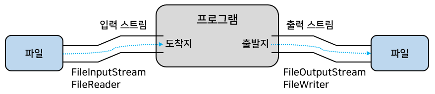
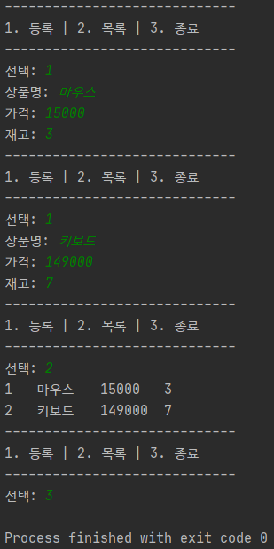

# 입출력 스트림

## 입출력 스트림

- 자바에서는 데이터 스트림을 통해 입출력이 된다.
- 스트림
  - 단일 방향으로 연속적으로 흘러가는 것.
  - 물이 높은 곳에서 낮은 곳으로 흐르듯 데이터는 출발지에서 도착지로 흘러간다.


- 프로그램이 출발지냐 또는 도착지냐에 따라 사용하는 스트림의 종류가 결정된다.
  - 프로그램이 도착지면 흘러온 데이터를 입력받아야 하므로 입력 스트림을 사용
  - 프로그램이 출발지면 데이터를 출력해야 하므로 출력 스트림을 사용

## 입출력 스트림의 종류

- java.io 패키지에는 여러 가지 종류의 스트림 클래스를 제공하고 있다.
- 크게 두 종류로 구분된다.
  - 바이트(byte) 기반 스트림 : 그림, 멀티미디어 등의 바이너리 데이터를 읽고 출력할 때 사용
  - 문자(character) 기반 스트림 : 문자 데이터를 읽고 출력할 때 사용
- 스트림 클래스가 바이트 기반인지, 문자 기반인지를 구별하려면 최상위 클래스를 보면 된다.


- InputStream과 OutputStream은 바이트 기반 입출력 스트림의 최상위 클래스이다.
  - 이들 클래스의 하위 클래스는 모두 바이트 기반 입출력 스트림이다.
  - 클래스 접미사로 InputStream 또는 OutputStream이 붙는다.
    - 예를 들어 이미지와 같은 바이너리 파일의 입출력 스트림 클래스는 FileInputStream과 FileOutputStream
- Reader와 Writer는 문자 기반 입출력 스트림의 최상위 클래스이다.
  - 이들 클래스의 하위 클래스들은 모두 문자 기반 입출력 스트림이다.
  - 클래스 접미사로 Reader 또는 Writer가 붙는다.
    - 예를 들어 텍스트 파일의 입출력 스트림 클래스는 FileReader와 FileWriter



## 바이트 출력 스트림 : OutputStream

- OutputStream은 바이트 기반 출력 스트림의 최상위 클래스로 추상 클래스이다.
  - 모든 바이트 기반 출력 스트림 클래스는 OutputStream 클래스를 상속받아 만들어진다.
  - FileOutputStream, PrintStream, BufferedOutputStream, DataOutputStream 클래스는 모두 OutputStream 클래스를 상속하고 있다.


- OutputStream 클래스에는 모든 바이트 기반 출력 스트림이 기본적으로 가져야 할 메소드가 정의되어 있다.


### write(int b) 메소드

- write(int b) 메소드는 매개 변수로 주어지는 int(4byte)에서 끝 1byte만 출력 스트림으로 보낸다.


- 10, 20, 30이 저장된 각각의 바이트를 파일 C:\Temp2\test1.db로 출력해서 test1.db의 내용으로 저장하는 예제

```java
import java.io.FileOutputStream;
import java.io.OutputStream;

public class WriteExample {

  public static void main(String[] args) throws Exception {
    // 데이터 도착지를 test1.db로 하는 바이트 기반 파일 출력 스트림을 생성
    OutputStream os = new FileOutputStream("C:/Temp2/test1.db");

    byte a = 10;
    byte b = 20;
    byte c = 30;

    // 1byte씩 출력
    os.write(a);
    os.write(b);
    os.write(c);

    os.flush(); // 출력 버퍼에 잔류하는 모든 바이트 출력
    os.close(); // 출력 스트림 닫기
  }

}
```


- FileOutputStream은 자식 클래스이므로 자동 타입 변환이 된다.
- 출력 스트림은 출력할 바이트를 바로 보내는 것이 아니라 내부 버퍼(저장소)에 우선 저장해놓는다.
  - flush() 메소드는 이 내부 버퍼에 잔류된 바이트를 모두 출력하는 역할을 한다.

### write(byte[] b) 메소드

- write(byte[] b) 메소드는 매개값으로 주어진 배열의 모든 바이트를 출력 스트림으로 보낸다.


- 10, 20, 30이 저장된 배열을 파일 C:\Temp2\test2.db로 출력해서 test2.db의 내용으로 저장하는 예제

```java
import java.io.FileOutputStream;
import java.io.OutputStream;

public class WriteExample2 {

  public static void main(String[] args) throws Exception {
    OutputStream os = new FileOutputStream("C:/Temp2/test2.db");

    byte[] array = {10, 20, 30};

    os.write(array); // 배열의 모든 바이트를 출력
    
    os.flush(); // 출력 버퍼에 잔류하는 모든 바이트를 출력
    os.close(); // 출력 스트림을 닫음
  }

}
```


### write(byte[] b, int off, int len) 메소드

- write(byte[] b, int off, int len) 메소드는 b[off]부터 len개의 바이트를 출력 스트림으로 보낸다.


- 10, 20, 30, 40, 50이 저장된 배열에서 20, 30, 40을 파일 C:\Temp2/test3.db로 출력해서 test3.db 내용으로 저장하는 예제

```java
import java.io.FileOutputStream;
import java.io.OutputStream;

public class WriteExample3 {

  public static void main(String[] args) throws Exception {
    OutputStream os = new FileOutputStream("C:/Temp2/test3.db");

    byte[] array = {10, 20, 30, 40, 50};

    os.write(array, 1, 3);

    os.flush();
    os.close();
  }

}
```


## 바이트 입력 스트림 : InputStream

- InputStream은 바이트 기반 입력 스트림의 최상위 클래스로 추상 클래스이다.
  - 모든 바이트 기반 입력 스트림은 InputStream 클래스를 상속받아 만들어진다.
  - FileInputStream, BufferedInputStream, DataInputStream 클래스는 모두 InputStream 클래스를 상속하고 있다.


- InputStream 클래스에는 바이트 기반 입력 스트림이 기본적으로 가져야 할 메소드가 정의되어 있다.


### read() 메소드

- read() 메소드는 입력 스트림으로부터 1byte를 읽고 int(4byte) 타입으로 리턴한다.
  - 따라서 리턴된 4byte 중 끝 1byte에만 데이터가 들어 있다.
  - 예를 들어 입력 스트림에서 5개의 바이트가 들어온다면 read() 메소드로 1byte씩 5번 읽을 수 있다.


- 더 이상 입력 스트림으로부터 바이트를 읽을 수 없다면 read() 메소드는 -1을 리턴한다.
  - 이것을 이용하면 읽을 수 있는 마지막 바이트까지 반복해서 1byte씩 읽을 수 있다.
- C:/Temp2/test1.db에 저장한 내용을 1byte씩 끝까지 읽는 예제

```java
import java.io.FileInputStream;
import java.io.InputStream;

public class ReadExample {

  public static void main(String[] args) throws Exception {
    // 데이터 출발지를 test1.db로 하는 바이트 기반 파일 입력 스트림 생성
    InputStream is = new FileInputStream("C:/Temp2/test1.db");
    while (true) {
      int data = is.read(); // 1byte씩 읽기
      if (data == -1) break; // 파일 끝에 도달했을 경우
      System.out.println(data);
    }
    is.close(); // 입력 스트림을 닫는다.
  }

}
```


- FileInputStream은 자식 클래스이므로 자동 타입 변환이 된다.

### read(byte[] b) 메소드

- read(byte[] b) 메소드는 입력 스트림으로부터 매개값으로 주어진 배열의 길이만큼 바이트를 읽고 해당 배열에 저장한다.
  - 읽은 바이트 수를 리턴한다.
  - 예를 들어 입력 스트림에서 5개의 바이트가 들어온다면 길이 3인 배열로 두 번 읽을 수 있다.


- read(byte[] b) 메소드 역시 입력 스트림으로부터 바이트를 더 이상 읽을 수 없다면 -1을 리턴한다.
  - 이것을 이용하면 읽을 수 있는 마지막 바이트까지 반복해서 읽을 수 있다.
- 길이가 100인 배열을 생성하고 read(byte[] b) 메소드로 한꺼번에 100byte를 읽고 배열에 저장하는 예제

```java
import java.io.FileInputStream;
import java.io.InputStream;

public class ReadExample2 {

  public static void main(String[] args) throws Exception {
    InputStream is = new FileInputStream("C:/Temp2/test2.db");

    byte[] buffer = new byte[100];

    while (true) {
      int readByteNum = is.read(buffer); // 배열 길이만큼 읽기
      if (readByteNum == -1) break;
      for (int i = 0; i < readByteNum; i++) {
        System.out.println(buffer[i]);
      }
    }

    is.close();
  }

}
```


- 많은 양의 바이트를 읽을 때에는 read(byte[] b) 메소드를 사용하는 것이 좋다.
  - 입력 스트림으로부터 100개의 바이트가 들어온다면 read() 메소드는 100번을 반복해서 읽어야 하지만,  
    read(byte[] b) 메소드는 한 번 일들 때 배열 길이만큼 읽기 때문에 읽는 횟수가 현저히 줄어든다.

### read(byte[]b, int off, int len) 메소드

- read(byte[]b, int off, int len) 메소드는 입력 스트림으로부터 len 개의 바이트만큼 읽고, 매개값으로 주어진 바이트 배열 b[off]부터 len개까지 저장한다.
  - 읽은 바이트 수인 len개를 리턴한다.
  - 실제로 읽은 바이트 수가 len개보다 작을 경우 읽은 수만큼 리턴한다.
  - 예를 들어 입력 스트림에서 전체 5개의 바이트가 들어오고, 여기서 3개만 읽어 b[2], b[3], b[4]에 각각 저장하는 경우


- read(byte[]b, int off, int len)도 입력 스트림으로부터 바이트를 더 이상 읽을 수 없다면 -1을 리턴한다.
  - read(byte[] b)와의 차이점은 한 번에 읽어들이는 바이트 수를 len 매개값으로 조절할 수 있고,  
    배열에서 저장이 시작되는 인덱스를 지정할 수 있다는 점
  - 만약 off를 0으로, len을 배열의 길이로 준다면 read(byte[] b)와 동일
- C:/Temp2/test3.db에서 3byte를 읽고, 길이 5인 배열의 배열[2], 배열[3], 배열[4]에 저장하는 예제

```java
import java.io.FileInputStream;
import java.io.InputStream;

public class ReadExample3 {

  public static void main(String[] args) throws Exception {
    InputStream is = new FileInputStream("C:/Temp2/test3.db");

    byte[] buffer = new byte[5];

    int readByteNum = is.read(buffer, 2, 3);
    if (readByteNum != -1) { // 읽은 바이트가 있다면
      for (int i = 0; i < buffer.length; i++) {
        System.out.println(buffer[i]);
      }
    }

    is.close();
  }

}
```


## 문자 출력 스트림 : Writer

- Writer는 문자 기반 출력 스트림의 최상위 클래스로 추상 클래스이다.
  - 모든 문자 기반 출력 스트림 클래스는 Writer 클래스를 상속받아 만들어진다.
  - FileWriter, BufferedWriter, PrintWriter, OutputStreamWriter 클래스는 모두 Writer 클래스를 상속하고 있다.


- Writer 클래스는 모든 문자 기반 출력 스트림이 기본적으로 가져야 할 메소드가 정의되어 있다.


### write(int c) 메소드

- write(int c) 메소드는 매개 변수로 주어지는 int(4byte)에서 끝 2byte(1개의 문자)만 출력 스트림으로 보낸다.


- 'A', 'B', 'C'가 저장된 각각의 char를 파일 C:\Temp2/test7.txt로 출력해서 test7.txt의 내용으로 저장하는 예제

```java
import java.io.FileWriter;
import java.io.Writer;

public class WriteExample {

  public static void main(String[] args) throws Exception {
    // 데이터 도착지를 test7.txt로 하는 문자 기반 파일 출력 스트림을 생성
    Writer writer = new FileWriter("C:/Temp2/test7.txt");

    char a = 'A';
    char b = 'B';
    char c = 'C';

    // 한 문자씩 출력
    writer.write(a);
    writer.write(b);
    writer.write(c);

    writer.flush();
    writer.close();
  }

}
```


### write(char[] cbuf) 메소드

- write(char[] cbuf) 메소드는 매개값으로 주어진 char[] 배열의 모든 문자를 출력 스트림으로 보낸다.


- 'A', 'B', 'C' 가 저장된 배열을 파일 C:\Temp2\test8.txt로 출력해서 test8.txt의 내용으로 저장하는 예제

```java
import java.io.FileWriter;
import java.io.Writer;

public class WriteExample2 {

  public static void main(String[] args) throws Exception {
    Writer writer = new FileWriter("C:/Temp2/test8.txt");

    char[] array = {'A', 'B', 'C'};

    writer.write(array);

    writer.flush();
    writer.close();
  }

}
```


### write(char[] cbuf, int off, int len) 메소드

- write(char[] cbuf, int off, int len) 메소드는 cbuf[off]부터 len개의 문자를 출력 스트림으로 보낸다.

```java
// 'A', 'B', 'C', 'D', 'E', 'F'가 저장된 배열에서 'B', 'C', 'D'을 추려서
// 파일 C:\Temp2\test9.txt로 출력해서 test9.txt의 내용으로 저장한다.
import java.io.FileWriter;
import java.io.Writer;

public class WriteExample3 {

  public static void main(String[] args) throws Exception {
    Writer writer = new FileWriter("C:/Temp2/test9.txt");

    char[] array = {'A', 'B', 'C', 'D', 'E'};

    // 배열의 1번 인덱스부터 3개를 출력
    writer.write(array, 1, 3);

    writer.flush();
    writer.close();
  }

}
```


### write(String str)와 write(String str, int off, int len) 메소드

- Writer는 문자열을 좀 더 쉽게 보내기 위해 write(String str)와 write(String str, int off, int len) 메소드를 제공한다.
  - write(String str)은 문자열 전체를 출력 스트림으로 내보낸다.
  - write(String str, int off, int len)은 주어진 문자열 off 순번부터 len개까지의 문자를 보낸다.

```java
// 문자열 "ABC"를 C:\Temp2\test10.txt로 출력해서 test10.txt의 내용으로 저장하는 예제
import java.io.FileWriter;
import java.io.Writer;

public class WriteExample4 {

  public static void main(String[] args) throws Exception {
    Writer writer = new FileWriter("C:/Temp2/test10.txt");

    String str = "ABC";

    writer.write(str);

    writer.flush();
    writer.close();
  }

}
```


## 문자 입력 스트림 : Reader

- Reader는 문자 기반 입력 스트림의 최상위 클래스로 추상 클래스이다.
  - 모든 문자 기반 입력 스트림은 Reader 클래스를 상속받아서 만들어진다.
  - FileReader, BufferedReader, InputStreamReader 클래스는 모두 Reader 클래스를 상속하고 있다.


- Reader 클래스에는 문자 기반 입력 스트림이 기본적으로 가져야 할 메소드가 정의되어 있다.


### read() 메소드

- read() 메소드는 입력 스트림으로부터 1개의 문자(2byte)를 읽고 int(4byte) 타입으로 리턴한다.
  - 따라서 리턴된 4byte 중 끝에 있는 2byte에 문자 데이터가 들어 있다.
  - 예를 들어 입력 스트림에서 2개의 문자(총 4byte)가 들어온다면 read() 메소드로 한 문자씩 두 번 읽을 수 있다.


- read() 메소드가 리턴한 int 값을 char 타입으로 변환하면 읽은 문자를 얻을 수 있다.

```java
char charData = (char) read();
```

- 더 이상 입력 스트림으로부터 문자를 읽을 수 없다면?
  - read() 메소드는 -1을 리턴하는데 이것을 이용하면 읽을 수 있는 마지막 문자까지 반복하면서 한 문자씩 읽을 수 있다.

```java
// test7.txt에 저장한 내용을 한 문자씩 끝까지 읽는 예제
import java.io.FileReader;
import java.io.Reader;

public class ReadExample {

  public static void main(String[] args) throws Exception {
    Reader reader = new FileReader("C:/Temp2/test7.txt");

    while (true) {
      int data = reader.read(); // 한 문자씩 읽기
      if (data == -1) break; // 파일 끝에 도달했을 경우
      System.out.println((char) data);
    }

    reader.close();
  }

}
```


### read(char[] cbuf) 메소드

- read(char[] cbuf)메소드는 입력 스트림으로부터 매개값으로 주어진 문자 배열의 길이만큼 문자를 읽고 배열에 저장한다.
  - 읽은 문자 수를 리턴
  - 예를 들어 입력 스트림에서 3개의 문자가 들어온다면 길이가 2인 문자 배열로 두 번 읽을 수 있다.


- read(char[] cbuf) 메소드 역시 입력 스트림으로부터 문자를 더 이상 읽을 수 없다면 -1을 리턴
  - 이것을 이용하면 읽을 수 있는 마지막 문자까지 반복해서 읽을 수 있다.

```java
// 길이가 100인 배열을 생성하고 read(char[] cbuf) 메소드로 한꺼번에 100개의 문자를 읽고 배열에 저장하는 예제
import java.io.FileReader;
import java.io.Reader;

public class ReadExample2 {

  public static void main(String[] args) throws Exception {
    Reader reader = new FileReader("C:/Temp2/test8.txt");

    char[] buffer = new char[100];

    while (true) {
      int readCharNum = reader.read(buffer); // 배열 길이만큼 읽기
      if (readCharNum == -1) break;
      for (int i = 0; i < readCharNum; i++) {
        System.out.println(buffer[i]);
      }
    }

    reader.close();
  }

}
```


- 많은 양의 문자를 읽을 때는 read(char[] cbuf)메소드를 사용하는 것이 좋다.
  - 입력 스트림으로부터 100개의 문자가 들어온다면 read() 메소드는 100번을 반복해 읽어야 하지만,  
    read(char[] cbuf) 메소드는 한 번 읽을 때 배열 길이만큼 읽기 때문에 읽는 횟수가 현저히 줄어든다.

### read(char[] cbuf, int off, int len) 메소드

- read(char[] cbuf, int off, int len) 메소드는 입력 스트림으로부터 len개의 문자만큼 읽고 매개값으로 주어진 문자 배열에서 cbuf[off]부터 len개까지 저장한다.
  - 읽은 문자 수인 len개를 리턴한다.
  - 입력 스트림으로부터 문자를 더 이상 읽을 수 없다면 -1을 리턴
- read(char[] cbuf) 메소드와의 차이점
  - 한 번에 읽어들이는 문자 수를 len매개값으로 조절가능
  - 배열에서 저장이 시작되는 인덱스를 지정할 수 있다.
  - 만약 off를 0으로, len을 배열의 길이로 준다면 read(char[] cbuf)메소드와 동일

```java
// C:/Temp2/test9.txt에서 3개의 문자를 읽고, 길이 5인 배열의 배열[2], 배열[3], 배열[4]에 저장하는 예제
import java.io.FileReader;
import java.io.Reader;

public class ReadExample3 {

  public static void main(String[] args) throws Exception {
    Reader reader = new FileReader("C:/Temp2/test9.txt");

    char[] buffer = new char[5];

    // 입력 스트림으로부터 3개의 문자를 읽고
    // buffer[2], buffer[3], buffer[4]에 각각 저장
    int readCharNum = reader.read(buffer, 2, 3);

    if (readCharNum != -1) { // 배열 전체를 읽고 출력
      for (int i = 0; i < buffer.length; i++) {
        System.out.println(buffer[i]);
      }
    }

    reader.close();
  }

}
```


# 보조 스트림

- 보조 스트림이란?
  - 다른 스트림과 연결이 되어 여러 가지 편리한 기능을 제공해주는 스트림
- 보조 스트림은 자체적으로 입출력을 수행할 수 없다.
  - 때문에 입출력 소스와 바로 연결되는 InputStream, OutputStream, Reader, Writer 등에 연결해서 입출력을 수행한다.
  - 보조 스트림은 문자 변환, 입출력 성능 향상, 기본 타입 입출력 등의 기능을 제공


- 프로그램은 입력 스트림으로부터 직접 데이터를 읽지 않는다.
  - 보조 스트림에서 제공하는 기능을 이용해서 데이터를 읽는다.
- 반대로 출력 스트림으로 직접 데이터를 보내지 않는다.
  - 보조 스트림에서 제공하는 기능을 이용해서 데이터를 보낸다.

## 보조 스트림 연결하기

- 보조 스트림을 연결하려면 보조 스트림을 생성할 때 자신이 연결될 스트림을 생성자의 매개값으로 제공하면 된다.

```java
보조스트림 변수 = new 보조스트림(연결스트림)
```

- 예를 들어 InputStream을 문자 변환 보조 스트림인 InputStreamReader에 연결하는 코드

```java
InputStream is = ...;
InputStreamReader reader = new InputStreamReader(is);
```


- 보조 스트림의 생성자 매개값은 InputStream, OutputStream, Reader, Writer 이외에 또 다른 보조 스트림이 될 수 있다.
  - 보조 스트림을 연속적으로 연결할 수 있다.

```java
// 예를 들어 문자 변환 보조 스트림인 InputStreamReader를 다시 성능 향상 보조 스트림인 BufferedReader에 연결할 수 있다.
InputStream is = System.in;
InputStreamReader reader = new InputStreamReader(is);
BufferedReader br = new BufferedReader(reader);
```


## 문자 변환 보조  스트림

- 소스 스트림이 바이트 기반 스트림(InputStream, OutputStream, FileInputStream, FileOutputStream)이면서 입출력 데이터가 문자라면?
  - Reader와 Writer로 변환해서 사용하는 것을 고려할 수 있다.
    - 문자 입출력은 Reader와 Writer가 편리하기 때문

### OutputStreamWriter

- OutputStreamWriter는 바이트 기반 출력 스트림에 연결되어 문자 출력 스트림인 Writer로 변환하는 보조 스트림이다.


```java
Writer writer = new OutputStreamWriter(바이트 기반 출력 스트림);
```

- 예를 들어 파일 출력을 위한 바이트 기반 FileOutputStream을 Writer 타입으로 변환할 수 있다.

```java
FileOutputStream fos = new FileOutputStream("C:/Temp2/test1.txt");
Writer writer = new OutputStreamWriter(fos);
```

### InputStreamReader

- InputStreamReader는 바이트 기반 입력 스트림에 연결되어 문자 입력 스트림인 Reader로 변환하는 보조 스트림이다.


```java
Reader reader = new InputStreamReader(바이트 기반 입력 스트림);
```

- 예를 들어 파일 입력을 위한 바이트 기반 FileInputStream을 Reader 타입으로 변환할 수 있다.

```java
FileInputStream fis = new FileInputStream("C:/Temp2/test1.txt");
Reader reader = new InputStreamReader(fis);
```

- 파일로 문자를 저장하고, 저장된 문자를 다시 읽는 예제
  - 사용하는 소스 스트림은 바이트기반 FileOutputStream과 FileInputStream이다.
  - 하지만 이 스트림을 직접 사용하지 않고 각각 Writer와 Reader로 변환해서 입출력한다.

```java
import java.io.*;

public class CharacterConvertStreamExample {

  public static void main(String[] args) throws Exception {
    write("문자 변환 스트림을 사용합니다.");
    String data = read();
    System.out.println(data);
  }


  public static void write(String str) throws Exception {
    FileOutputStream fos = new FileOutputStream("C:/Temp2/test1.txt");
    // FileOutputStream에 OutputStreamWriter 보조 스트림을 연결
    Writer writer = new OutputStreamWriter(fos);

    writer.write(str); // OutputStreamWriter 보조 스트림을 이용해서 문자 출력
    writer.flush();
    writer.close();
  }


  public static String read() throws Exception {
    FileInputStream fis = new FileInputStream("C:/Temp2/test1.txt");
    // FileInputStream에 InputStreamReader 보조 스트림을 연결
    Reader reader = new InputStreamReader(fis);

    char[] buffer = new char[100];
    int readCharNum = reader.read(buffer); // InputStreamReader 보조 스트림을 이용해서 문자 입력
    reader.close();
    String data = new String(buffer, 0, readCharNum); // char 배열에서 읽은 수만큼 문자열로 변환
    return data;
  }

}
```


## 성능 향상 보조 스트림

- 프로그램의 실행 성능은 CPU와 메모리가 아무리 뛰어나도 입출력이 가장 늦은 장치를 따라간다.
  - 때문에 하드 디스크의 입출력이 늦어지면 프로그램의 실행 성능은 하드 디스크의 처리 속도에 맞춰진다.
  - 네트워크로 데이터를 전송할 때도 마찬가지로 느린 네트워크 환경이라면 컴퓨터 사양이 아무리 좋아도 메신저와 게임의 속도는 느릴 수밖에 없다.
- 완전한 해결책은 될 수 없지만, 프로그램이 입출력 소스와 직접 작업하지 않고 중간에 메모리 버퍼(buffer)와 작업함으로써 실행 성능을 향상시킬 수 있다.
  - 예를들어 프로그램은 직접 하드 디스크에 데이터를 보내지 않고 메모리 버퍼에 데이터를 보냄으로써 쓰기 속도가 향상
  - 버퍼는 데이터가 쌓이기를 기다렸다가 꽉 차게 되면 데이터를 한꺼번에 하드 디스크로 보냄으로써 출력 횟수를 줄여준다.


- 기본적으로 출력 스트림은 내부에 작은 버퍼를 가지고 있다.
  - 하지만 이것만으로는 불충분하다.
- 보조 스트림 중에서는 그림처럼 메모리 버퍼를 추가로 제공하여 프로그램의 실행 성능을 향상시키는 것들이 있다.
  - 바이트 기반 스트림에는 BufferedInputStream, BufferedOutputStream
  - 문자 기반 스트림에는 BufferedReader, BufferedWriter가 있다.

### BufferedOutputStream과 BufferedWriter

- BufferedOutputStream은 바이트 기반 출력 스트림에 연결되어 버퍼를 제공해주는 보조 스트림이고,  
  BufferedWriter는 문자 기반 출력 스트림에 연결되어 버퍼를 제공해주는 보조 스트림이다.
  - 프로그램에서 전송한 데이터를 내부 버퍼에 쌓아 두었다가 버퍼가 꽉 차면, 버퍼의 모든 데이터를 한꺼번에 보낸다.
    - 프로그램 입장에서 보면 메모리버퍼로 데이터를 고속 전송하기 때문에 출력 성능이 향상되는 효과를 얻게 된다.
- BufferedOutputStream과 BufferedWriter 보조 스트림은 생성자의 매개값으로 준 출력 스트림과 연결되어 추가적인 내부 버퍼를 제공한다.

```java
BufferedOutputStream bos = new BufferedOutputStream(바이트 기반 출력 스트림);
BufferedWriter bw = new BufferedWriter(문자 기반 출력 스트림);
```

### BufferedInputStream과 BufferedReader

- BufferedInputStream은 바이트 기반 입력 스트림에 연결되어 버퍼를 제공해주는 보조 스트림이고,  
  BufferedReader는 문자 기반 입력 스트림에 연결되어 버퍼를 제공해주는 보조 스트림이다.
  - BufferedInputStream과 BufferedReader는 입력 소스로부터 자신의 내부 버퍼 크기만큼 데이터를 미리 읽고 버퍼에 저장해둔다.
    - 프로그램은 외부의 입력 소스로부터 직접 읽는 대신 버퍼로부터 읽음으로써 읽기 성능이 향상된다.


- BufferedInputStream과 BufferedReader 보조 스트림은 생성자의 매개값으로 준 입력 스트림과 연결되어 추가적인 내부 버퍼를 제공한다.

```java
BufferedInputStream bis = new BufferedInputStream(바이트 기반 입력 스트림);
BufferedReader br = new BufferedReader(문자 기반 입력 스트림);
```

- 성능 향상 보조 스트림을 사용했을 때와 사용하지 않았을 때의 파일 복사 실행 성능 차이를 보여주는 예제

```java
import java.io.*;

public class NonBufferVsBufferExample {

  public static void main(String[] args) throws Exception {
    
    // 기본 스트림 생성
    String originalFilePath1 =
        NonBufferVsBufferExample.class.getResource("originalFile1.jpg").getPath();
    String targetFilePath1 = "C:/Temp2/targetFile1.jpg";
    FileInputStream fis = new FileInputStream(originalFilePath1);
    FileOutputStream fos = new FileOutputStream(targetFilePath1);

    // 버퍼 보조 스트림 연결
    String originalFilePath2 =
        NonBufferVsBufferExample.class.getResource("originalFile2.jpg").getPath();
    String targetFilePath2 = "C:/Temp2/targetFile2.jpg";
    FileInputStream fis2 = new FileInputStream(originalFilePath2);
    FileOutputStream fos2 = new FileOutputStream(targetFilePath2);
    BufferedInputStream bis = new BufferedInputStream(fis2);
    BufferedOutputStream bos = new BufferedOutputStream(fos2);

    // FileInputStream, FileOutputStream을 이용한 복사 시간 측정
    long nonBufferTime = copy(fis, fos);
    System.out.println("버퍼를 사용하지 않았을 때:\t" + nonBufferTime + "ns");
    
    // BufferedInputStream, BufferedOutputStream을 이용한 복사 시간 측정
    long bufferTime = copy(bis, bos);
    System.out.println("버퍼를 사용했을 때:\t\t" + bufferTime + "ns");

    fis.close();
    fos.close();
    bis.close();
    bos.close();
  }

  static int data = -1;
  public static long copy(InputStream is, OutputStream os) throws Exception {
    long start = System.nanoTime();

    // 원본 파일에서 읽은 1byte를 타깃 파일로 바로 출력
    while (true) {
      data = is.read();
      if (data == -1) break;
      os.write(data);
    }
    os.flush();

    long end = System.nanoTime();
    return (end - start); // 복사에 걸린 시간 리턴
  }

}
```


- BufferedReader는 라인 단위로 문자열을 읽는 매우 편리한 readLine() 메소드를 제공한다.
  - readLine()은 Enter키(캐리지리턴(\r) + 라인피드(\n)) 이전의 모든 문자열을 읽고 리턴한다.
  - 이 메소드를 이용하면 키보드에서 입력한 내용 및 파일 내용을 라인 단위로 읽을 수 있다.

```java
// 예를들어 아래와 같은 텍스트 파일이 있을 때, 라인 단위로 문자열을 얻고 싶다면
// BufferedReader 보조 스트림을 생성하고, readLine()으로 반복해서 읽으면 된다.
// 총 3개의 라인이 있으므로 readLine()을 세 번 실행할 수 있는데,
// readLine()은 더 이상 읽을 라인이 없다면 null을 리턴한다.
C 언어
Java 언어
Python 언어
```

- 예제

```java
import java.io.BufferedReader;
import java.io.FileReader;
import java.io.Reader;

public class ReadLineExample {

  public static void main(String[] args) throws Exception {
    Reader reader = new FileReader(
        ReadLineExample.class.getResource("language.txt").getPath()
    );
    BufferedReader br = new BufferedReader(reader); // 보조 스트림 연결

    while (true) {
      String data = br.readLine();
      if (data == null) break;
      System.out.println(data);
    }

    br.close();
  }

}
```


## 기본 타입 입출력 보조 스트림

- DataInputStream과 DataOutputStream 보조 스트림을 연결하면 기본 타입인 boolean, char, short, int, long, float, double을 입출력할 수 있다.

```java
// DataInputStream과 DataOutputStream 객체를 생성하는 코드
// 다른 보조 스트림과 마찬가지로 연결할 바이트 입출력 스트림을 생성자의 매개값으로 준다.
DataInputStream dis = new DataInputStream(바이트 기반 입력 스트림);
DataOutputStream dos = new DataOutputStream(바이트 기반 출력 스트림);
```

- 기본 타입을 출력하기 위해 DataInputStream과 DataOutputStream이 제공하는 메소드들


- 주의할 점
  - 데이터 타입의 크기가 모두 다르므로 DataOutputStream으로 출력한 데이터를 다시 DataInputStream으로 읽어올 때는  
    출력한 순서와 동일한 순서로 읽어야 한다.
  - 만약 출력할 때의 순서가 int → boolean → double 이라면 읽을 때의 순서도 int → boolean → double 이어야 한다.

```java
// 이름, 성적, 순위 순으로 파일에 출력하고 다시 이름, 성적, 순위 순으로 파일로부터 입력받는 예제
import java.io.DataInputStream;
import java.io.DataOutputStream;
import java.io.FileInputStream;
import java.io.FileOutputStream;

public class DataInputOutputStreamExample {

  public static void main(String[] args) throws Exception {
    
    // 바이트 기반 출력 스트림을 생성하고 DataOutputStream 보조 스트림 연결
    FileOutputStream fos = new FileOutputStream("C:/Temp2/primitive.db");
    DataOutputStream dos = new DataOutputStream(fos);
    
    // 기본 타입 값 출력
    dos.writeUTF("홍길동");
    dos.writeDouble(95.5);
    dos.writeInt(1);

    dos.writeUTF("김자바");
    dos.writeDouble(90.3);
    dos.writeInt(2);

    dos.flush();
    dos.close();

    // 바이트 기반 입력 스트림을 생성하고 DataInputStream 보조 스트림 연결
    FileInputStream fis = new FileInputStream("C:/Temp2/primitive.db");
    DataInputStream dis = new DataInputStream(fis);

    for (int i = 0; i < 2; i++) {
      String name = dis.readUTF();
      double score = dis.readDouble();
      int order = dis.readInt();
      System.out.println(name + " : " + score + " : " + order);
    }

    dis.close();
  }

}
```


## 프린터 보조 스트림

- PrintStream과 PrintWriter는 프린터와 유사하게 출력하는 print(), println() 메소드를 가지고 있는 보조 스트림이다.
  - 빈번히 사용했던 콘솔 출력 스트림인 System.out이 PrintStream 타입이기 때문에 print(), println() 메소드를 사용할 수 있었다.
- PrintStream은 바이트 기반 출력 스트림과 연결되고, PrintWriter는 문자 기반 출력 스트림과 연결된다.

```java
// PrintStream과 PrintWriter는 다른 보조 스트림과 마찬가지로 연결할 출력 스트림을 생성자의 매개값으로 받는다.
PrintStream ps = new PrintStream(바이트 기반 출력 스트림);
PrintWriter pw = new PrintWriter(문자 기반 출력 스트림);
```

- println()과 print() 메소드는 출력할 데이터 타입에 따라 아래처럼 오버로딩 되어 있다.


```java
// FileOutputStream에 보조 스트림으로 PrintStream을 연결해서 print()와 println() 메소드로 문자열을 출력하는 예제
import java.io.FileOutputStream;
import java.io.PrintStream;

public class PrintStreamExample {

  public static void main(String[] args) throws Exception {

    // 바이트 기반 출력 스트림을 생성하고 PrintStream 보조 스트림 연결
    FileOutputStream fos = new FileOutputStream("C:/Temp2/printstream.txt");
    PrintStream ps = new PrintStream(fos);

    ps.println("[프린터 보조 스트림]");
    ps.print("마치 ");
    ps.println("프린터가 출력하는 것처럼 ");
    ps.println("데이터를 출력합니다.");

    ps.flush();
    ps.close();

  }

}
```


## 객체 입출력 보조 스트림

- ObjectOutputStream과 ObjectInputStream 보조 스트림을 연결하면 메모리에 생성된 객체를 파일 또는 네트워크로 출력할 수 있다.
  - ObjectOutputStream은 객체를 직렬화하는 역할
  - ObjectInputStream은 객체로 역직렬화하는 역할
- 직렬화란
  - 객체를 바이트 배열로 만드는 것
- 역직렬화란
  - 바이트 배열을 다시 객체로 복원하는 것
- ObjectOutputStream과 ObjectInputStream은 다른 보조 스트림과 마찬가지로 연결할 바이트 기반 입출력 스트림을 생성자의 매개값으로 받는다.

```java
ObjectInputStream ois = new ObjectInputStream(바이트 기반 입력 스트림);
ObjectOutputStream oos = new ObjectOutputStream(바이트 기반 출력 스트림);
```

- ObjectOutputStream의 writeObject() 메소드는 객체를 직렬화해서 출력 스트림으로 보낸다.

```java
oos.writeObject(객체);
```

- 반대로 ObjectInputStream의 readObject() 메소드는 입력 스트림에서 읽은 바이트를 역직렬화해서 객체로 다시 복원해서 리턴한다.
  - 리턴 타입은 Object 타입이기 때문에 원래 타입으로 강제 변환해야 한다.
  - `객체타입 변수 = (객체타입) ois.readObject();`
- 자바는 모든 객체를 직렬화하지 않는다.
  - java.io.Serializeble 인터페이스를 구현한 객체만 직렬화한다.
- Serializeble 인터페이스는 메소드 선언이 없는 인터페이스
  - 객체를 파일로 저장하거나, 네트워크로 전송할 목적이라면 개발자는 클래스를 선언할 때 implements Serializeble 을 추가해야 한다.
    - 개발자가 JVM에게 직렬화해도 좋다고 승인하는 역할

```java
// List 컬렉션을 파일로 저장하는 예제
// List 컬렉션의 구현 클래스로 ArrayList를 사용하는데, ArrayList는 Serializeble 인터페이스를 구현하고 있다.
// 주의할 점으로 ArrayList에 저장되는 객체 역시 Serializeble 인터페이스를 구현하고 있어야 한다.

// Board.java
import java.io.Serializable;
import java.util.Date;

public class Board implements Serializable { // Serializeble 인터페이스 구현
  private int bno;
  private String title;
  private String content;
  private String writer;
  private Date date;

  public Board(int bno, String title, String content, String writer, Date date) {
    this.bno = bno;
    this.title = title;
    this.content = content;
    this.writer = writer;
    this.date = date;
  }

  public int getBno() {
    return bno;
  }

  public void setBno(int bno) {
    this.bno = bno;
  }

  public String getTitle() {
    return title;
  }

  public void setTitle(String title) {
    this.title = title;
  }

  public String getContent() {
    return content;
  }

  public void setContent(String content) {
    this.content = content;
  }

  public String getWriter() {
    return writer;
  }

  public void setWriter(String writer) {
    this.writer = writer;
  }

  public Date getDate() {
    return date;
  }

  public void setDate(Date date) {
    this.date = date;
  }
}
```

```java
// ObjectStreamExample.java
import java.io.*;
import java.text.SimpleDateFormat;
import java.util.ArrayList;
import java.util.Date;
import java.util.List;

public class ObjectStreamExample {

  public static void main(String[] args) throws Exception {
    writeList(); // List를 파일에 저장
    List<Board> list = readList(); // 파일에 저장된 List 읽기

    SimpleDateFormat sdf = new SimpleDateFormat("yyyy-MM-dd");
    for (Board board : list) {
      System.out.println(
          board.getBno() + "\t" + board.getTitle() + "\t" +
              board.getContent() + "\t" + board.getWriter() + "\t" +
              sdf.format(board.getDate())
      );
    }
  }

  public static void writeList() throws Exception {
    List<Board> list = new ArrayList<>(); // List 생성

    list.add(new Board(1, "제목1", "내용1", "글쓴이1", new Date()));
    list.add(new Board(2, "제목2", "내용2", "글쓴이2", new Date()));
    list.add(new Board(3, "제목3", "내용3", "글쓴이3", new Date()));

    // 객체 출력 스트림을 이용해서 list 출력
    FileOutputStream fos = new FileOutputStream("C:/Temp2/board.db");
    ObjectOutputStream oos = new ObjectOutputStream(fos);
    oos.writeObject(list);
    oos.flush();
    oos.close();
  }

  public static List<Board> readList() throws Exception {
    // 객체 입력 스트림을 이용해서 list 읽기
    FileInputStream fis = new FileInputStream("C:/Temp2/board.db");
    ObjectInputStream ois = new ObjectInputStream(fis);
    List<Board> list = (List<Board>) ois.readObject();
    return list;
  }

}
```


# 입출력 관련 API

- 콘솔(Console)은 시스템을 사용하기 위해 키보드로 입력을 받고 모니터로 출력하는 소프트웨어를 말한다.
  - 유닉스나 리눅스 운영체제는 터미널(terminal)에 해당
  - 윈도우 운영체제는 명령 프롬프트에 해당
- 자바는 콘솔로부터 데이터를 입력받을 때 System.in을 사용하고, 콘솔에 데이터를 출력할 때 System.out을 사용한다.
  - 에러를 출력할 때에는 System.err를 사용

## System.in 필드

- 자바는 콘솔에서 키보드의 데이터를 입력받을 수 있도록 System 클래스의 in 정적 필드를 제공한다.
  - System.in은 InputStream 타입의 필드이므로 InputStream 변수로 참조가 가능하다.

```java
InputStream is = System.in;
```

- 키보드로부터 어떤 키가 입력되었는지 확인하려면 InputStream의 read() 메소드로 1byte를 읽으면 된다.
  - 리턴된 int 값에는 해당 키의 코드가 저장되어 있다.

```java
int keyCode = is.read();
```

- Enter 키가 입력되고 나서 라인단위로 전체 문자열을 읽는 방법

```java
InputStream is = System.in;
Reader reader = new InputStreamReader(is); // 보조 스트림을 연결
BufferedReader br = new BufferedReader(reader); // 라인 단위로 읽기 위해 보조 스트림 추가연결
String lineStr = br.readLine(); // 입력된 라인을 읽을 수 있다.
```

- 반복해서 키보드로부터 입력된 문자열을 라인 단위로 읽고 모니터에 출력하는 예제
  - 반복을 멈추려면 "q" 또는 "quit"입력

```java
import java.io.BufferedReader;
import java.io.InputStream;
import java.io.InputStreamReader;
import java.io.Reader;

public class GetLineStringFromKeyboard {

  public static void main(String[] args) throws Exception {
    InputStream is = System.in;
    Reader reader = new InputStreamReader(is); // InputStream을 Reader로 변환
    BufferedReader br = new BufferedReader(reader); // 다시 보조스트림 연결

    while (true) {
      System.out.print("입력하세요: ");
      String lineStr = br.readLine(); // 라인 단위로 문자열을 읽음
      if (lineStr.equals("q") || lineStr.equals("quit")) break;
      System.out.print("입력된내용: " + lineStr);
      System.out.println();
    }

    br.close();
  }

}
```


## System.out 필드

- 콘솔에서 키보드로 입력된 데이터를 System.in으로 읽었다면,  
  반대로 콘솔에서 모니터로 데이터를 출력하기 위해서는 System 클래스의 out 정적 필드를 사용
  - System.out은 PrintStream타입의 필드
    - 따라서 PrintStream이 제공하는 print(), println(), printf()와 같은 메소드를 이용해 모니터로 출력할 수 있다.

## Scanner 클래스

- Scanner 클래스는 입출력 스트림도 아니고, 보조 스트림도 아니다.
  - Scanner는 문자 파일이나 바이트 기반 입력 스트림에서 라인 단위 문자열을 쉽게 읽도록 하기 위해 java.util 패키지에서 제공하는 클래스
- System.in 필드에서는 라인 단위로 읽기 위해 여러 보조 스트림을 연결하는 작업이 필요하다.
  - 하지만 Scanner는 보조 스트림 없이 매우 쉽게 라인 단위 문자열을 읽기 위해 nextLine() 메소드를 제공한다.

```java
// Scanner를 이용해서 상품의 내용을 키보드로 입력받아 Product 객체를 생성하고 List 컬렉션에서 관리하는 예제

// Product.java
public class Product {
  private int pno;
  private String name;
  private int price;
  private int stock;

  public int getPno() {
    return pno;
  }

  public void setPno(int pno) {
    this.pno = pno;
  }

  public String getName() {
    return name;
  }

  public void setName(String name) {
    this.name = name;
  }

  public int getPrice() {
    return price;
  }

  public void setPrice(int price) {
    this.price = price;
  }

  public int getStock() {
    return stock;
  }

  public void setStock(int stock) {
    this.stock = stock;
  }
}
```

```java
// ProductStorage.java
import java.util.ArrayList;
import java.util.List;
import java.util.Scanner;

public class ProductStorage {

  private List<Product> list = new ArrayList<>(); // List 컬렉션 생성
  private Scanner scanner = new Scanner(System.in);
  private int counter;
  
  public void showMenu() {
    while (true) {
      System.out.println("-----------------------------");
      System.out.println("1. 등록 | 2. 목록 | 3. 종료");
      System.out.println("-----------------------------");

      System.out.print("선택: ");
      String selectNo = scanner.nextLine(); // 번호 읽기
      switch (selectNo) {
        case "1":
          registerProduct();
          break;
        case "2":
          showProducts();
          break;
        case "3":
          return;
      }
    }
  }

  public void registerProduct() {
    try {
      Product product = new Product();
      product.setPno(++counter); // pno 세팅

      System.out.print("상품명: ");
      product.setName(scanner.nextLine()); // 이름 읽고 세팅

      System.out.print("가격: ");
      product.setPrice(Integer.parseInt(scanner.nextLine())); // 가격 읽고 세팅

      System.out.print("재고: ");
      product.setStock(Integer.parseInt(scanner.nextLine())); // 재고를 읽고 세팅

      list.add(product); // list에 Product 저장
    } catch (Exception e) {
      System.out.println("등록 에러: " + e.getMessage());
    }
  }

  public void showProducts() {
    for (Product p : list) {
      System.out.println(p.getPno() + "\t" + p.getName() + "\t" +
          p.getPrice() + "\t" + p.getStock());
    }
  }

}
```

```java
// ProductStorageExample
public class ProductStorageExample {

  public static void main(String[] args) {
    ProductStorage productStorage = new ProductStorage();
    productStorage.showMenu();
  }

}
```



## File 클래스

- java.io 패키지에서 제공하는 File 클래스는 파일 및 폴더(디렉토리) 정보를 제공해주는 역할을 한다.

```java
// File 클래스로부터 File 객체를 생성하려면
File file = new File("C:/Temp2/file.txt");
File file = new File("C:\\Temp2\\file.txt");
```

- 경로 구분자는 운영체제마다 다르다.
  - 윈도우에서는 \ 또는 / 둘 다 사용할 수 있다.
    - 윈도우에서 \를 경로 구분자로 사용하고 싶다면 이스케이프문자(\\\\)로 기술해야 한다.
  - 유닉스나 리눅스에서는 /를 사용
- File 객체를 생성했다고 파일이나 폴더가 생성되는 것은 아니다.
  - 제공되는 문자열 경로에 실제 파일이나 폴더가 없더라도 예외가 발생하지 않는다.
- 해당 경로에 실제로 파일이나 폴더가 있는지 확인하고 싶다면?
  - File 객체를 생성하고 나서 exists() 메소드를 호출하면 된다.

```java
// 파일이나 폴더가 존재한다면 true를 리턴, 그렇지 않다면 false를 리턴
boolean isExist = file.exists();
```

- exists() 메소드의 리턴값이 true 또는 false일 때 아래의 메소드로 파일 또는 폴더를 생성할 수 있다.


- exists() 메소드의 리턴값이 true라면 아래의 메소드를 사용할 수 있다.


```java
// C:/Temp2 폴더에 images 폴더와 file1.txt, file2.txt, file3.txt 파일을 생성하고,
// Temp2 폴더에 있는 파일 목록을 출력하는 예제
import java.io.File;
import java.text.SimpleDateFormat;
import java.util.Date;

public class FileExample {

  public static void main(String[] args) throws Exception {
    
    // File 객체 생성
    File dir = new File("C:/Temp2/images");
    File file1 = new File("C:/Temp2/file1.txt");
    File file2 = new File("C:/Temp2/file2.txt");
    File file3 = new File("C:/Temp2/file3.txt");

    if (dir.exists() == false) {
      dir.mkdirs();
    }
    if (file1.exists() == false) {
      file1.createNewFile();
    }
    if (file2.exists() == false) {
      file2.createNewFile();
    }
    if (file3.exists() == false) {
      file3.createNewFile();
    }

    // C:/Temp2 폴더의 내용 목록을 File 배열로 얻는다.
    File temp = new File("C:/Temp2");
    File[] contents = temp.listFiles();

    System.out.println("시간\t\t\t\t\t\t형태\t\t크기\t이름");
    System.out.println("-------------------------------------------------------");
    SimpleDateFormat sdf = new SimpleDateFormat("yyyy-MM-dd a HH:mm");
    for (File file : contents) {
      System.out.print(sdf.format(new Date(file.lastModified())));
      if (file.isDirectory()) {
        System.out.print("\t<DIR>\t\t\t" + file.getName());
      } else {
        System.out.print("\t\t\t" + file.length() + "\t" + file.getName());
      }
      System.out.println();
    }
  }

}
```


- 파일 또는 폴더의 정보를 얻기 위해 File 객체를 단독으로 사용할 수 있지만,  
  파일 입출력 스트림(FileInputStream, FileOutputStream, FileReader, FileWriter) 객체를 생성할 때 경로정보를 제공할 목적으로도 사용
  - 스트림 생성자에 문자열 경로 대신 File 객체를 대입할 수 있다.

```java
// 첫 번째 방법
FileInputStream fis = new FileInputStream("C:/Temp2/image.gif");

// 두 번째 방법
File file = new File("C:/Temp2/image.gif");
FileInputStream fis = new FileInputStream("file");
```

