# 연산자

## 연산자와 연산식

- 프로그램에서 <u>데이터를 처리하여결과를 산출하는 것</u>을 <b>연산(operations)</b>이라 한다.
  - 연산에 사용되는 <u>표시나 기호</u>를 <b>연산자(operator)</b>라고 한다.
  - <u>연산되는 데이터</u>는 <b>피연산자(operand)</b>라고 한다.

- 연산자와 피연산자를 이용하여 <u>연산의 과정을 기술한 것</u>을 <b>연산식(expressions)</b>이라고 부른다.
  - 예를 들어 아래의 연산식에서 +, -, *, ==은 연산자이고 x, y, z 변수는 피연산자

```java
x + y
x - y
x * y + z
x == y
```

- 자바 언어는 다양한 연산자를 제공한다.
  - 이 연산자들은 피연산자를 연산해서 값을 산출하는데, 산출되는 값의 타입은 연산자별로 다르다.
    - 예를 들어 산술 연산자일 경우는 숫자 타입(byte, short, int, long, float, double)으로,
    - 비교 연산자와 논리 연산자는 논리(boolean)타입으로 결과값이 나온다.

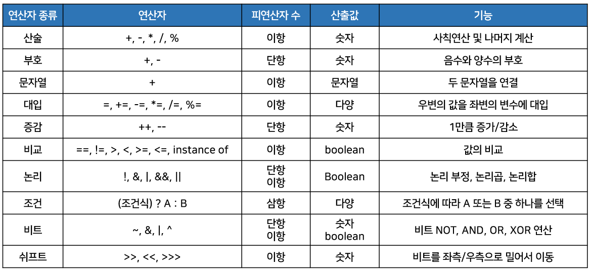

- 연산자는 필요로 하는 <u>피연산자의 수에 따라</u> <b>단항, 이항, 삼항 연산자</b>로구분된다.
  - 부호 연산자와 증가/감소 연산자는 피연산자 하나만을 요구하므로 단항 연산자,
  - 조건 연산자는 조건식, A, B와 같이 세 개의 피연산자가 필요하므로 삼항 연산자라고 한다.
  - 그 이외의 연산자는 두 개의 피연산자를 요구하므로 모두 이항 연산자이다.

```
단항 연산자 : ++x;
이항 연산자 : x + y;
삼항 연산자 : (sum>90) ? "A" : "B";
```

- 연산식은 <b>반드시 하나의 값</b>을 산출한다.
  - 연산자 수가 아무리 많아도 두 개 이상의 값을 산출하는 연산식은 없다.
  - <u>하나의 값이 올 수 있는 곳이면 어디든지 값 대신</u>에 연산식을 사용할 수 있다.
- 보통 연산식의 값은 변수에 저장한다.

```java
// x와 y 변수의 값을 더하고 나서 result 변수에 저장
int result = x + y;
```

- 연산식은 다른 연산식의 피연산자 위치에도 올 수 있다.
  - 아래와 같이 비교 연산자인 < 의 좌측 피연산자로  (x + y) 라는 연산식이 사용되어 x와 y 변수의 값을 더하고 나서 5보다 작은지 검사한 후 결과값(true 또는 false)을 result 변수에 저장한다.

```java
boolean result = (x+y) < 5;
```

## 연산의 방향과 우선순위

- 연산식에는 다양한 연산자가 복합적으로 구성된 경우가 많다.
  - 산술 연산식에서 덧셈(+), 뺄셈(-), 연산자보다는 곱셈(*), 나눗셈(/) 연산자가 우선 처리된다.
- 프로그램에서는 연산자의 연산 방향과 연산자 간의 <b>우선순위</b>가 정해져 있다.

```java
// 다른 연산자들의 경우
x > 0 && y < 0
```

- && 보다는>, < 가 우선순위가 높기 때문에 x>0과 y<0이 먼저 처리된다.  
  그다음 &&는 x>0과 y<0의 산출값을 가지고 연산하게 된다.
- 그러면 <u>우선순위가 같은 연산자들</u>끼리는 어떤 순서로 처리가 될까?
  - <u>연산자의 방향</u>에 따라 달라진다.
  - 대부분의 연산자는 왼쪽에서부터 오른쪽으로(→) 연산을 시작한다.

```java
100 * 2 / 3 % 5
```

- 위에서 *, /, %는 같은 우선순위를 갖고 있다.
  - 이 연산자들은 연산 방향이 왼쪽에서 오른쪽으로 수행된다.
  - 100 * 2가 제일 먼저 연산되어 200이 산출되고, 그 다음 200 / 3이 연산되어 66이 산출된다.  
    그 다음으로 66 % 5가 연산되어 1이 나온다.

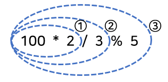

- 하지만 단항 연산자(++, --, ~, !), 부호 연산자(+, -), 대입 연산자 (=, +=, -=, ...)는 오른쪽에서 왼쪽(←)으로 연산이 된다.

```java
a = b = c = 5;
```

- 위 연산식은 c = 5, b = c, a = b 순서로 실행된다. 실행되고 난 후에는 a, b, c의 값이 모두 5가 된다.

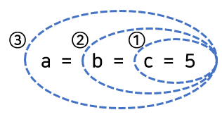

- 이처럼 어떤 연산자를 사용하느냐에 따라 연산의 방향과 우선순위가 정해져 있다.
  - 그러므로 복잡한 연산식에서는 주의가 필요하다.
  - 아래의 표는 연산자의 연산 방향과 우선순위를 정리한 표

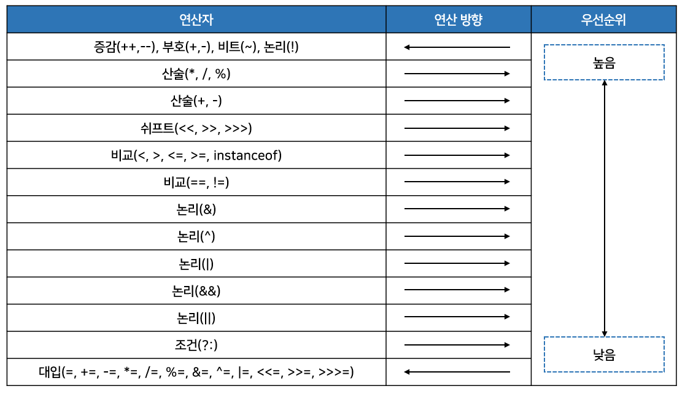

- 우선순위와 연산 방향이 정해져 있다 하더라도 여러 가지 연산자들이 섞여 있다면 어느 연산자가 먼저 처리될지 매우 혼란스러울 수 있다.
  - 그래서 <u>괄호를 사용해서 먼저 처리해야 할 연산식을 묶는 것</u>이 좋다.

```java
int var1 = 1;
int var2 = 3;
int var3 = 2;
int result = var1 + var2 * var3; // 곱하기가 먼저 연산되고, 그 결과와 더하기가 연산된다.
```

- 만약 var1 + var2를 먼저 연산하고 싶다면 괄호()를 사용하면 된다.
  - 괄호 부분의 연산은 최우선순위를 갖기 때문에 다른 연산자보다 우선 연산된다.

```java
int result = (var1 + var2) * var3; // 더하기가 먼저 연산되고, 그 결과와 곱하기가 연산된다.
```

- 연산자의 방향과 우선순위를 정리하면 아래와 같다.
  - 단항, 이항, 삼항 연산자 순으로 우선순위를 가진다.
  - 산술, 비교, 논리, 대입 연산자 순으로 우선순위를 가진다.
  - 단항과 대입 연산잘르 제외한 모든 연산의 방향은 왼쪽에서 오른쪽이다(→).
  - 복잡한 연산식에는 괄호()를 사용해서 우선순위를 정해준다.

## 단항 연산자

- <b>단항 연산자</b>는 피연산자가 단 하나뿐인 연산자를 말한다.
  - 부호 연산자(+, -), 증감 연산자(++, --), 논리 부정 연산자(!), 비트 반전 연산자(~)가 있다.

### 부호 연산자(+, -)

- <b>부호 연산자</b>는 양수 및 음수를 표시하는 +, -를 말한다.
  - boolean 타입과 char 타입을 제외한 나머지 기본 타입에 사용할 수 있다.

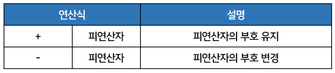

- +,- 는 산술 연산자이기도 하고, 부호 연산자이기도 하다.
  - 부호 연산자로 쓰일 때에는 하나의 피연산자만 필요하다.
  - 일반적으로 부호 연산자를 아래와 같이 정수 및 실수 리터럴 앞에 붙여 양수 및 음수를 표현한다.

```java
int i1 = +100;
int i = -100;
double d1 = +3.14;
double d2 = -10.5;
```

- 부호 연산자를 정수 또는 실수 타입 변수 앞에 붙일 수도 있다.
  - 이런 경우는 변수를 양수 및 음수로 표현한 것이 아니라 <u>변수 값의 부호를 유지하거나 바꾸기 위해</u> 사용
  - \+ 연산자는 변수 값의 부호를 유지
  - \- 연산자는 변수 값의 부호를 양수는 음수로, 음수는 양수로 바꾼다.

```java
// result1에는 x 값인 음수 -100이 그대로 저장된다.
// 그러나 result2에는 부호가 변경된 양수 100이 저장된다.
int x = -100;
int result1 = +x;
int result2 = -x;
```

- 부호 연산자를 사용할 때 <u>주의할 점</u>
  - <u>부호 연산자의 산출 타입은 <b>int 타입</b></u>이 된다.
    - 예를 들어 short 타입 값을 부호 연산하면 int 타입 값으로 바뀐다.
    - 그러므로 아래의 코드는 컴파일 에러가 발생한다.

```java
short s = 100;
short result = -s;	// 컴파일 에러
```

```java
// 결과 변수를 int형으로 바꿔줘야 한다.
short s = 100;
int result = -s;
```

```java
public class SignOperatorExample {
    
	public static void main(String[] args) {
		int x = -100;
		int result1 = +x;
		int result2 = -x;
		System.out.println("result1=" + result1);	// -100
		System.out.println("result2=" + result2);	// 100
		
		byte b = 100;
		//byte result3 = -b;  // 컴파일 에러
		int result3 = -b; 
		System.out.println("result3=" + result3);	// -100
	}
    
}
```

### 증감 연산자(++, --)

- <b>증감 연산자</b>는 변수의 값을 1 증가(++)시키거나 1 감소(--) 시키는 연산자를 말한다.
  - boolean타입을 제외한 모든 기본 타입의 피연산자에 사용할 수 있다.

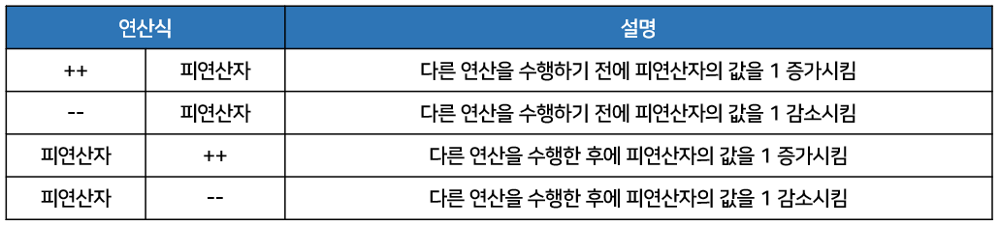

- ++ 연산자는 피연산자의 기존 값에 1을 더해서 그 결과를 다시 피연산자에 저장한다.
  - 예를 들어 num 변수의 기존 값이 5라면 ++num 연산 후 num 변수의 값은 6이 된다.  
    그래서 ++연산자를 증가 연산자라고 부른다.

- -- 연산자는 피연산자의 기존 값에 1을 뺀 후 그 결과를 다시 피연산자에 저장한다.
  - 예를 들어 num 변수의 기존 값이 5라면 --num 연산 후 num 변수의 값은 4가 된다.  
    그래서 --연산자를 감소 연산자라고 부른다.

- <u>증가 연산자와 감소 연산자는 변수의 앞뒤 어디에든</u> 올 수 있다.
  - 연산식에서 증감 연산자만 있는 경우에는 증감 연산자가 변수 앞 또는 뒤 어디든 위치해도 상관없다.

```java
++i;						--i;
i++;						i--;
// 모두 i = i + 1;로 동일	// 모두 i = i - 1;로 동일
```

- 하지만 <u>다른 연산자와 함께 사용하는 연산식</u>에서는 <u>증감 연산자의 위치에 따라 연산식의 결과가 다르게</u> 나오므로 주의해야 한다.
  - 증감 연산자가 <u>변수 앞에</u> 있으면 우선 변수를 1 증가 또는 1 감소시킨 후에 다른 연산자와 계산
  - 증감 연산자가 <u>변수 뒤에</u> 있으면 다른 연산자를 먼저 처리한 후 변수를 1 증가 또는 1 감소시킨다.

```java
int x = 1;
int y = 1;
int result1 = ++x + 10;
int result2 = y++ + 10;
```

- 위 코드에서 변수 result1에는 12가 저장된다.
  - 왜냐하면 x의 값이 1증가되어 2가 된 후 10과 합해져 12가 되기 때문이다.

- 그러나 변수 result에는 11이 저장된다.
  - 왜냐하면 y인 값인 1과 10이 합해져 11이되고 그 후에 y는 1 증가되어 2가 되기 때문이다.

```java
public class IncreaseDecreaseOperatorExample {
    
	public static void main(String[] args) {
		int x = 10;
		int y = 10;
		int z;
		
		System.out.println("-----------------------");
		x++;
		++x;
		System.out.println("x=" + x);	// 12	

		System.out.println("-----------------------");		
		y--;
		--y;
		System.out.println("y=" + y);	// 8

		System.out.println("-----------------------");		
		z = x++;
		System.out.println("z=" + z);	// 12
		System.out.println("x=" + x);	// 13
		
		System.out.println("-----------------------");		
		z = ++x;
		System.out.println("z=" + z);	// 14
		System.out.println("x=" + x);	// 14
		
		System.out.println("-----------------------");				
		z = ++x + y++;
		System.out.println("z=" + z);	// 23
		System.out.println("x=" + x);	// 15
		System.out.println("y=" + y);	// 9
	}
    
}
```

- ++i가 i=i+1 보다 보이는 연산자 수가 적어 연산속도가 빠를 것 같다.
  - 하지만 실제로 컴파일하면 동일한 바이트 코드가 생성된다.

### 논리 부정 연산자(!)

- <b>논리 부정 연산자</b>는 true를 false로, false를 true로 변경하기 때문에 boolean 타입에만 사용할 수 있다.

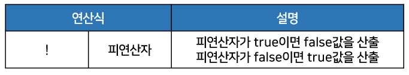

- 논리 부정 연산자는 <u>조건문과 제어문에서 사용</u>되어 조건식의 값을 부정하도록 해서 <u>실행 흐름을 제어</u>할 때 주로 사용된다.
- 또한 두 가지 상태(true/false)를 번갈아가며 변경하는 <b>토글(toggle)</b> 기능을 구현할 때도 주로 사용한다.

```java
public class DenyLogicOperatorExample {
    
	public static void main(String[] args) {
		boolean play = true;
		System.out.println(play);	// true

		play = !play;
		System.out.println(play);	// false

		play = !play;
		System.out.println(play);	// true
	}
    
}
```

### 비트 반전 연산자(~)

- <b>비트 반전 연산자</b>는 <u>정수 타입(byte, short, int, long)의 피연산자에만 사용</u>되며, 피연산자를 2진수로 표현했을 때 비트값인 0을 1로, 1은 0으로 반전한다.
  - 연산 후, 부호 비트인 최상위 비트를 포함해서 <u>모든 비트가 반전</u>되기 때문에 부호가 반대인 새로운 값이 산출된다.

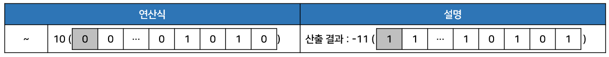

- 비트 반전 연산자를 사용할 때 <u>주의할 점</u>
  - <u>비트 반전 연산자 산출 타입은 <b>int 타입</b></u>이 된다.

- 피연산자는 연산을 수행하기 전에 int 타입으로 변환되고, 비트 반전이 일어난다.
  - 그러므로 아래의 코드는 컴파일 에러가 발생한다.

```java
byte v1 = 10;
byte v2 = ~v1;	// 컴파일 에러
```

- 아래처럼 변경되어야 한다.

```java
byte v1 = 10;
int v2 = ~v1;
```

- 비트 반전 연산자의 결과를 이용하면 부호가 반대인 정수를 구할 수 있다.
  - 간단하게 부호 연산자인 - 를 이용해도 되지만, 비트 반전 연산자의 산출값에 1을 더하면 부호가 반대인 정수를 얻을 수 있다.
  - 예를들어 10을 비트 반전하면 -11을 얻는데, 여기에 1을 더하면 -10을 얻는다.

```java
byte v1 = 10;
int v2 = ~v1 + 1;	// -10이 v2에 저장됨
```

- 자바는 정수값을 총 32비트의 이진 문자열로 리턴하는 `Interger.toBinaryString()` 메소드를 제공한다.

```java
String v1BinaryString = Integer.toBinaryString(10);
```

- `Integer.toBinaryString()` 메소드는 앞의 비트가 모두 0이면 0은 생략되고나머지 문자열만 리턴한다.
  - 그러므로 총 32개의 문자열을 모두 얻기 위해서는 아래와 같은 메소드가 필요하다.

```java
// 리턴하는 str의 문자 수를 조사해서 32보다 작으면 앞에 0을 붙이도록 함
public static String toBinaryString(int value) {
    String str = Integer.toBinaryString(value);
    while(str.length() < 32) {
        str = "0" + str;
    }
    return str;
}
```

```java
public class BitReverseOperatorExample {
    
    public static void main(String[] args) {
        int v1 = 10;
        int v2 = ~v1;
        int v3 = ~v1 + 1;
        
        System.out.println(toBinaryString(v1) + " (십진수: " + v1 + ")");
        System.out.println(toBinaryString(v2) + " (십진수: " + v2 + ")");
        System.out.println(toBinaryString(v3) + " (십진수: " + v3 + ")");
        System.out.println();
        // 00000000000000000000000000001010 (십진수: 10)
        // 11111111111111111111111111110101 (십진수: -11)
        // 11111111111111111111111111110110 (십진수: -10)
        
        int v4 = -10;
        int v5 = ~v4;
        int v6 = ~v4 + 1;
        
        System.out.println(toBinaryString(v4) + " (십진수: " + v4 + ")");
        System.out.println(toBinaryString(v5) + " (십진수: " + v5 + ")");
        System.out.println(toBinaryString(v6) + " (십진수: " + v6 + ")");
        System.out.println();
        // 11111111111111111111111111110110 (십진수: -10)
        // 00000000000000000000000000001001 (십진수: 9)
        // 00000000000000000000000000001010 (십진수: 10)
    }
    
    public static String toBinaryString(int value) {
        String str = Integer.toBinaryString(value);
        while(str.length() < 32) {
            str = "0" + str;
        }
        return str;
    }
    
}
```

## 이항 연산자

- <b>이항 연산자</b>는 피연산자가 두개인 연산자를 말하며 여기에는
  - 산술 연산자(+, -, *, /, %)
  - 문자열 연결 연산자(+)
  - 대입 연산자(=, +=, -=, *=, /=, %=, &=, ^=, |=, <<=, >>=, >>>=)
  - 비교 연산자(<, <=, >, >=, ==, !=)
  - 논리 연산자(&&, ||, &, |, ^, !)
  - 비트 논리 연산자(&, |, ^)
  - 비트 이동 연산자(<<, >>, >>>) 등이 있다.

### 산술 연산자(+, -, *, /, %)

- 일반적으로 말하는 사칙연산인 더하기(+), 빼기(-), 곱하기(*), 나누기(/)와 나머지를 구하는 연산자(%)를 포함해서 산술 연산자는 총 5개이다.
  - 이 산술 연산자는 <u>boolean 타입을 제외한 모든 기본 타입에 사용</u>할 수 있다.

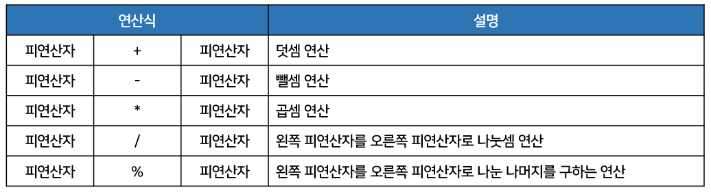

- <u>주의할 점</u>
  - <u>곱셈</u>의 경우 연산자가 x 가 아니라 <u>*를 사용</u>하고 <u>나눗셈</u>의 경우 <u>/를 사용</u>한다. 
- % 연산자는 나눗셈을 수행하고, 몫이 아닌 <u>나머지를 돌려주는 연산자</u>이다.
  - 예를 들어 `int result = num % 3;`에서 result에 저장되는 값은 num의 값에 따라 0, 1, 2 중 한 값
    - 왜냐하면 어떤 수를 3으로 나누었을 경우 나머지는 세 숫자 중 하나이기 때문

- 산술 연산자의 특징은 <u>피연산자들의 타입이 동일하지 않을 경우</u> 아래와 같은 규칙을 사용해서 <u>피연산자들의 타입을 일치시킨 후 연산</u>을 수행한다.
  - 피연산자들이 모두 정수 타입이고, int 타입(4byte)보다 크기가 작은 타입일 경우 모두 int 타입으로 변환 후, 연산을 수행한다. 따라서 연산의 산출 타입은 int이다.  
    `ex) byte + byte → int + int = int`
  - 피연산들이 모두 정수 타입이고, long 타입이 있을 경우 long 타입으로 변환 후, 연산을 수행.  
    따라서 연산 산출 타입은 long이다.  
    `ex) int + long → long + long = long`
  - 피연산자 중 실수 타입(float, double)이 있을 경우, 크기가 큰 실수 타입으로 변환 후, 연산을 수행.  
    따라서 연산의 산출 타입은 실수 타입이다.  
    `ex) int + double → double + double = double`

- 즉 long을 제외한 정수 타입 연산은 int 타입으로 산출되고, 피연산자 중 하나라도 실수 타입이면 실수 타입으로 산출된다. 그러므로 아래의 코드는 컴파일 에러가 발생한다.

```java
byte byte1 = 1;
byte byte2 = 1;
byte byte3 = byte1 + byte2;
```

- 상식적으로 생각하면 byte1과 byte2를 덧셈하면 2가 나오고, 2는 1byte로 표현 가능한 수이므로 byte 타입 변수인 byte3에 저장할 수 있을 것 같지만, 컴파일 에러가 발생한다.

- <u>long 타입을 제외한 정수의 산술 연산은 무조건 <b>int 타입</b>으로 변환 후 연산을 수행</u>하고, 산출 타입이 int이기 때문에 int 타입 변수에 산출값을 대입해야 한다. 그러므로 아래처럼 수정해야한다.

```java
int result1 = byte1 + byte2;
```

- 정수 타입 연산의 결과가 int  타입으로 나오는 이유는 자바 가상 기계(JVM)가 기본적으로 32비트 단위로 계산하기 때문이다.

```java
// 또 다른 예시
int int1 = 10;
int int2 = 4;
int result2 = int1 / int2;
double result3 = int1 / int2;
```

- 상식적으로 생각하면 int1과 int2를 나눗셈하면 2.5가 나온다.
  - 하지만 연산 결과는 소수점 이하 부분을 버리고 2만 산출된다.  
    따라서 result2에는 2가 저장된다.

- 그렇다면 result3은 double 타입 변수이므로 2.5가 저장이 될까?
  - 연산 후의 결과가 2이므로 2를 실수화해서 2.0이 저장된다.

- 만약 2.5를 산출 결과로 얻고 싶다면 피연산자 중 최소한 하나는 실수 타입이어야 한다.
  - 따라서 아래처럼 1.0을 곱해서 실수 타입으로 만든 후 산술 연산을 하거나 int1과  int2중 하나를 double 타입으로 강제 타입 변환(캐스팅)한 후 산술 연산을 하면 된다.

```java
double result3 = (int1+1.0) / int2;
double result3 = (double) int1 / int2;
double result3 = int1/ (double) int2;
```

```java
public class ArithmeticOperatorExample {
    
	public static void main(String[] args) {
		int v1 = 5;
		int v2 = 2;
		
		int result1 = v1 + v2;
		System.out.println("result1=" + result1);	// 7
		
		int result2 = v1 - v2;
		System.out.println("result2=" + result2);	// 3
		
		int result3 = v1 * v2;
		System.out.println("result3=" + result3);	// 10
		
		int result4 = v1 / v2;
		System.out.println("result4=" + result4);	// 2
		
		int result5 = v1 % v2;
		System.out.println("result5=" + result5);	// 1
		
		double result6 = (double) v1 / v2;
		System.out.println("result6=" + result6);	// 2.5
	}
    
}
```

- char 타입도 정수 타입이므로 산술 연산이 가능하다.
  - 주의할 점은 char 타입이 산술 연산이 될 경우 int 타입으로 변환되므로 산출 타입은 int타입이다.  
    따라서 다음의 예제는 컴파일 에러가 발생한다.

```java
public class CharOperationExample {
    
	public static void main(String[] args) {
		char c1 = 'A' + 1;
		char c2 = 'A';
		//char c3 = c2 + 1;		//컴파일 에러
		System.out.println("c1: " + c1);	// B
		System.out.println("c2: " + c2);	// A
		//System.out.println("c3: " + c3);
	}
    
}
```

- 'A' + 1은 리털러 문자 'A'에 1을 더한 것인데, 문자 A는 65라는 유니코드를 가지므로 'A' + 1은 66이 된다.
  - 따라서 66인 유니코드는 문자 B이므로 c1에는 문자 B가 저장된다.
- 자바는 리터럴 간의 연산은 타입 변환 없이 해당 타입으로 계산하기 때문에 `char c1 = 'A' + 1;` 부분은 아무런 문제가 없다.
  - 그러나 c2에 1을 더하면 c2는 int 타입으로 변환되고 1과 연산이 되기 때문에 산출 타입은 int 타입이 된다. 
  - 따라서 char 타입 변수 c3에 대입을 할 수 없어 컴파일 에러가 발생한다.  
    그러므로 아래와 같이 강제 타입 변환(캐스팅)을 해서 char 타입으로 얻어야 한다.

```java
char c3 = (char) (c2 + 1);
```

#### 오버플로우 탐지

- 산술 연산을 할 때 <u>주의할 점</u>
  - 연산 후의 산출값이 산출 타입으로 충분히 표현 가능한지 살펴봐야 한다.
  - 산출 타입으로 표현할 수 없는 값이 산출되었을 경우, <b>오버플로우</b>가 발생하고 쓰레기값(엉뚱한 값)을 얻을 수 있다.

```java
public class OverflowExample {
    
	public static void main(String[] args) {
		int x = 1000000;
		int y = 1000000;
		int z = x * y;
		System.out.println(z);
	}
    
}
```

- 위의 코드를 실행해보면 x와 y는 int 타입이고 x * y 역시 int 타입이므로 연산의 산출 타입은 int 타입이다.
  - 컴파일 에러는 발생하지 않지만, 변수 z에는 올바른 값이 저장되지 않는다.
  - 왜냐하면 1000000 * 1000000 은 10<sup>6</sup> * 10<sup>6</sup> = 10<sup>12</sup>이 되어 int 타입에 저장될 수 있는 값의 <u>범위를 초과</u>하기 때문이다.
    - 그러므로 <u>쓰레기값</u>인 -727369968을 얻게 된다.  
      올바른 값을 얻기 위해서는 변수 x와 y중 하나라도 long 타입이 되어야 하고, 변수 z가 long 타입이어야 한다.

```java
public class OverflowExample {
    
	public static void main(String[] args) {
		long x = 1000000;
		long y = 1000000;
		long z = x * y;
		System.out.println(z);
	}
    
}
```

- 위의 코드처럼 피연산자의 값을 직접 리터럴로 주는 경우는 드물다.
  - 대부분 사용자로부터 입력받거나 프로그램 실행 도중에 생성되는 데이터로 산술 연산이 수행된다.
  - 이런 경우 바로 산술 연산자(+, -, *, /)를 사용하지 말고 메소드를 이용하는 것이 좋다.
  - 메소드는 산술 연산을 하기 전에 피연산자들의 값을 조사해서 오버플로우를 탐지할 수 있다.

```java
public class CheckOverflowExample {
    
	public static void main(String[] args) {
		try {
			int result = safeAdd(2000000000, 2000000000);
			System.out.println(result);
		} catch(ArithmeticException e) {
			System.out.println("오버플로우가 발생하여 정확하게 계산할 수 없음");
		}
	}
	
	public static int safeAdd(int left, int right)  {
		if((right>0)) { 
			if(left>(Integer.MAX_VALUE - right)) {
				throw new ArithmeticException("오버플로우 발생");
			}
		} else {	// right<=0 일 경우
			if(left<(Integer.MIN_VALUE - right)) {
				throw new ArithmeticException("오버플로우 발생");
			}
		}
		return left + right;
	}
    
}
```

- safeAdd() 메소드는 두 개의 매개값을 산술 연산하기 전에 어떤 범위의 값인지 조사해서 연산 시 오버플로우가 생길 것 같으면 ArithmeticException 예외를 발생시킨다.
- main() 메소드는 예외가 발생될 경우 "오버플로우가 발생하여 정확하게 계산할 수 없음"을 출력한다.
  - 그러므로 safeAdd() 메소드는 두 개의 매개값을 더해도 안전한 경우에만 더한 결과를 리턴한다. 

#### 정확한 계산은 정수 사용

- 정확하게 계산을 할 때는 부동소수점(실수) 타입을 사용하지 않는 것이 좋다.
- 아래의 예제를 보았을 때, main() 메소드는 사과 1개를 0.1 단위 10조각으로 보고, 그 중 7조각(0.7)을 뺀 3조각(0.3)을 result 변수에 저장한다.
  - result 변수는 0.3일 것으로 예상이 된다.

```java
public class AccuracyExample1 {
    
	public static void main(String[] args) {
		int apple = 1;
		double pieceUnit = 0.1;
		int number = 7;
		
		double result = apple - number*pieceUnit;
		
		System.out.println("사과 한개에서 ");
		System.out.println("0.7 조각을 빼면, ");
		System.out.println(result + " 조각이 남는다.");
	}
    
}
```

- 하지만 출력은 0.29999999999999993이 되어 정확히 0.3이 되지 않는다.
  - 왜냐하면 이진 포맷의 가수를 사용하는 부동소수점 타입(float, double)은 <b>0.1을 정확히 표현할 수 없어</b> 근사치로 처리하기 때문이다.
  - 정확한 계산이 필요하다면 아래처럼 정수 연산으로 변경해서 계산해야 한다.

```java
public class AccuracyExample2 {
    
	public static void main(String[] args) {
		int apple = 1;
		
		int totalPieces = apple * 10;
		int number = 7;
		int temp = totalPieces - number;
		
		double result = temp/10.0; 
		
		System.out.println("사과 한개에서 ");
		System.out.println("0.7 조각을 빼면, ");
		System.out.println(result + " 조각이 남는다.");	// 0.3
	}
    
}
```

#### NaN Infinity 연산

- / 또는 % 연산자를 사용할 때 주의할 점
  - 좌측 피연산자가 정수 타입인 경우 나누는 수인 우측 피연산자는 0을 사용할 수 없다.
  - 만약 0으로 나누면 컴파일은 정상적으로 되지만, 실행 시 <b>ArithmeticException(예외)</b>이 발생한다.

```java
5 / 0 → ArithmeticException 예외 발생
5 % 0 → ArithmeticException 예외 발생
```

- 자바는 프로그램 실행 도중 예외가 발생하면 실행이 즉시 멈추고 프로그램은 종료된다.
  - ArithmeticException이 발생했을 경우 프로그램이 종료되지 않도록 하려면 <u>예외 처리</u>를 해야 한다.
  - 예외 처리는 <u>예외가 발생</u>되었을 경우, <u>catch 블록을 실행</u>하도록 하는 것이다.

```java
try {
    //int z = x / y;				// y가 0일경우
    int z = x % y;					// ArithmeticException 발생됨
    System.out.println("Z: " + z);
} catch(ArithmeticException e) {	// 예외처리
    System.out.println("0으로 나누면 안됨");
}
```

- 그러나 실수 타입인 0.0 또는 0.0f로 나누면 ArithmeticException이 발생하지 않고,  
  / 연산의 결과가 Infinity(무한대) 값을 가지며, % 연산의 결과는 NaN(Not a Number)을 가진다.

```java
5 / 0.0 → Infinity
5 % 0.0 → NaN
```

- <u>주의할 점</u>
  - /와 % 연산의 결과가 Infinity 또는 NaN이 나오면 다음 연산을 수행해서는 안 된다.
    - 왜냐하면 이 값(Infinity 또는 NaN)과 산술 연산을 하면 어떤 수와 연산하더라도 Infinity와 NaN이 산출되어 <u>데이터가 엉망</u>이 될 수 있기 때문

```java
Infinity + 2 → Infinity
NaN + 2 → NaN
```

- 프로그램 코드에서 /와 % 연산의 결과가 Infinity 또는 NaN인지 확인하려면 `Double.isInfinite()`와 `Double.isNaN()` 메소드를 이용하면 된다.
  - 이 메소드들은 double 타입의 값을 매개값으로 받아 이 값이 Infinity 또는 NaN이라면 true를,  
    그렇지 않다면 false를 리턴한다.

```java
public class InfinityAndNaNCheckExample {
    
	public static void main(String[] args) {
        // 0.0으로 나눌때
		int x = 5;
		double y = 0.0;
		
		double z = x / y;
		//double z = x % y;
		
		System.out.println(Double.isInfinite(z));	// true
		System.out.println(Double.isNaN(z));		// false
		
		System.out.println(z + 2);		// 문제되는 코드
		
		if(Double.isInfinite(z) || Double.isNaN(z)) { // false일 경우에만 else로 빠져 연산
			System.out.println("값 산출 불가"); 
		} else { 
			System.out.println(z + 2); 
		}
		
		// 0 으로 나눌때 예외처리
		
		/*int x = 5;
		int y = 0;
		
		try {
			//int z = x / y;
			int z = x % y;
			System.out.println("z: " + z);
		} catch(ArithmeticException e) {
			System.out.println("0으로 나누면 안됨");
		}*/
	}
    
}
```

#### 입력값의 NaN 검사

- 부동소수점(실수)을 입력받을 때는 <b><u>반드시 NaN 검사</u></b>를 해야 한다.
- 아래의 예제에서 부동소수점으로 변환이 가능한 <u>문자열</u>을 입력받는다면 악의성 있는 사용자는 숫자로 변환이 안 되는 "NaN"을 입력할 수도 있다.

```java
public class InputDataCheckNaNExample1 {
    
	public static void main(String[] args) {
		String userInput = "NaN";	// 사용자가 입력한 값 NaN
		double val = Double.valueOf(userInput);	// 입력값을 double 타입으로 변환
		
		double currentBalance = 10000.0;
		
		currentBalance += val;	// currentBalance에 NaN이 저장됨
		System.out.println(currentBalance);	// NaN
	}
    
}
```

- "NaN" 문자열은 `Double.valueOf()` 메소드에 의해 double 타입으로 변환되면 NaN이 된다.
  - 그러면 val에는 NaN이 저장되는데, NaN은 산술 연산이 가능한것이 문제이다.
  - NaN과 어떠한 수가 연산되면 결과는 NaN이 산출되어 데이터가 엉망이 된다.

- 위의 코드에서 currentBalance에 10000.0을 저장하고 NaN과 더하기 연산을 수행하면 변수에는 NaN이 저장되어 원래 데이터가 없어져 버린다.
  - 그렇기 때문에 사용자로부터 문자열을 입력받을 때에는 <u>반드시 "NaN"인지를 조사</u>하고 만약 "NaN"이라면 NaN과 산술 연산을 수행해서는 안 된다.

```java
public class InputDataCheckNaNExample2 {
    
	public static void main(String[] args) {
		String userInput = "NaN";
		double val = Double.valueOf(userInput);
		
		double currentBalance = 10000.0;
		
		if(Double.isNaN(val)) {	// NaN을 검사한다.
			System.out.println("NaN이 입력되어 처리할 수 없음");
			val = 0.0;
		} 
		
		currentBalance += val;	// 원래값을 유지할 수 있다.
		System.out.println(currentBalance);	// 10000.0
	}
    
}
```

- 조건식에 `Double.isNaN()` 메소드를 이용해서 변수 val의 값이 NaN인지를 검사한다.

- <u>주의할 점</u>
  - NaN인지 조사를 할 때 <u>== 연산자를 사용하면 안 된다</u>.
  - 왜냐하면 NaN은 != 연산자를 제외한 모든 비교 연산자를 사용할 경우 false값을 리턴하기 때문

- NaN인지 검사를 하려면 반드시 `Double.isNaN()` 을 사용해야 한다.
  - `Double.isNaN()` 메소드는 매개값이 NaN 이라면 true를 리턴한다. 

### 문자열 연결 연산자(+)

- <b>문자열 연결 연산자</b>인 +는 문자열을 서로 결합하는 연산자이다.
  - \+ 연산자는 산술 연산자, 부호 연산자인 동시에 문자열 연결 연산자이기도 하다.
- 피연산자 중 한쪽이 문자열이면 + 연산자는 문자열 연결 연산자로 사용되어 다른 피연산자를 문자열로 변환하고 서로 결합한다.
  - 예를 들어 아래 코드에서는 변수 str1에 "JDK6.0"이 저장되고, str2는 문자열"JDK6.0 특징"이 저장된다.

```java
String str1 = "JDK" + 6.0;	// "JDK6.0" 
String str2 = str1 + " 특징";	// "JDK6.0 특징"
```

- 간혹 + 연산자가 산술 연산자인지 문자열 연결 연산자인지 판단하기 어려운 경우가 있다.
  - 아래 코드의 결과를 예상해보자.  

```java
"JDK" + 3 + 3.0;
```

- 문자열과 숫자가 혼합된 + 연산식은 왼쪽에서부터 오른쪽으로 연산이 진행된다.
  - 따라서 "JDK" + 3이 먼저 연산되어 "JDK3"이라는 문자열이 되고, 이것을 다시 3.0과 연산해 "JDK33.0" 이라는 문자열 결과가 나온다.

```
3 + 3.0 + "JDK";
```

- 3 + 3.0 이 먼저 연산되어 6.0 이라는 실수값이 되고 이것을 "JDK"와 연산해 "6.0JDK"라는 결과가 나온다.
  - 어떤 것이 먼저 연산되느냐에 따라 다른 결과가 나오기 때문에 주의해야 한다.

```java
public class StringConcatExample {
    
	public static void main(String[] args) {
		String str1 = "JDK" + 6.0;
		String str2 = str1 + " 특징";
		System.out.println(str2);	// JDK6.0 특징
		
		String str3 = "JDK" + 3 + 3.0;
		String str4 = 3 + 3.0 + "JDK";
		System.out.println(str3);	// JDK33.0
		System.out.println(str4);	// 6.0JDK
	}
    
}
```

### 비교 연산자(<, <=, >, >=, ==, !=)

- <b>비교 연산자</b>는 대소(<, <=, >, >=) 또는 동등(==, !=)을 비교해서 boolean 타입인 true/false를 산출한다.
  - 대소 연산자는 boolean 타입을 제외한 기본 타입에 사용할 수 있고, 동등 연산자는 모든 타입에 사용될 수 있다.
- 비교 연산자는 흐름 제어문인 조건문(if), 반복문(for, while)에서 주로 이용되어 실행 흐름을 제어할 때 사용된다.

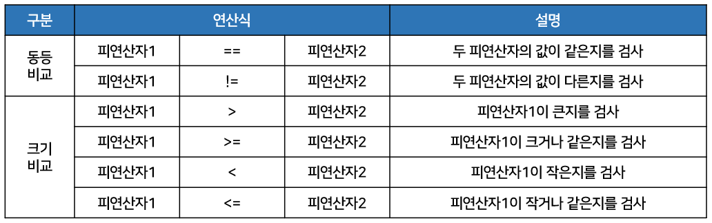

- 만약 피연산자가 char 타입이면 유니코드 값으로 비교 연산을 수행한다.
  - 예를 들어 'A'의 유니코드는 65이고, 'B'의 유니코드는 66이므로 비교 연산자는 65와 66을 비교하게 된다.

```
('A' < 'B') → (65 < 66)
```

```java
public class CompareOperatorExample1 {
    
	public static void main(String[] args) {
		int num1 = 10;
		int num2 = 10;
		boolean result1 = (num1 == num2);	// true 
		boolean result2 = (num1 != num2); 	// false
		boolean result3 = (num1 <= num2);	// true
		System.out.println("result1=" + result1);	// true 
		System.out.println("result2=" + result2);	// false
		System.out.println("result3=" + result3);	// true
		
		char char1 = 'A';
		char char2 = 'B';
		boolean result4 = (char1 < char2);	// true
		System.out.println("result4=" + result4);	// true	
	}
    
}
```

- 비교 연산자에서도 연산을 수행하기 전에 타입 변환을 통해 피연산자의 타입을 일치시킨다.
  - 예를 들어 'A' ==65는 'A'가 int 타입으로 변환되어 65가 된 다음 65==65로 비교한다.
  - 마찬가지로 3==3.0에서 3은 int 타입이고 3.0은 double 타입이므로 int 타입인 3을 보다 큰 타입은 double 타입으로 변환한 다음 3.0==3.0으로 비교한다.

```
'A' == 65 → true
3 == 3.0 → true
```

- 그러나 <u>한 가지 예외</u>가 있다.
  - 0.1 == 0.1f와 같은 경우, 생각해보면 0.1f가 좌측 피연산자의 타입인 double로 변환되어 0.1==0.1이 되고 true가 산출되어야 할 것 처럼 보인다.
  - 그러나 결과값은 false가 산출된다.

```
0.1 == 0.1f → false
```

- 그 이유는 이진 포맷의 가수를 사용하는 <u>모든 부동소수점 타입은 <b>0.1을 정확히 표현할 수가 없어</b></u>서 0.1f는 0.1의 근사값으로 표현되어 0.10000000149011612와 같은 값이 되기 때문에 0.1보다 큰 값이 된다.
  - 해결책으로 아래의 코드처럼 피연산자를 모두 float 타입으로 강제 타입 변환한 후에 비교 연산하거나
  - <u>정수로 변환</u>해서 비교하면 된다.

```java
public class CompareOperatorExample2 {
    
	public static void main(String[] args) {
		int v2 = 1;
		double v3 = 1.0;
		System.out.println(v2 == v3);	// true
		
		double v4 = 0.1;
		float v5 = 0.1f;
		System.out.println(v4 == v5);	// false
		System.out.println((float)v4 == v5);	// true
		System.out.println((int)(v4*10) == (int)(v5*10));	// true
	}
    
}
```

- String 타입의 문자열을 비교할 때에는 대소(<, <=, >, >=) 연산자를 사용할 수 없다.
  - 동등(==, !=) 비교 연산자는 사용할 수 있으나 문자열이 같은지, 다른지를 비교하는 용도로는 사용되지 않는다.
- 기본 타입인 변수의 값을 비교할 때에는 == 연산자를 사용하지만 참조 타입인String 변수를 비교할 때 == 연산자를 사용하면 원하지 않는 결과가 나올 수도 있다.

```java
String strVar1 = "자바";
String strVar2 = "자바";
String strVar3 = new String("자바");
```

- 자바는 <u>문자열 리터럴이 동일</u>하다면 <u>동일한 String 객체</u>를 참조하도록 되어 있다.
  - 그래서 변수 strVar1과 strVar2는 동일한 String 객체의 번지값을 가지고 있다.
  - 그러나 변수 strVar3은 객체 생성 연산자인 new로 생성한 새로운 String 객체의 번지값을 가지고 있다.

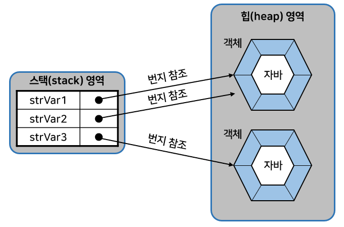

- 그렘에서 변수 strVar1과 strVar2의 == 연산은 true를 산출하고 strVar2와 strVar3의 == 연산은 false를 산출한다.  

- == 연산자는 변수에 저장된 값만 비교하기 때문에 이런 결과가 나온다.

```
strVar1 == strVar2 → true
strVar2 == strVar3 → false
```

- 동일한 String 객체이건 다른 String 객체이건 상관없이 String 객체의 <u>문자열만을 비교하고 싶다면</u> == 연산자 대신 <u>equals() 메소드</u>를 사용해야 한다.
  - equals() 메소드는 원본 문자열과 매개값으로 주어진 비교 문자열이 동일한지 비교한 후 true 또는 false를 리턴한다.

```java
boolean result = str1.equals(str2);
```

- 아래의 코드는 strVar1의 문자열과 strVar2의 문자열이 같은지 비교한다.  
  그리고 strVar2의 문자열과 strVar3의 문자열이 같은지 비교한다.

```
strVar1.equals(strVar2) → true
strVar2.equals(strVar3) → true
```

```java
public class StringEqualsExample {
    
	public static void main(String[] args) {
		String strVar1 = "자바";
		String strVar2 = "자바";
		String strVar3 = new String("자바");

		System.out.println( strVar1 == strVar2);	// true
		System.out.println( strVar1 == strVar3);	// false
		System.out.println();
		System.out.println( strVar1.equals(strVar2));	// true
		System.out.println( strVar1.equals(strVar3));	// true
	}
    
}
```

### 논리 연산자(&&, ||, &, |, ^, !)

- <b>논리 연산자</b>는 논리곱(&&), 논리합(||), 배타적 논리합(^) 그리고 논리 부정(!) 연산을 수행한다.
  - 논리 연산자의 피연산자는 boolean 타입만 사용할 수 있다.  
    다음은 논리 연산자의 종류와 기능을 설명한 표이다.

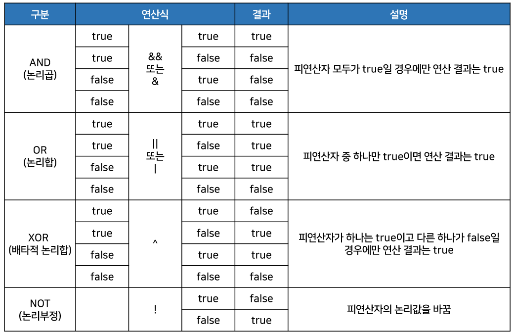

- &&와 &는 산출 결과는 같지만 연산 과정이 조금 다르다.  
  - &&는 앞의 피연산자가 false라면 뒤의 피연산자를 평가하지 않고 바로 false라는 산출 결과를 낸다.
  - 왜냐하면 하나라도 false라면 전체 연산식은 false이기 때문이다.

- 그러나 &는 두 피연산자 모두를 평가해서 산출 결과를 낸다.
  - 따라서 &보다 &&가 더 효율적으로 동작한다.

- ||와 |도 마찬가지이다.
  - ||는 앞의 피연산자가 true라면 뒤의 피연산자를 평가하지 않고 바로 true라는 산출 결과를 낸다.
  - 왜냐하면 하나라도 true이면 전체 연산식은 true이기 때문이다.
- 그러나 |는 두 피연산자 모두를 평가해서 산출 결과를 낸다.
  - 따라서 |보다는 ||보다 더 효율적으로 동작한다.
- 논리 연산은 흐름 제어문인 조건문(if), 반복문(for, while) 등에서 주로 이용된다.
  - 아래의 예제처럼 if문의 괄호() 안에는 조건식이 오는데, 조건식은 비교 연산자와 논리 연산자들이 주로 사용된다.
  - if문의 조건식이 true라면 블록을 실행하고 false라면 블록을 실행하지 않는다.

```java
package sec04.exam04_logical;
public class LogicalOperatorExample {
    
	public static void main(String[] args) {
		int charCode = 'A';		
		
		if( (charCode>=65) & (charCode<=90) ) {
			System.out.println("대문자 이군요.");	// ◀
		}
		
		if( (charCode>=97) && (charCode<=122) ) {
			System.out.println("소문자 이군요.");
		}
		
		if( !(charCode<48) && !(charCode>57) ) {
			System.out.println("0~9 숫자 이군요.");
		}
		
		int value = 6;
		
		if( (value%2==0) | (value%3==0) ) {
			System.out.println("2 또는 3의 배수 이군요.");	// ◀
		}
		
		if( (value%2==0) || (value%3==0) ) {
			System.out.println("2 또는 3의 배수 이군요.");	// ◀
		}		
	}
    
}
```

### 비트 연산자(&, |, ^, ~, <<, >>, >>>)

- <b>비트 연산자</b>는 데이터를 비트(bit) 단위로 연산한다.
  - 즉 0과 1이 피연산자가 된다.
  - 그렇기 때문에 0과 1로 표현이 가능한 <u>정수 타입만</u> 비트 연산을 할 수 있다.

- 실수 타입인 float과 double은 비트연산을 할 수 없다.
- 비트 연산자는 기능에 따라 비트 논리 연산자(&, |, ^, ~)와 비트 이동 연산자(<<, >>, >>>)로 구분된다.
  - 일반 논리 연산자가 true와 false를 연산한다면 비트 논리 연산자는 0과 1을 연산한다.
  - 비트 이동 연산자는 비트를 좌측 또는 우측으로 이동하는 연산자이다.

#### 비트 논리 연산자(&, |, ^)

- <b>비트 논리 연산자</b>에는 &, |, ^, ~가 있다.
  - &, |, ^ 연산자는 <u><b>피연산자</b>가 boolean 타입일 경우에는 일반 논리 연산자</u>이고,
  - <u><b>피연산자</b>가 정수 타입일 경우에는 비트 논리 연산자</u>로 사용된다.

- 다음표는 비트 논리 연산자의 종류와 기능을 설명한 표이다.

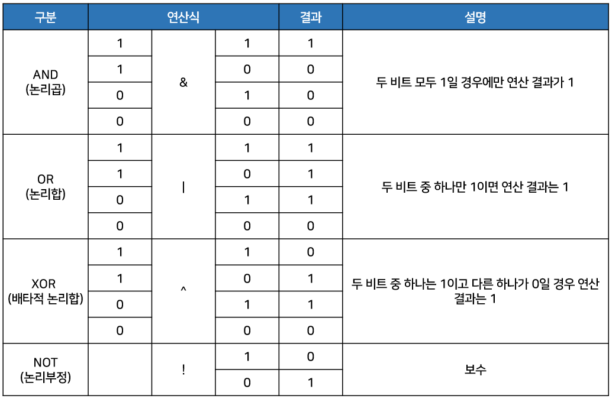

- 예를 들어 45와 25를 비트 논리 연산해보자.
  - 아래는 25와 45를 이진수로 표현한 것이다.

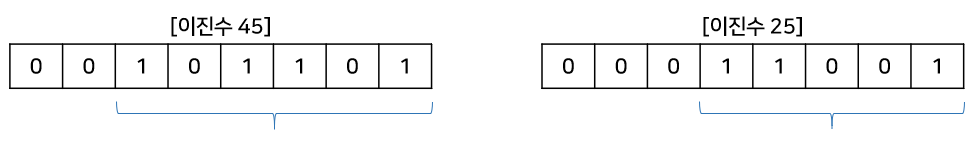

- 45와 25의 비트 논리곱(&)과 논리합(|) 연산을 수행하면 아래와 같다.

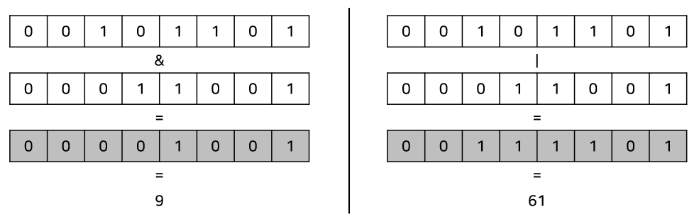

- 비트 연산자는 <u>피연산자를 <b>int 타입</b>으로 자동 타입 변환한 후 연산을 수행</u>한다.
  - 그렇기 때문에 byte, short, char 타입을 비트 논리 연산하면 그 결과는 int 타입이 된다.  
    그래서 아래는 컴파일 에러가 난다.

```java
byte num1 = 45;
byte num2 = 25;
byte result = bum1 & num2;	// 컴파일 에러 → int result = num1 & num2;
```

- 실제로 45와 25의 비트 연산은 4byte인 int 타입으로 변환된 후 아래처럼 연산된다.

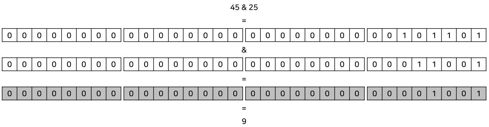

```java
public class BitLogicExample {
    
	public static void main(String[] args) {
		System.out.println("45 & 25 = " + (45 & 25));	// 9	
		System.out.println("45 | 25 = " + (45 | 25));	// 61
		System.out.println("45 ^ 25 = " + (45 ^ 25));	// 52
		System.out.println("~45 = " + (~45));			// -46
		
		System.out.println(toBinaryString(45));	// 45를 2진수로 바꾼값
		System.out.println("&");
		System.out.println(toBinaryString(25));	// 25를 2진수로 바꾼값
		System.out.println("||");
		System.out.println(toBinaryString(45&25));	// 9
	}
	
	public static String toBinaryString(int value) {
		String str = Integer.toBinaryString(value);
		while(str.length() < 32) {	// 32비트에 맞게 0으로 채워주기
			str = "0" + str;
		}
		return str;
	}
    
}
```

#### 비트 이동 연산자(<<, >>, >>>)

- <b>비트 이동(shift) 연산자</b>는 정수 데이터의 비트를 좌측 또는 우측으로 밀어서 이동시키는 연산을 수행한다.
  - 아래는 비트 이동 연산을 수행하는 연산자의 종류와 기능을 설명한 표이다.

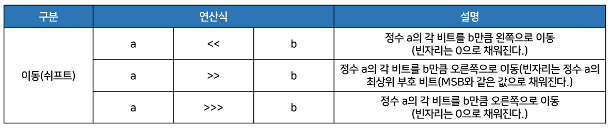

- 아래는 좌측 이동 연산자(<<)를 사용하여 정수 1을 3비트만큼 왼쪽으로 이동시키는 예시이다.

```java
int result = 1 << 3;
```

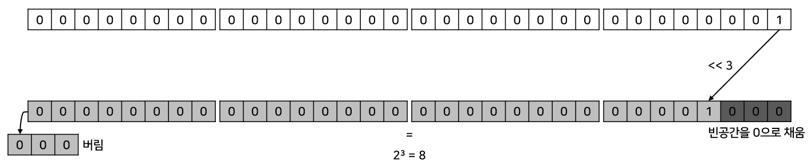

- 32비트 전체를 왼쪽으로 3비트 이동할 때 왼쪽 3비트는 밀려서 버려진다.
  - 그리고 맨 오른쪽에 새로 생기는 3비트는 0으로 채우면 2<sup>3</sup> 이라는 값을 얻게 된다.  
    따라서 result 변수에는 8이 저장된다.

- 이번엔 우측 이동 연산자 (>>)를 사용해 정수 -8을 3비트만큼 오른쪽으로 이동시키는 예시이다.

```java
int result = -8 >> 3;
```

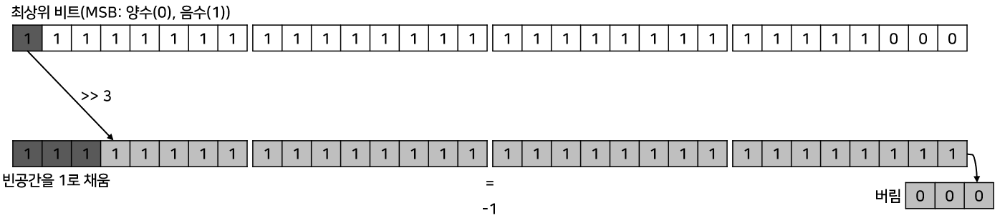

- 32비트 전체를 오른쪽으로 이동할 때 맨 오른쪽 3비트는 밀려서 버려진다.
  - 그리고 맨 왼쪽에 새로 생기는 3비트는 <b>최상위 부호비트(MSB)와 동일한 값</b>으로 채워진다.  
    따라서 -8은 최상위 부호비트가 1이므로 맨 위쪽 빈 공간은 1로 채워진다.
  - 32비트가 모두 1이면 정수 -1이므로 변수 result에는 -1이 저장된다.

- 이번에는 우측 이동 연산자(>>>)를 사용하여 정수 -8을 3비트만큼 오른쪽으로 이동시키는 예시이다.

```java
int result = -8 >>> 3;
```

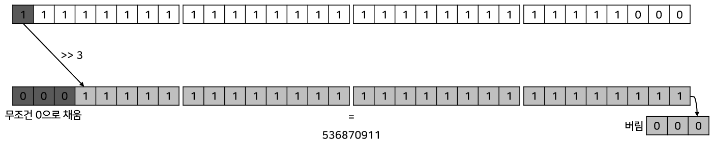

- 32비트 전체를 오른쪽으로 3비트 이동할 때 맨 오른쪽 3비트는 밀려서 버려진다.
  - 그리고 맨 왼쪽에 새로 생기는 3비트는 <b>무조건 0으로</b> 채워진다.  
    이렇게 변환된 이진수를 십진수로 변환하면 536870911 이라는 값을 얻을 수 있다.

```java
public class BitShiftExample {
    
	public static void main(String[] args) {
		System.out.println("1 << 3 = " + (1<<3));		// 1 << 3 = 8		
		System.out.println("-8 >> 3 = " + (-8>>3));		// -8 >> 3 = -1
		System.out.println("-8 >>> 3 = " + (-8>>>3));	// -8 >>> 3 = 536870911
	}
    
}
```

### 대입 연산자(=, +=, -=, *=, /=, %=, &=, ^=, |=, <<=, >>=, >>>=)

- <b>대입 연산자</b>는 오른쪽 피연산자의 값을 좌측 피연산자인 변수에 저장한다.
  - 오른쪽 피연산자는 리터럴 및 변수, 그리고 다른 연산식이 올 수 있다.
- 단순히 오른쪽 피연산자의 값을 변수에 저장하는 단순 대입 연산자가 있고, 정해진 연산을 수행한 후 결과를 변수에 저장하는 복합 대입 연산자도 있다.
- 아래는 대입 연산자의 종류를 설명한 표이다.

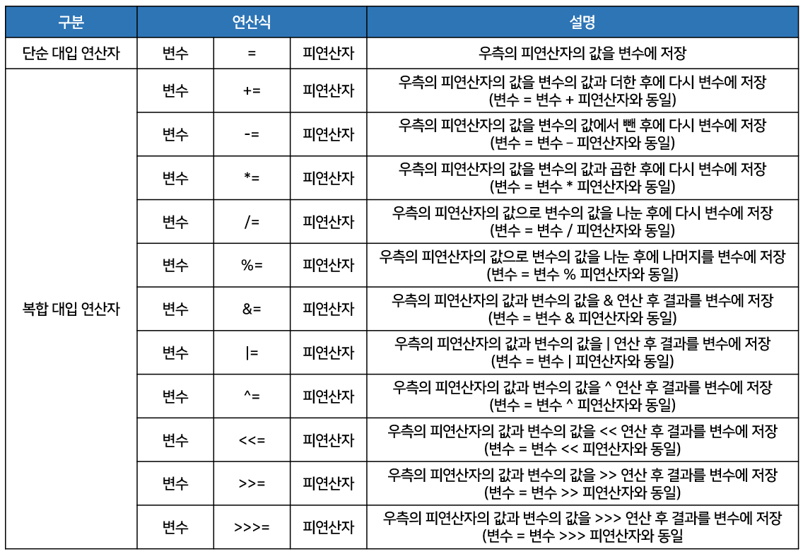

- 대입 연산자는 모든 연산자들 중에서 가장 낮은 연산 순위를 가지고 있기 때문에 제일 마지막에 수행된다.
  - 그리고 연산의 진행 방향이 오른쪽에서 왼쪽이기 때문에 a = b = c = 5;는 아래 그림처럼 연산된다.


```java
public class AssignmentOperatorExample {
    
	public static void main(String[] args) {
		int result = 0;		
		result += 10;
		System.out.println("result=" + result);	// 10	
		result -= 5;
		System.out.println("result=" + result); // 5
		result *= 3;
		System.out.println("result=" + result); // 15
		result /= 5;
		System.out.println("result=" + result); // 3
		result %= 3;
		System.out.println("result=" + result);	// 0
	}
    
}
```

## 삼항 연산자

- <b>삼함 연산자(?:)</b>는 세 개의 피연산자를 필요로 하는 연산자를 말한다.
  - 삼항 연산자는 ? 앞의 조건식에 따라 콜론(:) 앞뒤의 피연산자가 선택된다고 해서 <u>조건 연산식</u>이라 부르기도 한다.
- 아래 그림은 삼항 연산자를 사용하는 방법이다.

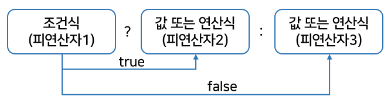

- 조건식을 연산하여 true가 나오면 삼항 연산자의 결과는 피연산자2가 된다.
  - 반면에 조건식을 연산하여 false가 나오면 삼항 연산자의 결과는 피연산자3이 된다.
- 피연산자 2와 3에는 주로 값이 오지만, 경우에 따라서는 연산식이 올 수도 있다.
  - 다음 코드에서 grade 변수에는 무엇이 저장될까?

```java
int score = 95;
char grade = (score>90) ? 'A' : 'B';
```

- (score > 90)을 연산하면 true가 나오므로 연산의 결과는 'A'가 된다.
  - 따라서 grade 변수에는 'A'가 저장된다.
- 위의 코드는 아래 코드와 같다.

```java
int score = 95;
char grade;
if (score > 90) {
    grade = 'A';
} else {
    grade = 'B';
}
```

- 삼항 연산자는 if 문으로 변경해서 작성할 수도 있다.
  - 하지만 한 줄에 간단하게 삽입해서 사용할 경우에는 삼항 연산자를 사용하는 것이 더 효율적이다.

```java
public class ConditionalOperationExample {
    
	public static void main(String[] args) {
		int score = 85;
		char grade = (score > 90) ? 'A' : ( (score > 80) ? 'B' : 'C' );
		System.out.println(score + "점은 " + grade + "등급입니다.");
	}
    
}	// 85점은 B등급입니다.
```
