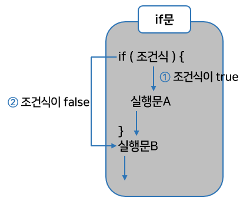
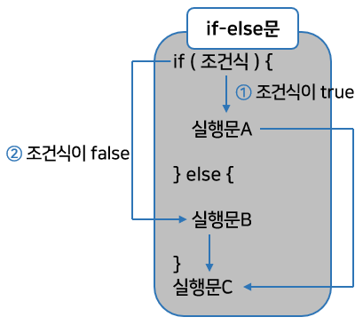
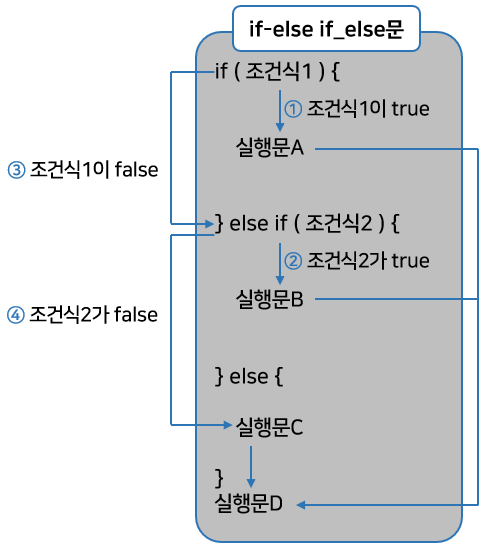
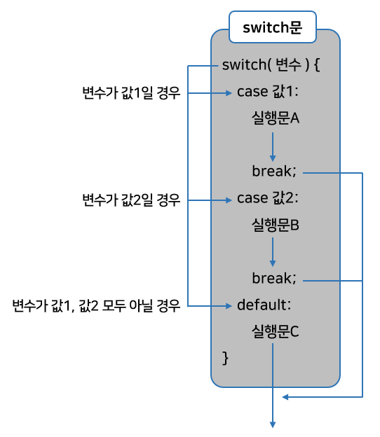
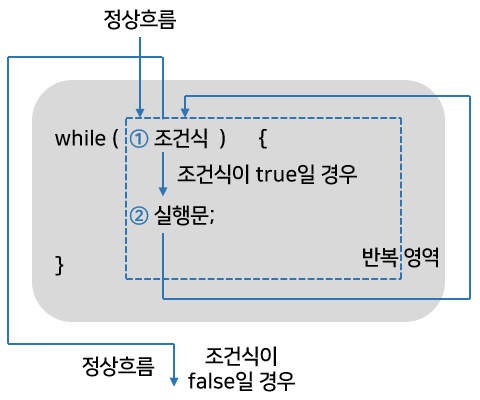

# 조건문과 반복문

## 코드 실행 흐름 제어

- 자바 프로그램을 시작하면 main() 메소드의 시작 중괄호 에서 시작해서 끝 중괄호 까지 <u>위에서부터 아래로 실행하는 흐름</u>을 가지고 있다.
- 이러한 <u>실행 흐름을 개발자가 원하는 방향으로 바꿀 수 있도록</u> 해주는 것이 <b>흐름 제어문</b>이다. 
  - <u>흐름 제어문</u>을 간단히 <b>제어문</b>이라고 한다.
  - 제어문은 조건식과 중괄호 {} 블록으로 구성되는데, 조건식의 연산 결과에 따라 블록 내부의 실행 여부가 결정된다.
- 제어문의 종류는 <b>조건문</b>과 <b>반복문</b>이 있다.
  - 조건문에는 if문, switch문이 있고 반복문에는 for문, while문, do-while문이 있다.
- 제어문 블록이 실행 완료되었을 경우
  - 다시 제어문 처음으로 돌아갈지,
  - 아니면 제어문 블록을 빠져나와 정상 흐름으로 다시 돌아올지는 어떤 제어문을 사용하느냐에 달려 있다
    - 조건문일 경우 정상 흐름으로 <u>돌아온다.</u>
    - 하지만 반복문일 경우는 제어문 처음으로 다시 되돌아가 반복 실행한다.
      - 이것을 루핑(looping) 이라고 한다.

- 제어문 블록 내부에는 또 다른 제어문을 사용할 수 있다.
  - if문 내부에 for문을 가질 수 있고, while문도 가질 수 있다.
  - 그렇기 때문에 개발자가 원하는 매우 복잡한 흐름 제어도 가능하다.

## 조건문(if문, switch문)

### if문

- if문은 조건식의 결과에 따라 블록 실행 여부가 결정된다.
  - 아래의 그림은 if문의 형식과 실행 흐름을 나타낸 것이다.



- 조건식에는 true 또는 false 값을 산출할 수 있는 연산식이나, boolean 변수가 올 수 있다.
  - 조건식이 true이면 블록을 실행하고 false이면 블록을 실행하지 않는다.

```java
if ( 조건식 ) {
    실행문;
    실행문;
    ...
}
```

```java
if ( 조건식 )
    실행문;
```

- 중괄호 {} 블록은 여러 개의 실행문을 하나로 묶기 위해 작성된다.
  - 만약 조건식이 true가 될 때 실행해야 할 문장이 하나 밖에 없다면 생략할 수 있다.
    - 하지만 중괄호{} 블록을 <u>생략하지 않고 작성</u>하는 것이 좋다.
    - 왜냐하면 중괄호 블록을 작성하지 않으면 코드의 가독성이 좋지 않고, 버그 발생의 원인이 될 수 있다.

```java
// 예제 코드
public class IfExample {
    
	public static void main(String[] args) {
		int score = 93;
		
		if (score >= 90) {
			System.out.println("점수가 90보다 큽니다.");
			System.out.println("등급은 A 입니다.");
		}
		
		if (score < 90) 
			System.out.println("점수가 90보다 작습니다.");
			System.out.println("등급은 B 입니다.");	// ◀ 들여쓰기만 되어있는 실행문
	}
    
}	// 점수가 90보다 큽니다.
	// 등급은 A 입니다.
	// 등급은 B 입니다.
```

- 위 코드를 보면 score 변수의 값이 93이므로 if 조건식은 93 >= 90이 되어 true가 된다.
  - 따라서 중괄호 블록의 실행문은 모두 실행되어서 "점수가 90보다 큽니다."와 "등급은 A 입니다."가 출력된다.  
  - 그리고 다음 if 조건식은 93 < 90이 되어 false가 되므로 ""점수가 90보다 작습니다."는 출력되지 않는다.
- 하지만 그 다음 라인이 문제이다.
  - 의도한 것은 점수가 90보다 작을 때 "등급은 B 입니다." 를 출력하고 싶었다.
  - 하지만 실행 결과를 보면 점수와는 상관없이 해당 라인은 무조건 실행된다.
    - 이유는 두 번째 if문은 중괄호 블록이 없어 `System.out.println("점수가 90보다 작습니다.");` 라인까지만 영향을 미치기 때문이다.
    - 그 다음 `System.out.println("등급은 B 입니다.");`라인은 들여쓰기만 되었을 뿐 if문과는 아무런 관련이 없다.

### if-else문

- if문은 else 블록과 함께 사용되어 조건식의 결과에 따라 실행 블록을 선택한다.
  - if문의 조건식이 true이면 if문의 블록이 실행되고, 조건식이 false이면 else 블록이 실행된다.
  - 조건식의 결과에 따라 이 두 개의 블록 중 어느 한 블록의 내용만 실행하고 전체 if문을 벗어나게 된다.  
    아래의 그림은 if-else 문의 형식과 실행 흐름을 보여준다.



- 위의 예제에서는 2개의 if문을 이용하였는데, 아래와 같이 if-else 문으로 간단히 처리하는 것이 더욱 간결하다.

```java
public class IfElseExample {
    
	public static void main(String[] args) {
		int score = 85;
		
		if (score >= 90) {
			System.out.println("점수가 90보다 큽니다.");
			System.out.println("등급은 A 입니다.");
		} else {	// score < 90 인 경우
			System.out.println("점수가 90보다 작습니다.");
			System.out.println("등급은 B 입니다.");
		}
	}
    
}	// 점수가 90보다 작습니다.
	// 등급은 B 입니다.
```

### if-else if-else 문

- 조건문이 여러 개인 if문도 있다.
  - 처음 if문의 조건식이 false일 경우 다른 조건식의 결과에 따라 실행 블록을 선택할 수 있는데,  
    if 블록의 끝에 else if문을 붙이면 된다.
  - else if 문의 수는 제한이 없으며 여러 개의 조건 중 true가 되는 블록만 실행하고 전체 if문을 벗어난다.
  - else if 블록의 마지막에는 else블록을 추가할 수 있는데,  
    모든 조건식이 false일 경우 else 블록을 실행하고 if문을 벗어나게 된다.
  - 아래의 그림은 if-else if-else문의 형식과 실행 흐름을 보여준다.



- 위의 if-else문 예제에서는 90점 이상이거나 미만일 경우만 실행 흐름을 제어했는데,  
  이번 예제는 조건식3개를 이용해서 실행 흐름을 제어한다.

```java
public class IfElseIfElseExample {
    
	public static void main(String[] args) {
		int score = 75;
		
		if (score >= 90) {
			System.out.println("점수가 100~90 입니다.");
			System.out.println("등급은 A 입니다.");
		} else if (score >= 80) {
			System.out.println("점수가 80~89 입니다.");
			System.out.println("등급은 B 입니다.");
		} else if (score >= 70) {
            System.out.println("점수가 70~79 입니다.");
			System.out.println("등급은 C 입니다.");
        } else {	// score < 70 일 경우
            System.out.println("점수가 70 미만 입니다.");
			System.out.println("등급은 D 입니다.");
        }
	}
    
}	// 점수가 70~79 입니다.
	// 등급은 C 입니다.
```

- 이번엔 주사위를 굴려 나올 수 있는 1, 2, 3, 4, 5, 6 중에서 하나의 수를 뽑아 출력하는 프로그램이다.

1. 먼저 임의의 정수를 뽑는 방법을 알아야 한다. 
   - `Math.random()` 메소드를 활용할 수 있는데, 이 메소드는 0.0과 1.0 사이에 속하는 double 타입의 난수 하나를 리턴한다. 0.0은 범위에 포함되고 1.0은 포함되지 않는다. 이것을 비교 연산자로 표현하면 아래와 같다.  

```java
0.0 <= Math.random() < 1.0
```

2. 그렇다면 1~10까지 정수 중에서 하나의 정수를 얻기 위해 어떤 과정이 필요할까? 
   - 먼저 각 변에 10을 곱하면 아래와 같은 범위에 속하는 하나의 double 타입의 값을 얻을 수 있다.

```java
0.0 * 10 <= Math.random() * 10 < 1.0 * 10
```

3. 각 변을 int 타입으로 강제 타입 변환하면 아래와 같은 범위에 속하는 하나의 정수값을 얻을 수 있다.

```java
int 0.0 <= (int) (Math.random() * 10) < (int) 10.0
```

4. 이 상태에서 각 변에 1을 더하면 1~10까지 정수 중에서 하나의 정수를 얻을 수 있다.

```java
0 + 1 <= (int) (Math.random() * 10) + 1 < 10 + 1
```

5. 이 원리를 이용하면 start부터 시작하는 n개의 정수 중에서 임의의 정수 하나를 얻기 위한 연산식을 아래처럼 만들 수 있다.

```java
int num = (int) (Math.random() * n) + start;
```

6. 예를 들어 주사위 번호 하나를 뽑기 위해서 아래의 연산식을 사용할 수 있다.

```java
int num = (int) (Math.random() * 6) + 1;
```

7. 또 다른 예로 로또 번호 하나를 뽑기 위해 아래와 같은 연산식을 사용할 수 있다.

```java
int num = (int) (Math.random() * 45) + 1;
```

```java
// 주사위 번호를 뽑는 예제
public class IfDiceExample {
    
	public static void main(String[] args) {
		int num = (int) (Math.random() * 6) + 1;
		
		if (num == 1) {
			System.out.println("1번이 나왔습니다.");
		} else if (num == 2) {	
			System.out.println("2번이 나왔습니다.");
		} else if (num == 3) {
			System.out.println("3번이 나왔습니다.");
		} else if (num == 4) {
			System.out.println("4번이 나왔습니다.");
		} else if (num == 5) {
			System.out.println("5번이 나왔습니다.");
		} else {
			System.out.println("6번이 나왔습니다.");
		}
	}
    
}
```

### 중첩 if문

- if문의 블록 내부에는 또 다른 if문을 사용할 수 있다.
  - 이것을 중첩 if문이라 부르는데, 중첩의 단계는 제한이 없기 때문에 실행 흐름을 잘 판단해서 작성한다.
  - if문만 중첩이 되는 것은 아니며, if문, switch문, for문, while문, do-while문은 서로 중첩시킬 수 있다.
    - 예를 들어 if문 안에 for문을 중첩시킬 수도 있고, while문에 if문을 중첩시킬 수도 있다.

```java
// 중첩 if문을 사용해서 점수에 따라 A+, A, B+, B, C를 출력하는 프로그램
public class IfNestedExample {
    
	public static void main(String[] args) {
		int score = (int) (Math.random() * 100) + 1; // 1~100 사이 랜덤값
		System.out.println("점수: " + score);
		
		String grade;
		
		if (score >= 90) {
			if(score >= 95) {
				grade = "A+";
			} else {
				grade = "A";
			}
		} else if (score >= 80) {	
			if(score >= 85) {
				grade = "B+";
			} else {
				grade = "B";
			}
		} else {
            grade = "C";
        }
		
		System.out.println("학점: " + grade);
	}
    
}
```

### switch문

- switch문은 if문과 마찬가지로 조건 제어문이다.
  - 하지만 switch문은 if문처럼 조건식이 true일 경우에 블록 내부의 실행문을 실행하는 것이 아니다.
  - <u>변수가 어떤 값을 갖느냐에 따라</u> 실행문이 선택된다.
- if문은 조건식의 결과가 true, false 두 가지밖에 없기 때문에 경우의 수가 많아질수록 else-if를 반복적으로 추가해야 하므로 코드가 복잡해진다.
  - 그러나 switch문은 변수값에 따라 실행문이 결정되기 때문에 같은 기능의 if문보다 코드가 간결하다.  
    아래 그림은 switch문의 형식과 실행 흐름을 나타낸 것이다.



- switch문은 괄호 안의 값과 동일한 값을 갖는 case로 가서 실행문을 실행시킨다.
  - 만약 괄호 안의 값과 동일한 값을 가지는 case가 없으면 default로 가서 실행문을 실행시킨다.
  - default는 <u>생략 가능</u>하다. 위의 주사위 프로그램을 switch문으로 변형하면 아래와 같다.

```java
public class SwitchExample {
    
	public static void main(String[] args) {
		int num = (int) (Math.random() * 6) + 1;
		
		switch (num) {
			case 1:
				System.out.println("1번이 나왔습니다.");
				break;
			case 2:
				System.out.println("2번이 나왔습니다.");
				break;
			case 3:
				System.out.println("3번이 나왔습니다.");
				break;
			case 4:
				System.out.println("4번이 나왔습니다.");
				break;
			case 5:
				System.out.println("5번이 나왔습니다.");
				break;
			default:
				System.out.println("6번이 나왔습니다.");
				break;
		}
	}
    
}
```

- case 끝에 `break;`가 붙어있는 이유는 다음 case를 실행하지 말고 switch문을 빠져나가기 위해서이다.
  - break가 없다면 다음 case가 연달아 실행되는데, 이때에는 case 값과는 상관없이 실행된다.

```java
public class SwitchNoBreakCaseExample {
    
	public static void main(String[] args) {
		int time = (int) (Math.random() * 4) + 8;	// 8<=...<=11 사이 정수뽑기
		System.out.println("[현재시간: " + time + " 시]");
		
		switch (time) {
			case 8:
				System.out.println("출근합니다.");
			case 9:
				System.out.println("회의를 합니다.");
			case 10:
				System.out.println("업무를 봅니다.");
			default:
				System.out.println("외근을 나갑니다");
		}
	}
    
}	// 연달아 실행
```

- char 타입 변수도 switch문에 사용될 수 있다.
  - 아래 예제는 영어 대소문자에 관계없이 똑같은 알파벳이라면 동일하게 처리하도록 하는 switch문이다.

```java
public class SwitchCharExample {
    
	public static void main(String[] args) {
		char grade = 'B';
		
		switch (grade) {
			case 'A':
			case 'a':
				System.out.println("우수 회원입니다.");
				break;
			case 'B':
			case 'b':
				System.out.println("일반 회원입니다.");
				break;							
			default:
				System.out.println("손님입니다.");
		}
	}
    
}
```

- 자바 6까지는 switch문의 괄호에는 정수 타입(byte, char, short, int, long) 변수나 정수값을 산출하는 연산식만 올 수 있었는데, <u>자바 7부터는 String 타입의 변수도</u> 올 수 있다.
  - 아래의 예제는 직급별 월급을 출력하는 코드이다.

```java
public class SwitchStringExample {
    
	public static void main(String[] args) {
		String position = "과장";
		
		switch (position) {
			case "부장":
				System.out.println("700만원");
				break;
			case "과장":
				System.out.println("500만원");
				break;							
			default:
				System.out.println("300만원");
		}
	}
    
}	// 500만원
```

## 반복문(for문, while문, do-while문)

- 반복문은 어떤 작업(코드들)이 반복적으로 실행되도록 할 때 사용된다.
  - 반복문의 종류로는 for문, while문, do-while문이 있다.
- for문과 while문은 서로 변환이 가능하기 때문에 반복문을 작성할 때 어느 쪽을 선택해도 좋다.
  - for문은 반복 횟수를 알고 있을 때 주로 사용하고,
  - while문은 조건에 따라 반복할 때 주로 사용한다.
- while문과 do-while문의 차이점은 조건을 먼저 검사하느냐 나중에 검사하느냐일 뿐 동작 방식은 동일하다.

### for문

- 프로그램을 작성하다 보면 똑같은 실행문을 반복적으로 실행해야 할 경우가 발생한다.
  - 예를 들어 아래 코드를 보자.

```java
int sum = 0;
sum = sum + 1;
sum = sum + 2;
sum = sum + 3;
sum = sum + 4;
sum = sum + 5;
System.out.println("1~5까지의 합: " + sum);
```

- 위의 코드는 1부터 5까지의 합을 구하기 위해 5개의 실행문을 작성하였다.
  - 하지만 1부터 100까지의 합을 구하는 코드를 같은 방법으로 작성한다면 코드 양이 엄청 늘어난다.
  - 100개의 실행문이 필요하기 때문인데, 이런 경우 for문을 사용하면 코드를 획기적으로 줄여준다.

```java
int sum = 0;
for (int i = 1; i <= 100; i++) {
    sum = sum + i;
}
System.out.println("1~100까지의 합: " + sum);
```

- 위 코드는 100개의 실행문을 단 3라인으로 압축한 것이라고 볼 수 있다.
  - 반복문은 한 번 작성된 실행문을 반복 실행해주기 때문에 코드를 절감하고 간결하게 만들어준다.
  - 코드가 간결하면 개발 시간을 줄일 수 있고, 오류가 날 확률도 줄어든다.
- for문은 주어진 횟수만큼 실행문을 반복 실행할 때 적합한 반복 제어문이다.
  - 아래 그림은 for문의 형식과 실행 흐름을 표현한 것이다.


- for문이 처음 실행될 때
  - ①초기화식이 제일 먼저 실행된다.
  - 그다음 ②조건식을 평가해서 true이면
  - ③실행문을 실행시키고, false이면 for문 블록을 실행하지 않고 끝나게 된다.  
    그리고 블록 내부의 ③실행문들이 모두 실행되면
  - ④증감식을 실행시키고 다시 ②조건식을 평가하게 된다.
  - 평가 결과가 true이면 ③→④→②로 다시 진행하고, false이면 for문이 끝나게 된다.
- 아래는 가장 기본적인 for문의 형태이다.

```java
// 1부터 10까지 출력하는 코드
public class ForPrintFrom1To10Example {
    
	public static void main(String[] args) {
		for (int i = 1; i <= 10; i++) {
			System.out.println(i);	
		}
	}
    
}
```

- 초기화식의 역할은 조건식과 실행문, 증감식에서 사용할 변수를 초기화하는 역할을 한다.
  - 초기화식이 필요 없을 경우에는 아래처럼 생략할 수 있다.

```java
int i = 1;
for (; i <= 100; i++) {...}
```

- 어떤 경우에는 초기화식이 둘 이상이 있을 수도 있고, 증감식도 둘 이상이 있을 수도 있다.
  - 이런 경우에는 쉼표(,)로 구분해서 작성하면 된다.

```java
for (int i = 0, j = 100; i <= 50 && j >= 50; i++, j--) {...}
```

- 초기화식에 선언된 변수는 for문 블록 내부에서 사용되는 <b>로컬 변수</b>이다.
  - 따라서 for문을 벗어나서는 사용할 수 없다.
- 아래 예제는 1부터 100까지의 합을 구하는 코드이다.
  - 변수 sum을 for문의 시작 하기 전에 선언한 이유는 for문을 끝내고 마지막에 sum을 사용하기 때문이다.

```java
public class ForSumFrom1To100Example {
    
	public static void main(String[] args) {
		int sum = 0; 
		
		for (int i = 1; i <= 100; i++) {
			sum += i;
		}
		
		System.out.println("1~100 합 : " + sum);	// 5050
	}
    
}
```

- 만약 마지막 `System.out.println("1~100 합 : " + sum);` 라인을 아래처럼 수정하면 컴파일 에러가 발생한다.
  - 이유는 i는 for문을 벗어나서는 사용할 수 없기 때문이다.

```java
System.out.println("1~" + (i-1) + " 합 : " + sum);
```

- 하지만 아래처럼 변수 i가 for문의 초기화식에서 선언되지 않고 for문 전에 선언되었다면 for문 내부뿐만 아니라 for문을 벗어나서도 사용할 수 있다.

```java
public class ForSumFrom1To100Example {
    
	public static void main(String[] args) {
		int sum = 0; 
		
		int i = 0;
		for (i = 1; i <= 100; i++) {
			sum += i;
		}
		
		System.out.println("1~" + (i-1) + " 합 : " + sum);	// 5050
	}
    
}
```

- for문을 작성할 때 주의할 점
  - 초기화식에서 루프 카운트 변수를 선언할 때 부동소수점 타입을 사용하지 말아야 한다.
  - 예를 들어 아래의 예를 보면 이론적으로 for문은 10번 반복해야한다.

```java
public class ForFloatCounterExample {
    
	public static void main(String[] args) {
		for (float x = 0.1f; x <= 1.0f; x += 0.1f) {
			System.out.println(x);
		}
	}
    
}
```

- 하지만 <u>0.1은 float 타입으로 <b>정확하게 표현할 수 없기 때문</b>에 x에 더해지는 실제값은 0.1보다 약간 크다.</u>
  - 그러므로 결국 루프는 9번만 실행되게 된다.
- for문은 또 다른 for문을 내포할 수 있는데, 이것을 중첩된 for문이라고 한다.
  - 이 경우 바깥쪽 for문이 한 번 실행할 때마다 중첩된 for문은 지정된 횟수만큼 반복해서 돌다가 다시 바깥쪽 for문으로 돌아간다.
  - 아래 예제는 중첩된 for문을 사용해서 구구단을 출력하는 코드이다.

```java
public class ForMultiplicationTableExample {
    
	public static void main(String[] args) {
		for (int m = 2; m <= 9; m++) {
			System.out.println("*** " + m + "단 ***");
			for (int n = 1; n <= 9; n++) {
				System.out.println(m + " x " + n + " = " + (m * n));
			}
		}
	}
    
}
```

- 바깥쪽 for문은 m이 2에서 9까지 변하면서 8번 반복 실행된다.
  - 바깥쪽 for문이 한 번 실행할 때마다 안쪽의 중첩for문은 n이 1에서 9까지 변하면서 9번 반복 실행된다.
  - 즉 m = 2일 때 n은 1~9까지 변하면서 2 x n = 2*n을 출력하게 된다.

### while문

- for문이 정해진 횟수만큼 반복한다면, while문은 조건식이 true일 경우에 계속해서 반복한다.
  - 조건식에는 비교 또는 논리 연산식이 주로 오는데, 조건식이 false가 되면 반복 행위를 멈추고 while문을 종료한다.
  - 아래 그림은 while문을 작성하는 형식과 실행 흐름이다.



- while문이 처음 실행될 때
  - ①조건식을 평가한다.
  - 평가 결과가 true이면 ②실행문을 실행한다.
  - ②실행문이 모두 실행되면 다시 조건식으로 되돌아가서 ①조건식을 다시 평가한다.
  - 만약 조건식이 true라면 ②→①로 다시 진행하고, false라면 while문을 종료한다.
- 아래 예제는 가장 간단한 형태의 while문이다.

```java
// 1부터 10까지 출력한다.
public class WhilePrintFrom1To10Example {
    
	public static void main(String[] args) {
		int i = 1;
		while (i <= 10) {
			System.out.println(i);
			i++;
		}
	}
    
}
```

- 1부터 100까지 합도 구할 수 있다.
  - while문 내부에서 계속 누적되는 값을 갖는 변수는 while문 시작 전에 미리 선언해 놓아야 한다.

```java
public class WhileSumForm1To100Example {
    
	public static void main(String[] args) {
		int sum = 0; 
		int i = 1;
		
		while (i <= 100) {
			sum += i;
			i++;
		}
		
		System.out.println("1~" + (i-1) + " 합 : " + sum);	// 5050
	}
    
}
```

- 조건식에는 boolean 변수나 true/false 값을 산출하는 어떠한 연산식이든 올 수 있다.
  - 만약 조건식에 true를 사용하면 while(true) {...}가 되어서 무한 루프를 돌게 된다.
  - 무한 루프는 무한히 반복하여 실행하기 때문에 언젠가는 while문을 빠져 나가기 위한 코드가 필요하다.
- 아래 예제는 키보드에서 1, 2를 입력했을 때 속도를 증, 감속시키고, 3을 입력하면 프로그램을 종료시킨다.
- 먼저 키보드에서 입력된 키가 어떤 키인지 확인하는 방법부터 알아야 한다.
  - 아래 코드는 키보드로부터 입력된 [키 코드](https://ko.wikipedia.org/wiki/ASCII)를 리턴한다.

```java
int keyCode = System.in.read();
```

```java
public class  WhileKeyControlExample {
    
	public static void main(String[] args) throws Exception {
		boolean run = true;		
		int speed = 0;
		int keyCode = 0;
		
		while (run) {
            // 이클립스 환경에서 Enter 키 코드는 13번과 10번,
            // 인텔리제이 환경에서 Enter 키 코드는 10번만 확인되었음
			if (keyCode != 13 && keyCode != 10) {
				System.out.println("-----------------------------");
				System.out.println("1.증속 | 2.감속 | 3.중지");
				System.out.println("-----------------------------");
				System.out.print("선택: ");
			}
			
			keyCode = System.in.read();
			
			if (keyCode == 49) { // keyCode가 숫자 1을 읽었을 경우
				speed++;
				System.out.println("현재 속도=" + speed);
			} else if (keyCode == 50) { // keyCode가 숫자 2를 읽었을 경우
				speed--;
				System.out.println("현재 속도=" + speed);
			} else if (keyCode == 51) { // keyCode가 숫자 3을 읽었을 경우
				run = false;
			}
		}	
		
		System.out.println("프로그램 종료");
	}
    
}
```

- while문의 조건식에 run 이라는 boolean 타입 변수를 사용한다.
  - 변수 run의 초기값은 true이므로 while문은 무한 루프를 돌게 된다.
  - 그래서 while문을 종료시키기 위해 키보드로 3번을 입력하면 변수 run의 값을 false로 만든다.
- main() 메소드의 끝에 `throws Exception` 이 붙어있는데 이것은 `System.in.read()` 메소드에 대한 예외 처리 코드이다.
- while문 안의`keyCode = System.in.read();`라인에서 1을 입력하고 Enter 키를 누르면 세 번의 키 코드를 리턴한다.
  - 첫 번째는 1의 키코드인 49
  - 두 번째는 Enter 키의 캐리지 리턴 13
  - 세 번째도 Enter키의 라인피드 10을 읽는다.
- 그리고 프로그램은 새로운 키 코드를 받기 위해 다시 대기한다.
  - 2를 입력해도 마찬가지이다.
  - 그러나 3을 입력하면 변수 run이 false가 되어 while문이 종료되고 프로그램이 종료된다.
- while문 안쪽에 첫 번째 if문 블록은 키코드가 Enter키의 13번과 10번일 경우 출력하지 않도록 한다.

> 인텔리제이 환경에서는 Enter 키 입력시 13, 10 두개가 아닌 10 한개만 읽는것을 확인함.  
> 이클립스 환경에서는 예제와 동일하게 Enter 키 입력시 13, 10 두개를 읽는것을 확인함.  
> 윈도우에서만 기본 개행은 \r\n(CRLF) 이고, 다른 운영체제의 개행은 \n(LF)라는것을 확인

- 무한 루프는 무한히 반복해서 실행하기 때문에 언젠가는 while문을 빠져나가기 위한 코드가 필요하다.
  - while문을 빠져나가기 위한 또 다른 방법으로 break문을 이용하는 방법도 있다.

- 위의 예제에서는 `System.out.println()` 과 `System.out.print()` 메소드가 사용되었다.
  - `System.out.println()`메소드는 매개값을 출력하고 다음 행으로 이동한다.
  - `System.out.print()`메소드는 매개값을 출력만하고 다음 행으로 이동하지 않는다.

### do-while문

- do-while문은 조건식에 의해 반복 실행한다는 점에서는 while문과 동일하다.
- while문은 시작할 때부터 조건식을 검사하여 블록 내부를 실행할지 결정하지만, 경우에 따라서는 블록 내부의 실행문을 우선 실행시키고 실행 결과에 따라서 반복 실행을 계속할지 결정하는 경우도 발생한다.
  - 이때 do-while문을 사용할 수 있다.
  - 예를 들어 키보드로 입력받은 내용을 조사하여 계속 루프를 돌 것인지를 판단하는 프로그램이 있다고 가정하자.
  - 조건식은 키보드로 입력받은 이후에 평가되어야 하므로, 우선적으로 키보드로부터 입력된 내용을 받아야 한다.
- 아래의 그림은 do-while문의 작성 형식과 실행 흐름을 보여준다.
  - 주의할 점
    - while() 뒤에 반드시 세미콜론(;)을 붙여야 한다.


- do-while문이 처음 실행될 때
  - ①실행문을 우선 실행한다.
  - ①실행문이 모두 실행되면 ②조건식을 평가한다.
  - 그 결과가 true이면 ①→②와 같이 반복 실행을 하고, 조건식의 결과가 false이면 do-while문을 종료한다.

- 아래 예제는 키보드로부터 문자열을 입력받고 출력시키는 예제이다.
  - 먼저 콘솔에서 입력한 문자열을 읽는 방법에 대해 알아야 한다.
  - `System.in.read()` 메소드는 하나의 키 코드만 읽기 때문에 콘솔에 입력된 문자열을 한 번에 읽을 수 없다.
  - 대신 아래와 같이 Scanner 객체를 생성하고, nextLine() 메소드를 호출하면 콘솔에 입력된 문자열을 한 번에 읽을 수 있다.
    - nextLine() 메소드로 읽은 문자열을 저장하기 위해서는 String 변수가 필요하다.

```java
Scanner scanner = new Scanner(System.in);	// Scanner 객체 생성
String inputString = scanner.nextLine();	// nextLine() 메소드 호출
```

```java
import java.util.Scanner;	// Scanner를 사용하려면 import문이 필요하다.

public class  DoWhileExample {
    
	public static void main(String[] args) {
		System.out.println("메시지를 입력하세요.");
		System.out.println("프로그램을 종료하려면 q를 입력하세요..");
		
		Scanner scanner = new Scanner(System.in);	// Scanner 객체 생성
		String inputString;
		
		do {
			System.out.print(">");
			inputString = scanner.nextLine();	// nextLine()메소드로 문자열 읽기
			System.out.println(inputString);	// 읽은 문자열 출력
		} while (! inputString.equals("q"));	// 조건이 true일 경우 반복실행
		
		System.out.println();
		System.out.println("프로그램 종료");
	}
    
}
```

- do-while문의 조건식을 보자.

```java
! inputString.equals("q")
```

- !은 논리 부정 연산자로 `intputString.equals("q")`가 리턴한 boolean 값을 반대로 바꾼다.
- `equals()` 메소드는 <u>문자열이 서로 같은지 비교</u>하는 역할을 한다.
  - inputString 변수의 문자열과 "q"가 같으면 true를 리턴하고, 그렇지 않으면 false를 리턴한다.
  - 즉, 전체 조건식은 inputString 에 "q"가 저장되어 있으면 false가 산출되어 do-while문을 종료한다.

### break문

- break문은 반복문인 for문, while문, do-while문을 실행 중지할 때 사용된다.
  - 또한 switch문에서도 break문을 사용하여 switch문을 종료한다.
- break문은 대개 if문과 같이 사용되어 if문의 조건식에 따라 for문과 while문을 <b>종료</b>할 때 사용한다.
  - 아래 예제는 while문을 이용해 주사위 번호 중 하나를 반복적으로 뽑되, 6이 나오면 while문을 종료한다.

```java
public class  BreakExample {
    
	public static void main(String[] args) {
		while (true) {
			int num = (int) (Math.random() * 6) + 1;
			System.out.println(num);
			if(num == 6) {
				break;
			}
		}
		System.out.println("프로그램 종료");
	}
    
}
```

- 반복문이 중첩되어 있을 경우 break문은 <u>가장 가까운 반복문만 종료</u>한다.
  - 바깥쪽 반복문은 종료시키지 않는다.
  - 중첩된 반복문에서 바깥쪽 반복문까지 종료시키려면 바깥쪽 반복문에 <u>이름(라벨)</u>을 붙이고, "break 이름:"을 사용하면 된다.
- 아래 예제를 보면 바깥쪽 for문은 'A'~'Z'까지 반복하고, 중첩된 for문은 'a'~'z' 까지 반복하는데,  
  중첩된 for문에서 lower 변수가 'g'를 갖게 되면 바깥쪽 for문까지 나오게 된다.

```java
public class BreakOutterExample {

    public static void main(String[] args) {
        Outter:	// 이름(라벨)
        for (char upper = 'A'; upper <= 'Z'; upper++) {
            for (char lower = 'a'; lower <= 'z'; lower++) {
                System.out.println(upper + "-" + lower);
                if (lower == 'g') {
                    break Outter;	// 이름(라벨) Outter 까지 break
                }
            }
        }
        System.out.println("프로그램 실행 종료");
    }

}
```

### continue문

- continue문은 <b>반복문</b>인 for문, while문, do-while문에서만 사용된다.
  - 블록 내부에서 continue문이 실행되면 for문의 증감식 또는 while문, do-while문의 조건식으로 이동한다.
- continue문은 반복문을 종료하지 않고 계속 반복을 수행한다는 점이 break문과 다르다.
  - break문과 마찬가지로 continue문도 대개 if문과 같이 사용되는데, 특정 조건을 만족하는 경우에 continue문을 실행해서 그 이후의 문장을 실행하지 않고 다음 반복으로 넘어간다.

```java
// 1에서 10 사이의 수 중에서 짝수만 출력하는 코드
public class ContinueExample {

    public static void main(String[] args) {
        for (int i = 1; i <= 10; i++) {
            if (i % 2 != 0) {	// 2로 나눈 나머지가 0이 아닐경우, 즉 홀수인 경우
                continue;	// 다음 반복으로 넘어감
            }
            System.out.println(i);	// 홀수는 출력되지 않음
        }
    }

}
```

